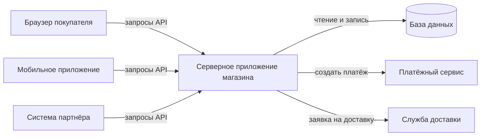

# А.1 Как устроено приложение: клиент, сервер, база данных

## Зачем это аналитику

Любое требование живёт в конкретной части системы: на экране, в серверной логике, в базе данных или в интеграции. Пока эти части сливаются в одно «приложение», требования получаются размытыми, а оценки разработки кажутся необъяснимыми. Карта компонентов — первое, что нужно системному аналитику.

## Готовность к модулю

Модуль вводный: специальной подготовки не нужно.

## Куда ведёт

Тема подробнее раскрывается в модулях:

- [Б.6 Архитектура приложения](../00b-bridge/b6-app-architecture.md)
- [3.1 Зачем микросервисы](../03-microservices-ddd/3.1-why-microservices.md)

## Что понять

- [ ] Клиент и сервер: кто инициирует запрос, кто хранит состояние. Браузер, мобильное приложение и другая система как клиенты.
- [ ] Фронтенд и бэкенд: что делает каждая часть, где проверяются данные и почему проверки на экране недостаточно.
- [ ] База данных как отдельный компонент: почему данные хранят не в памяти приложения.
- [ ] API как договор между частями системы и между системами.
- [ ] Трёхзвенная архитектура: представление, логика, данные. Монолит как одно приложение со всеми частями внутри.
- [ ] Сервер как машина и сервер как программа; виртуальные машины, контейнеры и облако — на уровне понятий.
- [ ] Окружения: разработка, тест, препрод, продуктив. Почему «у меня работает» не значит «работает в проде».
- [ ] Что такое конфигурация, логи и почему в них ищут причину ошибки.

## Урок

<!-- LESSON:START -->
Пользователь видит приложение как один экран: кнопки, поля, список товаров. Разработчик видит несколько отдельных программ, которые работают на разных машинах, говорят друг с другом по сети и хранят данные в разных местах. Урок даёт карту этих частей. С ней любое требование можно «положить» в конкретный компонент и понять, кого оно затронет.

Сквозной пример — обезличенный интернет-магазин: покупатели, каталог товаров, корзина, заказы, оплата, склад, доставка.

### Клиент и сервер

Клиент — тот, кто начинает разговор: отправляет запрос и ждёт ответа. Сервер — тот, кто ждёт запросов, обрабатывает их и отвечает. Аналогия — окно выдачи в столовой: посетитель подходит и просит, повар за окном не бегает по залу, а отвечает на заказы.

Важно, что это роли, а не типы устройств. Клиентом бывает:

- браузер, в котором покупатель открыл сайт магазина;
- мобильное приложение магазина на телефоне;
- другая система: например, служба доставки, которая запрашивает у магазина список заказов к отгрузке.

Сервер тоже может быть клиентом. Когда покупатель нажимает «Оплатить», сервер магазина получает запрос от браузера (здесь он сервер), а затем сам обращается к платёжному сервису (здесь он клиент). В реальной системе такие цепочки из трёх-пяти звеньев — норма.

Второй вопрос — кто хранит состояние. Состояние (state) — всё, что система «помнит»: содержимое корзины, статус заказа, остаток товара. Главное правило: источник истины хранится на сервере. Клиент может держать копию для удобства (например, показывать корзину без лишнего запроса), но эта копия может устареть, её можно стереть очисткой браузера, а мобильное приложение можно удалить. Если заказ существует только в телефоне покупателя, для магазина его не существует.

Отсюда практический вывод для требований: фраза «система запоминает выбор пользователя» должна уточнять, где именно. В браузере на одном устройстве и в серверном профиле, доступном с любого устройства, — это разные требования с разной стоимостью.

### Фронтенд и бэкенд

Фронтенд (frontend) — часть, которая работает у пользователя: страницы в браузере или экраны мобильного приложения. Она показывает данные, принимает ввод, отправляет запросы серверу и отображает ответы.

Бэкенд (backend) — часть на сервере. Она выполняет бизнес-логику: считает скидку, проверяет остаток, создаёт заказ, резервирует товар на складе, вызывает платёжный сервис. Бэкенд же работает с базой данных.

Где проверять данные? И там, и там, но по разным причинам.

Проверка на фронтенде нужна для удобства: подсветить незаполненное поле, не дать ввести буквы в телефон, сразу показать ошибку, не дожидаясь сервера. Но она ничего не гарантирует. Фронтенд работает на чужом устройстве, и пользователь контролирует его полностью. Запрос к серверу можно отправить в обход экрана — специальной программой или через инструменты разработчика в браузере. Кроме того, у бэкенда почти всегда несколько клиентов: сайт, мобильное приложение, партнёрская система. Если правило «нельзя заказать больше 10 штук акционного товара» реализовано только на сайте, мобильное приложение и партнёр его не соблюдают.

Поэтому правило простое: всё, что влияет на деньги, права доступа и целостность данных, проверяет бэкенд. Проверки на экране — дополнительный слой для удобства, а не защита.

В постановке это удобно разделять явно: «валидация на форме» (что подсвечиваем и какой текст показываем) и «серверная валидация» (что отклоняем и какую ошибку возвращаем).

### База данных как отдельный компонент

Программа во время работы держит данные в оперативной памяти. Память быстрая, но у неё два свойства, которые делают её непригодной для хранения заказов.

Первое — она не переживает перезапуск. Сервер перезагрузили, приложение обновили, процесс упал — всё, что было только в памяти, пропало.

Второе — она принадлежит одному процессу. Если приложение запущено в трёх экземплярах (а под нагрузкой так и делают), у каждого своя память. Заказ, созданный в первом экземпляре, второй не увидит.

База данных (СУБД, система управления базами данных) решает обе проблемы. Это отдельная программа, обычно на отдельной машине, которая:

- надёжно записывает данные на диск и не теряет подтверждённые изменения;
- даёт единую точку правды для всех экземпляров приложения;
- следит за целостностью: не даст создать позицию заказа на несуществующий товар, если это правило описано;
- умеет обрабатывать одновременные изменения: два покупателя покупают последнюю единицу товара, и продать её надо только одному.

Устройство реляционных баз и язык SQL разбираются в модулях А.4 и А.5. Здесь важно понять, что база — самостоятельный компонент со своим владельцем, своей нагрузкой и своими отказами.

### API как договор

API (application programming interface, программный интерфейс) — описание того, как одна программа может пользоваться другой: какие запросы принимаются, какие данные в них должны быть, что вернётся в ответ и какие бывают ошибки. Аналогия — меню и правила ресторана: вы не заходите на кухню, а заказываете блюда из списка, и кухня обязуется их приготовить.

API работает на двух уровнях:

- между частями одной системы: фронтенд магазина вызывает API бэкенда «получить каталог», «добавить в корзину», «оформить заказ»;
- между системами: магазин вызывает API платёжного сервиса и службы доставки, а партнёрский маркетплейс вызывает API магазина.

Почему бы не дать фронтенду или партнёру прямой доступ к базе? Причин несколько.

- **Бизнес-правила.** Создать заказ — это не просто вставить строку в таблицу. Нужно проверить остаток, зарезервировать товар, посчитать скидку, записать историю. Если писать в базу напрямую, каждый клиент должен повторить эту логику, и рано или поздно кто-то сделает это неправильно.
- **Безопасность.** Через API можно выдать ровно те операции и данные, которые нужны. Доступ к базе обычно означает доступ ко всему, включая чужие заказы и персональные данные.
- **Свобода изменений.** API — договор, а устройство базы — внутреннее дело команды. Команда может переименовать таблицу или разбить её на две, сохранив API прежним. Если партнёр читает таблицы напрямую, любое изменение ломает его интеграцию.
- **Контроль нагрузки.** Тяжёлый запрос партнёра к базе может замедлить весь магазин. На уровне API нагрузку можно ограничить.

Слово «договор» здесь ключевое. Если API изменили без предупреждения, клиенты ломаются так же, как ломаются отношения при нарушении договора. Поэтому описание API — один из главных артефактов системного аналитика. Как именно API описывают, разбирается в модулях А.6 и Б.3.

### Трёхзвенная архитектура и монолит

Классическая схема веб-приложения делит его на три звена (three-tier architecture):

1. **Представление** (presentation) — интерфейс пользователя: браузер, мобильное приложение.
2. **Логика** (application, business logic) — серверное приложение с бизнес-правилами.
3. **Данные** (data) — база данных.



Каждое звено общается только с соседним: интерфейс не лезет в базу, база не знает про экраны. Это даёт возможность менять звенья независимо: переделать дизайн сайта, не трогая логику, или добавить мобильное приложение, использующее тот же API.

Монолит (monolith) — вариант, в котором всё серверное звено — одно приложение. Каталог, корзина, заказы, оплата и склад живут в одной программе, собираются и выкатываются вместе и обычно работают с одной базой. Это не ругательство. Для небольшой команды монолит проще в разработке, тестировании и эксплуатации. Альтернатива — разбить серверную логику на несколько независимых приложений (сервисов), каждое со своей зоной ответственности. У такого подхода свои плюсы и серьёзная цена; когда он оправдан, разбирается в модулях Б.6 и 3.1.

### Сервер как машина и сервер как программа

Слово «сервер» означает две разные вещи, и в разговоре их постоянно путают.

- **Сервер как машина** — физический или виртуальный компьютер в дата-центре: процессор, память, диск, сетевой адрес.
- **Сервер как программа** — процесс, который слушает сетевые запросы и отвечает на них: серверное приложение магазина, веб-сервер, СУБД.

На одной машине может работать несколько серверных программ, а одна программа может быть запущена на нескольких машинах. Когда разработчик говорит «сервер упал», стоит уточнить: выключилась машина или остановилось приложение.

Дальше три понятия, которые встречаются в любом разговоре об инфраструктуре:

- **Виртуальная машина** (virtual machine, VM) — «компьютер внутри компьютера». Одну мощную физическую машину делят на несколько изолированных виртуальных, у каждой своя операционная система. Аналогия — квартиры в многоквартирном доме.
- **Контейнер** (container) — более лёгкая упаковка: приложение вместе со всеми нужными ему библиотеками и настройками по умолчанию, запускаемое изолированно, но без собственной операционной системы: все контейнеры на машине пользуются общим ядром её ОС (ядро — базовая часть операционной системы, которая распределяет процессор, память и диск). Аналогия — стандартный морской контейнер: неважно, что внутри, его одинаково грузят на любой корабль. Главная польза — приложение ведёт себя одинаково на ноутбуке разработчика, на тестовом стенде и в продуктиве. Самый известный инструмент — Docker.
- **Облако** (cloud) — аренда вычислительных ресурсов у провайдера вместо покупки своего оборудования. Можно арендовать виртуальные машины, а можно готовые сервисы: базу данных, очередь сообщений, хранилище файлов. Провайдер отвечает за железо и часть обслуживания, компания платит за потребление.

Аналитику не нужно уметь всё это настраивать. Нужно понимать, что у каждого компонента на схеме есть «где он живёт», и что от этого зависят доступность, масштабирование и стоимость.

### Окружения

Окружение (environment) — полный комплект системы: приложения, базы, настройки, подключения к внешним системам. Изменение проходит через несколько окружений, прежде чем дойти до пользователей.

| Окружение | Для чего | Данные | Кто пользуется |
|---|---|---|---|
| Разработка (dev) | Разработчик проверяет свой код | Искусственные, часто минимальные | Разработчики |
| Тест (test, QA) | Тестировщики проверяют функции | Тестовые наборы | Тестировщики, аналитики |
| Препрод (preprod, stage) | Финальная проверка перед выкаткой в условиях, близких к боевым | Близкие к реальным, часто обезличенная копия | Тестировщики, иногда заказчик |
| Продуктив (prod) | Реальная работа | Реальные данные клиентов | Пользователи |

Названия и число окружений в разных компаниях отличаются, но идея одна: ошибку дешевле найти как можно раньше, и уж точно не в продуктиве.

Почему «у меня работает» не значит «работает в проде»? Окружения различаются сильнее, чем кажется:

- **Данные.** В тесте сто товаров, в продуктиве миллион. Запрос, который в тесте выполнялся мгновенно, в продуктиве идёт минуту. В тестовых данных нет адреса с апострофом или фамилии из двух слов, а в реальных есть.
- **Настройки.** Разные адреса внешних систем, разные лимиты, включённые и выключенные функции.
- **Внешние системы.** В тесте вместо платёжного сервиса часто стоит заглушка (mock), которая всегда отвечает «успешно». Настоящий сервис бывает медленным, отвечает ошибками и требует сертификатов.
- **Нагрузка.** Один тестировщик и десять тысяч покупателей в распродажу — разные условия.
- **Версии.** В тесте могла остаться версия соседнего компонента, которой в продуктиве уже нет, или наоборот.

Для аналитика из этого следуют вопросы, которые стоит задавать при приёмке: на каких данных проверяли, была ли настоящая интеграция или заглушка, что отличается в настройках продуктива.

### Конфигурация и логи

Конфигурация (configuration) — параметры, которые меняют поведение приложения без изменения кода: адрес базы данных, адрес платёжного сервиса, таймауты, размер максимальной скидки, флаги включения функций. Их выносят из кода как раз затем, чтобы один и тот же собранный артефакт работал в любом окружении: в тесте он смотрит на тестовую базу, в продуктиве — на боевую. Секретные значения (пароли, ключи доступа) тоже относятся к конфигурации, но хранятся отдельно и защищённо.

Для аналитика конфигурация — способ сделать требование гибким. «Бесплатная доставка от 3000 рублей» с порогом в коде означает новую выкатку при каждом изменении порога. С порогом в настройках — изменение за минуты. Решение, что вынести в настройки, стоит принимать при постановке, а не после первой просьбы бизнеса.

Лог (log, журнал) — записи, которые приложение делает во время работы: что произошло, когда, с каким результатом. Типичная запись содержит время, уровень важности (INFO, WARN, ERROR), компонент, сообщение и идентификаторы, по которым её можно связать с конкретной операцией.

Почему причину ошибки ищут в логах? Потому что пользователь видит только следствие, и намеренно размытое. Сообщение «Что-то пошло не так» скрывает детали, чтобы не показывать посторонним внутреннее устройство системы. Настоящая причина записана на сервере.

### Разбор: «Что-то пошло не так» при оформлении заказа

Покупатель жалуется: нажал «Оформить заказ», увидел «Что-то пошло не так». Как рассуждать.

Сначала определить, какие компоненты участвуют в операции. Браузер отправляет запрос в серверное приложение, приложение проверяет остатки в базе, создаёт заказ и вызывает платёжный сервис. Ошибка может быть в любом звене.

Затем найти запись в логах по времени и по покупателю. Допустим, там такое:

```
2026-03-14 19:02:11.482 ERROR order-service
  Не удалось создать платёж для заказа 58213: превышено время ожидания ответа платёжного сервиса (10 с)
  requestId=7f3a9c
```

Картина проясняется: код магазина отработал, база ответила, заказ создан, а платёжный сервис не ответил за отведённые 10 секунд. Сразу возникают вопросы, которые и есть работа аналитика:

- что стало с заказом — он остался в статусе «ожидает оплаты» или удалён;
- мог ли платёж на самом деле пройти, и деньги списаны, а магазин об этом не знает;
- что должен увидеть покупатель и может ли он повторить оплату, не заплатив дважды;
- настраивается ли таймаут в 10 секунд и кто решает, какое значение правильное.

Если бы в логе ошибки не было вовсе, следующим подозреваемым стал бы фронтенд или сеть между пользователем и сервером. Идентификатор запроса (здесь `requestId`) позволяет пройти по логам всех компонентов одной цепочки. Если его нет, расследование сильно усложняется. Поэтому требование «каждая операция логируется с идентификатором, сквозным для всех компонентов» стоит включать в нефункциональные требования.

Заметьте: ни один из вопросов выше не про код. Все они про поведение системы, которое кто-то должен был описать заранее.

### Что дальше

За рамками урока осталось, как выбирать между монолитом и набором сервисов и как делить систему на модули; это модули Б.6 и 3.1. Как именно клиент и сервер обмениваются запросами, разбирается в следующем модуле А.2, а устройство баз данных — в модулях А.4 и А.5.

### Типичные ошибки

- Описывать проверку данных только на форме и не указывать, что должен сделать сервер, если некорректные данные всё-таки пришли.
- Писать «система хранит» или «система запоминает», не уточняя, где: в браузере, в профиле на сервере, в базе.
- Предлагать партнёру прямой доступ к таблицам как «быстрый способ интеграции» вместо API.
- Считать приёмку в тестовом окружении достаточной и не спрашивать, чем продуктив отличается по данным, настройкам и внешним системам.
- Зашивать в требования конкретные значения (пороги, лимиты, сроки), которые бизнес будет менять, не обсудив вынос в конфигурацию.
- Разбирать инцидент по скриншоту пользователя, не запросив время, идентификатор операции и записи из логов.

### Как говорить об этом на собеседовании

На позиции junior/middle от системного аналитика ждут, что он мыслит компонентами. Хороший ответ на вопрос «как устроено приложение» — нарисовать клиентов, серверное приложение, базу и внешние системы и сразу сказать, что идёт по каждой стрелке. Сильная формулировка: «Любое требование я сначала раскладываю по компонентам: что на экране, что в серверной логике, что хранится в базе и какие интеграции затронуты».

Хорошо работают короткие примеры из практики: правило, которое проверялось только на форме и было обойдено через мобильное приложение; ошибка, которая не воспроизводилась в тесте из-за заглушки платёжного сервиса; инцидент, который разобрали по логам с идентификатором запроса. Вопрос «почему не дать доступ к базе напрямую» — почти обязательный; ответ через бизнес-правила, безопасность и свободу изменений показывает понимание, а не заученное определение.

### Коротко

- Клиент инициирует запрос, сервер отвечает; это роли, и сервер часто сам выступает клиентом другой системы.
- Источник истины — на сервере; копия на клиенте может пропасть или устареть.
- Проверки на экране — для удобства, проверки на бэкенде — для гарантий.
- База данных — отдельный компонент: данные переживают перезапуск и одинаково видны всем экземплярам приложения.
- API — договор: скрывает внутреннее устройство, защищает бизнес-правила и позволяет менять систему, не ломая клиентов.
- Трёхзвенная архитектура — представление, логика, данные; монолит — всё серверное звено в одном приложении.
- Окружения различаются данными, настройками, внешними системами и нагрузкой, поэтому «работает в тесте» не равно «работает в проде».
- Конфигурация делает поведение настраиваемым без выкатки, логи хранят настоящую причину ошибки.
<!-- LESSON:END -->

## Читать дальше

- MDN Web Docs: статья «How the web works» — короткое введение для начинающих.
- Мартин Клеппман, «Высоконагруженные приложения», глава 1 — для тех, кто хочет забежать вперёд.

На system-design.space:

- [Введение в хранение данных](https://system-design.space/chapter/data-storage-intro/)

## Практика

1. Нарисовать схему компонентов знакомой системы (обезличенно): клиенты, серверные приложения, базы данных, внешние системы. Подписать, какие данные идут по каждой стрелке.
2. Взять три требования из своей практики и для каждого указать, в каком компоненте оно реализуется и какие ещё компоненты затронет.
3. Выяснить у разработчиков своего проекта (или найти в документации), какие окружения есть и как изменение доходит до продуктива.

## Вопросы для самопроверки

1. Чем клиент отличается от сервера? Может ли сервер быть клиентом?
2. Почему проверку данных нельзя делать только на экране?
3. Что такое API и зачем он нужен, если можно дать доступ прямо к базе?
4. Из каких частей состоит трёхзвенная архитектура?
5. Зачем нужно несколько окружений и чем тестовый стенд отличается от продуктива?
6. Где искать причину ошибки, если пользователь видит «Что-то пошло не так»?

## Заметки

<!-- Свои формулировки, ошибки, ссылки. -->
