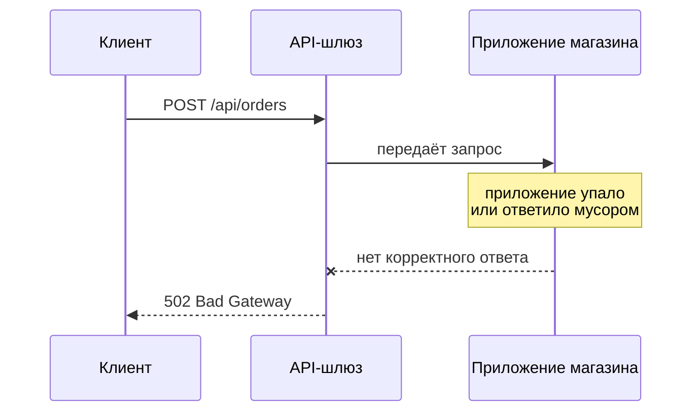

# А.2 Как работает веб: URL, HTTP-запрос и ответ

## Зачем это аналитику

HTTP — язык, на котором общаются почти все современные системы. Коды ответа, методы и заголовки встречаются в каждой спецификации интеграции, в каждом баг-репорте и в каждом разговоре о том, «почему не работает». Аналитик, который умеет открыть инструменты разработчика в браузере и прочитать запрос, разбирается в проблеме за минуты, а не за дни переписки.

## Готовность к модулю

Модуль вводный: специальной подготовки не нужно.

## Куда ведёт

Тема подробнее раскрывается в модулях:

- [А.3 Данные и форматы](a3-data-formats.md)
- [А.6 API и интеграции](a6-integrations-intro.md)
- [Б.1 Сеть для интеграций](../00b-bridge/b1-networking.md)
- [Б.2 Основы безопасности](../00b-bridge/b2-security-basics.md)
- [1.1 Путь HTTP-запроса](../01-http-rest-security/1.1-request-lifecycle.md)
- [1.3 REST-семантика](../01-http-rest-security/1.3-rest-semantics.md)

## Что понять

- [ ] Из чего состоит URL: схема, хост, порт, путь, параметры запроса, фрагмент.
- [ ] DNS на пальцах: как имя сайта превращается в адрес сервера.
- [ ] HTTP-запрос: метод, путь, заголовки, тело. HTTP-ответ: код статуса, заголовки, тело.
- [ ] Методы GET, POST, PUT, PATCH, DELETE: назначение и типичное использование.
- [ ] Классы кодов ответа 1xx–5xx и самые частые коды: 200, 201, 204, 301/302, 400, 401, 403, 404, 409, 422, 429, 500, 502, 503, 504.
- [ ] Важные заголовки: Content-Type, Accept, Authorization, Cache-Control, cookies.
- [ ] HTTPS: что шифруется и зачем нужен замок в адресной строке — без деталей криптографии.
- [ ] Инструменты: вкладка Network в браузере, Postman или аналог, curl.

## Урок

<!-- LESSON:START -->
В модуле А.1 клиент «отправлял запрос», а сервер «отвечал». Этот урок раскрывает, как это выглядит на самом деле: как клиент находит сервер, что именно он отправляет и как понять ответ. Почти всё сводится к одному протоколу — HTTP (HyperText Transfer Protocol). Протокол — это набор правил разговора, как правила оформления делового письма: где адрес, где тема, где текст.

Сквозной пример — интернет-магазин по адресу `shop.example`: каталог, корзина, заказы, оплата.

### Из чего состоит URL

URL (Uniform Resource Locator) — полный адрес ресурса. Разберём на примере:

```
https://shop.example:443/catalog/phones?brand=acme&sort=price#reviews
```

| Часть | В примере | Что означает |
|---|---|---|
| Схема (scheme) | `https` | Каким протоколом обращаться: `http` или защищённый `https` |
| Хост (host) | `shop.example` | Имя сервера, к которому идёт запрос |
| Порт (port) | `443` | Номер «двери» на сервере; обычно не пишут, потому что для `https` по умолчанию 443, для `http` — 80 |
| Путь (path) | `/catalog/phones` | Какой ресурс на сервере нужен |
| Параметры запроса (query) | `brand=acme&sort=price` | Дополнительные условия: пары «имя=значение» через `&`, после знака `?` |
| Фрагмент (fragment) | `reviews` | Место внутри страницы, после `#`; браузер обрабатывает его сам и серверу не отправляет |

Две детали, которые встречаются в постановках. Первая: в URL допустимы не все символы. Пробелы, кириллица и служебные знаки кодируются через процент: пробел превращается в `%20`, а слово «чехол» — в длинную цепочку вида `%D1%87...`. Если в логах видны такие последовательности, это нормальная форма записи, а не мусор. Вторая: параметры запроса видны в адресной строке, истории браузера и логах серверов. Поэтому пароли, номера карт и персональные данные в параметры не кладут.

### DNS: как имя превращается в адрес

Компьютеры в сети находят друг друга не по именам, а по IP-адресам — числам вроде `203.0.113.25`. Имя `shop.example` удобно людям. Перевод имени в адрес делает DNS (Domain Name System) — распределённый справочник, похожий на телефонную книгу.

На пальцах процесс выглядит так. Браузер спрашивает у DNS-резолвера (обычно это сервер провайдера или компании): «какой адрес у shop.example?». Если резолвер недавно уже отвечал на такой вопрос, он берёт ответ из своего кэша (кэш — временное хранилище уже полученных ответов, чтобы не спрашивать заново). Если нет, он по цепочке узнаёт, какой сервер отвечает за зону `.example`, через него — какой сервер отвечает за имя `shop.example`, и уже у того — адрес. Ответ возвращается браузеру, и только тогда браузер устанавливает соединение с сервером.

Каждый ответ DNS хранится в кэшах ограниченное время — TTL (time to live). Отсюда практическое следствие: когда система переезжает на новый адрес, часть клиентов какое-то время продолжает ходить на старый. Если после переезда «у одних работает, у других нет», одна из первых версий — DNS. Подробнее механизм разбирается в модулях Б.1 и 1.1.

### Запрос и ответ

Когда соединение установлено, клиент отправляет HTTP-запрос. В классической версии протокола это просто текст. Так выглядит запрос на создание заказа:

```http
POST /api/orders HTTP/1.1
Host: shop.example
Content-Type: application/json
Accept: application/json
Authorization: Bearer eyJhbGciOi...

{"customerId": 1042, "items": [{"productId": 77, "quantity": 2}]}
```

Запрос состоит из четырёх частей:

- **метод** (`POST`) — что сделать;
- **путь** (`/api/orders`) — с каким ресурсом, вместе с параметрами запроса, если они есть;
- **заголовки** (headers) — служебные сведения в формате «Имя: значение»: кто я, в каком формате данные, что я умею принимать;
- **тело** (body) — сами данные; отделяется от заголовков пустой строкой и есть не у всех запросов.

Ответ устроен похоже:

```http
HTTP/1.1 201 Created
Content-Type: application/json
Location: /api/orders/58213

{"id": 58213, "status": "NEW", "total": "3980.00"}
```

Здесь **код статуса** (`201`) с коротким пояснением, **заголовки** и **тело**. Код — самое важное: он одним числом говорит, чем закончился запрос, и клиент в первую очередь смотрит именно на него.

Современные версии протокола (HTTP/2 и HTTP/3) передают те же данные в двоичном виде и эффективнее используют соединение. Но смысловые части — метод, путь, заголовки, тело, код — остаются теми же, поэтому для аналитика разница почти незаметна.

### Методы

Метод говорит серверу, какое действие выполнить над ресурсом.

| Метод | Назначение | Пример в магазине | Тело запроса |
|---|---|---|---|
| GET | Получить данные, ничего не меняя | `GET /api/products?category=phones` — список товаров | Нет |
| POST | Создать новый ресурс или запустить действие | `POST /api/orders` — оформить заказ | Есть |
| PUT | Заменить ресурс целиком | `PUT /api/customers/1042/address` — записать адрес полностью | Есть |
| PATCH | Изменить часть ресурса | `PATCH /api/orders/58213` с телом `{"comment": "Позвонить за час"}` | Есть |
| DELETE | Удалить ресурс | `DELETE /api/cart/items/77` — убрать товар из корзины | Обычно нет |

Главное различие GET и POST — не в том, где лежат данные, а в смысле. GET только читает. Его можно безопасно повторить, результат можно закэшировать, ссылку можно сохранить в закладки. POST что-то меняет. Если повторить его, может появиться второй заказ.

PUT и PATCH оба меняют существующий ресурс, но по-разному. PUT передаёт ресурс целиком: если в новом адресе не указать квартиру, после PUT её не станет. PATCH передаёт только изменяемые поля, остальное сервер не трогает. Для аналитика это вопрос, который стоит задать при описании любого метода изменения: что происходит с полями, которые клиент не прислал.

Есть и важное свойство, к которому программа ещё вернётся: повторный PUT или DELETE с теми же данными приводит к тому же результату, что и первый, а повторный POST — нет. Это свойство называют идемпотентностью (idempotency); подробно — в модулях 1.3 и Б.3.

На практике не все системы следуют этим соглашениям. Встречаются API, где всё делается через POST. Это не ошибка протокола, а стиль конкретной системы, и его надо явно описать в спецификации.

### Коды ответа

Коды разбиты на пять классов по первой цифре:

- **1xx** — промежуточные, информационные; аналитик встречает их редко;
- **2xx** — успех;
- **3xx** — перенаправление: ресурс в другом месте;
- **4xx** — ошибка клиента: запрос неправильный, и повторять его в том же виде, как правило, бессмысленно (исключение — 429: тот же запрос можно повторить позже);
- **5xx** — ошибка сервера: запрос, возможно, правильный, но сервер не смог его выполнить.

Деление на 4xx и 5xx — первое, что определяет, на чьей стороне искать причину.

| Код | Название | Когда встречается |
|---|---|---|
| 200 | OK | Запрос выполнен, данные в теле |
| 201 | Created | Создан новый ресурс, например заказ |
| 204 | No Content | Выполнено, но возвращать нечего, например после удаления |
| 301 | Moved Permanently | Ресурс переехал навсегда, клиенту стоит запомнить новый адрес |
| 302 | Found | Временное перенаправление, например на страницу входа |
| 400 | Bad Request | Запрос не удалось разобрать: сломанный JSON, неверный тип поля |
| 401 | Unauthorized | Не удалось установить, кто вы: нет токена, он просрочен или неверный |
| 403 | Forbidden | Кто вы — известно, но на это действие прав нет |
| 404 | Not Found | Ресурса нет: неверный путь или заказ с таким номером не существует |
| 409 | Conflict | Запрос противоречит текущему состоянию: заказ уже оплачен, повторная оплата невозможна |
| 422 | Unprocessable Content | Запрос разобран, но данные нарушают правила: количество меньше единицы |
| 429 | Too Many Requests | Клиент превысил допустимую частоту запросов |
| 500 | Internal Server Error | Непредвиденная ошибка в коде сервера |
| 502 | Bad Gateway | Промежуточный сервер получил некорректный ответ или не получил ответа от следующего |
| 503 | Service Unavailable | Сервер временно не может обслуживать: перегрузка, обслуживание |
| 504 | Gateway Timeout | Промежуточный сервер не дождался ответа от следующего |

Пара 401 и 403 — любимый вопрос на собеседованиях. Аналогия с офисом: 401 — охранник на входе не видит вашего пропуска, 403 — пропуск есть, но в серверную вам нельзя. Название кода 401 исторически неудачное: по смыслу это «не аутентифицирован» (не удалось установить, кто вы), а не «не авторизован» (не хватает прав). Практическое различие: при 401 помогает войти заново или обновить токен, при 403 — только выдача прав.

Граница между 400 и 422 в разных системах проводится по-разному: одни возвращают 400 на любую ошибку данных, другие разделяют «не смог прочитать» и «прочитал, но не пропущу по правилам». Важно, чтобы выбор был описан в спецификации и одинаков во всём API.

### Коды 502, 503, 504: кто кому не ответил

Между клиентом и приложением почти всегда стоят промежуточные серверы: балансировщик нагрузки, API-шлюз, обратный прокси (reverse proxy). Они принимают запрос и передают его дальше. Коды 502 и 504 выдаёт именно такой посредник, а не само приложение.



Если интеграция вернула 502, это значит: ваш запрос дошёл до посредника, а за ним что-то сломано. Проверять стоит, работает ли приложение за шлюзом, не перезапускается ли оно, правильно ли шлюз настроен на него. При 504 посредник дождался таймаута: приложение живо, но отвечает слишком долго, например ждёт медленную базу или внешний сервис. При 503 сервис сам сообщает, что временно недоступен, и иногда в заголовке `Retry-After` указывает, когда попробовать снова.

Во всех трёх случаях проблема на стороне сервера, и исправить её, меняя запрос, нельзя. Но повторить запрос позже часто имеет смысл — с оговоркой: если это был POST, надо понимать, не выполнилась ли операция в первый раз.

### Важные заголовки

**Content-Type** — в каком формате тело сообщения. `application/json` — JSON, `text/html` — веб-страница, `multipart/form-data` — форма с файлами. Без этого заголовка получатель не знает, как читать тело, и может вернуть 400 или 415 (Unsupported Media Type). К значению добавляют кодировку: `application/json; charset=utf-8`. Форматы данных подробно разбираются в модуле А.3.

**Accept** — в каком формате клиент хочет получить ответ. Content-Type описывает то, что отправляю, Accept — то, что готов принять.

**Authorization** — чем клиент подтверждает, кто он. Чаще всего это токен — строка-пропуск, которую клиент получил при входе и предъявляет с каждым запросом: `Authorization: Bearer <токен>`. Встречается и `Basic` — логин и пароль, закодированные, но не зашифрованные. Сам заголовок содержит секрет, поэтому его нельзя пересылать в переписке и оставлять в логах. Как выдают и проверяют токены — модули Б.2 и 1.4.

**Cache-Control** — можно ли и как долго хранить ответ в кэше. `no-store` — не сохранять вообще (личный кабинет, платёжные данные), `max-age=3600` — можно хранить час (список категорий каталога). Когда пользователь видит устаревшую цену, одна из версий — ответ закэширован дольше, чем следовало.

**Cookies** — небольшие записи, которые сервер просит браузер сохранить (заголовок ответа `Set-Cookie`) и которые браузер затем автоматически прикладывает к каждому запросу к этому сайту (заголовок `Cookie`). Так сайт «помнит» вошедшего пользователя: в cookie лежит идентификатор сессии, а сами данные хранятся на сервере. Системы, которые общаются между собой, cookies обычно не используют и передают токен в Authorization.

### HTTPS

HTTPS — тот же HTTP, но внутри защищённого канала TLS. Он даёт две вещи.

- **Шифрование.** Посторонний, через чьё оборудование идут данные (публичный Wi-Fi, провайдер), не может прочитать и незаметно изменить содержимое: путь, параметры, заголовки с токенами, тело с персональными данными. Видно, как правило, только к какому серверу идёт соединение и сколько данных передаётся.
- **Подлинность сервера.** Сервер предъявляет сертификат, подписанный доверенным центром сертификации. Браузер проверяет, что сертификат выдан именно на `shop.example`. Замок в адресной строке означает: соединение зашифровано и вы говорите с владельцем этого имени.

Чего замок не означает: что сайт честный. Мошеннический сайт с похожим именем тоже может получить сертификат на своё имя. HTTPS защищает канал, а не гарантирует добросовестность собеседника.

Для интеграций HTTPS сегодня — обязательный минимум, а частая причина сбоев — истёкший или неверно установленный сертификат. Механизм TLS разбирается в модулях Б.2 и 1.2.

### Инструменты

**Вкладка Network в браузере.** Открывается через инструменты разработчика (обычно клавиша F12). Показывает каждый запрос, который делает страница: метод, URL, код, время, заголовки и тело запроса и ответа. Полезный приём — фильтр Fetch/XHR: он оставляет только обращения к API и убирает картинки и стили. Когда пользователь жалуется на ошибку, запрос с красным кодом в Network часто сразу показывает, чья она.

**Postman и аналоги.** Программы с интерфейсом, где запрос собирается из полей: метод, адрес, заголовки, тело. Запросы можно сохранять в коллекции, переключать окружения (тест, препрод) через переменные. Это основной инструмент аналитика, чтобы проверить API до того, как готов экран.

**curl.** Консольная программа, которая отправляет HTTP-запросы из командной строки. Разработчики обмениваются запросами именно в виде curl-команд, и Postman умеет их импортировать и экспортировать.

```bash
# Получить список товаров и показать заголовки ответа
curl -i "https://shop.example/api/products?category=phones"

# Создать заказ
curl -X POST "https://shop.example/api/orders" \
  -H "Content-Type: application/json" \
  -H "Authorization: Bearer <токен>" \
  -d '{"customerId": 1042, "items": [{"productId": 77, "quantity": 2}]}'
```

Флаг `-i` добавляет в вывод код и заголовки ответа, `-X` задаёт метод, `-H` — заголовок, `-d` — тело запроса.

### Разбор: оплата не проходит

Поддержка сообщает: часть покупателей не может оплатить заказ, на экране «Ошибка оплаты». Аналитик открывает сайт в тестовом окружении, воспроизводит оформление и смотрит Network.

Запрос `POST /api/orders/58213/payment` вернул 502. Выводы по шагам:

1. Код класса 5xx — проблема не в данных покупателя, менять форму бесполезно.
2. Именно 502 — ответ сформировал посредник. Запрос дошёл до шлюза магазина, но тот не получил нормального ответа от сервиса, который обрабатывает оплату.
3. Вопрос разработчикам: в каком состоянии сервис оплаты, что в его логах в это время, не выкатывали ли его недавно.
4. Вопрос к требованиям: что видит покупатель в такой ситуации, можно ли безопасно нажать «Оплатить» повторно и не спишутся ли деньги дважды.

Для сравнения: при 401 стоило бы проверять, не истекает ли сессия покупателя, при 422 — читать в теле ответа, какое правило нарушено. Один код сужает поиск в разы.

### Что дальше

За рамками урока осталось, как выглядит путь запроса по сети и из чего складывается его время (модули Б.1 и 1.1), как устроены аутентификация и шифрование (Б.2, 1.2, 1.4) и как проектировать API по правилам REST (1.3). Форматы тела — JSON, XML, CSV — разбираются в следующем модуле А.3, а описание API как контракта — в А.6 и Б.3.

### Типичные ошибки

- Путать 401 и 403 в спецификации и не описывать, что должен сделать клиент в каждом случае.
- Возвращать 200 с текстом ошибки в теле. Клиенты, мониторинг и шлюзы смотрят на код и считают такой ответ успешным.
- Класть персональные данные или секреты в параметры URL, откуда они попадают в логи и историю браузера.
- Искать причину 502 или 504 в данных запроса, хотя это сигнал о проблеме за посредником.
- Не уточнять, чем отличается PUT от PATCH в конкретном методе, и получить затёртые поля.
- Пересылать в чат или тикет скриншот запроса с заголовком Authorization и живым токеном.
- Описывать ошибку словами «не работает» вместо метода, URL, кода ответа и времени.

### Как говорить об этом на собеседовании

На junior/middle спрашивают по базе: части URL, разница GET и POST, PUT и PATCH, 401 и 403, классы кодов. Отвечать стоит через смысл, а не через определения: «GET только читает и безопасен для повтора, POST меняет состояние, поэтому его повтор может создать дубль». Такой ответ сразу показывает, что вы понимаете последствия для требований.

Сильно выглядит рассказ о разборе проблемы: открыл Network, увидел код 502 на запросе оплаты, понял, что проблема за шлюзом, пришёл к разработчикам с конкретным запросом, временем и кодом. Упоминание, что вы проверяете API в Postman до готовности экрана и описываете в спецификации коды ответа с их смыслом для клиента, показывает, что вы работаете с интеграциями, а не только с экранами.

### Коротко

- URL состоит из схемы, хоста, порта, пути, параметров и фрагмента; фрагмент на сервер не уходит.
- DNS переводит имя в IP-адрес, а ответы кэшируются на время TTL.
- Запрос — метод, путь, заголовки, тело; ответ — код, заголовки, тело.
- GET читает, POST создаёт, PUT заменяет целиком, PATCH меняет часть, DELETE удаляет.
- 4xx — ошибка клиента, 5xx — ошибка сервера; 502 и 504 выдаёт посредник, когда за ним что-то не отвечает.
- 401 — не знаем, кто вы; 403 — знаем, но нельзя.
- Content-Type описывает формат тела, Authorization несёт секрет, Cache-Control управляет кэшем, cookies хранят сессию в браузере.
- HTTPS шифрует содержимое и подтверждает подлинность сервера, но не честность сайта.
<!-- LESSON:END -->

## Читать дальше

- MDN Web Docs: «An overview of HTTP», «HTTP request methods», «HTTP response status codes».
- Документация Postman: раздел «Sending your first request».

На system-design.space:

- [Протокол HTTP](https://system-design.space/chapter/http-protocol/)
- [Визуализация: Динамика HTTP-запроса](https://system-design.space/visuals/http-request-dynamics/)
- [Система доменных имён (DNS)](https://system-design.space/chapter/dns/)

## Практика

1. Открыть в браузере любой интернет-магазин, включить вкладку Network и найти запрос, который загружает список товаров. Записать метод, URL, код ответа, Content-Type и структуру тела.
2. Отправить в Postman (или curl) запросы к публичному тестовому API (например, httpbin.org): GET с параметрами, POST с JSON-телом, запрос к несуществующему пути. Сравнить коды и тела ответов.
3. Разобрать три реальных сообщения об ошибке из своей практики (обезличенно): какой код ответа там, скорее всего, был и на чьей стороне искать причину.

## Вопросы для самопроверки

1. Из каких частей состоит URL? Покажите на примере.
2. Чем отличаются методы GET и POST? Когда используют PUT и PATCH?
3. Что означают коды 401 и 403 и чем они отличаются?
4. Интеграция вернула 502. Где искать проблему?
5. Зачем нужен заголовок Content-Type?
6. Что даёт HTTPS по сравнению с HTTP?

## Заметки

<!-- Свои формулировки, ошибки, ссылки. -->
