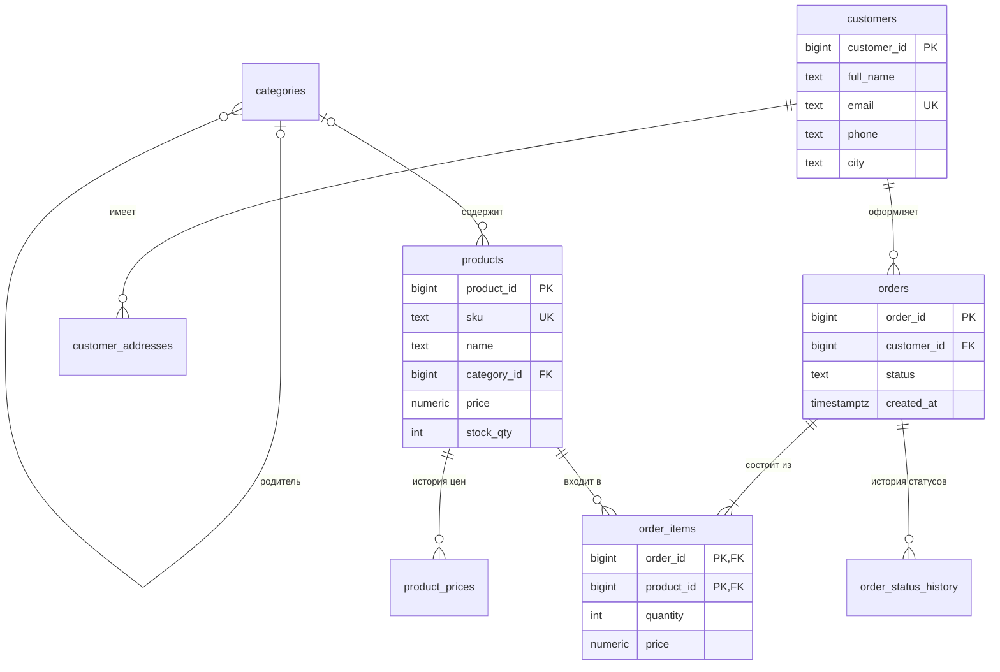

# А.4 Реляционные базы данных: таблицы, ключи, связи, ER-диаграммы

## Зачем это аналитику

Почти каждая функция системы — это чтение и изменение данных в таблицах. Аналитик, который понимает модель данных, видит последствия требований: что будет с историей при изменении справочника, как хранить статусы, почему нельзя «просто удалить» покупателя. ER-диаграмма — основной язык разговора с разработчиками о данных.

## Готовность к модулю

Модуль опирается на темы ниже. Если какая-то из них незнакома или её вопросы для самопроверки даются с трудом, начните с неё.

- [А.3 Данные и форматы](a3-data-formats.md)

## Куда ведёт

Тема подробнее раскрывается в модулях:

- [А.5 SQL для аналитика](a5-sql-basics.md)
- [2.1 MVCC и хранение](../02-postgresql/2.1-mvcc-storage.md)
- [9.2 Моделирование DWH](../09-data-platforms/9.2-dwh-modeling.md)

## Что понять

- [ ] Таблица, строка, столбец, тип столбца. Сущность и атрибут в терминах аналитики.
- [ ] Первичный ключ: зачем он нужен, естественный и суррогатный ключ.
- [ ] Внешний ключ и связи: один к одному, один ко многим, многие ко многим через связующую таблицу.
- [ ] Ограничения: NOT NULL, UNIQUE, CHECK, внешний ключ. Что будет при удалении связанной записи.
- [ ] Нормализация на практике: зачем устранять дублирование и когда его допускают сознательно.
- [ ] Справочники и история: как хранить изменения цен и статусов во времени.
- [ ] ER-диаграмма: нотации (вороньи лапки), как читать и рисовать.
- [ ] Транзакция на уровне идеи: несколько изменений, которые проходят вместе или не проходят вовсе.

## Урок

<!-- LESSON:START -->
Реляционная база данных (relational database) хранит данные в таблицах и следит, чтобы таблицы не противоречили друг другу. Весь урок построен на модели данных небольшого интернет-магазина; та же модель используется в модуле А.5.

### Таблица, строка, столбец

Таблица (table) похожа на лист Excel с жёсткими правилами. У неё есть имя (`customers` — покупатели), набор столбцов (columns) и строки (rows).

- **Столбец** описывает одно свойство: имя, email, город. У каждого столбца есть **тип** (data type), и база не даст записать в него значение другого типа. В столбец с датой нельзя положить слово «вчера», в числовой — «пять».
- **Строка** — один конкретный объект: один покупатель, один заказ. Порядок строк не гарантирован, пока его явно не попросили.

Для аналитика это знакомые понятия: **сущность** (entity) обычно становится таблицей, **атрибут** (attribute) — столбцом, **экземпляр** — строкой. Сущность «Покупатель» с атрибутами «ФИО», «email», «город» — это таблица `customers` со столбцами `full_name`, `email`, `city`.

Самые ходовые типы в PostgreSQL:

| Тип | Что хранит | Пример в магазине |
|---|---|---|
| `integer`, `bigint` | целые числа | количество, идентификатор |
| `numeric(10,2)` | точные дробные числа | цена, сумма |
| `text` | строка любой длины | имя, email, артикул |
| `boolean` | да/нет | адрес по умолчанию |
| `timestamptz` | момент времени с учётом часового пояса | время создания заказа |

Деньги хранят в `numeric`, а не в «плавающих» типах (`real`, `double precision`): те хранят числа приближённо, и копейки начинают теряться при сложении.

Тип — это уже требование: для «суммы заказа» разработчик спросит, сколько знаков после запятой, бывает ли она отрицательной и в какой валюте.

### Первичный ключ

Первичный ключ (primary key, PK) — столбец или набор столбцов, значение которого однозначно определяет строку. Два покупателя могут быть полными тёзками из одного города, но у них разные `customer_id`. База гарантирует, что значение ключа уникально и не пустое.

Ключ нужен, чтобы на строку можно было сослаться: «Анна Смирнова из Казани» — ненадёжный адрес, `customer_id = 1` — надёжный.

Ключи бывают двух видов.

- **Естественный** (natural key) — атрибут, который существует в предметной области: артикул товара, ИНН компании, номер паспорта, email. Удобен тем, что понятен людям.
- **Суррогатный** (surrogate key) — число или случайный идентификатор, который генерирует сама база и который ничего не значит в бизнесе.

На практике почти всегда берут суррогатный ключ, а естественный объявляют просто уникальным. Причина: естественные ключи меняются. Покупатель меняет email, у человека меняется паспорт. Если email — первичный ключ, его смена потребует обновить все заказы и платежи, которые на него ссылаются. Суррогатный ключ бизнесу трогать незачем.

Ключ может состоять из нескольких столбцов — это составной ключ (composite key). Он появится ниже в таблице позиций заказа.

### Внешний ключ и виды связей

Внешний ключ (foreign key, FK) — столбец, который ссылается на первичный ключ другой таблицы. В таблице заказов есть столбец `customer_id`, и база проверяет: заказ можно сохранить, только если покупатель с таким номером существует. Это называется ссылочной целостностью (referential integrity) — в базе не бывает «висячих» ссылок на несуществующее.

Связи между сущностями бывают трёх видов.

**Один ко многим** (one-to-many). У покупателя много заказов, у заказа один покупатель. Внешний ключ ставится на стороне «многих»: в `orders` есть `customer_id`, а в `customers` никакого списка заказов нет.

**Многие ко многим** (many-to-many). В заказе много товаров, и один товар бывает во многих заказах. Одним внешним ключом это не выразить: в заказ нельзя положить «список товаров» в одну ячейку. Решение — связующая таблица (junction table). У нас это `order_items`, позиции заказа: каждая строка связывает один заказ с одним товаром. Связь «многие ко многим» раскладывается на две связи «один ко многим».

Связующая таблица часто перестаёт быть технической и получает собственные атрибуты. У позиции заказа есть количество и цена — это факты не о заказе и не о товаре, а об их встрече.

```sql
CREATE TABLE order_items (
    order_id     bigint        NOT NULL REFERENCES orders (order_id) ON DELETE CASCADE,
    product_id   bigint        NOT NULL REFERENCES products (product_id) ON DELETE RESTRICT,
    quantity     integer       NOT NULL CHECK (quantity > 0),
    price        numeric(10,2) NOT NULL CHECK (price > 0),
    PRIMARY KEY (order_id, product_id)
);
```

Здесь `REFERENCES` объявляет внешний ключ, а `PRIMARY KEY (order_id, product_id)` — составной ключ: один товар попадает в заказ одной строкой, а количество хранится в `quantity`. Это решение, и его стоит проговорить в постановке: если бизнесу нужно два одинаковых товара с разными скидками в одном заказе, ключ придётся делать другим.

**Один к одному** (one-to-one). Каждой строке одной таблицы соответствует не больше одной строки другой. Например, у заказа бывает одно отправление в службу доставки с трек-номером. Реализуется внешним ключом с ограничением уникальности:

```sql
CREATE TABLE shipments (
    shipment_id  bigint GENERATED ALWAYS AS IDENTITY PRIMARY KEY,
    order_id     bigint NOT NULL UNIQUE REFERENCES orders (order_id),
    tracking_no  text   NOT NULL
);
```

`UNIQUE` на `order_id` не даст создать второе отправление для того же заказа. Данные выносят в таблицу «один к одному», когда они есть не у всех строк или появляются позже. Если бизнес скажет «заказ можно отправить двумя посылками», связь станет «один ко многим» — этот вопрос лучше задать заранее.

`GENERATED ALWAYS AS IDENTITY` — способ сказать PostgreSQL «нумеруй сам»: база выдаёт следующее число при каждой вставке.

### ER-диаграмма

ER-диаграмма (entity-relationship diagram) показывает сущности, их атрибуты и связи. Самая распространённая нотация — «вороньи лапки» (crow's foot): на конце линии рисуется значок, который говорит, сколько строк может быть на этой стороне связи.

| Значок на конце линии (запись Mermaid для правого конца) | Читается как |
|---|---|
| две черты `||` | ровно один |
| кружок и черта `o|` | ноль или один |
| черта и лапка `|{` | один или много |
| кружок и лапка `o{` | ноль или много |

На левом конце линии те же значки пишутся зеркально: `|o`, `}|`, `}o`.

Читать связь нужно дважды, с каждой стороны. Линия между `customers` и `orders` с `||` у покупателя и `o{` у заказов означает: у покупателя ноль или много заказов; у заказа ровно один покупатель. Кружок («ноль») на практике означает необязательность: покупатель без заказов допустим, а заказ без покупателя — нет, поэтому `customer_id` в заказах объявлен `NOT NULL`.

Модель магазина, на которой построены этот модуль и модуль А.5:



Несколько деталей, которые стоит прочитать на этой диаграмме:

- `orders ||--|{ order_items` — у заказа хотя бы одна позиция. Внешний ключ этого не проверит: он гарантирует лишь, что позиция ссылается на существующий заказ. Правило «заказ не бывает пустым» обеспечивает приложение, и это надо указать в постановке.
- `categories |o--o{ products` — категория у товара необязательна (кабель пока не разложили по категориям).
- `categories |o--o{ categories` — связь таблицы с самой собой: у категории «Смартфоны» родитель «Электроника», а у корневой «Электроники» родителя нет. Так хранят иерархии.

Диаграмму рисуют на двух уровнях. Концептуальная (conceptual) — для бизнеса: сущности и связи без типов и ключей, «многие ко многим» одной линией. Физическая (physical) — для разработчиков: столбцы, типы, ключи, связующие таблицы.

### Ограничения и удаление связанных записей

Ограничения (constraints) — правила, которые база проверяет при каждой записи, откуда бы она ни пришла: из интерфейса, интеграции или ручного скрипта. Проверку в коде можно обойти, ограничение — нет.

- `NOT NULL` — значение обязательно. Заказ без покупателя не сохранится.
- `UNIQUE` — значение не повторяется. Два товара с одним артикулом не заведутся. Пустые значения (NULL) при этом повторяться могут: двух покупателей без email база допустит.
- `CHECK` — произвольное условие на строку: количество больше нуля, остаток не отрицательный, статус из разрешённого списка.
- `FOREIGN KEY` — ссылка указывает на существующую строку.

Попытка нарушить правило заканчивается ошибкой, и запись не происходит.

Самый важный для аналитика случай — удаление родительской записи. Что будет с заказами, если удалить покупателя, решает правило `ON DELETE` у внешнего ключа.

| Правило | Что происходит | Где уместно в магазине |
|---|---|---|
| `RESTRICT` или `NO ACTION` (по умолчанию) | удаление запрещено, пока есть ссылки | покупатель с заказами, товар в заказах |
| `CASCADE` | дочерние строки удаляются вместе с родителем | адреса покупателя, позиции заказа |
| `SET NULL` | в дочерних строках ссылка обнуляется | категория товара |

В нашей модели попытка удалить покупателя с заказами получит отказ:

```sql
DELETE FROM customers WHERE customer_id = 1;
-- ERROR: update or delete on table "customers" violates foreign key constraint
--        "orders_customer_id_fkey" on table "orders"
```

И это правильно: заказы — учётные документы, их нельзя терять вместе с аккаунтом. Требование «покупатель удалил аккаунт» выполняют иначе:

- **Мягкое удаление** (soft delete): строку помечают столбцом `deleted_at` или статусом, и все экраны и отчёты обязаны эту пометку учитывать.
- **Обезличивание** (anonymization): имя, email и телефон затирают, а строка с ключом остаётся, чтобы заказы не потеряли владельца. Так часто выполняют требования о персональных данных.

`CASCADE` опасен там, где дочерние данные ценны сами по себе: каскад с покупателя на заказы уничтожил бы историю продаж.

### Нормализация: зачем убирать дублирование

Представьте, что заказы ведут одной таблицей, как в Excel: номер заказа, дата, ФИО, email, телефон, товар, цена, количество. Строка — позиция заказа, и данные покупателя повторяются в каждой.

Такая таблица порождает аномалии (anomalies):

- **Обновления.** Покупатель сменил телефон — его надо исправить в сотне строк, и если одну забыть, у человека окажется два телефона.
- **Вставки.** Нельзя завести покупателя, пока он ничего не заказал.
- **Удаления.** Удалили единственный заказ покупателя — пропали и его контакты.

Нормализация (normalization) — разложение данных по таблицам так, чтобы каждый факт хранился в одном месте, а связи шли через ключи. Теория описывает это нормальными формами (normal forms); для практики достаточно трёх ориентиров:

1. В ячейке одно значение, а не список вроде «товары: 1, 5, 7» — список нельзя проверить внешним ключом.
2. Столбец зависит от всего ключа, а не от его части. Название товара не лежит в позициях заказа: оно зависит только от товара.
3. Столбец не зависит от другого неключевого столбца. Если в заказе есть `city_id`, название города живёт в справочнике городов.

**Когда дублирование допускают сознательно.** Нормализация оптимизирует запись и целостность. Иногда важнее другое.

- **Снимок на момент события.** Цена в `order_items.price` дублирует цену товара, но это не ошибка, а требование: заказ должен хранить цену, по которой его оформили. Это не копия текущего значения, а отдельный исторический факт.
- **Скорость чтения.** Сумму заказа можно вычислить из позиций, но её иногда хранят в заказе, чтобы список строился быстрее. Цена — пересчёт при каждом изменении позиций.
- **Аналитические хранилища.** В хранилищах данных для отчётов (DWH) денормализация — норма: там данные в основном читают, а не меняют. Это тема модуля 9.2.

Правило для постановки: у любого сознательного дублирования описано, кто и когда его синхронизирует.

### Справочники и история изменений

Справочник (reference table, lookup) — таблица с относительно стабильным списком значений: категории, города, способы доставки. Другие таблицы ссылаются на справочник внешним ключом, и опечатка «Москва» и «москва» становится невозможной.

Короткий неизменный список, например статусы заказа, можно ограничить через `CHECK`, как в нашей модели. Если у статуса появляются свои атрибуты (название для экрана, порядок, признак «финальный»), его выносят в отдельную таблицу-справочник.

Главная ловушка справочников — изменения во времени. Если цену в заказе берут из карточки товара, после подорожания все старые заказы «подорожают» задним числом. Поэтому данные, которые должны остаться такими, как в момент события, копируют в документ. Цена в позиции заказа — ровно этот случай. Ответ на вопрос «какую цену показывать в старом заказе» — ту, что сохранена в позиции, а не текущую.

Если нужна полная история цены товара — для аналитики, претензий, проверки акций, — её хранят в таблице `product_prices` с периодом действия `valid_from` — `valid_to`. У товара 1 там две строки: 28000 с 1 января по 1 марта и 30000 с 1 марта с пустым `valid_to` — «действует сейчас». Цена на дату находится условием «дата попала в период»:

```sql
SELECT price
FROM product_prices
WHERE product_id = 1
  AND valid_from <= '2026-02-15'
  AND (valid_to IS NULL OR valid_to > '2026-02-15');
```

Граница периода включается с одной стороны и не включается с другой: `valid_from` входит в период, `valid_to` — уже нет. Так у соседних периодов нет ни дыр, ни пересечений. Это правило надо явно записать в постановке — иначе один разработчик сделает включительно, другой нет.

В нашей модели текущая цена хранится и в `products.price`, и в последней строке истории. Это сознательное дублирование ради удобства: смена цены обязана обновить оба места одной транзакцией.

Со статусами то же самое: `orders.status` отвечает на вопрос «где заказ сейчас», а `order_status_history` со временем каждой смены — на вопросы «когда его оплатили» и «сколько он пролежал на складе».

### Транзакция: всё или ничего

Оформление заказа — это несколько изменений сразу: создать заказ, добавить позиции, уменьшить остаток на складе. Если после второго шага произойдёт сбой, в базе окажется заказ с товаром, который не списан со склада. Такое состояние хуже, чем отсутствие заказа.

Транзакция (transaction) — группа изменений, которую база выполняет как одно целое: либо применяются все, либо ни одно. Команда `BEGIN` начинает транзакцию, `COMMIT` фиксирует, `ROLLBACK` отменяет всё, что сделано после `BEGIN`.

```sql
BEGIN;
INSERT INTO orders (customer_id) VALUES (2) RETURNING order_id;
-- допустим, база вернула номер заказа 7
INSERT INTO order_items (order_id, product_id, quantity, price)
VALUES (7, 2, 1, 45000.00);
UPDATE products SET stock_qty = stock_qty - 1 WHERE product_id = 2;
COMMIT;
```

Если товара нет в наличии, `UPDATE` нарушит ограничение `CHECK (stock_qty >= 0)`. В PostgreSQL после ошибки транзакция считается сорванной: последующий `COMMIT` на деле откатит всё, и заказ не появится. Ограничение ловит нарушение, транзакция не даёт сохранить половину операции.

Для аналитика отсюда вопрос к любой операции в постановке: какие изменения должны пройти вместе? Всё, что бизнес считает одним действием, должно быть одной транзакцией. Оговорка: транзакция работает внутри одной базы. Операцию, которая затрагивает магазин и внешний платёжный сервис, одной транзакцией не покрыть.

### Что дальше

Запросы к этой модели разбирает модуль А.5. Свойства транзакций и одновременный доступ к данным — тема модуля Б.4, а как база физически хранит строки — модуля 2.1. Моделирование аналитических хранилищ, где от нормализации отступают системно, — модуль 9.2.

### Типичные ошибки

- Делать первичным ключом email, телефон или номер документа. Они меняются, и смена превращается в массовое обновление связанных таблиц.
- Брать цену, адрес или название из справочника при показе старого документа. История «переписывается» задним числом. Всё, что должно остаться как было, копируется в документ.
- Не указывать в постановке, что происходит при удалении родительской записи. Разработчик выберет сам — иногда `CASCADE`, который стирает заказы.
- Полагаться только на проверки в интерфейсе: данные приходят и из интеграций, и без ограничений в базе в них окажется мусор.
- Рисовать ER-диаграмму без кратностей или путать концы линии: «ноль или много» и «один или много» — разные требования.
- Описывать многошаговую операцию без требования атомарности. Сбой посередине оставит данные в состоянии, которого не должно существовать.

### Как говорить об этом на собеседовании

На собеседовании системного аналитика часто просят спроектировать модель на ходу: «нарисуйте таблицы для интернет-магазина». Уровень показывает не количество таблиц, а то, что вы проговариваете: кратность каждой связи, связующую таблицу, почему ключ суррогатный, какие данные хранятся снимком («цену в позиции заказа храню копией, иначе старые заказы изменятся при смене цены»).

Хорошо звучат ответы, где техническое решение связано с бизнес-требованием: «Удалить покупателя с заказами база не даст — внешний ключ с запретом. Удаление аккаунта реализуем обезличиванием, заказы остаются для учёта».

### Коротко

- Сущность становится таблицей, атрибут — столбцом, экземпляр — строкой. Тип столбца — часть требований.
- Первичный ключ однозначно определяет строку. Обычно он суррогатный, а естественные идентификаторы объявляются уникальными.
- Внешний ключ ставится на стороне «многих». «Многие ко многим» раскладывается через связующую таблицу, «один к одному» — внешним ключом с `UNIQUE`.
- Ограничения проверяются базой всегда, откуда бы ни пришли данные. Правило удаления (`RESTRICT`, `CASCADE`, `SET NULL`) выбирается для каждой связи и записывается как требование. Ценные данные не удаляют, а помечают или обезличивают.
- Нормализация убирает аномалии обновления, вставки и удаления. Отступление от неё — осознанное решение с описанным способом синхронизации.
- То, что должно остаться неизменным в документе, копируется в документ. Историю цен и статусов хранят отдельными таблицами с датами.
- Транзакция делает несколько изменений неделимыми: всё или ничего.
<!-- LESSON:END -->

## Читать дальше

- Официальная документация PostgreSQL: глава «Tutorial», разделы о таблицах и внешних ключах.
- К. Дж. Дейт, «Введение в системы баз данных» — классика, первые главы.

На system-design.space:

- [Введение в хранение данных](https://system-design.space/chapter/data-storage-intro/)

## Практика

1. Спроектировать модель данных интернет-магазина: покупатели, адреса, товары, категории, заказы, позиции заказа, статусы. Нарисовать ER-диаграмму.
2. Добавить в модель историю цен товаров и ответить: какую цену показывать в старом заказе после изменения цены?
3. Для каждой связи в модели решить, что должно произойти при удалении родительской записи, и записать это как требование.

## Вопросы для самопроверки

1. Что такое первичный и внешний ключ?
2. Как в реляционной модели хранится связь «многие ко многим»?
3. Зачем нужна нормализация и когда от неё отступают?
4. Что будет при попытке удалить покупателя, у которого есть заказы, и как это решить?
5. Как хранить историю изменения цены товара?
6. Что такое транзакция и зачем она нужна при оформлении заказа?

## Заметки

<!-- Свои формулировки, ошибки, ссылки. -->
