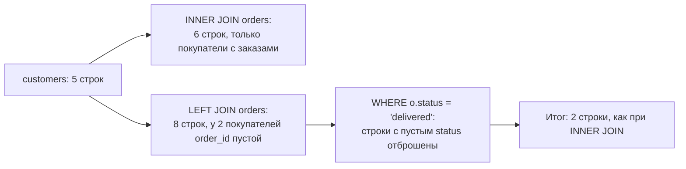

# А.5 SQL для аналитика: от SELECT до JOIN и GROUP BY

## Зачем это аналитику

SQL — инструмент, который отвечает на вопросы без посредников: сколько заказов зависло в статусе, какие данные пришли из интеграции, воспроизводится ли дефект. Он же нужен, чтобы проверять гипотезы при постановке и принимать работу. На собеседованиях системного аналитика задача на SQL есть почти всегда.

## Готовность к модулю

Модуль опирается на темы ниже. Если какая-то из них незнакома или её вопросы для самопроверки даются с трудом, начните с неё.

- [А.4 Реляционные БД](a4-relational-model.md)

## Куда ведёт

Тема подробнее раскрывается в модулях:

- [Б.4 SQL и транзакции](../00b-bridge/b4-sql-transactions.md)
- [2.4 Планировщик запросов](../02-postgresql/2.4-planner.md)
- [9.1 OLTP и OLAP](../09-data-platforms/9.1-oltp-olap.md)

## Что понять

- [ ] SELECT, FROM, WHERE: выбор столбцов и фильтрация, операторы сравнения, IN, BETWEEN, LIKE, IS NULL.
- [ ] ORDER BY и LIMIT.
- [ ] Агрегаты COUNT, SUM, AVG, MIN, MAX и GROUP BY; HAVING против WHERE.
- [ ] JOIN: INNER, LEFT, и почему LEFT JOIN с условием в WHERE превращается во внутреннее соединение.
- [ ] NULL в выражениях и агрегатах: почему COUNT(*) и COUNT(столбец) дают разные числа.
- [ ] Подзапросы и EXISTS; первое знакомство с CTE (WITH).
- [ ] INSERT, UPDATE, DELETE — и почему UPDATE без WHERE опасен. Транзакция: BEGIN, COMMIT, ROLLBACK.
- [ ] Порядок выполнения запроса: FROM → WHERE → GROUP BY → HAVING → SELECT → ORDER BY.

## Урок

<!-- LESSON:START -->
SQL (Structured Query Language) — язык, на котором с реляционной базой разговаривают все: приложения, отчёты, разработчики и аналитики. Запрос описывает, **что** нужно получить, а не **как** искать: способ выполнения база выбирает сама. Весь урок построен на модели интернет-магазина из модуля А.4.

### Подготовка: схема и данные

Ниже — таблицы модели из модуля А.4 без адресов и таблиц истории: для этого урока они не нужны. Скрипт выполняется в PostgreSQL 16 в любом клиенте (psql, DBeaver, pgAdmin) на пустой базе. Всё, что ниже, работает на этих данных, и результаты запросов в тексте получены на них.

```sql
CREATE TABLE categories (
    category_id bigint GENERATED ALWAYS AS IDENTITY PRIMARY KEY,
    name        text   NOT NULL,
    parent_id   bigint REFERENCES categories (category_id)
);
CREATE TABLE customers (
    customer_id bigint GENERATED ALWAYS AS IDENTITY PRIMARY KEY,
    full_name   text        NOT NULL,
    email       text        UNIQUE,
    phone       text,
    city        text,
    created_at  timestamptz NOT NULL DEFAULT now()
);
CREATE TABLE products (
    product_id  bigint GENERATED ALWAYS AS IDENTITY PRIMARY KEY,
    sku         text          NOT NULL UNIQUE,
    name        text          NOT NULL,
    category_id bigint        REFERENCES categories (category_id) ON DELETE SET NULL,
    price       numeric(10,2) NOT NULL CHECK (price > 0),
    stock_qty   integer       NOT NULL DEFAULT 0 CHECK (stock_qty >= 0)
);
CREATE TABLE orders (
    order_id    bigint GENERATED ALWAYS AS IDENTITY PRIMARY KEY,
    customer_id bigint      NOT NULL REFERENCES customers (customer_id),
    status      text        NOT NULL DEFAULT 'new'
                CHECK (status IN ('new', 'paid', 'shipped', 'delivered', 'cancelled')),
    created_at  timestamptz NOT NULL DEFAULT now()
);
CREATE TABLE order_items (
    order_id    bigint        NOT NULL REFERENCES orders (order_id) ON DELETE CASCADE,
    product_id  bigint        NOT NULL REFERENCES products (product_id),
    quantity    integer       NOT NULL CHECK (quantity > 0),
    price       numeric(10,2) NOT NULL CHECK (price > 0),
    PRIMARY KEY (order_id, product_id)
);

INSERT INTO categories (name, parent_id) VALUES
  ('Электроника', NULL), ('Смартфоны', 1), ('Аксессуары', 1), ('Книги', NULL);
INSERT INTO customers (full_name, email, phone, city, created_at) VALUES
  ('Анна Смирнова', 'anna@example.com',  '+79001110001', 'Казань', '2026-01-10'),
  ('Борис Петров',  'boris@example.com', NULL,           'Москва', '2026-01-15'),
  ('Вера Иванова',  NULL,                '+79001110003', 'Казань', '2026-02-01'),
  ('Глеб Соколов',  'gleb@example.com',  '+79001110004', NULL,     '2026-02-20'),
  ('Анна Смирнова', 'Anna@Example.com',  '+79001110001', 'Казань', '2026-03-05');
INSERT INTO products (sku, name, category_id, price, stock_qty) VALUES
  ('PH-001', 'Смартфон A', 2, 30000, 10), ('PH-002', 'Смартфон B', 2, 45000, 5),
  ('AC-001', 'Чехол', 3, 1500, 50), ('AC-002', 'Зарядное устройство', 3, 2500, 20),
  ('BK-001', 'Книга по SQL', 4, 1200, 0), ('AC-003', 'Кабель USB-C', NULL, 500, 100);
INSERT INTO orders (customer_id, status, created_at) VALUES
  (1, 'delivered', '2026-01-20 10:00'), (1, 'paid',      '2026-03-10 12:30'),
  (2, 'delivered', '2026-02-05 09:15'), (2, 'cancelled', '2026-02-18 18:40'),
  (3, 'shipped',   '2026-03-22 14:00'), (1, 'new',       '2026-04-02 08:05');
INSERT INTO order_items (order_id, product_id, quantity, price) VALUES
  (1, 1, 1, 28000), (1, 3, 2, 1500), (2, 4, 1, 2500),
  (3, 2, 1, 45000), (3, 3, 1, 1500), (3, 5, 2, 1200),
  (4, 1, 1, 28000), (5, 1, 1, 30000), (5, 4, 2, 2500);
```

В данных специально есть неудобные случаи: покупатель без email, покупатель без города, два аккаунта одной покупательницы с email в разном регистре, покупатели без заказов, товар, который ни разу не продавали, отменённый заказ.

### SELECT, FROM, WHERE

Базовый запрос состоит из трёх частей: `SELECT` — какие столбцы показать, `FROM` — из какой таблицы, `WHERE` — какие строки оставить.

```sql
SELECT full_name, email, city
FROM customers
WHERE city = 'Казань';
```

Результат — тоже таблица, здесь из трёх строк. Текстовые значения пишутся в одинарных кавычках. `SELECT *` возвращает все столбцы — удобно для разведки, но в отчётах лучше перечислять столбцы явно.

Условия в `WHERE` собираются из операторов:

| Оператор | Смысл | Пример |
|---|---|---|
| `=`, `<>`, `<`, `>`, `<=`, `>=` | сравнение | `price > 1000` |
| `IN (...)` | одно из значений списка | `status IN ('new', 'paid')` |
| `BETWEEN a AND b` | от a до b включительно | `price BETWEEN 1000 AND 3000` |
| `LIKE` | совпадение по шаблону, `%` — любые символы | `email LIKE '%@example.com'` |
| `IS NULL`, `IS NOT NULL` | значение отсутствует или есть | `email IS NULL` |

Условия объединяются через `AND` и `OR`. При смешении ставьте скобки: `AND` связывает сильнее, чем `OR`, и `a OR b AND c` читается как `a OR (b AND c)`.

```sql
SELECT name, price
FROM products
WHERE price BETWEEN 1000 AND 3000
  AND category_id IN (3, 4);
```

С датами `BETWEEN` коварен. `created_at BETWEEN '2026-02-01' AND '2026-02-28'` потеряет заказы, сделанные 28 февраля днём: строка `'2026-02-28'` означает полночь. Надёжный способ — полуоткрытый интервал:

```sql
SELECT order_id, status, created_at
FROM orders
WHERE created_at >= '2026-02-01' AND created_at < '2026-03-01';
```

`LIKE` чувствителен к регистру: `'%@example.com'` не найдёт `Anna@Example.com`. В PostgreSQL для поиска без учёта регистра есть `ILIKE`.

### ORDER BY и LIMIT

Без `ORDER BY` база возвращает строки в любом удобном ей порядке, и он может меняться от запуска к запуску. Если порядок важен, его задают явно: `ASC` — по возрастанию (по умолчанию), `DESC` — по убыванию. `LIMIT` ограничивает число строк.

```sql
SELECT name, price
FROM products
ORDER BY price DESC
LIMIT 3;
```

`LIMIT` без `ORDER BY` — это «любые три строки», а не «первые три». При равных значениях порядок тоже не определён; для воспроизводимого результата добавляют второй ключ сортировки, например `ORDER BY price DESC, product_id`.

### NULL: значения нет

`NULL` — не ноль и не пустая строка, а «значение неизвестно или отсутствует». Любое сравнение с `NULL` даёт не «истину» и не «ложь», а тоже `NULL` («неизвестно»), и `WHERE` такую строку отбрасывает. Три возможных результата условия — истина, ложь, неизвестно — называют трёхзначной логикой. Отсюда два следствия.

Первое: `WHERE email = NULL` не вернёт ничего. Проверять надо через `IS NULL`.

Второе, менее очевидное: `WHERE city <> 'Казань'` не вернёт Глеба, у которого город не указан. Для базы «неизвестный город» не равен и не «не равен» Казани. Если такие строки нужны, условие дописывают явно: `OR city IS NULL`.

Агрегатные функции (о них ниже) пропускают `NULL`. Поэтому разные формы `COUNT` дают разные числа:

```sql
SELECT COUNT(*)     AS all_rows,
       COUNT(email) AS with_email,
       COUNT(city)  AS with_city
FROM customers;
-- all_rows = 5, with_email = 4, with_city = 4
```

`COUNT(*)` считает строки, `COUNT(столбец)` — строки, где в столбце есть значение. «Количество покупателей» и «количество покупателей с email» — разные метрики, и в постановке отчёта их надо различать. `AVG` тоже считает среднее только по заполненным значениям.

### Агрегаты и GROUP BY

Агрегатные функции (aggregate functions) сворачивают много строк в одно значение: `COUNT` — количество, `SUM` — сумма, `AVG` — среднее, `MIN` и `MAX` — минимум и максимум.

`GROUP BY` разбивает строки на группы с одинаковым значением и считает агрегат для каждой группы отдельно:

```sql
SELECT status, COUNT(*) AS orders_cnt
FROM orders
GROUP BY status
ORDER BY orders_cnt DESC;
```

Правило: при группировке в `SELECT` выводят только столбцы из `GROUP BY` и агрегаты. Вывести `customer_id` рядом с `GROUP BY status` нельзя — непонятно, какого из покупателей группы показывать. (Правило упрощено: PostgreSQL разрешает выводить и другие столбцы таблицы, если в `GROUP BY` стоит её первичный ключ, — они однозначно определяются ключом.)

**WHERE против HAVING.** `WHERE` фильтрует строки до группировки, `HAVING` — готовые группы после неё. Поэтому агрегат можно использовать только в `HAVING`. Пример: покупатели, у которых не меньше двух неотменённых заказов.

```sql
SELECT customer_id, COUNT(*) AS orders_cnt
FROM orders
WHERE status <> 'cancelled'
GROUP BY customer_id
HAVING COUNT(*) >= 2;
```

Сначала `WHERE` выбросил отменённый заказ, потом строки сгруппировались по покупателю, потом `HAVING` оставил группы с двумя и более заказами. Условие, которое можно проверить у отдельной строки, пишут в `WHERE`: так база обработает меньше данных.

Тот же приём находит дубли. Два аккаунта с email, различающимся только регистром:

```sql
SELECT lower(email) AS email_norm, COUNT(*) AS cnt
FROM customers
WHERE email IS NOT NULL
GROUP BY lower(email)
HAVING COUNT(*) > 1;
```

### JOIN: соединение таблиц

Почти любой содержательный вопрос требует соединить таблицы. `JOIN` склеивает строки двух таблиц по условию в `ON` — как правило, внешний ключ равен первичному.

```sql
SELECT o.order_id, c.full_name, o.status
FROM orders o
JOIN customers c ON c.customer_id = o.customer_id;
```

`o` и `c` — псевдонимы (aliases) таблиц: короткие имена, чтобы не писать `orders.order_id`. Просто `JOIN` означает `INNER JOIN` — внутреннее соединение: в результат попадают только пары строк, нашедшие друг друга.

`LEFT JOIN` — левое внешнее соединение: все строки левой таблицы попадают в результат, даже если справа пары нет. Недостающие столбцы правой таблицы заполняются `NULL`. На этом строится классическая задача «покупатели без заказов»:

```sql
SELECT c.customer_id, c.full_name
FROM customers c
LEFT JOIN orders o ON o.customer_id = c.customer_id
WHERE o.order_id IS NULL;
```

Результат — Глеб и второй аккаунт Анны. Того же можно добиться через `NOT EXISTS` (ниже).



**Ловушка: LEFT JOIN с условием в WHERE.** Нужен список всех покупателей и их доставленных заказов, включая тех, у кого доставленных нет. Первая попытка:

```sql
SELECT c.full_name, o.order_id
FROM customers c
LEFT JOIN orders o ON o.customer_id = c.customer_id
WHERE o.status = 'delivered';
```

Вернутся только двое. У покупателей без подходящих заказов `o.status` равен `NULL`, сравнение с `NULL` не даёт «истину», и `WHERE` выбрасывает эти строки. Внешнее соединение молча превратилось во внутреннее. Условие на правую таблицу нужно перенести в `ON`:

```sql
SELECT c.full_name, o.order_id
FROM customers c
LEFT JOIN orders o ON o.customer_id = c.customer_id
                  AND o.status = 'delivered';
```

Теперь все пять покупателей на месте, у троих `order_id` пустой. Правило: условие на правую таблицу `LEFT JOIN` пишут в `ON`, если не хотят потерять строки. Проверка на `IS NULL` в `WHERE`, как в задаче про покупателей без заказов, — осознанное исключение.

**Ловушка: размножение строк.** Соединение «один ко многим» повторяет строку родителя столько раз, сколько у неё детей. Если соединить покупателей, заказы и позиции и посчитать `COUNT(*)`, получатся позиции, а не заказы: у Бориса выйдет 4 вместо 2. Лечится подсчётом уникальных значений `COUNT(DISTINCT o.order_id)` или агрегацией до соединения. Признак проблемы — итоговые суммы больше, чем должны быть. Сверяйте число строк результата с ожиданием.

### Подзапросы, EXISTS и CTE

Подзапрос (subquery) — запрос внутри другого запроса. Он может вернуть одно значение:

```sql
SELECT name, price
FROM products
WHERE price > (SELECT AVG(price) FROM products);
```

или список, с которым работает `IN`: товары, которых нет ни в одной позиции заказа.

```sql
SELECT name
FROM products
WHERE product_id NOT IN (SELECT product_id FROM order_items);
```

С `NOT IN` осторожно: если подзапрос вернёт хотя бы один `NULL`, результат станет пустым — это снова трёхзначная логика. Здесь `product_id` объявлен `NOT NULL`, и проблемы нет.

`EXISTS` проверяет, вернёт ли подзапрос хоть одну строку. Подзапрос ссылается на строку внешнего запроса и выполняется «для каждого покупателя»:

```sql
SELECT c.full_name
FROM customers c
WHERE NOT EXISTS (
    SELECT 1 FROM orders o WHERE o.customer_id = c.customer_id
);
```

Это та же задача «покупатели без заказов». `NOT EXISTS` не страдает от `NULL` так, как `NOT IN`, и его намерение читается прямо.

CTE (Common Table Expression) — именованный подзапрос в начале, через `WITH`. Он разбивает сложный запрос на шаги, как промежуточные листы в Excel. Заказы с суммой выше средней:

```sql
WITH order_totals AS (
    SELECT order_id, SUM(quantity * price) AS total
    FROM order_items
    GROUP BY order_id
)
SELECT order_id, total
FROM order_totals
WHERE total > (SELECT AVG(total) FROM order_totals)
ORDER BY total DESC;
```

Шаг 1 считает сумму каждого заказа, шаг 2 сравнивает её со средней. Без CTE пришлось бы дважды повторить один и тот же подзапрос.

### Выручка по месяцам: всё вместе

Типовая задача с собеседования — выручка по месяцам за текущий год:

```sql
SELECT date_trunc('month', o.created_at) AS month,
       SUM(oi.quantity * oi.price)      AS revenue
FROM orders o
JOIN order_items oi ON oi.order_id = o.order_id
WHERE o.status <> 'cancelled'
  AND o.created_at >= date_trunc('year', now())
GROUP BY date_trunc('month', o.created_at)
ORDER BY month;
```

`date_trunc('month', ...)` обрезает момент времени до начала месяца, и все заказы месяца попадают в одну группу. Выручка считается по позициям, по цене в момент заказа, без отменённых заказов. Каждое из этих решений — вопрос к бизнесу: по дате заказа или оплаты, с отменами и возвратами или без. Спорная часть такого запроса — не синтаксис, а определение метрики. Если вы запускаете запрос в следующем году, условие `now()` отбросит все тестовые данные 2026 года — замените его на явную дату. И ещё оговорка: для `timestamptz` границы месяца и года `date_trunc` считает в часовом поясе текущего сеанса (настройка `TimeZone`), поэтому заказ, оформленный 1-го числа вскоре после полуночи по Москве, при сеансе в UTC может попасть в предыдущий месяц.

### Изменение данных и транзакции

Три команды меняют данные: `INSERT` добавляет строки, `UPDATE` меняет значения в существующих, `DELETE` удаляет.

```sql
INSERT INTO customers (full_name, email, city)
VALUES ('Дарья Орлова', 'darya@example.com', 'Самара');

UPDATE orders SET status = 'delivered' WHERE order_id = 5;

DELETE FROM customers WHERE email = 'darya@example.com';
```

Если повторяете эти команды у себя, данные изменятся: заказ 5 станет доставленным. Ниже — как пробовать изменения без последствий.

У `UPDATE` и `DELETE` условие `WHERE` определяет, какие строки затронуть. Без него команда применится ко всей таблице. `UPDATE products SET price = price * 1.1;` без `WHERE` поднимет цены на все шесть товаров, а не на один, и база не переспросит.

Защита — транзакция: `BEGIN` открывает её, `COMMIT` фиксирует изменения, `ROLLBACK` отменяет всё после `BEGIN`. Порядок безопасного исправления данных:

1. Сначала `SELECT` с тем же `WHERE`, что будет в `UPDATE`. Убедиться, что выбраны нужные строки, и запомнить их количество.
2. `BEGIN`.
3. `UPDATE` с тем же условием. Клиент сообщит число изменённых строк, например `UPDATE 1`.
4. Если число совпало с ожидаемым и контрольный `SELECT` показывает верный результат — `COMMIT`. Если нет — `ROLLBACK`.

```sql
SELECT order_id, status FROM orders
WHERE status = 'new' AND created_at < '2026-04-05';

BEGIN;
UPDATE orders SET status = 'cancelled'
WHERE status = 'new' AND created_at < '2026-04-05';
-- ожидали 1 строку: если UPDATE 1, то COMMIT, иначе ROLLBACK
ROLLBACK; -- здесь откатываем, чтобы сохранить учебные данные
```

На рабочей базе транзакцию не держат открытой долго: она мешает другим пользователям.

### Порядок выполнения запроса

Запрос пишется в одном порядке, а логически выполняется в другом:

1. `FROM` и `JOIN` — собрать исходные строки;
2. `WHERE` — отфильтровать строки;
3. `GROUP BY` — сгруппировать;
4. `HAVING` — отфильтровать группы;
5. `SELECT` — вычислить выводимые столбцы и их псевдонимы;
6. `ORDER BY` — отсортировать;
7. `LIMIT` — отрезать нужное количество.

Этот порядок объясняет многие ошибки. Псевдоним из `SELECT` нельзя использовать в `WHERE`: на шаге 2 его ещё не существует.

```sql
SELECT order_id, quantity * price AS line_total
FROM order_items
WHERE line_total > 10000;
-- ERROR: column "line_total" does not exist
```

А в `ORDER BY` тот же псевдоним работает, потому что сортировка идёт после `SELECT`. По той же причине агрегат нельзя написать в `WHERE`: группы появляются только на шаге 3. Это логический порядок; физически база может выполнять запрос иначе, если результат будет тем же.

### Что дальше

Оконные функции, «последний статус каждого заказа», индексы и план выполнения запроса разбирает модуль Б.4 — он опирается на эту же схему. Как планировщик выбирает способ выполнения запроса, объясняет модуль 2.4. Чем запросы для отчётов отличаются от запросов приложения и почему для аналитики строят отдельные хранилища — модуль 9.1.

### Типичные ошибки

- Сравнивать с `NULL` через `=` или `<>` и не замечать, что строки с пустыми значениями выпали из результата.
- Писать условие на правую таблицу `LEFT JOIN` в `WHERE` и получать внутреннее соединение.
- Соединять несколько таблиц «один ко многим» и суммировать, не проверив, что строки не размножились.
- Фильтровать даты через `BETWEEN` с датой без времени и терять события последнего дня.
- Полагаться на порядок строк без `ORDER BY` или брать «первые N» через `LIMIT` без сортировки.
- Выполнять `UPDATE` или `DELETE` без предварительного `SELECT` и вне транзакции.
- Считать метрику, не договорившись о её определении: по какой дате, с отменами или без.

### Как говорить об этом на собеседовании

На собеседовании системного аналитика обычно дают две-три задачи: соединение с группировкой, «найти тех, у кого нет», поиск дублей, выручку по периодам. Проговаривайте решение вслух: какие таблицы соединяете и по каким ключам, какой будет кратность, что произойдёт с `NULL`. Интервьюер оценивает рассуждение не меньше синтаксиса.

Сильные ходы: самим назвать ловушку («здесь LEFT JOIN, поэтому условие на заказы ставлю в ON»), уточнить определение метрики («выручку считаю по позициям, отмены исключаю — верно?»), упомянуть проверку («сверю число строк до и после соединения»). На вопрос про исправление данных ответ — `SELECT` с тем же условием, транзакция, сверка количества строк и только потом `COMMIT`.

### Коротко

- `SELECT` выбирает столбцы, `FROM` — таблицу, `WHERE` — строки. Порядок результата задаёт только `ORDER BY`.
- `NULL` — отсутствие значения. Сравнение с ним не истинно, проверка — через `IS NULL`. Агрегаты пропускают `NULL`, поэтому `COUNT(*)` и `COUNT(столбец)` различаются.
- `GROUP BY` сворачивает строки в группы. `WHERE` фильтрует строки до группировки, `HAVING` — группы после.
- `INNER JOIN` оставляет пары, `LEFT JOIN` — все строки левой таблицы. Условие на правую таблицу в `WHERE` превращает `LEFT JOIN` во внутреннее соединение.
- Соединение «один ко многим» размножает строки родителя. Сверяйте количество строк.
- Подзапрос, `EXISTS` и CTE разбивают задачу на шаги. `NOT EXISTS` надёжнее `NOT IN` при наличии `NULL`.
- `UPDATE` и `DELETE` без `WHERE` меняют всю таблицу. Исправление данных — через `SELECT`, `BEGIN`, сверку и `COMMIT` или `ROLLBACK`.
- Логический порядок: FROM → WHERE → GROUP BY → HAVING → SELECT → ORDER BY → LIMIT.
<!-- LESSON:END -->

## Читать дальше

- Алан Бьюли, «Изучаем SQL» — главы 3–8.
- Документация PostgreSQL: «The SQL Language», разделы о запросах и соединениях.
- Интерактивные тренажёры SQL (например, sql-ex.ru, SQLBolt) — для набивки руки.

## Практика

1. Поднять PostgreSQL локально (в Docker или установщиком) и создать таблицы модели интернет-магазина из модуля А.4. Заполнить 20–30 строк тестовых данных.
2. Написать 10 запросов: заказы за период, сумма по покупателю, топ-5 товаров, покупатели без заказов, средний чек по месяцам, заказы с суммой выше средней, дубли по email и т. д.
3. Намеренно получить неправильный результат: LEFT JOIN с условием в WHERE, COUNT по столбцу с NULL, JOIN, который размножил строки. Записать, как каждую ошибку заметить.

## Вопросы для самопроверки

1. Чем WHERE отличается от HAVING?
2. Чем INNER JOIN отличается от LEFT JOIN? Как найти покупателей без заказов?
3. Почему COUNT(*) и COUNT(email) могут дать разные результаты?
4. Напишите запрос: выручка по месяцам за текущий год.
5. В каком порядке логически выполняются части SELECT-запроса?
6. Как безопасно выполнить исправляющий UPDATE на данных?

## Заметки

<!-- Свои формулировки, ошибки, ссылки. -->
