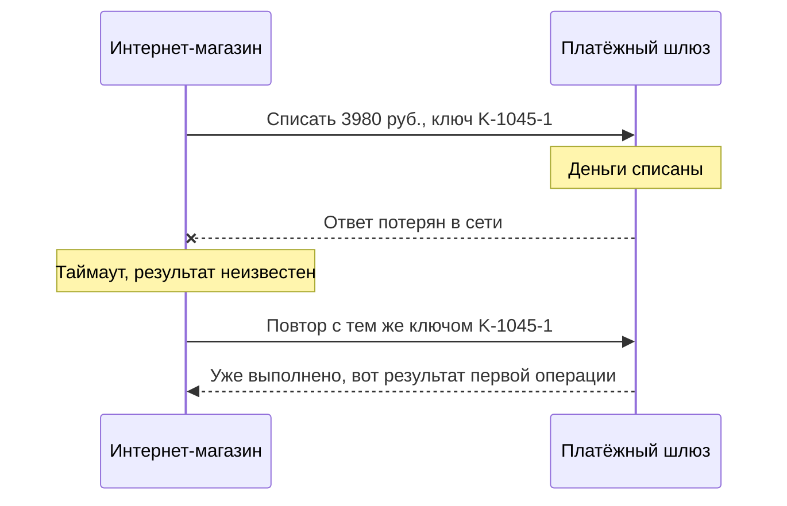

# А.6 API и интеграции глазами аналитика

## Зачем это аналитику

Системы почти никогда не живут одни: магазин обменивается данными со складом, платёжным шлюзом, службой доставки, бухгалтерией. Большая часть работы системного аналитика — описать, кто кому что передаёт, когда и что происходит при сбое. Этот модуль даёт словарь и базовые способы интеграции, чтобы выбирать между ними осознанно.

## Готовность к модулю

Модуль опирается на темы ниже. Если какая-то из них незнакома или её вопросы для самопроверки даются с трудом, начните с неё.

- [А.2 Как работает веб](a2-web-http-basics.md)
- [А.3 Данные и форматы](a3-data-formats.md)

## Куда ведёт

Тема подробнее раскрывается в модулях:

- [А.7 UML и BPMN](a7-uml-bpmn.md)
- [А.9 Системные требования](a9-system-requirements.md)
- [Б.3 Контракты API](../00b-bridge/b3-api-contracts.md)
- [Б.5 Асинхронный обмен](../00b-bridge/b5-async-messaging.md)
- [3.4 Коммуникация и брокеры](../03-microservices-ddd/3.4-communication.md)
- [8.4 Пакетные интеграции](../08-integration-patterns/8.4-batch-file-integration.md)

## Что понять

- [ ] Что такое интеграция и какие вопросы она ставит: кто инициатор, какие данные, как часто, что при ошибке.
- [ ] REST API на базовом уровне: ресурсы, методы, коды ответа, JSON. Чтение документации Swagger/OpenAPI.
- [ ] Синхронный вызов и асинхронный обмен: когда ответ нужен сразу, а когда можно подождать.
- [ ] Очередь сообщений на уровне идеи: отправитель, брокер, получатель; почему сообщение не теряется, если получатель недоступен.
- [ ] Вебхуки: когда система сама сообщает о событии.
- [ ] Файловый обмен и пакетные выгрузки: по расписанию, через каталог или SFTP.
- [ ] Прямой доступ к чужой базе данных — почему это плохая идея.
- [ ] Ошибки и повторы: таймаут, повторная отправка, дубли; идемпотентность на пальцах.
- [ ] Что писать в спецификации интеграции: участники, сценарии, формат, ошибки, нефункциональные требования.

## Урок

<!-- LESSON:START -->
### Что такое интеграция

Интеграция — это договорённость двух систем о том, как одна передаёт другой данные или просит что-то сделать. Внутри одной программы код просто вызывает свою же функцию. Между системами всё иначе: они написаны разными командами, работают на разных серверах, падают и обновляются независимо, а связывает их сеть, которая может потерять запрос или ответ.

Представьте интернет-магазин. Покупатель оформил заказ — и в работу включаются склад (резерв и сборка), платёжный шлюз (сервис, который принимает оплату картой и общается с банками), служба доставки, бухгалтерия и сервис рассылок. Каждая стрелка между этими системами — отдельная интеграция. Для каждой аналитик отвечает на четыре базовых вопроса:

1. **Кто инициатор?** Кто начинает обмен: магазин спрашивает склад или склад сам сообщает магазину.
2. **Какие данные?** Состав полей, формат, объём одного сообщения.
3. **Как часто и насколько срочно?** В момент действия пользователя, раз в минуту, раз в сутки.
4. **Что при ошибке?** Получатель недоступен, ответ не пришёл, пришли кривые данные — кто это заметит и что будет делать.

Четвёртый вопрос чаще всего пропускают, а в нём прячутся потерянные заказы и двойные списания.

### REST API на базовом уровне

API (Application Programming Interface, программный интерфейс) — это «окно выдачи» системы для других программ: набор операций, которые можно вызвать, и правила, в каком виде передавать запрос и получать ответ. Человек работает с системой через экраны, программа — через API.

Самый распространённый стиль веб-API — REST. Не вдаваясь в теорию, на практике он означает следующее.

**Ресурсы.** Всё, с чем работает API, — это ресурсы: заказы, товары, покупатели. У каждого ресурса есть адрес (URL): `/orders` — все заказы, `/orders/1045` — заказ с номером 1045.

**Методы.** Что сделать с ресурсом, говорит метод HTTP-запроса (о самом HTTP — в модуле А.2):

| Метод | Смысл | Пример |
|---|---|---|
| GET | Получить данные, ничего не меняя | `GET /orders/1045` — прочитать заказ |
| POST | Создать новый ресурс или запустить действие | `POST /orders` — создать заказ |
| PUT | Заменить ресурс целиком | `PUT /orders/1045` — перезаписать заказ |
| PATCH | Изменить часть полей | `PATCH /orders/1045` — поменять адрес доставки |
| DELETE | Удалить | `DELETE /orders/1045` — отменить или удалить заказ |

**Коды ответа.** Каждый ответ начинается с трёхзначного кода. Первая цифра говорит о классе результата: 2xx — успех, 4xx — ошибка на стороне того, кто спрашивает (неверные данные, нет прав, ресурс не найден), 5xx — ошибка на стороне того, кто отвечает (сервер упал, внутренний сбой). Самые частые: 200 (успех), 201 (создано), 400 (некорректный запрос), 404 (не найдено), 409 (конфликт с текущим состоянием, например попытка отменить уже отправленный заказ), 500 (внутренняя ошибка), 503 (сервис временно недоступен).

Разделение 4xx и 5xx важно аналитику: при 4xx повторять тот же запрос, как правило, бессмысленно — надо исправлять данные (есть исключения, например 429 «слишком много запросов»: там повтор после паузы уместен); при 5xx повтор через какое-то время может помочь.

**JSON.** Тело запроса и ответа обычно передаётся в формате JSON (модуль А.3). Запрос на создание заказа мог бы выглядеть так:

```http
POST /orders HTTP/1.1
Content-Type: application/json

{
  "customer_id": 311,
  "items": [
    { "product_id": 58, "quantity": 2 }
  ],
  "delivery_address": "ул. Садовая, 10, кв. 4"
}
```

В ответ сервер вернёт код 201 и JSON с номером созданного заказа, статусом и суммой.

#### Как читать документацию Swagger/OpenAPI

OpenAPI — стандартный формат описания REST API: какие есть адреса, какие методы на них работают, что передать и что придёт в ответ. Swagger — набор инструментов вокруг этого формата, самый известный — Swagger UI, веб-страница, где описание API показано в удобном виде.

В описании метода ищите: путь и метод (`POST /orders`); параметры в адресе (`/orders/{id}`) или после знака вопроса (`?status=new`); схему тела запроса с типами и обязательностью; ответы отдельно для каждого кода; способ, которым клиент доказывает, кто он (ключ API или токен — выданная заранее секретная строка-пропуск, которую передают с каждым запросом).

Хорошее описание содержит примеры запросов и ответов. Если их нет, а ошибки описаны только кодом 200 — это повод для вопросов разработчику ещё до начала работы.

### Синхронный вызов и асинхронный обмен

**Синхронный вызов** похож на телефонный звонок: вы спросили и ждёте ответа, не кладя трубку. Магазин отправил запрос в платёжный шлюз и ждёт «оплачено» или «отказ», а покупатель тем временем смотрит на крутящееся колесо.

**Асинхронный обмен** похож на письмо: отправили и занялись другими делами, ответ (если нужен) придёт позже. Магазин сообщил «заказ оплачен», а склад обработает это, когда сможет.

Как выбирать:

- Синхронно — когда результат нужен прямо сейчас, чтобы продолжить: проверить остаток перед оформлением, узнать результат оплаты, показать пользователю цену доставки.
- Асинхронно — когда отправителю достаточно знать, что сообщение принято: передать заказ на сборку, выгрузить продажу в бухгалтерию, отправить письмо.

Цена синхронности — связанность. Если склад лежит, а магазин ждёт его ответа при каждом оформлении, магазин тоже перестаёт продавать. Асинхронный обмен развязывает системы во времени: каждая работает в своём темпе. Цена асинхронности — сложность: результат приходит позже, его надо где-то ждать, а пользователю — показывать промежуточное состояние («заказ принят, ожидает подтверждения»).

### Очередь сообщений

Главный инструмент асинхронного обмена — очередь сообщений. В ней три участника:

- **отправитель (producer)** — система, которая кладёт сообщение;
- **брокер (broker)** — отдельная программа-посредник, которая хранит сообщения, пока их не заберут; аналогия — почтовое отделение;
- **получатель (consumer)** — система, которая забирает сообщения и обрабатывает их.


Почему сообщение не теряется, если склад недоступен? Потому что магазин отправляет его не складу, а брокеру. Брокер сохраняет сообщение — при надёжной настройке на диск, а не только в память, — и держит его, пока получатель не заберёт и не подтвердит, что обработал. Склад перезапустился через час — и разбирает накопившиеся сообщения. Если склад взял сообщение, но упал, не подтвердив, брокер отдаст его снова.

Отсюда важное следствие: получатель может получить одно и то же сообщение дважды. Это не сбой, а нормальное поведение надёжной доставки, и получатель должен быть к нему готов (об этом — в разделе про идемпотентность).

Названия брокеров, которые вы услышите: RabbitMQ, Apache Kafka, облачные очереди. Чем они различаются, разбирается в модуле Б.5.

### Вебхуки

Допустим, магазину нужно знать, когда служба доставки вручила посылку. Первый способ — **опрос (polling)**: магазин каждые пять минут спрашивает «что с посылкой 7781?». Большинство ответов — «ничего не изменилось», запросов много, а узнаёт магазин о событии с задержкой до пяти минут.

Второй способ — **вебхук (webhook)**: магазин заранее даёт службе доставки свой адрес, например `https://shop.example/hooks/delivery`, и служба сама отправляет туда HTTP-запрос, когда что-то произошло. Это «обратный звонок»: не вы звоните каждые пять минут, а вам звонят, когда есть новости.

Вебхук удобнее опроса: события приходят сразу, лишних запросов нет. Но у него свои вопросы, которые аналитик должен закрыть:

- Как убедиться, что запрос пришёл действительно от службы доставки, а не от злоумышленника? Обычно запрос подписывают: отправитель вычисляет по содержимому запроса и секретному ключу, известному только двум сторонам, контрольную строку (подпись), а получатель пересчитывает её и сравнивает.
- Что будет, если магазин в момент события недоступен? Хорошие поставщики повторяют отправку несколько раз — значит, возможны дубли.
- Гарантирован ли порядок? Событие «вручено» может прийти раньше, чем «передано курьеру».
- Что если все повторы исчерпаны? Нужен запасной способ — например, периодическая сверка через API.

### Файловый обмен и пакетные выгрузки

Не всё передаётся по одному сообщению. Бухгалтерии не нужна каждая продажа в момент продажи — ей нужен реестр продаж за день. Такой обмен называют **пакетным (batch)**: данные копятся и передаются одним большим куском по расписанию.

Типичный сценарий: каждую ночь в 02:00 магазин формирует файл `sales_2026-09-26.csv` со всеми продажами за сутки и кладёт его в условленный каталог. Бухгалтерская система в 03:00 забирает файл и загружает. Каталог может быть общей сетевой папкой или SFTP-сервером — сервером для передачи файлов по защищённому соединению.

Пакетный обмен всё ещё повсюду: с банками, государственными и старыми учётными системами. Он прост, выдерживает большие объёмы и не требует, чтобы обе системы были доступны одновременно. Зато данные приходят с задержкой, а ошибка в одной строке может остановить загрузку всего файла.

В постановке аналитик фиксирует: правило именования, формат и кодировку, расписание, что делать с файлом после загрузки, как отправитель узнаёт об ошибке, что делать с повторно выложенным файлом и как понять, что файл выложен целиком, а не наполовину (например, файл-флаг после основного или запись под временным именем с переименованием).

### Почему нельзя лезть в чужую базу данных

Самый быстрый способ интеграции на вид — дать складу доступ к базе данных магазина: пусть сам читает таблицу заказов. Никаких API, никаких очередей. Это почти всегда плохая идея, и вот почему:

- **Таблицы становятся контрактом.** Команда магазина переименовала столбец или разделила таблицу на две — и склад сломался, хотя его никто не трогал. Внутренняя структура базы превращается в публичное обещание, которое никто не давал.
- **Бизнес-правила обходятся.** Магазин считает заказ готовым к сборке, только если оплата подтверждена и нет блокировки по антифроду (проверке на мошенничество). Склад, читая таблицу напрямую, этих правил не знает и соберёт неоплаченный заказ.
- **Нагрузка.** Тяжёлый запрос склада может замедлить базу магазина в час пик.
- **Безопасность.** Склад видит данные, которые ему не нужны: телефоны, адреса, платежи.
- **Непонятно, кто отвечает.** Когда что-то сломалось, каждая команда уверена, что проблема на другой стороне.

API или сообщение — это витрина, которую владелец системы сознательно поддерживает. База — склад за витриной, куда посторонним нельзя.

### Ошибки, повторы и идемпотентность

Разберём самый важный сценарий. Магазин отправил в платёжный шлюз запрос «списать 3980 рублей за заказ 1045». Прошло 30 секунд — ответа нет. Магазин прервал ожидание: сработал **таймаут** (timeout, максимальное время ожидания ответа).

Что произошло? Возможны три варианта, и магазин не знает, какой из них случился:

1. Запрос не дошёл до шлюза — деньги не списаны.
2. Запрос дошёл, шлюз списал деньги, но ответ потерялся по дороге.
3. Шлюз ещё обрабатывает запрос и спишет деньги через минуту.



Если просто повторить запрос, во втором и третьем случае покупатель заплатит дважды. Если не повторять, в первом случае заказ останется неоплаченным. Главное правило: **после таймаута результат неизвестен, а не отрицателен**.

Решение — **идемпотентность** (idempotency). Операция идемпотентна, если выполнить её один раз или десять раз — результат одинаковый. Кнопка вызова лифта идемпотентна: нажмёте её пять раз — лифт приедет один раз. Кнопка «перевести 100 рублей» без специальной защиты — нет.

Как сделать списание идемпотентным: магазин при первом запросе генерирует уникальный **ключ идемпотентности** (в примере — K-1045-1) и повторяет запрос с тем же ключом. Шлюз запоминает ключи уже выполненных операций: если ключ видит впервые — списывает, если повторно — не списывает, а возвращает результат первой операции. Многие платёжные API поддерживают такой ключ; аналитику нужно проверить это в документации и явно записать в постановке.

Кроме того, повторять стоит не сразу и не бесконечно — например, три попытки с растущими паузами, после чего заказ переходит в состояние «требует проверки». Если шлюз умеет отвечать на вопрос «что с операцией по заказу 1045?», сначала спросить статус. И раз в сутки сверять свои оплаты с реестром шлюза.

Та же логика действует для очередей и вебхуков: раз дубли возможны, получатель должен распознавать повтор — по идентификатору сообщения или по бизнес-ключу (номер заказа плюс тип события) — и не выполнять действие дважды.

### Что писать в спецификации интеграции

Спецификация интеграции — документ, по которому две команды делают свои части и потом проверяют, что они стыкуются. Минимальный состав:

| Раздел | Что в нём |
|---|---|
| Участники | Системы, их владельцы, кто инициатор, кто отвечает за сбои |
| Назначение | Какую бизнес-задачу решает обмен, какие процессы от него зависят |
| Способ | Синхронный API, очередь, вебхук, файл; почему выбран именно он |
| Сценарии | Основной поток по шагам; альтернативные потоки; диаграмма последовательности |
| Формат | Структура сообщения или файла, типы, обязательность, примеры; маппинг полей: какое поле источника в какое поле приёмника и с каким преобразованием |
| Ошибки | Перечень ошибок, коды, что делает каждая сторона, политика повторов, идемпотентность, куда пишется журнал и кто получает оповещение |
| Нефункциональные требования | Объёмы (сообщений в час, строк в файле), допустимое время ответа, расписание, доступность, безопасность (аутентификация, шифрование, персональные данные) |
| Открытые вопросы | Что не согласовано и с кем |

Проверка готовности: разработчик каждой стороны может по документу ответить, что делает его система, если соседняя молчит, отвечает ошибкой или присылает дубль.

### Разобранный пример: как выбрать способ

Сведём варианты для интернет-магазина в одну карту. Это не единственно верный ответ — в реальном проекте выбор зависит ещё и от того, что умеют соседние системы.

| Связь | Инициатор | Данные | Способ | Почему |
|---|---|---|---|---|
| Магазин → склад: проверка остатка | Магазин | Товар, количество | Синхронный API | Нужен ответ до оформления заказа |
| Магазин → склад: заказ на сборку | Магазин | Заказ с позициями | Очередь | Ответ сразу не нужен, склад не должен блокировать продажи |
| Магазин → платёжный шлюз: оплата | Магазин | Сумма, заказ, ключ идемпотентности | Синхронный API | Покупатель ждёт результата |
| Платёжный шлюз → магазин: итог оплаты | Шлюз | Статус операции | Вебхук | Некоторые оплаты подтверждаются не сразу |
| Служба доставки → магазин: статусы | Служба доставки | Трек-номер, статус | Вебхук, плюс сверка через API | События редкие, нужна быстрая реакция |
| Магазин → бухгалтерия: продажи | Магазин | Реестр за сутки | Файл по расписанию | Нужен итог за день, большой объём |
| Магазин → рассылки: письмо | Магазин | Адрес, шаблон, данные | Очередь | Письмо может уйти через минуту |

### Что дальше

Здесь остались за кадром детали контрактов API: пагинация, формат ошибок, версии и совместимость — их разбирает модуль Б.3. Виды брокеров, гарантии доставки и порядок сообщений — предмет модуля Б.5, а подробно — модуля 3.4. Пакетные интеграции с их контролем полноты и повторной загрузкой разобраны в модуле 8.4. Как оформить сценарии интеграции диаграммами, покажет следующий модуль А.7.

### Типичные ошибки

- Описывать только успешный сценарий. Таймауты, дубли и недоступность соседа не попадают в постановку — и каждый разработчик обрабатывает их по-своему.
- Считать таймаут отказом. После таймаута операция могла выполниться; повтор без ключа идемпотентности приводит к двойному списанию или двойному заказу.
- Делать синхронным всё подряд. Цепочка из нескольких синхронных вызовов останавливается, если упало любое звено.
- Предлагать интеграцию через прямое чтение чужой базы «на время». Временные решения живут годами, и потом их никто не может изменить.
- Не указывать объёмы и частоту. «Выгружать продажи» без цифр не позволяет выбрать способ и проверить нагрузку.
- Забыть про приёмку файла целиком. Получатель начинает читать файл, который ещё пишется, и загружает половину данных.
- Не назначить ответственного за сбой. Ошибка в журнале есть, но оповещение никому не приходит.

### Как говорить об этом на собеседовании

На собеседовании на позицию junior или middle системного аналитика часто дают задачу: «Опишите интеграцию магазина с платёжной системой» или «Какие способы интеграции вы знаете?». Сильный ответ не перечисляет технологии, а начинается с вопросов: кто инициатор, нужен ли ответ сразу, какие объёмы, что при сбое. Выбор способа объясняйте через компромисс: синхронный вызов проще, но связывает системы; очередь развязывает, но добавляет промежуточные состояния.

Обязательно проговорите сценарий «запрос ушёл, ответ не пришёл»: результат неизвестен, повторяем с ключом идемпотентности, попытки исчерпаны — уточняем статус и сверяем. Это показывает, что вы думаете о надёжности, а не только об основном потоке. Про прямой доступ к базе объясняйте через контракт и обход бизнес-правил, а не через «так не принято».

### Коротко

- Любая интеграция начинается с четырёх вопросов: кто инициатор, какие данные, как часто, что при ошибке.
- REST API — это ресурсы, методы, коды ответа и JSON; коды 4xx говорят «исправь запрос», 5xx — «попробуй позже».
- Синхронно — когда ответ нужен сейчас; асинхронно — когда достаточно, что сообщение принято.
- Брокер хранит сообщение, пока получатель его не обработает; обратная сторона надёжности — возможные дубли.
- Вебхук избавляет от постоянного опроса, но требует проверки подписи, обработки повторов и запасной сверки.
- Файловый обмен жив и нужен для больших объёмов по расписанию; важно описать формат, расписание и признак готовности файла.
- В чужую базу напрямую не ходят: таблицы становятся контрактом, бизнес-правила обходятся.
- После таймаута результат неизвестен; повтор безопасен только для идемпотентной операции.
<!-- LESSON:END -->

## Читать дальше

- Документация Swagger: «What is OpenAPI?».
- Грегор Хоп, Бобби Вульф, «Шаблоны интеграции корпоративных приложений» — введение и первые главы (без глубины).

На system-design.space:

- [Удалённые вызовы API: REST, gRPC и GraphQL](https://system-design.space/chapter/remote-call-approaches/)

## Практика

1. Для обезличенного интернет-магазина составить карту интеграций: склад, платёжный шлюз, служба доставки, бухгалтерия, рассылки. Для каждой указать инициатора, данные, способ и частоту обмена.
2. Открыть документацию любого публичного API в формате Swagger (например, Petstore) и описать своими словами один метод: запрос, ответ, возможные ошибки.
3. Для одной интеграции выписать сценарии сбоев (получатель недоступен, ответ не пришёл, пришёл дубль) и что система должна делать в каждом случае.

## Вопросы для самопроверки

1. Какие способы интеграции вы знаете и когда выбрать каждый?
2. Чем синхронный вызов отличается от асинхронного обмена через очередь?
3. Почему нельзя интегрироваться через прямой доступ к базе другой системы?
4. Запрос на оплату ушёл, ответ не пришёл. Что делать?
5. Что обязательно должно быть в спецификации интеграции?
6. Что такое вебхук и чем он удобнее периодического опроса?

## Заметки

<!-- Свои формулировки, ошибки, ссылки. -->
