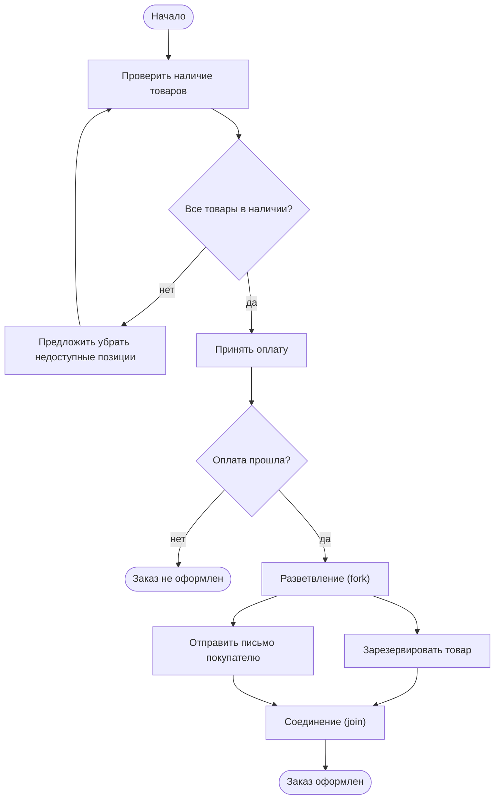
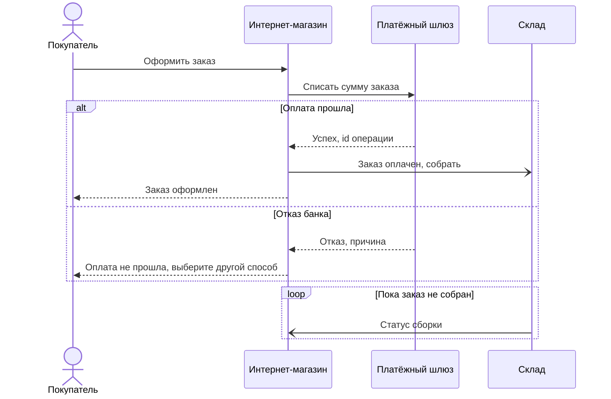
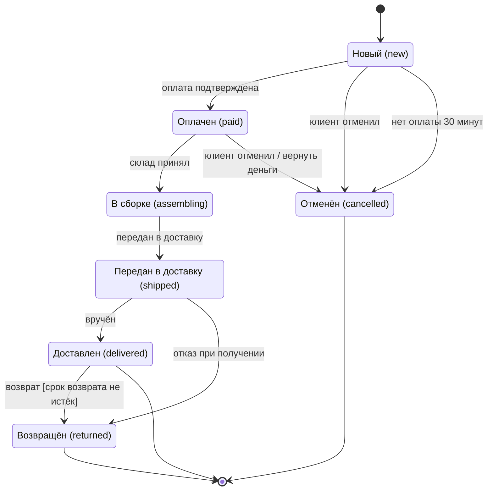
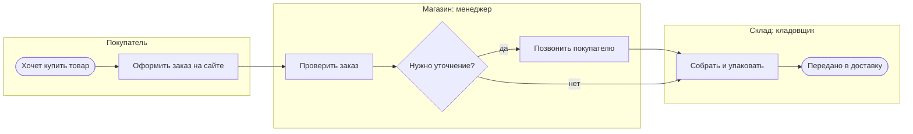

# А.7 Моделирование: UML и BPMN для системного аналитика

## Зачем это аналитику

Хорошая диаграмма заменяет страницу текста и снимает половину вопросов. Бизнес-аналитик обычно уверенно рисует процессы в BPMN; системному аналитику нужны ещё диаграммы, которые показывают поведение системы: последовательности вызовов, состояния объектов, варианты использования. Главное — выбрать нужную диаграмму под вопрос и держать один уровень детализации.

## Готовность к модулю

Модуль опирается на темы ниже. Если какая-то из них незнакома или её вопросы для самопроверки даются с трудом, начните с неё.

- [А.6 API и интеграции](a6-integrations-intro.md)

## Куда ведёт

Тема подробнее раскрывается в модулях:

- [А.9 Системные требования](a9-system-requirements.md)
- [Б.7 Описание решения](../00b-bridge/b7-documenting-solutions.md)
- [6.3 C4 и arc42](../06-architecture-practice/6.3-c4-arc42.md)

## Что понять

- [ ] Зачем моделировать: общий язык, поиск пробелов в требованиях, документация.
- [ ] Диаграмма вариантов использования (use case): акторы, границы системы — и почему её одной мало.
- [ ] Диаграмма деятельности (activity): ветвления, параллельные потоки, дорожки.
- [ ] Диаграмма последовательности (sequence): участники, синхронные и асинхронные сообщения, ответы, альтернативы и циклы.
- [ ] Диаграмма состояний (state): жизненный цикл заказа или платежа, переходы и события.
- [ ] Диаграмма классов в роли логической модели данных — кратко.
- [ ] BPMN: события, задачи, шлюзы, пулы и дорожки; разница между бизнес-процессом и системным сценарием.
- [ ] Диаграммы как код: PlantUML и Mermaid, почему их удобно хранить рядом с требованиями.

## Урок

<!-- LESSON:START -->
### Зачем моделировать

Модель — упрощённая картинка системы, на которой видно только то, что важно для конкретного вопроса. У диаграмм три задачи.

**Общий язык.** Заказчик, аналитик, разработчик и тестировщик по-разному понимают фразу «заказ отменяется». Диаграмма состояний с явным переходом «Оплачен → Отменён по событию отмены клиентом» понимается одинаково.

**Поиск пробелов.** Текст терпит недосказанность, диаграмма — нет. Пока вы пишете «система уведомляет склад», всё гладко. Как только рисуете стрелку, приходится решить: кто её начинает, ждёт ли отправитель ответа, что будет, если склад молчит. Половина вопросов к требованиям появляется именно в момент рисования.

**Документация.** Через год новый человек в команде быстрее поймёт интеграцию по диаграмме последовательности, чем по пяти страницам текста.

Большинство диаграмм, которые нужны системному аналитику, входят в UML (Unified Modeling Language, унифицированный язык моделирования) — стандарт с набором типов диаграмм для описания программных систем. Бизнес-процессы описывают отдельной нотацией — BPMN. Обе поддерживает организация OMG.

### Какую диаграмму выбрать

Главное правило: сначала вопрос, потом диаграмма. Одна диаграмма отвечает на один вопрос и держит один уровень детализации.

| Вопрос | Диаграмма |
|---|---|
| Кто пользуется системой и для чего? | Вариантов использования (use case) |
| Как устроен процесс или алгоритм шаг за шагом, с ветвлениями? | Деятельности (activity) или BPMN |
| Кто кого вызывает и в каком порядке? | Последовательности (sequence) |
| Через какие состояния проходит объект и что его переводит? | Состояний (state) |
| Какие сущности есть и как они связаны? | Классов (class) или ER-диаграмма |
| Как работает бизнес с участием людей и организаций? | BPMN |

Сквозной пример урока — оформление заказа в интернет-магазине: покупатель, магазин, платёжный шлюз (сервис приёма оплаты картой), склад.

### Диаграмма вариантов использования

Вариант использования (use case) — цель, которую пользователь достигает с помощью системы: «Оформить заказ», «Отследить доставку». Диаграмма показывает три вещи:

- **акторы (actors)** — кто взаимодействует с системой; рисуются человечками. Актор — роль, а не конкретный человек, и не обязательно человек: платёжный шлюз тоже актор;
- **варианты использования** — овалы с глаголом и объектом;
- **граница системы** — прямоугольник, внутри которого то, что система делает, снаружи — те, кто с ней работает.

Для магазина: покупатель связан с «Оформить заказ», «Оплатить заказ», «Отменить заказ»; менеджер — с «Изменить заказ»; платёжный шлюз — с «Оплатить заказ».

Эта диаграмма хороша на старте: быстро договориться о рамках — что входит в систему, а что нет, и кто её пользователи. Но одной её мало. Она не показывает порядок шагов, ошибки, данные, правила. За каждым овалом стоит текстовый сценарий: основной поток, альтернативы, исключения, пред- и постусловия (как их писать, разбирает модуль А.9). Диаграмма use case — оглавление, а не содержание.

В PlantUML такой тип диаграмм есть. В Mermaid он появился только в версии 12 и на момент написания помечен как бета; в Mermaid 11, на котором собран этот сайт, его нет.

### Диаграмма деятельности

Диаграмма деятельности (activity) показывает поток действий: что за чем идёт, где выбор, что выполняется параллельно. По виду это блок-схема с расширениями. Основные элементы:

- **действие** — прямоугольник со скруглёнными углами;
- **начальный узел** — закрашенный кружок, **конечный** — кружок в кольце;
- **решение (decision)** — ромб с условиями на исходящих стрелках; **слияние (merge)** — ромб, где ветки сходятся;
- **разветвление (fork) и соединение (join)** — жирная черта: после разветвления действия идут параллельно, соединение ждёт завершения всех веток;
- **дорожки (swimlanes, partitions)** — полосы, показывающие, кто выполняет действие.

Mermaid не умеет рисовать UML-нотацию деятельности, но блок-схема (flowchart) передаёт её смысл. Разветвление и соединение ниже показаны отдельными узлами; дорожки — группами.



Смысл разветвления: резерв и письмо не зависят друг от друга, их можно выполнять одновременно, а «Заказ оформлен» наступает, когда готовы обе ветки. Если бы стрелки просто шли друг за другом, читатель решил бы, что письмо уходит только после резерва, — и это уже другое требование.

### Диаграмма последовательности

Диаграмма последовательности (sequence) — главный инструмент системного аналитика при описании интеграций (о них — модуль А.6). Она показывает, кто кому и в каком порядке отправляет сообщения.

- **Участники (participants)** — колонки сверху: системы, сервисы, пользователь. От каждого вниз идёт линия жизни, время течёт сверху вниз.
- **Синхронное сообщение** — сплошная линия с закрашенной стрелкой: отправитель ждёт ответа.
- **Ответ** — пунктирная линия.
- **Асинхронное сообщение** — сплошная линия с открытой стрелкой: отправитель не ждёт и продолжает работу.
- **Фрагменты (combined fragments)** — рамки вокруг части диаграммы: `alt` — альтернативы по условию (аналог «если — иначе»), `opt` — необязательный кусок, `loop` — повторение, `par` — параллельные ветки.



В Mermaid `->>` — синхронный вызов, `-->>` — ответ, `-)` — асинхронное сообщение. Обратите внимание: магазин не ждёт ответа склада — передача на сборку асинхронная, а статусы склад присылает сам.

Уровень детализации держите постоянным: если на диаграмме есть системы, не добавляйте в ту же картинку внутренние функции одной из них. Типичная ловушка — нарисовать только успешный путь. Самые ценные фрагменты — `alt` с ошибками: отказ, таймаут, недоступность соседа.

### Диаграмма состояний

Диаграмма состояний (state machine) описывает жизненный цикл одного объекта: какие состояния у него бывают, какие события переводят из одного в другое и при каких условиях. Для системного аналитика это обычно заказ, платёж, заявка, документ.

Элементы:

- **состояние** — прямоугольник со скруглёнными углами, в котором объект находится какое-то время: «Новый», «Оплачен»;
- **переход** — стрелка из состояния в состояние;
- **событие** — то, что вызывает переход: «оплата подтверждена», «клиент отменил»;
- **условие (guard)** — в квадратных скобках: переход срабатывает, только если условие истинно;
- **действие при переходе** — после косой черты: «клиент отменил / вернуть деньги»;
- **начальное и конечное состояния** — закрашенный кружок и кружок в кольце.

Коды состояний на диаграмме — значения столбца `status` таблицы `orders` из модели данных модуля А.4: new, paid, shipped, delivered, cancelled. Двух состояний в той модели нет — «В сборке» (assembling) и «Возвращён» (returned). Чтобы их хранить, добавим в модель эти два значения в список допустимых статусов заказа; это расширение модели А.4.



Одна эта картинка ставит вопросы, которые текст обходит стороной. Можно ли отменить заказ в сборке? Что делать, если оплата подтвердилась после отмены по таймауту? Кто проверяет срок возврата? Если перехода нет на диаграмме, значит, он запрещён — и система должна отвергать такое событие.

Частые ошибки в диаграммах состояний:

- действия вместо состояний: «Отправить письмо» — это действие при переходе, а не состояние, в котором объект пребывает;
- переходы без событий: непонятно, что именно переводит заказ дальше;
- тупики: состояние, из которого нет выхода, хотя оно не конечное;
- забытые переходы отмены и ошибок: заказ можно отменить только из «Нового», хотя бизнес ожидает иного;
- смешение объектов: состояния заказа и платежа на одной диаграмме. У платежа свой жизненный цикл.

### Диаграмма классов как логическая модель данных

Диаграмма классов в программировании описывает устройство кода. Аналитик чаще использует её как логическую модель данных: какие сущности есть в предметной области, какие у них атрибуты и как они связаны. Класс — прямоугольник с именем и списком атрибутов; связь (ассоциация) — линия между классами с кратностью на концах: `1`, `0..*` (ноль или много), `1..*` (один или много). Композиция — связь с закрашенным ромбом: часть не живёт без целого, как позиция заказа без заказа.

По смыслу это близко к ER-диаграмме из модуля А.4, но без технических деталей хранения: без внешних ключей и типов столбцов конкретной базы. Сущности — те же, что в модели данных магазина: покупатели, товары, заказы, позиции заказа (таблицы `customers`, `products`, `orders`, `order_items`), и атрибуты названы так же, как столбцы.

### BPMN

BPMN (Business Process Model and Notation) — нотация для бизнес-процессов. Бизнес-аналитик её обычно знает; напомним главное, чтобы сравнить с UML.

| Элемент | Как выглядит | Что значит |
|---|---|---|
| Стартовое событие | Кружок с тонкой границей | С чего начинается процесс: пришёл заказ, наступило время |
| Промежуточное событие | Кружок с двойной границей | Что-то случилось по ходу: пришло сообщение, истёк таймер |
| Конечное событие | Кружок с жирной границей | Процесс завершён |
| Задача (task) | Прямоугольник со скруглёнными углами | Единица работы; тип задачи уточняется значком: ручная, пользовательская, сервисная |
| Подпроцесс | Задача со значком плюса | Свёрнутый вложенный процесс |
| Эксклюзивный шлюз | Ромб, внутри X или пусто | Выбор одного пути по условию |
| Параллельный шлюз | Ромб с плюсом | Все пути сразу; при слиянии — ожидание всех |
| Пул (pool) | Большая горизонтальная полоса | Участник процесса: организация или внешняя система |
| Дорожка (lane) | Полоса внутри пула | Роль или подразделение внутри участника |
| Поток операций | Сплошная стрелка | Порядок работ внутри пула |
| Поток сообщений | Пунктирная стрелка | Обмен между пулами |

Mermaid не рисует BPMN. Ниже — упрощённая схема процесса в виде обычной блок-схемы; это не BPMN-нотация, а лишь её смысл: дорожки показаны группами, события — овалами, шлюз — ромбом.



#### Бизнес-процесс и системный сценарий

Это разные уровни. **Бизнес-процесс** отвечает на вопрос «кто что делает, чтобы получить результат для бизнеса»: люди, подразделения, организации, ручные шаги, бумаги, звонки. Система в нём — одна из участниц или просто инструмент в задаче «Оформить заказ в системе».

**Системный сценарий** раскрывает одну задачу процесса изнутри: какие экраны, проверки, вызовы API, изменения данных. Задача BPMN «Принять оплату» превращается в диаграмму последовательности с магазином, платёжным шлюзом и обработкой отказа.

Ошибка перехода из бизнес-анализа в системный — смешивать уровни: рисовать в BPMN вызовы API и таблицы базы или, наоборот, описывать системный сценарий процессом с «позвонить клиенту».

#### Чем деятельность UML отличается от BPMN

Внешне они похожи: действия, ветвления, параллельность, дорожки. Различия в назначении и выразительности:

- BPMN создана для бизнес-процессов между участниками: пулы и поток сообщений явно показывают, где одна организация передаёт что-то другой. В деятельности UML такого разделения нет.
- В BPMN богатая система событий: таймеры, сообщения, ошибки, эскалации, в том числе события, прерывающие задачу. В деятельности UML тоже есть приём сигналов, события времени и прерываемые области, но набор скромнее, и на практике ими пользуются реже.
- BPMN может быть исполняемой: модель загружают в движок процессов (например, Camunda), и он ведёт экземпляры процесса по схеме.
- Деятельность UML — часть семейства UML и естественно соседствует с диаграммами последовательности и состояний; её чаще используют для алгоритма внутри системы.

Практическое правило: процесс с людьми и организациями — BPMN; логика внутри системы или алгоритм — деятельность UML или просто текстовый сценарий с ветвлениями.

### Диаграммы как код

Диаграмму можно нарисовать мышкой в графическом редакторе, а можно описать текстом, который инструмент превратит в картинку. Два самых распространённых инструмента:

- **PlantUML** — поддерживает почти все типы UML, включая варианты использования и классы.
- **Mermaid** — проще, встроен во многие платформы документации и репозитории кода; все диаграммы этого урока нарисованы в нём.

Та же логическая модель данных магазина в PlantUML:

```text
@startuml
class Customer {
  customer_id
  full_name
  email
}
class Order {
  order_id
  status
  created_at
}
class OrderItem {
  quantity
  price
}
class Product {
  product_id
  sku
  name
  price
}
Customer "1" -- "0..*" Order
Order "1" *-- "1..*" OrderItem
OrderItem "0..*" -- "1" Product
@enduml
```

Почему это удобно:

- **Версии.** Текст диаграммы хранится в системе контроля версий (Git) рядом с требованиями. Видно, кто, когда и что поменял.
- **Сравнение и ревью.** Изменение «добавили переход paid → cancelled» видно как одна строка в сравнении версий, его можно обсудить в ревью (проверке изменений коллегами) вместе с текстом требований.
- **Актуальность.** Поправить строку проще, чем искать исходный файл картинки, который лежит у уволившегося коллеги.
- **Единообразие.** Раскладку делает инструмент, все диаграммы выглядят одинаково.

Цена — меньше контроля над расположением элементов: на больших схемах автоматическая раскладка бывает неудачной. Это ещё один довод держать диаграммы небольшими.

### Разобранный пример: три диаграммы на одну историю

Возьмём требование «покупатель может отменить заказ». Три диаграммы задают три разных вопроса:

- **BPMN** — кто участвует в отмене со стороны бизнеса: нужен ли звонок менеджера, кто оформляет возврат денег, что делает склад с уже собранной посылкой.
- **Диаграмма состояний** — из каких состояний отмена разрешена. Выясняется, что из «В сборке» переход не нарисован, а бизнес его ожидает, — пробел в требованиях.
- **Диаграмма последовательности** — какие системы вызываются: магазин просит шлюз вернуть деньги, асинхронно сообщает складу; а если шлюз не ответил — в каком состоянии остаётся заказ.

Каждая снимает свою группу вопросов разработчика. Ни одна не заменяет другие.

### Что дальше

Как из диаграмм и сценариев собрать требования — use case с альтернативными потоками, спецификацию метода API, — разбирается в модуле А.9. Как описать решение целиком с контекстной диаграммой и сценариями ошибок — в модуле Б.7. Модель C4 и шаблон arc42, которыми архитекторы документируют системы на разных уровнях, — в модуле 6.3.

### Типичные ошибки

- Выбирать диаграмму по привычке, а не по вопросу: процесс рисовать последовательностью, а интеграцию — BPMN.
- Смешивать уровни детализации на одной картинке: бизнес-шаги рядом с вызовами API и полями таблиц.
- Рисовать только успешный путь: на диаграмме последовательности нет `alt` с отказами и таймаутами, в состояниях нет отмен.
- Путать состояние с действием: «Отправляется письмо» как состояние заказа.
- Ограничиваться use case-диаграммой и считать требования описанными.
- Огромные диаграммы на всю стену, которые никто не читает. Лучше несколько небольших.
- Хранить диаграммы картинками без исходника: через полгода их никто не обновит.

### Как говорить об этом на собеседовании

На собеседовании системного аналитика junior/middle часто спрашивают: «Какие диаграммы вы используете и зачем?» или просят нарисовать процесс оформления заказа. Сильный ответ начинается с вопроса, на который отвечает диаграмма: порядок вызовов между системами — последовательность, жизненный цикл заказа — состояния, работа людей и подразделений — BPMN.

Покажите, что различаете уровни: BPMN для бизнес-процесса, UML для поведения системы. Если просят нарисовать последовательность — сразу добавьте ветку с ошибкой и объясните, где вызов синхронный, а где асинхронный. Упомяните, что держите диаграммы как код рядом с требованиями, — это показывает привычку к версионированию и ревью.

### Коротко

- Диаграмма отвечает на один вопрос и держит один уровень детализации.
- Use case задаёт рамки и акторов, но без текстовых сценариев не описывает требования.
- Деятельность показывает поток действий с ветвлениями, параллельностью и дорожками.
- Последовательность — главный инструмент для интеграций: синхронные и асинхронные сообщения, ответы, `alt` и `loop`.
- Состояния описывают жизненный цикл объекта; отсутствие перехода означает запрет.
- Диаграмма классов для аналитика — логическая модель данных: сущности, атрибуты, связи с кратностью.
- BPMN — для бизнес-процессов между людьми и организациями; системный сценарий раскрывает одну задачу процесса.
- Диаграммы как код хранятся рядом с требованиями, версионируются и проходят ревью.
<!-- LESSON:END -->

## Читать дальше

- Мартин Фаулер, «UML. Основы» — главы о диаграммах последовательности, деятельности и состояний.
- Спецификация BPMN 2.0 — справочник; удобнее вводные материалы на сайте OMG или Camunda.
- Документация Mermaid и PlantUML.

На system-design.space:

- [UML: диаграммы как язык архитектуры](https://system-design.space/chapter/uml/)
- [BPMN: язык моделирования бизнес-процессов](https://system-design.space/chapter/bpmn/)

## Практика

1. Нарисовать для оформления заказа в интернет-магазине: BPMN-процесс со стороны бизнеса, диаграмму последовательности вызовов между системами, диаграмму состояний заказа.
2. Сравнить три диаграммы: какие вопросы разработчика снимает каждая и каких пробелов в требованиях они помогли найти.
3. Переписать одну из диаграмм в Mermaid или PlantUML.

## Вопросы для самопроверки

1. Какую диаграмму выбрать, чтобы показать порядок вызовов между системами? А жизненный цикл заказа?
2. Чем диаграмма деятельности UML отличается от BPMN?
3. Как на диаграмме последовательности показать асинхронное сообщение и альтернативный сценарий?
4. Какие ошибки делают в диаграммах состояний?
5. Зачем хранить диаграммы как код?

## Заметки

<!-- Свои формулировки, ошибки, ссылки. -->
