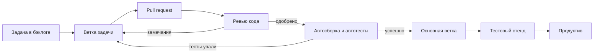

# А.8 Процесс разработки: от задачи до релиза

## Зачем это аналитику

Требование — только начало пути: дальше оценка, разработка, ревью кода, тестирование, сборка, выкладка. Аналитик, который понимает этот путь, пишет задачи, которые удобно брать в работу, правильно отвечает на вопрос «когда будет готово», понимает, почему «маленькое изменение» идёт две недели, и знает, где его участие нужно на каждом шаге.

## Готовность к модулю

Модуль вводный: специальной подготовки не нужно.

## Куда ведёт

Тема подробнее раскрывается в модулях:

- [А.9 Системные требования](a9-system-requirements.md)
- [2.6 WAL, репликация, миграции](../02-postgresql/2.6-wal-replication-migrations.md)
- [10.2 CI/CD и релизы](../10-infrastructure-delivery/10.2-cicd-release.md)
- [11.3 Оценка трудоёмкости](../11-architect-role/11.3-estimation.md)

## Что понять

- [ ] Жизненный цикл разработки: анализ, проектирование, разработка, тестирование, выкладка, сопровождение.
- [ ] Водопад и итеративные подходы; Scrum (роли, спринт, события, артефакты) и Kanban (поток, WIP-лимиты).
- [ ] Бэклог, декомпозиция на задачи, оценка в часах и в story points; Definition of Ready и Definition of Done.
- [ ] Git для аналитика: репозиторий, коммит, ветка, pull request, ревью кода — на уровне понятий.
- [ ] Тестирование: модульные, интеграционные, сквозные тесты, регресс; роль аналитика в тест-кейсах и приёмке.
- [ ] CI/CD как идея: автоматическая сборка, проверки и выкладка.
- [ ] Дефекты: хороший баг-репорт — шаги, ожидаемый и фактический результат, окружение, данные.
- [ ] Релиз, откат, хотфикс; почему выкладку часто отделяют от включения функции.

## Урок

<!-- LESSON:START -->
### Путь требования: жизненный цикл разработки

Любая доработка, от новой кнопки до новой системы, проходит один и тот же набор этапов. Его называют жизненным циклом разработки (software development life cycle, SDLC). Названия этапов в разных компаниях отличаются, суть одна.

| Этап | Что происходит | Что делает аналитик |
|---|---|---|
| Анализ | Выясняют, какую проблему решаем и что должно получиться | Выявляет и описывает требования, согласует их с бизнесом |
| Проектирование | Решают, как это устроить: какие системы, данные, интеграции | Пишет системную постановку, обсуждает решение с архитектором и разработкой |
| Разработка | Пишут код, меняют базу данных, настраивают интеграции | Отвечает на вопросы, уточняет требования, фиксирует изменения |
| Тестирование | Проверяют, что сделано то, что заказано, и ничего не сломано | Помогает составить тест-кейсы, разбирает спорные дефекты, участвует в приёмке |
| Выкладка | Новую версию устанавливают на рабочие серверы (в продуктив) | Готовит описание изменений, предупреждает пользователей и смежные команды |
| Сопровождение | Система работает, пользователи находят ошибки и просят улучшений | Разбирает обращения, отличает дефект от нового требования |

Аналитик присутствует на всех этапах, но с разной нагрузкой. Больше всего работы в начале. Дальше он становится источником ответов: чем лучше написана постановка, тем меньше вопросов на этапе разработки и тем меньше споров при приёмке.

Ошибку в требовании дешевле всего исправить до того, как по нему написан код. На ревью постановки она стоит одного разговора, в продуктиве — исправления кода, повторного тестирования, выкладки и иногда испорченных данных.

### Водопад и итерации

**Водопад (waterfall)** — этапы идут строго друг за другом. Сначала полностью собирают и утверждают требования, затем проектируют, затем разрабатывают и в конце тестируют. Плюс — предсказуемость: объём, срок и цена фиксируются заранее. Минус — обратная связь приходит поздно. Если бизнес понял, что хотел другого, это выясняется через полгода, когда переделка уже дорогая.

**Итеративный подход** — работа делится на короткие циклы. В каждом цикле делают небольшой кусок функциональности от анализа до работающего результата, показывают его и корректируют планы. Требования уточняются по ходу. Для аналитика это значит: не нужно описать всю систему до начала разработки, но нужно всегда иметь готовые к работе требования на ближайший цикл-два.

#### Scrum

Scrum — самый распространённый итеративный фреймворк. Он задаёт короткий набор правил.

Работа идёт **спринтами** (sprint) — циклами фиксированной длины, не больше месяца, чаще две недели. В конце каждого спринта должен получиться **инкремент** (increment) — работающий, проверенный кусок продукта.

Роли (в официальном руководстве Scrum Guide 2020 года они названы зонами ответственности, accountabilities):
- **Владелец продукта** (Product Owner) отвечает за ценность продукта и порядок работ в бэклоге. Он решает, что делать сначала.
- **Scrum-мастер** (Scrum Master) следит, чтобы команда работала по Scrum, и убирает препятствия. Он не начальник команды.
- **Разработчики** (Developers) — все, кто делает инкремент: программисты, тестировщики, аналитики. Отдельной роли аналитика в Scrum нет — он входит в число разработчиков.

События: сам спринт как рамка для остальных и четыре события внутри него — планирование спринта (что берём и зачем), ежедневная встреча на 15 минут (daily scrum — сверка хода работ), обзор спринта (review — показываем результат заинтересованным людям), ретроспектива (что улучшить в процессе).

Артефакты: бэклог продукта (всё, что может быть сделано), бэклог спринта (что взято в текущий спринт и план работ) и инкремент.

Регулярная работа над бэклогом — уточнение задач, разбиение, оценка — называется **груминг** или **рефайнмент** (backlog refinement). В Scrum это не отдельное событие, а постоянная работа по ходу спринта; многие команды всё же проводят для неё регулярные встречи. Это основное место работы аналитика в Scrum.

#### Kanban

Kanban устроен иначе: спринтов нет, работа идёт непрерывным **потоком**. Задачи движутся по колонкам доски: «Готово к работе» → «Анализ» → «Разработка» → «Тестирование» → «Готово». Когда исполнитель освобождается, он сам берёт следующую задачу — это называют вытягиванием (pull).

Главный инструмент — **WIP-лимит** (work in progress, незавершённая работа): максимум задач, которые одновременно могут находиться в колонке. Если в тестировании лимит 3 и там уже три задачи, разработчик не может «сбросить» туда четвёртую. Он помогает протестировать то, что уже есть. Лимиты не дают накапливать полуготовую работу и показывают узкое место: там, где постоянно упираются в лимит.

| | Scrum | Kanban |
|---|---|---|
| Ритм | Спринты фиксированной длины | Непрерывный поток |
| Что ограничивает объём | Что команда взяла в спринт | WIP-лимиты по колонкам |
| Изменение планов | Состав спринта по возможности не меняют | Приоритеты можно менять в любой момент |
| Где уместен | Разработка продукта с регулярными поставками | Поддержка, потоки обращений, мелкие доработки |

### Бэклог, декомпозиция и оценка

**Бэклог** (backlog) — упорядоченный список всего, что предстоит сделать. Сверху — ближайшие и хорошо проработанные задачи, внизу — идеи и крупные темы.

Крупные темы называют **эпиками** (epic). Эпик разбивают на пользовательские истории (user story — о них подробно в модуле А.9), а истории — на технические задачи: доработать базу, сделать метод API, сверстать экран, написать тесты.

Хорошая декомпозиция режет функцию «вертикально»: каждая история даёт пользователю что-то законченное, пусть и маленькое. Плохая — «горизонтально»: «сделать всю базу», «сделать весь бэкенд» (серверную часть с логикой), «сделать весь интерфейс». Такие куски нельзя показать бизнесу и нельзя проверить по отдельности.

Оценивают работу двумя способами.

**В часах или днях** — понятно менеджеру, но люди плохо предсказывают абсолютное время, особенно для незнакомой работы.

**В story points** (условных единицах сложности) — команда сравнивает задачи между собой: «эта примерно вдвое сложнее той». Часто используют ряд, похожий на числа Фибоначчи: 1, 2, 3, 5, 8, 13. Командная оценка нередко проходит как «покер планирования» (planning poker): все одновременно показывают карточки, а при большом расхождении обсуждают, кто что знает о задаче. По истории спринтов команда знает свою **скорость** (velocity) — сколько очков она закрывает за спринт.

#### Definition of Ready и Definition of Done

**Definition of Ready (DoR, критерии готовности к работе)** — договорённость команды, когда задачу можно брать в разработку. Это не часть официального Scrum, а распространённая практика. Типичный список:
- понятна цель и ценность;
- есть критерии приёмки;
- описаны затронутые данные и интеграции;
- есть макет экрана, если он нужен;
- зависимости от других команд известны;
- команда оценила задачу.

**Definition of Done (DoD, критерии завершённости)** — когда задачу можно считать сделанной. Например: код прошёл ревью, автотесты написаны и проходят успешно («зелёные»), функция проверена на тестовом стенде, документация обновлена.

Для аналитика DoR — это чек-лист его собственной работы: задача без критериев приёмки не должна попадать в спринт. DoD защищает от ситуации «код написан, значит готово», когда тестирование и документация остаются на потом.

### Git: где живёт код

Код хранят в **системе контроля версий**. Стандарт сегодня — Git. Понимать его на уровне понятий нужно по двум причинам: так устроен путь каждой вашей задачи, и всё чаще в Git хранят сами требования.

- **Репозиторий** (repository) — хранилище проекта со всей историей изменений.
- **Коммит** (commit) — зафиксированный снимок изменений с автором, датой и комментарием. По истории коммитов видно, кто, когда и зачем поменял строку.
- **Ветка** (branch) — отдельная линия изменений. Разработчик создаёт ветку под задачу и работает там, не мешая остальным. Основная ветка (обычно `main`) содержит то, что готово к выкладке.
- **Слияние** (merge) — перенос изменений из ветки задачи в основную.
- **Pull request** (в GitLab — merge request) — запрос на слияние. Разработчик показывает свои изменения и просит влить их в основную ветку.
- **Ревью кода** (code review) — проверка pull request коллегами. Второй человек замечает ошибки, нарушения договорённостей и места, которые автор не понял. Изменение попадает в основную ветку только после одобрения.

Для аналитика здесь две полезные привычки. Первая — ставить номер задачи в названии ветки и коммитов: тогда по задаче видно, какой код её реализует. Вторая — хранить требования рядом с кодом в Markdown — простом текстовом формате, где заголовки и списки размечаются символами («документация как код», docs as code). Тогда изменение требования тоже проходит через pull request и ревью, а история показывает, кто и когда поменял правило.



### Тестирование и роль аналитика

Тесты делят по масштабу проверки.

- **Модульные** (unit) — проверяют один маленький кусок кода отдельно от остального: например, функцию расчёта скидки. Их пишут разработчики, их много, они выполняются за секунды.
- **Интеграционные** (integration) — проверяют, что части работают вместе: сервис правильно пишет в базу, правильно вызывает чужой API.
- **Сквозные** (end-to-end, e2e) — проверяют сценарий целиком, как его проходит пользователь: зашёл, положил товар в корзину, оплатил, получил подтверждение. Их меньше, они медленные и хрупкие.
- **Регрессионное тестирование** (regression) — проверка, что старое не сломалось после изменений. Чем больше регресса автоматизировано, тем быстрее и безопаснее выкладки.

Окружения, где всё это происходит, обычно такие: машина разработчика, тестовый стенд (test), предпродуктивный стенд (stage, похож на продуктив по настройкам и данным) и продуктив (production, prod). Задача проходит их по очереди.

Роль аналитика в тестировании — источник ожидаемого результата. Тестировщик пишет тест-кейсы по критериям приёмки: если критерий размыт, тест-кейс тоже будет размыт. Хороший критерий уже почти готовый тест-кейс. Аналитик проверяет, что покрыты и ошибочные сценарии, а не только «счастливый путь». Он также участвует в **приёмке** (acceptance) — финальной проверке вместе с бизнесом, что функция решает исходную задачу. Приёмку пользователями часто называют UAT (user acceptance testing).

### CI/CD как идея

**Непрерывная интеграция** (continuous integration, CI) — при каждом изменении в репозитории автоматически собирается программа и прогоняются автотесты. Если что-то сломалось, это видно через минуты, а не через неделю.

**Непрерывная доставка** (continuous delivery, CD) — сборка, прошедшая проверки, автоматически доводится до состояния «можно выкладывать». Выкладка в продуктив — нажатие кнопки. Если и эта кнопка убрана и каждое успешное изменение уходит в продуктив само, это **непрерывное развёртывание** (continuous deployment).

Цепочку автоматических шагов называют **конвейером** (pipeline). Чем он лучше автоматизирован, тем дешевле каждая выкладка.

### Дефекты: как писать баг-репорт

Аналитик часто первым получает сообщение «что-то не работает». Превратить его в полезный баг-репорт — его работа. Разработчик должен воспроизвести ошибку, не задавая вопросов.

Состав хорошего баг-репорта:
- **Заголовок** — что и где сломано, одной фразой.
- **Окружение** — стенд, версия, браузер или приложение.
- **Предусловия и данные** — под каким пользователем, с каким заказом, какие настройки.
- **Шаги воспроизведения** — пронумерованные, без пропусков.
- **Ожидаемый результат** — со ссылкой на требование, если оно есть.
- **Фактический результат** — что произошло на самом деле, со снимком экрана или текстом ошибки.
- **Серьёзность** — насколько мешает работе.

Пример:

```text
Заголовок: При повторном заказе из истории не применяется промокод

Окружение: стенд test, веб-версия, Chrome
Данные: покупатель с id 1045, заказ 88231 в статусе «Доставлен»,
        промокод AUTUMN10 активен

Шаги:
1. Войти под покупателем 1045.
2. Открыть «Мои заказы», заказ 88231, нажать «Повторить заказ».
3. В корзине ввести промокод AUTUMN10, нажать «Применить».

Ожидаемый результат: скидка 10% на товары корзины
  (требование: «Промокоды», критерий 3).
Фактический результат: сообщение «Промокод недействителен»,
  скидка не применена. При сборке той же корзины вручную
  промокод применяется.
```

Отдельный навык — отличать дефект от нового требования. Если система делает то, что написано в постановке, но бизнес хотел другого, это не баг, а изменение требования. Его оценивают и планируют как новую работу.

### Релиз, откат, хотфикс

**Релиз** (release) — выкладка новой версии в продуктив. Если после выкладки обнаружилась серьёзная проблема, есть два пути. **Откат** (rollback) — вернуть предыдущую версию. **Хотфикс** (hotfix) — срочное исправление, которое идёт в продуктив вне обычного графика.

Откат не всегда прост. Если релиз поменял структуру базы данных или уже отправил данные в чужие системы, старая версия может не суметь работать с новыми данными. Поэтому изменения базы планируют так, чтобы старая и новая версии кода какое-то время уживались. Подробно это разбирается в модулях о миграциях и о релизах.

Отсюда распространённый приём — **отделить выкладку от включения функции**. Новый код выкладывают выключенным, за переключателем (feature flag, флаг функции). Включают его отдельно: сначала для сотрудников, потом для части покупателей, потом для всех. Если что-то пошло не так, функцию выключают переключателем — без отката и без новой выкладки. Кроме того, бизнес сам выбирает момент запуска: например, к началу рекламной кампании, а не к дате релиза.

Для аналитика это означает новые вопросы в постановке: нужен ли переключатель, кто и где его включает, как ведёт себя система при выключенной функции.

### Разбор: почему «маленькое изменение» идёт две недели

Бизнес просит: «Добавьте в заказ поле “Комментарий курьеру”. Это же одно поле». Посмотрим, что за этим стоит в команде со спринтами по две недели.

| Шаг | Что происходит | Время |
|---|---|---|
| Уточнение | Длина поля, где показывать, нужно ли курьерской службе, можно ли менять после оплаты | 1–2 дня с ожиданием ответов |
| Ожидание спринта | Спринт уже идёт, задача попадает в следующий | до двух недель |
| Разработка | Новый столбец в таблице заказов, поле в API, поле на экране, передача в систему доставки | 1–3 дня |
| Ревью и сборка | Ревью, замечания, повторное ревью | 1 день |
| Тестирование | Проверка нового поля и регресс оформления заказа | 1–2 дня |
| Согласование со смежниками | Курьерская служба должна принимать новое поле у себя | неизвестно |
| Выкладка | Релизы раз в неделю, окно выкладки — ночью | до недели |

Чистой работы здесь на несколько дней. Остальное — ожидание: ответов, спринта, смежной команды, релизного окна. Понимая это, аналитик может сократить срок: заранее собрать ответы (задача готова к спринту по DoR), сразу выяснить зависимость от смежной системы и договориться о ней параллельно. Там, где выкладки автоматизированы и частые, та же задача занимает дни.

Для бизнеса полезно разделять «сколько работы» и «когда будет в продуктиве»: второе обычно определяет процесс, а не трудоёмкость.

### Что дальше

Здесь процесс описан на уровне понятий. Как описывать саму задачу для разработки — user story, критерии приёмки, use case и спецификацию — разбирает модуль А.9. Как изменения базы данных выкатывают без остановки и почему откат миграции сложен, объясняет модуль 2.6. Конвейеры, стратегии выкладки и флаги функций подробно — в модуле 10.2, а методы оценки и работа с неопределённостью — в модуле 11.3.

### Типичные ошибки

- Отдавать в разработку задачу без критериев приёмки, рассчитывая «уточнить по ходу». Вопросы всплывают в середине спринта, и задача не успевает.
- Резать функцию горизонтально («база», «бэкенд», «фронт»): ни один кусок нельзя показать и принять отдельно.
- Переводить story points в часы и сравнивать скорость разных команд.
- Писать баг-репорт без данных и шагов: «не работает оформление заказа». Разработчик тратит время на воспроизведение или возвращает дефект.
- Называть дефектом то, что соответствует постановке, но не нравится бизнесу. Это изменение требования, его нужно оценить и спланировать.
- Обещать бизнесу срок, равный трудоёмкости, забыв об ожидании спринта, тестировании, зависимостях и релизном окне.
- Не думать о выключении функции: если нет переключателя и откат сложен, любая ошибка в продуктиве превращается в аварийный хотфикс.

### Как говорить об этом на собеседовании

На позицию junior или middle ждут понимания, где в процессе аналитик и что он отдаёт на каждом шаге. Расскажите процесс вашей команды конкретно: длина спринта, кто пишет критерии приёмки, что входит в DoR, как задача доходит до продуктива, сколько окружений. Покажите, что вы работаете с тестированием: пишете или ревьюите тест-кейсы, участвуете в приёмке, умеете отличить дефект от изменения требования.

Хорошо звучит пример из практики: задача вернулась из тестирования из-за неоднозначного критерия, и вы изменили шаблон постановки. На вопрос «Scrum или Kanban» лучше отвечать не выбором, а условиями: для продуктовой разработки с регулярными поставками чаще подходит Scrum, для потока обращений и поддержки — Kanban.

### Коротко

- Жизненный цикл: анализ, проектирование, разработка, тестирование, выкладка, сопровождение. Ошибка в требовании дешевле всего до начала разработки.
- Водопад фиксирует объём заранее, итерации дают раннюю обратную связь. Scrum — спринты, роли и события; Kanban — поток и WIP-лимиты.
- Бэклог разбивают на вертикальные куски; оценивают в часах или в относительных story points.
- DoR — когда задачу можно брать в работу, DoD — когда её можно считать сделанной. Для аналитика DoR — чек-лист собственной постановки.
- Git: ветка под задачу, pull request, ревью, слияние. Требования тоже можно хранить в Git.
- Тесты бывают модульные, интеграционные, сквозные; регресс проверяет, что старое не сломалось. Критерии приёмки — основа тест-кейсов.
- Хороший баг-репорт: окружение, данные, шаги, ожидаемый и фактический результат.
- Выкладку отделяют от включения функции флагами: так проще запускать постепенно и выключать без отката.
<!-- LESSON:END -->

## Читать дальше

- «Руководство по Скраму» (Scrum Guide) — короткий официальный документ.
- Дэвид Андерсон, «Канбан».
- Документация Git: «Git Basics» из книги Pro Git.

## Практика

1. Описать процесс своей команды (или знакомой команды) от идеи до продуктива: этапы, кто участвует, какие артефакты, где задержки.
2. Разбить обезличенную функцию на задачи для разработки и тестирования; для каждой указать критерий готовности.
3. Создать свой репозиторий на GitHub, закоммитить туда требования в Markdown, сделать ветку, изменить требование и открыть pull request самому себе.

## Вопросы для самопроверки

1. Из каких этапов состоит жизненный цикл разработки и где в нём аналитик?
2. Чем Scrum отличается от Kanban?
3. Что такое Definition of Ready и Definition of Done и зачем они аналитику?
4. Что такое pull request и зачем нужно ревью?
5. Что должно быть в хорошем баг-репорте?
6. Почему «маленькое изменение» может занимать две недели до продуктива?

## Заметки

<!-- Свои формулировки, ошибки, ссылки. -->
