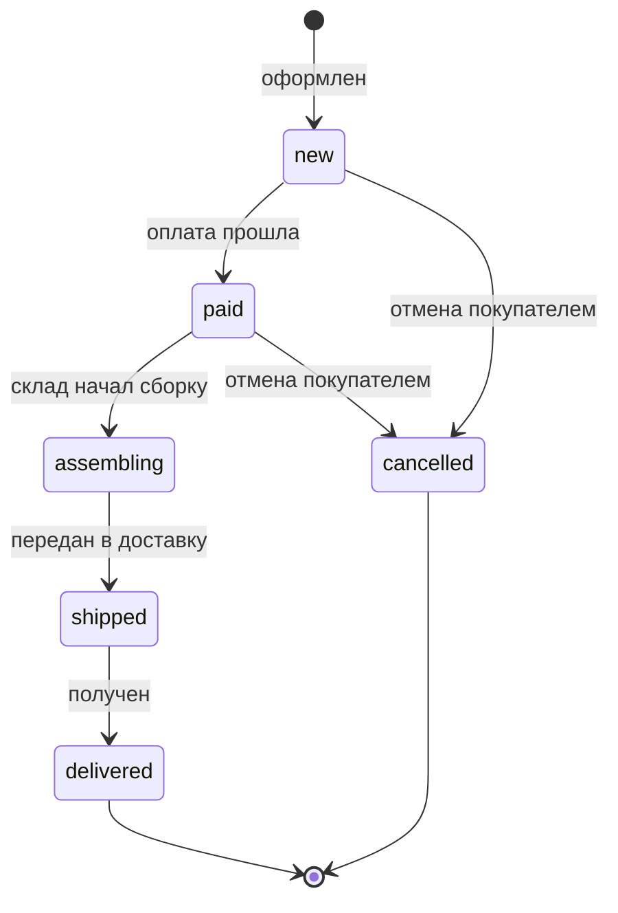
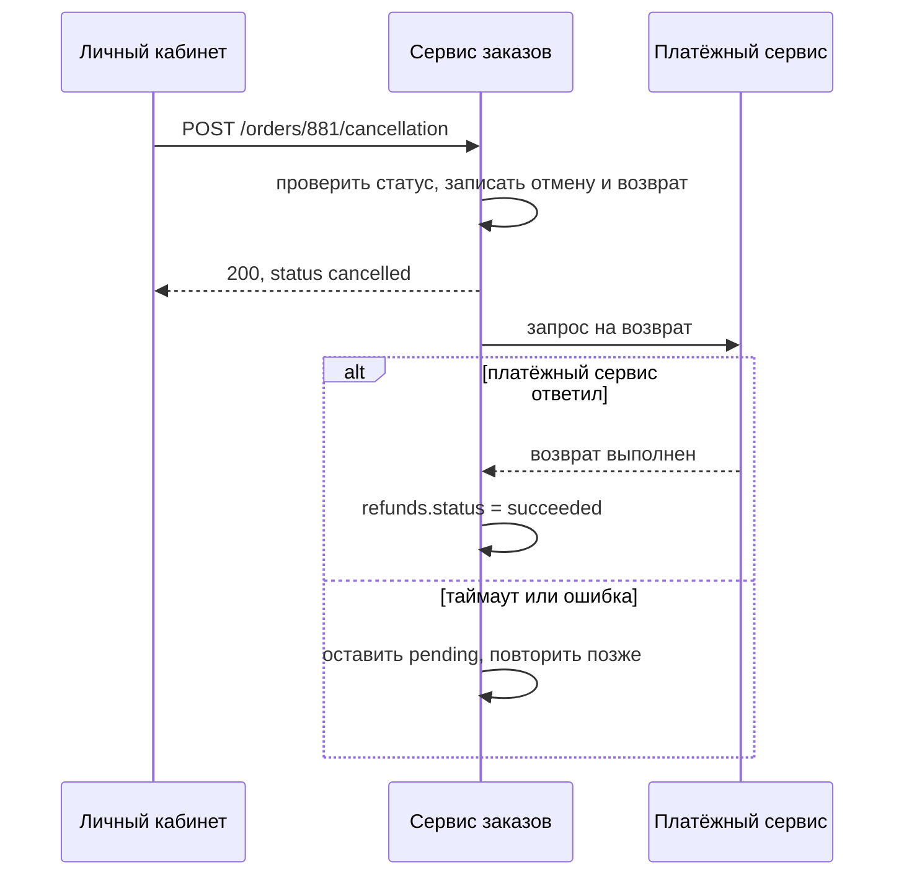

# А.9 От бизнес-требования к системному: user story, use case, спецификация

## Зачем это аналитику

Это модуль-переход: навыки бизнес-аналитика соединяются с техническими знаниями этапа. Бизнес-требование говорит, что нужно пользователю; системное — как именно система должна себя вести, какие данные, интеграции и ограничения. Здесь собирается всё из модулей А.1–А.8 в один документ, по которому можно разрабатывать и тестировать.

## Готовность к модулю

Модуль опирается на темы ниже. Если какая-то из них незнакома или её вопросы для самопроверки даются с трудом, начните с неё.

- [А.6 API и интеграции](a6-integrations-intro.md)
- [А.7 UML и BPMN](a7-uml-bpmn.md)
- [А.8 Процесс разработки](a8-dev-process.md)

## Куда ведёт

Тема подробнее раскрывается в модулях:

- [Б.7 Описание решения](../00b-bridge/b7-documenting-solutions.md)
- [3.2 Стратегический DDD](../03-microservices-ddd/3.2-strategic-ddd.md)
- [5.7 Требования к ИИ-функции](../05-ai-engineering/5.7-ai-feature-requirements.md)
- [6.1 Атрибуты качества](../06-architecture-practice/6.1-quality-attributes.md)
- [11.1 Стейкхолдеры](../11-architect-role/11.1-stakeholders.md)

## Что понять

- [ ] Уровни требований: бизнес-требования, пользовательские, функциональные системные, нефункциональные, ограничения.
- [ ] User story и её критерии приёмки; формат «Дано — Когда — Тогда» (Gherkin).
- [ ] Use case: основной сценарий, альтернативные и исключительные потоки, пред- и постусловия.
- [ ] Спецификация экрана: поля, проверки, состояния, сообщения об ошибках.
- [ ] Спецификация метода API и интеграции: запрос, ответ, ошибки, маппинг полей.
- [ ] Нефункциональные требования для начинающих: скорость, доступность, объёмы, безопасность — и как сделать их проверяемыми.
- [ ] Качество требований: однозначность, проверяемость, полнота; типичные слова-ловушки («быстро», «удобно», «и т. д.»).
- [ ] Трассировка: связь требований с задачами, тестами и изменениями.

## Урок

<!-- LESSON:START -->
### Уровни требований

Бизнес-аналитик привык работать с верхними уровнями требований. Системный аналитик доводит их до уровня, по которому можно писать код и тесты. Удобно различать пять видов.

| Вид | Отвечает на вопрос | Пример из интернет-магазина |
|---|---|---|
| Бизнес-требование | Зачем это компании, какой результат | Сократить обращения в поддержку по отмене заказов |
| Пользовательское | Что пользователь хочет сделать | Покупатель хочет сам отменить заказ |
| Функциональное системное | Как именно ведёт себя система | При отмене система меняет статус заказа на cancelled и создаёт возврат денег |
| Нефункциональное | Насколько хорошо: скорость, надёжность, объёмы, безопасность | 95% запросов на отмену обрабатываются быстрее 1 секунды |
| Ограничение | Что задано заранее и не обсуждается | Возврат денег проводится только через текущий платёжный сервис |

Бизнес-требование ничего не говорит о системе. Функциональное — ничего о бизнес-цели. Системная постановка связывает их: каждое системное требование можно проследить до бизнес-цели, а каждая бизнес-цель раскрыта в проверяемых требованиях.

Дальше весь модуль — один сквозной пример. Он собирает темы этапа: HTTP и JSON (А.2, А.3), таблицы (А.4), API и интеграции (А.6), диаграммы (А.7), критерии готовности (А.8).

### Сквозной пример: отмена заказа покупателем

#### Шаг 1. Бизнес-требование

Заметная доля обращений в поддержку — просьбы отменить заказ. Оператор вручную меняет статус и оформляет возврат денег, покупатель ждёт ответа. Бизнес-требование: «Покупатель может отменить заказ без участия оператора; доля обращений по отменам должна снизиться».

Первое, что делает системный аналитик, — задаёт вопросы, которые бизнес не задал. До какого момента заказ можно отменить? Что с деньгами, если заказ оплачен? Что со складским резервом? Можно ли отменить часть заказа? Ответы превращаются в требования или явно выносятся за рамки: «частичная отмена в этот релиз не входит».

Для примера договорились: отменить можно только весь заказ и только пока его не начали собирать на складе.

Чтобы это правило было однозначным, нужна модель статусов заказа — диаграмма состояний из модуля А.7. Статусы — значения столбца `orders.status` из модели данных модуля А.4 (new, paid, shipped, delivered, cancelled) плюс статус assembling («в сборке»), которым модель расширена в модуле А.7: без него правило «пока не начали собирать» не сформулировать. Диаграмма упрощена: только переходы, важные для отмены.



Теперь правило звучит точно: отмена возможна из статусов new и paid.

#### Шаг 2. User story и критерии приёмки

**Пользовательская история** (user story) — короткое описание потребности от лица пользователя. Классический шаблон: «Как <роль>, я хочу <действие>, чтобы <ценность>».

> Как покупатель, я хочу отменить заказ в личном кабинете, пока его не начали собирать, чтобы не звонить в поддержку и быстро получить деньги обратно.

История сама по себе — повод для разговора, а не спецификация. Спецификацией её делают **критерии приёмки** (acceptance criteria): условия, при выполнении которых история считается сделанной. Удобный формат — «Дано — Когда — Тогда» (Given — When — Then) из языка Gherkin. «Дано» — исходное состояние, «Когда» — действие, «Тогда» — проверяемый результат.

```gherkin
# language: ru
Функция: Отмена заказа покупателем

Сценарий: Отмена оплаченного заказа
  Дано заказ покупателя в статусе paid на сумму 4 500 руб.
  Когда покупатель отменяет заказ с причиной «Передумал»
  Тогда заказ переходит в статус cancelled
  И создаётся возврат на 4 500 руб. в статусе pending
  И покупатель получает письмо об отмене

Сценарий: Отмена невозможна после начала сборки
  Дано заказ в статусе assembling
  Когда покупатель открывает заказ
  Тогда кнопка «Отменить заказ» не показывается

Сценарий: Повторная отмена
  Дано заказ уже в статусе cancelled
  Когда приходит повторный запрос на отмену
  Тогда статус не меняется и второй возврат не создаётся
```

Хорошие критерии приёмки:
- описывают поведение, которое можно наблюдать, а не реализацию («создаётся возврат», а не «вызывается функция»);
- содержат конкретные данные — сумму, статус, текст;
- покрывают не только успешный путь, но и запреты, ошибки, повторы;
- каждый можно проверить одним тестом с ответом «да» или «нет».

Критерии в таком формате тестировщик почти без изменений превращает в тест-кейсы, а разработчик — в автотесты.

#### Шаг 3. Use case

История говорит, что нужно. **Вариант использования** (use case) подробно описывает, как идёт взаимодействие пользователя и системы шаг за шагом, включая все ответвления. История — короткая и удобна для планирования; use case — подробный и удобен, когда много ветвлений и ошибок. Их часто используют вместе: история в бэклоге, use case в постановке.

**UC-12. Отмена заказа покупателем**

- **Актор:** покупатель. **Участвуют:** платёжный сервис, сервис уведомлений.
- **Предусловия:** покупатель вошёл в личный кабинет; заказ принадлежит ему.
- **Постусловия при успехе:** заказ в статусе cancelled, записаны время и причина отмены; если заказ был оплачен — создан возврат.

Основной поток:
1. Покупатель открывает заказ в статусе paid и нажимает «Отменить заказ».
2. Система показывает окно с выбором причины.
3. Покупатель выбирает причину и подтверждает.
4. Система проверяет, что статус допускает отмену.
5. Система переводит заказ в cancelled и сохраняет причину и время.
6. Система создаёт возврат и передаёт его платёжному сервису.
7. Система показывает сообщение «Заказ отменён, деньги вернутся на карту» и отправляет письмо.

**Альтернативные потоки** — другие успешные пути:
- 1а. Заказ в статусе new (не оплачен): шаг 6 пропускается, сообщение без упоминания денег.
- 3а. Покупатель закрыл окно: заказ не меняется.

**Исключительные потоки** — что идёт не так:
- 4а. Пока покупатель выбирал причину, склад начал сборку. Система отказывает: «Заказ уже собирается, отмена недоступна. Обратитесь в поддержку».
- 6а. Платёжный сервис недоступен. Отмена всё равно фиксируется, возврат остаётся в статусе pending, система повторяет передачу позже. Покупатель видит обычное сообщение об отмене.

Поток 4а — классическая гонка: два события происходят почти одновременно. Такие места бизнес-требование не упоминает, а в продуктиве они случаются регулярно. Их поиск — одна из главных ценностей use case.

#### Шаг 4. Спецификация экрана

Для экрана описывают элементы, проверки, состояния и сообщения.

| Элемент | Правило |
|---|---|
| Кнопка «Отменить заказ» | Видна только при статусе new или paid |
| Причина отмены | Обязательный выбор из списка: «Передумал», «Нашёл дешевле», «Долгая доставка», «Другое» |
| Комментарий | Необязателен; обязателен, если выбрано «Другое»; до 500 символов |
| Кнопка «Подтвердить» | Неактивна, пока не выбрана причина; после нажатия блокируется до ответа, чтобы исключить двойной клик |
| Сообщение об ошибке 4а | «Заказ уже собирается, отмена недоступна. Обратитесь в поддержку» |
| Сбой связи | «Не удалось отменить заказ. Попробуйте ещё раз» |

Тексты сообщений — тоже требования. Если их не написать, разработчик покажет покупателю технический текст ошибки.

#### Шаг 5. Затронутые данные

Опираемся на модель из модуля А.4: customers, products, orders, order_items, order_status_history. Чего в ней не хватает, добавим в модель — это расширения, и в постановке их надо явно пометить как новые.

| Таблица | Что меняется |
|---|---|
| orders | Столбец status получает значение cancelled. Добавим в модель: значение assembling в список допустимых статусов (см. диаграмму выше), новый столбец cancel_reason (причина отмены) и новый столбец payment_id (идентификатор платежа в платёжном сервисе, заполняется при оплате — нужен для возврата) |
| order_status_history | Добавляется строка: order_id, status = cancelled, changed_at — время отмены |
| order_items | Только чтение: сумма возврата считается как сумма quantity, умноженного на price, по позициям заказа |
| refunds (новая таблица, добавим в модель) | refund_id, order_id (внешний ключ на orders), amount, status (pending, succeeded, failed), created_at |
| customers, products | Не меняются |

Отдельная таблица возвратов нужна, потому что у возврата свой жизненный цикл: он может зависнуть или завершиться ошибкой, и поддержке нужно это видеть. Складской резерв в этом примере не трогаем: по договорённости отмена возможна только до начала сборки.

#### Шаг 6. Метод API и интеграция

Экран вызывает метод серверного API. Отмена — действие, которое плохо ложится на «создать, прочитать, изменить, удалить». Один из распространённых вариантов — оформить её как отдельный ресурс «отмена заказа», как ниже; встречаются и другие, например `PATCH /orders/{orderId}` с новым статусом или `POST /orders/{orderId}/cancel`.

```yaml
paths:
  /orders/{orderId}/cancellation:
    post:
      summary: Отменить заказ покупателем
      parameters:
        - name: orderId
          in: path
          required: true
          schema:
            type: integer
      requestBody:
        required: true
        content:
          application/json:
            schema:
              type: object
              required: [reason]
              properties:
                reason:
                  type: string
                  enum: [changed_mind, found_cheaper, slow_delivery, other]
                comment:
                  type: string
                  maxLength: 500
      responses:
        '200':
          description: Заказ отменён (в том числе если был отменён ранее)
          content:
            application/json:
              schema:
                type: object
                properties:
                  orderId: { type: integer }
                  status: { type: string, example: cancelled }
                  refundStatus: { type: string, example: pending }
        '404':
          description: Заказ не найден или принадлежит другому покупателю
        '409':
          description: Статус заказа не допускает отмены
        '422':
          description: Не заполнен комментарий при причине other
```

Несколько решений здесь стоит явно проговорить в постановке. Это не единственно верные ответы, а один из разумных вариантов; важно, чтобы выбор был записан и одинаково понят всеми. Повторный запрос возвращает 200 и не создаёт второй возврат: так безопасно повторить вызов после таймаута (это идемпотентность из модуля А.6); другой вариант — 409, но тогда клиент должен понимать, что отмена на самом деле уже состоялась. Чужой заказ отвечает 404, а не 403 («доступ запрещён»), чтобы не подсказывать, что заказ с таким номером существует; многие API честно отвечают 403, и это тоже допустимо. Конфликт статуса — 409, и экран по нему показывает сообщение 4а. Ошибка в данных запроса — 422 («запрос понятен, но данные не проходят проверку»); часто для этого используют и 400.

Второй вызов — к платёжному сервису. Для интеграции нужна своя спецификация: кто инициатор, какие данные, что при ошибке.



Покупатель получает ответ, не дожидаясь платёжного сервиса: возврат уходит асинхронно. Поэтому сбой у партнёра не ломает отмену.

**Маппинг полей** (mapping) — таблица соответствия данных двух систем:

| Поле запроса на возврат | Источник | Правило |
|---|---|---|
| paymentId | orders.payment_id (добавлен в модель на шаге 5) | Без него возврат невозможен: исключительный поток |
| amount | refunds.amount | Перевести в копейки, целое число |
| currency | Константа | RUB |
| idempotencyKey | refunds.refund_id | Одинаков при всех повторах, чтобы деньги не вернулись дважды |

Полная спецификация интеграции включает также формат ошибок партнёра, таймаут, число и интервал повторов и действия при исчерпании повторов (например, возврат в статус failed и задача поддержке).

#### Шаг 7. Нефункциональные требования

Нефункциональные требования (НФТ) отвечают на вопрос «насколько хорошо». Главное правило — каждое должно быть проверяемым: у него есть число, условия и способ проверки.

| Плохо | Проверяемо |
|---|---|
| Отмена работает быстро | 95% вызовов метода отмены отвечают быстрее 1 секунды при нагрузке до 20 запросов в секунду; проверяется нагрузочным тестом |
| Система надёжна | Метод отмены доступен 99,9% времени за месяц, не считая согласованных окон работ |
| Выдерживает нагрузку | Рассчитано на 5 000 отмен в сутки, с пиком в дни распродаж втрое выше |
| Безопасно | Отменить заказ может только его владелец; попытка с чужим заказом записывается в журнал безопасности |
| Прозрачно для поддержки | Каждая отмена хранит, кто, когда и с какой причиной её сделал; поддержка видит статус возврата |

«95% вызовов быстрее 1 секунды» — это перцентиль: среднее время скрывает медленные ответы, а перцентиль показывает, сколько пользователей ждут дольше порога. Числа в таблице условные: их берут из статистики текущей системы и договорённостей с бизнесом, а не придумывают.

### Качество требований и слова-ловушки

Хорошее требование однозначно (все читатели понимают его одинаково), проверяемо (есть способ убедиться, что оно выполнено) и полно (описаны не только успех, но и ошибки, границы и права доступа).

Признаки плохого требования видны по словам.

| Слово-ловушка | Почему плохо | Как исправить |
|---|---|---|
| быстро, своевременно | У каждого своя скорость | Число, единица, условия нагрузки |
| удобно, интуитивно | Нельзя проверить | Конкретное поведение: «не больше двух нажатий», «поле заполнено по умолчанию» |
| и т. д., и прочее | Список не закончен | Полный перечень или правило отбора |
| по возможности, при необходимости | Непонятно, обязательно ли | Условие: когда именно |
| поддерживать | Неясно, что система делает | Глагол действия: хранит, показывает, отправляет |
| все, любой, всегда | Скрытые исключения | Проверить границы и исключения явно |

Другие признаки: в одном требовании несколько требований через «и»; описана реализация вместо поведения («кнопка вызывает процедуру в базе»); нет ответа на вопрос «а если нет данных» или «а если ошибка»; требование противоречит соседнему.

Простой тест: попросите тестировщика написать по требованию тест-кейс. Если он задаёт вопросы — требование не готово.

### Трассировка

**Трассировка** (traceability) — связь требования с тем, откуда оно пришло и во что превратилось. Она отвечает на вопросы: зачем сделана эта функция, всё ли требование реализовано и проверено, что затронет изменение правила.

| Уровень | Идентификатор в примере |
|---|---|
| Бизнес-требование | БТ-4 «Снизить обращения по отменам» |
| User story | US-31 «Отмена заказа покупателем» |
| Use case | UC-12 |
| Задачи разработки | Задачи на таблицу refunds, метод API, экран, интеграцию с платёжным сервисом |
| Тест-кейсы | По одному на каждый критерий приёмки и исключительный поток |
| Изменения | Запрос «Разрешить отмену при сборке» ссылается на US-31 и UC-12 |

Технически это ссылки: у требований есть идентификаторы, задачи в трекере ссылаются на них, тест-кейсы — на критерии, ветки и коммиты — на задачи (модуль А.8). Когда через полгода бизнес попросит разрешить отмену во время сборки, по ссылкам видно, что придётся менять: правило в UC-12, модель статусов, сообщение на экране, тесты — и что нужно договориться со складом.

### Что дальше

Здесь постановка собрана для одной функции и одного сервиса. Как описывать решение целиком — контекст, маппинг, обработку ошибок, альтернативы, — разбирает модуль Б.7. Точный язык атрибутов качества и сценарии для них — модуль 6.1. Границы между сервисами и общий язык с бизнесом — модуль 3.2, работа со стейкхолдерами — модуль 11.1, а особенности требований к функциям на основе ИИ — модуль 5.7.

### Типичные ошибки

- Считать user story готовой постановкой. Без критериев приёмки она не проверяема.
- Описывать только успешный путь. Гонки, повторы, недоступность партнёра и чужие данные находятся потом в продуктиве.
- Писать критерии через реализацию («вызвать процедуру») вместо наблюдаемого поведения.
- Оставлять НФТ без чисел и способа проверки: «быстро», «надёжно», «безопасно».
- Не описывать тексты ошибок и состояния экрана — их придумает разработчик.
- Забывать о данных: новые статусы, столбцы и таблицы должны быть в постановке, а не появляться в ходе разработки.
- Не давать требованиям идентификаторов — без них нет трассировки, и изменение нельзя оценить.

### Как говорить об этом на собеседовании

На позиции junior и middle часто дают задачу: «Опишите требования к функции отмены заказа». Показывайте путь по уровням: цель бизнеса, история, критерии приёмки в формате «Дано — Когда — Тогда», use case с исключениями, затронутые данные, метод API с кодами ответов, НФТ с числами. Говорите вслух о вопросах, которые зададите бизнесу, прежде чем писать.

Уровень выше среднего показывают детали: вы сами называете гонку статусов, повторный запрос и недоступность партнёра; объясняете, почему возврат асинхронный; переписываете «быстро» в перцентиль с нагрузкой. На вопрос «user story или use case» отвечайте условием: история — для планирования и небольших функций, use case — когда много ветвлений и участников.

### Коротко

- Требования идут по уровням: бизнес, пользовательские, функциональные, нефункциональные, ограничения. Системная постановка связывает их.
- User story задаёт потребность; критерии приёмки «Дано — Когда — Тогда» делают её проверяемой.
- Use case раскрывает шаги, альтернативные и исключительные потоки, пред- и постусловия. Главная ценность — найденные исключения.
- Спецификация экрана — поля, проверки, состояния и тексты сообщений.
- Спецификация API и интеграции — запрос, ответ, коды ошибок, маппинг полей, повторы и таймауты.
- НФТ проверяемо, если у него есть число, условия и способ проверки.
- Слова «быстро», «удобно», «и т. д.» — сигнал переписать требование.
- Трассировка связывает цель, историю, задачи, тесты и изменения — и позволяет оценить последствия правки.
<!-- LESSON:END -->

## Читать дальше

- Карл Вигерс, Джой Битти, «Разработка требований к программному обеспечению» — части I–II.
- Алистер Коберн, «Современные методы описания функциональных требований к системам» — про use case.
- Майк Кон, «Пользовательские истории».

На system-design.space:

- [Software Requirements (краткий обзор)](https://system-design.space/chapter/wigers-requirements-book/)

## Практика

1. Взять обезличенное бизнес-требование («покупатель хочет вернуть товар») и довести его до системной постановки: user story с критериями приёмки, use case с альтернативными потоками, изменения в модели данных, метод API.
2. Найти в своих старых требованиях (обезличенно) пять неоднозначных формулировок и переписать их проверяемо.
3. Собрать итоговую мини-постановку для критерия завершения этапа.

## Вопросы для самопроверки

1. Чем бизнес-требование отличается от системного? Приведите пример.
2. Как написать хорошие критерии приёмки?
3. Чем use case отличается от user story и когда что использовать?
4. Как сделать нефункциональное требование проверяемым?
5. Что входит в спецификацию интеграции?
6. Какие признаки плохо написанного требования вы знаете?

## Заметки

<!-- Свои формулировки, ошибки, ссылки. -->
