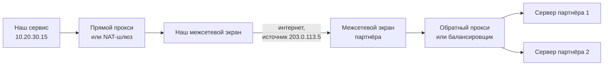

# Б.1 Сеть для интеграций: IP, порты, DNS, TCP, прокси

## Зачем это аналитику

Фраза «у партнёра не проходит запрос» может означать десяток разных проблем: имя не резолвится, порт закрыт на межсетевом экране, запрос ушёл не через тот прокси, соединение рвётся по таймауту. Аналитик, который знает, как пакет доходит до сервера, пишет требования к сетевому доступу сразу правильно и сокращает разбор инцидентов с дней до часов.

## Готовность к модулю

Модуль опирается на темы ниже. Если какая-то из них незнакома или её вопросы для самопроверки даются с трудом, начните с неё.

- [А.2 Как работает веб](../00a-foundations/a2-web-http-basics.md)

## Куда ведёт

Тема подробнее раскрывается в модулях:

- [Б.2 Основы безопасности](b2-security-basics.md)
- [1.1 Путь HTTP-запроса](../01-http-rest-security/1.1-request-lifecycle.md)
- [3.3 OSI, балансировщик, gateway](../03-microservices-ddd/3.3-network-gateway-lb.md)

## Что понять

- [ ] Стек TCP/IP: прикладной, транспортный, сетевой и канальный уровни — что делает каждый. Соответствие модели OSI в общих чертах.
- [ ] IP-адрес, подсеть, частные и публичные адреса, NAT. Почему партнёр просит «список IP для белого списка».
- [ ] Порт и сокет; стандартные порты (80, 443, 5432, 22) и почему на сервере может работать много сервисов.
- [ ] DNS подробнее: записи A, AAAA, CNAME, TTL, кэширование; почему смена IP «доезжает» не сразу.
- [ ] TCP и UDP: установка соединения, гарантия доставки и порядка, цена этого. Где используется UDP.
- [ ] Межсетевой экран, прокси, обратный прокси и балансировщик: кто и где стоит на пути запроса.
- [ ] Инструменты диагностики: ping, nslookup/dig, traceroute, curl -v, telnet/nc для проверки порта.
- [ ] Что писать в заявке на сетевой доступ: источник, назначение, порт, протокол, направление.

## Урок

<!-- LESSON:START -->
Запрос к партнёру проходит через несколько независимых механизмов: имя превращается в адрес, адрес ведёт в нужную сеть, порт — к нужной программе, а по пути стоят узлы, которые могут пропустить пакет, отбросить его или подменить адрес. Урок раскладывает этот путь на части, чтобы по симптому понимать, какая часть отказала, и писать заявку на сетевой доступ полной с первого раза.

### Стек TCP/IP: кто за что отвечает

Сетевое взаимодействие устроено слоями. Каждый слой решает одну задачу и пользуется услугами слоя ниже, не вникая в его устройство. В интернете и корпоративных сетях работает стек TCP/IP из четырёх уровней.

| Уровень TCP/IP | Задача | Примеры протоколов | Адресация | Соответствие OSI |
|---|---|---|---|---|
| Прикладной | Смысл обмена: что запрашиваем и что получаем | HTTP, DNS, SMTP, SSH, протокол PostgreSQL | URL, имя хоста | L5–L7 |
| Транспортный | Доставка данных конкретной программе, при необходимости — надёжная и по порядку | TCP, UDP | Порт | L4 |
| Сетевой (межсетевой) | Доставка пакета между сетями через маршрутизаторы | IP, ICMP | IP-адрес | L3 |
| Канальный | Передача кадра между соседними устройствами в одном сегменте | Ethernet, Wi-Fi | MAC-адрес | L1–L2 |

Модель OSI из семи уровней — эталонная схема, общий язык. Когда говорят «L4-балансировщик» или «L7-прокси», номера берут именно из OSI: L4 — транспорт, L7 — приложение. Уровни 5 и 6 OSI (сеансовый и представления) в реальном стеке отдельно не выделяются, их функции растворены в прикладном протоколе и в TLS. Шифрование TLS работает поверх TCP и под HTTP, поэтому его условно помещают между транспортом и приложением.

Механизм, который связывает уровни, — инкапсуляция (encapsulation). HTTP-запрос становится полезной нагрузкой TCP-сегмента, сегмент кладётся в IP-пакет, пакет — в кадр Ethernet. Каждый уровень добавляет свой заголовок. На пути маршрутизаторы снимают и заново формируют кадр для следующего участка, поэтому MAC-адреса меняются на каждом шаге. IP-адреса отправителя и получателя обычно сохраняются от начала до конца, если по пути нет NAT (о нём ниже). Порты и содержимое запроса маршрутизатору не нужны.

Практический вывод: устройство видит только те уровни, которые разбирает. Маршрутизатор работает с IP-адресами, межсетевой экран обычно — с адресами и портами. Чтобы увидеть URL или заголовок, нужен компонент, который разбирает HTTP, а для HTTPS ещё и расшифровывает TLS. Эту мысль развивает модуль 3.3.

### IP-адреса, подсети и NAT

IP-адрес версии 4 — 32 бита, записанные четырьмя числами от 0 до 255: `203.0.113.10`. Адреса IPv6 длиннее (128 бит) и пишутся шестнадцатеричными группами через двоеточие. У сервиса может быть и тот и другой адрес, и в требованиях стоит явно сказать, какой используется.

#### Подсеть и запись CIDR

Адреса выделяются диапазонами — подсетями. Подсеть записывают в нотации CIDR: `10.20.30.0/24`. Число после косой черты — сколько бит слева фиксировано. `/24` фиксирует первые три числа, в подсети 256 адресов, от `10.20.30.0` до `10.20.30.255`. `/32` — ровно один адрес. `/16` — 65 536 адресов. Чем меньше число после косой черты, тем шире диапазон.

«Откройте доступ с 198.51.100.0/28» означает 16 адресов, а не один. А просьба открыть «10.0.0.0/8» — это вся огромная частная сеть, почти наверняка ошибка.

#### Частные и публичные адреса

Часть адресного пространства зарезервирована для внутренних сетей и в интернете не маршрутизируется. Это частные адреса (private addresses):

- `10.0.0.0/8`;
- `172.16.0.0/12` (от 172.16 до 172.31);
- `192.168.0.0/16`.

Серверы в дата-центре, поды в Kubernetes, ноутбуки в офисе обычно имеют частные адреса, и одни и те же диапазоны используют тысячи организаций. Публичные адреса уникальны в интернете и выдаются провайдерами.

#### NAT

Трансляция сетевых адресов (Network Address Translation, NAT) позволяет машинам с частными адресами ходить в интернет. Узел NAT на границе сети подменяет в исходящем пакете частный адрес отправителя на свой публичный, а порт отправителя — на свободный порт из своего пула. В таблице трансляций он запоминает соответствие, и когда приходит ответ, выполняет обратную подмену. Так сотни внутренних машин выходят наружу через один или несколько публичных адресов.

Отсюда просьба партнёра «дайте список IP для белого списка». Партнёр видит запрос не от вашего сервера `10.20.30.15`, а от публичного адреса вашего NAT-шлюза, прокси или межсетевого экрана. Именно этот адрес и нужно сообщить. Типичные ловушки:

- Разработчик смотрит IP своего сервера командой в консоли, видит частный адрес и отправляет его партнёру. Доступ не заработает.
- Исходящий трафик из облака идёт через адрес, который может смениться при пересоздании инфраструктуры. Для белых списков нужен закреплённый публичный адрес выхода.
- Тестовая и промышленная среды выходят через разные адреса. Партнёру нужно сообщить оба набора, и это часто забывают.

Бывает и обратное направление (проброс портов): входящий запрос на публичный адрес и порт перенаправляется на частный адрес внутреннего сервера.

### Порты и сокеты

IP-адрес доставляет пакет до машины, а какой из программ на ней он адресован, определяет порт — число от 0 до 65 535. Программа-сервер «слушает» порт, и операционная система передаёт ей всё, что на него приходит.

Стандартные порты, которые встретятся в требованиях постоянно:

| Порт | Протокол | Что обычно работает |
|---|---|---|
| 22 | TCP | SSH, а также SFTP для обмена файлами |
| 53 | UDP и TCP | DNS |
| 80 | TCP | HTTP без шифрования |
| 443 | TCP (и UDP для HTTP/3) | HTTPS |
| 5432 | TCP | PostgreSQL |

Стандартный порт — договорённость, а не закон. Сервис может слушать любой порт, и если в URL порт не указан, клиент подставляет стандартный для схемы: 443 для `https`, 80 для `http`. Поэтому `https://api.partner.example:8443/v1` и `https://api.partner.example/v1` — разные точки подключения, и в заявке на доступ это разные правила.

Сокет (socket) — конечная точка соединения: IP-адрес плюс порт. Соединение TCP однозначно определяется четвёркой: адрес и порт клиента, адрес и порт сервера. Клиент при подключении получает от операционной системы временный (эфемерный, ephemeral) порт, обычно из верхнего диапазона. Поэтому на один серверный порт 443 одновременно могут приходить тысячи соединений: четвёрки у них различаются клиентскими адресами и портами.

По той же причине на одном сервере уживается много сервисов: база слушает 5432, веб-сервер — 443, SSH — 22, и операционная система разводит соединения по номеру порта. Два процесса не могут слушать один порт на одном адресе: второй получит ошибку «адрес уже используется».

### DNS: как имя превращается в адрес

Система доменных имён (DNS) — распределённый справочник: записи хранят авторитетные серверы зоны, а клиенты спрашивают рекурсивный резолвер, который находит ответ и кэширует его. Обход иерархии и уровни кэширования подробно разобраны в модуле 1.1, здесь нужны типы записей и смысл TTL.

| Запись | Что содержит | Пример |
|---|---|---|
| A | IPv4-адрес имени | `api.shop.example. 300 IN A 203.0.113.10` |
| AAAA | IPv6-адрес имени | `api.shop.example. 300 IN AAAA 2001:db8::10` |
| CNAME | Имя-псевдоним: «смотри другое имя» | `www.shop.example. 3600 IN CNAME shop-lb.cdn.example.` |
| MX | Почтовые серверы домена с приоритетом | `shop.example. 3600 IN MX 10 mail.shop.example.` |

Число во втором столбце примера — TTL (time to live) в секундах: сколько резолвер или клиент может хранить ответ, не спрашивая снова. У имени может быть несколько записей A — тогда клиент получает несколько адресов и выбирает один. Это простейший способ распределения нагрузки, хотя и грубый.

CNAME удобен, когда сервис размещён у провайдера, который сам управляет адресами: вы указываете псевдоним на имя провайдера, и тот меняет IP без вашего участия. Цена — дополнительный шаг разрешения.

#### Почему смена IP «доезжает» не сразу

Резолверы по всему миру получили запись в разное время и хранят её до истечения TTL. Если у записи TTL сутки, то после смены адреса часть клиентов будет ходить на старый адрес ещё до суток. Кроме того, кэшируют не только резолверы, но и операционные системы, рантаймы языков и сами приложения, а открытое соединение вообще не обращается к DNS, пока живёт. Поэтому перед плановым переездом TTL снижают заранее (минимум на старое значение TTL до переезда), а старый адрес какое-то время держат рабочим.

Короткий TTL не бесплатен: каждый промах кэша добавляет задержку к запросу. Обычная практика — умеренный TTL в спокойном режиме и сниженный на время переездов.

### TCP и UDP

Транспортных протокола два, и они дают принципиально разные гарантии.

#### TCP: соединение, надёжность, порядок

TCP (Transmission Control Protocol) сначала устанавливает соединение трёхсторонним рукопожатием: клиент отправляет SYN, сервер отвечает SYN-ACK, клиент подтверждает ACK. После этого стороны обмениваются потоком байтов.

TCP нумерует байты, получатель подтверждает принятое, а потерянное отправитель пересылает повторно. Приложение получает данные без пропусков и строго в том порядке, в каком они были отправлены. Плюс управление потоком и перегрузкой: отправитель не заваливает медленного получателя и перегруженную сеть.

Цена гарантий: рукопожатие стоит один полный оборот туда и обратно (RTT, round-trip time) до первого байта данных, а поверх ещё TLS; при потере фрагмента следующие данные не отдаются приложению, пока он не придёт повторно; состояние соединения хранят обе стороны и промежуточные узлы, и оно может «протухнуть». Как RTT складываются во время вызова и какие таймауты что меряют — тема модуля 1.1.

#### UDP: отправил и забыл

UDP (User Datagram Protocol) не устанавливает соединения и ничего не гарантирует. Каждая датаграмма отправляется независимо, может потеряться, прийти дважды или не по порядку. Зато нет рукопожатия, нет ожидания повторных отправок, заголовок минимальный.

UDP выбирают, когда свежесть данных важнее полноты или когда надёжность проще сделать самостоятельно поверх:

- DNS: короткий запрос и короткий ответ, повторить проще, чем устанавливать соединение (для больших ответов DNS переходит на TCP);
- голос и видео в реальном времени: опоздавший кадр бесполезен, его не нужно перепосылать;
- синхронизация времени (NTP), сбор метрик и журналов, где потеря единичной записи допустима;
- QUIC и HTTP/3: протокол реализует надёжность сам, но поверх UDP.

Интеграции между информационными системами почти всегда идут по TCP: HTTP до версии 2 включительно, протоколы баз данных и брокеров, SFTP.

### Кто стоит на пути запроса

Между клиентом и приложением почти всегда есть посредники. Их важно различать, потому что каждый отказывает по-своему и каждому нужны свои требования.



**Межсетевой экран (firewall)** пропускает или отбрасывает трафик по правилам: адрес и порт источника, адрес и порт назначения, протокол. Современные экраны запоминают состояние соединений (stateful): если исходящее соединение разрешено, ответный трафик по нему пропускается автоматически. Поэтому правило пишут по направлению инициации: кто открывает соединение. Если правила нет, экран обычно молча отбрасывает пакет, и клиент ждёт до таймаута, не получая никакой ошибки. Отличие от закрытого порта на живом сервере: там сервер сразу отвечает отказом, и клиент мгновенно получает «connection refused».

**Прямой прокси (forward proxy)** работает от имени клиента. Внутренние сервисы ходят в интернет через него: организация контролирует исходящий трафик и получает единый адрес выхода для белых списков. Приложение должно знать о прокси из настроек HTTP-клиента или переменных окружения. Типичный инцидент — у одного сервиса прокси настроен, у другого нет, и второй «не видит» партнёра.

**Обратный прокси (reverse proxy)** работает от имени сервера: клиент подключается к нему как к серверу, а прокси пересылает запрос внутреннему приложению, скрывая структуру за собой; может завершать TLS, кэшировать, фильтровать.

**Балансировщик нагрузки (load balancer)** — обратный прокси, основная задача которого распределять запросы между несколькими одинаковыми экземплярами сервиса и не отправлять трафик на неисправные. Балансировщики различают по уровню: L4 работает с соединениями и не видит HTTP, L7 разбирает HTTP и может маршрутизировать по пути. Эта разница и роль API gateway разбираются в модуле 3.3.

Отличие прямого прокси от обратного — в том, чьи интересы он представляет и кто о нём знает. Прямой прокси настраивает клиент. Обратный прокси настраивает владелец сервера, клиент о нём обычно не знает. В обоих случаях получатель видит адрес прокси, а не исходного отправителя; как передать реальный адрес клиента через заголовки и почему им нельзя слепо доверять, объясняется в модуле 1.1.

### Инструменты диагностики

Диагностика проходит путь запроса снизу вверх и ищет первый шаг, который не работает.

| Инструмент | Что проверяет | Как читать результат |
|---|---|---|
| `nslookup имя`, `dig имя` | Разрешение имени | Нет ответа или NXDOMAIN — проблема DNS. Адрес не тот, что ожидали, — кэш, ошибка в записи или внутренний DNS отличается от внешнего |
| `ping адрес` | Доступность узла по ICMP и RTT | Ответ есть — узел жив и маршрут есть. Ответа нет — ещё не значит, что узел недоступен: ICMP часто запрещён |
| `traceroute` (в Windows `tracert`) | Маршрут через маршрутизаторы | Где обрываются ответы. Звёздочки в середине пути нормальны, если дальше ответы появляются |
| `nc -vz хост порт`, `telnet хост порт` | Открыт ли TCP-порт | Соединение установлено — сеть до порта в порядке. Refused — узел доступен, порт никто не слушает. Зависание — трафик отбрасывается по пути |
| `curl -v URL` | Весь путь до HTTP: резолв, подключение, TLS, запрос, ответ | Видно, на каком этапе остановилось. Если пришёл HTTP-ответ, сеть работает, дальше — приложение |

В Windows вместо `nc` удобна команда PowerShell `Test-NetConnection хост -Port 443`.

Проверять нужно с той же машины, откуда ходит приложение. Проверка с ноутбука аналитика ничего не говорит о промышленном сервере: у него другой выход в интернет, другой DNS, другие правила экрана.

Главный вопрос разбора — сеть это или приложение. Ответ даёт последний успешный шаг. Если `curl -v` показывает, что соединение установлено, TLS согласован и пришёл ответ с кодом 401, 404 или 500, сеть свою работу выполнила: проблема в авторизации, адресе ресурса или логике сервера. Если зависает подключение к порту, проблема сетевая: правила экрана, маршрутизация, неверный адрес.

Сокращённый вывод `curl -v` выглядит примерно так (формат зависит от версии; звёздочка — служебные сообщения о соединении, «больше» — отправленный запрос, «меньше» — ответ):

```text
* Host api.partner.example:443 was resolved.
* IPv4: 203.0.113.10
*   Trying 203.0.113.10:443...
* Connected to api.partner.example (203.0.113.10) port 443
* SSL connection using TLSv1.3 / ...
* Server certificate:
*  subject: CN=api.partner.example
> GET /v1/status HTTP/1.1
> Host: api.partner.example
< HTTP/1.1 200 OK
```

### Разбор: подключение банка к партнёру

Банк для юрлиц подключает сервис выписок к внешнему агрегатору бухгалтерских данных. Агрегатор будет забирать выписки по HTTPS из API банка, а банк — отправлять агрегатору уведомления о новых выписках. Агрегатор требует белый список IP с обеих сторон.

Легко написать одну заявку «открыть доступ между банком и агрегатором». Но направлений два, и у каждого свои источник, назначение и правила. Вторая ловушка — адреса: во входящем направлении агрегатор ходит на публичный адрес балансировщика банка, а не на сервер, в исходящем банк выходит через NAT-шлюз.

Заявка раскладывается на строки таблицы:

| Направление | Источник | Назначение | Порт и протокол | Назначение правила |
|---|---|---|---|---|
| Входящее, инициатор агрегатор | 198.51.100.0/28 (адреса агрегатора, пром) | Балансировщик банка 203.0.113.20 | TCP 443, HTTPS, TLS 1.2 и выше | Выдача выписок через API |
| Исходящее, инициатор банк | Сервис уведомлений, выход через NAT-шлюз 203.0.113.5 | api.aggregator.example, адреса 198.51.100.40–41 | TCP 443, HTTPS | Уведомления о новых выписках |
| Исходящее, тест | Тестовый контур, выход через 203.0.113.6 | sandbox.aggregator.example | TCP 443, HTTPS | Тестирование интеграции |

К таблице добавляются пункты, без которых сетевики вернут заявку или сделают не то:

- среда: тест и пром — разные строки и часто разные адреса;
- назначение указано и именем, и адресами, с оговоркой, что адреса по имени могут меняться, и договорённостью, как партнёр предупреждает о смене;
- требования к шифрованию: только TLS, минимальная версия, при необходимости взаимная аутентификация сертификатами;
- срок действия правила, если доступ временный;
- ответственные и способ проверки после открытия, например `curl -v` с конкретного сервера до конкретного адреса.

Правило для ответного трафика не нужно: экран с учётом состояния пропустит ответы сам.

### Что дальше

Сколько RTT стоит новое HTTPS-соединение, как кэши DNS ведут себя на разных уровнях, чем connect timeout отличается от read timeout и как передаётся реальный IP клиента через цепочку прокси, разбирается в модуле 1.1. Что именно происходит в рукопожатии TLS и почему клиент доверяет сертификату сервера — в модулях Б.2 и 1.2. Чем L4-балансировщик отличается от L7, когда нужен API gateway и что такое service mesh — в модуле 3.3.

### Типичные ошибки

- Отправлять партнёру для белого списка частный адрес сервера вместо публичного адреса выхода через NAT или прокси, либо забывать про адреса тестового контура.
- Писать одну заявку на двусторонний обмен, не разделяя направления инициации, или просить правила для ответного трафика.
- Считать, что «ping не проходит» означает «сервер недоступен». ICMP часто закрыт, а нужный TCP-порт при этом открыт.
- Проверять доступ со своего ноутбука и делать вывод о доступе с сервера приложения.
- Путать «connection refused» и зависание до таймаута. Первое — порт никто не слушает, второе — трафик отбрасывается по пути.
- Менять адрес сервиса, не снизив заранее TTL и не сохранив старый адрес рабочим на переходный период.

### Как говорить об этом на собеседовании

От аналитика уровня middle/senior ждут не пересказа модели OSI, а умения провести инцидент по слоям. Ответ на «у партнёра не проходит запрос» — это план: разрешение имени с сервера приложения, доступность порта через `nc` или `curl -v`, TLS, HTTP-ответ. Для каждого шага назовите, что означает симптом: мгновенный отказ, зависание, ошибка сертификата, HTTP-код. И подчеркните, что проверять нужно из того же контура, что и приложение.

Второй сильный сюжет — постановка сетевых требований. Расскажите, как вы оформляете доступ: по строке на направление, с источником, назначением, портом, протоколом, средой, адресами выхода через NAT и требованиями к шифрованию, и как договариваетесь с партнёром о смене адресов и TTL. Это показывает, что вы видите интеграцию как систему с инфраструктурой, а не только как набор методов API.

### Коротко

- Стек TCP/IP: канальный уровень передаёт кадры между соседями, сетевой доставляет пакеты между сетями по IP, транспортный — конкретной программе по порту, прикладной задаёт смысл обмена.
- Частные адреса не видны из интернета. Партнёр видит публичный адрес вашего NAT-шлюза или прокси, и именно его вносят в белый список.
- Порт выбирает программу на машине, сокет — это адрес плюс порт, соединение определяется четвёркой адресов и портов.
- DNS кэшируется на время TTL, поэтому смена адреса доезжает постепенно; TTL снижают до переезда.
- TCP даёт надёжную упорядоченную доставку ценой рукопожатия и задержек при потерях; UDP ничего не гарантирует и подходит для DNS, реального времени и QUIC.
- Прямой прокси действует от имени клиента, обратный прокси и балансировщик — от имени сервера; межсетевой экран с учётом состояния пропускает ответы сам.
- Диагностика идёт снизу вверх: имя, порт, TLS, HTTP. Если пришёл HTTP-ответ, сеть отработала.
- Заявка на доступ: источник, назначение, порт, протокол, направление инициации, среда, требования к шифрованию.
<!-- LESSON:END -->

## Читать дальше

- Куроуз, Росс, «Компьютерные сети. Нисходящий подход» — главы 1–3.
- Julia Evans, серия зинов о сетях и DNS — лёгкое введение с картинками.

На system-design.space:

- [Модель OSI](https://system-design.space/chapter/osi-model/)
- [Протокол TCP](https://system-design.space/chapter/tcp-protocol/)
- [Система доменных имён (DNS)](https://system-design.space/chapter/dns/)
- [Компьютерные сети: принципы, технологии, протоколы (short summary)](https://system-design.space/chapter/computer-networks-principles-book/)

## Практика

1. Выполнить curl -v к нескольким публичным HTTPS-сайтам и разобрать вывод: резолв, подключение к IP и порту, TLS, запрос, ответ.
2. С помощью nslookup или dig посмотреть A-, CNAME- и MX-записи нескольких доменов и их TTL.
3. Составить обезличенную заявку на сетевой доступ для интеграции с внешним партнёром: кто к кому, по каким адресам и портам, с какими требованиями к шифрованию.

## Вопросы для самопроверки

1. Что делает каждый уровень стека TCP/IP?
2. Зачем нужен NAT и как он влияет на белые списки IP?
3. Чем TCP отличается от UDP?
4. Почему после смены IP-адреса сервиса часть клиентов продолжает ходить на старый адрес?
5. Чем прокси отличается от обратного прокси?
6. Как проверить, что проблема именно в сети, а не в приложении?

## Заметки

<!-- Свои формулировки, ошибки, ссылки. -->
