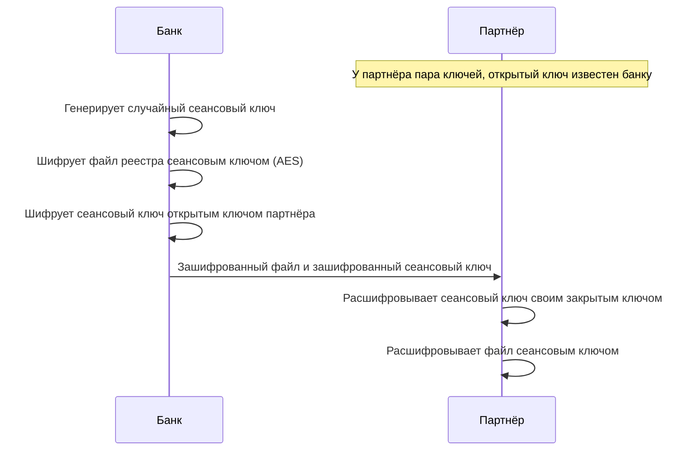

# Б.2 Основы безопасности: криптография, аутентификация, авторизация

## Зачем это аналитику

Требования безопасности пишет аналитик: как партнёр аутентифицируется, какие данные шифруются, кто что может видеть. Без понимания базовых механизмов легко написать требование, которое звучит солидно, но ничего не защищает («пароль шифруем обратимо») или защищает не то. Модуль даёт язык и механизмы, на которых стоят TLS, OAuth и защита API из блока 1.

## Готовность к модулю

Модуль опирается на темы ниже. Если какая-то из них незнакома или её вопросы для самопроверки даются с трудом, начните с неё.

- [А.2 Как работает веб](../00a-foundations/a2-web-http-basics.md)
- [Б.1 Сеть для интеграций](b1-networking.md)

## Куда ведёт

Тема подробнее раскрывается в модулях:

- [1.2 TLS и PKI](../01-http-rest-security/1.2-tls-pki.md)
- [1.4 OAuth 2.0, OIDC, JWT](../01-http-rest-security/1.4-oauth-oidc-jwt.md)
- [1.5 Защита API](../01-http-rest-security/1.5-api-security.md)
- [5.5 Безопасность LLM](../05-ai-engineering/5.5-llm-security.md)

## Что понять

- [ ] Триада конфиденциальность — целостность — доступность и базовая модель угроз.
- [ ] Хеш-функция: свойства, применение для контроля целостности. Почему пароли хранят как хеш с солью и медленной функцией.
- [ ] Симметричное шифрование: один ключ, скорость, проблема передачи ключа.
- [ ] Асимметричное шифрование: пара ключей, что шифруют открытым ключом, что — закрытым.
- [ ] Электронная подпись и HMAC: целостность и авторство; чем подпись отличается от шифрования.
- [ ] Сертификат как открытый ключ, заверенный удостоверяющим центром; цепочка доверия на уровне идеи.
- [ ] Аутентификация и авторизация; факторы аутентификации; сессия, cookie, токен, API-ключ.
- [ ] Модели доступа: роли (RBAC), атрибуты (ABAC), принцип наименьших привилегий.
- [ ] Самые частые уязвимости на уровне идеи: инъекции, недостаточная проверка доступа к объекту, утечка секретов.

## Урок

<!-- LESSON:START -->
Требования безопасности часто пишутся словами, за которыми нет механизма: «данные передаются в зашифрованном виде», «доступ только для авторизованных пользователей», «пароли хранятся надёжно». Разработчик реализует их как понял, требование формально выполнено, а защиты нет. Урок даёт минимальный набор механизмов, из которых собрана почти любая защита, и объясняет, что каждый из них гарантирует, а что нет.

### Что защищаем и от кого

Классическая рамка — триада CIA:

- **Конфиденциальность (confidentiality)** — данные видят только те, кому положено. Нарушение: выписку организации прочитал посторонний.
- **Целостность (integrity)** — данные не изменены незаметно. Нарушение: в платёжном поручении по дороге подменили счёт получателя.
- **Доступность (availability)** — система работает, когда нужна. Нарушение: поток запросов положил сервис приёма платежей в день зарплаты.

Разные механизмы закрывают разные свойства. Шифрование даёт конфиденциальность, но само по себе не гарантирует целостность. Подпись даёт целостность и авторство, но не скрывает содержимое. Поэтому первый вопрос к любому требованию: какое именно свойство оно защищает.

Второй инструмент — модель угроз (threat model). Это не документ на сто страниц, а ответы на четыре вопроса:

1. Что ценное есть в системе (активы): деньги, персональные данные, учётные записи.
2. Кто может атаковать и с какими возможностями: внешний злоумышленник, клиент, который смотрит чужие данные, сотрудник с доступом к базе, скомпрометированный партнёр.
3. Где поверхность атаки: публичные API, формы входа, файловые обмены, административные интерфейсы.
4. Что будет, если защита не сработает, и сколько стоит её усилить.

Для банка ответы дают приоритеты: подмена реквизитов в платёжном поручении страшнее раскрытия справочника отделений, поэтому одни операции требуют второго фактора, а другие нет.

### Хеш-функция

Криптографическая хеш-функция превращает данные любого размера в отпечаток фиксированной длины. SHA-256 выдаёт 256 бит, обычно записанных 64 шестнадцатеричными символами. Свойства, ради которых её используют:

- **детерминированность**: одни и те же данные всегда дают один и тот же хеш;
- **лавинный эффект**: изменение одного бита входа меняет примерно половину битов результата;
- **необратимость**: по хешу нельзя восстановить данные иначе, чем перебором вариантов;
- **стойкость к коллизиям**: практически невозможно найти два разных входа с одинаковым хешем.

Для MD5 и SHA-1 практические коллизии найдены, поэтому для задач безопасности их не используют. Стандартный выбор — SHA-256, SHA-512 или SHA-3.

#### Контроль целостности

Банк публикует файл обновления клиентского модуля и рядом его хеш. Клиент скачивает файл, считает хеш и сравнивает: совпало — файл не повреждён. Но это защищает только от случайной порчи. Злоумышленник, который может подменить файл, подменит и опубликованный рядом хеш: хеш ничего не говорит о том, кто его посчитал. От намеренной подмены защищает только механизм с ключом — HMAC или подпись.

#### Почему пароли хранят как хеш с солью

Системе не нужно знать пароль — нужно лишь проверить, что пользователь ввёл тот же пароль, что и при регистрации. Поэтому пароли не шифруют. Шифрование обратимо: у кого есть ключ, тот получит все пароли разом, а ключ лежит рядом с системой, у администраторов и в резервных копиях. Хранят результат необратимой функции и при входе сравнивают результаты.

Простого SHA-256 от пароля мало, по двум причинам.

Первая — одинаковые пароли дают одинаковые хеши, и для популярных паролей существуют заранее посчитанные таблицы «хеш — пароль». Защита — соль (salt): случайная строка, уникальная для каждой учётной записи, которая добавляется к паролю перед хешированием и хранится открыто рядом с хешем. Соль не секрет. Её задача — обесценить заранее посчитанные таблицы и заставить атакующего подбирать каждый пароль отдельно.

Вторая — SHA-256 быстрая: на видеокартах перебирают миллиарды вариантов в секунду, а пароли людей короткие и предсказуемые. Защита — специально медленная функция с настраиваемой стоимостью: Argon2id, scrypt, bcrypt, PBKDF2. Проверка одного пароля при входе занимает доли секунды, пользователь этого не замечает, а перебор словаря по утёкшей базе дорожает на порядки. Рекомендации OWASP на момент написания ставят первым Argon2id.

Хранимое значение обычно содержит всё нужное для проверки — алгоритм, параметры стоимости, соль и хеш:

```text
$argon2id$v=19$m=65536,t=3,p=4$<соль в base64>$<хеш в base64>
```

Для API-ключей, которые генерирует сама система, медленная функция не нужна: длинную случайную строку перебором не подобрать, достаточно обычного криптографического хеша. Медленность компенсирует слабость человеческих паролей, а не хеша.

### Симметричное шифрование

В симметричном шифровании один ключ и шифрует, и расшифровывает. Стандарт де-факто — AES с ключом 128 или 256 бит. Оно быстрое, поддерживается процессорами аппаратно и подходит для данных любого объёма: трафика, файлов, дисков, полей в базе. Современные режимы (например, AES-GCM) не только шифруют, но и добавляют метку, по которой получатель обнаружит изменение, — это аутентифицированное шифрование.

Главная проблема — передача ключа. Обе стороны должны иметь один ключ заранее, а передать его по каналу, который хотим защитить, нельзя. Для каждой пары участников нужен свой ключ: у банка с тысячей партнёров — тысяча секретов, которые надо выдать, хранить и менять.

Вторая проблема — хранение. Зашифрованная база с ключом в конфигурационном файле на том же сервере защищает от кражи диска, но не от взлома сервера. Поэтому в требованиях к шифрованию хранимых данных важно указать, где живёт ключ (служба управления ключами, KMS, или аппаратный модуль, HSM), кто имеет к нему доступ и как он ротируется.

### Асимметричное шифрование

В асимметричной криптографии у каждого участника пара ключей: закрытый (private) хранится только у владельца, открытый (public) раздаётся всем. Математически они связаны, но вычислить закрытый по открытому практически невозможно. Алгоритмы — RSA и схемы на эллиптических кривых (ECDSA и Ed25519 для подписи, ECDH для выработки общего ключа).

Пара используется в двух направлениях, и их важно не путать:

| Операция | Каким ключом | Кто может выполнить | Что даёт |
|---|---|---|---|
| Зашифровать | Открытым ключом получателя | Кто угодно | Расшифровать сможет только владелец закрытого ключа |
| Расшифровать | Закрытым ключом получателя | Только получатель | Конфиденциальность |
| Подписать | Закрытым ключом автора | Только автор | Доказательство авторства и целостности |
| Проверить подпись | Открытым ключом автора | Кто угодно | Уверенность, что подписал владелец ключа и данные не менялись |

Проблема передачи ключа решена: открытый ключ можно публиковать. Но асимметричные операции на порядки медленнее симметричных, поэтому ими не шифруют большие данные. На практике используют гибридную схему: асимметрия нужна, чтобы договориться об одноразовом симметричном ключе и подтвердить личность стороны, а данные шифруются симметрично. Так устроены TLS, защищённая почта, шифрование файлов для партнёра.



В TLS 1.3 общий ключ вырабатывается немного иначе — протоколом Диффи — Хеллмана, где обе стороны вносят свою часть и сам ключ по сети не передаётся. Идея та же: асимметрия для договорённости, симметрия для данных. Детали — в модуле 1.2.

### Подпись и HMAC

#### Электронная подпись

Подпись доказывает две вещи: данные не менялись после подписания, и подписал их владелец конкретного закрытого ключа. Механизм: от данных считается хеш, затем алгоритм подписи по хешу и закрытому ключу вычисляет значение подписи. Проверяющий пересчитывает хеш от полученных данных и с помощью открытого ключа убеждается, что подпись к этому хешу сделана парным закрытым ключом. Изменился хотя бы один байт — хеш другой, проверка не проходит.

Подпись часто описывают как «шифрование закрытым ключом». Это упрощение сбивает с толку: подпись ничего не скрывает. Подписанное платёжное поручение или подписанный токен читаются кем угодно. Если нужно и скрыть, и подтвердить авторство, применяют оба механизма.

Поскольку закрытый ключ есть только у автора, подпись даёт ещё и неотказуемость (non-repudiation): автор не может правдоподобно заявить, что документ подписал кто-то другой. Поэтому в ДБО для юрлиц платёжные поручения подписывают электронной подписью уполномоченных лиц, а банк хранит подписи для разбора споров.

#### HMAC

HMAC (hash-based message authentication code) — код аутентичности сообщения на основе хеш-функции и общего секрета. Отправитель считает, например, HMAC-SHA256 от сообщения со своим секретом и прикладывает результат. Получатель с тем же секретом считает заново и сравнивает. Совпало — сообщение пришло от того, кто знает секрет, и не изменено.

HMAC быстрый и простой, поэтому им подписывают вебхуки и запросы к API. Но секрет у двух сторон общий, и неотказуемости нет: получатель мог сам сформировать такое же сообщение. Для спора с партнёром HMAC не доказательство, подпись — доказательство.

| Механизм | Ключ | Конфиденциальность | Целостность | Авторство | Неотказуемость |
|---|---|---|---|---|---|
| Хеш | Нет | Нет | Только от случайной порчи | Нет | Нет |
| HMAC | Общий секрет | Нет | Да | Да, «кто-то из знающих секрет» | Нет |
| Подпись | Закрытый ключ автора | Нет | Да | Да | Да |
| Шифрование | Симметричный или открытый ключ получателя | Да | Только в режимах с аутентификацией | Нет | Нет |

### Сертификат и цепочка доверия

Асимметрия переносит проблему в другое место. Чтобы проверить подпись банка или зашифровать данные для партнёра, нужен его открытый ключ. Но откуда уверенность, что ключ, пришедший по сети, принадлежит банку, а не злоумышленнику посередине?

Ответ — сертификат: документ, в котором записаны имя владельца, его открытый ключ, срок действия и назначение ключа, и всё это подписано удостоверяющим центром (Certificate Authority, CA). Подпись CA означает: «мы проверили, что этот ключ принадлежит этому владельцу». Секретного в сертификате ничего нет.

Чтобы проверить подпись CA, нужен открытый ключ самого CA, то есть его сертификат. Так возникает цепочка: сертификат сервера подписан промежуточным CA, промежуточный — корневым. Корневые сертификаты заранее лежат в хранилище доверия (trust store) операционной системы, браузера или приложения, и им доверяют без проверки — это точка опоры. Клиент строит путь от предъявленного сертификата до одного из доверенных корней и проверяет каждую подпись по дороге.

Практическое следствие: ошибка «не удалось проверить сертификат» почти всегда означает, что клиент не смог построить цепочку до корня, которому доверяет. Отключить проверку — не решение: это то же самое, что принимать любой ключ от любого собеседника. Состав сертификата, проверка цепочки, отзыв и взаимная аутентификация сертификатами (mTLS) — тема модуля 1.2.

### Аутентификация и авторизация

**Аутентификация (authentication)** отвечает на вопрос «кто ты» и проверяет, что субъект действительно тот, за кого себя выдаёт. **Авторизация (authorization)** отвечает на вопрос «что тебе можно» и решает, разрешено ли аутентифицированному субъекту это действие над этим объектом. Сначала аутентификация, потом авторизация при каждом действии. Коды HTTP разделяют их так же: 401 — не удалось установить, кто вы, 403 — известно, кто вы, но нельзя.

#### Факторы

Факторы аутентификации делятся на три категории:

- **знание**: пароль, PIN, ответ на вопрос;
- **владение**: телефон с приложением-аутентификатором, аппаратный ключ, носитель с закрытым ключом подписи, SIM-карта;
- **свойство**: отпечаток пальца, лицо.

Двухфакторная аутентификация — это два фактора разных категорий. Пароль и секретный вопрос — один фактор дважды. Коды по SMS считаются более слабым вторым фактором, чем приложение или аппаратный ключ: номер можно перевыпустить на злоумышленника или перехватить сообщение. Для важных действий применяют повышение уровня (step-up): вход по паролю даёт просмотр, а подписание платежа требует ещё и подтверждения вторым фактором.

#### Сессия, cookie, токен, API-ключ

После входа пользователь не должен вводить пароль на каждый запрос. Ему выдают что-то, что он предъявляет вместо пароля. Варианты различаются тем, где хранится состояние.

- **Сессия с cookie.** Сервер создаёт запись сессии у себя и отдаёт браузеру случайный идентификатор в cookie. Браузер автоматически присылает cookie с каждым запросом, сервер находит сессию и узнаёт пользователя. Состояние на сервере: выйти из системы или заблокировать пользователя можно мгновенно, удалив сессию. Цена — хранилище сессий, общее для всех экземпляров сервиса.
- **Токен.** Клиент получает строку и сам передаёт её в заголовке, обычно `Authorization: Bearer <токен>`. Самодостаточный токен (например, JWT) содержит данные о субъекте и сроке, подписанные выдавшим сервером; сервис проверяет подпись и срок локально, без обращения к хранилищу. Цена — такой токен нельзя отозвать до истечения срока без дополнительных механизмов, поэтому его делают короткоживущим.
- **API-ключ.** Долгоживущий секрет, который идентифицирует не человека, а приложение или интеграцию. Прост для партнёров, но обычно не истекает сам, поэтому утечка опасна надолго.

Cookie — способ доставки, а не тип учётных данных: в cookie можно положить и идентификатор сессии, и токен. Принципиальная разница между сессией и самодостаточным токеном — где живёт состояние и как отзывается доступ. Протоколы выдачи токенов (OAuth 2.0, OpenID Connect), формат JWT и его проверка разбираются в модуле 1.4.

### Модели доступа

**RBAC (role-based access control)** — права назначаются ролям, роли — пользователям. «Бухгалтер» создаёт платёжные поручения, «руководитель» подписывает, «наблюдатель» только смотрит. Модель понятна бизнесу, но плохо выражает условия, и при попытке их выразить роли размножаются: «бухгалтер филиала до миллиона», «бухгалтер филиала свыше миллиона».

**ABAC (attribute-based access control)** — решение принимается по атрибутам субъекта, объекта, действия и контекста: организация пользователя совпадает с организацией счёта, сумма не больше лимита пользователя, операция в рабочее время. Гибко, но политики сложнее тестировать и объяснять. На практике модели комбинируют: роль даёт право на тип операции, атрибуты ограничивают конкретные объекты.

**Принцип наименьших привилегий (least privilege)** — каждый субъект получает минимальные права, достаточные для его задачи, и только на нужное время. Субъект — не только человек, но и сервис, интеграция, учётная запись базы данных. Примеры проверяемых требований:

- «Сервис формирования выписок подключается к базе под учётной записью с правом только на чтение таблиц счетов и операций».
- «API-ключ партнёра-агрегатора даёт доступ только к методам получения выписок и только по счетам организаций, давших согласие».
- «Роль "наблюдатель" не имеет права создавать и подписывать платёжные поручения; попытка возвращает 403 и фиксируется в журнале аудита».

Смысл принципа — ограничить ущерб: если учётные данные утекут, злоумышленник получит ровно столько прав, сколько было у владельца.

### Частые уязвимости на уровне идеи

**Инъекции (injection).** Данные, пришедшие извне, попадают в команду и становятся её частью. Классика — SQL, собранный склейкой строк: в поле «название организации» приходит фрагмент SQL, и база выполняет его как команду. Защита механическая: параметризованные запросы, в которых значение физически не может стать кодом. Тот же класс — инъекции в команды ОС, в шаблоны, в заголовки. У языковых моделей границы между данными и командами нет вовсе, и защита строится иначе — это тема модуля 5.5.

**Недостаточная проверка доступа к объекту.** Пользователь аутентифицирован, но сервер отдаёт объект по идентификатору из запроса, не проверив, что объект принадлежит ему. Бухгалтер организации А меняет в запросе номер выписки и получает выписку организации Б. В каталоге OWASP это называется BOLA и стоит на первом месте среди уязвимостей API. Проверку владения нужно делать в каждом методе, и её легко забыть, поэтому она должна быть явным требованием к каждому методу.

**Утечка секретов.** Пароли к базам, ключи API и закрытые ключи оказываются в репозитории кода, в журналах, в сообщениях об ошибках, в скриншотах инструкций. Защита: секреты хранятся в специальном хранилище и передаются приложению при запуске, журналы маскируют токены и персональные данные, для каждого секрета известен порядок ротации. Требование «секрет можно заменить без остановки сервиса» стоит записать заранее — в день утечки будет поздно.

### Разбор: требования к API для реселлеров регистратора

Регистратор доменов открывает API для реселлеров: они регистрируют и продлевают домены своих клиентов и меняют DNS-серверы. В первой редакции требований было написано: «API защищён паролем, данные передаются в зашифрованном виде, доступ только для авторизованных реселлеров». Разберём, что за этим стоит.

| Исходная формулировка | Что не так | Проверяемое требование |
|---|---|---|
| «API защищён паролем» | Непонятно, чем аутентифицируется система, а не человек | Реселлер аутентифицируется API-ключом; ключ показывается один раз, на сервере хранится только его хеш; одновременно действуют до двух ключей для ротации |
| «Данные передаются в зашифрованном виде» | Не указаны протокол и версия | Только HTTPS, TLS 1.2 и выше, запросы по HTTP отклоняются |
| «Доступ только для авторизованных» | Смешивает аутентификацию и авторизацию, нет проверки объекта | Реселлер читает и меняет только домены своих клиентов; запрос к чужому домену возвращает 404 и пишется в журнал |
| «Пароли в личном кабинете хранятся надёжно» | Непроверяемо | Пароли хранятся как Argon2id с уникальной солью, параметры стоимости фиксируются в настройках |
| Ничего не сказано | Смена DNS-серверов позволяет угнать трафик домена | Смена DNS-серверов и передача домена другому регистратору требуют подтверждения вторым фактором |

Каждая строка правого столбца проверяется тестом и явно говорит, какое свойство защищает.

### Что дальше

Как TLS договаривается о ключах, что клиент проверяет в сертификате, почему плохо работает отзыв и как устроен mTLS, разбирается в модуле 1.2. OAuth 2.0, OpenID Connect и проверка JWT — в модуле 1.4. Полный перечень уязвимостей API по OWASP, подпись запросов HMAC с защитой от повторов и модель ReBAC — в модуле 1.5. Инъекции в языковые модели — в модуле 5.5.

### Типичные ошибки

- Требовать шифровать пароли обратимо, «чтобы можно было напомнить пароль». Пароль не восстанавливают, а сбрасывают.
- Хешировать пароли быстрой функцией без соли и считать, что «хеш необратим, значит, безопасно».
- Путать подпись с шифрованием и ожидать, что подписанный токен или документ скрывает содержимое.
- Использовать HMAC там, где нужна неотказуемость, например для юридически значимых документов между разными организациями.
- Решать ошибку проверки сертификата отключением проверки вместо добавления нужного корня в хранилище доверия.
- Писать «доступ только для авторизованных пользователей» и не формулировать проверку владения объектом в каждом методе.
- Выдавать интеграциям и сервисам права «на всё», потому что так быстрее запустить.

### Как говорить об этом на собеседовании

На уровне middle/senior ценится умение привязать механизм к свойству и угрозе. На вопрос «как хранить пароли» лучше отвечать рассуждением: пароль нужно проверять, а не восстанавливать, поэтому необратимая функция; пароли повторяются и предсказуемы, поэтому уникальная соль; перебор дёшев, поэтому медленная функция вроде Argon2id.

Сильный ход — показать, как вы превращаете расплывчатые требования в проверяемые. Возьмите «доступ только для авторизованных» и разложите: чем аутентифицируется клиент, какие роли и атрибуты участвуют в решении, как проверяется владение объектом, какой код ответа и что пишется в журнал. Упомяните наименьшие привилегии для технических учётных записей и выбор между HMAC и подписью для интеграции с партнёром.

### Коротко

- Каждое требование безопасности защищает конкретное свойство: конфиденциальность, целостность или доступность. Модель угроз определяет приоритеты.
- Хеш необратим и даёт отпечаток данных, но без ключа защищает только от случайной порчи.
- Пароли хранят как медленный хеш с уникальной солью, потому что их нужно проверять, а не восстанавливать.
- Симметричное шифрование быстрое, но упирается в передачу ключа; асимметричное решает передачу, но медленное. На практике их комбинируют.
- Открытым ключом шифруют для владельца и проверяют его подпись; закрытым расшифровывают и подписывают. Подпись ничего не скрывает.
- HMAC доказывает целостность и происхождение от знающего общий секрет; подпись даёт ещё и неотказуемость.
- Сертификат связывает открытый ключ с владельцем подписью CA; доверие держится на корнях в хранилище клиента.
- Аутентификация устанавливает, кто вы; авторизация решает, что вам можно, при каждом действии и для каждого объекта.
<!-- LESSON:END -->

## Читать дальше

- OWASP Cheat Sheet Series: «Password Storage», «Authentication», «Authorization».
- Брюс Шнайер, Нильс Фергюсон, Тадаёси Коно, «Практическая криптография» — первые главы.

На system-design.space:

- [Зачем нужна инженерия безопасности](https://system-design.space/chapter/security-engineering-overview/)
- [Шифрование, ключи и TLS на практике](https://system-design.space/chapter/encryption-keys-tls/)

## Практика

1. С помощью openssl (или онлайн-инструментов с тестовыми данными): посчитать SHA-256 файла, создать пару ключей, подписать файл и проверить подпись, затем изменить файл и убедиться, что проверка не проходит.
2. Для обезличенного личного кабинета юрлица в банке описать модель доступа: роли, права, какие операции требуют второго фактора.
3. Найти в своих прошлых требованиях (обезличенно) формулировки о безопасности и переписать их проверяемо и технически корректно.

## Вопросы для самопроверки

1. Чем хеширование отличается от шифрования? Почему пароли не шифруют?
2. Чем асимметричное шифрование отличается от симметричного и почему на практике используют оба?
3. Как электронная подпись доказывает целостность и авторство?
4. Чем аутентификация отличается от авторизации?
5. Чем сессия с cookie отличается от токена?
6. Что такое принцип наименьших привилегий? Приведите пример требования.

## Заметки

<!-- Свои формулировки, ошибки, ссылки. -->
