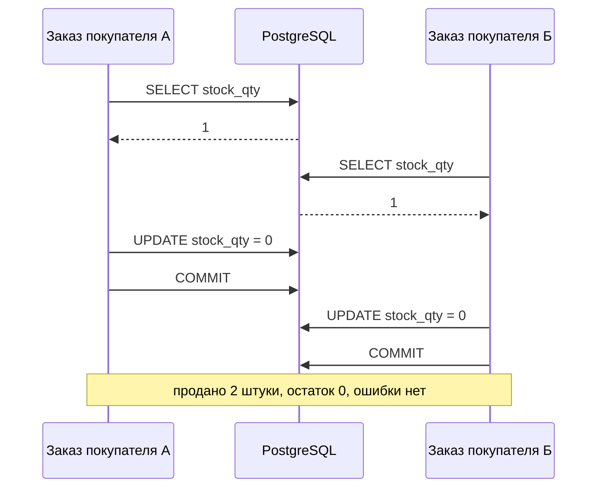

# Б.4 SQL глубже и транзакции: оконные функции, индексы, EXPLAIN, конкурентность

## Зачем это аналитику

Блок 2 разбирает PostgreSQL изнутри и предполагает, что SQL уже не вызывает затруднений, а слова «транзакция», «индекс» и «план запроса» знакомы. Этот модуль доводит SQL до уровня, нужного для анализа данных и расследований, и даёт первый взгляд на то, что происходит, когда много пользователей меняют одни и те же данные.

## Готовность к модулю

Модуль опирается на темы ниже. Если какая-то из них незнакома или её вопросы для самопроверки даются с трудом, начните с неё.

- [А.5 SQL для аналитика](../00a-foundations/a5-sql-basics.md)

## Куда ведёт

Тема подробнее раскрывается в модулях:

- [2.1 MVCC и хранение](../02-postgresql/2.1-mvcc-storage.md)
- [2.2 Изоляция транзакций](../02-postgresql/2.2-isolation.md)
- [2.3 Блокировки](../02-postgresql/2.3-locks.md)
- [2.4 Планировщик запросов](../02-postgresql/2.4-planner.md)
- [2.5 Индексы в глубину](../02-postgresql/2.5-indexes.md)
- [5.2 RAG](../05-ai-engineering/5.2-rag.md)

## Что понять

- [ ] CTE (WITH) для читаемых запросов; рекурсивный CTE на примере иерархии категорий.
- [ ] Оконные функции: ROW_NUMBER, RANK, LAG/LEAD, накопительная сумма; PARTITION BY и ORDER BY в окне.
- [ ] Типовые аналитические задачи: последний статус по каждому заказу, дубли, пропуски в последовательности, сравнение периодов.
- [ ] Индекс на уровне идеи: что ускоряет и во что обходится при записи; составной индекс и порядок столбцов.
- [ ] EXPLAIN: как прочитать план — последовательное чтение против индексного, оценка строк, стоимость.
- [ ] ACID: что означает каждая буква на практике.
- [ ] Проблемы конкурентного доступа: потерянное обновление, грязное и неповторяющееся чтение — на примере остатков на складе. Уровни изоляции — первое знакомство.
- [ ] Блокировки на уровне идеи: SELECT ... FOR UPDATE, взаимоблокировка, оптимистичная блокировка через версию строки.

## Урок

<!-- LESSON:START -->
Примеры построены на модели интернет-магазина из модулей А.4 и А.5: `customers`, `products` (с остатком `stock_qty`), `orders`, `order_items`, справочник `categories` с `parent_id` и журнал `order_status_history`. Запросы проверены на PostgreSQL 16.

### CTE: запрос по шагам

Общее табличное выражение (common table expression, CTE) — именованный подзапрос в начале запроса, в блоке `WITH`. Его главная польза — читаемость: сложный запрос раскладывается на шаги, каждый шаг получает имя и проверяется отдельно.

```sql
WITH order_totals AS (
    SELECT order_id, SUM(quantity * price) AS total
    FROM order_items
    GROUP BY order_id
),
customer_revenue AS (
    SELECT o.customer_id, SUM(t.total) AS revenue, COUNT(*) AS orders_cnt
    FROM orders o
    JOIN order_totals t ON t.order_id = o.order_id
    WHERE o.status <> 'cancelled'
    GROUP BY o.customer_id
)
SELECT c.full_name, r.revenue, r.orders_cnt
FROM customer_revenue r
JOIN customers c ON c.customer_id = r.customer_id
ORDER BY r.revenue DESC;
```

Запрос читается сверху вниз, как постановка.

CTE — средство читаемости, а не ускорения. Начиная с PostgreSQL 12 простое CTE, на которое ссылаются один раз, встраивается в основной запрос и оптимизируется вместе с ним; подробности — в модуле 2.4.

**Рекурсивный CTE** решает задачу, которую обычный SQL не решает: обход иерархии неизвестной глубины. Категории товаров ссылаются на родителя через `parent_id`, и нужно получить дерево с полными путями.

```sql
WITH RECURSIVE tree AS (
    SELECT category_id, name, parent_id, 1 AS level, name AS path
    FROM categories
    WHERE parent_id IS NULL
    UNION ALL
    SELECT c.category_id, c.name, c.parent_id, t.level + 1, t.path || ' / ' || c.name
    FROM categories c
    JOIN tree t ON c.parent_id = t.category_id
)
SELECT category_id, level, path FROM tree ORDER BY path;
```

Якорная часть (до `UNION ALL`) выбирает корни, рекурсивная присоединяет к уже найденным строкам их детей. База повторяет рекурсивную часть, пока она возвращает новые строки: корни, дети, внуки. Результат: «Книги», «Электроника», «Электроника / Аксессуары», «Электроника / Смартфоны». Если в данных есть цикл (категория стала собственным предком), запрос не остановится, поэтому на реальных данных ограничивают глубину.

### Оконные функции: агрегат без схлопывания строк

`GROUP BY` сворачивает группу в одну строку: из девяти позиций заказов получается пять строк — по одной на заказ. Детали теряются. Оконная функция (window function) считает агрегат по группе связанных строк — окну, — но оставляет каждую строку на месте и добавляет результат как новый столбец.

```sql
SELECT order_id, product_id, quantity * price AS line_total,
       SUM(quantity * price) OVER (PARTITION BY order_id) AS order_total
FROM order_items
ORDER BY order_id, product_id;
```

Каждая позиция видна рядом с суммой своего заказа — отсюда один шаг до доли позиции в заказе. Через `GROUP BY` это потребовало бы подзапроса и повторного соединения.

Окно задаётся в `OVER (...)` двумя частями:

- **`PARTITION BY`** делит строки на независимые группы — как `GROUP BY`, но без свёртки. Без него окно — вся выборка.
- **`ORDER BY`** упорядочивает строки внутри группы. Для функций ранжирования и смещения он обязателен по смыслу. Для агрегатов он меняет поведение: `SUM(quantity) OVER (PARTITION BY order_id ORDER BY product_id)` считает сумму от начала группы до текущей строки, то есть накопительный итог. Строки с одинаковым значением ключа сортировки суммируются вместе, поэтому ключ лучше делать уникальным.

Оконные функции вычисляются после `WHERE`, `GROUP BY` и `HAVING`, но до `ORDER BY` всего запроса. Отсюда два следствия: оконную функцию можно применить к результату группировки (`RANK() OVER (ORDER BY SUM(quantity) DESC)`), но нельзя отфильтровать по ней в `WHERE` того же запроса — для этого запрос оборачивают в CTE или подзапрос.

**Ранжирование.** Три функции различаются поведением на равенствах. Вот рейтинг товаров по проданному количеству, где у трёх товаров по 3 штуки:

| Товар | Продано | ROW_NUMBER | RANK | DENSE_RANK |
|---|---|---|---|---|
| Зарядное устройство | 3 | 1 | 1 | 1 |
| Чехол | 3 | 2 | 1 | 1 |
| Смартфон A | 3 | 3 | 1 | 1 |
| Книга по SQL | 2 | 4 | 4 | 2 |
| Смартфон B | 1 | 5 | 5 | 3 |

`ROW_NUMBER` нумерует подряд, и при равенстве порядок произволен: на другом запуске первым может оказаться «Чехол». Для воспроизводимости в `ORDER BY` окна добавляют уникальный столбец. `RANK` даёт равным одно место и пропускает следующие номера, `DENSE_RANK` не пропускает.

**Смещение.** `LAG(x)` возвращает значение из предыдущей строки окна, `LEAD(x)` — из следующей. Классическое применение — время между событиями:

```sql
SELECT order_id, status, changed_at,
       LEAD(changed_at) OVER (PARTITION BY order_id ORDER BY changed_at)
           - changed_at AS time_in_status
FROM order_status_history
WHERE order_id = 1
ORDER BY changed_at;
```

Для заказа 1 получится: в статусе `new` пять минут, в `paid` — сутки и два часа, в `shipped` — двое суток, у `delivered` следующего статуса нет, и значение пустое.

### Типовые аналитические задачи

Большинство расследований на данных сводится к нескольким шаблонам.

**Последний статус каждого заказа.** Пронумеровать строки истории внутри заказа от свежей к старой и взять первую:

```sql
WITH ranked AS (
    SELECT order_id, status, changed_at,
           ROW_NUMBER() OVER (PARTITION BY order_id ORDER BY changed_at DESC) AS rn
    FROM order_status_history
)
SELECT order_id, status AS last_status, changed_at
FROM ranked
WHERE rn = 1
ORDER BY order_id;
```

Тот же шаблон даёт «первую покупку клиента», «актуальную цену товара», «последнее платёжное поручение по счёту». В PostgreSQL есть короткая форма `DISTINCT ON (order_id)`, но она не переносится в другие СУБД. Если два статуса могут получить одинаковое время, нужно правило выбора — это вопрос к постановке, а не к SQL.

**Дубли.** Сначала решить, что считается дублем: одинаковый email без учёта регистра, пара «имя и телефон», одинаковый ИНН. Найти группы помогает `GROUP BY ... HAVING COUNT(*) > 1`:

```sql
SELECT lower(email) AS email_norm, COUNT(*) AS cnt,
       array_agg(customer_id ORDER BY customer_id) AS ids
FROM customers
WHERE email IS NOT NULL
GROUP BY lower(email)
HAVING COUNT(*) > 1;
```

Лишние строки (все, кроме самой ранней) отбирают через `ROW_NUMBER` с `PARTITION BY` по признаку дубля и условие `rn > 1`.

**Пропуски в последовательности.** Сравнить каждый номер со следующим:

```sql
SELECT order_id AS gap_after, next_id AS gap_before
FROM (
    SELECT order_id, LEAD(order_id) OVER (ORDER BY order_id) AS next_id
    FROM orders
) t
WHERE next_id - order_id > 1;
```

Важная оговорка: пропуск в суррогатном ключе ничего не означает. Последовательности в PostgreSQL не откатываются при откате транзакции, поэтому разрывы в `order_id` — норма. Искать пропуски имеет смысл в номерах, которые бизнес обязан вести без разрывов (номера документов), или в датах: «дни без продаж в магазине» — это соединение с календарём из `generate_series` и отбор дней без строк.

**Сравнение периодов.** Шаблон двухшаговый: в CTE агрегировать данные до нужного уровня (месяц, неделя), затем `LAG(revenue) OVER (ORDER BY month)` подставит значение прошлого периода в строку текущего. Для сравнения с тем же месяцем прошлого года — `LAG(revenue, 12)`, но только если в ряду нет пропущенных месяцев: `LAG` смещается на строки, а не на календарь.

### Индекс: что ускоряет и во что обходится

Без индекса заказы одного покупателя находятся только чтением всей таблицы. Индекс — отдельная упорядоченная структура «значение столбца → адрес строки». По умолчанию это B-дерево: поиск значения среди миллионов строк занимает несколько чтений страниц. Индекс помогает в поиске по равенству, по диапазону и в сортировке — ключи в нём уже упорядочены.

Платят за индекс записью. Каждый `INSERT` добавляет запись в каждый индекс таблицы; `UPDATE` индексированного столбца — тоже. Индексы занимают место на диске и в памяти. Поэтому «индекс на каждый столбец» — плохое решение: запись замедляется, а запросы, которые ищут по нескольким столбцам сразу, всё равно не ускоряются.

**Составной индекс** строится по нескольким столбцам, и порядок в нём решающий. Индекс `(customer_id, created_at)` упорядочен сначала по покупателю, внутри покупателя — по дате, как телефонный справочник по фамилии, затем по имени. Он отлично служит запросу «заказы покупателя 4242 за последний месяц» и запросу «последние пять заказов покупателя 4242». Но запросу «все заказы за вчера» почти не помогает: заказы за вчера разбросаны по всему индексу. Практическое правило: сначала столбцы, которые сравниваются на равенство, затем столбец с диапазоном или сортировкой. Подробно устройство B-дерева и другие типы индексов разбираются в модуле 2.5.

### EXPLAIN: как прочитать план

Перед выполнением PostgreSQL выбирает план: как читать таблицы, в каком порядке соединять, где сортировать. `EXPLAIN` показывает план и оценки, `EXPLAIN ANALYZE` выполняет запрос и добавляет фактические цифры.

Чтобы увидеть разницу, нужен объём. Миллион заказов генерируется одним запросом:

```sql
INSERT INTO customers (full_name, email, created_at)
SELECT 'Покупатель ' || g, 'user' || g || '@example.com', now() - g * interval '1 minute'
FROM generate_series(1, 100000) AS g;

INSERT INTO orders (customer_id, status, created_at)
SELECT 1 + floor(random() * 100000)::bigint,
       (ARRAY['new', 'paid', 'shipped', 'delivered', 'cancelled'])[1 + floor(random() * 5)::int],
       timestamptz '2025-01-01' + random() * interval '600 days'
FROM generate_series(1, 1000000);

ANALYZE orders;
```

`ANALYZE` обновляет статистику для оценок планировщика. Теперь запрос по покупателю:

```sql
EXPLAIN ANALYZE
SELECT order_id, status, created_at FROM orders WHERE customer_id = 4242;
```

Без индекса план выглядит примерно так (числа заменены многоточием — на вашей машине они будут другими):

```
Gather  (cost=... rows=... width=...) (actual time=... rows=... loops=1)
  Workers Planned: 2
  ->  Parallel Seq Scan on orders  (cost=... rows=...) (actual time=... rows=... loops=3)
        Filter: (customer_id = 4242)
        Rows Removed by Filter: ...
```

После `CREATE INDEX orders_customer_idx ON orders (customer_id)` и того же запроса:

```
Bitmap Heap Scan on orders  (cost=... rows=...) (actual time=... rows=... loops=1)
  Recheck Cond: (customer_id = 4242)
  ->  Bitmap Index Scan on orders_customer_idx  (cost=... rows=...) (actual ... rows=... loops=1)
        Index Cond: (customer_id = 4242)
```

Как это читать:

- **Дерево операций.** Каждая строка со стрелкой — узел плана. Выполнение идёт от самых вложенных узлов к верхнему.
- **Способ доступа.** `Seq Scan` — чтение всей таблицы подряд с фильтром (`Parallel Seq Scan` под `Gather` — то же несколькими процессами). `Index Scan` — проход по индексу с чтением строк из таблицы. `Bitmap Index Scan` плюс `Bitmap Heap Scan` — собрать по индексу адреса строк, затем прочитать страницы таблицы по порядку.
- **`Rows Removed by Filter`** — сколько строк прочитано и выброшено. Сотни тысяч выброшенных ради десятка найденных — главный признак, что индекса не хватает.
- **`rows` в оценке и в `actual`.** Сравнивать их — первое, что стоит делать. Если планировщик ждал 10 строк, а пришёл миллион, он выбрал план под неверную картину.
- **`cost`** — условная стоимость в единицах «чтение одной страницы подряд»: до первой строки и до последней. Нужна для выбора между планами одного запроса; в миллисекунды не переводится.
- **`loops`** — сколько раз выполнялся узел. Время и строки в `actual` указаны на одно выполнение, общий объём — умножением.

Индекс не всегда выигрывает: запрос `WHERE status = 'paid'` выбирает пятую часть таблицы, и прочитать её подряд дешевле, чем прыгать по индексу. А с составным индексом `(customer_id, created_at)` запрос «последние пять заказов покупателя» даёт `Index Scan Backward` под `Limit` без сортировки: база читает индекс с конца участка покупателя и останавливается на пятой строке.

### ACID на практике

Транзакция — группа операций, которая выполняется как единое целое. Четыре её свойства:

| Буква | Свойство | Что означает на практике |
|---|---|---|
| A | Атомарность (atomicity) | Списание остатка и создание заказа проходят вместе или не проходят вовсе. При сбое посередине база откатит сделанное |
| C | Согласованность (consistency) | После транзакции данные корректны. База проверяет только объявленное ей: ключи, `NOT NULL`, `CHECK (stock_qty >= 0)`. Остальные правила — забота приложения |
| I | Изоляция (isolation) | Параллельные транзакции не мешают друг другу — в той мере, которую обещает уровень изоляции. Это самая «торгуемая» буква |
| D | Долговечность (durability) | После успешного `COMMIT` данные переживут падение сервера. PostgreSQL добивается этого журналом упреждающей записи (write-ahead log, WAL): изменение сначала пишется в журнал на диск |

Самая коварная буква — I: изоляция бывает разной силы, и по умолчанию она слабее, чем обычно думают.

### Конкурентный доступ: остатки на складе

В магазине остался 1 смартфон, и два покупателя одновременно оформляют заказ. Код написан естественно: прочитать остаток, проверить, записать новое значение.



Это **потерянное обновление (lost update)**: обе транзакции прочитали одно значение, вычислили новое у себя и записали; запись второй затёрла результат первой. Ограничение `CHECK (stock_qty >= 0)` не сработает — остаток ведь 0. Ошибка проявляется только под нагрузкой и не воспроизводится на стенде с одним тестировщиком.

Ещё две классические аномалии на том же складе:

- **Грязное чтение (dirty read)** — транзакция видит незафиксированное изменение соседа. Резерв уменьшил остаток до нуля, отчёт это увидел и отправил заказ поставщику, а резерв откатился. В PostgreSQL грязного чтения не бывает вовсе: незафиксированные версии строк другим транзакциям не видны.
- **Неповторяющееся (неповторяемое) чтение (non-repeatable read)** — одна транзакция дважды читает остаток и получает разные значения, потому что между чтениями сосед зафиксировал изменение. Отчёт по складу посчитал итог по одному состоянию, а детализацию — по другому, и они не сходятся.

Уровень изоляции определяет, какие аномалии база допускает. Поведение четырёх стандартных уровней в PostgreSQL:

| Уровень | Грязное чтение | Неповторяющееся чтение | Фантом | Потерянное обновление |
|---|---|---|---|---|
| Read Uncommitted (в PostgreSQL = Read Committed) | нет | да | да | да |
| Read Committed (по умолчанию) | нет | да | да | да |
| Repeatable Read | нет | нет | нет | нет, вместо этого ошибка |
| Serializable | нет | нет | нет | нет |

Фантом (phantom read) — повторный запрос по условию возвращает другой набор строк: появился новый подходящий заказ. На Repeatable Read транзакция, меняющая строку, которую после начала её работы изменил сосед, получает ошибку сериализации и должна быть повторена целиком.

Главный практический вывод: большинство систем работает на Read Committed, и потерянное обновление на нём возможно. Закрывают его не повышением уровня, а одним из приёмов ниже.

### Блокировки на уровне идеи

**Атомарный UPDATE.** Самый простой способ — не вычислять новое значение в приложении, а поручить это базе и встроить проверку в условие:

```sql
UPDATE products
SET stock_qty = stock_qty - 1
WHERE sku = 'PH-001' AND stock_qty >= 1;
```

Две такие команды не могут выполниться над одной строкой одновременно: вторая дождётся фиксации первой и пересчитает выражение на свежем значении. Если обновлено 0 строк, товара не хватило — это сигнал приложению. Ограничение `CHECK (stock_qty >= 0)` остаётся последней линией обороны.

**Пессимистичная блокировка: `SELECT ... FOR UPDATE`.** Когда между чтением и записью есть логика приложения (проверить лимиты, посчитать скидку), строку блокируют уже при чтении:

```sql
BEGIN;
SELECT stock_qty FROM products WHERE sku = 'PH-001' FOR UPDATE;
-- проверки в приложении
UPDATE products SET stock_qty = stock_qty - 1 WHERE sku = 'PH-001';
COMMIT;
```

Вторая транзакция с тем же `FOR UPDATE` ждёт, пока первая завершится, и читает уже новое значение. Обычный `SELECT` при этом не ждёт. Цена — ожидания: транзакция с блокировкой должна быть короткой, без вызовов внешних систем и без ожидания пользователя.

**Взаимоблокировка (deadlock).** Заказ А резервирует товар 1, потом товар 2; заказ Б — товар 2, потом товар 1. Каждый держит одну строку и ждёт другую. Ждать бесконечно никто не будет: PostgreSQL обнаружит цикл ожидания и прервёт одну из транзакций с ошибкой. Профилактика — единый порядок захвата (всегда блокировать товары по возрастанию `product_id`) и короткие транзакции. Приложение всё равно должно уметь повторить прерванную транзакцию.

**Оптимистичная блокировка через версию строки.** Менеджер открыл карточку товара, пять минут правил цену и нажал «Сохранить». Держать всё это время открытую транзакцию с блокировкой нельзя. Вместо этого в строке хранится номер версии:

```sql
ALTER TABLE products ADD COLUMN version integer NOT NULL DEFAULT 1;

-- при открытии карточки прочитали price = 45000.00 и version = 1
UPDATE products
SET price = 43900.00, version = version + 1
WHERE sku = 'PH-002' AND version = 1;
```

Если за эти пять минут кто-то успел сохранить карточку, версия уже 2, и обновится 0 строк. Приложение сообщает о конфликте: данные изменились, их надо перечитать. Блокировок и ожиданий нет, зато есть повторы.

Выбор между подходами: пессимистичный — когда конфликты часты, а окно между чтением и записью короткое (внутри одной серверной операции); оптимистичный — когда конфликты редки или окно длинное (действия человека, несколько HTTP-запросов).

### Что дальше

Версии строк и снимки данных, на которых стоит конкурентность PostgreSQL, разбирает модуль 2.1. Полный каталог аномалий, включая перекос записи, и устройство уровней изоляции — модуль 2.2. Режимы блокировок и их диагностика — модуль 2.3, статистика и соединения в планах — модуль 2.4, типы индексов — модуль 2.5.

### Типичные ошибки

- Сворачивать данные `GROUP BY` там, где нужен итог по группе рядом с деталью.
- Брать «последнюю запись» через `ROW_NUMBER` без однозначного правила при равных датах — результат будет плавать от запуска к запуску.
- Считать разрывы в суррогатном ключе признаком потерянных данных.
- Требовать «индексы на все поля» или добавлять индекс, не посмотрев план: индекс, который планировщик не использует, только замедляет запись.
- Описывать сценарий «прочитать остаток, проверить, записать» без требования к конкурентному доступу — это готовое потерянное обновление.
- Считать, что `CHECK (stock_qty >= 0)` защищает от гонок: он не заметит, что две продажи записали один и тот же ноль.

### Как говорить об этом на собеседовании

На уровне middle/senior ценится умение связать инвариант с механизмом. Не «надо поставить транзакцию», а «сценарий резерва читает остаток и пишет новое значение; на Read Committed это потерянное обновление; закрываем атомарным `UPDATE ... WHERE stock_qty >= :n`, количество обновлённых строк 0 означает нехватку; для карточки товара, которую редактирует человек, — оптимистичная блокировка по версии».

Про производительность сильный ответ опирается на план: «`Seq Scan` выбрасывает сотни тысяч строк ради десяти, предлагаю составной индекс с покупателем впереди; цена — замедление вставки заказов».

### Коротко

- CTE делает запрос читаемым по шагам; рекурсивный CTE обходит иерархии неизвестной глубины.
- Оконная функция добавляет агрегат к каждой строке, не сворачивая их; `PARTITION BY` задаёт группы, `ORDER BY` — порядок и накопительный итог.
- «Последний по каждому» — `ROW_NUMBER` с сортировкой по убыванию и фильтр `rn = 1`; сравнение периодов — агрегат плюс `LAG`.
- Индекс ускоряет поиск, диапазоны и сортировку, а платят за него все операции записи; в составном индексе порядок столбцов решающий.
- В `EXPLAIN` первым делом смотрят способ доступа, выброшенные фильтром строки и расхождение оценки с фактом.
- ACID: атомарность и долговечность абсолютны, изоляция имеет уровни, и по умолчанию в PostgreSQL это Read Committed.
- Потерянное обновление на Read Committed возможно; его закрывают атомарным `UPDATE`, `SELECT ... FOR UPDATE` или версией строки. От взаимоблокировок спасает единый порядок захвата.
<!-- LESSON:END -->

## Читать дальше

- Документация PostgreSQL: «Window Functions», «WITH Queries», «Using EXPLAIN», «Transaction Isolation».
- Маркус Винанд, «SQL Performance Explained» (сайт use-the-index-luke.com) — лучшее введение в индексы.

На system-design.space:

- [PostgreSQL: история и архитектура](https://system-design.space/chapter/postgres-overview/)
- [Консистентность данных и идемпотентность: практические паттерны](https://system-design.space/chapter/consistency-idempotency-patterns/)

## Практика

1. На модели интернет-магазина из А.4–А.5 (или своей) написать запросы с оконными функциями: последний статус каждого заказа, накопительная выручка по дням, рост продаж к прошлому месяцу, дубли покупателей.
2. Сгенерировать в таблице заказов 1 млн строк (generate_series), посмотреть EXPLAIN ANALYZE запроса по покупателю до и после создания индекса.
3. Открыть две сессии psql и воспроизвести потерянное обновление остатка товара; затем исправить его через SELECT ... FOR UPDATE и через атомарный UPDATE.

## Вопросы для самопроверки

1. Чем оконная функция отличается от GROUP BY?
2. Как найти последний статус каждого заказа?
3. Что ускоряет индекс и чем за это платят?
4. Что вы смотрите в выводе EXPLAIN в первую очередь?
5. Что такое потерянное обновление и как его предотвратить?
6. Чем пессимистичная блокировка отличается от оптимистичной?

## Заметки

<!-- Свои формулировки, ошибки, ссылки. -->
