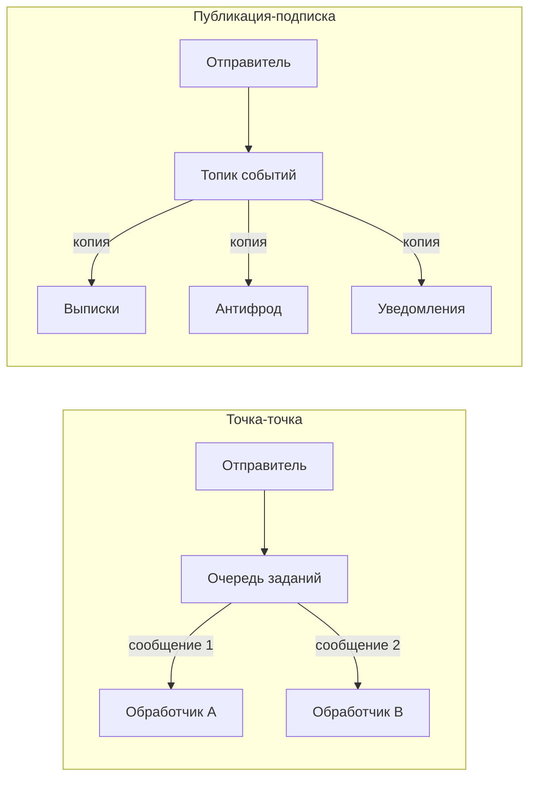
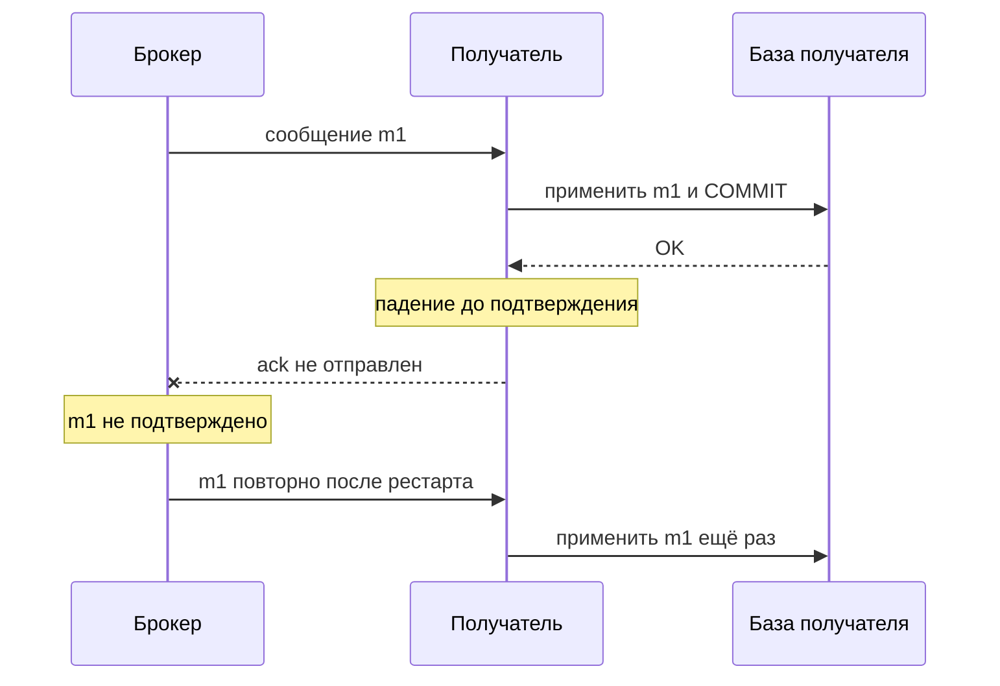

# Б.5 Асинхронный обмен: очереди, брокеры, гарантии доставки

## Зачем это аналитику

Асинхронная интеграция — ответ на вопрос «что делать, если получатель недоступен или медленный». Но она приносит свои проблемы: дубли, нарушение порядка, ядовитые сообщения, «потерянные» события. Аналитик должен уметь описать требования к доставке и к поведению получателя, иначе эти проблемы всплывут в продуктиве.

## Готовность к модулю

Модуль опирается на темы ниже. Если какая-то из них незнакома или её вопросы для самопроверки даются с трудом, начните с неё.

- [А.6 API и интеграции](../00a-foundations/a6-integrations-intro.md)

## Куда ведёт

Тема подробнее раскрывается в модулях:

- [Б.8 Распределённые системы](b8-distributed-basics.md)
- [3.4 Коммуникация и брокеры](../03-microservices-ddd/3.4-communication.md)
- [3.5 Saga, Outbox, CQRS](../03-microservices-ddd/3.5-data-patterns.md)
- [7.5 Строительные блоки](../07-system-design/7.5-building-blocks.md)
- [8.1 Enterprise Integration Patterns](../08-integration-patterns/8.1-eip.md)
- [8.5 CDC и синхронизация данных](../08-integration-patterns/8.5-cdc-data-sync.md)
- [9.3 Конвейеры и потоки](../09-data-platforms/9.3-pipelines-streaming.md)

## Что понять

- [ ] Очередь «точка-точка» и публикация-подписка: чем отличаются и когда что использовать.
- [ ] Брокер сообщений: RabbitMQ как классический брокер и Kafka как распределённый журнал — модель, а не настройка.
- [ ] Сообщение, событие и команда: разница по смыслу и последствия для контракта.
- [ ] Подтверждения и гарантии доставки: не более одного раза, хотя бы один раз, «ровно один раз» — что обещают на самом деле.
- [ ] Идемпотентный получатель и дедупликация: почему дубли неизбежны.
- [ ] Порядок сообщений: где он гарантирован, где нет, как проектировать под нарушение порядка.
- [ ] Повторы и очередь недоставленных сообщений (DLQ); ядовитое сообщение (poison message).
- [ ] Проблема двойной записи: изменить базу и отправить событие атомарно нельзя — первое знакомство с Outbox.
- [ ] Контракт события: схема, версия, идентификатор, время события; что должно быть в спецификации.

## Урок

<!-- LESSON:START -->
### Что меняется, когда между системами появляется брокер

При синхронном вызове отправитель ждёт ответа: если получатель лежит или отвечает десять секунд, отправитель тоже лежит или ждёт десять секунд. Асинхронный обмен разрывает эту зависимость. Отправитель кладёт сообщение посреднику — брокеру сообщений (message broker) — и продолжает работу. Получатель забирает сообщение, когда может. Брокер хранит сообщение, пока его не обработают, и выравнивает пики: если за минуту пришло десять тысяч заказов, а склад переваривает тысячу в минуту, очередь просто растёт и потом рассасывается.

Цена этой развязки — три новых вопроса, которых в синхронном мире почти не было:

- отправитель не знает, обработано ли сообщение и чем закончилась обработка;
- сообщение может прийти дважды, а может потеряться на участке, который брокер не контролирует;
- сообщения могут прийти не в том порядке, в котором их отправили.

Дальше — откуда берутся эти эффекты и что аналитик пишет в постановке.

### Точка-точка и публикация-подписка

Прежде чем выбирать брокер, надо ответить на вопрос: сколько получателей должно увидеть одно сообщение.

**Точка-точка (point-to-point).** Сообщение попадает в очередь, и его обрабатывает ровно один из получателей. Если получателей несколько, они конкурируют (competing consumers) и делят поток между собой: так масштабируют обработку — вместо одного обработчика ставят пять. Это модель для заданий: «сформировать счёт», «отправить письмо», «пересчитать прогноз по магазину». Задание должен выполнить кто-то один, а не все.

**Публикация-подписка (publish-subscribe).** Сообщение публикуется в топик (topic, тема), и каждый подписчик получает свою копию. Отправитель не знает, сколько подписчиков и кто они. Это модель для фактов: «платёжное поручение исполнено» интересует модуль выписок, антифрод, уведомления клиенту и хранилище данных, и каждый обрабатывает событие независимо.



На практике модели комбинируют: каждый подписчик топика — это отдельная логическая очередь, и внутри неё может работать несколько конкурирующих экземпляров одного сервиса. Три экземпляра сервиса уведомлений делят поток между собой, но сервис уведомлений как целое получает все события, как и сервис выписок.

В постановке важна формулировка, а не название объекта в брокере: «событие получает каждый подписчик» или «задание выполняет ровно один экземпляр обработчика».

### Очередь и распределённый журнал: две модели брокера

Два самых распространённых брокера устроены принципиально по-разному. Разница — в том, что происходит с сообщением после чтения.

**RabbitMQ — классический брокер-очередь.** Отправитель публикует сообщение в точку обмена (exchange), которая по правилам маршрутизации раскладывает копии по очередям. Получатель забирает сообщение из очереди, обрабатывает и подтверждает. После подтверждения сообщение удаляется. Очередь — это список ещё не сделанной работы. Публикация-подписка получается так: на один exchange привязано несколько очередей, по одной на подписчика. Сильные стороны — гибкая маршрутизация по ключам и заголовкам, приоритеты, сроки жизни сообщений, встроенная пересылка отклонённых сообщений в отдельную очередь.

**Kafka — распределённый журнал (distributed log).** Топик — это журнал, в который сообщения только дописываются. Прочитанное сообщение никуда не исчезает: оно хранится заданный срок или до заданного объёма. Каждая группа потребителей (consumer group) сама помнит, до какого места дочитала, — это смещение (offset). Разные группы читают один журнал независимо, каждая со своей скоростью, и новая группа может прочитать историю с начала. Для параллелизма топик делится на партиции (partitions, разделы); порядок сообщений гарантируется только внутри партиции.

| Вопрос | Очередь (RabbitMQ) | Журнал (Kafka) |
|---|---|---|
| Что после обработки | Сообщение удаляется | Сообщение остаётся до истечения срока хранения |
| Кто помнит прогресс | Брокер: неподтверждённые сообщения | Получатель: смещение в журнале |
| Перечитать историю | Нет (для классических очередей) | Да, перемоткой смещения |
| Несколько подписчиков | Отдельная очередь на каждого | Отдельная группа на каждого, журнал один |
| Естественное применение | Задания, команды, сложная маршрутизация | Потоки событий для многих потребителей, репликация данных |

Практический вывод для аналитика: если требование звучит как «новая система через полгода должна получить все изменения справочника товаров за последний месяц», это аргумент в пользу журнала. Если «задание обрабатывает один исполнитель, срочные вперёд, просроченные выбрасываем» — в пользу очереди. Параметры обоих брокеров (реплики, подтверждения записи, группы потребителей) разбираются в модуле 3.4.

### Сообщение, событие и команда

«Сообщение» — транспортное понятие: заголовки плюс тело, которые брокер доставляет из точки А в точку Б. По смыслу сообщения делятся на несколько видов, и от вида зависит контракт.

**Команда (command)** — просьба выполнить действие, адресованная конкретному исполнителю: «Зарезервировать товар», «Продлить домен». Называется в повелительном наклонении. Исполнитель может отказать, поэтому у команды обычно есть ответ — успех или причина отказа. Отправитель зависит от исполнителя: он знает, кто и что должен сделать.

**Событие (event)** — факт, который уже произошёл: «Заказ оплачен», «Домен продлён». Называется в прошедшем времени. Отказать факту нельзя, его можно только проигнорировать. Отправитель не знает подписчиков и не ждёт от них ответа. Зависимость обратная: подписчики зависят от контракта события.

Отсюда последствия для спецификации:

| Аспект | Команда | Событие |
|---|---|---|
| Кто владеет контрактом | Исполнитель: он определяет, что умеет делать | Отправитель: он описывает свой факт |
| Число получателей | Один | Сколько угодно, включая будущих |
| Ответ | Нужен: принято, отклонено, ошибка | Не предусмотрен |
| Канал | Точка-точка | Публикация-подписка |

Частая ошибка — команда, замаскированная под событие: сервис заказов публикует «событие» `ReserveStockRequested` и ждёт, что склад его выполнит. По форме это публикация, по смыслу — управление складом, только без ответа и без явного контракта. Если нужно действие конкретной системы — это команда. Если нужно сообщить миру о факте — событие, и решение, что с ним делать, остаётся за подписчиками.

### Подтверждения и гарантии доставки

Брокер знает, что сообщение обработано, только из подтверждения (acknowledgement, ack). В RabbitMQ получатель явно подтверждает каждое сообщение; если соединение оборвалось до подтверждения, брокер вернёт сообщение в очередь и отдаст его снова. В Kafka получатель фиксирует смещение: «всё до этой позиции обработано».

Гарантия доставки определяется одним вопросом: что происходит раньше — обработка или подтверждение.

- **Не более одного раза (at-most-once).** Сначала подтвердить, потом обработать. Если получатель упадёт посередине, сообщение потеряно: брокер считает его доставленным. Годится для телеметрии и метрик, где потеря одной точки не страшна.
- **Хотя бы один раз (at-least-once).** Сначала обработать, потом подтвердить. Если получатель упадёт между обработкой и подтверждением, брокер отдаст сообщение снова, и оно будет обработано повторно. Потерь нет, дубли есть. Это стандарт для бизнес-данных.
- **Ровно один раз (exactly-once).** Звучит как то, что нужно всем, но между независимыми системами в общем случае недостижимо: изменение в базе получателя и подтверждение в брокере — две разные системы, и сделать их атомарными без общей транзакции нельзя. Когда продукт обещает exactly-once, стоит уточнить границы: обычно гарантия действует внутри самого брокера (прочитать из топика, обработать, записать в другой топик), а не до вашей базы данных.



Дубли появляются не только у получателя. Отправитель, не дождавшийся подтверждения записи от брокера (обрыв сети, таймаут), не знает, дошло ли сообщение, и отправит его снова. Если первая попытка на самом деле дошла, в брокере два одинаковых сообщения.

Вывод: при гарантии «хотя бы один раз» дубли — не авария, а штатный режим. Практическая формула, которую используют почти везде: **хотя бы один раз плюс идемпотентный получатель**. Для бизнеса результат неотличим от «ровно один раз»: сообщение может прийти дважды, эффект будет один.

### Идемпотентный получатель и дедупликация

Идемпотентный получатель (idempotent receiver; в модуле 3.4 — идемпотентный потребитель) — такой, у которого повторная обработка того же сообщения не меняет результат. Добиться этого можно двумя способами.

**Естественная идемпотентность.** Операция спроектирована так, что повтор безвреден. «Установить статус заказа PAID» можно применить десять раз. «Остаток товара 7 в магазине 12 стал 40 штук» — тоже. А «остаток уменьшился на 5» или «прибавить 100 к балансу» при повторе дадут неверный результат. Поэтому одно из первых решений при проектировании события — передавать новое состояние или изменение. Состояние проще сделать идемпотентным; изменение компактнее и нужно, когда получатель ведёт собственный учёт движений.

**Дедупликация по идентификатору.** У каждого сообщения есть уникальный идентификатор, назначенный отправителем. Получатель хранит идентификаторы обработанных сообщений и пропускает уже виденные. Ключевое требование: отметка «обработано» записывается в той же транзакции базы данных, что и бизнес-изменение. Если записать её отдельно, между двумя записями снова возникает окно, в котором сбой даёт либо потерю, либо дубль.

Что аналитик фиксирует в постановке:

- что является ключом идемпотентности — идентификатор сообщения от отправителя, а не позиция в брокере (при повторной отправке позиция будет другой);
- сколько хранить отметки — не меньше, чем максимальный срок, в течение которого возможен повтор;
- что делать с дублем — молча подтвердить и, возможно, учесть в метрике, но не падать с ошибкой.

### Порядок сообщений

Порядок в асинхронном обмене гарантирован гораздо уже, чем кажется.

- В очереди RabbitMQ сообщения выдаются в порядке поступления, но при нескольких конкурирующих получателях второе сообщение может быть обработано раньше первого: один обработчик быстрее другого. Возврат неподтверждённого сообщения в очередь тоже может нарушить порядок.
- В Kafka порядок гарантирован только внутри партиции. Все сообщения с одинаковым ключом попадают в одну партицию, поэтому ключом делают идентификатор сущности: номер заказа, номер счёта, имя домена. Порядок между разными заказами не гарантирован и обычно не нужен.
- Повторные попытки, отложенные очереди и ручная переотправка из очереди недоставленных сообщений переставляют сообщения даже там, где брокер порядок держал.

Порядок почти всегда важен только в пределах одной сущности: создание, оплата и отмена одного заказа. Требование глобального порядка по всей системе означает отказ от параллельной обработки, и его стоит оспорить.

Проектировать нужно так, чтобы нарушение порядка не ломало данные. Основной приём — номер версии сущности в событии. Получатель хранит последнюю применённую версию и игнорирует события с версией не выше неё. Если событие несёт полное состояние, этого достаточно: применяется только самое свежее. Если события несут изменения, получателю приходится либо ждать пропущенную версию, либо запрашивать актуальное состояние у источника — и это тоже надо описать.

Второй приём — метка времени события. Она полезна для анализа, но для упорядочивания хуже версии: часы разных серверов расходятся, и два события могут получить одинаковую метку.

### Повторы, ядовитые сообщения и DLQ

Ошибки обработки делятся на временные и постоянные. Временные — недоступна база, таймаут внешнего сервиса, блокировка: повтор через некоторое время скорее всего пройдёт. Постоянные — сообщение не соответствует схеме, ссылается на несуществующий товар, вызывает ошибку в коде: сколько ни повторяй, результат тот же.

Сообщение, которое стабильно роняет обработку, называют ядовитым (poison message; встречается и «отравленное»). Без ограничения попыток оно ведёт себя плохо в любой модели: в очереди бесконечно возвращается и крутится по кругу, в журнале останавливает чтение партиции, и все следующие сообщения ждут.

Поэтому схема обработки ошибок всегда включает:

- **конечное число повторов** с растущей паузой между попытками — для временных ошибок;
- **распознавание постоянных ошибок** — их не повторяют, а сразу откладывают;
- **очередь недоставленных сообщений (dead letter queue, DLQ)** — куда уходит сообщение после исчерпания попыток, вместе с причиной ошибки, числом попыток и временем.

DLQ — не мусорная корзина, а очередь на разбор. В требованиях описывают процесс вокруг неё: какой алерт срабатывает при появлении сообщения, кто разбирает и в какой срок, как исправленное сообщение возвращается в обработку и что происходит с порядком, если за это время по той же сущности прошли более новые события. DLQ без владельца — место, где данные теряются тихо.

### Двойная запись и первое знакомство с Outbox

Самая коварная проблема живёт у отправителя. Сервис заказов должен сделать две вещи: сохранить оплату заказа в своей базе и опубликовать событие «Заказ оплачен». Это запись в две независимые системы — двойная запись (dual write), — и общей транзакции у них нет.

- Сохранили в базе, упали до отправки — заказ оплачен, но склад и доставка об этом не узнают.
- Отправили событие, упали до фиксации транзакции (или транзакция откатилась) — все подписчики обрабатывают оплату, которой в базе нет.

Поменять шаги местами бесполезно: один из двух сценариев остаётся всегда. Отправить событие внутри открытой транзакции тоже не помогает — брокер не откатит отправку при откате базы.

Стандартное решение — паттерн «исходящие сообщения» (Transactional Outbox). Событие записывается не в брокер, а в служебную таблицу `outbox` той же базы, в той же транзакции, что и бизнес-изменение. Атомарность обеспечивает сама СУБД: либо зафиксированы и оплата, и событие, либо ничего. Отдельный процесс читает таблицу и публикует события в брокер, после успешной отправки помечает их.

Этот процесс тоже может упасть между отправкой и пометкой — и после рестарта отправит событие ещё раз. То есть Outbox даёт гарантию «хотя бы один раз», и получатель по-прежнему обязан быть идемпотентным. Устройство публикатора, варианты с чтением журнала базы (CDC) и зеркальный паттерн на стороне получателя разбираются в модулях 3.5 и 8.5.

### Контракт события

Контракт события — такой же интерфейс, как описание REST API, только у него может быть десяток потребителей, о которых отправитель не знает. Поэтому контракт описывают строже, а меняют осторожнее.

Пример события регистратора доменов:

```json
{
  "eventId": "0b6f1c52-8e2a-4d1f-9a77-3c5e2f8d9b14",
  "eventType": "DomainRenewed",
  "schemaVersion": 2,
  "occurredAt": "2026-03-14T10:15:30Z",
  "source": "domain-service",
  "correlationId": "ren-req-55821",
  "entityId": "example-shop.com",
  "entityVersion": 17,
  "data": {
    "accountId": "ACC-30117",
    "years": 1,
    "newExpiresAt": "2027-04-02T00:00:00Z",
    "price": { "amount": "12.99", "currency": "USD" }
  }
}
```

Обязательные элементы контракта:

- **Идентификатор события** — уникальный, назначается отправителем один раз и не меняется при повторной отправке. Основа дедупликации.
- **Тип события** — имя факта в прошедшем времени.
- **Версия схемы** — чтобы получатель знал, как разбирать тело, а отправитель мог развивать формат.
- **Время события (occurred at)** — когда факт произошёл в предметной области. Не путать со временем отправки или записи в брокер: при задержке публикации они расходятся на минуты и часы, а отчёты должны строиться по времени факта.
- **Идентификатор и версия сущности** — ключ для порядка и для отбрасывания устаревших событий.
- **Идентификатор корреляции** — связывает событие с исходным запросом и позволяет проследить цепочку через несколько систем.

Кроме полей, спецификация отвечает на вопросы: какую гарантию доставки обеспечивает отправитель; где гарантирован порядок (по какому ключу); что несёт событие — полное состояние или только факт со ссылкой, за подробностями которого получатель идёт в API; какие изменения схемы считаются совместимыми (добавить необязательное поле — да, переименовать или удалить поле — нет, это новая версия); сколько хранятся сообщения и можно ли их перечитать.

### Разобранный пример: продление домена

Регистратор доменов. Клиент нажимает «Продлить на год». Сервис доменов списывает деньги с баланса аккаунта, продлевает домен у реестра и публикует событие `DomainRenewed`. Подписчики: сервис уведомлений отправляет письмо, бухгалтерия формирует документ, аналитика считает выручку.

Пройдём по цепочке и отметим точки риска.

1. **Отправитель.** Продление записано в базу, а событие отправляется отдельным вызовом. Сбой между ними — письмо не ушло, выручка не посчитана, бухгалтерия не знает о продаже. Требование: событие публикуется через Outbox.
2. **Брокер и публикатор.** Публикатор отправил событие, но не успел пометить его отправленным. После рестарта событие уйдёт повторно. Требование: у события постоянный `eventId`.
3. **Уведомления.** Дубль события — второе письмо клиенту. Неприятно, но не критично. Требование: дедупликация по `eventId` с хранением отметок, например, семь дней.
4. **Бухгалтерия.** Дубль — второй документ о продаже, то есть ошибка в учёте. Требование: дедупликация в той же транзакции, что и создание документа; дополнительно уникальное ограничение на пару «аккаунт, идентификатор продления».
5. **Порядок.** Клиент продлил домен, а через минуту служба поддержки отменила продление. Если `DomainRenewalCancelled` обработается раньше `DomainRenewed`, бухгалтерия сначала ничего не сторнирует, а потом создаст документ. Требование: ключ партиции — имя домена; в событиях `entityVersion`; отмена без найденного продления не отбрасывается, а запоминается.
6. **Ошибки.** Событие ссылается на аккаунт, которого нет в копии справочника у аналитики. Повтор через минуту может помочь, если справочник ещё не догнал; через десять попыток — в DLQ с алертом дежурному аналитику данных.

Шесть пунктов — шесть строк в нефункциональных требованиях, и каждая закрывает конкретный будущий инцидент.

### Что дальше

За рамками урока остались устройство Kafka на уровне партиций, реплик и групп потребителей, повторы с сохранением порядка и эволюция схем через реестр схем — это модуль 3.4. Устройство Outbox, Inbox и распределённые процессы из нескольких шагов (саги) разбираются в модуле 3.5. Каталог интеграционных паттернов, включая маршрутизацию и корреляцию, — в модуле 8.1, а синхронизация данных через чтение журнала базы — в модуле 8.5. Почему в распределённой системе вообще нельзя договориться «ровно один раз», объясняет модуль Б.8.

### Типичные ошибки

- Считать, что брокер «гарантирует доставку», и не описывать поведение получателя при дубле. Гарантия брокера кончается на его границе.
- Верить обещанию «ровно один раз» без уточнения, на каком участке оно действует.
- Называть командой то, что является событием, или наоборот: публиковать «событие», которое по смыслу управляет конкретной системой.
- Передавать в событии приращение («минус 5 штук») без идентификатора и без плана дедупликации.
- Требовать глобального порядка сообщений вместо порядка в пределах сущности — и тем самым запрещать параллельную обработку.
- Сохранять данные в базе и отправлять событие двумя независимыми шагами, не замечая проблемы двойной записи.
- Описать DLQ как объект в брокере, но не назначить владельца, алерт и процедуру возврата сообщений.

### Как говорить об этом на собеседовании

Сильный ответ начинается с разделения ответственности: брокер отвечает за хранение и доставку, получатель — за идемпотентность, отправитель — за атомарность своей записи и публикации. Формула «хотя бы один раз плюс идемпотентный получатель» и объяснение, почему «ровно один раз» между базой и брокером недостижимо, показывают понимание механизма, а не знакомство с названиями.

Хорошо работает конкретика из постановки: «ключ идемпотентности — `eventId`, отметка пишется в той же транзакции; ключ партиции — номер заказа; устаревшие версии отбрасываются; после пяти попыток — DLQ, алерт, разбор в течение рабочего дня». На вопрос «RabbitMQ или Kafka» senior отвечает не названием, а вопросами: нужна ли повторная обработка истории, сколько независимых потребителей, важна ли сложная маршрутизация и что важнее — пропускная способность или гибкость.

### Коротко

- Точка-точка — сообщение обрабатывает один из получателей; публикация-подписка — каждый подписчик получает копию.
- Очередь удаляет сообщение после подтверждения; журнал хранит его, и каждый потребитель помнит свою позицию.
- Команда просит сделать и может быть отклонена; событие сообщает о факте и не ждёт ответа.
- Гарантия доставки определяется порядком «обработать» и «подтвердить»; стандарт — хотя бы один раз, и дубли при нём штатны.
- Идемпотентность достигается либо устройством операции (установить состояние), либо дедупликацией в той же транзакции.
- Порядок гарантирован в лучшем случае в пределах очереди или партиции; проектируйте под нарушение порядка с версией сущности.
- Число повторов конечно, постоянные ошибки уходят в DLQ, у DLQ есть владелец и процесс.
- Записать в базу и отправить в брокер атомарно нельзя; решение — Outbox, и получатель всё равно идемпотентен.
<!-- LESSON:END -->

## Читать дальше

- Документация RabbitMQ: «Tutorials» (первые 5).
- Документация Apache Kafka: «Introduction».
- Клеппман, «Высоконагруженные приложения», глава 11.

На system-design.space:

- [Распределённая очередь сообщений](https://system-design.space/chapter/distributed-message-queue-case/)
- [Kafka: The Definitive Guide, 2nd Edition (краткий обзор)](https://system-design.space/chapter/kafka-book/)
- [Практика системного дизайна: очередь сообщений](https://system-design.space/practice/message-queue/)

## Практика

1. Для обезличенного ритейла спроектировать событие «Изменились остатки товара»: схема, идентификатор, время, версия. Описать, что делает получатель при дубле и при нарушении порядка.
2. Описать сценарий «заказ оплачен → склад резервирует → доставка создаёт отправление» через события и найти все места, где может появиться дубль или потеря.
3. Поднять RabbitMQ или Kafka в Docker, отправить и прочитать несколько сообщений, остановить получателя и посмотреть, что происходит с очередью.

## Вопросы для самопроверки

1. Чем очередь отличается от модели публикации-подписки?
2. Чем Kafka концептуально отличается от RabbitMQ?
3. Что значит «хотя бы один раз» и какие требования это накладывает на получателя?
4. Почему нельзя атомарно сохранить заказ в базе и отправить событие в брокер? Как решают эту проблему?
5. Что делать с сообщением, которое не удаётся обработать?
6. Что должно быть в контракте события?

## Заметки

<!-- Свои формулировки, ошибки, ссылки. -->
