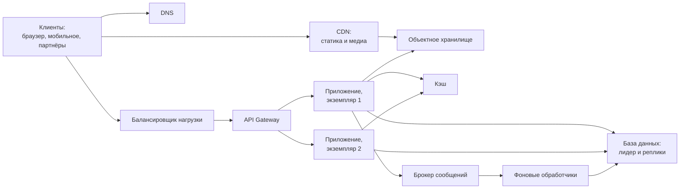

# Б.6 Архитектура приложения: слои, монолит и сервисы, инфраструктура

## Зачем это аналитику

Блоки 3 и 7 основной программы говорят о микросервисах, балансировщиках, кэшах и шлюзах так, будто их роль уже понятна. Этот модуль собирает общую карту: из чего состоит современная серверная система, как код организован внутри приложения и как приложения разворачиваются. С этой картой легче понять, что меняет каждое архитектурное решение.

## Готовность к модулю

Модуль опирается на темы ниже. Если какая-то из них незнакома или её вопросы для самопроверки даются с трудом, начните с неё.

- [А.1 Как устроено приложение](../00a-foundations/a1-how-apps-work.md)

## Куда ведёт

Тема подробнее раскрывается в модулях:

- [Б.8 Распределённые системы](b8-distributed-basics.md)
- [3.1 Зачем микросервисы](../03-microservices-ddd/3.1-why-microservices.md)
- [3.3 OSI, балансировщик, gateway](../03-microservices-ddd/3.3-network-gateway-lb.md)
- [3.7 Наблюдаемость](../03-microservices-ddd/3.7-observability.md)
- [5.6 ML-системы в эксплуатации](../05-ai-engineering/5.6-ml-in-production.md)
- [7.1 Метод интервью](../07-system-design/7.1-interview-method.md)
- [7.2 Оценки на салфетке](../07-system-design/7.2-estimation.md)
- [7.3 Кэширование](../07-system-design/7.3-caching.md)
- [7.5 Строительные блоки](../07-system-design/7.5-building-blocks.md)
- [10.1 Контейнеры и Kubernetes](../10-infrastructure-delivery/10.1-containers-kubernetes.md)
- [10.3 Облака](../10-infrastructure-delivery/10.3-cloud.md)

## Что понять

- [ ] Слоистая архитектура внутри приложения: контроллеры, бизнес-логика, доступ к данным. Зачем разделять.
- [ ] Монолит, модульный монолит и микросервисы: в чём разница и какую цену платят за разделение.
- [ ] Состояние и отсутствие состояния: почему серверы без состояния легко масштабировать.
- [ ] Горизонтальное и вертикальное масштабирование.
- [ ] Балансировщик нагрузки, API Gateway, кэш, CDN, объектное хранилище — роль каждого на общей схеме.
- [ ] Контейнер и образ: что такое Docker на уровне идеи; оркестратор как «диспетчер» контейнеров.
- [ ] Облако: IaaS, PaaS, SaaS и управляемые сервисы.
- [ ] Конфигурация и секреты: почему они отделены от кода.

## Урок

<!-- LESSON:START -->
Аналитик обычно видит систему как набор экранов, методов API и таблиц. Архитектор видит ещё два слоя: как код организован внутри приложения и как приложения разложены по машинам, сетям и управляемым сервисам. Без этого трудно понять, почему разработчик говорит «так нельзя, у нас несколько экземпляров». Урок собирает общую карту; детали разбираются в основной программе.

### Слои внутри приложения

Типичное серверное приложение делится на три слоя.

- **Слой представления, или контроллеры (controllers, API layer).** Принимает HTTP-запрос или сообщение из очереди, разбирает его, проверяет формат, вызывает бизнес-логику и превращает результат в ответ: код статуса, JSON, заголовки. Здесь живёт всё, что знает о транспорте.
- **Слой бизнес-логики (service layer, domain).** Правила предметной области: можно ли принять платёжное поручение, хватает ли лимита, в какой статус перевести документ. Этот слой не должен знать, пришёл ли вызов по HTTP, из очереди или из пакетного задания.
- **Слой доступа к данным (data access, repository).** Сохраняет и читает сущности: SQL-запросы, работа с ORM, вызовы внешнего хранилища. Бизнес-логика просит «найди поручение по номеру», а не пишет SQL сама.

Пройдём запрос насквозь. Бухгалтер юрлица отправляет платёжное поручение. Контроллер проверяет, что тело — корректный JSON, обязательные поля на месте, сумма — число, и достаёт из токена идентификатор клиента. Сервисный слой проверяет бизнес-правила: счёт принадлежит клиенту, дата не в прошлом, получатель не в стоп-листе, сумма в пределах дневного лимита. Слой данных сохраняет документ в статусе «принят» в одной транзакции с записью журнала. Контроллер возвращает `201` и номер документа.

Зачем разделять:

- **Разные причины изменений.** Смена формата API (новая версия, переход с REST на очередь) не должна трогать правила лимитов. Переход с одной СУБД на другую не должен менять контроллеры.
- **Тестируемость.** Бизнес-правила проверяются модульными тестами без поднятия веб-сервера и базы.
- **Повторное использование.** Одно и то же правило «проверить лимит» вызывается из веб-API, из пакетной загрузки файла и из интеграции host-to-host. Если правило написано в контроллере, его придётся копировать трижды, и копии разойдутся.
- **Понятные места для требований.** Проверка формата — на границе, бизнес-проверка — в сервисе, ограничение уникальности — в базе. Аналитик, который знает слои, пишет постановку так, что разработчику ясно, куда положить каждое правило.

Правило направления зависимостей простое: верхний слой вызывает нижний, но не наоборот. Бизнес-логика не формирует HTTP-ответы, слой данных не решает, допустим ли перевод. Более строгие варианты — гексагональная архитектура (порты и адаптеры) и «чистая архитектура» — переворачивают зависимость от базы: бизнес-логика объявляет интерфейс «хранилище поручений», а слой данных его реализует. Для аналитика достаточно идеи: ядро с правилами не зависит от технических деталей.

Важная оговорка: слои — это способ организовать код **внутри** одного приложения. Резать систему на отдельные сервисы по слоям («сервис UI», «сервис логики», «сервис данных») — ошибка, потому что любое изменение функции затронет все три.

### Монолит, модульный монолит, микросервисы

Эти три слова описывают не слои, а то, сколько единиц развёртывания у системы и как проведены границы между бизнес-частями.

**Монолит** — одно приложение, которое собирается и выкатывается целиком, обычно с одной базой. Внутри могут быть слои, но бизнес-части (заказы, склад, оплата) переплетены: модуль заказов напрямую читает таблицы склада, общие классы используются всеми.

**Модульный монолит** — тоже одна единица развёртывания, но с жёсткими внутренними границами по бизнес-возможностям. У каждого модуля свои таблицы (часто своя схема в базе), соседи обращаются к нему только через публичный интерфейс, а правила проверяются автоматически.

**Микросервисы** — набор независимо развёртываемых сервисов, каждый владеет своей бизнес-возможностью и своими данными. Сервисы общаются по сети: синхронно через API или асинхронно через брокер.

| Свойство | Монолит | Модульный монолит | Микросервисы |
|---|---|---|---|
| Единиц развёртывания | Одна | Одна | Много |
| Вызов между частями | В памяти | В памяти, через интерфейс модуля | По сети |
| Транзакция на несколько частей | Обычная, одна база | Обычная, одна база | Нет, нужны саги и компенсации |
| Изменение границы между частями | Дёшево, но границ часто нет | Дёшево: рефакторинг | Дорого: контракты, миграция данных |
| Независимый релиз частей | Нет | Нет | Да |
| Независимое масштабирование частей | Нет | Нет | Да |
| Эксплуатация | Проще всего | Просто | Нужна платформа: CI/CD, наблюдаемость, оркестрация |

Цена разделения на сервисы — это переход от вызова функции к сетевому вызову. Вызов в памяти занимает наносекунды и либо выполнился, либо бросил исключение. Сетевой вызов занимает миллисекунды и может закончиться неопределённостью: запрос дошёл, операция выполнена, а ответ потерялся. Отсюда таймауты, повторы, идемпотентность, отсутствие общей транзакции, согласованность в конечном счёте, распределённая трассировка. Об этом модуль Б.8.

Что покупают за эту цену: независимые релизы и работу многих команд без постоянной координации, раздельное масштабирование частей с разной нагрузкой, изоляцию сбоев. Если над системой работает одна команда, первое преимущество ей не нужно, а цену придётся заплатить полностью. Поэтому модульный монолит — частый разумный старт.

Худший вариант — **распределённый монолит**: сервисы разнесены по сети, но выкатываются вместе, читают общую базу и вызывают друг друга длинными синхронными цепочками. Издержки сети есть, независимости нет.

### Состояние и серверы без состояния

**Состояние (state)** — данные, которые приложение помнит между запросами: сессия пользователя, корзина, загруженный файл, счётчик попыток входа, промежуточный результат расчёта.

Сервер **с состоянием (stateful)** хранит это в своей памяти или на своём локальном диске. Тогда следующий запрос того же пользователя должен попасть на тот же экземпляр, иначе корзина «пропадёт». Сервер **без состояния (stateless)** ничего не помнит между запросами: всё нужное приходит в самом запросе (например, токен с идентификатором клиента) или читается из внешнего хранилища — базы, кэша, объектного хранилища.

Почему серверы без состояния легко масштабировать:

- **Любой экземпляр обслуживает любой запрос.** Балансировщик может отправлять трафик куда угодно, не отслеживая привязку пользователей.
- **Добавить экземпляр — просто запустить ещё одну копию.** Ей не нужно ничего получать от соседей.
- **Убрать или потерять экземпляр не страшно.** Упал процесс — пользователи продолжают работу на соседних, ничего не потеряно, потому что ничего не хранилось.
- **Выкатка без простоя.** Экземпляры новой версии поднимаются, старые гасятся по одному.

Состояние при этом не исчезает, оно переезжает в специализированные компоненты: база данных, распределённый кэш, объектное хранилище, брокер. Масштабировать их сложнее, и именно они обычно становятся узким местом. Архитектурный приём звучит так: сделать как можно больше компонентов без состояния и сосредоточить состояние в немногих местах, которые умеют его надёжно хранить.

Промежуточный вариант — **липкие сессии (sticky sessions)**: балансировщик привязывает пользователя к экземпляру, например по cookie. Это костыль. При падении экземпляра сессии теряются, нагрузка распределяется неравномерно, а выкатка новой версии выбивает пользователей.

### Вертикальное и горизонтальное масштабирование

**Вертикальное масштабирование (scale up)** — сделать машину мощнее: больше ядер, памяти, быстрее диски. Приложение менять не нужно, все гарантии одного сервера сохраняются. Ограничения: есть потолок самой мощной машины, стоимость растёт быстрее мощности, одна машина остаётся единой точкой отказа, а замена часто требует перезапуска.

**Горизонтальное масштабирование (scale out)** — добавить машин и распределить нагрузку между ними. Рост почти не ограничен, отказ одной машины не останавливает систему. Цена — сложность: нужен балансировщик, приложение должно быть без состояния, а для данных — репликация и шардирование.

Для серверов приложений без состояния горизонтальное масштабирование почти бесплатно. Для базы данных — наоборот. Типичный путь (не правило): базу долго растят вертикально, затем добавляют реплики для чтения, и только потом, если запись не помещается в один сервер, делят данные на шарды. Подробно это разбирается в модуле 7.4.

### Общая карта серверной системы

Типичная веб-система с внешними клиентами выглядит так.



Роли компонентов:

| Компонент | Что делает | Хранит состояние |
|---|---|---|
| DNS | Превращает имя сервиса в адрес точки входа | Нет, только записи конфигурации |
| CDN (сеть доставки контента) | Раздаёт статику и медиа с серверов, близких к пользователю, снимает нагрузку с основной системы | Копии, которые можно потерять |
| Балансировщик нагрузки | Распределяет трафик между взаимозаменяемыми экземплярами и исключает неисправные | Нет |
| API Gateway | Единая точка входа: аутентификация, лимиты по клиенту, маршрутизация по сервисам и версиям | Нет, кроме счётчиков лимитов |
| Экземпляры приложения | Выполняют бизнес-логику | Нет, если спроектированы правильно |
| Кэш | Держит часто читаемые данные в памяти, чтобы не ходить в базу | Да, но это копия: её можно восстановить из источника |
| База данных | Источник истины для бизнес-данных | Да, главный держатель состояния |
| Объектное хранилище | Файлы: выписки в PDF, фото товаров, выгрузки, резервные копии | Да |
| Брокер сообщений | Передаёт события и задачи между частями асинхронно | Да, пока сообщения не обработаны |

Два различия стоит запомнить сразу.

**Балансировщик против API Gateway.** Балансировщик решает, какой из одинаковых экземпляров обслужит запрос, и ничего не знает о клиенте как о бизнес-сущности. Gateway решает, пускать ли запрос, в какой сервис его отправить и что с ним сделать по пути: проверить токен, применить лимит партнёра, перевести в нужную версию API. Требование «не больше ста запросов в минуту от одного партнёра» — к gateway, потому что только он знает партнёра. Технически один продукт может выполнять обе роли, но роли остаются разными (модуль 3.3).

**Кэш против CDN.** Кэш стоит рядом с приложением и ускоряет чтение данных, которые приложение отдаёт многим пользователям. CDN стоит рядом с пользователем и ускоряет доставку файлов и страниц, которые одинаковы для всех. Оба — копии, и у обоих главная проблема одна: как не показать устаревшее (модуль 7.3).

**Объектное хранилище (object storage)** стоит выделить отдельно. Это хранилище файлов с доступом по ключу через HTTP-API, практически неограниченное по объёму и дешёвое за гигабайт. Хранить PDF-выписки или фотографии в базе данных — плохая идея: база раздувается, резервные копии растут, а отдача файлов нагружает самый дорогой компонент. Правильно — файл в объектном хранилище, в базе ссылка на него и метаданные.

### Разобранный пример: распродажа и пятикратная нагрузка

Интернет-магазин готовится к распродаже, ожидается пятикратный рост трафика. Пройдём по карте и спросим у каждого компонента, выдержит ли он.

- **Статика и картинки** уже раздаются через CDN — рост на них почти не отражается.
- **Экземпляры приложения** без состояния: было четыре, делаем двадцать. Если сессии хранятся в памяти процесса, это первое, что надо исправить до распродажи.
- **Балансировщик и gateway** — управляемые или многоэкземплярные, нужно проверить их лимиты и лимиты на соединения.
- **База данных** — главный риск. Двадцать экземпляров приложения открывают впятеро больше соединений, а у базы есть предел. Чтение каталога уводим в кэш и на реплики, запись заказов остаётся на лидере — её объём надо оценить отдельно и проверить нагрузочным тестом.
- **Кэш** — надо проверить, что он выдержит поток чтений и что при его перезапуске вся нагрузка не обрушится на базу.
- **Брокер и фоновые обработчики** — письма и уведомления могут отставать, это допустимо; добавляем обработчиков, если очередь растёт.
- **Внешние сервисы** — платёжный шлюз и служба доставки: их лимиты не в наших руках, их надо узнать заранее.

Вывод типичный: серверы приложений масштабируются кнопкой, а работа архитектора — в компонентах с состоянием и во внешних зависимостях.

### Контейнер и образ

Когда приложение ставят на сервер вручную, результат зависит от того, что там уже стояло, — отсюда «на тесте работает, в проде нет». **Образ (image)** решает эту проблему: это упакованная файловая система с приложением и всеми его зависимостями плюс команда запуска. Образ собирают один раз и не меняют. **Контейнер** — запущенный экземпляр образа, изолированный процесс. Из одного образа можно запустить сколько угодно одинаковых контейнеров. Аналогия: образ — это дистрибутив, контейнер — запущенная программа. Образы хранятся в **реестре (registry)**, откуда их забирают серверы. Docker — самый известный инструмент, который сделал эту модель массовой.

Чем контейнер отличается от виртуальной машины. Виртуальная машина эмулирует целый компьютер со своим ядром операционной системы: изоляция сильная, но каждая машина тяжелее, стартует дольше (десятки секунд или минуты) и тратит ресурсы на копию ОС. Контейнер — обычный процесс на общей ОС, которому ядро ограничило видимость (свои файлы, сеть, процессы) и ресурсы (процессор, память). Он лёгкий и стартует за доли секунды или секунды, но изоляция слабее: все контейнеры на машине делят одно ядро. На практике контейнеры часто запускают внутри виртуальных машин — одно не отменяет другое.

Что это даёт архитектуре: один и тот же образ проходит тест, предпрод и прод без пересборки, меняется только конфигурация; новый экземпляр запускается за секунды, что делает горизонтальное масштабирование и восстановление быстрыми; всё, что записано внутри контейнера, пропадает при его пересоздании — ещё одна причина держать состояние снаружи.

**Оркестратор** — диспетчер контейнеров на множестве машин. Ему говорят не «запусти контейнер на сервере 7», а «хочу пять экземпляров сервиса выписок, каждому по два ядра». Дальше он сам выбирает машины, перезапускает упавшие контейнеры, переносит их с отказавшего сервера, добавляет экземпляры под нагрузкой, выкатывает новую версию по одному экземпляру и регистрирует адреса, чтобы балансировщик знал, куда слать трафик. Этот подход называют декларативным: описывается желаемое состояние, а оркестратор постоянно приводит к нему фактическое. Стандарт отрасли — Kubernetes (модуль 10.1).

### Облако и управляемые сервисы

Облако — аренда вычислительных ресурсов по запросу с оплатой за использование. Модели различаются тем, где проходит граница ответственности между провайдером и вами.

| Модель | Что даёт провайдер | Что остаётся вам | Пример |
|---|---|---|---|
| IaaS (инфраструктура как услуга) | Виртуальные машины, диски, сети | ОС, обновления, установка СУБД, резервные копии, мониторинг, приложение | Арендовать ВМ и поставить на неё PostgreSQL самому |
| PaaS (платформа как услуга) | Готовую среду: управляемую базу, очередь, платформу запуска контейнеров | Приложение, схему данных, настройки, права доступа | Управляемый PostgreSQL: провайдер ставит патчи и делает бэкапы |
| SaaS (программа как услуга) | Готовое приложение | Настройку и данные | Почта, CRM, трекер задач |

**Управляемый сервис (managed service)** — компонент, эксплуатацию которого берёт на себя провайдер: база, брокер, кэш, объектное хранилище, Kubernetes-кластер. Вы не ставите обновления и не настраиваете репликацию руками, а заказываете нужную конфигурацию. Плюсы — меньше эксплуатационной работы и быстрее старт. Минусы — меньше контроля над версиями и параметрами, стоимость на больших объёмах, привязка к конкретному провайдеру (vendor lock-in).

Одно правило действует во всех моделях: за данные, доступы и настройки безопасности отвечаете вы. Облако не защитит от публично открытого бакета с выписками клиентов.

### Конфигурация и секреты

**Конфигурация** — всё, что отличается между окружениями при одном и том же коде: адреса баз и соседних сервисов, таймауты, размеры пулов, флаги функций. **Секреты** — подмножество конфигурации, утечка которого опасна: пароли к базе, ключи API партнёров, закрытые ключи сертификатов.

Почему они отделены от кода:

- **Один образ во всех средах.** Если адрес базы зашит в код, для теста и прода нужны разные сборки, и то, что проверили на тесте, не то, что выкатили в прод.
- **Изменение без релиза.** Поднять таймаут или выключить функцию можно без пересборки.
- **Безопасность.** Код видят все разработчики, он живёт в истории репозитория вечно. Пароль, однажды попавший в репозиторий, считается скомпрометированным, даже если его удалили следующим коммитом.
- **Разные права.** Прод-секреты должны видеть единицы людей, код — вся команда.

На практике конфигурацию передают через переменные окружения или файлы, которые оркестратор подкладывает контейнеру при запуске. Секреты хранят в специализированном хранилище секретов (например, HashiCorp Vault или сервис облака), которое выдаёт их приложению по правам, журналирует доступ и позволяет менять пароли без переписывания кода.

```yaml
# Конфигурация сервиса выписок для продуктива — вне образа
STATEMENTS_DB_HOST: statements-db.prod.internal
STATEMENTS_DB_POOL_SIZE: "20"
STATEMENTS_PDF_BUCKET: statements-pdf-prod
PARTNER_API_TIMEOUT_MS: "2000"
FEATURE_NEW_PDF_LAYOUT: "false"
# Пароль к базе не здесь: приложение получает его из хранилища секретов
```

Для аналитика из этого следует практическое правило: всё, что в постановке помечено «может меняться» (лимиты, таймауты, адреса партнёров, пороги), стоит явно отметить как параметр конфигурации, а не как константу.

### Что дальше

Урок дал карту, но не механику. Как на самом деле работают балансировщики разных уровней и gateway, разбирается в модуле 3.3, когда микросервисы оправданы и как мигрировать с монолита — в модуле 3.1, стратегии кэширования и инвалидации — в модуле 7.3, строительные блоки вроде CDN и объектного хранилища — в модуле 7.5. Kubernetes и облака подробно рассматриваются в модулях 10.1 и 10.3, а проблемы, которые возникают, когда частей становится много, — в следующем модуле Б.8.

### Типичные ошибки

- **Бизнес-правила в контроллере.** Проверка лимита живёт в обработчике HTTP, и пакетная загрузка файлов её обходит.
- **Микросервисы с первого дня** для одной команды и неизученного домена: платят полную цену распределённости, не получая главного преимущества.
- **Состояние в памяти экземпляра.** Сессии, загруженные файлы, счётчики в процессе — и система перестаёт масштабироваться, а каждая выкатка теряет данные пользователей.
- **«Масштабируем приложение» без взгляда на базу.** Двадцать экземпляров приложения исчерпывают соединения к базе, и узкое место просто сдвигается.
- **Путать балансировщик и gateway** и адресовать требования к лимитам по клиентам не тому компоненту.
- **Файлы в базе данных** вместо объектного хранилища со ссылкой в базе.
- **Пароли и адреса в коде или в репозитории**, отдельная сборка на каждое окружение.

### Как говорить об этом на собеседовании

На вопрос «опишите архитектуру вашей системы» middle перечисляет технологии, senior рисует карту и объясняет роли: где точка входа, где проверяется токен, какие компоненты без состояния, где живёт состояние, что станет узким местом при росте нагрузки и почему. Хороший приём — сразу отметить на схеме компоненты с состоянием: это показывает, что вы понимаете, где будет сложно.

Полезные формулировки: «экземпляры приложения без состояния, поэтому масштабируются горизонтально; состояние сосредоточено в базе и кэше, и масштабирование упирается в них», «балансировщик выбирает экземпляр, gateway решает, пускать ли запрос и куда», «мы начинали бы с модульного монолита: одна команда, домен ещё уточняется». Пример из практики: как готовили систему к пиковой нагрузке и что оказалось реальным ограничением.

### Коротко

- Слои — контроллеры, бизнес-логика, доступ к данным — разделяют причины изменений и делают правила переиспользуемыми; это организация кода внутри приложения, а не способ нарезать сервисы.
- Монолит, модульный монолит и микросервисы различаются числом единиц развёртывания и жёсткостью границ; цена микросервисов — сеть вместо вызова функции.
- Серверы без состояния взаимозаменяемы, поэтому масштабируются добавлением копий; состояние переезжает в базу, кэш, объектное хранилище и брокер.
- Горизонтальное масштабирование почти бесплатно для приложения и сложно для данных.
- Балансировщик выбирает экземпляр, gateway решает, пускать ли запрос и куда; кэш и CDN — копии, объектное хранилище — место для файлов.
- Образ — неизменяемая упаковка приложения, контейнер — его запущенный экземпляр; оркестратор держит желаемое число экземпляров.
- IaaS даёт машины, PaaS — готовую платформу, SaaS — готовое приложение; за данные и доступы отвечаете вы всегда.
- Конфигурация и секреты живут вне кода: один образ для всех сред, изменения без релиза, пароли не в репозитории.
<!-- LESSON:END -->

## Читать дальше

- Сэм Ньюмен, «Создание микросервисов» (2-е изд.) — главы 1–2.
- Документация Docker: «Get started».
- The Twelve-Factor App (12factor.net).

На system-design.space:

- [Стратегии декомпозиции](https://system-design.space/chapter/decomposition-strategies/)
- [Балансировка трафика](https://system-design.space/chapter/load-balancing/)
- [Стратегии кэширования](https://system-design.space/chapter/caching-strategies/)
- [Шлюз API (API Gateway)](https://system-design.space/chapter/api-gateway-case/)

## Практика

1. Нарисовать схему развёртывания знакомой системы (обезличенно): балансировщики, экземпляры приложений, базы, кэши, брокеры, внешние сервисы.
2. Для этой системы указать, какие компоненты хранят состояние, и оценить, что нужно, чтобы увеличить нагрузку в 5 раз.
3. Запустить в Docker готовый образ (например, PostgreSQL или nginx), посмотреть список контейнеров, логи, остановить и запустить заново.

## Вопросы для самопроверки

1. Зачем разделять приложение на слои?
2. Чем модульный монолит отличается от микросервисов?
3. Почему серверы без состояния проще масштабировать?
4. Чем балансировщик отличается от API Gateway?
5. Что такое контейнер и чем он отличается от виртуальной машины?
6. Чем IaaS отличается от PaaS?

## Заметки

<!-- Свои формулировки, ошибки, ссылки. -->
