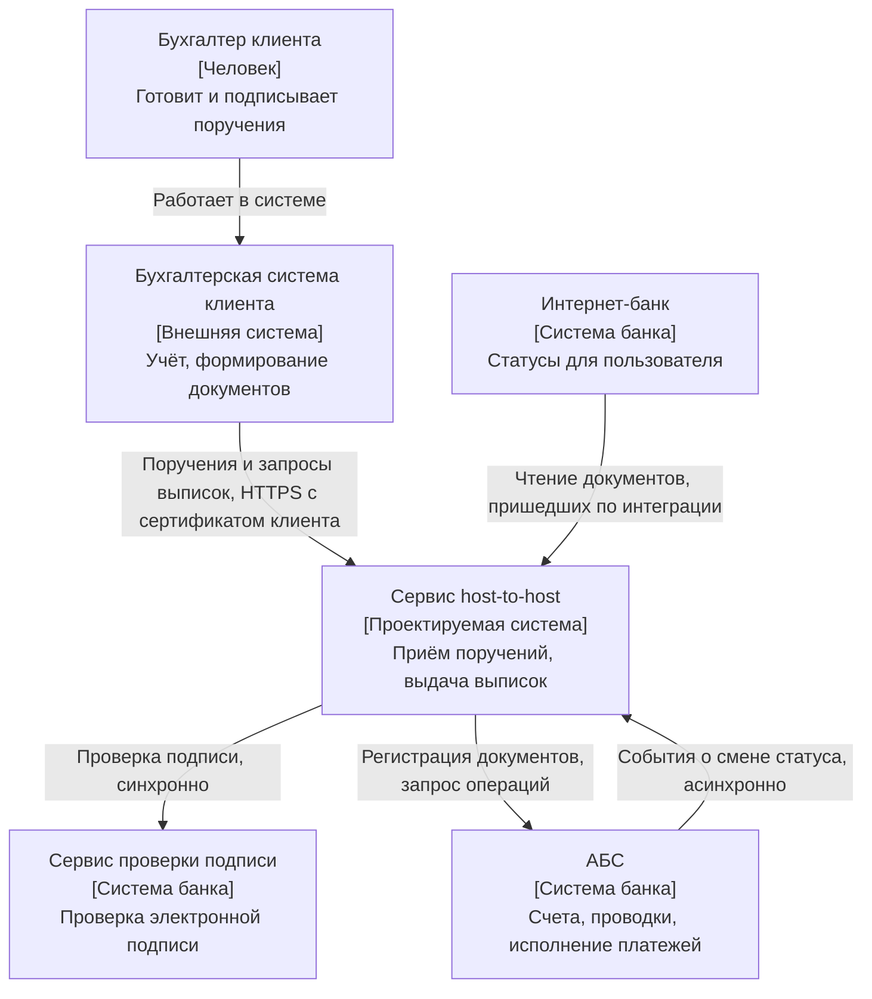
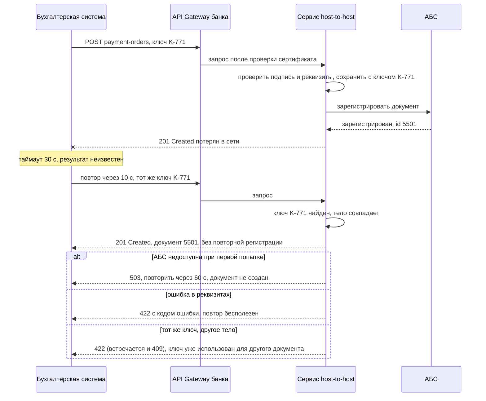

# Б.7 Описание решения: спецификация интеграции, диаграммы, нефункциональные требования

## Зачем это аналитику

Разница между middle и senior хорошо видна по документам: senior описывает не только «как должно работать», но и что будет при сбоях, какие нагрузки, как решение ложится в ландшафт и почему выбран именно этот вариант. Модуль готовит к блоку 6 и итоговому проекту: даёт шаблон описания решения и учит писать нефункциональные требования, которые можно проверить.

## Готовность к модулю

Модуль опирается на темы ниже. Если какая-то из них незнакома или её вопросы для самопроверки даются с трудом, начните с неё.

- [А.7 UML и BPMN](../00a-foundations/a7-uml-bpmn.md)
- [А.9 Системные требования](../00a-foundations/a9-system-requirements.md)

## Куда ведёт

Тема подробнее раскрывается в модулях:

- [4. Итоговый проект](../04-capstone/README.md)
- [6.1 Атрибуты качества](../06-architecture-practice/6.1-quality-attributes.md)
- [6.2 ADR](../06-architecture-practice/6.2-adr.md)
- [6.3 C4 и arc42](../06-architecture-practice/6.3-c4-arc42.md)

## Что понять

- [ ] Состав описания решения: контекст, участники, сценарии, модель данных, интеграции, нефункциональные требования, риски, открытые вопросы.
- [ ] Контекстная диаграмма: система и её окружение. Первое знакомство с моделью C4.
- [ ] Диаграмма последовательности для интеграции: основной сценарий, ошибки, повторы, таймауты.
- [ ] Маппинг полей между системами: источник, приёмник, преобразование, правила по умолчанию.
- [ ] Нефункциональные требования: производительность, доступность, объёмы, безопасность, аудит — с цифрами и способом проверки.
- [ ] Обработка ошибок как часть требований: какие ошибки возможны, кто их обрабатывает, что видит пользователь, что попадает в журнал.
- [ ] Фиксация решения и альтернатив: первое знакомство с ADR.
- [ ] Как проводить ревью своей постановки с разработкой и тестированием.

## Урок

<!-- LESSON:START -->
Постановка уровня middle отвечает на вопрос «что система делает, когда всё хорошо». Описание решения уровня senior отвечает ещё на три: что происходит, когда что-то пошло не так; при каких нагрузках и ограничениях это должно работать; почему выбран именно такой способ. Разработчик, тестировщик и эксплуатация читают документ именно ради этих ответов: основной сценарий они часто могут угадать сами, а поведение при сбоях — нет.

Урок построен на одном сквозном примере, и каждый раздел показывает соответствующую часть документа.

### Сквозной пример

Банк для юрлиц подключает бухгалтерские системы клиентов напрямую, без ручной выгрузки файлов (интеграция host-to-host). Бухгалтерская система клиента должна уметь две вещи: отправить в банк подписанные платёжные поручения и получить выписку по счёту — список операций с остатками. На стороне банка интеграцию обслуживает отдельный сервис host-to-host, который стоит за API Gateway и работает с автоматизированной банковской системой (АБС) — учётным ядром банка, где живут счета и проводки.

### Состав описания решения

Названия разделов в разных компаниях свои, но набор вопросов, на которые документ обязан ответить, устойчив.

| Раздел | На какой вопрос отвечает | Что в нём для примера |
|---|---|---|
| Контекст и цели | Зачем это делается и как поймём, что получилось | Сократить ручную загрузку файлов, цель — 80% поручений крупных клиентов через интеграцию |
| Участники | Кто и что взаимодействует с решением | Бухгалтер, бухгалтерская система, сервис host-to-host, АБС, сервис проверки подписи |
| Границы | Что входит в решение и что нет | Входят поручения и выписки; не входят валютные операции и зарплатные реестры |
| Сценарии | Как проходят основные и альтернативные потоки | Отправка поручения, повтор, отказ, получение выписки за период |
| Модель данных | Какие сущности и статусы появляются или меняются | Входящий документ, ключ идемпотентности, статусы поручения |
| Интеграции | Контракты, протоколы, маппинг полей | Описание API, таблица маппинга, способ аутентификации |
| Обработка ошибок | Что может сломаться и что тогда происходит | Таблица ошибок с реакцией и журналированием |
| Нефункциональные требования | Сколько, как быстро, насколько надёжно и безопасно | Нагрузка, время ответа, доступность, объёмы, аудит |
| Решения и альтернативы | Почему так, а не иначе | Запрос выписки клиентом, а не отправка банком |
| Риски | Что может помешать и что с этим делаем | Разные версии бухгалтерских систем у клиентов |
| Открытые вопросы | Что ещё не решено и кто решает | Срок хранения ключей идемпотентности — ждём ответа ИБ |

Раздел открытых вопросов часто считают признаком незрелости документа. Наоборот: документ без открытых вопросов на ранней стадии либо тривиален, либо скрывает допущения. Важно, чтобы у каждого вопроса был владелец и срок.

### Контекстная диаграмма

Контекстная диаграмма показывает систему одним блоком и всё, что её окружает: людей и внешние системы, а на стрелках — что и как передаётся. Внутренности не показываются вовсе. Её задача — провести границу: что наше, что чужое, с кем мы договариваемся о контрактах.

Это первый уровень модели C4 (System Context). C4 предлагает смотреть на систему в нескольких масштабах, как на карте: контекст, затем контейнеры (отдельно разворачиваемые приложения и хранилища), затем компоненты внутри контейнера и, наконец, код. Для описания интеграции почти всегда хватает первого уровня, иногда второго.

Правила, которые делают диаграмму полезной:

- **Одна система в фокусе.** Всё остальное — окружение. Если на схеме две «проектируемые системы», это уже другой уровень.
- **Подписи на стрелках.** «Интеграция» — не подпись. Подпись говорит, что передаётся, и, если важно, как: синхронно или асинхронно, по какому протоколу.
- **Легенда типов.** Люди, внешние системы, системы своей компании — визуально или текстом различимы.
- **Ни одной внутренней детали.** Базы, очереди и сервисы внутри системы появятся на следующем уровне.

Диаграмма сразу порождает вопросы, и это её польза. Кто отвечает за сервис проверки подписи и какой у него лимит? Интернет-банк читает данные из нашего сервиса или из АБС? Откуда бухгалтерская система берёт сертификат? Каждый такой вопрос — строка в разделе открытых вопросов.

### Диаграмма последовательности: не только основной сценарий

Диаграмма последовательности для интеграции ценна тем, что показывает поведение во времени, включая ожидание, таймауты и повторы. Основной сценарий нарисовать легко. Работа начинается, когда вы добавляете то, что происходит при сбое.

Ключевая ситуация для любой сетевой операции — потерянный ответ. Бухгалтерская система отправила поручение, банк его принял, но ответ не дошёл: оборвалось соединение или сработал таймаут клиента. Клиент не знает, принято поручение или нет. Если он просто отправит его снова, банк может принять его дважды и списать деньги дважды. Решение — ключ идемпотентности (idempotency key): клиент генерирует уникальный ключ на каждый документ и передаёт его при каждой попытке, а банк по этому ключу узнаёт повтор и возвращает прежний результат, не создавая новый документ.

Что должно быть зафиксировано в требованиях рядом с диаграммой:

- **Таймауты.** Сколько ждёт клиент (здесь 30 секунд), сколько сервис ждёт АБС и сервис подписи. Внутренние таймауты должны быть меньше внешнего, иначе клиент уже сдался, а банк продолжает работу.
- **Политика повторов.** Какие ответы повторять (таймаут, обрыв, `503`), какие нет (`4xx`, бизнес-отказы). Через какое время, сколько раз, с каким ростом интервала.
- **Идемпотентность.** Как формируется ключ, сколько времени банк его помнит, что происходит при повторе с тем же ключом, но другим содержимым.
- **Синхронная и асинхронная часть.** `201` означает «документ принят», а не «деньги ушли». Исполнение платежа — отдельный процесс в АБС, итоговый статус (исполнен, отклонён) клиент узнаёт позже: запросом статуса или из выписки. Это должно быть написано явно, иначе интегратор клиента будет считать `201` исполнением.

### Обработка ошибок как часть требований

Ошибки — это не приложение к постановке, а такие же требования, как основной сценарий. Для каждой возможной ошибки нужно ответить на пять вопросов: что её вызывает, кто её обрабатывает, можно ли повторить, что видит пользователь, что попадает в журнал.

| Ситуация | Код | Кто обрабатывает | Повтор | Что видит бухгалтер | Журнал |
|---|---|---|---|---|---|
| Ошибка формата или реквизитов | 422 | Бухгалтерская система показывает ошибку | Нет, после исправления — новый документ | Текст ошибки с указанием поля | Код ошибки, ключ, клиент, без полного тела |
| Неверная подпись | 422 | Бухгалтер переподписывает | Нет | «Подпись недействительна» | Факт отказа, идентификатор сертификата |
| Сертификат клиента не принят | 401 или 403 | Администратор клиента, поддержка банка | Нет | «Нет доступа к банку» | Попытка доступа, отпечаток сертификата |
| АБС или сервис подписи недоступны | 503 | Бухгалтерская система автоматически | Да, с тем же ключом | «Отправка отложена» | Ошибка зависимости, время ответа |
| Таймаут или обрыв соединения | нет ответа | Бухгалтерская система автоматически | Да, с тем же ключом | Ничего, пока не исчерпаны повторы | На стороне клиента |
| Отказ при исполнении, например недостаточно средств | статус REJECTED позже | Бухгалтер | Нет, решение по ситуации | Статус и причина отказа | Смена статуса с причиной |

Из таблицы видно разделение ответственности: технические сбои обрабатывает система автоматически, ошибки данных — человек. Если это не записано, каждая сторона будет считать, что обработка на другой.

Отдельно стоит решить, что делать, когда повторы исчерпаны. Типичный ответ — документ остаётся в бухгалтерской системе в статусе «не отправлен», бухгалтер видит уведомление, а поддержка банка может найти все попытки по ключу в журнале. Если в требованиях нет этого пункта, документ может тихо «застрять», и об этом узнают только когда поставщик позвонит спросить, где деньги.

### Маппинг полей

Когда две системы описывают одни и те же данные по-разному, нужен маппинг: таблица соответствия полей источника и приёмника. Хороший маппинг отвечает не только на вопрос «какое поле куда», но и на вопросы «как преобразовать», «обязательно ли» и «что делать, если поля нет».

Фрагмент маппинга для поручения — от API host-to-host к внутреннему формату АБС:

| Поле источника | Поле приёмника | Обязательность | Преобразование | Если нет или неверно |
|---|---|---|---|---|
| `number` | `doc_num` | Да | Строка без изменений, проверка формата номера | Отказ 422 |
| `date` | `doc_date` | Да | ISO-дата в формат АБС | Отказ 422, датой по умолчанию не подставлять |
| `amount` | `amount_minor` | Да | Строка в рублях в целое число копеек: «1500.50» в 150050 | Отказ 422, если больше двух знаков после точки |
| `payer.account` | `debit_account` | Да | Без изменений, проверка принадлежности клиенту | Отказ 403 |
| `payee.bic` | `payee_bank_bic` | Да | Проверка по справочнику банков | Отказ 422 |
| `purpose` | `payment_purpose` | Да | Обрезка пробелов по краям | Отказ 422, если длиннее 210 символов |
| `priority` | `payment_priority` | Нет | Без изменений | По умолчанию 5 |
| — | `channel` | — | Константа HOST_TO_HOST | Заполняется сервисом |

Несколько правил, которые стоит соблюдать:

- **Значения по умолчанию — бизнес-решение.** «Очерёдность 5, если не передана» должен подтвердить владелец процесса, а не придумать разработчик. Для даты поручения по умолчанию опасно подставлять «сегодня»: клиент мог готовить документ на завтра.
- **Деньги — только в точном формате.** Не число с плавающей точкой, а строка или целые копейки, с явным правилом округления или отказа.
- **Поля, которых нет в источнике, тоже в таблице.** Константы и вычисляемые поля, как `channel`, иначе их забудут.
- **Обратное направление — отдельная таблица.** Для выписки маппинг идёт от АБС к клиенту: признак дебета или кредита превращается в знак суммы или отдельное поле направления, внутренние коды операций — в коды, понятные бухгалтерской системе.

### Нефункциональные требования с цифрами и способом проверки

Нефункциональное требование без числа — пожелание. «Система должна работать быстро» нельзя ни реализовать, ни проверить. Проверяемое требование содержит метрику, порог, условия, при которых он действует, и способ проверки.

| Атрибут | Требование | Как проверить |
|---|---|---|
| Производительность | Приём одного поручения: 95% ответов не дольше 2 с при нагрузке до 30 запросов в секунду | Нагрузочный тест на профиле с пиком конца месяца; в эксплуатации — метрика p95 на gateway |
| Объёмы | До 5 000 поручений в сутки от одного клиента; выписка за период до 50 000 операций отдаётся постранично, не больше 1 000 операций на страницу | Тест с синтетическим клиентом на граничных объёмах |
| Доступность | Приём поручений доступен 99,9% времени за календарный месяц, плановые работы — только ночью с уведомлением клиентов за 3 рабочих дня | Мониторинг внешней синтетической проверкой раз в минуту, ежемесячный отчёт |
| Надёжность и идемпотентность | Повтор с тем же ключом в течение 72 часов не создаёт второй документ; ни одно принятое с кодом 201 поручение не теряется | Автотест с повтором после искусственного обрыва; ежедневная сверка принятых поручений с АБС |
| Безопасность и аудит | Доступ только по взаимному TLS с сертификатом клиента; каждое поручение с проверенной подписью; каждый запрос журналируется с клиентом, ключом, результатом и временем; журнал хранится не меньше срока, установленного политикой банка, и не содержит полных реквизитов | Тест на отказ без сертификата и с чужим сертификатом; выборочная проверка журнала службой безопасности |

Откуда брать цифры. Заказчик редко называет их сразу, но их можно вывести. Объём — из текущей статистики: сколько поручений крупные клиенты загружают файлами сейчас, какой пик в последние дни месяца. Время ответа — из того, как долго бухгалтерская система готова ждать и как это скажется на пользователе. Доступность — из цены простоя: что будет, если поручения нельзя отправить час в последний день месяца. Цифры в таблице выше — пример для учебного случая, в реальном проекте их выясняют и согласуют.

Обратите внимание на формулировки: «95% ответов» вместо «среднее время», потому что среднее скрывает медленные запросы; «за календарный месяц», потому что 99,9% за день и за год — разные обещания; «при нагрузке до 30 запросов в секунду», потому что без условий порог бессмыслен. Способ проверки — не формальность: если его невозможно придумать, требование сформулировано плохо.

### Фиксация решения и альтернатив

Почти в каждой интеграции есть решение, о котором через полгода спросят «почему так». Его стоит записать в виде короткой записи об архитектурном решении (Architecture Decision Record, ADR): контекст, рассмотренные варианты, решение, последствия.

В нашем примере спорный вопрос — как клиент получает выписку.

- **Вариант 1. Клиент запрашивает выписку сам** (pull): бухгалтерская система периодически вызывает API и забирает операции постранично. Простой контракт, клиент управляет темпом, банку не нужно знать адрес клиента. Минус — задержка появления операций и лишние запросы.
- **Вариант 2. Банк отправляет операции клиенту** (push): вызов API на стороне клиента при каждой операции. Операции приходят сразу. Минус — у многих клиентов бухгалтерская система не доступна извне, банк должен хранить адреса и сертификаты клиентов, повторять доставку при недоступности.
- **Вариант 3. Файлы по расписанию** через защищённый файловый обмен. Привычно, но задержка в часы и ручной разбор ошибок.

Решение: вариант 1, плюс лёгкое уведомление «есть новые операции» как возможное развитие. Последствия: нужна пагинация с курсором по времени изменения, чтобы клиент не пропускал операции; задержку до 15 минут бизнес принял; к варианту 2 возвращаемся, если больше трети клиентов попросят мгновенные уведомления.

Зачем записывать отвергнутые варианты. Во-первых, через полгода кто-то снова предложит push, и запись сэкономит день обсуждения: видно, почему отказались и при каком условии решение стоит пересмотреть. Во-вторых, условия меняются, и без записи непонятно, какие допущения устарели. В-третьих, на ревью это показывает, что решение выбрано, а не получилось само.

### Ревью постановки с разработкой и тестированием

Документ, который прочитал только автор, почти наверняка содержит пробелы, невидимые автору: он знает контекст и мысленно дополняет пропущенное. Ревью с разработкой и тестированием — способ найти эти пробелы до того, как их найдёт код.

Как провести ревью, чтобы оно работало:

- **Разослать заранее** и попросить записывать вопросы, а не комментарии «в целом ок».
- **Проходить по сценариям, а не по разделам.** «Клиент отправил поручение, ответ потерялся, что дальше?» — разработчик вслух проходит путь по диаграмме и маппингу и находит места, где не знает, что делать.
- **Тестировщик строит тесты из таблицы ошибок и нефункциональных требований.** Если по строке таблицы нельзя написать тест, строка сформулирована плохо.
- **Каждый вопрос — пробел в документе.** Ответ дописывается в документ, а не остаётся в переписке. Если ответа нет — вопрос уходит в открытые с владельцем.
- **Отдельный вопрос эксплуатации:** как мы узнаем, что интеграция сломалась, и что будем смотреть в первую очередь.

Полезная метрика собственного роста: сколько вопросов возникает у разработки после ревью, уже в ходе реализации. Чем их меньше, тем лучше был документ.

### Что дальше

Урок дал каркас и первое знакомство с инструментами. Нефункциональные требования в форме сценариев атрибутов качества и их приоритизация разбираются в модуле 6.1, форматы и жизненный цикл ADR — в модуле 6.2, уровни C4 и шаблон arc42 — в модуле 6.3. Итоговый проект потребует собрать по такому составу описание целой системы.

### Типичные ошибки

- **Описан только основной сценарий.** Нет таймаутов, повторов, поведения при недоступности смежной системы — эти решения потом принимает разработчик, каждый по-своему.
- **Код `201` равен «платёж исполнен».** Не разделены синхронный приём и асинхронное исполнение, клиент строит учёт на неверном допущении.
- **Нефункциональные требования словами:** «быстро», «надёжно», «высокая доступность» — без числа, условий и способа проверки.
- **Маппинг без преобразований и значений по умолчанию.** Разработчик сам решает, подставить ли текущую дату и как округлять сумму.
- **Контекстная диаграмма с внутренностями:** базы и очереди на уровне контекста, стрелки без подписей.
- **Решение без альтернатив.** Через полгода никто не помнит, почему отказались от очевидного варианта, и обсуждение начинается заново.
- **Ревью как формальность:** документ рассылают «на согласование» и получают молчание вместо вопросов.

### Как говорить об этом на собеседовании

Вопрос «как вы описываете интеграцию» проверяет, думаете ли вы о сбоях. Ответ уровня senior перечисляет состав документа и сразу переходит к тому, что отличает его от простой постановки: потерянный ответ и ключ идемпотентности, разделение синхронного приёма и асинхронного исполнения, таблица ошибок с ответственностью сторон, нефункциональные требования с цифрами и способом проверки, записанные альтернативы.

Хорошо работает конкретный пример из опыта: «В интеграции банка с бухгалтерскими системами мы отдельно описали, что `201` означает приём, а не исполнение, и ввели ключ идемпотентности на документ; до этого после обрывов связи появлялись дубли». На вопрос о нефункциональных требованиях приведите одно требование полностью — метрика, порог, условия, способ проверки — и объясните, откуда взялась цифра.

### Коротко

- Описание решения отвечает не только на «что», но и на «что при сбое», «при какой нагрузке» и «почему так».
- Состав: контекст и цели, участники и границы, сценарии, модель данных, интеграции и маппинг, ошибки, нефункциональные требования, решения, риски, открытые вопросы с владельцами.
- Контекстная диаграмма — первый уровень C4: одна система в фокусе, окружение, подписанные стрелки, никаких внутренностей.
- Диаграмма последовательности для интеграции обязана показать таймаут, повтор и ошибки; потерянный ответ решается ключом идемпотентности.
- Для каждой ошибки: причина, кто обрабатывает, повторять ли, что видит пользователь, что пишется в журнал.
- Маппинг включает преобразования, обязательность и правила по умолчанию; значения по умолчанию утверждает бизнес.
- Нефункциональное требование — метрика, порог, условия и способ проверки.
- Решения фиксируются вместе с отвергнутыми вариантами, а ревью с разработкой и тестированием ищет пробелы через сценарии.
<!-- LESSON:END -->

## Читать дальше

- c4model.com — раздел «System context diagram».
- arc42.org — шаблон описания архитектуры.
- Карл Вигерс, «Разработка требований к программному обеспечению» — главы о нефункциональных требованиях.

На system-design.space:

- [UML: диаграммы как язык архитектуры](https://system-design.space/chapter/uml/)
- [Software Requirements (краткий обзор)](https://system-design.space/chapter/wigers-requirements-book/)

## Практика

1. Взять интеграцию из своей практики (обезличенно) и описать её по составу из урока: контекст, диаграммы, маппинг, ошибки, нефункциональные требования.
2. Для этой интеграции написать 5 нефункциональных требований с цифрами и способом проверки.
3. Попросить коллегу-разработчика прочитать описание и записать его вопросы: каждый вопрос — пробел в документе.

## Вопросы для самопроверки

1. Из каких разделов состоит описание решения?
2. Что показывает контекстная диаграмма?
3. Как описать обработку ошибок в интеграции?
4. Как сделать нефункциональное требование проверяемым? Приведите пример.
5. Зачем фиксировать рассмотренные альтернативы?

## Заметки

<!-- Свои формулировки, ошибки, ссылки. -->
