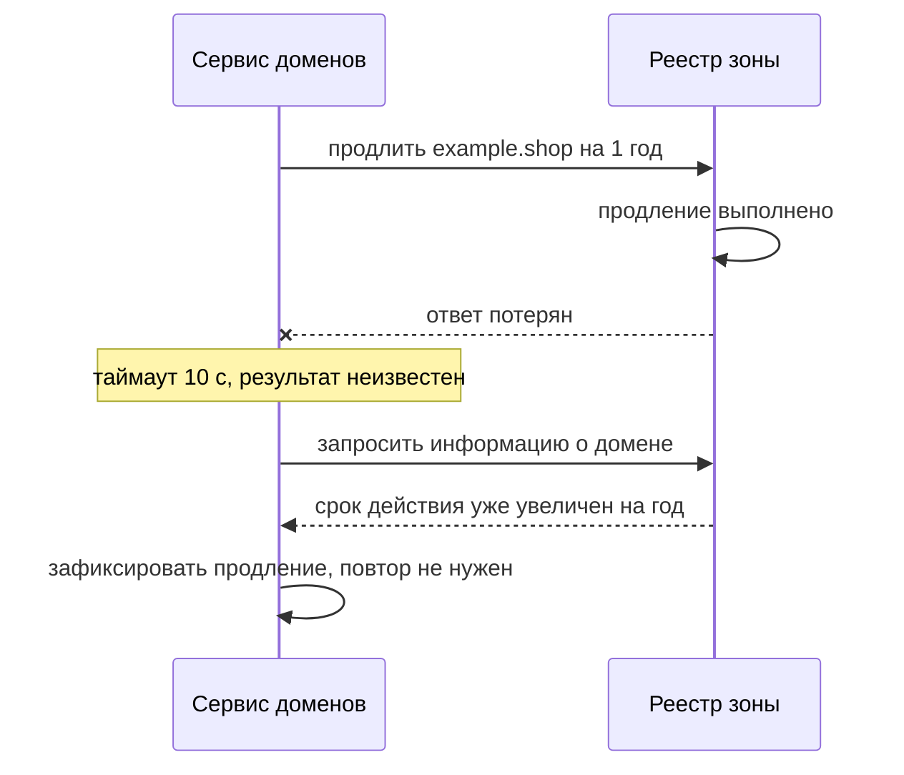
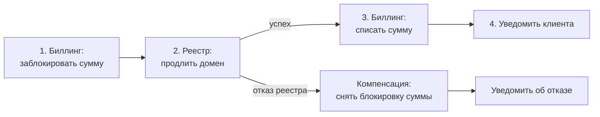

# Б.8 Распределённые системы: базовые понятия

## Зачем это аналитику

Как только система состоит больше чем из одного процесса, появляются задачи, которых нет в монолите: сеть теряет и задерживает сообщения, узлы падают частично, часы расходятся, данные в разных местах временно различаются. Блоки 3 и 7 решают эти задачи паттернами — Saga, circuit breaker, репликацией. Этот модуль объясняет, откуда задачи берутся.

## Готовность к модулю

Модуль опирается на темы ниже. Если какая-то из них незнакома или её вопросы для самопроверки даются с трудом, начните с неё.

- [Б.5 Асинхронный обмен](b5-async-messaging.md)
- [Б.6 Архитектура приложения](b6-app-architecture.md)

## Куда ведёт

Тема подробнее раскрывается в модулях:

- [3.5 Saga, Outbox, CQRS](../03-microservices-ddd/3.5-data-patterns.md)
- [3.6 Устойчивость](../03-microservices-ddd/3.6-resilience.md)
- [3.7 Наблюдаемость](../03-microservices-ddd/3.7-observability.md)
- [7.1 Метод интервью](../07-system-design/7.1-interview-method.md)
- [7.4 Масштабирование данных](../07-system-design/7.4-scaling-data.md)
- [10.4 Отказоустойчивость и DR](../10-infrastructure-delivery/10.4-dr-multiregion.md)

## Что понять

- [ ] Заблуждения о распределённых вычислениях: сеть надёжна, задержка нулевая и т. д.
- [ ] Частичные отказы: почему медленный сервис неотличим от упавшего и зачем нужен таймаут.
- [ ] Повторы и идемпотентность как пара: повтор без идемпотентности создаёт дубли.
- [ ] Репликация и согласованность: сильная и согласованность в конечном счёте; чтение своих записей.
- [ ] Теорема CAP простыми словами и почему на практике важнее PACELC — компромисс задержки и согласованности.
- [ ] Распределённая транзакция и почему её избегают; идея компенсаций (Saga) — первое знакомство.
- [ ] Время и порядок событий: почему нельзя полагаться на часы разных серверов.
- [ ] Наблюдаемость: логи, метрики, трассировка, идентификатор корреляции.

## Урок

<!-- LESSON:START -->
Распределённая система — это несколько процессов на разных машинах, которые решают одну задачу и общаются только через сеть. Под это определение попадает не только кластер из сотни сервисов, но и связка «приложение, база и платёжный шлюз». Как только между частями появляется сеть, появляются и новые виды отказов: не «работает или упало», а «непонятно, что произошло». Большинство паттернов основной программы — ответы на эту неопределённость. Урок объясняет, откуда она берётся.

Сквозной пример — регистратор доменов. Клиент продлевает домен: сервис биллинга списывает деньги с баланса, сервис доменов отправляет команду продления во внешний реестр доменной зоны, уведомления сообщают клиенту результат.

### Заблуждения о распределённых вычислениях

В 1990-х инженеры Sun Microsystems (Питер Дойч, позже Джеймс Гослинг и др.) сформулировали список допущений, которые разработчики неявно делают, переходя от локального кода к сетевому. Все они ложны, и каждое ложное допущение порождает свой класс дефектов.

| Заблуждение | Что на самом деле | Что это значит для требований |
|---|---|---|
| Сеть надёжна | Пакеты теряются, соединения рвутся | Каждый вызов может не дойти или не вернуть ответ; нужны таймауты и повторы |
| Задержка нулевая | Каждый сетевой вызов стоит миллисекунды, между регионами — десятки миллисекунд | Двадцать последовательных вызовов на один экран — это заметная задержка |
| Пропускная способность бесконечна | Канал ограничен и делится с другими | Выгрузка на гигабайты по API в рабочее время мешает остальным |
| Сеть безопасна | Внутри периметра тоже могут быть злоумышленники и ошибки | Шифрование и аутентификация и для внутренних вызовов |
| Топология не меняется | Экземпляры появляются и исчезают, адреса меняются | Нельзя зашивать адреса; нужен поиск сервисов |
| Администратор один | Сетью, облаком, партнёром управляют разные люди | Изменения у соседа ломают вас без предупреждения |
| Передача бесплатна | Сериализация, трафик между зонами и облаками стоят денег и ресурсов | Болтливые интерфейсы дороги в прямом смысле |
| Сеть однородна | Разные протоколы, версии, форматы | Нужны контракты и совместимость версий |

Первые два пункта важнее остальных для аналитика: почти все ошибки в постановках интеграций происходят из неявного допущения, что вызов либо успешен, либо честно вернул ошибку, и происходит мгновенно.

### Частичные отказы и таймаут

В монолите отказ обычно полный: процесс работает или нет. В распределённой системе отказ частичный: одна часть работает, другая нет, третья работает медленно, а связь между ними пропадает на секунды. Самое неприятное — вызывающая сторона часто не может понять, что именно случилось.

Сервис доменов отправил команду продления в реестр и ждёт ответа. Ответа нет. Возможные причины:

1. Запрос потерялся по дороге — реестр о нём не знает.
2. Реестр получил запрос и ещё обрабатывает — он перегружен.
3. Реестр упал до обработки.
4. Реестр упал после обработки — домен продлён.
5. Реестр продлил домен, ответ потерялся на обратном пути.

Со стороны вызывающего все пять случаев выглядят одинаково: тишина. Медленный сервис неотличим от упавшего, потому что единственный наблюдаемый сигнал — ответ, а ответа нет в обоих случаях. Никакой механизм не даст узнать разницу, не получив сообщения от другой стороны.

**Таймаут** превращает бесконечное ожидание в решение: после N миллисекунд считаем вызов неудачным и что-то делаем. Без таймаута ожидающий поток висит, пока не освободится соединение, а при массовом замедлении соседа заканчиваются потоки и соединения, и падает уже вызывающий сервис — отказ каскадом идёт вверх по цепочке. Поэтому сетевой вызов без таймаута — дефект.

Но таймаут не отвечает на вопрос, выполнена ли операция. Случаи 4 и 5 означают, что домен продлён, хотя мы получили таймаут. Отсюда главное правило: **после таймаута результат неизвестен**, а не «операция не выполнена». Требования должны описывать, что делать с неизвестным результатом: проверить состояние запросом, безопасно повторить или передать на ручной разбор.



Как выбрать значение таймаута и как защищать систему от медленных соседей (circuit breaker, bulkhead) — предмет модуля 3.6. Здесь достаточно понять, что таймаут обязателен и что после него появляется неопределённость.

### Повторы и идемпотентность как пара

Самая частая реакция на временный сбой — повторить запрос. Но повтор после неизвестного результата — это риск: если первая попытка на самом деле выполнилась, повтор выполнит операцию второй раз. Для чтения это безвредно, для продления домена или списания денег — нет: клиент заплатит дважды.

Поэтому повторы и идемпотентность существуют только вместе. **Идемпотентная операция** — такая, повторное выполнение которой даёт тот же результат, что и однократное. Способы её добиться:

- **Естественная идемпотентность.** «Установить статус заказа в ОПЛАЧЕН» идемпотентна, «увеличить баланс на 100» — нет. Иногда операцию можно переформулировать: «продлить домен, текущий срок которого истекает 2026-10-01» при повторе не сработает, потому что срок уже другой. Протокол, которым регистраторы общаются с реестрами (EPP), устроен похоже: команда продления содержит текущую дату окончания.
- **Ключ идемпотентности.** Клиент генерирует уникальный ключ операции и передаёт его при каждой попытке. Сервер хранит ключи обработанных операций и на повтор возвращает сохранённый результат.
- **Дедупликация по идентификатору сообщения.** Получатель из брокера запоминает идентификаторы обработанных сообщений и пропускает дубли. Брокеры с гарантией «хотя бы один раз» дубли доставляют обязательно, это нормальный режим работы (модуль Б.5).

Правила повторов, которые должны быть в требованиях:

- повторять только временные ошибки (таймаут, обрыв, перегрузка), а не отказ по бизнес-причине или ошибку в данных;
- интервал между попытками растёт экспоненциально, со случайным разбросом, чтобы тысячи клиентов не повторяли синхронно;
- число попыток ограничено, а после их исчерпания определено, что делать;
- повторяет один уровень цепочки, иначе попытки перемножаются.

### Репликация и согласованность

Данные копируют на несколько узлов (реплицируют) по трём причинам: чтобы пережить отказ узла, чтобы распределить чтение и чтобы данные были ближе к пользователю. Как только копий больше одной, возникает вопрос: все ли копии одинаковы в каждый момент?

При **синхронной** репликации запись подтверждается клиенту, только когда её получили реплики. Копии совпадают, но запись медленнее и зависит от доступности реплик. При **асинхронной** репликации запись подтверждается сразу, а реплики догоняют позже. Это быстрее, но реплики отстают — от миллисекунд до минут под нагрузкой.

Отсюда две модели, которые нужно различать:

- **Сильная согласованность (strong consistency)** — система ведёт себя так, будто копия одна: после успешной записи любое чтение видит новое значение.
- **Согласованность в конечном счёте (eventual consistency)** — если новых записей нет, копии со временем сойдутся, но в какой-то момент разные читатели могут видеть разное.

Где согласованность в конечном счёте допустима: каталог доменных зон с ценами, обновляемый раз в несколько минут; счётчик просмотров; поисковый индекс; витрина отчётов. Где недопустима: проверка баланса перед списанием, уникальность имени домена при регистрации, резерв последней единицы товара. Критерий — что случится, если решение примут на устаревших данных. Если последствие — чуть неточная цифра на экране, можно. Если двойная продажа или отрицательный баланс — нельзя.

Отдельная частая проблема — **чтение своих записей (read-your-writes)**. Клиент продлил домен, страница перезагрузилась, а список показывает старую дату окончания: запись ушла на лидера, чтение — на отставшую реплику. Клиент решит, что продление не прошло, и нажмёт ещё раз. Требование формулируется так: пользователь всегда видит собственные изменения сразу. Реализуют его чтением с лидера сразу после записи или привязкой пользователя к одной копии. Остальные пользователи при этом могут видеть изменения с задержкой.

Аналитик должен формулировать требование к согласованности для каждого сценария, а не для системы целиком.

### CAP и PACELC простыми словами

Теорема CAP говорит о ситуации, когда сеть между узлами разорвалась (partition) и они не могут договориться. В этот момент у системы два пути: либо узел, отрезанный от остальных, отказывает в операции, чтобы не вернуть устаревшее или не принять противоречащее, — это выбор согласованности (C); либо он отвечает тем, что знает, рискуя расхождением, — это выбор доступности (A).

Популярное «выберите два из трёх» неверно. Разрыв сети — не свойство, от которого можно отказаться: он случается независимо от нашего желания. Выбор между C и A делается только на время разрыва. К тому же C в CAP — это строгая согласованность в смысле «как одна копия» (линеаризуемость), а не C из ACID.

На практике разрывы редки, а задержка есть всегда. Поэтому полезнее расширение PACELC: при разрыве (P) выбираем между доступностью и согласованностью (A или C), а иначе (E, else) — между задержкой и согласованностью (L или C). Синхронная репликация в другой дата-центр даёт согласованность, но добавляет задержку к каждой записи каждый день. Асинхронная — быстрая, но при аварии можно потерять последние записи и показывать устаревшее.

Как это звучит в требованиях регистратора: для проверки уникальности имени при регистрации жертвуем доступностью и скоростью — лучше отказать, чем продать один домен двоим; для витрины цен выбираем скорость и допускаем отставание на минуты.

### Распределённая транзакция и компенсации

Продление домена затрагивает два сервиса со своими базами: биллинг и сервис доменов. Хочется, чтобы списание и продление выполнились атомарно, как одна транзакция. Классический механизм — двухфазная фиксация (two-phase commit): координатор спрашивает всех участников «готовы?», каждый записывает изменения и держит блокировки, затем координатор рассылает «фиксируйте».

От этого подхода в современных системах обычно отказываются:

- участники держат блокировки, пока не ответит самый медленный из них, — падает пропускная способность;
- если координатор упал между фазами, участники зависают с заблокированными данными;
- внешние участники в ней не участвуют: реестр доменной зоны или платёжный шлюз не будут держать для вас «подготовленную» транзакцию, а большинство брокеров сообщений её не поддерживает;
- операция успешна, только если доступны все участники одновременно.

Вместо неё используют **сагу (Saga)**: последовательность локальных транзакций, каждая в своём сервисе и сразу фиксируется. Если очередной шаг не удался, уже выполненные шаги отменяются **компенсирующими транзакциями** (операциями) в обратном порядке.



Две вещи, которые важно понять с самого начала. Компенсация — не откат: база не возвращается в прошлое, выполняется новая бизнес-операция, и её следы остаются (снятие блокировки, возврат средств отдельной проводкой). И пока сага не завершена, другие видят промежуточное состояние: сумма заблокирована, домен ещё не продлён. Это состояние должно быть описано в требованиях — как его видит клиент и поддержка.

Порядок шагов тоже не случаен: всё, что может отказать по бизнес-причине и легко отменяется, ставят раньше, а то, что отменить трудно (продление в реестре), — позже. Детально об этом — в модуле 3.5.

### Время и порядок событий

В монолите с одной базой порядок событий определяет сама база: все изменения фиксируются в её едином журнале. В распределённой системе у каждого сервера свои часы, и они расходятся. Серверы регулярно синхронизируют время по сети, но точность синхронизации ограничена, а при коррекции часы могут прыгнуть вперёд или даже назад. Расхождение в миллисекунды — норма, в секунды — встречается.

Почему это опасно. Сервис биллинга на одном сервере записал событие «оплата получена» с отметкой 10:00:00.120. Сервис доменов на другом сервере записал «домен освобождён по истечении срока» с отметкой 10:00:00.100. По отметкам кажется, что освобождение было раньше оплаты, хотя на самом деле часы второго сервера просто спешат. Если потребитель упорядочит события по времени, он примет неверное решение. Ещё хуже стратегия «побеждает последняя запись» (last write wins) по отметкам времени: запись с отстающего сервера молча затирается, данные теряются без ошибки.

Что делать вместо этого:

- **Один источник порядка для одной сущности.** Номер версии у записи домена, который увеличивает только владелец этой записи. Событие несёт номер версии, потребитель игнорирует события с версией меньше уже виденной.
- **Порядок из журнала.** В распределённом журнале сообщений порядок гарантирован внутри одной партиции, поэтому все события одного домена отправляют с одним ключом.
- **Логические часы.** Счётчики, которые увеличиваются при каждом событии и передаются в сообщениях, фиксируют причинный порядок без физического времени. Для аналитика достаточно знать, что такие механизмы существуют.

Время по часам сервера остаётся полезным для людей и отчётов, но не для определения, что было раньше, в решениях системы. В контракте события полезно разделять время события в предметной области и технический порядковый номер.

### Наблюдаемость: как увидеть, что происходит

Когда запрос клиента проходит через gateway, биллинг, сервис доменов, реестр и уведомления, ошибка может случиться в любом звене. Без специальных средств расследование превращается в поиск по пяти журналам в пяти системах. Наблюдаемость (observability) — свойство системы, позволяющее понять её внутреннее состояние по внешним сигналам. Сигналов три.

- **Логи** — записи о событиях с контекстом: что произошло, с какой сущностью, с каким результатом. Отвечают на вопрос «что именно случилось с этим запросом». Полезны, когда структурированы: JSON с постоянными полями, а не свободный текст.
- **Метрики** — числа во времени: количество запросов, доля ошибок, время ответа в перцентилях, длина очереди. Отвечают на вопрос «сколько и как быстро в целом» и служат основой для оповещений.
- **Трассировка (tracing)** — путь одного запроса через все сервисы с временем каждого шага. Отвечает на вопрос «где потерялось время или случилась ошибка».

Связывает всё это **идентификатор корреляции (correlation ID)**: уникальный идентификатор, который присваивается запросу на входе в систему и передаётся дальше во всех вызовах — в заголовках HTTP и в заголовках сообщений брокера. Каждый сервис пишет его в каждую строку журнала. Тогда по одному идентификатору можно собрать всю историю операции, даже если её шаги разнесены по времени и по системам. Для трассировки существует стандартный формат передачи контекста — заголовок `traceparent` из спецификации W3C Trace Context, и современные инструменты часто используют его идентификатор трассы (trace_id) как идентификатор корреляции.

```json
{
  "ts": "2026-09-20T10:15:02.345Z",
  "service": "domain-service",
  "level": "WARN",
  "trace_id": "4bf92f3577b34da6a3ce929d0e0e4736",
  "event": "registry.renew.timeout",
  "domain": "example.shop",
  "attempt": 1,
  "duration_ms": 10000
}
```

Важно, чтобы идентификатор не терялся на асинхронных границах: если сервис кладёт сообщение в брокер без идентификатора, цепочка обрывается. Это требование стоит явно включать в контракт событий. И отдельно — бизнес-идентификаторы: номер заказа или имя домена в логах позволяют поддержке искать без технического идентификатора.

### Что дальше

Урок дал словарь, но не инструменты. Саги, Outbox и порядок шагов подробно разбираются в модуле 3.5, таймауты, повторы, circuit breaker и защита от каскадных отказов — в модуле 3.6, логи, метрики, трассировка и SLO — в модуле 3.7. Репликация, шардирование и модели согласованности глубже — в модуле 7.4, отказоустойчивость на уровне дата-центров и регионов — в модуле 10.4.

### Типичные ошибки

- **Считать таймаут отказом операции.** После таймаута результат неизвестен; повтор без проверки или идемпотентности создаёт дубль.
- **Повторы без идемпотентности** и повторы на каждом уровне цепочки: дубли операций и лавина запросов на перегруженный сервис.
- **Одно требование согласованности на всю систему.** Либо всё сильно согласованное и медленное, либо всё в конечном счёте и с двойными продажами.
- **Забыть про чтение своих записей.** Пользователь не видит только что сделанное изменение и повторяет действие.
- **Путать CAP с выбором «двух из трёх»** и не говорить о компромиссе задержки и согласованности в штатном режиме.
- **Упорядочивать события по времени разных серверов** или разрешать конфликты по принципу «последняя запись побеждает».
- **Потеря идентификатора корреляции** на границе с брокером или внешней системой — расследование обрывается на полпути.

### Как говорить об этом на собеседовании

Сильный ответ показывает, что вы думаете о неопределённости, а не только о сбоях. На вопрос о надёжной интеграции начните с потерянного ответа: «после таймаута мы не знаем, выполнена ли операция, поэтому повтор допустим только идемпотентный — с ключом или проверкой состояния». О согласованности говорите по сценариям: где нужна строгая и чем за неё платим, где допустима в конечном счёте и какую задержку принимает бизнес. CAP объясняйте как выбор на время разрыва и сразу добавляйте PACELC — это отличает понимание от заученной формулы.

Хорошо работают примеры из практики: дубли платежей после повторов и как их устранили ключом идемпотентности; жалобы «я сохранил, а не вижу» из-за чтения с реплики; расследование инцидента по идентификатору корреляции через несколько систем.

### Коротко

- Сеть ненадёжна и небесплатна по времени; из этих двух фактов вытекает большинство проблем распределённых систем.
- Медленный сервис неотличим от упавшего; таймаут обязателен, но после него результат неизвестен.
- Повтор без идемпотентности создаёт дубли; повторяют только временные ошибки, с растущим интервалом и ограничением.
- Сильная согласованность стоит задержки и доступности, согласованность в конечном счёте — временных расхождений; выбор делается по сценарию, с учётом чтения своих записей.
- CAP — выбор между согласованностью и доступностью на время разрыва сети; PACELC добавляет компромисс задержки и согласованности в штатном режиме.
- Распределённых транзакций избегают; вместо них сага из локальных транзакций с компенсациями, которые являются новыми операциями, а не откатом.
- Часы разных серверов расходятся; порядок определяют версии и журналы, а не отметки времени.
- Логи, метрики и трассы связывает идентификатор корреляции, который передаётся через все вызовы и сообщения.
<!-- LESSON:END -->

## Читать дальше

- Клеппман, «Высоконагруженные приложения», главы 5, 8, 9.
- Статья «Fallacies of distributed computing explained» (Arnon Rotem-Gal-Oz).

На system-design.space:

- [Зачем нужны распределённые системы и консистентность](https://system-design.space/chapter/distributed-systems-overview/)
- [Теорема CAP](https://system-design.space/chapter/cap-theorem/)
- [Наблюдаемость и проектирование мониторинга](https://system-design.space/chapter/observability-monitoring-design/)

## Практика

1. Для сценария «оплата заказа в интернет-магазине» с участием платёжного шлюза, склада и доставки перечислить все частичные отказы и описать реакцию системы на каждый.
2. Для одного сервиса из своей практики (обезличенно) решить: где нужна сильная согласованность, а где достаточно согласованности в конечном счёте, и почему.
3. Предложить набор полей для журнала и идентификатор корреляции, по которым можно проследить заказ через все системы.

## Вопросы для самопроверки

1. Почему в распределённой системе нельзя отличить медленный сервис от упавшего?
2. Что такое согласованность в конечном счёте? Приведите пример, где она допустима, и где нет.
3. Объясните теорему CAP своими словами.
4. Почему избегают распределённых транзакций и что используют вместо них?
5. Зачем нужен идентификатор корреляции?
6. Почему опасно упорядочивать события по времени разных серверов?

## Заметки

<!-- Свои формулировки, ошибки, ссылки. -->
