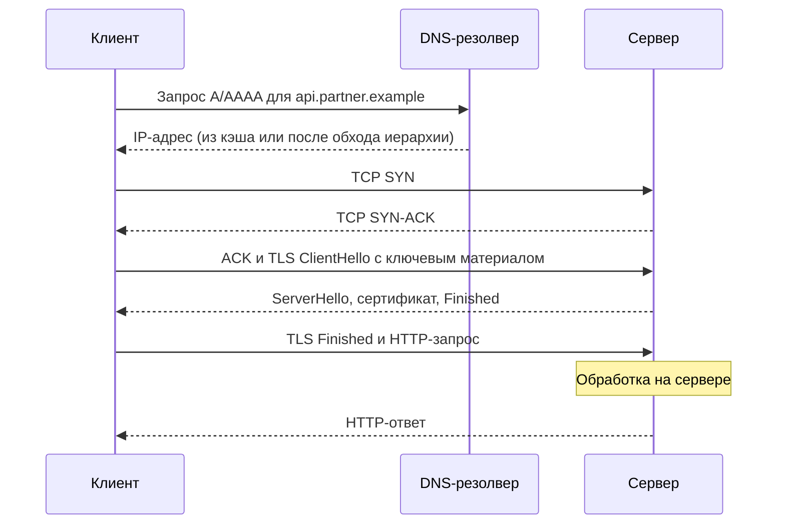
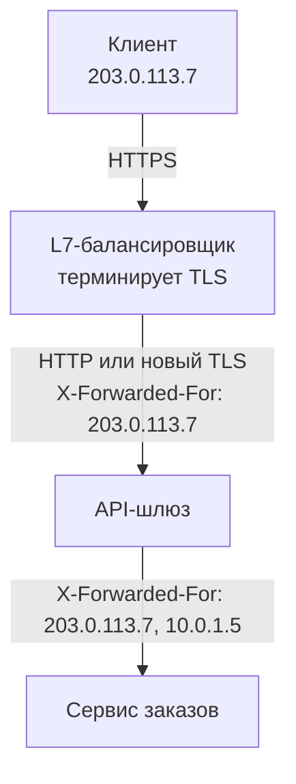

# 1.1 Путь HTTP-запроса: DNS → TCP → TLS → HTTP

## Зачем это аналитику

Когда в требованиях пишут «таймаут 5 секунд», надо понимать, из чего складываются эти секунды: резолв имени, установка соединения, рукопожатие, ожидание ответа, передача тела. Без этого невозможно осмысленно разбирать инциденты вида «интеграция тормозит» и обсуждать с разработкой connect timeout против read timeout, пулы соединений и keep-alive.

## Что понять

- [ ] **DNS**: рекурсивный резолвер, TTL, кэширование на разных уровнях. Почему после смены IP партнёра «у одних работает, у других нет».
- [ ] **TCP**: трёхстороннее рукопожатие (SYN, SYN-ACK, ACK) — это один RTT до первого байта данных. Что такое RTT и почему расстояние до дата-центра важнее пропускной способности канала.
- [ ] **TLS-рукопожатие**: в TLS 1.3 это ещё +1 RTT (в TLS 1.2 было +2). Возобновление сессии и 0-RTT, и почему 0-RTT небезопасен для неидемпотентных запросов (replay).
- [ ] **HTTP/1.1**: keep-alive и пул соединений, head-of-line blocking. Почему браузеры держат по 6 соединений на хост.
- [ ] **HTTP/2**: мультиплексирование потоков в одном соединении, бинарные фреймы, сжатие заголовков HPACK. HOL-блокировка переехала с уровня HTTP на уровень TCP.
- [ ] **HTTP/3 и QUIC**: транспорт поверх UDP, TLS встроен в рукопожатие, нет HOL-блокировки на уровне транспорта, миграция соединения при смене сети.
- [ ] **Таймауты**: connect timeout, TLS handshake timeout, read / idle timeout, общий дедлайн запроса. Кто из них что меряет.
- [ ] **Прокси и промежуточные узлы**: forward proxy, reverse proxy, где терминируется TLS, заголовки `X-Forwarded-For` / `Forwarded`, и почему сервер видит IP балансировщика, а не клиента.

## Урок

<!-- LESSON:START -->
### Из чего складывается время запроса

Когда сервис вызывает `https://api.partner.example/orders`, до первого байта HTTP-ответа проходит несколько независимых этапов: найти IP-адрес по имени, установить TCP-соединение, договориться о шифровании, отправить запрос и дождаться, пока сервер его обработает. Почти каждый этап стоит одного или нескольких полных оборотов пакета туда и обратно — это и есть RTT (round-trip time).

Главная мысль урока: для типичного API-вызова с телом в несколько килобайт время определяется не пропускной способностью канала, а числом RTT и временем обработки на сервере. Канал в 1 Гбит/с не ускорит рукопожатие ни на миллисекунду, если сервер в другом полушарии.



На схеме — новое соединение по TLS 1.3. Дальше разберём каждый этап и то, как его избегают при повторных запросах.

### DNS: имя, кэши и TTL

Приложение редко само ходит к авторитетным серверам. Цепочка обычно такая: библиотека в процессе обращается к системному резолверу-заглушке (stub resolver), тот — к рекурсивному резолверу (провайдера, корпоративному, публичному или облачному). Рекурсивный резолвер, если ответа нет в кэше, проходит иерархию: корневые серверы сообщают, кто отвечает за зону `.example`, те — кто отвечает за `partner.example`, и уже авторитетный сервер этой зоны возвращает запись A (IPv4) или AAAA (IPv6). Команда `dig +trace` показывает ровно этот обход.

Каждый ответ несёт TTL — сколько секунд его можно хранить. Кэшируют на многих уровнях сразу:

- рекурсивный резолвер;
- операционная система (на части систем есть локальный кэширующий демон);
- браузер со своим кэшем имён;
- рантайм языка: JVM, например, кэширует результаты резолва сама, и при некоторых настройках — надолго;
- пул соединений: открытое TCP-соединение вообще не требует DNS, оно привязано к IP, пока живёт.

Отсюда классическая ситуация «у одних работает, у других нет» после того, как партнёр сменил IP. Резолверы получили старую запись в разное время, и каждый держит её до истечения своего TTL. Некоторые резолверы и клиенты не соблюдают TTL строго. Сервис, у которого соединения в пуле живут часами, продолжит ходить на старый адрес, пока соединение не оборвётся. А если старый адрес партнёр не выключил, часть трафика тихо идёт на старую площадку.

Практические следствия для требований к интеграции:

- Партнёр должен заранее снижать TTL перед переездом, а после переезда какое-то время держать старый адрес рабочим.
- Если партнёр требует белый список IP (частая история в банковских интеграциях), смена адреса с любой стороны — это плановое изменение с согласованием, а не «поправим DNS».
- Поиск по имени — тоже сетевой вызов с задержкой и отказами. Недоступный резолвер выглядит для приложения как зависание до таймаута, а не как ошибка сервиса партнёра.

Отдельно стоит помнить про отрицательное кэширование: ответ «такого имени нет» тоже кэшируется. Если запись создали позже, чем её кто-то запросил, этот кто-то какое-то время будет получать ошибку.

### TCP: одно рукопожатие и физика

Прежде чем передать данные, TCP устанавливает соединение: клиент отправляет SYN, сервер отвечает SYN-ACK, клиент отправляет ACK. Данные клиент может отправить вместе с ACK или сразу после него, поэтому рукопожатие стоит один RTT до того, как запрос вообще уйдёт.

Нижнюю границу RTT задаёт физика. Свет в оптоволокне проходит примерно 200 тысяч километров в секунду, то есть каждые 100 км маршрута добавляют к RTT около миллисекунды. Реальный маршрут длиннее прямой линии, добавляются маршрутизаторы и очереди, поэтому фактический RTT между странами — десятки миллисекунд, между континентами — порядка сотни и больше. Никакая «толстая труба» это не исправит.

Вторая причина, по которой полоса вторична, — медленный старт (slow start). Новое TCP-соединение не знает ёмкость канала и начинает с небольшого окна перегрузки (congestion window, в современных стеках порядка десяти сегментов, около 14 КБ). Окно растёт с каждым подтверждённым RTT. Ответ на сотни килобайт по новому соединению потребует нескольких оборотов, даже если канал широкий. Прогретое соединение из пула уже прошло эту фазу — ещё один аргумент за переиспользование соединений.

Полезная для инцидентов деталь: если порт закрыт, сервер отвечает RST, и клиент сразу получает «connection refused». Если пакеты молча отбрасывает межсетевой экран, клиент ждёт до срабатывания connect timeout. Мгновенная ошибка и зависание на N секунд — разные диагнозы.

### TLS: ещё один или два RTT

Поверх TCP идёт рукопожатие TLS: стороны согласуют версию и шифры, сервер предъявляет сертификат, обе стороны вырабатывают общий ключ. Подробно механизм разбирается в модуле 1.2, здесь важна стоимость.

- **TLS 1.2** — полное рукопожатие занимает 2 RTT.
- **TLS 1.3** — 1 RTT. Клиент в первом же сообщении отправляет свою часть обмена ключами (key share), угадывая группу, которую сервер почти наверняка поддерживает.

Возобновление сессии (session resumption) позволяет не повторять полную процедуру: при первом соединении сервер выдаёт клиенту билет (session ticket) или идентификатор, а при следующем стороны используют ранее выработанный секрет. Это экономит вычисления и проверку сертификата, но в TLS 1.3 обычное возобновление всё равно стоит 1 RTT.

Режим 0-RTT (early data) в TLS 1.3 идёт дальше: при возобновлении клиент отправляет данные приложения прямо в первом пакете, не дожидаясь ответа сервера. Цена — защита от повтора (replay). Злоумышленник, перехвативший этот первый пакет, может переслать его серверу ещё раз, и сервер, не имея свежего вклада в ключ от текущего обмена, не может надёжно отличить повтор от оригинала. Для `GET /catalog` повтор безвреден. Для `POST /payments` повтор — второй платёж. Поэтому серверы и балансировщики принимают early data только для безопасных, идемпотентных запросов, а для HTTP есть механизм отказа: заголовок `Early-Data` и код 425 Too Early, по которому клиент повторяет запрос уже после полного рукопожатия. В серверных B2B-интеграциях 0-RTT обычно просто выключен.

Переговоры о версии HTTP идут внутри того же рукопожатия через расширение ALPN (Application-Layer Protocol Negotiation): клиент перечисляет, что умеет (`h2`, `http/1.1`), сервер выбирает. Лишнего RTT на это не тратится.

### Сколько RTT до первого байта

Сведём всё вместе. Время DNS не учтено: при попадании в кэш оно близко к нулю, при промахе добавляет свои обороты до резолвера и дальше. Последний RTT в каждой строке — сам HTTP-запрос и ответ, к нему прибавляется время обработки на сервере.

| Сценарий | Рукопожатия | RTT до первого байта ответа |
|---|---|---|
| Новое соединение, TLS 1.2 | TCP 1 + TLS 2 | 4 |
| Новое соединение, TLS 1.3 | TCP 1 + TLS 1 | 3 |
| Новое соединение, HTTP/3 (QUIC) | QUIC с TLS 1 | 2 |
| HTTP/3 с 0-RTT при возобновлении | нет | 1 |
| Переиспользованное соединение (любая версия) | нет | 1 |

Последняя строка объясняет, почему пул соединений и keep-alive важнее выбора версии протокола для межсервисных вызовов: прогретое соединение сводит сетевую часть к одному RTT.

### HTTP/1.1: keep-alive и очередь на соединении

В HTTP/1.1 соединения по умолчанию постоянные (persistent, keep-alive): после ответа соединение не закрывается и может использоваться для следующего запроса. HTTP-клиенты в приложениях держат пул таких соединений на каждый хост.

Ограничение HTTP/1.1 в том, что на одном соединении в каждый момент выполняется один запрос: следующий ждёт, пока полностью придёт предыдущий ответ. Конвейерная отправка (pipelining) в спецификации есть, но ответы всё равно должны идти строго по порядку, и на практике её почти не используют. Медленный первый ответ задерживает все за ним — это блокировка начала очереди (head-of-line blocking, HOL).

Обходной путь — открыть несколько соединений параллельно. Браузеры договорились о компромиссе: около шести соединений на хост. Больше — лишняя нагрузка на сервер и конкуренция соединений за канал, меньше — страницы с десятками ресурсов грузятся медленно. Из этого же ограничения выросли старые приёмы вроде раздачи статики с нескольких поддоменов (domain sharding) и склейки файлов.

Для серверных интеграций аналог — размер пула. Если пул на 10 соединений, а одновременно нужно сделать 50 вызовов к партнёру, 40 будут ждать свободного соединения. Снаружи это выглядит как «партнёр медленный», хотя очередь у нас.

### HTTP/2: мультиплексирование и новое место для HOL

HTTP/2 сохраняет семантику (методы, заголовки, коды), но меняет представление на проводе:

- **Бинарные фреймы** вместо текстовых строк. Сообщение режется на фреймы заголовков и данных.
- **Потоки (streams)**: у каждой пары запрос-ответ свой идентификатор, фреймы разных потоков перемешиваются в одном TCP-соединении. Десятки запросов идут параллельно без очереди на уровне HTTP.
- **HPACK** — сжатие заголовков. Заголовки повторяются от запроса к запросу (cookie, авторизация, user-agent), поэтому стороны ведут общую таблицу уже переданных полей и ссылаются на неё по индексу, а новые значения кодируют кодом Хаффмана.

HTTP/2 почти всегда работает поверх TLS, версия выбирается через ALPN. Одного соединения на хост обычно достаточно.

Проблема HOL при этом не исчезла, а спустилась на уровень ниже. TCP гарантирует доставку байтов строго по порядку. Если потерялся один пакет, операционная система не отдаст приложению следующие байты, пока пакет не придёт повторно, — даже если они относятся к другим потокам, которым потеря не нужна. На сети с потерями (мобильная связь, перегруженный канал) все потоки встают разом. В таких условиях HTTP/2 на одном соединении может работать хуже, чем HTTP/1.1 с несколькими соединениями, где потеря тормозит только одно из них.

### HTTP/3 и QUIC

HTTP/3 работает поверх QUIC — транспортного протокола поверх UDP. QUIC сам реализует то, что раньше делал TCP (надёжную доставку, контроль перегрузки), но с несколькими принципиальными отличиями:

- **Независимые потоки на уровне транспорта.** Потеря пакета задерживает только тот поток, чьи данные в нём были. Остальные продолжают получать байты. Это и есть решение HOL, которого не мог дать HTTP/2 поверх TCP.
- **TLS 1.3 встроен в рукопожатие.** Установка транспорта и согласование ключей совмещены, новое соединение стоит 1 RTT вместо 2 (TCP плюс TLS 1.3), а при возобновлении возможен 0-RTT с теми же оговорками про повтор.
- **Миграция соединения.** Соединение опознаётся по идентификатору (connection ID), а не по четвёрке адресов и портов. Телефон, перешедший с Wi-Fi на мобильную сеть, получает новый IP, но соединение продолжается без повторного рукопожатия.
- Сжатие заголовков — QPACK, вариант HPACK, адаптированный к тому, что потоки приходят вразнобой.

Ограничения тоже есть. Клиент обычно узнаёт о поддержке HTTP/3 из заголовка `Alt-Svc` или DNS-записи типа HTTPS, поэтому первое соединение часто идёт по TCP. Корпоративные сети нередко блокируют UDP на порту 443, и клиент откатывается на HTTP/2. На момент написания HTTP/3 заметно выигрывает в основном для браузеров и мобильных клиентов на нестабильных сетях. Для вызовов сервис-к-сервису внутри дата-центра, где потерь мало и соединения долгоживущие, выигрыш невелик.

### Таймауты: кто что меряет

Фраза «таймаут 5 секунд» в требованиях почти всегда неполна. У HTTP-клиента несколько независимых таймаутов, и каждый срабатывает в своей фазе.

| Таймаут | Что меряет | Типичная причина срабатывания |
|---|---|---|
| Ожидание соединения из пула (pool acquire) | Сколько ждать свободное соединение | Пул мал для нагрузки, соединения заняты медленными вызовами |
| Connect timeout | Установку TCP-соединения | Хост недоступен, пакеты отбрасывает межсетевой экран, перегружен приём соединений |
| TLS handshake timeout | Рукопожатие TLS | Перегрузка сервера, проблемы с промежуточным узлом, инспекция TLS |
| Read (socket) timeout | Максимальную паузу между порциями полученных данных | Сервер принял запрос и долго обрабатывает, или ответ идёт с паузами |
| Write timeout | Паузу при отправке тела запроса | Сервер не читает тело, забит буфер |
| Idle timeout | Сколько неиспользуемое соединение живёт в пуле | Не ошибка, а политика закрытия |
| Общий дедлайн (call timeout, deadline) | Всё время вызова от начала до конца | Сумма всех фаз превысила бюджет |

Две детали, которые часто путают.

Первая: read timeout в большинстве библиотек — это не время на весь ответ, а максимальная пауза между чтениями из сокета. Сервер, который отдаёт по байту раз в 20 секунд при read timeout 30 секунд, никогда не вызовет срабатывания и продержит запрос сколько угодно. Поэтому нужен ещё и общий дедлайн.

Вторая: если партнёр принял TCP-соединение и завис на обработке, connect timeout уже неважен — соединение установлено за миллисекунды. Сработает read timeout или общий дедлайн. Если же партнёр упал целиком и его адрес не отвечает, сработает connect timeout.

Отдельная ловушка — несогласованные idle timeout. Балансировщик партнёра закрывает простаивающие соединения, скажем, через минуту, а наш пул считает их живыми дольше. Следующий запрос уходит в уже закрытое соединение и получает сброс. Ещё хуже, когда промежуточный NAT или межсетевой экран молча забывает простаивающее соединение: запрос уходит в пустоту, и клиент ждёт до read timeout. Правило: idle timeout клиента должен быть меньше, чем у сервера и всех узлов между ними.

И ещё одно: повтор по таймауту безопасен только для идемпотентных операций. Таймаут не означает, что запрос не выполнился, — возможно, потерялся только ответ. Как проектировать повторы для POST, разбирается в модуле 1.3.

### Разбор примера: бюджет вызова платёжного шлюза

Интернет-магазин при оформлении заказа вызывает платёжный шлюз банка, расположенный в другой стране. Измеренный RTT — 50 мс, шлюз обрабатывает запрос в среднем за 150 мс, в 99-м перцентиле за 800 мс. Шлюз поддерживает только TLS 1.2. Требование бизнеса: пользователь должен получить результат не позже чем через 5 секунд.

Холодный вызов, имя уже в кэше резолвера: TCP 50 мс, TLS 1.2 ещё 100 мс, запрос с ответом 50 мс плюс обработка 150 мс. Итого около 350 мс. Тот же вызов по прогретому соединению из пула — около 200 мс. Разница в 150 мс на каждый холодный вызов — это аргумент за keep-alive и за то, чтобы idle timeout пула был согласован с настройками шлюза.

Теперь раскладываем 5 секунд на конкретные таймауты:

- connect timeout — порядка секунды: это в двадцать раз больше RTT, нормальное соединение устанавливается гораздо быстрее, а недоступный хост мы распознаем быстро и не сожжём весь бюджет на ожидании;
- TLS handshake timeout — тоже в пределах секунды-двух;
- read timeout — с запасом над 99-м перцентилем обработки, например 2–3 секунды;
- общий дедлайн — 4 секунды, чтобы магазину осталось время сформировать ответ пользователю;
- автоматический повтор — только если шлюз поддерживает ключ идемпотентности, и только в пределах оставшегося дедлайна.

Такой разбор и есть содержательная постановка: вместо одной цифры в требованиях появляются несколько, и у каждой есть обоснование.

### Прокси и промежуточные узлы

Между клиентом и приложением почти всегда стоят посредники. Их полезно различать по тому, на чьей они стороне.

**Прямой прокси (forward proxy)** работает от имени клиента: корпоративный выход в интернет, узел с фиксированным IP для белых списков партнёра. Для HTTPS клиент отправляет прокси метод `CONNECT host:443`, прокси открывает TCP-туннель и дальше просто пересылает зашифрованные байты, не видя содержимого. Исключение — корпоративная инспекция TLS, когда прокси подменяет сертификаты своими (подробнее в модуле 1.2).

**Обратный прокси (reverse proxy)** работает от имени сервера: балансировщик нагрузки, API-шлюз, CDN, nginx перед приложением. Клиент думает, что разговаривает с сервером, а на самом деле — с посредником.

Балансировщики бывают двух уровней. L4-балансировщик пересылает TCP-соединения, не разбирая HTTP и не расшифровывая TLS. L7-балансировщик завершает TLS (TLS termination), читает HTTP, может маршрутизировать по пути и заголовкам, а к приложению идёт отдельным соединением — открытым или снова зашифрованным.



Отсюда ответ на вопрос, почему сервис видит IP балансировщика: TCP-соединение к сервису открыл балансировщик, и адрес источника на уровне сети — его. Всё, что сервис знает о настоящем клиенте, он знает из заголовков, которые добавили посредники:

- `X-Forwarded-For` — фактический стандарт. Каждый прокси дописывает в конец адрес того, кто к нему подключился. Получается список: клиент, первый прокси, второй и так далее.
- `X-Forwarded-Proto` и `X-Forwarded-Host` — исходная схема и имя хоста. Без них приложение за терминирующим балансировщиком думает, что запрос пришёл по HTTP, и генерирует неправильные ссылки и редиректы.
- `Forwarded` (RFC 7239) — стандартизованная замена с явными параметрами:

```http
Forwarded: for=203.0.113.7;proto=https;by=10.0.1.5
```

- Для L4-балансировщиков, которые HTTP не трогают, есть протокол PROXY: адрес клиента передаётся служебным заголовком в начале TCP-соединения.

Слепо доверять этим заголовкам нельзя. Клиент может сам отправить `X-Forwarded-For: 10.0.0.1`, и наивный код, берущий первый элемент списка, решит, что запрос пришёл из внутренней сети. Корректный подход: знать список своих доверенных прокси, идти по списку справа налево, пропускать доверенные адреса и считать клиентом первый недоверенный. Соответственно, внешний балансировщик должен перезаписывать или очищать входящие заголовки, а не только дописывать. В nginx это делает модуль real_ip, в фреймворках — настройка доверенных прокси. Для антифрода, лимитов по IP и журналов аудита в банковской системе это требование к безопасности, а не деталь реализации.

### Типичные ошибки

- Записывать в требования один «таймаут 5 секунд» без разделения на connect, read и общий дедлайн. Разработчики поставят его в одно место, и оставшиеся фазы окажутся без ограничения.
- Считать, что повтор по таймауту безопасен. Таймаут на чтении означает «ответ не пришёл», а не «операция не выполнилась».
- Менять IP сервиса без снижения TTL заранее и без периода, когда работают оба адреса, забывая про белые списки IP у партнёров.
- Разбирать задержку интеграции как проблему «медленного канала», хотя виноваты число RTT, отсутствие пула соединений или очередь на пуле внутри своего сервиса.
- Держать idle timeout пула дольше, чем у балансировщика партнёра, и получать периодические сбросы соединений на первом запросе после паузы.
- Брать IP клиента из первого элемента `X-Forwarded-For` без списка доверенных прокси.
- Ожидать, что HTTP/2 или HTTP/3 сами решат проблемы межсервисной интеграции, когда основное время уходит на обработку у партнёра.

### Как говорить об этом на собеседовании

Уровень senior виден по умению разложить задержку на фазы и назвать цифры по порядку величины. Хорошая формулировка: «Холодный HTTPS-вызов по TLS 1.2 — это четыре RTT плюс обработка, по прогретому соединению — один RTT плюс обработка. Поэтому первым делом я смотрю, переиспользуются ли соединения и совпадают ли idle timeout с балансировщиком партнёра». Такая фраза показывает понимание механизма, а не знание терминов.

При разборе кейса вида «раз в несколько минут первый запрос медленный» перечисляйте гипотезы и способ проверки каждой: соединения закрыты по idle timeout и открываются заново (видно по TCP и TLS фазам в трассировке), истёк TTL и идёт повторный резолв (время DNS), промежуточный NAT забыл соединение, на стороне партнёра прогревается кэш или масштабируется инстанс. Хорошо добавить, как оформить результат в требованиях: конкретные таймауты с обоснованием, политика повторов, привязанная к идемпотентности, требования к передаче IP клиента через доверенные прокси.

### Коротко

- Время API-вызова определяется числом RTT и обработкой на сервере, а не шириной канала. RTT ограничен физикой: около миллисекунды на каждые 100 км маршрута.
- DNS кэшируется на многих уровнях, включая пул соединений. Смена IP требует заранее сниженного TTL и периода параллельной работы.
- Новое HTTPS-соединение: TLS 1.2 — 4 RTT до ответа, TLS 1.3 — 3, HTTP/3 — 2. Переиспользованное — 1.
- 0-RTT экономит оборот, но допускает повтор запроса злоумышленником, поэтому применим только к безопасным и идемпотентным запросам.
- HTTP/1.1 — один запрос на соединение за раз, HTTP/2 мультиплексирует потоки, но страдает от HOL на уровне TCP, QUIC убирает HOL за счёт независимых потоков поверх UDP.
- Таймауты меряют разные фазы. Read timeout — пауза между данными, а не время на весь ответ, поэтому нужен ещё общий дедлайн.
- За L7-балансировщиком сервис видит IP балансировщика. Реальный адрес клиента передаётся заголовками, которым можно доверять только от своих прокси.
<!-- LESSON:END -->

## Читать дальше

- Ilya Grigorik, *High Performance Browser Networking* — бесплатно на [hpbn.co](https://hpbn.co). Главы: «Building Blocks of TCP», «Transport Layer Security», «HTTP/1.X», «HTTP/2». Книга 2013 года, но фундамент не устарел.
- [RFC 9110 — HTTP Semantics](https://www.rfc-editor.org/rfc/rfc9110) — пролистать оглавление, чтобы знать, где что лежит; читать выборочно в модуле 1.3.
- Cloudflare Learning Center: «What is DNS», «What is HTTP/3».
- Julia Evans, [Networking! ACK!](https://wizardzines.com/zines/networking/) и [HTTP: Learn your browser's language](https://wizardzines.com/zines/http/) — быстрые и наглядные.

На system-design.space:

- [Модель OSI](https://system-design.space/chapter/osi-model/)
- [Протокол TCP](https://system-design.space/chapter/tcp-protocol/)
- [Система доменных имён (DNS)](https://system-design.space/chapter/dns/)
- [Протокол HTTP](https://system-design.space/chapter/http-protocol/)
- [QUIC и HTTP/3: транспорт нового поколения](https://system-design.space/chapter/quic-http3-protocol/)
- [Задержка (latency): физика, перцентили и бюджеты](https://system-design.space/chapter/latency-budgets/)
- [Визуализация: Динамика HTTP-запроса](https://system-design.space/visuals/http-request-dynamics/)

## Практика

1. Разложить время одного запроса на фазы:
   ```bash
   curl -o /dev/null -s -w "dns=%{time_namelookup} connect=%{time_connect} tls=%{time_appconnect} ttfb=%{time_starttransfer} total=%{time_total}\n" https://example.com
   ```
   Повторить для сайта в соседней стране и на другом континенте. Посчитать RTT как `connect − dns`.
2. `curl -v --http1.1` и `curl -v --http2` на один и тот же адрес — найти в выводе ALPN и договорённую версию протокола.
3. В DevTools → Network включить колонку Protocol и открыть вкладку Timing у запроса. Сопоставить фазы с пунктом 1.
4. `nslookup` / `dig +trace` на любой домен — пройти цепочку от корня до авторитетного сервера.

## Вопросы для самопроверки

1. Сколько RTT нужно до первого байта ответа для нового HTTPS-соединения по TLS 1.2, TLS 1.3 и HTTP/3? А для переиспользованного соединения?
2. Чем connect timeout отличается от read timeout? Какой из них сработает, если партнёр принял соединение, но завис на обработке?
3. Почему HTTP/2 не решил проблему head-of-line blocking полностью и как это решает QUIC?
4. Интеграция стабильно отвечает за 40 мс, но раз в несколько минут первый запрос идёт 300 мс. Какие гипотезы?
5. Что сервер знает о клиенте, если перед ним стоит L7-балансировщик? Как передать реальный IP клиента и почему этому заголовку нельзя слепо доверять?
6. Почему 0-RTT в TLS 1.3 допустим для GET и опасен для POST?

## Заметки

<!-- Свои формулировки, ошибки, ссылки. -->
