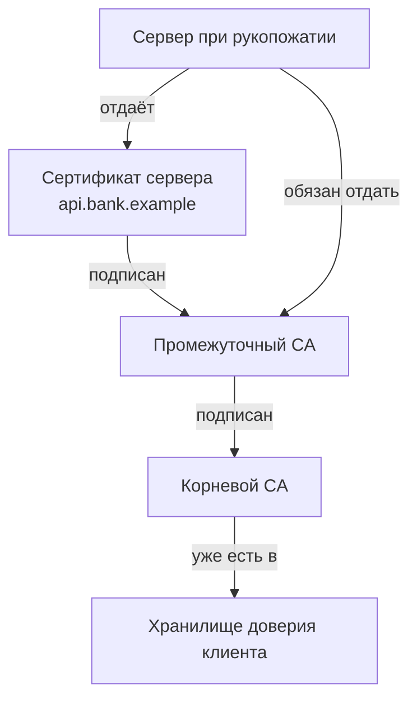
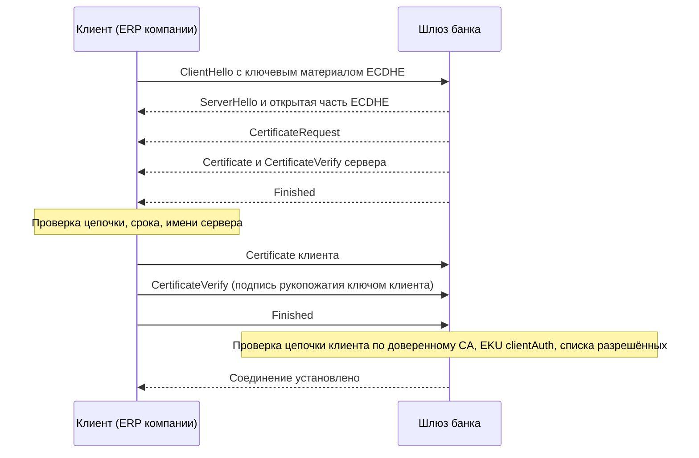

# 1.2 TLS и PKI: сертификаты, цепочки доверия, mTLS

## Зачем это аналитику

«Партнёр прислал сертификат», «у нас корпоративный CA», «нужен mTLS», «истёк промежуточный сертификат» — это обычные задачи в банковских и B2B-интеграциях. Аналитик пишет требования к транспорту и участвует в разборе инцидентов, поэтому должен понимать, что именно проверяется при установке соединения и где это может сломаться.

## Что понять

- [ ] **Симметричное и асимметричное шифрование**: зачем нужны оба. Асимметрия используется для договорённости о ключе и для подписи, данные шифруются симметрично (AES-GCM, ChaCha20-Poly1305).
- [ ] **Обмен ключами (ECDHE)** и **forward secrecy**: почему утечка приватного ключа сервера сегодня не раскрывает вчерашний перехваченный трафик. Почему TLS 1.3 убрал обмен ключами на основе RSA.
- [ ] **Цифровая подпись и хеш**: чем подпись отличается от шифрования; что подписывает CA в сертификате.
- [ ] **Сертификат X.509**: Subject, SAN (именно по нему проверяется имя хоста, а не по CN), срок действия, Key Usage / Extended Key Usage, открытый ключ, подпись издателя.
- [ ] **Цепочка доверия**: leaf → intermediate → root. Корневые сертификаты лежат в хранилище клиента, промежуточные сервер обязан отдать сам. Самая частая ошибка настройки — сервер не отдаёт промежуточный сертификат.
- [ ] **Проверка на клиенте**: цепочка, срок, имя хоста, отзыв (CRL, OCSP, OCSP stapling) и почему на практике отзыв работает плохо; отсюда тренд на короткоживущие сертификаты.
- [ ] **Корпоративный CA**: почему `verify=false` — это не решение, а отключение половины TLS. Правильный путь — добавить корневой сертификат в хранилище доверия клиента.
- [ ] **mTLS**: клиент тоже предъявляет сертификат. Где применяется (банк-клиент, межсервисное взаимодействие, service mesh), как выпускаются и ротируются клиентские сертификаты, где терминируется mTLS и как идентичность клиента передаётся дальше в приложение.
- [ ] **Certificate pinning**: зачем в мобильных приложениях и почему это боль при ротации.
- [ ] **Российская специфика (обзорно)**: ГОСТ TLS и сертификаты НУЦ Минцифры — какие клиенты их поддерживают и что из этого следует для интеграций.

## Урок

<!-- LESSON:START -->
### Что TLS обещает и за счёт чего

TLS даёт соединению три свойства: конфиденциальность (посторонний не прочитает данные), целостность (не изменит незаметно) и аутентификацию сервера (клиент уверен, что говорит именно с `api.bank.example`, а не с кем-то посередине). При mTLS добавляется аутентификация клиента. Первые два свойства обеспечивает криптография, третье — инфраструктура открытых ключей (PKI): сертификаты, удостоверяющие центры и правила проверки. Большинство инцидентов в интеграциях случаются как раз в третьей части.

### Симметрия и асимметрия: зачем нужны обе

В симметричном шифровании один и тот же ключ шифрует и расшифровывает. Оно быстрое, аппаратно ускоряется и подходит для потока данных любого объёма. В TLS используются режимы аутентифицированного шифрования (AEAD): AES-GCM и ChaCha20-Poly1305. Они одновременно шифруют и снабжают каждую запись меткой, по которой получатель обнаружит любое изменение.

Проблема симметрии одна: обе стороны должны заранее иметь общий ключ, а клиент и сервер видят друг друга впервые. Асимметричная криптография (пара ключей: открытый и закрытый) решает две задачи, которые симметрия решить не может:

- **договориться об общем секрете** по открытому каналу так, чтобы наблюдатель его не узнал;
- **доказать, кто ты**, — подписать данные закрытым ключом так, чтобы любой проверил подпись открытым.

Асимметричные операции на порядки медленнее, поэтому ими не шифруют данные. Схема любого современного протокола одинакова: асимметрия в рукопожатии, чтобы выработать ключ и проверить личность; симметрия для всего остального трафика.

### Обмен ключами и forward secrecy

В TLS 1.3 общий секрет обычно вырабатывается алгоритмом ECDHE — протоколом Диффи — Хеллмана на эллиптических кривых с эфемерными (одноразовыми) ключами. Каждая сторона генерирует пару ключей только для этого соединения, отправляет открытую часть, и обе вычисляют один и тот же общий секрет. Наблюдатель видит обе открытые части, но вычислить из них секрет не может. После рукопожатия эфемерные закрытые ключи уничтожаются.

Где тогда долговременный ключ сервера, тот, что соответствует сертификату? Он не участвует в шифровании вообще. Сервер им только подписывает рукопожатие, доказывая, что эфемерная открытая часть пришла именно от владельца сертификата.

Отсюда прямая секретность (forward secrecy). Допустим, кто-то год записывал трафик банка, а сегодня украл закрытый ключ сервера. Расшифровать записанное он не сможет: ключи сессий выводились из эфемерных секретов, которых больше нет. Украденный ключ позволит лишь выдавать себя за сервер в будущем, пока сертификат не отозван или не истёк.

В TLS 1.2 и ранее был другой режим — обмен ключами на основе RSA. Клиент генерировал предварительный секрет, шифровал его открытым ключом сервера и отправлял. Кто получит закрытый ключ сервера, тот расшифрует этот секрет из любой старой записи и, значит, весь трафик. TLS 1.3 убрал такой режим совсем: теперь обмен ключами в полном рукопожатии всегда эфемерный. Заодно убраны устаревшие шифры и режимы, и выбирать «неправильную» конфигурацию стало гораздо сложнее.

### Подпись и хеш

Цифровая подпись часто объясняется как «шифрование закрытым ключом». Это неточно и путает. Шифрование скрывает содержимое, подпись его не скрывает, а доказывает авторство и неизменность. Механизм такой: от данных считается криптографический хеш (SHA-256 и подобные) — короткий отпечаток, который невозможно подделать для другого содержимого. Затем алгоритм подписи (RSA, ECDSA, EdDSA) по хешу и закрытому ключу строит подпись. Проверяющий, имея данные, подпись и открытый ключ, убеждается, что подпись сделана владельцем закрытого ключа и данные с тех пор не менялись.

Удостоверяющий центр (Certificate Authority, CA) подписывает содержимое сертификата: имя владельца, список имён хостов, срок действия, ограничения использования и, главное, открытый ключ владельца. Подпись CA — это утверждение «этот открытый ключ принадлежит тому, кто контролирует эти имена». Ничего секретного в сертификате нет, его может увидеть кто угодно.

### Сертификат X.509: что в нём проверяют

Сертификат в TLS — структура формата X.509. Поля, которые стоит уметь находить в выводе `openssl x509 -text`:

| Поле | Что содержит | Зачем нужно при проверке |
|---|---|---|
| Subject | Имя владельца, включая CN | Для людей и журналов, для имени хоста уже не используется |
| Subject Alternative Name (SAN) | Список DNS-имён и IP-адресов | Именно по нему клиент сверяет имя хоста |
| Issuer | Кто выпустил сертификат | Поиск следующего звена цепочки |
| Validity | Даты начала и окончания действия | Проверка срока |
| Subject Public Key Info | Открытый ключ и его алгоритм | Проверка подписи рукопожатия |
| Key Usage, Extended Key Usage | Для чего можно использовать ключ | Серверный или клиентский сертификат, право подписывать другие сертификаты |
| Basic Constraints | Является ли сертификат CA | Конечный сертификат не может выпускать другие |
| Подпись издателя | Подпись CA над всем перечисленным | Доказательство подлинности |

Про имя хоста стоит запомнить отдельно: современные клиенты сверяют имя только с SAN. Сертификат, в котором нужное имя есть лишь в CN, браузеры и многие библиотеки отвергнут. Шаблон `*.shop.example` покрывает ровно один уровень: `api.shop.example` подходит, `v2.api.shop.example` и сам `shop.example` — нет.

Extended Key Usage разделяет назначения: `serverAuth` — для серверного сертификата, `clientAuth` — для клиентского в mTLS. Сервер, настроенный строго, отвергнет клиентский сертификат без `clientAuth`, и это частая причина отказа при первом подключении банк-клиента.

### Цепочка доверия

Корневые CA не подписывают сертификаты сайтов напрямую. Их закрытые ключи хранят офлайн, а для повседневной выдачи используют промежуточные CA (intermediate). Получается цепочка:



Клиент строит путь от полученного конечного сертификата (leaf) к одному из корней в своём хранилище доверия (trust store). Корень сервер отдавать не должен: клиент ему доверяет только потому, что корень уже есть локально, и присланная копия ничего не доказывает. А вот промежуточные сертификаты клиент взять неоткуда, их обязан прислать сервер.

Самая частая ошибка конфигурации — сервер отдаёт только leaf. Коварство в том, что браузеры часто это прощают: одни помнят промежуточные сертификаты с других сайтов, другие умеют скачать недостающий по ссылке из поля Authority Information Access. Библиотеки в серверных приложениях, `curl` и Java так обычно не делают. Итог: «в браузере открывается, а интеграция падает». Проверяется командой `openssl s_client -showcerts`: если в выводе один сертификат, цепочка неполная.

### Что проверяет клиент и почему не работает отзыв

При рукопожатии клиент по порядку проверяет:

1. Можно ли построить цепочку до доверенного корня, и верны ли подписи на каждом звене.
2. Действует ли каждый сертификат цепочки на текущую дату.
3. Совпадает ли имя хоста из URL с одним из имён в SAN.
4. Допустимо ли использование ключа (Key Usage, EKU, Basic Constraints у промежуточных).
5. Не отозван ли сертификат, если клиент это проверяет.
6. Подписал ли сервер рукопожатие ключом из сертификата, то есть владеет ли он закрытым ключом.

Ошибка `unable to get local issuer certificate` означает, что на первом шаге клиент не нашёл издателя очередного сертификата. Три основные причины: сервер не отдал промежуточный сертификат; корня нет в хранилище клиента (корпоративный CA, минимальный контейнерный образ без пакета корневых сертификатов, устаревшая JVM); между клиентом и сервером стоит прокси с инспекцией TLS, подменяющий сертификат своим. Первое видно по числу сертификатов в `openssl s_client -showcerts`, второе — по полю Issuer последнего сертификата и содержимому хранилища, третье — по тому, что издатель внезапно оказывается корпоративным, а с другой сети всё работает. Ещё одна ловушка: некоторые рантаймы используют собственный набор корней, а не системный, и добавленный в ОС сертификат им не виден.

Отзыв (revocation) нужен, когда ключ скомпрометирован до окончания срока. Механизмов два. CRL — периодически публикуемый список отозванных серийных номеров; списки бывают большими, клиенты скачивают их редко. OCSP — онлайн-запрос к CA о статусе конкретного сертификата; он добавляет задержку, раскрывает CA, какие сайты посещает клиент, и зависит от доступности сервиса CA. Поэтому клиенты применяют мягкий отказ (soft-fail): не получили ответа — считают сертификат действующим. Злоумышленник, способный перехватить трафик, способен и заблокировать OCSP-запрос, и проверка теряет смысл. OCSP stapling частично спасает ситуацию: сервер сам периодически получает подписанный ответ OCSP и прикладывает его к рукопожатию, клиенту не нужно никуда ходить. Но обязательным он так и не стал.

Индустрия пошла другим путём: сократить срок жизни сертификатов, чтобы украденный ключ был полезен недолго, а выпуск и замена стали полностью автоматическими (протокол ACME). На момент написания решение отрасли (CA/Browser Forum, 2025) — поэтапно снижать максимальный срок публичных сертификатов: до 200 дней с марта 2026 года, до 100 дней с 2027-го и до 47 дней с 2029-го. Для аналитика вывод практический: ручная замена сертификата раз в год перестаёт быть вариантом, нужен автоматический выпуск и мониторинг сроков.

### Корпоративный CA и соблазн verify=false

Внутренние сервисы компании часто используют сертификаты от собственного корпоративного CA. Клиент, не знающий этот корень, выдаёт ошибку цепочки, и в коде появляется `verify=false` или его аналог.

Отключение проверки не делает соединение «чуть менее безопасным». Шифрование остаётся, но исчезает аутентификация: клиент готов установить защищённый канал с кем угодно, включая атакующего посередине. Шифрованный канал с неизвестным собеседником защищает от пассивного прослушивания, но не от подмены. Для платёжных данных это равносильно открытому каналу.

Правильный путь — добавить корневой сертификат корпоративного CA в хранилище доверия клиента: системное хранилище, truststore Java, переменную с путём к набору корней для Python или Node.js. Лучше — в отдельное хранилище только для той интеграции, которой он нужен, чтобы корпоративный корень не стал доверенным для всего подряд. Проверку имени хоста при этом не отключают никогда.

Если партнёр предлагает «выключить проверку, у нас самоподписанный», варианты ответа в порядке предпочтения: партнёр получает сертификат публичного CA; партнёр передаёт по доверенному каналу свой корневой или самоподписанный сертификат, и мы добавляем его в отдельное хранилище для этой интеграции, сверив отпечаток по телефону или через другой канал. Второй вариант по сути закрепляет конкретный ключ, и в требованиях надо описать, как партнёр уведомляет о его замене.

### mTLS: клиент тоже предъявляет сертификат

В обычном TLS аутентифицируется только сервер. В mTLS (mutual TLS) сервер в рукопожатии запрашивает сертификат клиента, и клиент доказывает владение закрытым ключом, подписывая рукопожатие.



Где применяется:

- **Банк-клиент и host-to-host**: учётная система юрлица напрямую отправляет платёжные поручения и забирает выписки.
- **Межсервисное взаимодействие** внутри компании, где сетевой периметр больше не считается защитой.
- **Service mesh**: sidecar-прокси рядом с каждым сервисом автоматически получают короткоживущие сертификаты от внутреннего CA mesh и устанавливают mTLS между собой. Приложение шифрованием не занимается.

Чем mTLS лучше API-ключа в заголовке. API-ключ — это секрет на предъявителя: он передаётся в каждом запросе, оседает в журналах, конфигурациях и трассировках, и тот, кто его увидел, может им пользоваться. Закрытый ключ mTLS по сети не передаётся никогда, клиент лишь доказывает владение им. Скопировать сертификат из трафика бесполезно.

Эксплуатационные минусы тоже реальны. Сертификаты надо выпускать, раздавать, ротировать до истечения и отзывать, а отзыв, как мы видели, работает плохо, поэтому сервер обычно дополнительно ведёт список разрешённых клиентов по субъекту или отпечатку. Диагностика ошибок сложнее: клиент видит лишь обрыв рукопожатия. Через терминирующие посредники идентичность клиента теряется, если её не передать явно. В браузерных сценариях mTLS почти неприменим.

#### Выпуск и ротация

Корректный выпуск: клиент сам генерирует пару ключей и отправляет в CA только запрос на сертификат (CSR) с открытым ключом. Закрытый ключ не покидает инфраструктуру клиента. Схема «банк генерирует ключ и присылает архив с паролем» — повод задать вопросы.

Ротация без простоя строится на перекрытии: новый сертификат выпускается заранее, сервер какое-то время принимает и старый, и новый, клиент переключается, старый выводится из списка разрешённых. Если меняется сам CA, сервер временно доверяет обоим корням. В требованиях фиксируют, за сколько дней до истечения запускается ротация, кто её инициирует и кто получает оповещения.

#### Где терминируется mTLS

Если перед приложением стоят балансировщик и API-шлюз, TLS и mTLS обычно завершаются на первом узле, который умеет разбирать HTTP. Сервис за ним получает уже другое соединение и сертификат клиента не видит. Варианты:

- Терминирующий узел проверяет сертификат и передаёт дальше результат в заголовках: субъект, отпечаток или весь сертификат в закодированном виде. Имя заголовка — договорённость внутри системы. Обязательное условие: узел удаляет такие заголовки из входящих запросов, иначе любой клиент их подделает, а сервис принимает их только от доверенного узла.
- L4-балансировщик пропускает TLS насквозь, и mTLS завершается на самом приложении. Проще для доверия, сложнее для маршрутизации и наблюдаемости.
- Между шлюзом и сервисом устанавливается своё mTLS, где клиентом выступает шлюз. Это защищает внутренний участок, но идентичность исходного клиента всё равно передаётся заголовком.

#### Разбор примера: подключение юрлица к host-to-host API банка

Банк для юрлиц подключает крупного клиента из розничной сети: учётная система отправляет платёжные поручения и забирает выписки. Требования к транспорту, которые пишет аналитик:

- TLS 1.2 и выше, шифры только с forward secrecy; TLS 1.3 предпочтителен.
- Клиентский сертификат выпускает CA банка по CSR клиента, EKU `clientAuth`, срок — ограниченный, с автоматическим напоминанием за 30 дней.
- mTLS завершается на внешнем шлюзе банка. Шлюз проверяет цепочку и сопоставляет отпечаток сертификата с карточкой клиента, затем передаёт идентификатор клиента во внутренний заголовок, предварительно удалив одноимённый входящий.
- Внутренний сервис платежей доверяет этому заголовку только на соединениях от шлюза.
- Ротация: одновременно действуют не более двух сертификатов клиента, старый отзывается и удаляется из списка разрешённых после подтверждения работы нового.
- Ошибки рукопожатия журналируются на шлюзе с причиной, чтобы поддержка могла сказать клиенту «истёк сертификат», а не «что-то с сетью».

### Certificate pinning

Закрепление (pinning) — когда клиент доверяет не любому сертификату от доверенного CA, а только конкретному ключу или сертификату, зашитому в код. Мобильные приложения банков и магазинов делают это, чтобы помешать перехвату трафика даже при установленном на устройстве постороннем корне.

Цена — хрупкость. Приложение, закрепившее конкретный сертификат сервера, перестанет работать после его замены, а старые версии на телефонах пользователей обновляются не сразу. Поэтому закрепляют открытый ключ, а не сертификат, держат в приложении запасные ключи, выпущенные заранее, и планируют ротацию с учётом доли старых версий. Браузеры от механизма закрепления через заголовки отказались именно из-за риска навсегда заблокировать собственный сайт. С сокращением сроков сертификатов pinning становится ещё дороже.

### Российская специфика обзорно

Есть два разных явления, которые часто смешивают.

**ГОСТ TLS** — наборы шифров на отечественных алгоритмах: шифрование по ГОСТ Р 34.12-2015 (Кузнечик, Магма), подпись по ГОСТ Р 34.10-2012, хеш по ГОСТ Р 34.11-2012 (Стрибог). Требуется в ряде государственных и финансовых систем. Стандартные сборки популярных браузеров и OpenSSL эти алгоритмы не поддерживают. Нужны отдельные криптопровайдеры (например, сертифицированные СКЗИ), специальные сборки браузеров или модули для OpenSSL. Для интеграции это значит: клиентская сторона должна иметь соответствующий криптопровайдер, а на сервере часто держат два контура — с ГОСТ и с международными алгоритмами.

**Сертификаты НУЦ Минцифры** — сертификаты от российского удостоверяющего центра, выпускаемые с 2022 года для сайтов, которые не могут получить сертификат у зарубежных CA. Корень этого центра по умолчанию отсутствует в хранилищах основных браузеров и операционных систем, его поддерживают отдельные отечественные браузеры, остальным нужно установить корень вручную. Для серверной интеграции вывод прямой: если API партнёра использует такой сертификат, корень нужно явно добавить в хранилище доверия нашего клиента, лучше в отдельное для этой интеграции. Это тот же сценарий, что с корпоративным CA, и `verify=false` здесь так же недопустим.

### Типичные ошибки

- Отключать проверку сертификата вместо добавления корня в хранилище доверия. Шифрование остаётся, аутентификация исчезает.
- Настраивать на сервере только конечный сертификат без промежуточного и проверять результат браузером, который недостающее звено достраивает сам.
- Проверять имя хоста по CN или ждать, что wildcard покроет несколько уровней поддоменов.
- Считать, что отзыв сертификата мгновенно отрежет клиента. На практике нужен собственный список разрешённых клиентов.
- Не заложить в требования ротацию: кто и когда меняет сертификат, как долго действуют два одновременно, кто получает оповещение об истечении.
- Терминировать mTLS на шлюзе и передавать идентичность клиента заголовком, не очищая этот заголовок во входящих запросах.
- Генерировать закрытый ключ клиента на стороне банка и пересылать его клиенту.

### Как говорить об этом на собеседовании

Сильный ответ отделяет криптографию от доверия. Например: «Шифрование в TLS давно не проблема, ломается обычно PKI: неполная цепочка, отсутствующий корень, истёкший сертификат, несовпадение имени. Поэтому в требованиях к интеграции я фиксирую не только версию TLS, но и кто выпускает сертификаты, как проходит ротация, где терминируется mTLS и как идентичность клиента доходит до приложения». Уместно объяснить forward secrecy одной фразой про эфемерные ключи и отказ TLS 1.3 от RSA-обмена.

На вопрос про «выключить проверку» отвечайте без морализаторства, с альтернативой: отдельное хранилище доверия с корнем партнёра, сверка отпечатка по независимому каналу, порядок оповещения о замене. На вопрос про mTLS против API-ключа — сравнение по свойствам (секрет на предъявителя против доказательства владения ключом) и честный список эксплуатационных затрат. Пример из банковского host-to-host с ротацией и терминацией на шлюзе показывает практический опыт лучше любых определений.

### Коротко

- Асимметрия в TLS нужна для обмена ключами и подписи, данные шифруются симметрично алгоритмами AEAD.
- Эфемерный ECDHE даёт forward secrecy: кража ключа сервера не раскрывает ранее записанный трафик. TLS 1.3 оставил только такой обмен.
- Подпись доказывает авторство и неизменность, а не скрывает данные. CA подписью связывает открытый ключ с именами в SAN.
- Сервер обязан отдавать промежуточные сертификаты, корень берётся из хранилища клиента. Неполная цепочка — самая частая ошибка.
- Отзыв через CRL и OCSP работает ненадёжно, поэтому отрасль переходит на короткоживущие сертификаты и автоматический выпуск.
- `verify=false` отключает аутентификацию. Правильно — добавить нужный корень в отдельное хранилище доверия.
- mTLS доказывает владение ключом без передачи секрета, но требует процесса выпуска, ротации и безопасной передачи идентичности после терминации.
- Сертификаты НУЦ требуют явного добавления корня, ГОСТ TLS требует отдельного криптопровайдера у клиента.
<!-- LESSON:END -->

## Читать дальше

- David Wong, *Real-World Cryptography* (Manning, 2021): главы про хеш-функции, аутентифицированное шифрование, обмен ключами, подписи и отдельная глава про TLS. Криптография без математических доказательств.
- Ivan Ristić, *Bulletproof TLS and PKI* (2nd ed., 2022): главы про PKI, про протокол TLS и про отзыв сертификатов. Остальное по необходимости.
- [The Illustrated TLS 1.3 Connection](https://tls13.xargs.org) — рукопожатие побайтно, с пояснениями к каждому сообщению.
- [RFC 8446 — TLS 1.3](https://www.rfc-editor.org/rfc/rfc8446), раздел 2 (Protocol Overview) — короткий и понятный.

На system-design.space:

- [TLS как протокол: рукопожатие, сертификаты и 1.3](https://system-design.space/chapter/tls-protocol/)
- [Шифрование, ключи и TLS на практике](https://system-design.space/chapter/encryption-keys-tls/)

## Практика

1. Посмотреть цепочку сертификатов любого сайта:
   ```bash
   openssl s_client -connect example.com:443 -servername example.com -showcerts </dev/null
   ```
   Найти leaf и intermediate, версию протокола, шифронабор, результат проверки (`Verify return code`).
2. Разобрать сертификат:
   ```bash
   openssl s_client -connect example.com:443 -servername example.com </dev/null 2>/dev/null | openssl x509 -noout -text
   ```
   Найти SAN, срок, Key Usage, издателя.
3. Потренироваться на [badssl.com](https://badssl.com): expired, wrong.host, self-signed, untrusted-root, incomplete-chain. Для каждого случая записать, какую ошибку выдаёт `curl` и какой шаг проверки не прошёл.
4. Собрать свой мини-PKI: корневой CA → серверный сертификат → клиентский сертификат (`openssl req` / `openssl x509`), поднять nginx в Docker с `ssl_verify_client on` и подключиться через `curl --cert --key --cacert`. Это и есть mTLS своими руками.

## Вопросы для самопроверки

1. Зачем в TLS нужно и асимметричное, и симметричное шифрование?
2. Что такое forward secrecy и какой механизм её обеспечивает?
3. Клиент получает `unable to get local issuer certificate`. Назовите три возможные причины и как проверить каждую.
4. Чем mTLS отличается от аутентификации по API-ключу в заголовке? Какие у mTLS эксплуатационные минусы?
5. Партнёр предлагает «просто выключить проверку сертификата», потому что у них самоподписанный. Что ответить и что предложить взамен?
6. Где в архитектуре с балансировщиком и gateway терминируется TLS, и как сервис за ними узнаёт, какой клиент пришёл по mTLS?
7. Почему отзыв сертификатов на практике работает плохо и что индустрия делает вместо этого?

## Заметки

<!-- Свои формулировки, ошибки, ссылки. -->
