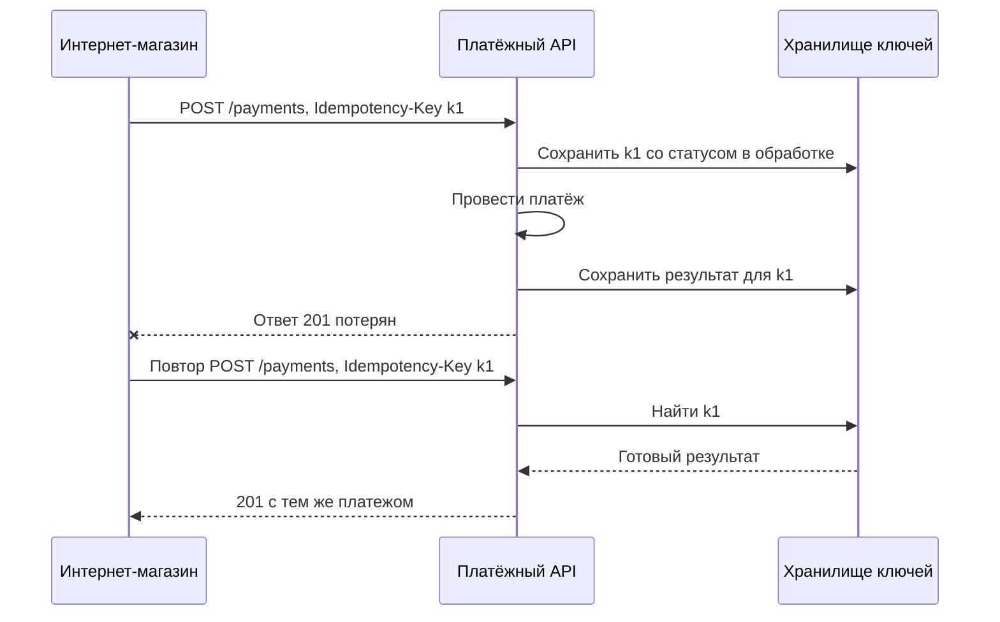

# 1.3 REST-семантика: методы, идемпотентность, кэширование, ошибки, версионирование

## Зачем это аналитику

Контракт API пишет или согласует аналитик. Ошибки в семантике (POST без защиты от повторов, 200 с ошибкой в теле, ломающие изменения без версии) обходятся дорого: двойные списания, дубли заказов, падающие клиенты после релиза.

## Что понять

- [ ] **Безопасные и идемпотентные методы** по RFC 9110: GET, HEAD, OPTIONS безопасны; PUT и DELETE идемпотентны; POST и PATCH — нет. Идемпотентность описывает состояние сервера, а не одинаковость ответа.
- [ ] **Почему идемпотентность критична**: сеть может потерять не запрос, а ответ. Клиент не знает, выполнилась ли операция, и повторяет её.
- [ ] **Idempotency-Key** для POST: клиент генерирует ключ, сервер хранит результат первой обработки и возвращает его же на повтор. Детали, которые надо прописать в требованиях: срок хранения ключа, что делать, если тот же ключ пришёл с другим телом, как вести себя, пока первый запрос ещё в обработке (409 или ожидание).
- [ ] **PUT против PATCH**: полная замена против частичного изменения. JSON Merge Patch (RFC 7396) и JSON Patch (RFC 6902).
- [ ] **Коды ответа**: 200 / 201 + `Location` / 202 для асинхронной обработки / 204; 400 против 422; 401 против 403; 404 против 410; 409 при конфликте; 412 при несовпадении `If-Match`; 429 + `Retry-After`; 500, 502, 503, 504 — кто виноват в каждом случае.
- [ ] **Формат ошибок**: Problem Details (RFC 9457, заменил RFC 7807) — `type`, `title`, `status`, `detail`, `instance` плюс свои поля.
- [ ] **Кэширование**: `Cache-Control` (max-age, no-cache против no-store, private), валидация через `ETag` + `If-None-Match` → 304.
- [ ] **Оптимистичная блокировка через HTTP**: `ETag` + `If-Match` → 412. Защита от lost update на уровне API; это прямой мост к модулю [2.2](../02-postgresql/2.2-isolation.md).
- [ ] **Пагинация**: offset против cursor (keyset). Почему offset ломается на больших таблицах и при вставках между запросами.
- [ ] **Асинхронные операции**: 202 + ресурс статуса, polling против webhook.
- [ ] **Версионирование и совместимость**: что считается ломающим изменением; версия в URL, в заголовке или в media type; правило «будь терпим к тому, что принимаешь» (tolerant reader).
- [ ] **REST, RPC и прочее**: уровни зрелости Ричардсона, где уместен gRPC, где GraphQL, где AsyncAPI.

## Урок

<!-- LESSON:START -->
### Методы: безопасность и идемпотентность

RFC 9110 задаёт для методов два свойства, и контракт API должен их соблюдать, потому что на них полагаются клиенты, прокси, кэши и библиотеки повторов.

**Безопасный (safe)** метод по смыслу только читает: клиент не просит изменить состояние сервера. Это GET, HEAD, OPTIONS. Сервер может при этом писать журнал или считать статистику, но клиент за это не отвечает. Поисковый робот или предзагрузка в браузере вправе вызвать безопасный метод без ведома пользователя. Поэтому `GET /orders/42/cancel` — ошибка проектирования, а не стиль.

**Идемпотентный (idempotent)** метод даёт тот же эффект на состояние сервера, выполнен ли он один раз или несколько. Идемпотентны все безопасные методы, а также PUT и DELETE. POST и PATCH в общем случае не идемпотентны.

Ключевая оговорка: идемпотентность описывает состояние сервера, а не одинаковость ответа. Первый `DELETE /carts/7` удаляет корзину и возвращает 204, второй возвращает 404, потому что удалять уже нечего. Ответы разные, но состояние после одного и после двух вызовов одно и то же — корзины нет. Метод идемпотентен.

| Метод | Безопасный | Идемпотентный | Типичное назначение |
|---|---|---|---|
| GET, HEAD | да | да | Чтение ресурса или его заголовков |
| OPTIONS | да | да | Возможности ресурса, предварительный запрос CORS |
| PUT | нет | да | Создать или полностью заменить ресурс по известному URI |
| DELETE | нет | да | Удалить ресурс |
| POST | нет | нет | Создать подчинённый ресурс, запустить действие |
| PATCH | нет | нет | Частично изменить ресурс |

### Почему идемпотентность критична

Сеть может потерять не запрос, а ответ. Клиент отправил платёж, сервер его провёл, ответ пропал по дороге из-за обрыва или таймаута на балансировщике. С точки зрения клиента исход неизвестен: операция могла не дойти, могла выполниться, могла ещё выполняться. Единственный способ узнать — повторить. Если операция не идемпотентна, повтор создаёт второй платёж.

То же происходит без участия человека: HTTP-клиенты с автоматическими повторами, прокси, очереди с доставкой «хотя бы один раз». Поэтому для любой операции, которая меняет деньги, остатки или заказы, в контракте должен быть ответ на вопрос «что будет при повторе».

### Idempotency-Key для POST

POST можно сделать идемпотентным на уровне контракта. Клиент генерирует уникальный ключ (обычно UUID) для каждой логической операции и отправляет его в заголовке `Idempotency-Key`. Сервер при первой обработке сохраняет ключ вместе с результатом, а на повтор с тем же ключом возвращает сохранённый результат, не выполняя операцию снова. Заголовок описан в черновике IETF и давно применяется в платёжных API.



Сама идея проста, а надёжность решают детали, которые аналитик обязан прописать в требованиях:

- **Область действия ключа.** Ключ уникален в пределах клиента или учётной записи, а не глобально. Иначе один клиент может случайно или намеренно получить чужой результат.
- **Срок хранения.** Ключ хранится ограниченное время, типичный порядок — сутки. Срок должен быть больше, чем максимальное окно повторов клиента. Повтор после истечения срока будет обработан как новая операция, и это нужно явно записать.
- **Тот же ключ с другим телом.** Сервер хранит отпечаток (хеш) тела и при несовпадении отвечает ошибкой, а не возвращает старый результат и не выполняет новую операцию. Черновик IETF предлагает для этого 422.
- **Повтор, пока первый запрос ещё обрабатывается.** Два варианта: сразу вернуть 409, чтобы клиент повторил позже, или дождаться завершения первого и вернуть его результат. Черновик предлагает 409, второй вариант удобнее клиенту, но держит соединения.
- **Атомарность.** Запись ключа и бизнес-эффект должны фиксироваться согласованно, лучше в одной транзакции БД. Если платёж проведён, а результат по ключу не сохранился из-за сбоя, защита не сработает ровно в том случае, ради которого делалась.
- **Какие ответы запоминаются.** Успешный результат и окончательные бизнес-отказы сохраняются. Ошибки вроде 503, после которых операция не выполнялась, обычно не сохраняются, чтобы повтор мог пройти.
- **Отсутствие ключа.** Для операций с деньгами ключ делают обязательным и отвечают 400, если его нет.

Альтернатива заголовку — дать клиенту самому выбрать идентификатор ресурса и создавать через PUT: `PUT /orders/<идентификатор клиента>`. PUT идемпотентен по определению, но такая схема подходит не везде: идентификатор часто выдаёт сервер.

### PUT против PATCH

PUT передаёт полное новое представление ресурса. Поле, которое не пришло, считается удалённым или сброшенным в значение по умолчанию. Отсюда идемпотентность: сколько раз ни отправляй одно и то же представление, результат один. Отсюда же риск: клиент старой версии, не знающий о новом поле, при PUT затрёт его.

PATCH передаёт только изменения. Формат изменений задаётся типом содержимого, и два стандартных варианта заметно различаются.

**JSON Merge Patch** (RFC 7396, `application/merge-patch+json`) — документ той же формы, что ресурс, содержащий только изменяемые поля. `null` означает «удалить поле». Массив заменяется целиком. Формат прост, но не умеет установить полю значение `null` и изменить один элемент массива.

```json
{
  "deliveryAddress": {
    "apartment": "12"
  },
  "comment": null
}
```

**JSON Patch** (RFC 6902, `application/json-patch+json`) — список операций над путями в документе: `add`, `remove`, `replace`, `move`, `copy`, `test`. Операции применяются атомарно: если одна не удалась, не применяется ничего. Операция `test` позволяет проверить текущее значение перед изменением, это ещё один способ защититься от конфликтов.

```json
[
  { "op": "test", "path": "/status", "value": "draft" },
  { "op": "replace", "path": "/lines/0/quantity", "value": 5 }
]
```

### Коды ответа: кто виноват

Код ответа — часть контракта, по нему клиент принимает решение: повторять, исправлять запрос, звать человека. Ответ 200 с `"success": false` в теле ломает это решение для всех посредников и библиотек.

- **200** — успех с телом. **201** — ресурс создан, в заголовке `Location` его адрес. **202** — запрос принят к обработке, результат будет позже. **204** — успех без тела.
- **400** — запрос нельзя разобрать: битый JSON, неверный тип поля. **422** — запрос синтаксически корректен, но нарушает правила: дата отгрузки в прошлом, сумма больше лимита. Граница между ними в разных API проводится по-разному, важно зафиксировать её в своём руководстве и соблюдать.
- **401** — клиент не аутентифицирован или токен недействителен, повтор с правильными учётными данными может помочь. **403** — клиент известен, но прав нет, повторять бессмысленно.
- **404** — ресурса нет или клиенту не положено знать о его существовании. **410** — ресурс был и удалён навсегда, например снятый с продажи товар или закрытый аукцион.
- **409** — конфликт с текущим состоянием: заказ уже отгружен и не может быть отменён, домен уже занят.
- **412** — не выполнено предусловие из `If-Match` или `If-Unmodified-Since`. **428** — сервер требует условный запрос, а клиент прислал безусловный.
- **429** — превышен лимит запросов, в заголовке `Retry-After` — когда можно снова.
- **500** — ошибка в самом сервисе. **502** — шлюз или прокси получил от вышестоящего сервиса некорректный ответ или обрыв: сервис за ним упал или вернул мусор. **503** — сервис временно не может обслужить запрос (перегрузка, обслуживание), желательно с `Retry-After`. **504** — шлюз не дождался ответа от вышестоящего сервиса за отведённое время.

Разница между 502 и 504 полезна при разборе инцидентов. Оба генерирует посредник, а не сервис. 502 говорит «сервис ответил плохо или оборвал соединение», 504 — «сервис не ответил вовремя». Во втором случае операция могла выполниться, и повтор без идемпотентности опасен.

### Формат ошибок: Problem Details

Чтобы клиенты не разбирали десять разных форматов ошибок, есть стандарт Problem Details: RFC 9457, заменивший RFC 7807. Тип содержимого — `application/problem+json`. Стандартные поля: `type` (URI, идентифицирующий вид проблемы, по нему клиент ветвит логику), `title` (короткое описание вида), `status` (дублирует HTTP-код), `detail` (описание конкретного случая для человека), `instance` (идентификатор этого случая). Свои поля добавлять можно и нужно.

```json
{
  "type": "https://api.shop.example/problems/insufficient-stock",
  "title": "Недостаточно товара на складе",
  "status": 409,
  "detail": "Запрошено 12 шт. артикула 100245, доступно 7.",
  "instance": "/orders/8812",
  "sku": "100245",
  "available": 7
}
```

Логику клиента строят на `type` и собственных полях, а не на тексте `detail`, который может меняться и переводиться.

### Кэширование и условные запросы

`Cache-Control` управляет тем, кто и сколько может хранить ответ:

- `max-age=N` — ответ свежий N секунд, в течение них его можно отдавать без обращения к серверу.
- `no-cache` — хранить можно, но перед каждым использованием нужно проверить у сервера, не изменился ли ответ. Это не запрет кэширования.
- `no-store` — не сохранять вообще. Для выписок, платёжных и персональных данных.
- `private` — хранить может только кэш конечного клиента, не общие прокси и CDN. `public` — может любой кэш.

Проверка актуальности (revalidation) строится на валидаторах. Сервер отдаёт `ETag` — непрозрачный идентификатор версии представления. Клиент при следующем запросе присылает `If-None-Match` с этим значением. Если версия не изменилась, сервер отвечает 304 Not Modified без тела, экономя трафик и сериализацию. Старый вариант той же идеи — `Last-Modified` и `If-Modified-Since` с точностью до секунды.

### Оптимистичная блокировка через HTTP

Тот же `ETag` решает проблему потерянного обновления (lost update). Два менеджера открыли карточку заказа поставщику, оба правят, второй сохранением молча затирает правки первого. Защита:

1. `GET /supplier-orders/501` возвращает представление и `ETag: "v7"`.
2. Клиент отправляет `PUT` или `PATCH` с заголовком `If-Match: "v7"`.
3. Сервер сравнивает с текущей версией. Совпала — применяет изменение и возвращает новый `ETag`. Не совпала — отвечает 412, клиент перечитывает ресурс и решает, как объединить правки.

```http
PATCH /supplier-orders/501 HTTP/1.1
If-Match: "v7"
Content-Type: application/merge-patch+json

HTTP/1.1 412 Precondition Failed
Content-Type: application/problem+json
```

В базе это обычно поле версии и условное обновление: `UPDATE ... SET ..., version = version + 1 WHERE id = 501 AND version = 7`. Ноль изменённых строк означает конфликт. Это та же оптимистичная блокировка, что разбирается в модуле 2.2, только вынесенная на уровень API, где между чтением и записью проходят минуты, а не миллисекунды одной транзакции. Если сервер требует условных изменений, запрос без `If-Match` отклоняется с 428. Для `If-Match` используется строгое сравнение, поэтому слабые ETag с префиксом `W/` для этого не годятся.

### Пагинация: offset против cursor

Offset-пагинация — `?limit=50&offset=10000` — проста и позволяет перейти на любую страницу. Две проблемы. Производительность: чтобы отдать строки с 10 001 по 10 050, БД всё равно находит и отбрасывает первые 10 000, и глубокие страницы становятся всё медленнее. Корректность: если между запросами страниц вставили или удалили строки, окно сдвигается, и клиент получает дубли или пропускает записи. Для выгрузки остатков магазина или выписки по счёту пропуск записи — дефект данных.

Cursor-пагинация (keyset) продолжает выборку с последнего увиденного значения ключа сортировки:

```sql
SELECT id, created_at, amount
FROM statement_lines
WHERE account_id = $1
  AND (created_at, id) > ($2, $3)
ORDER BY created_at, id
LIMIT 50;
```

Запрос идёт по индексу с нужной позиции, время не зависит от глубины, вставки перед курсором не сдвигают окно. Ключ сортировки должен быть уникальным, поэтому к времени добавляют `id`. Клиенту курсор отдаётся непрозрачной строкой, чтобы сервер мог менять его внутреннее устройство. Цена: нельзя сразу перейти на страницу 37, а общее количество записей приходится считать отдельно и дорого.

### Асинхронные операции

Если операция длится дольше разумного таймаута — формирование выписки за год, пересчёт прогноза спроса по сети, массовая загрузка заказов, — сервер отвечает 202 Accepted и адресом ресурса статуса в `Location`. Ресурс статуса имеет свой жизненный цикл (принято, выполняется, успешно, ошибка) и по завершении ссылается на результат.

Клиент узнаёт о завершении одним из способов. Опрос (polling): периодический GET статуса, сервер может подсказывать интервал через `Retry-After`. Просто и надёжно, но создаёт лишнюю нагрузку и задержку. Обратный вызов (webhook): сервер сам отправляет уведомление на адрес клиента. Быстрее, но требует от клиента публичного эндпоинта, проверки подписи уведомлений, обработки повторных доставок и дубликатов. На практике их совмещают: webhook для скорости и опрос как страховка на случай потерянного уведомления.

### Версионирование и совместимость

Ломающее изменение (breaking change) — любое, после которого корректно написанный существующий клиент перестаёт работать. Примеры: удалить или переименовать поле, изменить его тип или формат, сделать необязательное поле запроса обязательным, ужесточить валидацию, изменить смысл поля или кода ответа. Неломающие изменения: новый эндпоинт, новое необязательное поле запроса, новое поле в ответе, ослабление валидации.

Новое значение перечисления в ответе — пограничный случай: клиент, написанный со строгим `switch` без ветки по умолчанию, сломается. Поэтому в контракте заранее пишут, что перечисления расширяемы и неизвестные значения клиент обязан обрабатывать.

Отсюда принцип терпимого читателя (tolerant reader): клиент игнорирует незнакомые поля, не зависит от порядка полей и готов к новым значениям перечислений. Добавить поле в ответ безопасно только при таких клиентах, поэтому требование терпимости записывают в правила API, а не надеются на него.

Где указывать версию:

- в пути: `/v2/orders` — наглядно, легко маршрутизировать, удобно в журналах;
- в заголовке: собственный заголовок с версией — URL стабилен, но версию не видно в ссылке;
- в типе содержимого: `Accept: application/vnd.shop.v2+json` — ближе всего к идее HTTP, но сложнее в инструментах и кэшировании.

Важнее выбора места правила вокруг версии: мажорная версия только при ломающем изменении, срок поддержки старой версии, оповещение клиентов, заголовки об устаревании, мониторинг того, кто ещё вызывает старую версию.

### REST, RPC и другие стили

Модель зрелости Ричардсона описывает, насколько API использует возможности HTTP. Уровень 0 — один адрес, всё через POST, HTTP только как транспорт. Уровень 1 — отдельные ресурсы со своими URI. Уровень 2 — правильные методы и коды ответа, кэширование, условные запросы. Уровень 3 — гипермедиа: ответ содержит ссылки на доступные действия, клиент переходит по ним, а не собирает адреса сам. Подавляющее большинство публичных API, называемых REST, находятся на уровне 2, и для интеграций этого обычно достаточно.

Другие стили решают другие задачи:

- **gRPC** — удалённые вызовы по контракту на Protobuf поверх HTTP/2. Бинарный формат, генерация клиентов, потоковая передача в обе стороны, передача дедлайнов. Хорош для внутреннего межсервисного взаимодействия с высокой нагрузкой. Хуже для браузеров и внешних партнёров, которым нужен простой вызов из любого языка.
- **GraphQL** — клиент сам описывает, какие поля и связи нужны. Уместен, когда много разных фронтендов с разными потребностями в данных. Цена: сложнее кэширование на уровне HTTP, нужна защита от слишком тяжёлых запросов, ошибки часто приходят в теле при коде 200.
- **AsyncAPI** — спецификация для событийных интерфейсов: топики, сообщения, схемы в брокере. Это аналог OpenAPI для мира очередей, где вместо запроса и ответа — публикация и подписка.

Выбор стиля — архитектурное решение: кто потребители, синхронный ли сценарий, насколько стабилен контракт, какие инструменты у партнёров.

### Типичные ошибки

- Возвращать 200 с ошибкой в теле. Клиенты, прокси и мониторинг считают такой ответ успешным.
- Проектировать POST создания платежа или заказа без Idempotency-Key, либо ввести ключ без описания срока хранения, поведения при другом теле и при параллельном повторе.
- Сохранять ключ идемпотентности отдельно от бизнес-эффекта, без атомарности.
- Использовать PUT как частичное обновление: старые клиенты затирают поля, о которых не знают.
- Путать `no-cache` с запретом кэширования и не ставить `no-store` на персональные и платёжные данные.
- Делать offset-пагинацию для выгрузок, которые клиенты читают целиком, и получать дубли и пропуски.
- Добавлять значения в перечисления и считать это неломающим изменением, не закрепив в контракте требование терпимого чтения.

### Как говорить об этом на собеседовании

Уровень senior проявляется в том, что вы говорите о семантике как о гарантиях, а не о стиле. Сильная формулировка: «Идемпотентность — это про состояние сервера при повторе, а повтор неизбежен, потому что клиент не отличает потерянный запрос от потерянного ответа. Для POST создания платежа я закладываю Idempotency-Key и описываю пять сценариев: первый запрос, повтор после успеха, повтор с другим телом, повтор во время обработки, повтор после истечения ключа». Уже одно перечисление сценариев отличает человека, который сталкивался с двойными списаниями.

На вопросы про коды отвечайте через решение клиента: 401 — переаутентифицироваться, 403 — не повторять, 429 и 503 — подождать `Retry-After`, 504 — операция могла выполниться, повтор только с ключом. Про версионирование полезно назвать не место версии, а процесс: классификация изменений, срок поддержки, оповещение, мониторинг потребителей старой версии. Хорошо звучит связка уровней: `ETag` и `If-Match` в API и поле версии с условным `UPDATE` в базе.

### Коротко

- Безопасные методы только читают, идемпотентные дают тот же эффект при повторе. Идемпотентность — про состояние сервера, а не про одинаковый ответ.
- Повтор неизбежен, потому что теряются и ответы. POST с деньгами и заказами требует Idempotency-Key с явно описанными сроком, областью, поведением при другом теле и при параллельном повторе.
- PUT заменяет ресурс целиком, PATCH меняет часть. Merge Patch прост, JSON Patch точнее и атомарен.
- Код ответа определяет действие клиента. Ошибки в формате Problem Details с машинным `type`.
- `no-cache` — хранить с проверкой, `no-store` — не хранить. `ETag` с `If-None-Match` экономит трафик, с `If-Match` защищает от потерянного обновления через 412.
- Cursor-пагинация стабильна и быстра на больших объёмах, offset — нет.
- Долгие операции — 202 с ресурсом статуса, уведомление через опрос, webhook или оба.
- Ломающее изменение — то, что ломает корректного существующего клиента. Терпимое чтение и правила версионирования фиксируются в контракте.
<!-- LESSON:END -->

## Читать дальше

- [RFC 9110](https://www.rfc-editor.org/rfc/rfc9110): разделы 9 (Methods), 15 (Status Codes), 13 (Conditional Requests).
- [RFC 9111 — HTTP Caching](https://www.rfc-editor.org/rfc/rfc9111), разделы 1–5 обзорно.
- [RFC 9457 — Problem Details for HTTP APIs](https://www.rfc-editor.org/rfc/rfc9457).
- IETF draft [The Idempotency-Key HTTP Header Field](https://datatracker.ietf.org/doc/draft-ietf-httpapi-idempotency-key-header/) и статья Stripe «Designing robust and predictable APIs with idempotency».
- Arnaud Lauret, *The Design of Web APIs* (2nd ed., Manning).
- Microsoft [REST API Guidelines](https://github.com/microsoft/api-guidelines) и Google [API Improvement Proposals](https://google.aip.dev) — как большие компании формализуют правила.

На system-design.space:

- [Удалённые вызовы API: REST, gRPC и GraphQL](https://system-design.space/chapter/remote-call-approaches/)
- [Customer-friendly API: удобное API для клиентов](https://system-design.space/chapter/customer-friendly-api/)
- [Консистентность данных и идемпотентность: практические паттерны](https://system-design.space/chapter/consistency-idempotency-patterns/)
- [Web API Design: The Missing Link (short summary)](https://system-design.space/chapter/web-api-design-book/)

## Практика

1. Взять обезличенный пример: «создание платежа», «создание заказа». Спроектировать `POST` с Idempotency-Key и расписать таблицу сценариев: первый запрос; повтор после успеха; повтор с другим телом; повтор, пока первый ещё выполняется; повтор после истечения срока ключа. Для каждого сценария указать код ответа и тело.
2. Спроектировать обновление ресурса с `ETag` / `If-Match` и нарисовать sequence-диаграмму конфликта двух клиентов.
3. Написать OpenAPI 3.1 на 4–5 эндпоинтов с Problem Details, cursor-пагинацией и асинхронной операцией (202 + статус). Проверить линтером [Spectral](https://github.com/stoplightio/spectral) или [Redocly CLI](https://redocly.com/docs/cli/).

## Вопросы для самопроверки

1. Почему DELETE идемпотентен, хотя второй вызов возвращает 404?
2. Клиент отправил POST на создание платежа, получил таймаут и повторил запрос. Как на уровне контракта гарантировать, что платёж не создастся дважды?
3. Чем 401 отличается от 403? А 400 от 422?
4. Когда уместно отвечать 202 и что клиент должен делать дальше?
5. Что такое ломающее изменение контракта? Приведите три примера и три неломающих изменения.
6. Как в REST реализовать оптимистичную блокировку и какой код вернуть при конфликте?
7. Почему offset-пагинация плохо работает на больших объёмах и чем её заменить?
8. Сервис вернул 502. Кто, скорее всего, виноват, и чем это отличается от 504?

## Заметки

<!-- Свои формулировки, ошибки, ссылки. -->
