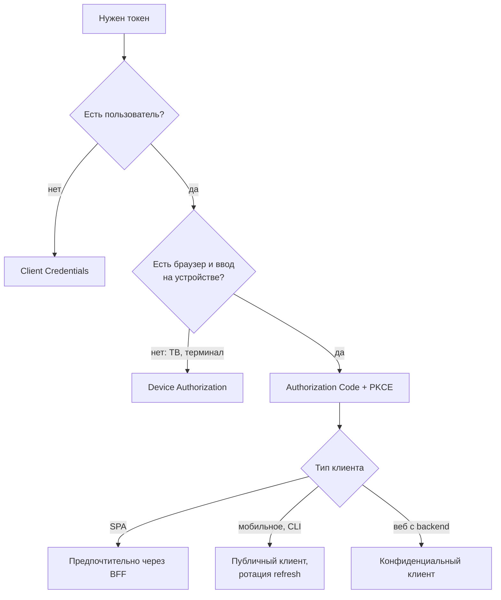
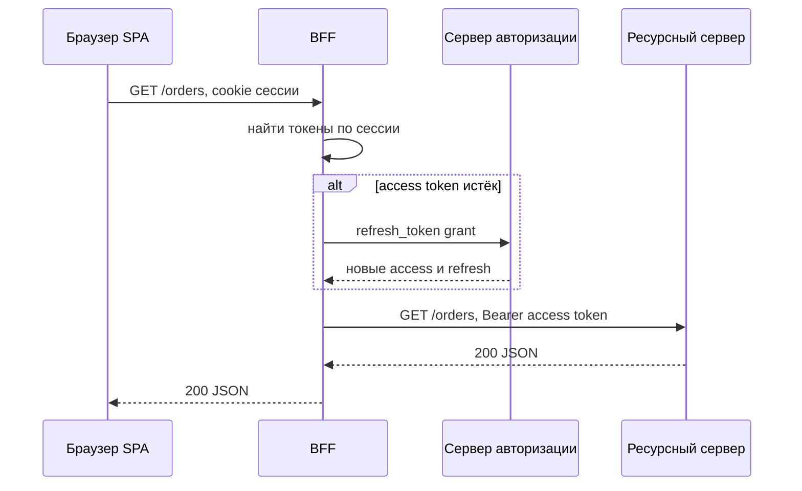

# 1.4 OAuth 2.0, OpenID Connect, JWT

## Зачем это аналитику

«Сделаем авторизацию через OAuth» ничего не говорит, пока не выбран flow, тип клиента, формат токена, скоупы и срок жизни. Это решения уровня архитектуры, и ошибка в них превращается в уязвимость или в переписывание интеграции.

## Что понять

- [ ] **Аутентификация против авторизации**. OAuth 2.0 — протокол делегированной авторизации («приложение действует от имени пользователя с ограниченными правами»). OIDC — слой аутентификации поверх него (ID Token, userinfo).
- [ ] **Роли**: resource owner, client, authorization server, resource server.
- [ ] **Типы клиентов**: confidential (есть backend и секрет) и public (SPA, мобильное приложение — секрет хранить негде).
- [ ] **Flows**:
  - Authorization Code + PKCE — для всех клиентов с пользователем, включая SPA и мобильные.
  - Client Credentials — сервис-к-сервису, без пользователя.
  - Device Authorization — телевизоры, CLI.
  - Refresh Token — продление сессии, ротация refresh-токенов.
  - Почему Implicit и Resource Owner Password Credentials устарели и исключены в OAuth 2.1.
- [ ] **PKCE**: какую атаку закрывает (перехват authorization code) и почему теперь рекомендован и для confidential-клиентов.
- [ ] **Скоупы и claims**: грубая авторизация (скоупы) против тонкой (права на конкретный объект проверяет сам resource server).
- [ ] **JWT**: header.payload.signature в base64url. Payload **подписан, но не зашифрован** — его может прочитать любой. JWS против JWE. Стандартные claims: `iss`, `sub`, `aud`, `exp`, `iat`, `nbf`, `jti`.
- [ ] **Проверка JWT на resource server**: подпись по ключу из JWKS, `iss`, `aud`, `exp`, алгоритм из белого списка. Классические уязвимости: `alg: none`, подмена RS256 на HS256, отсутствие проверки `aud`.
- [ ] **Self-contained против opaque токенов**: JWT проверяется локально, но его нельзя отозвать до истечения; opaque требует introspection (RFC 7662), зато отзывается мгновенно. Компромиссы: короткий срок жизни access-токена + refresh, списки отзыва, phantom token на gateway.
- [ ] **Где хранить токены в браузере** и паттерн BFF (Backend for Frontend): токены живут на сервере, браузер получает только httpOnly-cookie.
- [ ] **Привязка токена к клиенту (sender-constrained tokens)**: mTLS-bound tokens (RFC 8705) и DPoP (RFC 9449). Зачем это финтеху и open banking (FAPI 2.0).
- [ ] **Keycloak** как типовой authorization server в on-premise: realm, client, roles, mappers — на уровне «что где настраивается».

## Урок

<!-- LESSON:START -->
### Что решает OAuth и чего он не решает

Исходная задача OAuth 2.0 — делегирование. Пользователь хочет, чтобы бухгалтерский сервис читал выписки из его банка, но не хочет отдавать сервису логин и пароль от банка. OAuth даёт сервису ограниченный по правам и по времени ключ — токен доступа (access token), — который выдаёт банк после согласия пользователя. Пароль сервис не видит никогда.

Важно, что это протокол авторизации: он отвечает на вопрос «что этому приложению разрешено сделать», а не «кто сейчас перед экраном». Access token адресован ресурсному серверу, а не приложению. Приложение должно относиться к нему как к непрозрачной строке: формат токена может поменяться в любой момент, и клиент, который его разбирает, завязан на внутреннюю деталь чужой системы.

Аутентификацию поверх OAuth добавляет OpenID Connect (OIDC). Он вводит скоуп `openid`, ID Token (ID-токен) и эндпоинт userinfo. ID Token — всегда JWT, адресованный клиенту (`aud` равен `client_id`), в нём записано, кто пользователь (`sub`), кто его аутентифицировал (`iss`), когда и как (`auth_time`, `acr`, `amr`), и `nonce` для защиты от подмены ответа. Отсюда ответ на частый вопрос: по access token понять, кто пользователь, технически иногда можно (если это JWT с `sub`), но протокол этого не гарантирует. Для входа пользователя в приложение нужен OIDC и ID Token. Обратная ошибка тоже встречается: ID Token отправляют в API как пропуск. Он для этого не предназначен — у него другой `aud`, и ресурсный сервер обязан такой токен отвергнуть.

### Роли и типы клиентов

В OAuth четыре роли:

- **владелец ресурса (resource owner)** — обычно пользователь, который даёт согласие;
- **клиент (client)** — приложение, которое хочет доступ;
- **сервер авторизации (authorization server)** — аутентифицирует пользователя, собирает согласие, выдаёт токены (Keycloak, облачный IdP);
- **ресурсный сервер (resource server)** — API, которое принимает токен и отдаёт данные.

Сервер авторизации и ресурсный сервер часто принадлежат одной организации, но это разные компоненты с разной ответственностью. В постановке их стоит разводить явно: «токен выдаёт X, проверяет Y».

Клиенты делятся на два типа по способности хранить секрет. **Конфиденциальный (confidential)** клиент — приложение с серверной частью: секрет (`client_secret`, ключ для `private_key_jwt` или сертификат для mTLS) лежит на сервере, куда у пользователя нет доступа. **Публичный (public)** клиент — SPA в браузере, мобильное или десктопное приложение, CLI. Всё, что зашито в их код, можно извлечь, поэтому секрета у них фактически нет, и сервер авторизации не может проверить, что запрос пришёл именно от этого приложения. Большая часть дальнейших механизмов (PKCE, ротация refresh-токенов, BFF) существует ради того, чтобы жить с публичными клиентами.

### Потоки (flows) и выбор между ними

#### Authorization Code + PKCE

Основной поток для любого клиента, за которым стоит пользователь. Клиент перенаправляет браузер на сервер авторизации, пользователь входит и соглашается, сервер возвращает браузер на `redirect_uri` с короткоживущим одноразовым кодом (authorization code). Затем клиент обменивает код на токены прямым запросом к token endpoint — по «заднему каналу», без участия браузера.

PKCE (Proof Key for Code Exchange) добавляет к этому одну идею. Перед редиректом клиент генерирует случайную строку `code_verifier`, вычисляет от неё `code_challenge = BASE64URL(SHA256(code_verifier))` и отправляет в запросе авторизации только хеш с `code_challenge_method=S256`. При обмене кода клиент передаёт исходный `code_verifier`, сервер хеширует его и сравнивает.

```http
GET /authorize?response_type=code&client_id=spa-shop
    &redirect_uri=https://shop.example/cb&scope=openid orders.read
    &state=<random>&code_challenge=<S256-hash>&code_challenge_method=S256

POST /token
grant_type=authorization_code&code=<code>&redirect_uri=https://shop.example/cb
&client_id=spa-shop&code_verifier=<original-random>
```

Атака, которую это закрывает, — перехват кода авторизации. Код проходит через браузер, и его можно украсть: вредоносное мобильное приложение регистрирует ту же кастомную URL-схему, код оседает в логах прокси или в истории. Без PKCE публичный клиент обменивает код без секрета, значит, обменять его может любой. С PKCE украденный код бесполезен: `code_verifier` никогда не покидал настоящий клиент.

Почему PKCE теперь рекомендуют и конфиденциальным клиентам (RFC 9700, OAuth 2.1)? Секрет клиента не защищает от внедрения кода (authorization code injection): атакующий, получивший чужой код, подсовывает его в свою сессию у легитимного клиента, и тот сам честно обменяет код своим секретом. PKCE связывает код с конкретной сессией, в которой начался поток, — подсунутый код не пройдёт проверку. Параметр `state` решает смежную задачу защиты от CSRF на callback, но PKCE делает это надёжнее и на стороне сервера.

#### Client Credentials

Сервис-к-сервису, пользователя нет. Клиент аутентифицируется своими учётными данными и получает токен на собственное имя: `sub` в таком токене обычно идентифицирует сам клиент. Типичный случай — ночная выгрузка остатков из учётной системы в сервис прогноза спроса. Refresh-токен здесь не нужен: клиент просто запрашивает новый access token. Для аутентификации клиента предпочтительнее асимметричные методы (`private_key_jwt`, mTLS), чем общий секрет в заголовке.

#### Device Authorization

Для устройств без удобного браузера или ввода: телевизор, терминал, CLI. Устройство запрашивает у сервера `device_code` и короткий `user_code`, показывает пользователю адрес и код, пользователь подтверждает вход на телефоне или ноутбуке, а устройство тем временем опрашивает token endpoint, пока не получит токены. Для CLI-утилиты это альтернатива локальному loopback-редиректу на `http://127.0.0.1:<port>`, который тоже допустим с Authorization Code + PKCE.

#### Refresh Token и ротация

Access token делают короткоживущим (минуты), а сессию продлевают refresh-токеном. Refresh-токен — долгоживущий и очень ценный, поэтому для публичных клиентов его нужно либо привязывать к клиенту (см. ниже), либо ротировать: при каждом использовании сервер выдаёт новый refresh-токен и аннулирует старый. Если старый токен предъявлен повторно, это признак кражи: кто-то из двоих, легитимный клиент или атакующий, использует уже потраченный токен. Сервер в этом случае отзывает всю цепочку, и пользователю приходится войти заново.

#### Что убрали в OAuth 2.1

**Implicit** возвращал access token прямо в URL-фрагменте редиректа. Токен оседал в истории браузера, мог утечь через Referer и расширения, клиент не мог убедиться, что токен выдан именно ему, а привязать такой токен к отправителю было нельзя. Он появился, когда браузеры не умели делать кросс-доменные POST-запросы; с CORS и PKCE причины для него исчезли.

**Resource Owner Password Credentials** — клиент собирает логин и пароль пользователя и сам отправляет их на сервер. Это отменяет весь смысл делегирования: клиент видит пароль, многофакторную аутентификацию и федерацию не встроить, а пользователя приучают вводить пароль от банка в чужих формах.



### Скоупы, claims и где кончается OAuth

Скоуп (scope) — это грубое разрешение, на которое пользователь дал согласие клиенту: `payments.read`, `orders.write`. Claims — утверждения внутри токена: кто субъект, какие роли, какой тенант. Скоупы и роли позволяют отсечь запрос целиком: у токена нет `payments.write` — создавать платёжное поручение нельзя.

Но скоуп ничего не знает о конкретном объекте. Токен со скоупом `statements.read` не отвечает на вопрос, можно ли этому пользователю читать выписку по счёту 40702… конкретной организации. Это решает только ресурсный сервер, сверяя субъект токена с данными: к какой организации привязан счёт, какие полномочия у сотрудника внутри этой организации. Попытка перенести такие права в токен (список всех доступных счетов в claims) ломается на первом же изменении прав и раздувает токен. Правило для постановки: скоупы описывают, что может делать приложение, а права на объект — отдельное требование к сервису, проверяемое при каждом запросе.

### JWT: формат и проверка

JWT (JSON Web Token) — три части в base64url через точку: заголовок (header), полезная нагрузка (payload) и подпись (signature). Заголовок содержит алгоритм (`alg`) и идентификатор ключа (`kid`).

```json
{ "alg": "RS256", "kid": "2026-09-a", "typ": "at+jwt" }
{
  "iss": "https://auth.bank.example/realms/corp",
  "sub": "u-81f2",
  "aud": "payments-api",
  "exp": 1790000900, "iat": 1790000600, "nbf": 1790000600,
  "jti": "b7c1e0",
  "scope": "payments.read payments.write",
  "org_id": "org-3310"
}
```

Стандартные claims: `iss` — кто выдал, `sub` — о ком токен, `aud` — для кого предназначен, `exp` — до какого момента действителен, `nbf` — не раньше какого момента, `iat` — когда выдан, `jti` — уникальный идентификатор токена (нужен для списков отзыва и защиты от повторов).

Главное свойство, которое регулярно забывают: payload **подписан, но не зашифрован**. Base64url — это кодирование, а не шифрование; любой, у кого есть токен, прочитает его содержимое. Поэтому в JWT не кладут персональные данные, номера счетов сверх необходимого, внутренние детали. Подписанный токен — это JWS (JSON Web Signature). Если содержимое нужно скрыть, используют JWE (JSON Web Encryption): пять частей вместо трёх, получатель расшифровывает своим ключом. На практике JWE для access-токенов встречается редко: проще сделать токен непрозрачным.

Ресурсный сервер, получив JWT, обязан проверить:

1. Алгоритм входит в белый список, заданный конфигурацией сервера, а не заголовком токена.
2. Подпись верна по ключу из JWKS сервера авторизации, выбранному по `kid`. JWKS кешируется и обновляется при появлении неизвестного `kid` — так работает ротация ключей.
3. `iss` совпадает с ожидаемым издателем.
4. `aud` содержит идентификатор именно этого API.
5. `exp` и `nbf` с учётом небольшого допуска на рассинхронизацию часов.
6. Тип токена: это access token, а не ID Token.
7. Нужные скоупы — и дальше права на объект уже по бизнес-данным.

Классические уязвимости возникают там, где сервер доверяет самому токену в вопросе, как его проверять. `alg: none` — токен без подписи, который библиотека принимает, если алгоритм берётся из заголовка. Подмена RS256 на HS256: сервер ожидает асимметричную подпись и хранит публичный ключ; атакующий ставит `HS256` и подписывает токен HMAC-ом, используя этот публичный ключ как секрет, а небрежная библиотека проверяет HMAC тем же ключом — и подпись сходится. Отсутствие проверки `aud`: токен, выданный для малозначимого сервиса справочников, принимает платёжный API того же realm, и компрометация одного сервиса даёт доступ ко всем.

### Отзыв: self-contained против opaque

| Свойство | Self-contained (JWT) | Opaque (ссылка) |
|---|---|---|
| Где проверяется | Локально, по подписи | Запросом introspection к серверу авторизации |
| Нагрузка на сервер авторизации | Только выдача и JWKS | Каждый запрос или с кешем |
| Отзыв | Не раньше `exp` без доп. механизмов | Мгновенный |
| Утечка содержимого | Payload читается кем угодно | Внутри нет данных |
| Работа при недоступности IdP | Продолжает работать | Ломается, если нет кеша |

Opaque-токен — случайная строка, за которой на сервере авторизации лежит запись. Ресурсный сервер спрашивает о ней через introspection endpoint (RFC 7662) и получает `active: true/false` и атрибуты. Отозвать такой токен — значит удалить запись.

JWT до истечения отозвать нельзя, потому что проверка не обращается к издателю. Практические компромиссы:

- **Короткий срок жизни access-токена** (единицы минут) плюс refresh-токен, который отзывается на сервере авторизации. Окно риска ограничено сроком жизни.
- **Список отзыва** по `jti` или по субъекту («все токены пользователя, выданные до момента T»), который ресурсные серверы получают через кеш или события. Это возвращает состояние, от которого JWT должен был избавить, поэтому применяют точечно: блокировка сотрудника, компрометация.
- **Phantom token**: наружу выдаётся opaque-токен, API gateway делает introspection и передаёт внутренним сервисам JWT. Снаружи — мгновенный отзыв и никакой утечки claims, внутри — локальная проверка без обращений к IdP.

### Токены в браузере и BFF

Хранить access token в `localStorage` или `sessionStorage` плохо по одной причине: к нему имеет доступ любой JavaScript на странице. Одна XSS-уязвимость или скомпрометированная зависимость из npm — и токен уходит на чужой сервер, где им можно пользоваться до истечения, без браузера пользователя. Хранение в памяти страницы чуть лучше, но от XSS принципиально не защищает: вредоносный код может сам вызвать API от имени пользователя или перехватить токен при получении.

Паттерн BFF (Backend for Frontend) выносит OAuth-клиента на сервер. BFF — конфиденциальный клиент: он проходит Authorization Code + PKCE, хранит токены у себя, а браузеру выдаёт сессионную cookie с атрибутами `HttpOnly`, `Secure`, `SameSite`. JavaScript эту cookie не видит. Запросы SPA идут в BFF, который подставляет access token и проксирует вызов в API.



XSS при этом не исчезает: вредоносный скрипт по-прежнему может делать запросы через BFF, пока открыта вкладка. Но он не может унести токен и пользоваться им автономно, а сессию на стороне BFF можно убить. Раз аутентификация теперь на cookie, возвращается защита от CSRF — `SameSite`, проверка `Origin` или анти-CSRF-токен.

### Привязка токена к отправителю

Обычный access token — bearer-токен: кто предъявил, тот и владелец. Украденный токен работает у вора так же, как у законного клиента. Sender-constrained token привязан к ключу клиента, и предъявить его может только тот, кто этим ключом владеет.

- **mTLS-bound tokens (RFC 8705)**: клиент устанавливает с сервером авторизации взаимный TLS, и в токен записывается отпечаток его сертификата (claim `cnf` с `x5t#S256`). Ресурсный сервер сравнивает отпечаток с сертификатом текущего TLS-соединения. Хорошо подходит для сервис-к-сервису, где есть PKI; неудобно в браузере и за TLS-терминирующими балансировщиками.
- **DPoP (RFC 9449)**: клиент генерирует пару ключей и к каждому запросу прикладывает заголовок `DPoP` — маленький JWT, подписанный своим закрытым ключом, с методом, URL, временем и уникальным `jti`. Токен содержит отпечаток открытого ключа. Работает на уровне приложения, без инфраструктуры сертификатов, подходит и публичным клиентам.

Банку это нужно потому, что цена утечки токена здесь — деньги, а утечки случаются через логи, прокси, отладочные дампы, скомпрометированные промежуточные узлы. FAPI 2.0 — профиль безопасности OpenID Foundation для финансовых API и open banking — требует sender-constrained токены (mTLS или DPoP), PKCE, запросы авторизации через PAR (Pushed Authorization Requests) и сильную аутентификацию клиентов. В требованиях к интеграции с банком на уровне senior уместно прямо писать «профиль FAPI 2.0», а не перечислять механизмы по одному.

### Keycloak: что где настраивается

Keycloak — типовой сервер авторизации для on-premise. Его основные сущности:

- **Realm** — изолированное пространство: свои пользователи, клиенты, роли, ключи подписи, политики паролей и сессий. Издатель токенов (`iss`) содержит имя realm. Обычно один realm на контур (например, сотрудники и клиенты — отдельно).
- **Client** — зарегистрированное приложение. Здесь задаются тип (включена аутентификация клиента — значит конфиденциальный), разрешённые потоки (standard flow — это Authorization Code, service accounts — Client Credentials, device grant), точные `redirect_uri`, web origins для CORS, требование PKCE.
- **Roles** — роли уровня realm и роли конкретного клиента. Назначаются пользователям напрямую или через группы.
- **Client scopes** — наборы скоупов и связанных с ними claims, которые подключаются к клиентам.
- **Mappers** (protocol mappers) — правила, какие данные попадают в токен: атрибут пользователя в claim, роли в claim, нужное значение в `aud`. Проверка `aud` на ресурсном сервере работает только если маппер кладёт туда правильный идентификатор API.
- **Identity providers и user federation** — вход через внешний IdP или корпоративный LDAP/AD.

Для аналитика важен уровень «кто за какую настройку отвечает и какие значения зафиксированы в требованиях»: flow, тип клиента, срок жизни токенов и сессий, набор скоупов, содержимое claims и `aud`.

### Разбор: B2B-интеграция банка

Бухгалтерский SaaS хочет получать выписки клиентов банка-юрлиц и создавать черновики платёжных поручений. Решения:

- Поток — Authorization Code + PKCE, SaaS — конфиденциальный клиент с `private_key_jwt`. Директор организации входит в банк и соглашается на скоупы `statements.read` и `payments.draft`, но не на подписание.
- Access token — sender-constrained через mTLS, срок жизни порядка минут; refresh-токен с ограниченным сроком согласия, отзываемый пользователем в интернет-банке.
- Внутри банка gateway делает introspection opaque-токена и передаёт сервисам JWT с `aud` конкретного сервиса.
- Сервис выписок проверяет, что счёт принадлежит организации из токена, а у сотрудника есть полномочие на просмотр. Скоуп этого не заменяет.
- Отзыв согласия удаляет refresh-токен и вносит отметку, после которой introspection перестаёт считать токены активными.

### Типичные ошибки

- «Авторизация через OAuth» без выбора flow, типа клиента и формата токена в требованиях — решение перекладывается на разработчика, который выберет самое простое.
- Вход пользователя по access token вместо ID Token и, наоборот, отправка ID Token в API.
- Ресурсный сервер не проверяет `aud` или берёт алгоритм из заголовка токена.
- Персональные и чувствительные данные в payload JWT в расчёте на то, что «он же подписан».
- Права на конкретные объекты подменяются скоупами или ролями в токене; проверки владения объектом в сервисе нет.
- Токены SPA в `localStorage`, долгоживущие refresh-токены у публичных клиентов без ротации.
- Access token на сутки «чтобы реже обновлять», при этом отзыв не предусмотрен.

### Как говорить об этом на собеседовании

Уровень senior виден по тому, что вы начинаете с модели угроз и типа клиента, а не с названия технологии. Хорошая формулировка: «Для SPA — Authorization Code с PKCE через BFF, токены не попадают в браузер. Access token короткий, для внутренних сервисов — JWT с обязательной проверкой `iss`, `aud`, `exp` и алгоритма из белого списка. Отзыв решаем коротким сроком жизни и refresh-токеном, для блокировки сотрудника — список отзыва. Права на объект проверяет сервис, скоуп — только грубый фильтр».

Полезно показать, что вы знаете компромиссы, а не одно правильное решение: JWT против opaque упирается в выбор между независимостью от IdP и мгновенным отзывом; phantom token снимает часть противоречия. Для финтеха назовите sender-constrained токены и FAPI 2.0 и объясните, от какой утечки они защищают.

### Коротко

- OAuth 2.0 — делегированная авторизация, OIDC добавляет аутентификацию через ID Token. Access token предназначен API, а не клиенту.
- Тип клиента (конфиденциальный или публичный) определяет, какие механизмы защиты нужны.
- Authorization Code + PKCE — для всех сценариев с пользователем; Client Credentials — без пользователя; Device Authorization — для устройств без браузера. Implicit и ROPC исключены.
- PKCE защищает от перехвата и внедрения кода авторизации, поэтому нужен и конфиденциальным клиентам.
- JWT подписан, но не зашифрован. Ресурсный сервер проверяет подпись, алгоритм по белому списку, `iss`, `aud`, `exp`.
- JWT не отзывается до истечения: компенсируют коротким сроком, refresh-токенами, списками отзыва, phantom token.
- В браузере токены лучше не держать вовсе: BFF и httpOnly-cookie.
- Для банков — sender-constrained токены (mTLS, DPoP) в рамках FAPI 2.0.
<!-- LESSON:END -->

## Читать дальше

- Justin Richer, Antonio Sanso, *OAuth 2 in Action* (Manning) — основа; части про flows, про токены и про типичные уязвимости.
- [RFC 9700 — OAuth 2.0 Security Best Current Practice](https://www.rfc-editor.org/rfc/rfc9700) (январь 2025) — актуальный свод правил.
- [OAuth 2.1 draft](https://datatracker.ietf.org/doc/draft-ietf-oauth-v2-1/) — что убрали и почему.
- [RFC 7636 — PKCE](https://www.rfc-editor.org/rfc/rfc7636), [RFC 7519 — JWT](https://www.rfc-editor.org/rfc/rfc7519), [RFC 8725 — JWT Best Current Practices](https://www.rfc-editor.org/rfc/rfc8725).
- [oauth.net/2](https://oauth.net/2/) — карта всех спецификаций.
- Для финтеха: [FAPI 2.0 Security Profile](https://openid.net/specs/fapi-security-profile-2_0.html) обзорно.

На system-design.space:

- [Идентификация, аутентификация и авторизация (AuthN/AuthZ)](https://system-design.space/chapter/identity-authn-authz/)
- [Модели контроля доступа: ACL, RBAC, ABAC, ReBAC](https://system-design.space/chapter/access-control-models-acl-rbac-abac-rebac/)

## Практика

1. Поднять Keycloak в Docker (`quay.io/keycloak/keycloak`, режим `start-dev`). Создать realm, пользователя, два клиента: confidential (backend) и public (SPA).
2. Пройти Authorization Code + PKCE вручную: сгенерировать `code_verifier` и `code_challenge`, открыть URL авторизации в браузере, забрать `code` из редиректа, обменять его на токены через `curl`. Разобрать access token и ID token.
3. Получить токен через Client Credentials и сравнить claims с токеном пользователя.
4. Нарисовать sequence-диаграммы Authorization Code + PKCE и Client Credentials (PlantUML или mermaid) и положить в «Заметки».
5. Написать мини-требования к аутентификации для обезличенной B2B-интеграции: flow, тип токена, срок жизни, скоупы, где проверяется `aud`, как отзывается доступ.

## Вопросы для самопроверки

1. Чем OAuth 2.0 отличается от OpenID Connect? Можно ли по access token понять, кто пользователь?
2. Какой flow выбрать для SPA, для мобильного приложения, для сервиса без пользователя и для CLI-утилиты? Почему?
3. От какой атаки защищает PKCE?
4. Как отозвать JWT до истечения срока? Какие есть компромиссы?
5. Что обязан проверить resource server, получив JWT?
6. Почему нельзя хранить access token в `localStorage` и что предлагает BFF?
7. Чем scope отличается от прав на конкретный объект, и кто проверяет второе?
8. Что такое sender-constrained token и зачем он банку?

## Заметки

<!-- Свои формулировки, ошибки, ссылки. -->
