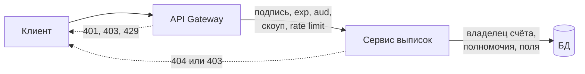
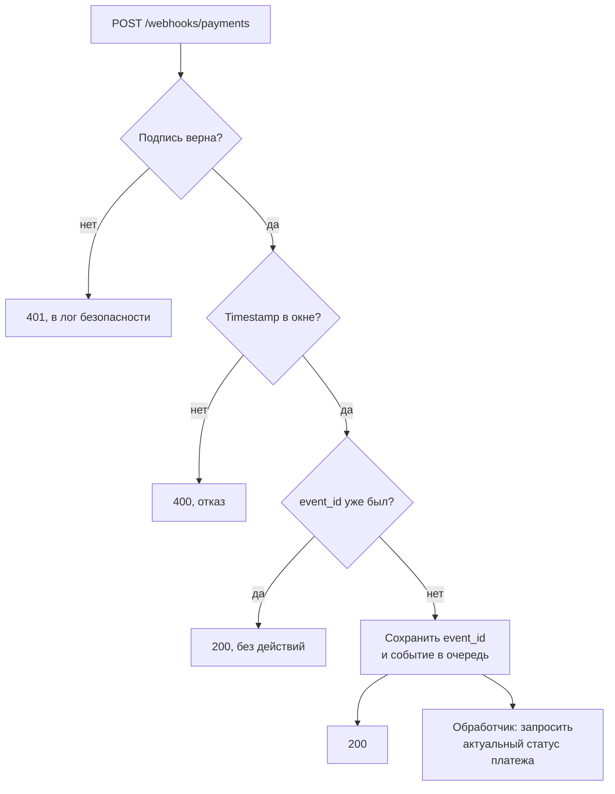

# 1.5 Защита API: OWASP API Top 10, подписи запросов, вебхуки, rate limiting

## Зачем это аналитику

Большинство уязвимостей API — это не криптография, а логика доступа, которую никто не описал в требованиях. «Пользователь может просмотреть заказ» без уточнения «только свой» — готовая уязвимость BOLA. Поэтому раздел безопасности в спецификации пишет аналитик, а не только команда безопасности.

## Что понять

- [ ] **OWASP API Security Top 10 (2023)**, каждый пункт с примером из своей практики:
  - API1 **BOLA** — доступ к чужому объекту подстановкой ID. Самая частая и самая дорогая уязвимость.
  - API2 Broken Authentication.
  - API3 Broken Object Property Level Authorization — mass assignment и лишние поля в ответе.
  - API4 Unrestricted Resource Consumption — нет лимитов на размер, частоту, пагинацию.
  - API5 Broken Function Level Authorization — обычный пользователь вызывает админский метод.
  - API6 Unrestricted Access to Sensitive Business Flows — автоматизация бизнес-процесса (скупка, спам регистрациями).
  - API7 SSRF.
  - API8 Security Misconfiguration.
  - API9 Improper Inventory Management — забытые старые версии и тестовые эндпоинты.
  - API10 Unsafe Consumption of APIs — слепое доверие ответам партнёров.
- [ ] **Модели авторизации**: RBAC, ABAC, ReBAC. Где проверять права: на gateway (грубо) или в сервисе (по объекту).
- [ ] **Подпись запросов HMAC**: канонизация запроса, timestamp + nonce против replay, сравнение подписи за постоянное время. Как это устроено в AWS SigV4 и в вебхуках Stripe или GitHub.
- [ ] **Вебхуки**: проверка подписи, защита от повторов, идемпотентный приёмник, ретраи отправителя, порядок событий не гарантирован, «тонкое» событие + запрос актуального состояния.
- [ ] **API-ключи**: чем ключ отличается от токена, ротация, хранение хеша, а не самого ключа.
- [ ] **Rate limiting и квоты**: token bucket, leaky bucket, sliding window; по какому ключу считать лимит (IP, клиент, пользователь); заголовки `RateLimit` / `Retry-After`.
- [ ] **CORS**: защищает пользователя браузера от чужого сайта, а не сервер от чужих клиентов. `curl` на CORS не смотрит. Preflight, `Access-Control-Allow-Credentials`, почему `*` с credentials запрещён.
- [ ] **Валидация входа**: строгая схема, ограничения размеров, отказ от неизвестных полей там, где это важно.
- [ ] **Секреты и логи**: токены и персональные данные в логах, маскирование, требования 152-ФЗ и PCI DSS на уровне «что это означает для требований».
- [ ] **Аудит**: какие события логировать для расследований (кто, что, когда, с какого клиента, результат).

## Урок

<!-- LESSON:START -->
### Почему безопасность API — это требования

Взломы API редко связаны со слабой криптографией. TLS, подписи и токены обычно на месте. Ломается логика: сервис правильно проверяет, что токен валиден, но не проверяет, что заказ, который просят показать, принадлежит этому пользователю. Такая проверка не появится сама — её нужно сформулировать, и сформулировать её может только тот, кто знает предметную область. Поэтому у каждого метода API в спецификации должно быть явно записано, кто и к каким объектам имеет доступ, какие поля можно менять и какие лимиты действуют.

### OWASP API Security Top 10 (2023)

Список OWASP — это не стандарт, а классификация наиболее частых классов проблем. Удобно использовать его как чек-лист при ревью спецификации.

| Код | Название | Пример из доменов |
|---|---|---|
| API1 | Broken Object Level Authorization (BOLA) | `GET /statements/77120` отдаёт выписку чужой организации |
| API2 | Broken Authentication | Вход без ограничения попыток, токены без проверки срока |
| API3 | Broken Object Property Level Authorization | Клиент передаёт `"status": "paid"` при создании заказа |
| API4 | Unrestricted Resource Consumption | `limit=1000000` в выгрузке остатков по всем магазинам |
| API5 | Broken Function Level Authorization | Сотрудник филиала вызывает `POST /admin/tariffs` |
| API6 | Unrestricted Access to Sensitive Business Flows | Бот скупает освободившиеся домены на аукционе |
| API7 | Server Side Request Forgery (SSRF) | Сервер загружает картинку по URL из запроса и идёт во внутреннюю сеть |
| API8 | Security Misconfiguration | Стектрейсы в ответах, открытый Swagger на проде |
| API9 | Improper Inventory Management | Забытая `/v1`, в которой нет новой проверки прав |
| API10 | Unsafe Consumption of APIs | Данные партнёра сохраняются без валидации |

#### API1: BOLA

Самая частая и самая дорогая уязвимость. Механизм прост: идентификатор объекта приходит от клиента (в пути, в параметре, в теле), и сервер загружает объект по нему, не сверив владельца. Атакующему достаточно перебрать соседние значения. Частая она потому, что аутентификация делается один раз в инфраструктуре, а проверка владения — в каждом методе вручную, и её легко забыть. Дорогая — потому что утекает сразу всё: перебор ID выгружает базу.

Непредсказуемые идентификаторы (UUID вместо последовательных чисел) затрудняют перебор, но не защищают: ID утекают в ссылках, логах, письмах. Защита — проверка на стороне сервиса. В требованиях это выглядит так: «Метод возвращает выписку, только если счёт принадлежит организации из токена и у пользователя есть полномочие "просмотр выписок" по этой организации. В противном случае — 404». Код 404 вместо 403 выбирают, чтобы не подтверждать существование чужого объекта; это решение тоже стоит зафиксировать.

#### API2: Broken Authentication

Слабые места механизма входа: нет ограничения попыток на логин и восстановление пароля, токены без срока жизни, приём токенов без проверки подписи или `aud`, передача учётных данных в URL. Требования: лимиты и блокировки на эндпоинтах аутентификации, многофакторная аутентификация для чувствительных операций, проверка токенов по правилам из модуля 1.4.

#### API3: Broken Object Property Level Authorization

Объединяет две старые категории. Первая — массовое присваивание (mass assignment): фреймворк автоматически переносит все поля JSON в модель, и клиент задаёт поля, которые ему менять нельзя (`status`, `price`, `role`, `owner_id`). Вторая — избыточная выдача: API отдаёт объект целиком, а фильтрует поля фронтенд. Лечится явными схемами: отдельные DTO на вход и на выход, список полей, которые клиент может менять, и список полей, которые он может видеть, в разрезе ролей.

#### API4: Unrestricted Resource Consumption

Нет лимитов на размер тела, количество элементов в пакете, размер страницы, глубину вложенности, частоту вызовов, длительность операции. Последствия — отказ в обслуживании и прямые деньги, если каждый вызов стоит (SMS, платные внешние API, вычисления). Требования: максимальный `limit` пагинации, максимальный размер запроса, таймауты, rate limit по клиенту.

#### API5: Broken Function Level Authorization

Проверка «можно ли этому субъекту вызывать эту функцию вообще». Типичный случай — административные методы на том же хосте, защищённые только тем, что их нет в интерфейсе. Лечится матрицей «роль — операция» в спецификации и централизованной проверкой, которая по умолчанию запрещает.

#### API6: Unrestricted Access to Sensitive Business Flows

Каждый запрос легитимен, но автоматизация бизнес-процесса наносит ущерб: скупка товара с ограниченным остатком, массовая регистрация аккаунтов ради бонусов, выкуп доменов в момент освобождения. Технически не уязвимость, поэтому её не найдёт сканер. Защита описывается бизнес-правилами: лимиты на клиента и на устройство, задержки, капча, проверка аномалий, ограничения на одну организацию.

#### API7: SSRF

Сервер делает исходящий запрос по адресу, который пришёл от клиента: загрузка аватара по URL, вебхук с настраиваемым адресом, проверка доступности сайта. Атакующий подставляет внутренний адрес — сервис метаданных облака, админку в приватной сети. Защита: белые списки хостов и схем, запрет приватных диапазонов с проверкой уже после DNS-разрешения, отдельный изолированный исходящий прокси.

#### API8: Security Misconfiguration

Всё, что не про код: отладочные режимы на проде, подробные ошибки со стектрейсом, открытая документация и консоль управления, слабые настройки TLS, CORS с отражением любого `Origin`, отсутствие заголовков безопасности, дефолтные пароли. Лечится базовыми требованиями к конфигурации и их проверкой в CI.

#### API9: Improper Inventory Management

Нельзя защитить то, о чём не знаешь. Старая версия API, в которой не исправлена уязвимость, тестовый стенд с копией продовых данных, эндпоинт «временно для партнёра». Требования: реестр всех API и версий с владельцами, политика вывода версий из эксплуатации, одинаковый уровень защиты для всех опубликованных версий.

#### API10: Unsafe Consumption of APIs

Разработчики доверяют ответам партнёров больше, чем вводу пользователей, хотя партнёр может быть скомпрометирован или просто ошибиться. Если сервис сохраняет ответ партнёра без проверки, в базу попадают данные, которые потом исполнятся как скрипт в интерфейсе оператора (XSS), сломают выгрузку или отчёт, пойдут в SQL. Сюда же относится следование редиректам партнёра и отсутствие таймаутов на его вызовы. Требования: валидация ответов по схеме, ограничения размера, таймауты, TLS с проверкой сертификата, запрет автоматических редиректов.

### Модели авторизации и место проверки

**RBAC** (role-based access control) — права привязаны к ролям: «кассир», «бухгалтер организации», «администратор». Простая и понятная модель, но она плохо выражает условия («бухгалтер может подписывать платежи до суммы X только своей организации»), и число ролей растёт.

**ABAC** (attribute-based) — решение принимается по атрибутам субъекта, объекта, действия и контекста: `user.org_id == account.org_id and amount <= user.limit and time in business_hours`. Гибко, но политики нужно тестировать и объяснять.

**ReBAC** (relationship-based) — права вычисляются по графу связей: пользователь — сотрудник организации, организация — владелец счёта, у сотрудника есть делегированное полномочие на счёт. Удобно для иерархий и совместного доступа, типичная реализация — отдельный сервис авторизации в духе системы Google Zanzibar.

Где проверять? Gateway знает о запросе только токен и путь: он может проверить подпись, срок, скоуп и роль для группы методов. Он не знает, кому принадлежит счёт 77120, — для этого нужны данные сервиса. Поэтому разумная схема двухуровневая: gateway отсекает очевидно лишнее (грубая авторизация, лимиты), сервис проверяет права на объект и на поля. Полагаться только на gateway опасно ещё и потому, что внутренний трафик может приходить в обход него.

### Подпись запросов HMAC

HMAC-подпись доказывает, что запрос сформирован владельцем общего секрета и не изменён по дороге. Ключевая сложность — канонизация: отправитель и получатель должны получить побайтово одинаковую строку для подписи, а HTTP допускает множество эквивалентных представлений одного запроса (регистр заголовков, порядок параметров, кодирование URL). Поэтому схема подписи фиксирует правила: какие части запроса входят, в каком порядке, как нормализуются.

Одной подписи недостаточно: перехваченный подписанный запрос можно отправить повторно (replay). Защита — timestamp в подписываемых данных и окно допуска (несколько минут), плюс nonce или идентификатор запроса, которые получатель помнит в пределах окна и отвергает повторы.

Сравнение подписи — только за постоянное время (`hmac.compare_digest` в Python, аналоги в других языках). Обычное сравнение строк прерывается на первом несовпавшем байте, и по времени ответа можно подбирать подпись побайтно.

Как это устроено у известных провайдеров:

- **AWS Signature Version 4**. Клиент строит канонический запрос: метод, путь, отсортированные параметры, выбранные заголовки в нижнем регистре, список подписанных заголовков, хеш тела. От него считается хеш и составляется строка для подписи с датой и областью действия (дата, регион, сервис). Ключ подписи не используется напрямую: из секрета цепочкой HMAC выводится ключ, привязанный к дате, региону и сервису. Время запроса входит в подпись, и запросы со слишком старым временем отвергаются.
- **Stripe**. Заголовок `Stripe-Signature` содержит `t=<timestamp>` и `v1=<подпись>`. Подписывается строка из timestamp, точки и сырого тела запроса, HMAC-SHA256 на секрете конкретного эндпоинта. Получатель проверяет подпись и допуск по времени.
- **GitHub**. Заголовок `X-Hub-Signature-256` с HMAC-SHA256 от тела. Timestamp в подпись не входит, для отсева повторов есть уникальный идентификатор доставки в отдельном заголовке.

Общая практическая деталь: подпись считается от сырых байтов тела. Если фреймворк сначала распарсил JSON, а подпись проверяют от повторно сериализованного объекта, она не сойдётся.

### Вебхуки

Вебхук — это API, в котором вы сервер, а вызывает вас внешняя система. Отсюда набор требований к приёмнику:

1. **Подлинность**: проверка подписи до любой обработки, по сырому телу, со сравнением за постоянное время.
2. **Свежесть**: timestamp в пределах окна, иначе отказ.
3. **Идемпотентность**: отправитель гарантирует доставку «хотя бы один раз» и повторяет при таймауте или ошибке. Приёмник запоминает идентификатор события и повторную доставку подтверждает, ничего не делая.
4. **Быстрый ответ**: сохранить событие и ответить 2xx, обработку — асинхронно. Долгая синхронная обработка приводит к таймаутам у отправителя и к лавине повторов.
5. **Порядок не гарантирован**: событие `payment.refunded` может прийти раньше `payment.succeeded`. Приёмник не должен строить состояние из последовательности событий.
6. **Тонкое событие**: вместо доверия к данным в теле — получить идентификатор и запросить актуальное состояние у API отправителя. Это решает проблему порядка и заодно подделки содержимого.

### API-ключи

API-ключ — долгоживущий секрет, идентифицирующий приложение или интеграцию. В отличие от OAuth-токена, он не выражает делегирования от пользователя, не содержит скоупов и срока (если их не добавить на сервере) и обычно не истекает сам. Это удобно для B2B-интеграций, но утечка ключа означает доступ на неопределённый срок.

Требования к ключам:

- Сервер хранит не ключ, а его хеш. Ключ показывается клиенту один раз при создании. Поскольку ключ — длинная случайная строка, медленные хеши для паролей не нужны, достаточно криптографического хеша.
- Префикс с идентификатором ключа (`sk_live_…`) позволяет найти запись без перебора и ловить утёкшие ключи сканерами секретов в репозиториях.
- Ротация без простоя: у клиента одновременно действуют два ключа, новый вводится, старый отзывается после переключения.
- Привязка ключа к правам, окружению и, где возможно, к IP-адресам клиента; журнал использования.

### Rate limiting и квоты

Ограничение частоты защищает от перегрузки (API4) и от злоупотребления бизнес-процессами (API6). Квота — более длинный лимит (в сутки, в месяц), часто привязанный к тарифу.

| Алгоритм | Как работает | Сильная сторона | Слабая сторона |
|---|---|---|---|
| Fixed window | Счётчик на календарное окно, сброс в начале окна | Проще всего | Всплеск на границе окон |
| Sliding window | Учитывает запросы за последние N секунд (лог или взвешенные счётчики) | Нет всплеска на границе | Дороже по памяти или приблизителен |
| Token bucket | Ведро на C токенов пополняется со скоростью R, запрос тратит токен | Допускает контролируемые всплески | Нужно подобрать C и R |
| Leaky bucket | Запросы в очереди, вытекают с постоянной скоростью | Ровный поток к бэкенду | Задержки, переполнение очереди |

Проблема fixed window: при лимите 100 в минуту клиент отправляет 100 запросов в последнюю секунду окна и ещё 100 в первую секунду следующего — 200 запросов за две секунды при формальном соблюдении лимита. Token bucket задаёт и среднюю скорость (R), и максимальный всплеск (C) явно, поэтому его чаще всего и выбирают для публичных API.

По какому ключу считать: по IP — для анонимных запросов и эндпоинтов входа, но за корпоративным NAT сидит много пользователей. По клиенту (API-ключ, `client_id`) — для тарифов. По пользователю — для защиты от злоупотреблений внутри одного клиента. Часто нужно несколько лимитов сразу.

Ответ при превышении — `429 Too Many Requests` с заголовком `Retry-After`. Для информирования клиента о текущем состоянии широко используются заголовки вида `X-RateLimit-Limit`, `X-RateLimit-Remaining`, `X-RateLimit-Reset`; в IETF на момент написания стандартизируются заголовки `RateLimit` и `RateLimit-Policy`. В требованиях важно зафиксировать, какие именно заголовки отдаются, чтобы клиенты могли строить отступ (backoff) без гадания.

### CORS

CORS (Cross-Origin Resource Sharing) часто принимают за защиту сервера. Это не так. Same-origin policy — правило браузера, которое не даёт скрипту с чужого сайта читать ответы вашего API от имени пользователя, у которого есть ваши cookie. CORS — способ сервера ослабить это правило для доверенных источников. Защищается пользователь браузера от вредоносного сайта, который он открыл. `curl`, серверный скрипт или бот заголовки CORS игнорируют и вызывают API как хотят.

Механика: для «непростых» запросов (методы кроме GET, HEAD, POST, нестандартные заголовки вроде `Authorization`, тело с `Content-Type: application/json`) браузер сначала отправляет preflight — `OPTIONS` с `Origin` и `Access-Control-Request-Method`. Сервер отвечает, разрешён ли источник, методы и заголовки. Если клиенту нужно отправить cookie, сервер должен вернуть `Access-Control-Allow-Credentials: true` и конкретный `Origin`, а не `*`. Сочетание `*` с credentials браузер отвергает: иначе любой сайт в интернете мог бы читать персональные данные пользователя через ваш API. Опасная ошибка конфигурации — отражать в ответе любой пришедший `Origin` вместе с credentials: формально это не `*`, а по сути то же самое.

### Валидация входа

Строгая схема на входе — первая линия против API3, API4 и инъекций. Для каждого поля — тип, формат, диапазон, максимальная длина; для массивов — максимальное количество элементов; для тела — максимальный размер. В OpenAPI это `maxLength`, `maximum`, `maxItems`, `pattern`, `enum`.

Неизвестные поля: там, где лишнее поле может изменить смысл операции (платёж, изменение прав, настройки), запрос с неизвестными полями лучше отвергать (`additionalProperties: false`). Там, где важна обратная совместимость клиентов, неизвестные поля игнорируют, но никогда не переносят в модель автоматически. Решение принимается осознанно и фиксируется в спецификации.

### Секреты, персональные данные и логи

Логи читают больше людей, чем продовую базу, и хранятся они дольше. Поэтому в них не должно быть: токенов, API-ключей, паролей, подписей, заголовка `Authorization`, cookie, полных номеров карт, CVV, полных тел запросов с персональными данными. Маскирование делается на уровне логгера по списку полей, а не на совести разработчика.

Что это значит для требований. Закон 152-ФЗ о персональных данных требует обрабатывать их для заявленной цели, в минимально необходимом объёме, с ограничением доступа и сроков хранения. Логи с ФИО, телефонами и паспортными данными — тоже обработка персональных данных, со всеми вытекающими. PCI DSS для данных карт запрещает хранить данные аутентификации карты (CVV, полную дорожку, PIN) после авторизации, а номер карты при хранении должен быть нечитаемым; при отображении номер маскируется. На практике требование звучит так: «номер карты в логах и интерфейсах — только в маскированном виде, CVV не сохраняется нигде».

### Аудит

Аудит-лог отличается от технического: он нужен для расследований и доказательства действий, поэтому пишется для значимых событий, хранится отдельно и защищён от изменения.

Что писать: кто (идентификатор пользователя и клиента, организация), что (операция и идентификатор объекта), когда (время с часовым поясом), откуда (IP, идентификатор устройства или клиента), результат (успех, отказ и причина), идентификатор корреляции запроса. Обязательные события: вход и неудачные попытки, изменение прав и ролей, операции с деньгами и их подписание, выгрузки больших объёмов данных, отказы в доступе, изменения ключей и настроек безопасности.

Чего не писать: секретов и токенов, полных тел с персональными данными — только идентификаторы объектов.

### Типичные ошибки

- Требование «пользователь может просмотреть заказ» без условия владения — прямой путь к BOLA.
- Вся авторизация только на gateway; сервис доверяет любому запросу из внутренней сети.
- Вера в то, что CORS или UUID вместо числовых ID защищают API.
- Проверка подписи вебхука после парсинга JSON, обычное сравнение строк, отсутствие окна по времени.
- Синхронная тяжёлая обработка вебхука и расчёт на порядок событий.
- API-ключи в открытом виде в базе и без процедуры ротации.
- Rate limit описан одной цифрой без ключа подсчёта, поведения при превышении и заголовков.

### Как говорить об этом на собеседовании

Показывайте, что безопасность у вас — часть постановки, а не отдельный документ от ИБ. Пример формулировки: «В каждой спецификации метода у меня есть раздел доступа: какая роль, какое условие на объект, какие поля клиент может менять. BOLA в ревью ловится вопросом "а чей это объект и где это проверяется"». Хорошо звучит конкретный случай: нашли метод выписки, который проверял только токен, описали правило владения и код ответа.

Уровень senior виден по компромиссам: gateway для грубых проверок и лимитов, сервис для объектных; token bucket, потому что он явно задаёт всплеск; тонкие вебхуки, потому что порядок не гарантирован; 404 вместо 403 для чужих объектов и осознанность этого выбора.

### Коротко

- Большинство уязвимостей API — неописанная логика доступа, а не криптография.
- BOLA — главный риск: права на объект проверяет сервис при каждом запросе, и это записано в требованиях.
- Gateway — для аутентификации, скоупов и лимитов; сервис — для объектов и полей.
- HMAC-подпись: канонизация, timestamp и nonce против повторов, сравнение за постоянное время.
- Приёмник вебхуков проверяет подпись, идемпотентен, быстро отвечает и не полагается на порядок.
- API-ключи хранятся хешами и ротируются с перекрытием.
- CORS защищает пользователя браузера, а не сервер.
- В логах нет секретов и лишних персональных данных; аудит отвечает на вопросы «кто, что, когда, откуда, с каким результатом».
<!-- LESSON:END -->

## Читать дальше

- [OWASP API Security Top 10 — 2023](https://owasp.org/API-Security/editions/2023/en/0x11-t10/) — каждый пункт со сценариями атак и способами защиты.
- [OWASP ASVS](https://owasp.org/www-project-application-security-verification-standard/) — главы про аутентификацию, контроль доступа и API. Готовый чек-лист требований.
- [OWASP Cheat Sheet Series](https://cheatsheetseries.owasp.org): REST Security, Authorization, Mass Assignment.
- Stripe Docs: раздел о проверке подписи вебхуков — образцовая реализация.
- Neil Madden, *API Security in Action* (Manning) — если захочется глубже.

На system-design.space:

- [Паттерны защиты API](https://system-design.space/chapter/api-security-patterns/)
- [OWASP Top 10 в контексте системного дизайна](https://system-design.space/chapter/owasp-top-10-system-design/)
- [Моделирование угроз: STRIDE и LINDDUN](https://system-design.space/chapter/threat-modeling-stride-linddun/)
- [Паттерны управления секретами](https://system-design.space/chapter/secrets-management-patterns/)
- [Визуализация: Алгоритмы ограничения запросов (rate limiting)](https://system-design.space/visuals/rate-limiting/)

## Практика

1. Взять обезличенную спецификацию из своей практики (или OpenAPI из модуля 1.3) и пройтись по ней с чек-листом OWASP API Top 10. Для каждого пункта записать: «риск есть / нет / не описано в требованиях».
2. Реализовать на Python (20–30 строк) проверку HMAC-подписи вебхука с timestamp и допуском по времени. Сравнение — через `hmac.compare_digest`.
3. Сформулировать требования к rate limiting для публичного API: лимиты по тарифам, ответ при превышении, заголовки, что видит клиент.
4. **Итог блока 1**: переписать раздел нефункциональных требований одной обезличенной интеграции — транспорт и TLS, аутентификация, авторизация по объектам, идемпотентность, таймауты и ретраи, ошибки, лимиты, аудит. Положить в «Заметки».

## Вопросы для самопроверки

1. Что такое BOLA, почему это самая частая уязвимость API и как описать защиту от неё в требованиях?
2. Защищает ли CORS API от вызовов со стороннего сервера? От чего он защищает на самом деле?
3. Как устроена проверка подписи вебхука и как защититься от повторной отправки перехваченного запроса?
4. Где проверять права доступа: на gateway или в сервисе? Почему?
5. Чем token bucket отличается от fixed window? Какая проблема есть у fixed window на границе окна?
6. Партнёр отдаёт данные, а ваш сервис сохраняет их без проверки. Какой пункт OWASP это нарушает и чем это грозит?
7. Что должно попадать в аудит-лог API, а что туда попадать не должно?

## Заметки

<!-- Свои формулировки, ошибки, ссылки. -->
