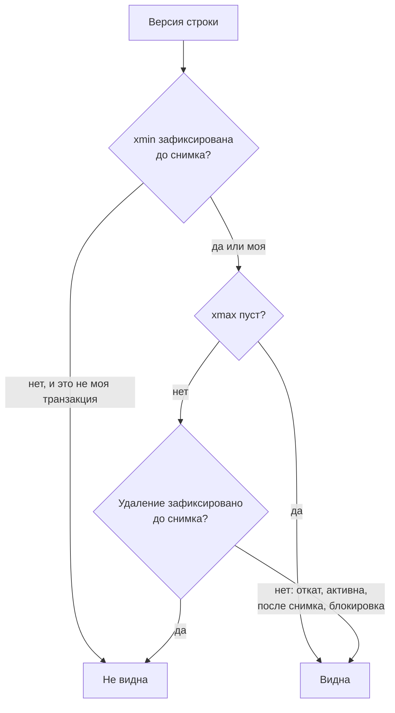
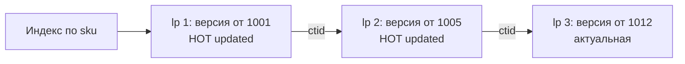

# 2.1 MVCC и хранение: версии строк, VACUUM, bloat

## Зачем это аналитику

Из MVCC вытекает всё остальное: почему читатели не блокируют писателей, почему частые UPDATE раздувают таблицу, почему долгая транзакция вредит всей базе, почему `COUNT(*)` небыстрый. Без этой модели обсуждение изоляции и блокировок превращается в заучивание таблиц.

## Что понять

- [ ] **Страница (8 КБ) и кортеж**: заголовок строки, `ctid` — физический адрес версии.
- [ ] **xmin и xmax**: номер транзакции, создавшей версию, и номер транзакции, удалившей или заблокировавшей её. UPDATE = пометить старую версию `xmax` + вставить новую. DELETE = только пометить.
- [ ] **Снимок данных (snapshot)**: `xmin`, `xmax`, список активных транзакций. Правила видимости: версия видна, если создана зафиксированной до снимка транзакцией и не удалена такой же.
- [ ] **Статус транзакций** (CLOG / pg_xact) и hint bits — почему первый SELECT после массовой вставки может писать на диск.
- [ ] **HOT-обновления** (Heap-Only Tuple): когда UPDATE не трогает индексы. Условия: не меняются индексированные столбцы и на странице есть место. Отсюда параметр `fillfactor`.
- [ ] **VACUUM**: удаляет мёртвые версии, которые не видны ни одному снимку; обновляет карту видимости (visibility map) и карту свободного пространства (FSM). Обычный VACUUM не возвращает место операционной системе, VACUUM FULL возвращает, но берёт эксклюзивную блокировку.
- [ ] **Autovacuum**: когда запускается (пороги `autovacuum_vacuum_scale_factor` / `threshold`), почему на больших таблицах его настраивают индивидуально.
- [ ] **Горизонт очистки**: одна долгая транзакция или забытый `idle in transaction` не даёт VACUUM удалять мёртвые версии во всей базе. Это причина «таблица растёт, а данных не прибавляется».
- [ ] **Bloat** таблиц и индексов, как его увидеть и чем лечить (`pg_repack`, `REINDEX CONCURRENTLY`).
- [ ] **Заморозка (freeze) и wraparound**: 32-битный счётчик транзакций, почему заморозка обязательна и что будет, если её не делать.
- [ ] **TOAST**: где хранятся большие значения и почему `SELECT *` по таблице с большими JSON-полями дороже, чем кажется.

## Урок

<!-- LESSON:START -->
### Идея многоверсионности

Управление параллельным доступом через несколько версий (Multi-Version Concurrency Control, MVCC) решает конфликт между чтением и записью так: запись не перезаписывает данные на месте, а создаёт новую версию строки. Каждый читатель видит тот набор версий, который соответствует его моменту во времени. Читателю не нужно ждать, пока писатель закончит, — он просто видит старую версию. Писателю не нужно ждать читателя — он создаёт новую, не трогая ту, которую читают.

Цена этого подхода в PostgreSQL — старые версии физически остаются в таблице, пока их не уберёт очистка (VACUUM). Почти все эксплуатационные проблемы PostgreSQL, о которых спрашивают на собеседованиях, растут отсюда: распухание таблиц, вред от долгих транзакций, нагрузка на диск от autovacuum, риск переполнения счётчика транзакций.

Блокировки при этом никуда не деваются: два писателя, меняющие одну и ту же строку, по-прежнему ждут друг друга. MVCC снимает конфликт только между чтением и записью.

### Страница и кортеж

Таблица (heap, «куча») хранится в файлах, разбитых на страницы по 8 КБ. Внутри страницы:

- заголовок страницы;
- массив указателей на строки (line pointers), растущий от начала страницы;
- сами версии строк, кортежи (tuples), которые размещаются с конца страницы навстречу указателям;
- свободное место между ними.

Указатели нужны для косвенной адресации: индекс ссылается не на байтовое смещение, а на пару «номер страницы, номер указателя». Эта пара называется `ctid` — физический адрес версии строки. Кортеж можно сдвинуть внутри страницы при уплотнении, поправив указатель, и индексы этого не заметят.

У каждого кортежа есть заголовок фиксированного размера (порядка двух десятков байт) — это и есть служебные данные MVCC. Самые важные поля:

- `xmin` — номер транзакции (transaction ID, XID), создавшей версию;
- `xmax` — номер транзакции, удалившей или заблокировавшей версию, или 0;
- `ctid` в заголовке — ссылка на следующую, более новую версию той же строки (у последней версии указывает на саму себя);
- биты состояния (infomask), включая hint bits, о которых ниже.

Из-за этого заголовка таблица из узких строк занимает заметно больше, чем «сумма размеров полей».

### Что происходит при INSERT, UPDATE и DELETE

**INSERT** создаёт кортеж с `xmin` = номер текущей транзакции и `xmax` = 0.

**DELETE** ничего не удаляет физически. Он записывает в `xmax` найденной версии номер своей транзакции. Строка остаётся на странице, пока её не уберёт очистка.

**UPDATE** — это DELETE плюс INSERT: старая версия получает `xmax`, рядом (на той же странице, если есть место, иначе на другой) создаётся новая версия с новым `xmin`, а поле `ctid` старой версии указывает на новую. Если на таблице есть индексы и не сработала оптимизация HOT, в каждый индекс добавляется новая запись, указывающая на новую версию. Обновление одного поля в строке с пятью индексами — это одна новая версия в таблице и пять новых записей в индексах.

Пусть в интернет-магазине есть строка остатка товара и транзакция 1001 её создала, а транзакция 1005 обновила количество:

| lp | t_xmin | t_xmax | t_ctid | Смысл |
|---|---|---|---|---|
| 1 | 1001 | 1005 | (0,2) | Старая версия, удалена транзакцией 1005, следующая версия в lp 2 |
| 2 | 1005 | 0 | (0,2) | Актуальная версия |

Ровно такую картину показывает `heap_page_items` из расширения `pageinspect` в практической части.

`xmax` используется и для блокировок строк: `SELECT … FOR UPDATE` записывает номер своей транзакции в `xmax` и выставляет бит «это блокировка, а не удаление». Поэтому блокировка строки в PostgreSQL — запись на страницу, а не только запись в памяти. Когда строку блокируют несколько транзакций сразу (например, разделяемыми блокировками), в `xmax` пишется номер мультитранзакции (MultiXact) — отдельной структуры со списком участников.

### Снимок данных и правила видимости

Какую версию увидит запрос, определяет снимок данных (snapshot). Снимок — это не копия данных, а три значения:

- `xmin` снимка — наименьший номер среди транзакций, активных в момент снимка; всё, что меньше, уже завершено;
- `xmax` снимка — номер, который получит следующая транзакция; всё, что больше или равно, началось после снимка;
- список активных транзакций между ними (xip).

Версия видна снимку, если транзакция из её `xmin` зафиксирована и зафиксирована «до снимка» (не в списке активных и меньше `xmax` снимка), а её `xmax` либо пуст, либо принадлежит транзакции, которая откатилась или ещё не была зафиксирована на момент снимка. Отдельно: собственные изменения транзакции ей видны всегда.



Когда берётся снимок, зависит от уровня изоляции. На Read Committed — перед каждым оператором, поэтому следующий SELECT в той же транзакции видит изменения, зафиксированные между ними. На Repeatable Read и Serializable — один раз, на первом операторе транзакции, и живёт до её конца.

Отсюда ответ на вопрос «почему читатели не блокируют писателей». Читателю не нужна блокировка: он проходит по версиям и выбирает видимую по правилам выше. Писатель создаёт новую версию, которая читателю с более ранним снимком просто не видна. Никто никого не ждёт.

Отсюда же медленный `COUNT(*)`: у таблицы нет готового счётчика строк, потому что разным транзакциям одновременно видно разное количество строк. Чтобы посчитать, нужно пройти версии и проверить видимость каждой. Ускорить может только индексный просмотр без обращения к таблице (index-only scan) по страницам, которые карта видимости отмечает как «все версии видны всем».

### Статус транзакций и hint bits

Правила видимости требуют знать, зафиксирована ли транзакция с номером `xmin` или откатилась. Эти статусы хранятся в CLOG (commit log, в современных версиях — каталог `pg_xact`): по два бита на транзакцию. Обращение к CLOG при проверке каждой версии было бы дорогим, поэтому первый процесс, который выяснил окончательный статус транзакции, записывает его прямо в заголовок кортежа — это подсказки (hint bits): «xmin зафиксирована», «xmin откатилась», аналогично для `xmax`. Следующие чтения смотрят только на биты.

Побочный эффект: установка hint bits меняет страницу, значит, страница становится «грязной» и будет записана на диск. Если загрузить миллион строк и сразу выполнить SELECT по таблице, этот SELECT проставит подсказки на всех страницах и спровоцирует их запись. При включённых контрольных суммах страниц (или `wal_log_hints = on`) первое такое изменение страницы после контрольной точки пишет в журнал предзаписи (WAL) её полный образ. Поэтому после массовой загрузки полезно сразу выполнить VACUUM — он проставит подсказки и заодно заполнит карту видимости один раз, а не за счёт первых пользователей.

### HOT-обновления и fillfactor

Обычный UPDATE добавляет запись в каждый индекс таблицы. HOT-обновление (Heap-Only Tuple) обходится без этого. Условия:

1. Не меняется ни один столбец, входящий в какой-либо индекс (с PostgreSQL 16 исключение — столбцы, покрытые только BRIN-индексами).
2. Новая версия помещается на ту же страницу, где лежит старая.

Тогда индексы продолжают указывать на исходный указатель (lp), а от него внутри страницы тянется HOT-цепочка к актуальной версии. Индексы не растут, и изменение не нужно отражать в них.



Мёртвые версии в HOT-цепочке может убрать не только VACUUM, но и внутристраничная очистка (page pruning): когда процесс обращается к странице, на которой мало места, он удаляет недоступные никому версии и уплотняет страницу, оставляя указатель-перенаправление на начало цепочки.

Второе условие зависит от места на странице. По умолчанию страницы таблицы заполняются полностью (`fillfactor = 100`), и для частых обновлений места не остаётся. Для таблиц с интенсивными UPDATE — остатки товаров, статусы заказов, балансы — задают `fillfactor` порядка 70–90: при вставке часть страницы остаётся свободной под будущие версии. Первое условие — вопрос проектирования: индекс на часто меняемом столбце (например, `updated_at` или `status`) отключает HOT для всех обновлений этого столбца. Долю HOT-обновлений видно в `pg_stat_user_tables` (`n_tup_hot_upd` против `n_tup_upd`).

### VACUUM

Очистка (VACUUM) делает несколько вещей:

- удаляет версии, которые уже не видны ни одному снимку (мёртвые, dead tuples), и соответствующие им записи в индексах;
- обновляет карту свободного пространства (free space map, FSM), чтобы новые вставки занимали освобождённое место;
- обновляет карту видимости (visibility map): отмечает страницы, где все версии видны всем, — это ускоряет следующую очистку и делает возможным index-only scan;
- замораживает старые версии (о заморозке ниже);
- обновляет статистику для планировщика, если запущен с ANALYZE.

Обычный VACUUM работает параллельно с чтением и записью и не возвращает место операционной системе: освобождённое пространство остаётся внутри файлов и переиспользуется таблицей. Исключение — пустые страницы в самом конце файла, их он может отрезать.

VACUUM FULL переписывает таблицу и все её индексы в новые файлы без мёртвых версий и возвращает место. Цена — блокировка ACCESS EXCLUSIVE на всё время работы: таблицу нельзя ни читать, ни писать. Для таблицы в десятки гигабайт это часы простоя, плюс нужен свободный диск под полную копию. Поэтому на проде его почти не запускают, а используют онлайн-альтернативы.

### Autovacuum

Процесс автоочистки (autovacuum) сам решает, когда чистить таблицу. Очистка запускается, когда число мёртвых версий превышает порог:

```
порог = autovacuum_vacuum_threshold + autovacuum_vacuum_scale_factor * число_строк
```

По умолчанию это 50 строк плюс 20% таблицы. Для таблицы на тысячу строк это пустяк, а для таблицы продаж на миллиард строк — двести миллионов мёртвых версий до первой очистки (в PostgreSQL 18 порог сверху ограничен параметром `autovacuum_vacuum_max_threshold`, по умолчанию 100 миллионов, — всё равно слишком много). Это много лишнего места, долгая очистка и деградация запросов. Поэтому для больших и активно меняемых таблиц параметры задают индивидуально:

```sql
ALTER TABLE sales_fact SET (
  autovacuum_vacuum_scale_factor = 0.01,
  autovacuum_vacuum_threshold = 10000
);
```

Аналогичные пороги есть для ANALYZE и, в современных версиях, для таблиц, в которые только вставляют. Кроме порогов, autovacuum ограничен по скорости (параметры стоимости и задержки), чтобы не мешать нагрузке; на мощном оборудовании эти ограничения часто ослабляют, иначе очистка не успевает за потоком изменений.

### Горизонт очистки и долгие транзакции

VACUUM может удалить версию, только если она не видна никому. Граница, до которой версии можно удалять, — горизонт очистки: минимальный `xmin` среди всех активных снимков и транзакций. Горизонт общий: одна сессия держит его для всех таблиц своей базы, а не только для тех, что читает. Слоты репликации и обратная связь с реплик действуют ещё шире — на весь кластер.

Кто держит горизонт:

- долгий запрос или отчёт;
- транзакция на Repeatable Read, открытая и не завершённая, — её снимок живёт до конца;
- сессия `idle in transaction`: приложение открыло транзакцию, что-то изменило и ушло ждать внешний сервис или пользователя, не закрыв её. Уже получивший номер транзакции процесс держит горизонт этим номером;
- отставший или неиспользуемый слот репликации (физический — если реплика передавала обратную связь; логический держит горизонт только для системного каталога, зато копит WAL), подготовленные транзакции (`PREPARE TRANSACTION`), реплика с включённой обратной связью (`hot_standby_feedback`), на которой идёт долгий запрос.

Сценарий из ритейла. Сервис автопополнения в начале расчёта открывает транзакцию, читает остатки и идёт в сервис прогноза за данными, который отвечает сорок минут. Всё это время в базе интенсивно обновляются таблицы остатков и заказов. Autovacuum запускается, но ничего не может удалить: все мёртвые версии новее горизонта. Таблицы растут, HOT-цепочки удлиняются, индексы пухнут, запросы замедляются. Когда транзакция наконец закрывается, место освобождается внутри файлов, но размер файлов уже не уменьшится сам — остаётся раздувание.

Диагностика — `pg_stat_activity`: сессии с `state = 'idle in transaction'` и давним `xact_start`, а также значения `backend_xmin`. Защита — таймауты (`idle_in_transaction_session_timeout`, ограничения на время запроса), мониторинг возраста самой старой транзакции и, главное, правило в требованиях: транзакция не охватывает внешние вызовы и ожидание пользователя.

### Bloat таблиц и индексов

Раздувание (bloat) — ситуация, когда файл таблицы или индекса значительно больше, чем нужно для живых данных. Пример из вопросов: таблица на 50 ГБ при 5 ГБ живых данных. Как это получается: волна массовых обновлений или удалений (миграция, пересчёт статусов, чистка архива), во время которой очистка не успевала или не могла работать из-за горизонта. Мёртвые версии заняли место, потом VACUUM их убрал, но файл остался прежнего размера, и в нём 90% пустоты. Новые вставки будут это место переиспользовать, но последовательные чтения всё равно проходят по всем страницам.

Как увидеть: оценочные запросы по статистике, `n_dead_tup` в `pg_stat_user_tables`, точные цифры — расширение `pgstattuple` (оно читает таблицу целиком, на больших таблицах это нагрузка). Индексы пухнут отдельно от таблицы: после массовых удалений B-дерево не сжимается автоматически.

Как лечить:

- таблицу — `pg_repack` (или аналоги): строит новую копию рядом, догоняет изменения через триггеры и подменяет файлы с короткой блокировкой в конце. Нужен свободный диск под копию;
- индекс — `REINDEX CONCURRENTLY`: строит новый индекс без долгой блокировки записи и подменяет старый;
- VACUUM FULL или CLUSTER — только если допустим простой.

Но лечение без устранения причины бессмысленно: сначала найти, что держало горизонт или почему autovacuum не успевал, и настроить пороги.

### Заморозка и переполнение счётчика транзакций

Номер транзакции 32-битный. Около четырёх миллиардов значений кажутся большим запасом, но нагруженная база расходует их за недели или месяцы. Поэтому счётчик идёт по кругу, а сравнение номеров — по модулю: для каждой транзакции примерно два миллиарда номеров считаются «в прошлом» и столько же «в будущем». Если строка с `xmin` = 100 проживёт, пока счётчик уйдёт на два миллиарда вперёд, её `xmin` внезапно окажется «в будущем», и строка станет невидимой. Это transaction ID wraparound — фактическая потеря данных.

Защита — заморозка (freeze). VACUUM помечает достаточно старые версии как замороженные: такая версия считается созданной «в бесконечном прошлом» и видна всем, её `xmin` больше не участвует в сравнении. Для каждой таблицы хранится `relfrozenxid` — номер, старше которого в ней не осталось незамороженных версий; возраст этого номера и возраст базы (`age(datfrozenxid)`) — ключевые метрики мониторинга.

Когда возраст таблицы превышает `autovacuum_freeze_max_age` (по умолчанию 200 миллионов транзакций), запускается принудительная очистка против переполнения, даже если autovacuum для таблицы отключён. Она читает таблицу целиком, кроме страниц, уже помеченных в карте видимости как полностью замороженные, и на огромной таблице может идти часами, создавая заметную нагрузку. Если и это не помогает (например, горизонт держит забытая транзакция), по мере приближения к пределу PostgreSQL сначала пишет предупреждения, а затем перестаёт выдавать новые номера транзакций — база фактически уходит в режим только для чтения, пока не выполнят очистку. Аналогичный механизм заморозки есть и для счётчика мультитранзакций.

### TOAST

Версия строки должна помещаться на страницу. Большие значения переменной длины (`text`, `jsonb`, `bytea`) обрабатывает TOAST (The Oversized-Attribute Storage Technique). Когда строка превышает порог (порядка 2 КБ), PostgreSQL сначала пытается сжать длинные значения, а если не хватает — выносит их в отдельную TOAST-таблицу, нарезав на фрагменты. В основной строке остаётся ссылка. У каждого столбца есть стратегия хранения, определяющая, можно ли его сжимать и выносить.

Что это значит на практике:

- `SELECT *` по таблице с большими JSON-полями читает не только основные страницы, но и TOAST-таблицу, и распаковывает значения. Запрос на список заказов, которому нужны номер и статус, но который тянет и `payload` на десятки килобайт, в разы дороже;
- если значение не запрошено, оно не читается и не распаковывается — поэтому перечисление столбцов в SELECT для таких таблиц даёт реальный выигрыш;
- обновление любого поля в строке не переписывает вынесенное значение, если оно не менялось, но изменение самого большого JSON создаёт его новую копию целиком со всеми последствиями для очистки.

### Типичные ошибки

- Открытая транзакция вокруг вызова внешнего сервиса или ожидания пользователя; нет таймаута `idle in transaction`.
- Отключённый или оставленный на настройках по умолчанию autovacuum для больших активных таблиц.
- Индекс на часто обновляемом столбце «на всякий случай», который убивает HOT-обновления.
- VACUUM FULL на проде как средство от раздувания без оценки блокировки и без поиска причины.
- Массовый UPDATE всей таблицы одной транзакцией, удваивающий её размер, вместо пакетной обработки с паузами на очистку.
- Отсутствие мониторинга возраста транзакций и `datfrozenxid`, из-за чего о wraparound узнают по предупреждениям в логе.
- `SELECT *` по таблицам с большими `jsonb`-полями в частых запросах.

### Как говорить об этом на собеседовании

Сильный ответ связывает механизм с последствиями и с тем, что вы делали. Например: «UPDATE в PostgreSQL — это новая версия строки и, если не сработал HOT, новые записи во всех индексах. Поэтому для таблицы остатков мы задали fillfactor 80, убрали индекс со статуса и настроили autovacuum на 1% вместо 20%». Или про долгие транзакции: «Нашли, что сервис держал транзакцию на время вызова внешнего API; горизонт очистки стоял, таблицы росли. Вынесли вызов из транзакции, добавили таймаут и мониторинг `backend_xmin`».

Показывайте, что понимаете компромиссы: MVCC дал неблокирующее чтение ценой очистки: старые версии не исчезают сами, их убирает отдельный процесс, и его нужно настраивать и мониторить. Уровень senior — это умение по симптомам («растёт таблица, данных не прибавляется», «деградация после выгрузки») сразу назвать гипотезы: горизонт, пороги autovacuum, раздувание индексов, TOAST.

### Коротко

- UPDATE в PostgreSQL = пометить старую версию `xmax` и вставить новую; DELETE только помечает.
- Видимость определяется снимком и статусами транзакций из `xmin` и `xmax`; поэтому чтение и запись не блокируют друг друга.
- Hint bits кешируют статус транзакций в строке, и первое чтение после загрузки может писать на диск.
- HOT-обновление не трогает индексы, если индексированные столбцы не меняются и на странице есть место; `fillfactor` оставляет это место.
- VACUUM освобождает место внутри файлов, VACUUM FULL возвращает его ОС ценой эксклюзивной блокировки.
- Пороги autovacuum по умолчанию не подходят большим таблицам; их настраивают индивидуально.
- Одна долгая транзакция держит горизонт очистки для всей базы и вызывает раздувание.
- Заморозка обязательна из-за 32-битного счётчика транзакций; без неё база остановит запись.
<!-- LESSON:END -->

## Читать дальше

- Рогов, «PostgreSQL изнутри», часть I: страницы и версии строк, снимки данных, внутристраничная очистка и HOT, очистка и автоочистка, заморозка.
- Документация PostgreSQL: [Routine Vacuuming](https://www.postgresql.org/docs/current/routine-vacuuming.html).
- Kleppmann, *Designing Data-Intensive Applications* (1-е изд.), гл. 3 «Storage and Retrieval» — как это устроено в других СУБД, для сравнения. Русское издание — «Высоконагруженные приложения».

На system-design.space:

- [Внутреннее устройство хранилищ: B-tree, LSM-tree, WAL и MVCC](https://system-design.space/chapter/storage-internals/)
- [Визуализация: MVCC и версии строк](https://system-design.space/visuals/mvcc/)
- [PostgreSQL изнутри (краткое содержание)](https://system-design.space/chapter/postgres-internals-book/)

## Практика

Стенд — в [labs/README.md](labs/README.md).

1. Установить `pageinspect` и посмотреть версии строк своими глазами:
   ```sql
   CREATE EXTENSION IF NOT EXISTS pageinspect;
   CREATE TABLE t(id int, v text);
   INSERT INTO t VALUES (1, 'a');
   SELECT xmin, xmax, ctid, * FROM t;
   UPDATE t SET v = 'b' WHERE id = 1;
   SELECT lp, t_xmin, t_xmax, t_ctid FROM heap_page_items(get_raw_page('t', 0));
   ```
   Объяснить каждую строку вывода.
2. Воспроизвести проблему долгой транзакции: в сессии A — `BEGIN ISOLATION LEVEL REPEATABLE READ; SELECT 1;` и не завершать. В сессии B — сто тысяч раз обновить таблицу, запустить `VACUUM VERBOSE` и найти в выводе, что мёртвые версии не удалены. Завершить A, повторить VACUUM.
3. Посмотреть статистику мёртвых строк: `SELECT relname, n_live_tup, n_dead_tup, last_autovacuum FROM pg_stat_user_tables;`
4. Найти долгие и зависшие транзакции: запрос к `pg_stat_activity` с фильтром по `state` и `xact_start`.

## Вопросы для самопроверки

1. Что физически происходит при UPDATE одной строки в PostgreSQL?
2. Почему в PostgreSQL читатели не блокируют писателей и наоборот?
3. Что такое HOT-обновление и при каких условиях оно возможно?
4. Таблица занимает 50 ГБ, а живых данных в ней на 5 ГБ. Как так вышло и что делать?
5. Как одна забытая сессия `idle in transaction` может деградировать производительность всей базы?
6. Чем VACUUM отличается от VACUUM FULL и почему второй почти никогда не запускают на проде?
7. Что такое transaction ID wraparound и как PostgreSQL его предотвращает?

## Заметки

<!-- Свои формулировки, ошибки, ссылки. -->
