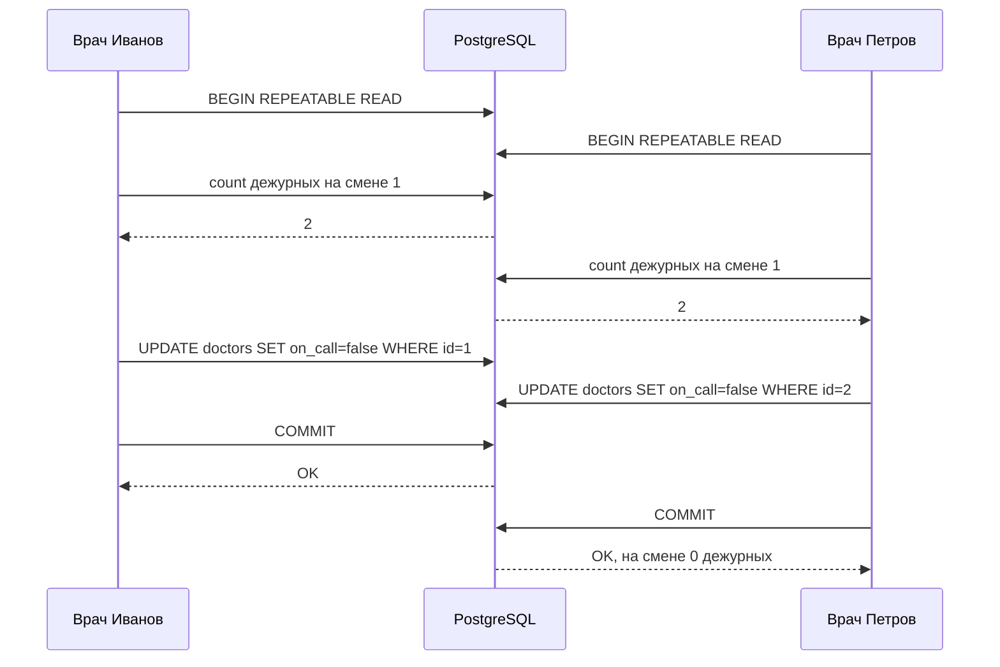

# 2.2 Изоляция транзакций и аномалии

## Зачем это аналитику

«Остаток не может уйти в минус», «слот нельзя забронировать дважды», «на смене должен остаться хотя бы один дежурный» — это инварианты, и их нарушают конкурентные транзакции. Аналитик должен уметь назвать аномалию и указать, каким механизмом она закрывается: уровнем изоляции, блокировкой, ограничением целостности или оптимистичной проверкой.

## Что понять

- [ ] **Аномалии**: dirty read, non-repeatable read, phantom read, lost update, read skew, write skew, serialization anomaly. Каждую — на своём примере из бизнеса.
- [ ] **Уровни изоляции в стандарте SQL и в PostgreSQL** — это разные таблицы:

  | Уровень | Dirty read | Non-repeatable | Phantom | Lost update | Write skew |
  |---|---|---|---|---|---|
  | Read Uncommitted (в PG = Read Committed) | нет | да | да | да | да |
  | Read Committed (по умолчанию) | нет | да | да | да | да |
  | Repeatable Read (Snapshot Isolation) | нет | нет | нет | нет* | да |
  | Serializable (SSI) | нет | нет | нет | нет | нет |

  \* В Repeatable Read конфликтующее обновление падает с ошибкой `could not serialize access due to concurrent update`, а не теряется молча.
- [ ] **Read Committed**: снимок берётся на каждый оператор. Особенность: UPDATE, наткнувшийся на строку, изменённую параллельной транзакцией, ждёт её фиксации и перепроверяет условие WHERE на новой версии (EvalPlanQual). Отсюда неочевидные результаты.
- [ ] **Repeatable Read**: снимок на всю транзакцию. В PostgreSQL это Snapshot Isolation, и фантомов в нём нет, в отличие от стандарта.
- [ ] **Serializable (SSI)**: отслеживание зависимостей чтение-запись; транзакция может упасть с `serialization_failure` (SQLSTATE `40001`). Приложение **обязано** уметь повторять транзакцию. Это требование к разработке, и его должен написать аналитик.
- [ ] **Способы закрыть lost update без повышения уровня**: атомарный UPDATE (`SET qty = qty - 1`), `SELECT ... FOR UPDATE`, оптимистичная блокировка по версии (`WHERE version = :v`), ограничение `CHECK (qty >= 0)`.
- [ ] **Способы закрыть write skew**: Serializable; материализация конфликта (заблокировать общую строку-«родителя»); ограничения уникальности и исключения (`EXCLUDE USING gist` для пересекающихся интервалов бронирования).
- [ ] **Другие СУБД**: в Oracle Serializable на деле Snapshot Isolation; MySQL InnoDB Repeatable Read ведёт себя иначе. Нельзя переносить знания «уровень X гарантирует Y» между СУБД без проверки.

## Урок

<!-- LESSON:START -->
### Изоляция как договор о видимости

Изоляция отвечает на вопрос: что транзакция видит из работы соседей и что происходит, когда две транзакции трогают одни данные. Полная изоляция означала бы, что результат параллельного выполнения совпадает с каким-то последовательным порядком. Это свойство называют сериализуемостью (serializability). Всё, что слабее, — компромисс: база работает быстрее и реже отказывает в обслуживании, но часть расхождений с последовательным исполнением допускает. Эти расхождения и называют аномалиями.

В PostgreSQL изоляция построена на MVCC (см. модуль 2.1): у каждой строки есть версии, а транзакция читает те версии, которые видны в её снимке данных (snapshot). Снимок — это, по сути, список «какие транзакции к моменту его создания уже зафиксированы». Отсюда главное различие уровней в PostgreSQL: как часто берётся снимок и что происходит при конфликте записи.

Для аналитика важна обратная сторона. Требование «остаток не уходит в минус» — это инвариант, и его формулировка ничего не говорит о конкурентности. Задача постановки — назвать, какая аномалия этот инвариант нарушит, и выбрать механизм, который её закроет. Без этого разработчик напишет «прочитать, проверить, записать» и получит ошибку, которая проявится только под нагрузкой.

### Каталог аномалий на бизнес-примерах

Ниже — семь аномалий. Первые три описаны в стандарте SQL, остальные стандарт не называет, хотя на практике они важнее.

| Аномалия | Суть | Пример из бизнеса |
|---|---|---|
| Грязное чтение (dirty read) | Чтение незафиксированных изменений чужой транзакции | Отчёт показал платёжное поручение, которое потом откатили |
| Неповторяющееся чтение (non-repeatable read) | Повторное чтение той же строки даёт другое значение | Расчёт скидки дважды читает цену товара и получает две разные цены |
| Фантом (phantom read) | Повторный запрос по условию возвращает другой набор строк | Выписка по счёту: итог посчитан по 10 операциям, а список выведен из 11 |
| Потерянное обновление (lost update) | Две транзакции читают значение, меняют его в приложении и записывают; одна запись затирает другую | Два кассира одновременно списывают товар, остаток уменьшился один раз |
| Перекос чтения (read skew) | Транзакция видит часть данных до чужого изменения, часть — после | Отчёт по двум счетам во время перевода: деньги «исчезли» или «удвоились» |
| Перекос записи (write skew) | Две транзакции читают одно общее условие, меняют разные строки, и вместе нарушают инвариант | Два дежурных снимают себя со смены, каждый видит, что второй остаётся |
| Аномалия сериализации (serialization anomaly) | Результат не совпадает ни с одним последовательным порядком | Обобщение предыдущих; частный случай — аномалия транзакции только для чтения |

Потерянное обновление и перекос записи похожи: обе начинаются с чтения и принятия решения в приложении. Разница в том, что при потерянном обновлении транзакции пишут в одну и ту же строку, а при перекосе — в разные. Это различие определяет, какие механизмы помогут: конфликт на одной строке база видит сама, конфликт «через условие» — нет.

Отдельно про перекос чтения. Пусть перевод 100 со счёта 1 на счёт 2 фиксируется между двумя операторами отчёта. Первый оператор прочитал счёт 1 до перевода, второй прочитал счёт 2 после. Сумма по двум счетам в отчёте на 100 больше реальной. Ни одна строка не прочитана «грязно», каждое значение было правдой в свой момент, но вместе они описывают состояние, которого никогда не было.

### Стандарт и PostgreSQL — разные таблицы

Стандарт SQL определяет четыре уровня через запрет трёх аномалий: грязного чтения, неповторяющегося чтения и фантомов. Определение исторически опиралось на реализацию через блокировки и страдает неточностью — это подробно разобрали Беренсон и соавторы в статье 1995 года. Из-за этого уровни с одинаковыми названиями в разных СУБД дают разные гарантии.

В PostgreSQL реально три уровня. Read Uncommitted принимается синтаксически, но работает как Read Committed: грязного чтения в PostgreSQL нет вообще, потому что MVCC не показывает незафиксированные версии. Repeatable Read сильнее стандартного: фантомов в нём нет. Serializable реализован как сериализуемая изоляция снимков (Serializable Snapshot Isolation, SSI) и действительно гарантирует сериализуемость для транзакций, работающих на этом уровне.

Уровень по умолчанию — Read Committed. Меняется он в `BEGIN ISOLATION LEVEL ...`, в `SET TRANSACTION` до первого запроса транзакции или параметром `default_transaction_isolation` для сессии, роли или базы.

### Read Committed: снимок на каждый оператор

В Read Committed каждый оператор получает свежий снимок. Внутри одного оператора данные согласованы, между операторами — нет. Отсюда неповторяющееся чтение, фантомы и перекос чтения: второй `SELECT` увидит то, что зафиксировали соседи после первого.

Интереснее поведение пишущих операторов: `UPDATE`, `DELETE`, `SELECT ... FOR UPDATE/SHARE`. Они ищут строки по своему снимку. Если найденная строка уже изменена параллельной незафиксированной транзакцией, оператор ждёт её завершения. Дальше два варианта:

- соседняя транзакция откатилась — оператор работает с исходной версией;
- соседняя транзакция зафиксировалась — оператор берёт новую версию строки и заново проверяет на ней условие `WHERE` (этот механизм во внутреннем коде называется EvalPlanQual). Если условие по-прежнему выполняется, строка обновляется, если нет — пропускается. Если строку удалили, она тоже пропускается.

Этот механизм и закрывает потерянное обновление в атомарной форме: `UPDATE stock SET qty = qty - 1 WHERE sku = 42` после ожидания пересчитает выражение на свежей версии. Но у него есть неочевидное следствие: перепроверяются только строки, которые оператор нашёл по своему снимку. Строки, которые начали подходить под условие из-за параллельной транзакции, в поиск не попадают.

Разберём на примере интернет-магазина. Транзакция A выполняет `UPDATE products SET discount = 10 WHERE category = 'toys'`. Одновременно транзакция B переносит товар 5 из категории `games` в `toys`, а товар 7 — из `toys` в `games`, и фиксируется, пока A ждёт на товаре 7.

- Товар 7: A нашла его по снимку в `toys`, дождалась B, перепроверила условие на новой версии — теперь там `games`, строка пропущена.
- Товар 5: в снимке A он в `games`, поэтому A его вообще не рассматривает.

Итог: скидку не получил ни один из двух товаров. Это не соответствует ни порядку «A, потом B», ни порядку «B, потом A». Для большинства OLTP-операций такое поведение терпимо, но для массовых изменений по условию, которое параллельно меняется, его нужно учитывать.

### Repeatable Read: один снимок на транзакцию

В Repeatable Read снимок берётся один раз — в момент первого оператора транзакции (не в момент `BEGIN`) — и действует до конца. Все чтения видят одно и то же согласованное состояние. Поэтому исчезают неповторяющееся чтение, перекос чтения и фантомы: строки, вставленные после снимка, просто невидимы. Это не отдельная защита от фантомов, а прямое следствие снимка. Стандарт допускает фантомы на этом уровне, потому что описывает блокировочную реализацию, где блокируются только прочитанные строки, а не «пустые места» между ними.

Такая модель называется изоляцией снимков (Snapshot Isolation). Её правило для записи: если транзакция пытается изменить или заблокировать строку, которую после её снимка изменила и зафиксировала другая транзакция, она получает ошибку `could not serialize access due to concurrent update` с кодом SQLSTATE `40001`. Перепроверки, как в Read Committed, нет: перечитать свежую версию значило бы выйти за пределы снимка.

Отсюда два следствия. Потерянное обновление больше не происходит молча — одна из транзакций падает. И приложение, работающее на Repeatable Read, обязано уметь повторить транзакцию целиком, иначе пользователь увидит ошибку там, где раньше «всё работало».

Чего Repeatable Read не ловит — перекос записи. Snapshot Isolation отслеживает только конфликты «запись-запись» на одной строке. Если две транзакции прочитали общее условие и изменили разные строки, конфликта записи нет, и обе фиксируются.

Каждая транзакция по отдельности корректна. Нарушение возникает только из-за того, что решение принималось по данным, которые другая транзакция тем временем сделала неактуальными.

### Serializable: SSI и обязательный повтор

Serializable в PostgreSQL — это те же снимки плюс отслеживание зависимостей между транзакциями. Когда транзакция читает данные, база запоминает это в виде предикатных блокировок (в `pg_locks` они видны как `SIReadLock`). Слово «блокировка» здесь условное: они никого не заставляют ждать, а служат журналом «кто что читал».

Если транзакция T1 прочитала данные, которые потом изменила параллельная T2, между ними возникает зависимость чтение-запись (rw-зависимость): в эквивалентном последовательном порядке T1 должна стоять раньше T2. Теория SSI показывает, что любая аномалия сериализации требует цепочки из двух таких зависимостей подряд между параллельными транзакциями. Встретив опасную конструкцию, PostgreSQL прерывает одну из транзакций с ошибкой `could not serialize access due to read/write dependencies among transactions`, SQLSTATE `40001`.

В примере с дежурными каждая транзакция прочитала строку, которую изменила другая: зависимости направлены в обе стороны, и одна из транзакций падает.

Что важно знать о Serializable:

- Проверка консервативна. Возможны ложные срабатывания: транзакция упадёт, хотя реальной аномалии не было. Точность зависит от гранулярности предикатных блокировок: при чтении через индекс они ставятся на страницы индекса, при последовательном сканировании — на всю таблицу, а при большом числе блокировок они укрупняются. Долгие транзакции и запросы без индексов увеличивают долю отказов.
- Ошибка может прийти на любом операторе, включая `COMMIT`.
- Гарантия действует только между транзакциями, которые сами работают на Serializable. Транзакция на Read Committed, пишущая в те же таблицы, в анализ зависимостей не попадает.
- Данные, прочитанные внутри транзакции, нельзя считать достоверными, пока транзакция не зафиксировалась: её могут прервать как раз потому, что прочитанное несовместимо с соседями.
- Для долгих отчётов есть режим `SERIALIZABLE READ ONLY DEFERRABLE`: транзакция может подождать при старте, пока не получит «безопасный» снимок, зато потом не падает и не создаёт накладных расходов на отслеживание.

Главное требование к разработке, и его пишет аналитик: при использовании Repeatable Read или Serializable приложение перехватывает `40001` (и заодно `40P01` — дедлок, см. модуль 2.3) и повторяет транзакцию целиком: с новым чтением, новым расчётом и новой записью. Повторять только упавший оператор бессмысленно — решение было принято по устаревшим данным. В требованиях стоит зафиксировать число попыток, паузу между ними со случайным разбросом и поведение после исчерпания попыток. Отдельно — побочные эффекты: если внутри транзакции отправлено письмо или вызван внешний API, повтор отправит его ещё раз. Такие действия выносят за пределы транзакции или делают идемпотентными.

### Как закрыть потерянное обновление, не поднимая уровень

Большинство систем работает на Read Committed, и это разумно. Потерянное обновление там закрывается точечно.

**Атомарное изменение.** Вычисление переносится в базу: `UPDATE stock SET qty = qty - :n WHERE sku = :sku`. Благодаря перепроверке на свежей версии второй оператор вычтет из уже уменьшенного значения. Проверку инварианта тоже можно встроить: `... WHERE sku = :sku AND qty >= :n`, и число обновлённых строк 0 означает «не хватило остатка».

**Ограничение целостности.** `CHECK (qty >= 0)` не предотвращает гонку само по себе: если приложение записывает вычисленное у себя абсолютное значение, ограничение пропустит неверный, но неотрицательный результат. Зато в паре с атомарным вычитанием оно гарантирует, что остаток физически не уйдёт в минус, даже если кто-то забудет проверку в коде. Это последняя линия обороны инварианта.

**Пессимистичная блокировка.** `SELECT ... FOR UPDATE` блокирует строку при чтении. Вторая транзакция ждёт уже на чтении и после ожидания получит актуальное значение. Подходит, когда между чтением и записью есть логика в приложении, а конфликты часты. Цена — ожидания, риск дедлоков и необходимость держать транзакцию короткой.

**Оптимистичная блокировка.** В строке хранится версия. Приложение читает значение и версию без блокировки, а записывает с условием `WHERE id = :id AND version = :v`, увеличивая версию. Ноль обновлённых строк означает, что кто-то успел раньше: перечитать и повторить либо вернуть пользователю конфликт. Этот способ работает и тогда, когда между чтением и записью проходят минуты — например, менеджер открыл карточку заказа поставщику, отредактировал и сохранил. Держать открытую транзакцию на это время нельзя, а версия переживает любые паузы.

Выбор между оптимистичным и пессимистичным подходом определяется частотой конфликтов и длительностью «окна» между чтением и записью. Конфликты редки или окно длинное (действия человека, HTTP-запросы) — оптимистичная. Конфликты часты и окно короткое (внутри одной серверной операции) — пессимистичная: она не тратит работу на попытки, которые всё равно откатятся.

### Как закрыть перекос записи

**Serializable.** Самый общий способ: база сама найдёт опасную конструкцию. Подходит, когда инвариантов много и они сложные, а команда готова реализовать повторы. Минус — ложные отказы и накладные расходы.

**Материализация конфликта.** Перекос записи возникает, потому что транзакции не пишут в общую строку. Значит, надо создать такую строку и заставить обе транзакции её блокировать. В примере с дежурными — блокировать все строки смены (`SELECT ... FROM doctors WHERE shift_id = 1 FOR UPDATE`) или одну строку самой смены в таблице смен. Вторая транзакция будет ждать и после ожидания увидит актуальное число дежурных. Если общей строки нет — например, при бронировании свободного слота блокировать нечего, — её заводят специально: строка переговорки, строка дня в календаре склада. Это приём проектирования схемы, и его разумно зафиксировать в постановке.

**Ограничения уникальности и исключения.** Лучший вариант, если инвариант выражается декларативно. «Один активный договор на клиента» — частичный уникальный индекс (`UNIQUE ... WHERE status = 'ACTIVE'`). «Переговорку нельзя забронировать на пересекающиеся интервалы» — ограничение исключения (exclusion constraint): `EXCLUDE USING gist (room WITH =, during WITH &&)` на столбце диапазонного типа `tstzrange`. Для сравнения на равенство обычного целочисленного столбца внутри GiST нужно расширение `btree_gist`. Параллельная вставка пересекающегося интервала будет ждать первую транзакцию и упадёт после её фиксации. Инвариант держит сама база, на любом уровне изоляции и независимо от того, какой сервис пишет в таблицу.

### Разобранный пример: резерв товара в рознице

Инвариант: сумма резервов по товару на складе не превышает физический остаток. Резервы хранятся отдельными строками (`reservations`), остаток — в `stock`. Сервис резервирования считает `остаток − сумма резервов` и вставляет новый резерв, если хватает.

Что нарушает инвариант: два параллельных резерва читают одну и ту же сумму и вставляют по новой строке. Строки разные — это перекос записи с фантомом: каждая транзакция вставила строку, которая изменила бы результат чужого запроса. Read Committed и Repeatable Read его пропустят.

Варианты решения:

1. Serializable с повтором — работает, но при «горячем» товаре в распродажу доля отказов будет высокой.
2. Материализация: каждый резерв сначала выполняет `SELECT ... FROM stock WHERE sku = :sku AND store = :store FOR UPDATE`. Строка остатка — естественный «замок» для товара. Резервы по одному товару выстраиваются в очередь, по разным товарам идут параллельно.
3. Денормализация: хранить в `stock` поле `reserved` и менять его атомарно `UPDATE stock SET reserved = reserved + :n WHERE ... AND qty - reserved >= :n` плюс `CHECK (reserved <= qty)`. Конфликт становится конфликтом на одной строке, и работает перепроверка Read Committed.

В постановке фиксируется выбранный механизм и поведение при отказе: «резерв не создан, пользователь получает сообщение о нехватке» или «повторить до трёх раз».

### Другие СУБД: названия совпадают, гарантии — нет

- **Oracle.** Уровень Serializable на деле — изоляция снимков. Перекос записи на нём возможен, как в Repeatable Read PostgreSQL.
- **MySQL InnoDB.** Уровень по умолчанию — Repeatable Read, но устроен иначе. Обычный `SELECT` читает из снимка, а `UPDATE`, `DELETE` и блокирующие чтения работают с последней зафиксированной версией и ставят блокировки на диапазоны индекса (next-key locks). Конфликт записи не приводит к ошибке, как в PostgreSQL: потерянное обновление при схеме «прочитать в приложении — записать» возможно.
- **SQL Server.** По умолчанию Read Committed на блокировках, где читатели ждут писателей; режимы на версиях строк включаются отдельно.

Вывод для архитектора: фраза «на уровне Repeatable Read это невозможно» имеет смысл только с указанием СУБД. При миграции между СУБД или при использовании ORM, которая абстрагирует базу, гарантии нужно перепроверять.

### Типичные ошибки

- Считать, что транзакция сама по себе защищает от гонок. `BEGIN; SELECT; UPDATE; COMMIT` на Read Committed допускает потерянное обновление.
- Поднять уровень до Repeatable Read или Serializable и не реализовать повтор по `40001`. Ошибки сериализации превращаются в пользовательские сбои под нагрузкой.
- Повторять только упавший оператор, а не всю транзакцию с новым чтением.
- Ожидать, что Repeatable Read защитит от перекоса записи, раз он «строже». В PostgreSQL это Snapshot Isolation, и write skew на нём проходит.
- Надеяться на `CHECK` как на защиту от потерянного обновления при записи абсолютных значений.
- Проверять инвариант «пересечений нет» кодом `SELECT`, а затем `INSERT`, вместо ограничения исключения или уникального индекса.
- Переносить знание об уровнях изоляции из Oracle или MySQL на PostgreSQL и обратно.

### Как говорить об этом на собеседовании

Сильный ответ начинается не с уровней изоляции, а с инварианта: «Здесь риск потерянного обновления на остатке, закрываю атомарным декрементом с условием и `CHECK`. А вот правило про дежурных — это write skew, Repeatable Read его не ловит, поэтому либо Serializable с повтором, либо блокировка строки смены». Такая формулировка показывает, что вы различаете конфликт на одной строке и конфликт через условие и знаете конкретное поведение PostgreSQL.

Хорошо звучат уточнения, которые выдают практику: Read Uncommitted в PostgreSQL равен Read Committed; снимок в Repeatable Read берётся на первом операторе; Serializable требует повтора по SQLSTATE `40001` и это требование к разработке, а не деталь реализации; бронирования без пересечений делаются через `EXCLUDE USING gist`. Упоминание, что в Oracle Serializable — это изоляция снимков, показывает, что вы не переносите гарантии между СУБД вслепую.

### Коротко

- Аномалии — это способы нарушить бизнес-инвариант конкурентными транзакциями; постановка должна называть аномалию и механизм защиты.
- В PostgreSQL три реальных уровня; по умолчанию Read Committed, грязного чтения нет вообще.
- Read Committed: снимок на оператор, пишущие операторы ждут и перепроверяют условие на свежей версии строки.
- Repeatable Read: снимок на транзакцию, фантомов нет, конфликт записи даёт ошибку `40001`, перекос записи проходит.
- Serializable (SSI) ловит и перекос записи, но требует повтора транзакции целиком и допускает ложные отказы.
- Потерянное обновление закрывается атомарным UPDATE, `FOR UPDATE` или версией строки; `CHECK` страхует инвариант.
- Перекос записи закрывается Serializable, материализацией конфликта или ограничениями уникальности и исключения.
- Одинаковые названия уровней в разных СУБД дают разные гарантии.
<!-- LESSON:END -->

## Читать дальше

- Рогов, «PostgreSQL изнутри», часть I: глава об изоляции.
- Документация: [Transaction Isolation](https://www.postgresql.org/docs/current/transaction-iso.html) — короткая и точная.
- Kleppmann, *DDIA* (1-е изд.), гл. 7 «Transactions» — лучшее объяснение аномалий и write skew, с примером про дежурных врачей.
- Berenson et al., *A Critique of ANSI SQL Isolation Levels* (1995) — классическая статья, почему стандарт описывает уровни плохо. По желанию.
- [Jepsen: Consistency Models](https://jepsen.io/consistency) — карта моделей согласованности.

На system-design.space:

- [Аномалии изоляции транзакций: от грязного чтения до перекоса записи](https://system-design.space/chapter/transaction-isolation-anomalies/)
- [Jepsen и модели консистентности](https://system-design.space/chapter/jepsen-consistency/)

## Практика

[Лаба 1: воспроизвести аномалии в двух сессиях](labs/lab-01-isolation.md).

Дополнительно: для трёх бизнес-инвариантов из своего опыта (обезличенно) записать, какая аномалия их нарушает и каким механизмом её закрыть.

## Вопросы для самопроверки

1. Какой уровень изоляции в PostgreSQL по умолчанию и какие аномалии он допускает?
2. Два оператора одновременно списывают товар со склада: читают остаток, вычитают в приложении и записывают. Что пойдёт не так и как исправить, не меняя уровень изоляции? Назовите три способа.
3. Что такое write skew? Приведите пример и объясните, почему Repeatable Read его не ловит.
4. Что должно делать приложение, если использует Serializable?
5. Почему в PostgreSQL на Repeatable Read нет фантомов, хотя стандарт их допускает?
6. Как гарантировать, что переговорку нельзя забронировать на пересекающиеся интервалы?
7. Чем оптимистичная блокировка отличается от пессимистичной? Когда какую выбрать?

## Заметки

<!-- Свои формулировки, ошибки, ссылки. -->
