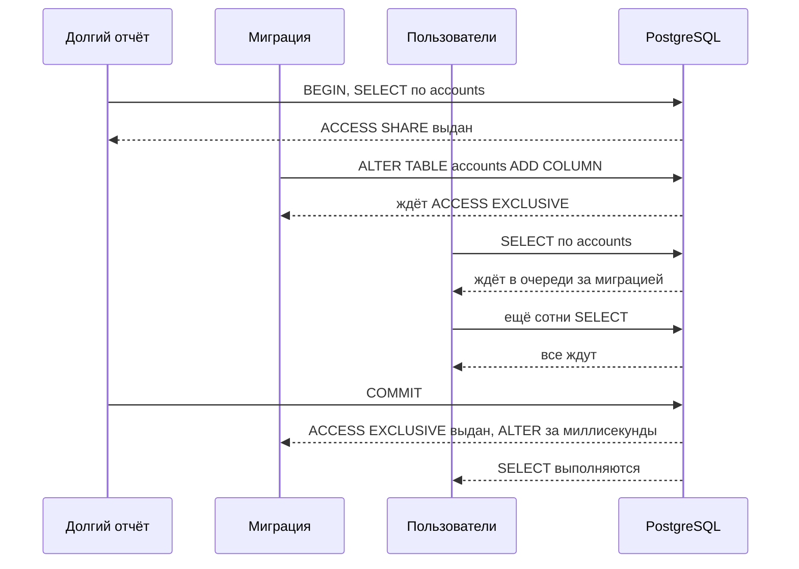

# 2.3 Блокировки: табличные, строчные, advisory, дедлоки, DDL

## Зачем это аналитику

Блокировки — причина половины инцидентов «всё зависло»: миграция повесила таблицу, фоновая задача держит строки, два процесса обновляют записи в разном порядке. Аналитик пишет требования к миграциям, к фоновой обработке и к параллельным процессам, поэтому должен знать, что именно будет заблокировано.

## Что понять

- [ ] **Блокировки отношений (табличные)**: восемь режимов от `ACCESS SHARE` (обычный SELECT) до `ACCESS EXCLUSIVE` (большинство ALTER TABLE, DROP, TRUNCATE, VACUUM FULL). Матрица совместимости — знать, какие режимы с какими конфликтуют.
- [ ] **Какие команды что берут**: SELECT → ACCESS SHARE; INSERT / UPDATE / DELETE → ROW EXCLUSIVE; `CREATE INDEX` → SHARE (блокирует запись); `CREATE INDEX CONCURRENTLY` → SHARE UPDATE EXCLUSIVE (запись не блокирует); большинство `ALTER TABLE` → ACCESS EXCLUSIVE.
- [ ] **Очередь блокировок**: самая коварная ловушка. ALTER TABLE ждёт долгий SELECT, а все новые SELECT встают в очередь **за** ALTER. Итог — таблица недоступна на чтение, хотя сам ALTER выполнился бы за миллисекунду. Защита: `SET lock_timeout = '3s'` перед DDL и повтор.
- [ ] **Строчные блокировки**: `FOR UPDATE`, `FOR NO KEY UPDATE`, `FOR SHARE`, `FOR KEY SHARE`. Хранятся в самой строке (`xmax` + infomask), а не в памяти, поэтому их может быть сколько угодно. Почему внешний ключ берёт `FOR KEY SHARE` на родительскую строку.
- [ ] **`NOWAIT` и `SKIP LOCKED`**: очередь задач на PostgreSQL (`SELECT ... FOR UPDATE SKIP LOCKED LIMIT 10`) — паттерн, который заменяет брокер в простых случаях.
- [ ] **Advisory locks**: блокировки по произвольному числу, на сессию или на транзакцию. Применение: «только один экземпляр сервиса запускает ночной расчёт».
- [ ] **Дедлоки**: как возникают (разный порядок захвата), как PostgreSQL их обнаруживает (`deadlock_timeout`, по умолчанию 1 с) и какую транзакцию убивает. Профилактика: единый порядок обновления (например, по возрастанию id).
- [ ] **Диагностика**: `pg_locks`, `pg_stat_activity.wait_event_type`, `pg_blocking_pids(pid)`, `log_lock_waits`.
- [ ] **Таймауты**: `lock_timeout`, `statement_timeout`, `idle_in_transaction_session_timeout` — что каждый ограничивает и какие значения задавать в требованиях.

## Урок

<!-- LESSON:START -->
### Зачем MVCC-базе блокировки

MVCC снимает главный конфликт: читатели не ждут писателей, писатели не ждут читателей. Но два других конфликта остаются. Два писателя одной строки должны выстроиться в очередь, иначе одно изменение затрёт другое. И изменение структуры таблицы не может идти одновременно с запросами, которые эту структуру используют. Для этого в PostgreSQL есть несколько видов блокировок:

- блокировки отношений (таблиц, индексов, последовательностей) — «тяжёлые» блокировки в общей памяти с очередью ожидания и обнаружением дедлоков;
- блокировки строк — признаки в заголовке версии строки;
- рекомендательные блокировки (advisory locks) — блокировки по числу, смысл которых задаёт приложение;
- служебные блокировки (номера транзакций, страниц, расширения файлов) и лёгкие внутренние блокировки в памяти, о которых аналитику достаточно знать, что они существуют и видны в `wait_event`.

Все «тяжёлые» блокировки живут до конца транзакции. Снять блокировку таблицы или строки раньше `COMMIT` или `ROLLBACK` нельзя. Это важнейший практический вывод: длительность транзакции — это длительность блокировок.

### Блокировки отношений: восемь режимов

Режимы названы исторически и сбивают с толку: `ROW EXCLUSIVE` — это блокировка таблицы, а не строки. Проще запомнить, кто какой режим берёт и с чем он конфликтует.

| Режим | Кто берёт (основное) | Конфликтует с |
|---|---|---|
| ACCESS SHARE | `SELECT` | ACCESS EXCLUSIVE |
| ROW SHARE | `SELECT ... FOR UPDATE / SHARE` | EXCLUSIVE, ACCESS EXCLUSIVE |
| ROW EXCLUSIVE | `INSERT`, `UPDATE`, `DELETE`, `MERGE` | SHARE, SHARE ROW EXCLUSIVE, EXCLUSIVE, ACCESS EXCLUSIVE |
| SHARE UPDATE EXCLUSIVE | `VACUUM`, `ANALYZE`, `CREATE INDEX CONCURRENTLY`, часть `ALTER TABLE` (например, `VALIDATE CONSTRAINT`) | SHARE UPDATE EXCLUSIVE и все режимы сильнее |
| SHARE | `CREATE INDEX` | ROW EXCLUSIVE, SHARE UPDATE EXCLUSIVE, SHARE ROW EXCLUSIVE, EXCLUSIVE, ACCESS EXCLUSIVE |
| SHARE ROW EXCLUSIVE | `CREATE TRIGGER`, `ALTER TABLE ... ADD FOREIGN KEY` | всё, кроме ACCESS SHARE и ROW SHARE |
| EXCLUSIVE | `REFRESH MATERIALIZED VIEW CONCURRENTLY` | всё, кроме ACCESS SHARE |
| ACCESS EXCLUSIVE | `DROP`, `TRUNCATE`, `VACUUM FULL`, `CLUSTER`, большинство `ALTER TABLE`, `LOCK TABLE` без режима | всё, включая обычный `SELECT` |

Как читать таблицу. Обычный `SELECT` конфликтует только с ACCESS EXCLUSIVE, поэтому чтение останавливает лишь «тяжёлый» DDL. Пишущие операторы берут ROW EXCLUSIVE и совместимы друг с другом: конкуренция писателей решается на уровне строк, а не таблицы. `CREATE INDEX` берёт SHARE, который совместим с чтением, но конфликтует с ROW EXCLUSIVE — пока строится индекс, вставки и обновления ждут. SHARE совместим сам с собой, поэтому несколько обычных индексов на одной таблице можно строить одновременно. А SHARE UPDATE EXCLUSIVE конфликтует сам с собой: два `VACUUM` или `CREATE INDEX CONCURRENTLY` на одной таблице одновременно не пойдут.

### CREATE INDEX и CREATE INDEX CONCURRENTLY

Обычный `CREATE INDEX` за один проход читает таблицу и строит индекс под блокировкой SHARE. Чтение идёт, запись стоит. На таблице в сотни гигабайт это минуты или часы простоя записи.

`CREATE INDEX CONCURRENTLY` берёт SHARE UPDATE EXCLUSIVE и не мешает ни чтению, ни записи. Цена:

- индекс строится дольше: таблица читается дважды, а между этапами команда ждёт завершения транзакций, которые могли видеть старое состояние; одна долгая транзакция на сервере затягивает построение;
- команду нельзя выполнить внутри блока транзакции, а значит, и внутри миграции, которую инструмент по умолчанию оборачивает в транзакцию;
- при ошибке (например, нарушении уникальности) остаётся индекс в состоянии INVALID: он не используется для чтения, но обновляется при записи. Его нужно удалить и построить заново — это отдельный шаг в инструкции к миграции.

В требованиях к миграциям на нагруженных таблицах формулировка простая: индексы создаются только с `CONCURRENTLY`, миграция с индексом выполняется вне транзакции, проверка валидности индекса после построения обязательна.

### Очередь блокировок: главная ловушка миграций

Блокировка выдаётся, если она совместима и с уже выданными блокировками, и с запросами, которые ждут в очереди раньше. Второе условие защищает от голодания: иначе поток коротких `SELECT` мог бы бесконечно не пускать `ALTER TABLE`. Но у этой справедливости есть обратная сторона.

Сам `ALTER TABLE ... ADD COLUMN` без значения по умолчанию или с неизменчивым значением в современных версиях меняет только метаданные и выполняется мгновенно. Но он ждёт ACCESS EXCLUSIVE, пока не завершится отчёт. Каждый новый `SELECT` несовместим с ожидающим ACCESS EXCLUSIVE и встаёт за ним. Пул соединений приложения быстро заполняется ожидающими запросами, сервис перестаёт отвечать. Снаружи это выглядит как «миграция на одно поле положила прод на две минуты», хотя виновник — отчёт, открытый две минуты назад.

Защита — ограничить ожидание: `SET lock_timeout = '2s'` (или несколько секунд) перед DDL. Если блокировку не удалось получить за это время, команда падает с ошибкой, очередь рассасывается, и миграцию повторяют позже, с паузой и ограниченным числом попыток. Дополнительно помогают `statement_timeout` на отчётных ролях и `idle_in_transaction_session_timeout`, чтобы никакая сессия не держала ACCESS SHARE бесконечно.

Чек-лист безопасной миграции для нагруженной таблицы:

- `lock_timeout` перед каждым DDL и повтор при таймауте;
- индексы через `CONCURRENTLY`;
- внешние ключи и `CHECK` — в два шага: `ADD CONSTRAINT ... NOT VALID` (короткая блокировка, существующие строки не проверяются), затем `VALIDATE CONSTRAINT` под более слабой блокировкой, не мешающей записи;
- `SET NOT NULL` в новых версиях не сканирует таблицу, если уже есть проверенное ограничение `CHECK (col IS NOT NULL)`; иначе полный проход под ACCESS EXCLUSIVE;
- смена типа столбца, требующая перезаписи таблицы, — через новый столбец, фоновое заполнение и переключение;
- массовое обновление данных — пакетами по несколько тысяч строк в отдельных транзакциях, а не одним `UPDATE` на миллионы строк.

### Блокировки строк

Строчные блокировки не хранятся в общей памяти. Признак блокировки записывается в саму версию строки: в поле `xmax` кладётся номер блокирующей транзакции, а биты в infomask заголовка описывают режим. Если строку блокируют несколько транзакций в совместимых режимах, в `xmax` записывается идентификатор мультитранзакции (MultiXact) — отдельной структуры со списком участников. Поэтому строчных блокировок может быть сколько угодно: заблокировать миллион строк `SELECT ... FOR UPDATE` можно, память от этого не кончится. Обратная сторона — установка блокировки меняет страницу, то есть это запись на диск и в WAL.

Ожидание строчной блокировки устроено косвенно: транзакция, наткнувшаяся на заблокированную строку, ждёт завершения транзакции-владельца (блокировку её номера). Поэтому в `pg_locks` ожидание выглядит как `locktype = transactionid`, а не как блокировка конкретной строки.

Режимов четыре, от сильного к слабому:

| Режим | Кто берёт | Конфликтует с |
|---|---|---|
| FOR UPDATE | `DELETE`; `UPDATE`, меняющий ключевые столбцы; явный `SELECT ... FOR UPDATE` | со всеми четырьмя |
| FOR NO KEY UPDATE | `UPDATE`, не меняющий ключевые столбцы | FOR SHARE, FOR NO KEY UPDATE, FOR UPDATE |
| FOR SHARE | явный `SELECT ... FOR SHARE` | FOR NO KEY UPDATE, FOR UPDATE |
| FOR KEY SHARE | проверка внешнего ключа | только FOR UPDATE |

Ключевые столбцы здесь — столбцы с уникальным индексом, на который может ссылаться внешний ключ. Смысл разделения — во внешних ключах. Когда вставляется строка платёжного поручения со ссылкой на клиента, PostgreSQL блокирует строку клиента в режиме FOR KEY SHARE: пока транзакция не завершилась, клиента нельзя удалить или изменить его ключ, иначе появится «висячая» ссылка. Но обычный `UPDATE` клиента (сменить адрес) берёт FOR NO KEY UPDATE, который с FOR KEY SHARE совместим. В итоге вставки дочерних строк не блокируют рядовые изменения родителя. Раньше, до появления этих режимов, внешний ключ брал FOR SHARE, и на «горячих» родительских строках возникали очереди и дедлоки.

### NOWAIT, SKIP LOCKED и очередь задач

По умолчанию `FOR UPDATE` ждёт, пока строку отпустят. Два модификатора меняют поведение:

- `NOWAIT` — сразу ошибка (SQLSTATE `55P03`, lock_not_available), если строка занята. Подходит для интерактивных сценариев: «эту заявку уже обрабатывает другой оператор».
- `SKIP LOCKED` — занятые строки молча пропускаются. Результат не отражает согласованное состояние таблицы, поэтому для отчётов модификатор не годится. Зато он идеален для очереди задач.

Очередь на PostgreSQL выглядит так. Воркер в транзакции выбирает пачку задач `SELECT id FROM tasks WHERE status = 'NEW' ORDER BY id LIMIT 10 FOR UPDATE SKIP LOCKED`, обрабатывает, помечает выполненными и фиксирует. Параллельные воркеры получают разные задачи и не ждут друг друга. Если воркер упал, транзакция откатится, блокировки снимутся, задачи вернутся в очередь.

Где предел этого паттерна:

- транзакция открыта всё время обработки; если обработка длится минуты, долгие транзакции мешают очистке (см. модуль 2.1) и держат соединения. Для долгих задач лучше короткой транзакцией пометить задачу «взята до такого-то времени» (аренда) и завершать её отдельно;
- если внутри обработки вызван внешний API, откат транзакции не отменит вызов — повтор задачи должен быть идемпотентным;
- высокая частота вставок и удалений создаёт много мёртвых версий, таблицу очереди нужно агрессивно очищать;
- нет встроенного распределения по потребителям, повторной доставки с задержкой, мониторинга отставания — всё это брокер даёт из коробки.

Для десятков-сотен задач в секунду и случаев, где важна атомарность «записать бизнес-данные и поставить задачу в одной транзакции», очередь в PostgreSQL — хороший выбор. Это же основа паттерна Outbox из блока 3.

### Рекомендательные блокировки

Рекомендательная блокировка (advisory lock) берётся по числу типа `bigint` (или паре `int`). База не связывает её ни с какими данными — смысл числа определяет приложение. Блокировка «рекомендательная» потому, что соблюдать её должны сами участники: процесс, который не спросил блокировку, ничем не ограничен.

Варианты функций:

- сессионные: `pg_advisory_lock`, `pg_try_advisory_lock`, `pg_advisory_unlock` — живут до явного снятия или отключения сессии и не снимаются при `COMMIT` и `ROLLBACK`;
- транзакционные: `pg_advisory_xact_lock`, `pg_try_advisory_xact_lock` — снимаются в конце транзакции автоматически, явно снять нельзя;
- у всех есть разделяемые варианты (`..._shared`).

Типовое применение — «только один экземпляр делает ночной расчёт». Сервис запущен в трёх копиях, каждая по расписанию вызывает `pg_try_advisory_lock(<код задачи>)`. Получивший `true` считает прогноз спроса, остальные тихо пропускают запуск. Другой пример у регистратора доменов: обработка продлений по одному клиенту должна идти последовательно, и блокировка берётся по идентификатору клиента на время транзакции.

Подводные камни. Сессионная блокировка при пуле соединений в режиме транзакций (например, PgBouncer в transaction pooling) опасна: следующая транзакция может попасть в другое серверное соединение, а блокировка останется в первом. Там надёжнее транзакционный вариант. И advisory lock защищает только пока жива сессия: если процесс завис, но соединение открыто, блокировка держится. Для распределённых блокировок с арендой и ограждающими токенами есть отдельная тема в блоке распределённых систем.

### Дедлоки

Дедлок (взаимоблокировка) возникает, когда транзакции ждут друг друга по кругу. Классика — встречные переводы: A списывает со счёта 1 и хочет зачислить на счёт 2, B списывает со счёта 2 и хочет зачислить на 1. Каждая держит одну строку и ждёт другую.

Обнаружение устроено лениво. Транзакция, которая ждёт блокировку дольше `deadlock_timeout` (по умолчанию 1 секунда), запускает проверку графа ожиданий. Если найден цикл, одна из транзакций получает ошибку `deadlock detected` (SQLSTATE `40P01`) и откатывается, остальные продолжают. Обычно это та, что выполнила проверку, но документация прямо предупреждает, что на выбор жертвы полагаться нельзя. Проверка не бесплатна, поэтому она и отложена: в нормальной системе большинство ожиданий короче секунды.

Дедлок — ошибка проектирования процесса, а не «сбой базы». Профилактика:

- единый порядок захвата: блокировать строки по возрастанию `id` независимо от направления операции; для перевода — сначала меньший номер счёта;
- блокировать всё нужное заранее одним оператором (`SELECT ... WHERE id IN (...) ORDER BY id FOR UPDATE`);
- короткие транзакции, без ожидания пользователя или внешних систем внутри;
- осторожность с массовыми `UPDATE` без упорядочения: два параллельных пакетных обновления с пересекающимися наборами строк могут обходить их в разном порядке.

Приложение всё равно должно уметь повторить транзакцию по `40P01`, как и по `40001`.

### Диагностика: кто кого держит

Инструменты:

- `pg_locks` — все тяжёлые блокировки: тип (`relation`, `transactionid`, `advisory` и другие), объект, режим, `granted`. Строки с `granted = false` — ожидающие;
- `pg_stat_activity` — сессии; `wait_event_type = 'Lock'` означает ожидание тяжёлой блокировки, `wait_event` уточняет тип; `state = 'idle in transaction'` — сессия с открытой транзакцией, которая ничего не делает, но держит блокировки;
- `pg_blocking_pids(pid)` — массив процессов, которые блокируют данный; самый быстрый способ построить цепочку «кто кого»;
- `log_lock_waits = on` — запись в журнал ожиданий дольше `deadlock_timeout`; незаменимо для разбора инцидентов задним числом.

Алгоритм при «всё зависло»: найти в `pg_stat_activity` ожидающих, через `pg_blocking_pids` дойти до корня цепочки, посмотреть, что это за сессия и сколько длится её транзакция (`xact_start`). Корнем часто оказывается не миграция, а забытая открытая транзакция.

### Таймауты и что писать в требованиях

| Параметр | Что ограничивает | Ориентир для требований |
|---|---|---|
| `lock_timeout` | Ожидание одной блокировки | Для миграций — единицы секунд с повтором; для интерактивных операций — по SLA ответа |
| `statement_timeout` | Время выполнения одного оператора | Для OLTP-ролей — секунды или десятки секунд; для отчётных — отдельно и больше |
| `idle_in_transaction_session_timeout` | Простой сессии внутри открытой транзакции | Минуты; сессия будет завершена |

Параметры задаются на уровне роли или базы (`ALTER ROLE ... SET`), а для конкретной операции — через `SET LOCAL` внутри транзакции. В PostgreSQL 17 появился и `transaction_timeout`, ограничивающий всю транзакцию целиком; на более старых версиях его нет. Конкретные значения — предмет договорённости с эксплуатацией, но сам факт их наличия аналитик вправе требовать: без таймаутов одна зависшая сессия способна остановить весь сервис.

### Типичные ошибки

- Выполнять DDL на проде без `lock_timeout`, полагаясь на то, что «операция мгновенная».
- Строить индекс на нагруженной таблице обычным `CREATE INDEX` или забывать, что `CONCURRENTLY` после сбоя оставляет невалидный индекс.
- Держать транзакцию открытой во время вызова внешнего API или ожидания действия пользователя.
- Обновлять связанные строки в порядке, зависящем от бизнес-направления операции, и получать дедлоки на встречных операциях.
- Использовать сессионные advisory locks за пулером в режиме транзакций.
- Строить очередь на `FOR UPDATE` без `SKIP LOCKED`, из-за чего воркеры выстраиваются друг за другом.
- Искать виновника зависания среди ожидающих, а не в корне цепочки блокировок.

### Как говорить об этом на собеседовании

Сильный ответ связывает блокировки с процессом и требованиями. Вместо «PostgreSQL всё заблокировал» — «ALTER встал в очередь за долгим отчётом, а за ним встали все SELECT; в требованиях к миграциям у нас `lock_timeout` с повтором, индексы только `CONCURRENTLY`, ограничения через `NOT VALID` и `VALIDATE`». Про дедлок — «это следствие разного порядка захвата, лечится единым порядком по id и повтором по `40P01`».

Уровень senior показывают детали механизма: строчные блокировки хранятся в версии строки, а не в памяти; внешний ключ берёт FOR KEY SHARE и не мешает обычным обновлениям родителя; `SKIP LOCKED` даёт конкурентную очередь, но у неё есть предел по длительности обработки и идемпотентности. И умение назвать инструменты диагностики: `pg_blocking_pids`, `pg_stat_activity.wait_event_type`, `log_lock_waits`.

### Коротко

- Все тяжёлые блокировки держатся до конца транзакции; длинная транзакция — длинные блокировки.
- `SELECT` конфликтует только с ACCESS EXCLUSIVE, который берут большинство `ALTER TABLE`, `DROP`, `TRUNCATE`, `VACUUM FULL`.
- Очередь блокировок превращает мгновенный DDL в простой; защита — `lock_timeout` и повтор.
- `CREATE INDEX` блокирует запись, `CONCURRENTLY` — нет, но дольше, вне транзакции и с риском невалидного индекса.
- Строчные блокировки хранятся в `xmax` строки, их число не ограничено памятью; четыре режима нужны ради внешних ключей.
- `SKIP LOCKED` — основа очереди задач на PostgreSQL, `NOWAIT` — быстрый отказ.
- Advisory locks — взаимное исключение по договорённости между процессами приложения.
- Дедлоки предотвращаются единым порядком захвата; диагностика — `pg_locks`, `pg_blocking_pids`, `log_lock_waits`.
<!-- LESSON:END -->

## Читать дальше

- Рогов, «PostgreSQL изнутри», часть III «Блокировки»: блокировки отношений, строк, прочих объектов, блокировки в памяти.
- Документация: [Explicit Locking](https://www.postgresql.org/docs/current/explicit-locking.html) — матрица совместимости и список команд.
- Статьи о безопасных миграциях без простоя: GoCardless «Zero-downtime Postgres migrations — the hard parts», документация утилиты [squawk](https://squawkhq.com) (линтер миграций — полезен как чек-лист того, что опасно).

На system-design.space:

- [Распределённые блокировки: аренды и ограждающие токены](https://system-design.space/chapter/distributed-locks-leases-fencing/)
- [PostgreSQL: история и архитектура](https://system-design.space/chapter/postgres-overview/)

## Практика

[Лаба 2: дедлок, SKIP LOCKED и очередь блокировок при DDL](labs/lab-02-locks.md).

Дополнительно: составить для себя чек-лист «требования к миграции БД» — `lock_timeout`, индексы `CONCURRENTLY`, добавление NOT NULL и внешних ключей через `NOT VALID` + `VALIDATE`, пакетное обновление данных.

## Вопросы для самопроверки

1. Какую блокировку берёт обычный SELECT и с чем она конфликтует?
2. Миграция добавляет столбец. Сама операция мгновенная, но прод лёг на две минуты. Что произошло и как этого избежать?
3. Чем `CREATE INDEX` отличается от `CREATE INDEX CONCURRENTLY` с точки зрения блокировок? Какая цена у второго?
4. Как построить очередь задач на PostgreSQL, чтобы несколько воркеров не брали одну задачу?
5. Как возникает дедлок и как спроектировать процесс, чтобы его не было?
6. Зачем нужны advisory locks? Приведите пример.
7. Как найти, кто кого блокирует прямо сейчас?

## Заметки

<!-- Свои формулировки, ошибки, ссылки. -->
