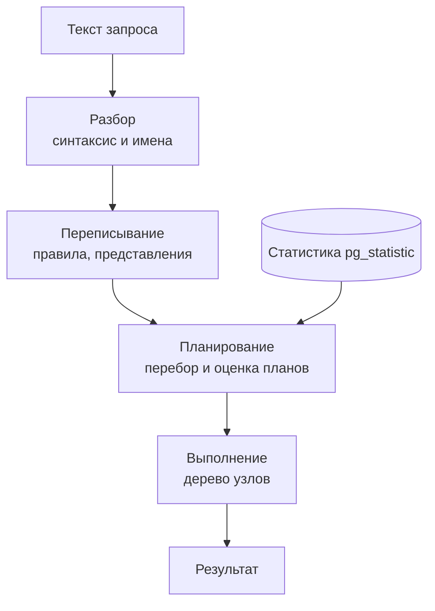

# 2.4 Планировщик: статистика, методы доступа, соединения, EXPLAIN

## Зачем это аналитику

«Отчёт строится 40 минут» разбирается по плану выполнения, а не по догадкам. Аналитик, который читает `EXPLAIN`, может сам локализовать проблему, сформулировать задачу разработке предметно («оценка кардинальности занижена в 1000 раз на фильтре по статусу») и заранее заложить в требования объёмы, распределения и индексы.

## Что понять

- [ ] **Этапы выполнения запроса**: разбор → переписывание (правила, представления) → планирование → выполнение.
- [ ] **Стоимостная модель**: планировщик выбирает план с минимальной оценочной стоимостью. Параметры `seq_page_cost`, `random_page_cost`, `cpu_tuple_cost`, `effective_cache_size`. Стоимость — условные единицы, а не миллисекунды.
- [ ] **Статистика** (`ANALYZE`, представление `pg_stats`): `n_distinct`, `null_frac`, most common values (MCV) и их частоты, гистограмма, `correlation`. Именно отсюда берутся оценки числа строк.
- [ ] **Оценка кардинальности** — корень большинства плохих планов. Типовые причины ошибок: устаревшая статистика; коррелированные столбцы (планировщик по умолчанию считает условия независимыми); функции и выражения в WHERE; параметры в подготовленных запросах (generic и custom plans).
- [ ] **Расширенная статистика** (`CREATE STATISTICS ... (dependencies, ndistinct, mcv)`) для коррелированных столбцов.
- [ ] **Методы доступа**: Seq Scan, Index Scan, Index Only Scan (и роль visibility map), Bitmap Index Scan + Bitmap Heap Scan. Почему при низкой селективности последовательное чтение выгоднее индекса.
- [ ] **Соединения**:
  - Nested Loop — мало строк во внешнем наборе и индекс на внутреннем;
  - Hash Join — большие наборы, условие равенства, хеш-таблица в `work_mem`;
  - Merge Join — оба входа отсортированы.
  Когда каждый выигрывает и как ошибка в оценке кардинальности приводит к Nested Loop на миллионе строк.
- [ ] **Сортировка и агрегация**: `work_mem`, сортировка на диске (`external merge`), HashAggregate против GroupAggregate.
- [ ] **Параллельное выполнение**: Gather, parallel workers, когда включается.
- [ ] **Чтение `EXPLAIN (ANALYZE, BUFFERS)`**: снизу вверх и изнутри наружу; `rows` оценочные против `actual rows`; `loops` (actual time и rows указаны на одну итерацию!); `Buffers: shared hit / read`; `Rows Removed by Filter`.
- [ ] **JIT, CTE и подзапросы**: когда CTE материализуется (PostgreSQL 12+ по умолчанию встраивает, если на него ссылаются один раз), когда подзапрос превращается в соединение.

## Урок

<!-- LESSON:START -->
### Путь запроса

SQL декларативен: запрос описывает результат, а не способ его получить. Способ выбирает планировщик (planner, optimizer), и для одного запроса с пятью таблицами вариантов — тысячи: порядок соединений, метод каждого соединения, доступ к каждой таблице. Хороший или плохой план отличаются не на проценты, а на порядки.



- **Разбор** (parse) проверяет синтаксис и превращает текст в дерево, затем анализ связывает имена с объектами каталога и проверяет типы.
- **Переписывание** (rewrite) применяет правила; главное для практики — представления здесь раскрываются в свои запросы. Поэтому «медленное представление» не отдельная сущность: планировщик видит итоговый запрос целиком.
- **Планирование** — перебор вариантов и оценка стоимости каждого. Порядок соединений перебирается полностью только до определённого числа таблиц; для очень больших запросов включается генетический алгоритм (GEQO), и план становится менее предсказуемым.
- **Выполнение** — дерево узлов, где каждый узел запрашивает строки у дочерних по одной (или пачками) и отдаёт родителю.

### Стоимостная модель

Планировщик выбирает план с минимальной оценочной стоимостью. Стоимость — условные единицы, привязанные к цене последовательного чтения одной страницы. Её нельзя переводить в миллисекунды и нельзя сравнивать между разными запросами; она нужна только для выбора между планами одного запроса.

Основные параметры:

- `seq_page_cost` (по умолчанию 1) — чтение страницы подряд;
- `random_page_cost` (по умолчанию 4) — чтение страницы вразброс; значение рассчитано на вращающиеся диски с учётом кеша, на SSD его часто снижают, и индексный доступ становится привлекательнее;
- `cpu_tuple_cost`, `cpu_index_tuple_cost`, `cpu_operator_cost` — обработка строки, индексной записи, вычисление оператора; на порядки меньше стоимости страницы;
- `effective_cache_size` — подсказка, сколько данных, скорее всего, окажется в кешах (своём и операционной системы). Память она не выделяет, но влияет на оценку повторных чтений при индексном доступе.

Для последовательного сканирования формула прозрачна: число страниц таблицы × `seq_page_cost` плюс число строк × (`cpu_tuple_cost` + стоимость проверки условий). Для индексного — сложнее: учитывается число индексных страниц, число строк, которые надо достать из таблицы, и насколько вразброс они лежат.

Модель верна ровно настолько, насколько верна оценка числа строк. Если планировщик думает, что условие вернёт 10 строк, а их миллион, никакая настройка стоимостей не спасёт.

### Статистика

`ANALYZE` (вручную или через autovacuum) читает случайную выборку строк — её размер пропорционален `default_statistics_target`, по умолчанию 100, что даёт выборку в десятки тысяч строк — и сохраняет по каждому столбцу сводку. Смотреть её удобно в представлении `pg_stats`:

| Поле | Что означает | Для чего используется |
|---|---|---|
| `null_frac` | Доля NULL | Условия `IS NULL`, поправка остальных оценок |
| `n_distinct` | Число различных значений; отрицательное — доля от числа строк | Равенство для значений вне MCV, группировки |
| `most_common_vals`, `most_common_freqs` | Самые частые значения (MCV) и их частоты | Равенство на частые значения |
| `histogram_bounds` | Границы корзин равного наполнения для остальных значений | Диапазоны `<`, `>`, `BETWEEN` |
| `correlation` | Связь физического порядка строк с порядком значений, от −1 до 1 | Стоимость индексного сканирования |

Разберём вопрос «откуда планировщик знает, сколько строк вернёт `WHERE status = 'NEW'`». Число строк таблицы берётся из `pg_class.reltuples` с поправкой на текущий размер таблицы в страницах. Если `NEW` есть в `most_common_vals`, селективность — его частота из `most_common_freqs`. Если нет, оставшаяся после MCV и NULL доля делится поровну между оставшимися различными значениями. Оценка строк — селективность × число строк. Для диапазона по дате планировщик находит, какую долю корзин гистограммы покрывает интервал.

Точность регулируется: для важного столбца с неравномерным распределением можно поднять детальность `ALTER TABLE ... ALTER COLUMN ... SET STATISTICS <n>` — больше MCV, мельче гистограмма, дольше `ANALYZE`.

`correlation` близка к 1, если строки лежат на диске в порядке значений (например, `created_at` в журнале, куда только добавляют). Тогда индексный диапазон читает соседние страницы, и доступ почти последовательный. При корреляции около нуля каждая строка — отдельная случайная страница.

### Откуда берутся ошибки оценки

Оценка кардинальности — корень большинства плохих планов. Типовые причины:

**Устаревшая статистика.** После массовой загрузки autovacuum соберёт статистику не сразу. До этого новое значение, которого не было в выборке, оценивается как редкое. Требование к ETL: после загрузки явно выполнять `ANALYZE` затронутых таблиц.

**Коррелированные столбцы.** По умолчанию планировщик считает условия независимыми и перемножает селективности. Город и регион зависимы: если Казань — 5% заказов, а Татарстан — 15%, то реальная доля `city = 'Казань' AND region = 'Татарстан'` равна 5%, а оценка — 0,75%. Ошибка в разы на одной таблице, а в соединениях она множится.

**Функции и выражения.** Для `lower(email) = '...'` или `date(created_at) = '...'` у планировщика нет статистики по выражению, и он подставляет фиксированную селективность по умолчанию, не связанную с данными. Индекс по выражению решает обе проблемы: ANALYZE собирает статистику по индексированному выражению, а сам индекс можно использовать.

**Параметры подготовленных запросов.** Подготовленный оператор (prepared statement) — а их активно используют драйверы и ORM — первые пять выполнений планируется с конкретными значениями (custom plan). Затем PostgreSQL строит общий план (generic plan) без учёта значений и переходит на него, если его оценочная стоимость не сильно хуже средней по пользовательским. Для перекошенных данных это ловушка: общий план хорош для типичного клиента с десятком заказов и ужасен для крупного оптового клиента с сотней тысяч. Симптом — «запрос из psql быстрый, а из приложения медленный». Управляется параметром `plan_cache_mode`.

### Расширенная статистика

Для зависимых столбцов одной таблицы есть `CREATE STATISTICS`:

- `dependencies` — функциональные зависимости («город определяет регион»); исправляет перемножение селективностей в условиях равенства;
- `ndistinct` — число различных комбинаций; исправляет оценку `GROUP BY city, region`;
- `mcv` — список частых комбинаций значений; самый точный вид для конкретных пар.

После создания нужен `ANALYZE`. Ограничения: статистика работает в пределах одной таблицы и не помогает оценке соединений; в новых версиях её можно строить и по выражениям. Это инструмент точечный: создавать его стоит, когда в плане видна ошибка оценки на конкретной комбинации условий.

### Методы доступа к таблице

**Seq Scan** — чтение всех страниц подряд с фильтрацией. Дёшев на страницу, выгоден, когда нужна заметная доля таблицы. Для больших таблиц операционная система и PostgreSQL используют упреждающее чтение, и последовательный проход идёт на скорости диска.

**Index Scan** — проход по индексу и чтение строки из таблицы для каждой найденной записи. Каждое такое чтение потенциально случайное. При 1% строк выгоден, при 30–50% почти всегда проигрывает последовательному чтению: страницы таблицы читаются многократно и вразброс. Даёт строки в порядке индекса, что позволяет обойтись без сортировки для `ORDER BY ... LIMIT`.

**Index Only Scan** — все нужные столбцы есть в индексе (в ключе или в `INCLUDE`), к таблице обращаться не надо. Но индекс не хранит информацию о видимости версий. Поэтому для каждой записи проверяется карта видимости (visibility map): если страница таблицы помечена как «все версии видимы всем», обращения к таблице нет. Иначе — чтение таблицы, и в плане растёт `Heap Fetches`. Карту видимости обновляет `VACUUM`, поэтому на активно изменяемых таблицах Index Only Scan деградирует до обычного, если очистка отстаёт.

**Bitmap Index Scan + Bitmap Heap Scan** — компромисс для средней селективности. Сначала по индексу строится битовая карта нужных страниц (или строк), затем страницы таблицы читаются в физическом порядке, каждая один раз. Карты от нескольких индексов можно объединять (`BitmapAnd`, `BitmapOr`) — так работают условия по разным столбцам с отдельными индексами. Если карта не помещается в `work_mem`, она становится «неточной» (lossy) — хранит только страницы, и строки на них перепроверяются условием `Recheck Cond`: в плане это `Heap Blocks: lossy` и `Rows Removed by Index Recheck` (сама строка `Recheck Cond` выводится у Bitmap Heap Scan всегда).

Почему при индексе всё же Seq Scan — типичные причины: условие выбирает большую долю строк; статистика устарела или врёт; над столбцом функция или неявное приведение типа; таблица маленькая и помещается в несколько страниц; шаблон `LIKE '%...'` с ведущим `%` для B-дерева бесполезен (нужен триграммный GIN); планировщик переоценивает стоимость случайного чтения для SSD.

### Методы соединения

| Метод | Как работает | Когда выигрывает | Слабое место |
|---|---|---|---|
| Nested Loop | Для каждой строки внешнего набора ищет пары во внутреннем | Внешний набор мал, на внутреннем есть индекс по условию соединения; любые условия, не только равенство | Катастрофа при большом внешнем наборе |
| Hash Join | Строит хеш-таблицу по меньшему набору, затем проходит больший | Большие наборы, условие равенства | Память: если хеш не помещается, работа разбивается на пакеты (Batches) с диском |
| Merge Join | Сливает два набора, отсортированных по ключу | Оба входа уже упорядочены (индексы, предыдущая сортировка), очень большие наборы | Сортировка, если порядок не дан бесплатно |

Nested Loop — единственный метод, который выдаёт первую строку почти сразу и отлично работает с `LIMIT`. Hash Join требует сначала прочитать весь внутренний набор. Размер хеш-таблицы ограничен `work_mem`, умноженным на `hash_mem_multiplier`.

Главная связь с оценками. Если планировщик считает, что внешний набор даст 10 строк, Nested Loop с 10 индексными поисками выглядит идеально. Если фактически строк миллион, это миллион случайных поисков во внутренней таблице — часы вместо секунд. Именно так ошибка кардинальности в нижнем узле плана превращается в катастрофу в верхнем. Лечить надо причину — оценку, а не запрещать методы соединения через `enable_nestloop = off`: такой запрет уместен для эксперимента, а не для прода.

### Сортировка, агрегация, параллельность

Сортировка укладывается в `work_mem` — тогда в плане `Sort Method: quicksort Memory`. Иначе данные уходят во временные файлы: `external merge Disk`. С `LIMIT` бывает `top-N heapsort`, которому достаточно памяти на N строк. Важно, что `work_mem` выделяется на каждый узел сортировки или хеширования каждого процесса, поэтому поднимать его глобально опасно; для тяжёлых отчётов его повышают на уровне роли или сессии.

Группировка выполняется двумя способами. HashAggregate строит хеш-таблицу по группам и не требует сортировки — хорош при умеренном числе групп. GroupAggregate работает на отсортированном входе — выгоден, если порядок уже есть (индекс) или групп очень много. Начиная с PostgreSQL 13 HashAggregate при нехватке памяти умеет сбрасывать данные на диск.

Параллельное выполнение: узел `Gather` (или `Gather Merge`, сохраняющий порядок) собирает строки от фоновых рабочих процессов, которые параллельно сканируют таблицу, соединяют и частично агрегируют. Включается для достаточно больших таблиц и запросов на чтение; число процессов ограничено `max_parallel_workers_per_gather` и общими лимитами. В плане видно `Workers Planned` и `Workers Launched` — если запущено меньше, свободных процессов не хватило. Функции, помеченные небезопасными для параллельности, и ряд конструкций параллельность отключают.

### Чтение EXPLAIN (ANALYZE, BUFFERS)

`EXPLAIN` показывает план и оценки. `EXPLAIN ANALYZE` выполняет запрос и добавляет фактические цифры — для `UPDATE` и `DELETE` его запускают внутри транзакции с откатом. `BUFFERS` добавляет количество страниц.

Разберём схематичный фрагмент отчёта по продажам розничной сети:

```
Hash Join  (cost=... rows=120 ...) (actual time=5.1..9800.4 rows=2400000 loops=1)
  Hash Cond: (s.store_id = st.id)
  ->  Nested Loop  (cost=... rows=120 ...) (actual time=0.3..9100.2 rows=2400000 loops=1)
        ->  Seq Scan on promo p  (... rows=3 ...) (actual ... rows=60000 loops=1)
              Filter: ((kind = 'discount') AND (channel = 'offline'))
              Rows Removed by Filter: 40000
        ->  Index Scan using sales_promo_idx on sales s  (... rows=40 ...) (actual time=0.02..0.14 rows=40 loops=60000)
              Buffers: shared hit=180000 read=95000
  ->  Hash  (...)
        ->  Seq Scan on stores st ...
```

Правила чтения:

- **Снизу вверх и изнутри наружу.** Выполнение начинается с самых вложенных узлов. Здесь сначала читается `promo`, затем для каждой строки ищутся продажи.
- **Сравнивать `rows` оценочные и `actual rows`.** На `promo` ожидалось 3 строки, получено 60 000 — ошибка в 20 000 раз. Два условия на связанных столбцах (вид акции и канал), перемноженные как независимые, — кандидат для расширенной статистики.
- **`loops` умножает всё.** У индексного сканирования `actual time` и `rows` указаны на одну итерацию. 40 строк × 60 000 итераций = 2,4 млн строк; 0,14 мс × 60 000 ≈ 8,4 секунды. Не умножив на `loops`, легко решить, что узел дешёвый.
- **`Buffers`** — `shared hit` найдено в кеше PostgreSQL, `read` прочитано с диска или из кеша ОС. 95 000 чтений вразброс — вот где время. Для узлов с несколькими итерациями буферы суммарные.
- **`Rows Removed by Filter`** показывает, сколько работы выброшено. Большое значение при малом результате — признак, что не хватает индекса или условие применяется слишком поздно.

Диагноз для задачи разработке формулируется предметно: «на фильтре по `promo` оценка занижена в 20 000 раз из-за зависимости `kind` и `channel`; из-за этого выбран Nested Loop на 60 тысяч итераций; предлагается `CREATE STATISTICS` по этим столбцам и проверка плана после `ANALYZE`».

### JIT, CTE и подзапросы

**JIT-компиляция** (своевременная компиляция выражений) включается, когда оценочная стоимость запроса выше порога. Для аналитических запросов с тяжёлыми выражениями она ускоряет выполнение, а для коротких запросов с переоценённой стоимостью может добавить заметное время на компиляцию. В плане это видно в разделе `JIT` с временем по этапам. Если OLTP-запрос неожиданно тратит десятки миллисекунд на JIT — это повод посмотреть на оценки или пороги.

**CTE (WITH).** До PostgreSQL 12 каждое CTE было барьером оптимизации: вычислялось отдельно и целиком, условия внешнего запроса внутрь не проникали. Начиная с 12-й версии нерекурсивное CTE без побочных эффектов, на которое ссылаются один раз, встраивается в основной запрос. Поведение можно задать явно: `WITH x AS MATERIALIZED (...)` или `NOT MATERIALIZED`. Материализация полезна, когда нужно вычислить дорогое выражение один раз или намеренно зафиксировать порядок работы.

**Подзапросы.** `IN (подзапрос)` и `EXISTS` планировщик обычно превращает в полусоединение (semi join), `NOT EXISTS` — в антисоединение (anti join), и дальше для них выбирается любой метод соединения. `NOT IN` с подзапросом так не преобразуется из-за семантики NULL: если в подзапросе встретится NULL, результат будет пустым, а план — подзапросом на каждую строку или хешированным подзапросом. Поэтому `NOT EXISTS` предпочтительнее и по смыслу, и по производительности. Коррелированный скалярный подзапрос в списке `SELECT` выполняется на каждую строку внешнего запроса (`SubPlan` с большим `loops`).

### Типичные ошибки

- Сравнивать `cost` разных запросов или переводить его в миллисекунды.
- Читать `actual time` и `rows` у узла с `loops > 1` без умножения на число итераций.
- Лечить плохой план запретом метода (`enable_nestloop = off`) или хинтами, не разобравшись, почему ошиблась оценка.
- Не требовать `ANALYZE` после массовой загрузки или миграции данных.
- Писать условия с функцией над столбцом (`date(created_at) = ...`, `lower(email) = ...`) и ожидать работы обычного индекса.
- Проверять производительность на стенде с сотней строк: на малых данных план другой, и проблема не проявится.
- Ставить индекс на столбец с низкой селективностью (статус, где 95% — одно значение) вместо частичного индекса на редкое значение.

### Как говорить об этом на собеседовании

Сильный ответ описывает цепочку причин, а не симптом: «Отчёт тормозил не из-за отсутствия индекса. Оценка на фильтре была занижена на четыре порядка из-за коррелированных столбцов, планировщик выбрал Nested Loop, и индекс внутренней таблицы дёргался десятки тысяч раз. Добавили расширенную статистику — план сменился на Hash Join». Такая история показывает, что вы читаете план по `rows` против `actual rows`, учитываете `loops` и `Buffers` и понимаете, что источник плохих планов — оценки.

Уровень senior также видно по тому, что вы переносите знание в требования: объёмы и распределения данных в нефункциональных требованиях, `ANALYZE` после загрузок, условия диапазоном по «голому» столбцу, частичные и составные индексы под конкретные запросы, стенд с реалистичным объёмом данных для проверки планов, внимание к общим планам подготовленных запросов на перекошенных данных.

### Коротко

- Планировщик выбирает план с минимальной оценочной стоимостью; стоимость — условные единицы, пригодные только для сравнения планов одного запроса.
- Оценки строк берутся из статистики `ANALYZE`: MCV и частоты, гистограмма, `n_distinct`, `null_frac`, `correlation`.
- Ошибка кардинальности — главная причина плохих планов: устаревшая статистика, коррелированные столбцы, функции в условиях, общие планы.
- Расширенная статистика `CREATE STATISTICS` исправляет оценки для зависимых столбцов одной таблицы.
- Seq Scan выгоднее индекса при низкой селективности; Index Only Scan зависит от карты видимости и `VACUUM`; Bitmap — для средней селективности.
- Nested Loop — для малого внешнего набора, Hash Join — для больших наборов с равенством, Merge Join — для упорядоченных входов.
- План читается снизу вверх; ключевые места — `rows` против `actual rows`, умножение на `loops`, `Buffers`, `Rows Removed by Filter`.
- С PostgreSQL 12 однократно используемое CTE встраивается; `NOT EXISTS` лучше `NOT IN`.
<!-- LESSON:END -->

## Читать дальше

- Рогов, «PostgreSQL изнутри», часть IV «Выполнение запросов»: этапы выполнения, статистика, табличные методы доступа, индексный доступ, вложенный цикл, хеширование, сортировка и слияние.
- Видеокурс Postgres Professional [QPT «Оптимизация запросов»](https://postgrespro.ru/education/courses/QPT).
- Документация: [Using EXPLAIN](https://www.postgresql.org/docs/current/using-explain.html), [Statistics Used by the Planner](https://www.postgresql.org/docs/current/planner-stats.html).
- Инструменты визуализации планов: [explain.tensor.ru](https://explain.tensor.ru) (на русском, с подсказками), [explain.depesz.com](https://explain.depesz.com). Вставлять только планы со своего стенда.

На system-design.space:

- [PostgreSQL: история и архитектура](https://system-design.space/chapter/postgres-overview/)
- [Database Internals (краткое содержание)](https://system-design.space/chapter/database-internals-book/)

## Практика

[Лаба 3: планировщик и индексы](labs/lab-03-planner.md).

Дополнительно: взять пять планов со своего стенда и для каждого записать в «Заметки» одну фразу — где узкое место и почему.

## Вопросы для самопроверки

1. Откуда планировщик знает, сколько строк вернёт условие `WHERE status = 'NEW'`?
2. На столбце есть индекс, но в плане Seq Scan. Назовите четыре возможные причины.
3. В плане `rows=10`, а `actual rows=1 000 000`, и выбран Nested Loop. Почему это плохо и что делать?
4. Чем Index Scan отличается от Index Only Scan и от Bitmap Heap Scan?
5. Когда Hash Join выгоднее Nested Loop и наоборот?
6. Как читать `actual time` и `rows` у узла с `loops=1000`?
7. Что такое коррелированные столбцы и почему они ломают оценку? Как это исправить?
8. Почему `WHERE lower(email) = ...` не использует обычный индекс по `email`?

## Заметки

<!-- Свои формулировки, ошибки, ссылки. -->
