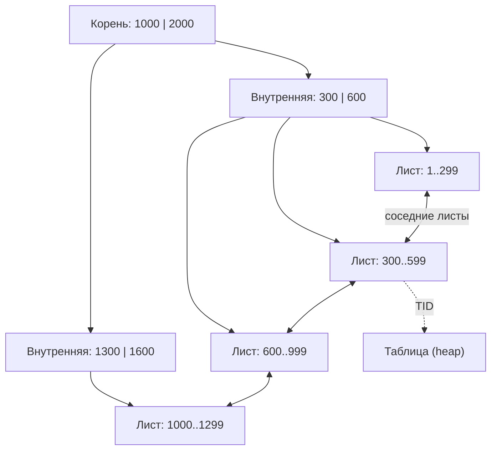
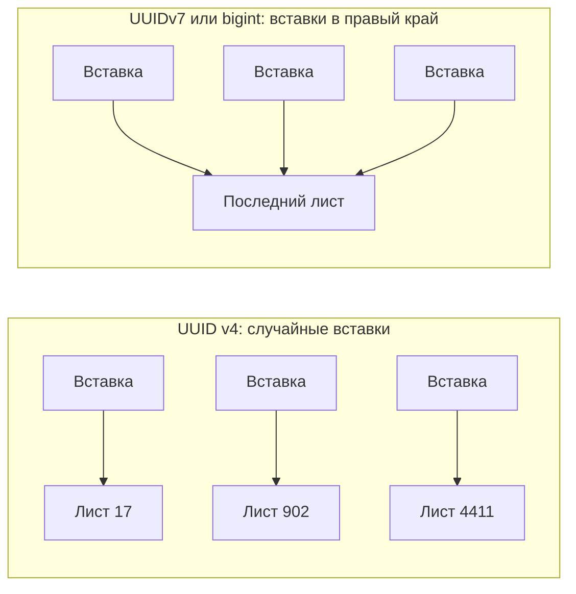

# 2.5 Индексы в глубину

## Зачем это аналитику

Аналитик знает, какие запросы будут у системы (поиск, фильтры, сортировки, отчёты), раньше, чем они написаны. Если заложить индексную стратегию в требования, её не придётся придумывать после инцидента. Кроме того, индексы стоят денег: каждый замедляет запись и занимает место.

## Что понять

- [ ] **B-tree**: структура, почему он даёт и поиск по равенству, и по диапазону, и сортировку. Сложность O(log n).
- [ ] **Составной индекс**: порядок столбцов решает всё. Индекс `(a, b)` помогает для `a = ?` и `a = ? AND b > ?`, но не для `b = ?` (в PostgreSQL 18 появился skip scan, но рассчитывать на него как на замену правильного порядка не стоит). Правило: сначала равенства, потом диапазон и сортировка.
- [ ] **Покрывающий индекс** (`INCLUDE`) и Index Only Scan.
- [ ] **Частичный индекс** (`WHERE status = 'ACTIVE'`) — маленький, быстрый, для «горячего» подмножества.
- [ ] **Индекс по выражению** (`lower(email)`, `(data->>'type')`).
- [ ] **Уникальный индекс** как механизм целостности, а не только производительности. Уникальность по части строк через частичный уникальный индекс.
- [ ] **Другие типы**:
  - Hash — только равенство;
  - GIN — массивы, `jsonb`, полнотекстовый поиск, триграммы (`pg_trgm` для `LIKE '%abc%'`);
  - GiST — геометрия, диапазоны, ограничения исключения;
  - SP-GiST — неравномерные структуры (IP-адреса, префиксы);
  - BRIN — огромные таблицы с естественной упорядоченностью (журналы по времени), крошечный размер.
- [ ] **Цена индекса**: замедление INSERT / UPDATE, потеря HOT-обновлений при изменении индексированного столбца, место на диске, bloat.
- [ ] **Поиск неиспользуемых и дублирующих индексов**: `pg_stat_user_indexes.idx_scan`.
- [ ] **Ключи**: суррогатные и естественные; UUID v4 против UUIDv7 / bigint — как случайные ключи бьют по локальности B-tree и WAL.

## Урок

<!-- LESSON:START -->
Индекс — это отдельная структура данных рядом с таблицей, которая по значению ключа быстро даёт адреса строк. Таблица в PostgreSQL хранится как куча (heap): строки лежат в страницах по 8 КБ без какого-либо порядка, и каждая версия строки адресуется парой «номер страницы, номер позиции» (TID, ctid). Любой индекс по сути отвечает на вопрос «в каких TID лежат строки, удовлетворяющие условию». Дальше всё зависит от того, как индекс устроен внутри и какие условия он умеет проверять.

### B-tree: почему один индекс даёт и равенство, и диапазон, и сортировку

B-tree (сбалансированное дерево) — тип по умолчанию: `CREATE INDEX` без `USING` создаёт именно его. Устройство:

- Листовые страницы содержат пары «ключ → TID», отсортированные по ключу. Листья связаны в двусвязный список: от любого листа можно перейти к соседнему слева или справа.
- Внутренние страницы содержат разделители: «ключи меньше X — в этом поддереве, больше — в следующем».
- Дерево сбалансировано: путь от корня до любого листа одной длины. Из-за большого ветвления (сотни ссылок на страницу) глубина даже для сотен миллионов строк обычно 3–4 уровня.



Отсюда три возможности сразу:

1. **Равенство** `id = 42`: спуск от корня к листу, O(log n) чтений страниц.
2. **Диапазон** `created_at BETWEEN a AND b`: спуск к первому ключу ≥ a, затем движение вправо по листьям, пока ключ ≤ b. Цена — спуск плюс число прочитанных листьев.
3. **Сортировка** `ORDER BY created_at`: листья уже отсортированы, поэтому узел Sort не нужен. Для `DESC` индекс читается в обратную сторону (в плане — `Index Scan Backward`). Особенно ценно с `LIMIT`: можно прочитать первые 20 ключей и остановиться.

B-tree работает для типов с полным порядком (числа, даты, строки с учётом collation), поддерживает `=`, `<`, `>`, `BETWEEN`, `IN`, `IS NULL` и `LIKE 'abc%'` — последнее только если collation столбца `C` или индекс создан с классом операторов `text_pattern_ops`. `LIKE '%abc'` и `LIKE '%abc%'` B-tree не помогает: неизвестно, с какого места дерева начинать.

Важная деталь для чтения планов в лабе: обычный Index Scan находит TID в индексе и за каждой строкой идёт в таблицу. Если строк много и они разбросаны по разным страницам, это случайный ввод-вывод. Поэтому для средних выборок планировщик предпочитает Bitmap Index Scan + Bitmap Heap Scan: сначала собирает все подходящие TID в битовую карту, сортирует их по страницам и читает таблицу страницами по порядку. А при выборке большой доли таблицы дешевле Seq Scan. Индекс — возможность, а не обязанность.

### Составной индекс: порядок столбцов решает всё

Индекс `(customer_id, created_at)` упорядочен сначала по `customer_id`, а внутри одинаковых `customer_id` — по `created_at`. Это как телефонный справочник, отсортированный по фамилии, потом по имени: найти всех Ивановых легко, найти всех Петров во всём справочнике — нет.

| Запрос | Использует `(customer_id, created_at)`? | Почему |
|---|---|---|
| `WHERE customer_id = 42` | Да | Ведущий столбец, непрерывный участок листьев |
| `WHERE customer_id = 42 AND created_at > now() - interval '30 days'` | Да, оба столбца как границы поиска | Равенство по первому, диапазон по второму — всё ещё один непрерывный участок |
| `WHERE customer_id = 42 ORDER BY created_at DESC LIMIT 20` | Да, без сортировки | Внутри клиента ключи уже упорядочены по дате, читаем с конца участка |
| `WHERE created_at > ...` | Как правило, нет | Нужные ключи разбросаны по всему индексу |
| `WHERE customer_id > 100 AND created_at = '...'` | Частично | Граница только по первому столбцу, второй проверяется фильтром внутри индекса |

Правило: **сначала столбцы с равенством, затем один столбец с диапазоном или сортировкой**. После первого столбца с диапазоном остальные столбцы уже не сужают участок поиска, а только отфильтровывают записи.

Про запрос только по второму столбцу есть две оговорки. Планировщик может выбрать полный проход по индексу, если индекс заметно меньше таблицы. А в PostgreSQL 18 появился skip scan для B-tree: если в ведущем столбце мало различных значений, база может «перепрыгивать» между ними и искать второй столбец внутри каждой группы. Для индекса с `customer_id` впереди это бесполезно — клиентов миллионы. Skip scan спасает от лишнего индекса в частных случаях, но не заменяет правильного порядка.

Разбор примера. Интернет-магазин, экран «Мои заказы»: последние 20 заказов клиента. С индексом `(customer_id, created_at)` база спускается к правому краю участка клиента 4242 и читает 20 записей назад — несколько страниц индекса и до 20 страниц таблицы. С индексом `(created_at, customer_id)` участок одного клиента не непрерывен: базе придётся идти от самых свежих заказов всех клиентов и отбрасывать чужие, пока не наберётся 20. Для редкого клиента это почти весь индекс. Именно это сравнение делается в эксперименте 5 лабы 3 — смотрите на `Buffers`.

### Покрывающий индекс и Index Only Scan

Если все столбцы, нужные запросу, есть в индексе, в таблицу можно не ходить: это Index Only Scan. Столбцы можно добавить в ключ, но с PostgreSQL 11 есть отдельный механизм:

```sql
CREATE INDEX orders_cust_created_cov
    ON orders (customer_id, created_at) INCLUDE (amount, status);
```

Столбцы из `INCLUDE` хранятся только в листьях, не участвуют в упорядочивании и в границах поиска. Для уникального индекса уникальность проверяется только по ключевым столбцам — так можно сделать уникальность по `id` и одновременно покрыть запрос дополнительными полями.

Нюанс MVCC. Индекс не хранит информацию о видимости версий строк. Чтобы не ходить в таблицу, PostgreSQL сверяется с картой видимости (visibility map): если страница таблицы помечена «все строки видимы всем», проверка не нужна. Если нет — приходится идти в таблицу, и это видно в плане как `Heap Fetches`. Карту видимости обновляет VACUUM, поэтому на часто меняемой таблице с отстающим autovacuum Index Only Scan вырождается в обычный Index Scan.

### Частичный индекс

Частичный индекс содержит только строки, удовлетворяющие условию:

```sql
CREATE INDEX orders_new_created ON orders (created_at) WHERE status = 'NEW';
```

Когда это нужно: запросы работают с маленьким «горячим» подмножеством большой таблицы. Очередь заказов к обработке (статус `NEW`), неотправленные платёжные поручения, домены с неоплаченным продлением, заказы поставщикам без подтверждения. Если таких строк 1%, индекс в десятки раз меньше полного, чаще целиком лежит в памяти и дешевле обновляется: строки вне условия его вообще не затрагивают.

Ограничение: планировщик должен доказать, что условие запроса влечёт условие индекса. `WHERE status = 'NEW' AND created_at < ...` подходит. `WHERE status = $1` с параметром в общем (generic) плане подготовленного оператора — нет, потому что на этапе планирования значение неизвестно. Поэтому в требованиях полезно фиксировать не «фильтр по статусу», а конкретные горячие сценарии с конкретными значениями.

### Индекс по выражению

Если запрос фильтрует по выражению от столбца, индекс по самому столбцу не поможет: B-tree упорядочен по `email`, а не по `lower(email)`. Решение — индекс по выражению:

```sql
CREATE UNIQUE INDEX customers_email_lower ON customers (lower(email));
CREATE INDEX events_type ON events ((payload->>'type'));
```

Условия применимости: запрос должен содержать то же выражение, а функция должна быть `IMMUTABLE` (результат зависит только от аргументов). Поэтому индекс по `date(created_at)` для `timestamptz` создать нельзя: результат зависит от часового пояса сессии. В лабе это эксперимент 4; практический вывод — писать условия диапазоном по «голому» столбцу. Бонус индекса по выражению: `ANALYZE` собирает статистику по самому выражению, и оценки планировщика по нему становятся точнее.

### Уникальный индекс как механизм целостности

Уникальный индекс — не про скорость, а про инвариант. Проверка «такого ещё нет» в коде приложения под конкурентной нагрузкой не работает: две транзакции одновременно убедятся, что записи нет, и обе вставят её (подробнее в модулях про изоляцию и блокировки). Уникальный индекс проверяет инвариант атомарно на уровне хранилища. Ограничения `PRIMARY KEY` и `UNIQUE` реализованы именно через уникальный B-tree.

Частичный уникальный индекс выражает правила вида «не больше одной активной записи»:

```sql
-- не больше одной активной заявки на регистрацию домена
CREATE UNIQUE INDEX domain_order_active
    ON domain_orders (domain_name) WHERE status IN ('PENDING', 'PROCESSING');

-- один основной счёт у клиента-юрлица, неосновных сколько угодно
CREATE UNIQUE INDEX account_primary
    ON accounts (client_id) WHERE is_primary;
```

Детали, которые важно помнить. По умолчанию `NULL` не считаются равными друг другу, поэтому в уникальный столбец можно вставить много `NULL`; с PostgreSQL 15 это меняется опцией `NULLS NOT DISTINCT`. Уникальность регистронезависимого email делается уникальным индексом по `lower(email)`. Для идемпотентности API уникальный индекс по ключу идемпотентности — самый надёжный способ не создать платёж дважды.

### Другие типы индексов

| Тип | Что хранит | Для каких задач | Цена и ограничения |
|---|---|---|---|
| Hash | Хеш ключа | Только равенство | Нет диапазонов, сортировки, составных ключей; выигрыш над B-tree редко заметен |
| GIN | Инвертированный индекс: элемент → список строк | Массивы, `jsonb` (`@>`, `?`), полнотекстовый поиск, `pg_trgm` | Дорогая вставка и обновление, большой размер |
| GiST | Дерево «ограничивающих областей» | Геометрия, диапазоны (`&&`), поиск ближайших, ограничения исключения | Проверка с перепроверкой, медленнее B-tree на простых данных |
| SP-GiST | Дерево с разбиением пространства без перекрытий | Неравномерные данные: префиксы, IP-адреса (`inet`), точки | Узкая ниша |
| BRIN | Сводка на диапазон блоков (min/max) | Огромные таблицы, где значение коррелирует с физическим порядком | Бесполезен без корреляции; неточный, всегда с перепроверкой |

**GIN** переворачивает отношение: для каждого элемента (слова, ключа `jsonb`, элемента массива, триграммы) хранит список строк, где он встречается. Поэтому он отвечает на вопрос «в каких документах есть этот элемент». Для `jsonb` есть два класса операторов: по умолчанию `jsonb_ops` поддерживает больше операторов, `jsonb_path_ops` компактнее, но поддерживает только `@>` и операторы jsonpath (`@?`, `@@`), без проверки наличия ключа `?`. Вставка одной строки в GIN может добавить десятки элементов, поэтому запись дорогая; для её сглаживания у GIN есть список отложенных вставок (fastupdate), который разбирается позже.

**Поиск по подстроке.** `LIKE '%abc%'` с ведущим `%` не использует B-tree. Решение — расширение `pg_trgm`: строка разбивается на триграммы (тройки символов), GIN-индекс с классом `gin_trgm_ops` находит строки, содержащие все триграммы шаблона, а затем каждая кандидатура перепроверяется. Работает также для `ILIKE` и регулярных выражений. Чем длиннее шаблон, тем точнее отбор; для шаблонов короче трёх символов пользы почти нет. Для поиска по словам с морфологией нужен полнотекстовый поиск (`tsvector`) — это другая задача.

**GiST** важен для аналитика ещё и как механизм целостности через ограничения исключения (exclusion constraints). Например, «одна переговорная не может быть забронирована на пересекающиеся интервалы»:

```sql
CREATE EXTENSION btree_gist;  -- чтобы в GiST работало равенство по обычным типам
ALTER TABLE bookings ADD CONSTRAINT no_overlap
    EXCLUDE USING gist (room_id WITH =, period WITH &&);
```

Это обобщение уникальности: вместо «нет двух равных» — «нет двух конфликтующих по заданным операторам».

**BRIN** (Block Range Index) хранит для каждого диапазона соседних страниц таблицы (по умолчанию 128 страниц) сводку, например минимум и максимум значения. На десятки гигабайт таблицы это килобайты или единицы мегабайт — отсюда крошечный размер. При поиске BRIN говорит: «в этих диапазонах страниц нужные значения могут быть, остальные пропусти». Это работает, только если значения коррелируют с физическим порядком строк: журнал событий, продажи по чекам, операции в выписке — строки вставляются по времени, и каждый диапазон страниц покрывает узкий интервал дат. Если в таблице делали массовые обновления или данные грузились вперемешку, min/max каждого диапазона покрывают почти всё, и BRIN бесполезен. Корреляцию видно в `pg_stats.correlation` (близко к 1 или −1 — хорошо). Новые диапазоны страниц попадают в сводку при VACUUM (или вскоре после заполнения диапазона, если включить параметр индекса `autosummarize`: сводку построит процесс autovacuum).

### Цена индекса

Индекс ускоряет чтение, но за него платят все операции записи.

- **INSERT** обновляет каждый индекс таблицы. Десять индексов — десять дополнительных вставок в разные деревья, каждая порождает записи в WAL.
- **UPDATE** в PostgreSQL создаёт новую версию строки. Если не изменился ни один индексированный столбец и на той же странице есть место, срабатывает HOT-обновление (heap-only tuple): индексы не трогаются, новая версия связывается со старой внутри страницы. Стоит изменить индексированный столбец — HOT невозможен, и новая запись добавляется во все индексы, даже в те, чьи столбцы не менялись. (С PostgreSQL 16 изменение столбцов, покрытых только BRIN, HOT уже не мешает.) Практический вывод: индекс на часто обновляемом поле вроде `updated_at` или `last_seen_at` может обходиться неожиданно дорого.
- **Место на диске и в памяти**: индексы конкурируют с данными за `shared_buffers` и кеш ОС. Бывает, что индексы большой таблицы суммарно больше самой таблицы.
- **Раздувание (bloat)**: мёртвые записи в индексе удаляются VACUUM, но освободившееся место внутри страниц не всегда эффективно переиспользуется. Лечится `REINDEX CONCURRENTLY` (PostgreSQL 12+).
- **Нагрузка на планировщик и обслуживание**: VACUUM проходит все индексы, `CREATE INDEX` на большой таблице — отдельная операция с блокировками (о безопасном создании — в модуле 2.6).

Поэтому «навесить индексы на все столбцы» — плохая идея: запись замедляется пропорционально числу индексов, HOT перестаёт работать, память уходит на структуры, которые почти не используются, а одиночные индексы по каждому столбцу всё равно не заменяют один правильный составной.

### Поиск неиспользуемых и дублирующих индексов

Статистика использования лежит в `pg_stat_user_indexes`:

```sql
SELECT s.relname AS table_name,
       s.indexrelname AS index_name,
       s.idx_scan,
       pg_size_pretty(pg_relation_size(s.indexrelid)) AS size
FROM pg_stat_user_indexes s
JOIN pg_index i ON i.indexrelid = s.indexrelid
WHERE s.idx_scan = 0
  AND NOT i.indisunique           -- уникальные нужны для целостности
ORDER BY pg_relation_size(s.indexrelid) DESC;
```

Как читать результат:

- Счётчики накапливаются с момента последнего сброса статистики. Индекс может быть нужен раз в месяц для закрытия периода или раз в год для отчёта — смотрите на достаточно длинном окне. В PostgreSQL 16 появился столбец `last_idx_scan` со временем последнего использования.
- Статистика своя на каждом экземпляре. Индекс, который обслуживает отчёты на реплике, на мастере покажет ноль. Проверять нужно все узлы.
- Уникальные индексы и первичные ключи не удаляют из-за нулевого `idx_scan`: они работают при каждой вставке, проверяя уникальность.

Дублирующие индексы — индексы с одинаковым набором столбцов, либо индекс `(a)` при наличии `(a, b)`. Второй случай — кандидат на удаление, но не автоматически: одиночный индекс меньше, и если он уникальный или обслуживает очень частый запрос, его могут держать сознательно. Удалять лучше через `DROP INDEX CONCURRENTLY` после проверки на всех узлах.

### Ключи: суррогатные, естественные и UUID

**Естественный ключ** — атрибут предметной области: ИНН, номер счёта, доменное имя, артикул. **Суррогатный** — искусственный идентификатор без смысла. Практика: суррогатный первичный ключ плюс уникальный индекс на естественный ключ. Причина — естественные ключи меняются (переименование, исправление ошибки, смена формата), а первичный ключ растиражирован по внешним ключам, событиям, логам и внешним системам. Уникальность естественного ключа при этом сохраняется как инвариант.

Выбор типа суррогатного ключа влияет на производительность записи:

- `bigint` из последовательности (`GENERATED ALWAYS AS IDENTITY`) — 8 байт, монотонно растёт. Новые ключи всегда попадают в самый правый лист B-tree: горячая страница одна, она в кеше, дерево растёт аккуратно.
- **UUID v4** — 16 байт, полностью случайный. Каждая вставка попадает в случайный лист. Когда индекс больше памяти, почти каждая вставка требует прочитать с диска случайную страницу; листья делятся посередине и остаются заполненными наполовину. Кроме того, после каждой контрольной точки первое изменение страницы пишет в WAL её полный образ (full page write). При случайных вставках «первых изменений» много, и объём WAL растёт в разы — это бьёт и по диску, и по репликации.
- **UUIDv7** — тоже 16 байт, но первые 48 бит — метка времени в миллисекундах. Ключи примерно монотонны, вставки идут в правый край, как у `bigint`, а свойства UUID сохраняются: генерация без обращения к базе, уникальность между системами, неугадываемость соседнего ключа (с оговоркой, что время создания из ключа читается). В PostgreSQL 18 есть встроенная функция `uuidv7()`; в более ранних версиях ключ генерирует приложение или расширение.



Для таблиц с интенсивной вставкой (журналы, события, операции, строки чеков) случайный UUID — один из самых частых источников деградации, которая проявляется не сразу, а когда индекс перестаёт помещаться в память.

### Как индексная стратегия попадает в требования

Аналитик знает сценарии чтения раньше разработчиков. Полезно фиксировать их в постановке в форме, из которой индексы выводятся почти механически:

- сценарий, частота и требование к времени ответа («список заказов клиента, 50 запросов в секунду, p95 до 100 мс»);
- условия фильтрации с указанием, какие по равенству, какие по диапазону;
- сортировка и лимит (пагинация по ключу, а не `OFFSET`);
- доля строк, которую затрагивает условие («заказов в статусе NEW — около 1%»);
- инварианты целостности («не более одного активного…») — это уникальные и частичные уникальные индексы или ограничения исключения;
- профиль записи: сколько вставок и обновлений, какие поля меняются часто.

### Типичные ошибки

- Составной индекс в порядке «как в таблице» или «от самого селективного», а не «сначала равенства, потом диапазон и сортировка».
- Функция над столбцом в условии (`date(created_at) = ...`, `lower(email) = ...`) при индексе по голому столбцу — индекс молча не используется.
- Проверка уникальности только в коде приложения вместо уникального или частичного уникального индекса.
- Индекс «на всякий случай» на каждый столбец, включая часто обновляемые, — потеря HOT, рост WAL и размера без выигрыша на чтении.
- Удаление «неиспользуемого» индекса по статистике одного узла или короткого окна, в том числе уникального.
- BRIN на таблице без физической упорядоченности или GIN на таблице с тяжёлой записью без оценки цены обновления.
- Случайный UUID v4 как первичный ключ в большой таблице событий без понимания последствий для локальности и WAL.

### Как говорить об этом на собеседовании

Уровень senior виден, когда индекс обсуждается как компромисс, а не как «ускоритель». Хорошая линия ответа: от сценария к структуре. «Экран списка заказов клиента с сортировкой по дате — составной индекс `(customer_id, created_at)`, равенство впереди; если экран показывает только сумму и статус, добавлю `INCLUDE` и получу Index Only Scan, при условии что autovacuum успевает обновлять карту видимости». Упоминание цены — потеря HOT, WAL, размер — и того, что правило «не больше одной активной записи» реализуется частичным уникальным индексом, а не проверкой в коде, сразу отличает человека, который проектировал системы под нагрузкой.

Сильные примеры: частичный индекс для очереди необработанных заказов; BRIN для многолетнего журнала операций; переход с UUID v4 на UUIDv7 или `bigint` после того, как индекс перестал помещаться в память; удаление десятка неиспользуемых индексов после проверки статистики на всех репликах.

### Коротко

- B-tree — отсортированные листья, связанные в список: он даёт равенство, диапазон и сортировку за O(log n) плюс длина участка.
- В составном индексе сначала столбцы с равенством, затем один диапазон или сортировка; skip scan в PostgreSQL 18 — частное облегчение, а не замена.
- `INCLUDE` делает индекс покрывающим; Index Only Scan реально работает, только если карта видимости свежая.
- Частичный индекс — для горячего подмножества; частичный уникальный — для инвариантов «не больше одного активного».
- Индекс по выражению требует того же выражения в запросе и `IMMUTABLE`-функции.
- GIN — для «содержит элемент» (jsonb, массивы, триграммы для `LIKE '%abc%'`), GiST — для пересечений и ограничений исключения, BRIN — для огромных упорядоченных по времени таблиц.
- Каждый индекс замедляет запись и может отключить HOT; неиспользуемые ищутся через `pg_stat_user_indexes` на всех узлах и на длинном окне.
- Случайные ключи разрушают локальность B-tree и раздувают WAL; для интенсивной вставки — `bigint` или UUIDv7.
<!-- LESSON:END -->

## Читать дальше

- Markus Winand, [use-the-index-luke.com](https://use-the-index-luke.com) (есть русский перевод на сайте) — лучшее объяснение B-tree и составных индексов для не-DBA.
- Рогов, «PostgreSQL изнутри», часть V «Типы индексов».
- Документация: [Indexes](https://www.postgresql.org/docs/current/indexes.html) — главы про составные, частичные индексы и индексы по выражениям.

На system-design.space:

- [Внутреннее устройство хранилищ: B-tree, LSM-tree, WAL и MVCC](https://system-design.space/chapter/storage-internals/)
- [Визуализация: B-tree и LSM-tree](https://system-design.space/visuals/btree-vs-lsm/)

## Практика

Входит в [лабу 3](labs/lab-03-planner.md). Дополнительно:

1. На таблице заказов (стенд) создать индексы `(customer_id, created_at)` и `(created_at, customer_id)` и сравнить планы для запроса «последние 20 заказов клиента».
2. Создать частичный индекс для заказов в статусе `NEW` и сравнить его размер с полным (`pg_relation_size`).
3. Сравнить поиск `LIKE '%abc%'` без индекса и с GIN-индексом `pg_trgm`.

## Вопросы для самопроверки

1. Есть индекс `(customer_id, created_at)`. Какие из запросов его используют: по `customer_id`; по `created_at`; по `customer_id` с сортировкой по `created_at DESC`?
2. Когда нужен частичный индекс? Приведите пример.
3. Как ускорить поиск по подстроке в середине строки?
4. Для чего нужен BRIN и почему он такой маленький?
5. Почему нельзя «просто навесить индексы на все столбцы»?
6. Как найти индексы, которые не используются?
7. Чем плохи случайные UUID как первичный ключ для больших таблиц с интенсивной вставкой?

## Заметки

<!-- Свои формулировки, ошибки, ссылки. -->
