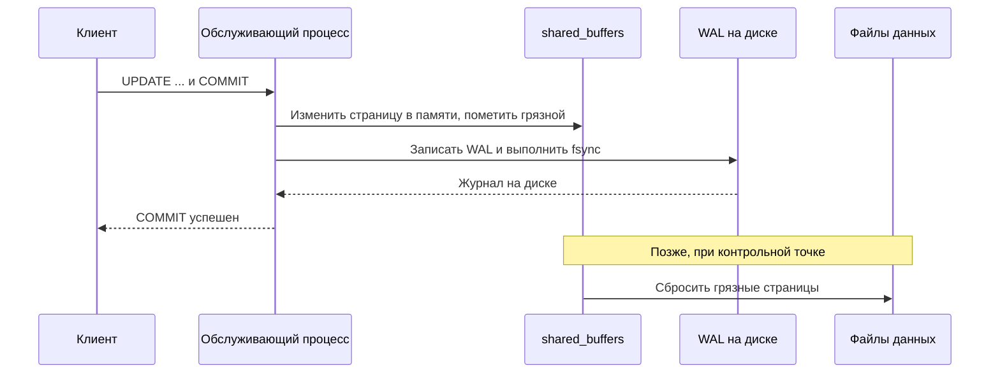
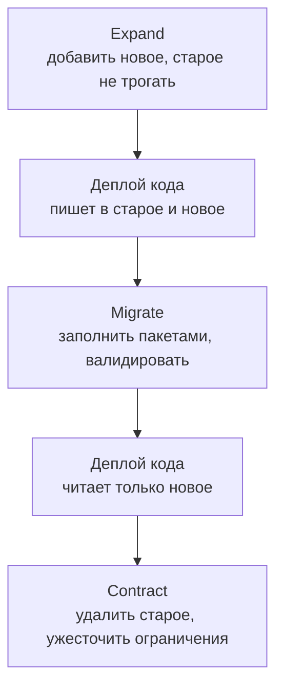

# 2.6 WAL, репликация и безопасные миграции

## Зачем это аналитику

«Читаем отчёты с реплики» означает, что данные могут отставать, и это надо явно разрешить в требованиях. «Потеряли последние секунды транзакций при падении» — вопрос о синхронной репликации и RPO. «Миграция на 200 млн строк» — отдельный проект. Всё это решения, где аналитик либо задаёт требования, либо обнаруживает их отсутствие.

## Что понять

- [ ] **Буферный кеш**: `shared_buffers`, грязные страницы, почему данные не пишутся на диск сразу при COMMIT.
- [ ] **WAL (журнал предзаписи)**: при COMMIT на диск синхронно пишется журнал, а не данные. Восстановление после сбоя — проигрывание WAL от последней контрольной точки.
- [ ] **Контрольная точка (checkpoint)**: сброс грязных страниц, влияние на нагрузку ввода-вывода, full page writes.
- [ ] **`synchronous_commit`**: компромисс «производительность или потеря последних транзакций».
- [ ] **Физическая (потоковая) репликация**: реплика проигрывает WAL, это побайтовая копия. Асинхронная против синхронной; `synchronous_standby_names`, кворум.
- [ ] **Replication lag** и его последствия: чтение своих же записей (read-your-writes), монотонные чтения. Как это формулируется в требованиях: «после сохранения пользователь сразу видит изменения» → чтение с мастера или липкая маршрутизация.
- [ ] **Конфликты на реплике**: долгий запрос на реплике против VACUUM на мастере (`hot_standby_feedback`, `max_standby_streaming_delay`).
- [ ] **Логическая репликация и CDC**: публикации и подписки, слоты репликации, Debezium → Kafka. Опасность забытого слота: WAL копится, пока не кончится диск.
- [ ] **RPO и RTO**: как они связаны с репликацией, резервным копированием, PITR (point-in-time recovery) и переключением на реплику (Patroni).
- [ ] **Пулинг соединений**: почему у PostgreSQL процесс на соединение и зачем нужен PgBouncer; режимы session / transaction и что ломается в transaction-режиме.
- [ ] **Безопасные миграции схемы** (expand → migrate → contract):
  - добавление столбца с `DEFAULT` в PG 11+ мгновенное, но изменение типа переписывает таблицу;
  - `NOT NULL` через `CHECK (...) NOT VALID` → `VALIDATE CONSTRAINT` → `SET NOT NULL`;
  - внешний ключ через `NOT VALID` + `VALIDATE`;
  - индексы только `CONCURRENTLY`;
  - обновление данных пакетами с паузами, а не одним UPDATE на всю таблицу;
  - обратная совместимость кода и схемы на время деплоя.
- [ ] **Партиционирование**: декларативное, по диапазону / списку / хешу; partition pruning; отсоединение старых партиций вместо DELETE.

## Урок

<!-- LESSON:START -->
Этот модуль про то, как PostgreSQL обеспечивает сохранность данных, как размножает их на другие узлы и как менять схему живой системы. Все три темы держатся на одном механизме — журнале предзаписи. Разберём его первым.

### Буферный кеш: почему данные не пишутся на диск при COMMIT

PostgreSQL читает и изменяет данные не на диске, а в общем буферном кеше — области разделяемой памяти размером `shared_buffers`. Страница таблицы или индекса (8 КБ) сначала загружается в буфер, изменяется там и становится грязной (dirty): её версия в памяти новее, чем на диске.

Сбрасывать грязную страницу на диск при каждом COMMIT было бы очень дорого. Транзакция может менять строки в десятках разных страниц таблиц и индексов, и каждая запись — случайный ввод-вывод. К тому же одна «горячая» страница может меняться тысячи раз в секунду, и писать её каждый раз бессмысленно. Поэтому грязные страницы пишутся на диск отложенно — фоновым процессом записи (background writer), процессом контрольной точки (checkpointer), а при нехватке чистых буферов и самими обслуживающими процессами.

Но тогда при сбое питания изменения в памяти пропадут. Эту проблему решает журнал.

### WAL: что гарантирует COMMIT

WAL (write-ahead log, журнал предзаписи) — последовательный журнал всех изменений страниц. Правило одно: запись журнала, описывающая изменение, должна попасть на диск раньше, чем сама изменённая страница. При COMMIT PostgreSQL синхронно сбрасывает на диск (fsync) журнал до записи о фиксации включительно, и только после этого отвечает клиенту «успешно».

Отсюда ответ на вопрос, что гарантирует COMMIT: изменения транзакции могут существовать только в памяти, но описание этих изменений уже надёжно лежит на диске. Если сервер упадёт, при старте он возьмёт последнюю контрольную точку и проиграет (replay) журнал от неё до конца, восстановив все зафиксированные изменения. Незафиксированные транзакции после восстановления просто окажутся невидимыми благодаря MVCC.

Почему это быстрее: журнал пишется последовательно, в один файл, а записи нескольких одновременных транзакций могут сбрасываться одним fsync (групповая фиксация).



### Контрольная точка и full page writes

Контрольная точка (checkpoint) — момент, когда все страницы, грязные на её начало, гарантированно записаны в файлы данных. После неё журнал до этой точки для восстановления после сбоя не нужен, и старые сегменты WAL можно удалить или переиспользовать (если их не держат архивация или слоты репликации). Контрольная точка запускается по времени (`checkpoint_timeout`) или по объёму накопленного журнала (`max_wal_size`), смотря что наступит раньше.

Компромисс настройки:

- частые контрольные точки — короче восстановление после сбоя, но больше записи на диск и больше WAL;
- редкие — меньше нагрузка, но дольше восстановление и больше места под WAL.

Запись растягивается во времени (параметр `checkpoint_completion_target`), чтобы не создавать всплеск ввода-вывода. Если в мониторинге видны контрольные точки, запущенные по объёму, а не по времени, значит `max_wal_size` мал для нагрузки.

Full page writes. Страница 8 КБ пишется на диск не атомарно: при сбое посередине записи на диске может оказаться «порванная» страница (torn page), наполовину старая, наполовину новая. Журнальная запись вида «изменить байты по смещению» к такой странице неприменима. Поэтому при первом изменении страницы после контрольной точки PostgreSQL пишет в WAL её полный образ. Следствие: сразу после контрольной точки объём WAL резко растёт, и тем сильнее, чем больше разных страниц трогает нагрузка. Это одна из причин, почему случайные вставки (UUID v4, модуль 2.5) раздувают журнал.

### synchronous_commit: скорость против последних транзакций

Параметр `synchronous_commit` определяет, чего ждёт COMMIT перед ответом клиенту. Его можно задать для сервера, сессии или отдельной транзакции.

| Значение | Чего ждёт COMMIT | Что можно потерять |
|---|---|---|
| `off` | Ничего: WAL сбрасывается фоном чуть позже | Последние доли секунды подтверждённых транзакций при падении сервера (без порчи данных) |
| `local` | Сброса WAL на локальный диск | При одиночном сервере ничего; на синхронную реплику не смотрит |
| `remote_write` | Локальный сброс и получение WAL синхронной репликой (записан в ОС реплики) | Одновременный сбой ОС реплики и мастера |
| `on` (по умолчанию) | Локальный сброс и сброс WAL на диск синхронной реплики | Ничего подтверждённого при потере одного узла |
| `remote_apply` | То же плюс применение изменений на реплике | Ничего; изменение сразу видно при чтении с этой реплики |

Без синхронных реплик значения выше `local` ведут себя как `on`. Практический приём: для некритичных записей (журнал просмотров, телеметрия) выключать `synchronous_commit` на уровне транзакции, а для платёжных поручений оставлять строгий режим. Важно: `off` не нарушает целостность базы, а только расширяет окно потерь.

### Физическая (потоковая) репликация

Раз WAL описывает все изменения страниц, его можно передать на другой сервер и проиграть там. Это и есть физическая потоковая репликация (streaming replication): реплика получает поток WAL от мастера и непрерывно его применяет. Реплика — побайтовая копия всего кластера: всех баз, таблиц, индексов. Отсюда ограничения: одинаковая мажорная версия PostgreSQL и архитектура, реплицировать отдельную таблицу нельзя, на реплике можно только читать (режим hot standby).

**Асинхронная репликация** — мастер фиксирует транзакцию, не дожидаясь реплики. Быстро, мастер не зависит от здоровья реплик. При падении мастера теряется всё, что успели зафиксировать, но не успели передать, — обычно доли секунды или секунды, но при перегрузке сети больше.

**Синхронная репликация** — мастер ждёт подтверждения от синхронной реплики (что именно ждать — задаёт `synchronous_commit`). Подтверждённые транзакции не теряются при потере одного узла, но каждая фиксация платит сетевой задержкой. И главная ловушка: если синхронная реплика недоступна, COMMIT на мастере повисает. Поэтому синхронных кандидатов делают несколько.

Список задаётся параметром `synchronous_standby_names`:

```ini
# ждать первую доступную по приоритету из списка
synchronous_standby_names = 'FIRST 1 (replica_a, replica_b)'

# кворум: ждать любые две из трёх
synchronous_standby_names = 'ANY 2 (replica_a, replica_b, replica_c)'
```

Кворумная схема позволяет пережить отказ одной реплики без остановки записи и при этом гарантировать, что каждая подтверждённая транзакция есть на мастере и минимум на двух репликах.

### Отставание реплики и модели согласованности чтения

Даже при синхронной репликации в режиме `on` реплика получила и записала WAL, но могла ещё не применить его. При асинхронной отставание (replication lag) — обычное состояние. Его видно на мастере в `pg_stat_replication` (столбцы `write_lag`, `flush_lag`, `replay_lag`) и на реплике через `pg_last_xact_replay_timestamp()`.

Классический сценарий: пользователь сохранил профиль компании в интернет-банке, запись ушла на мастер, страница перезагрузилась, чтение пошло на реплику, которая ещё не применила изменение, — и пользователь видит старые данные. Это нарушение гарантии чтения своих записей (read-your-writes). Второй вариант — нарушение монотонного чтения (monotonic reads): два последовательных запроса попали на разные реплики с разным отставанием, и свежие данные «исчезли».

Как формулировать требование. Не «данные должны быть актуальны» (это непроверяемо), а конкретно:

- «После сохранения пользователь при следующем чтении видит свои изменения» — реализуется чтением с мастера определённое время после записи этого пользователя, либо липкой маршрутизацией (sticky) пользователя на мастер, либо ожиданием, пока реплика догонит позицию WAL записи;
- «Отчёт по остаткам может отставать до N секунд» — явно разрешает чтение с реплики и задаёт порог для мониторинга;
- «При отставании реплики больше N секунд чтения переключаются на мастер или отчёт показывает время актуальности данных».

### Конфликты на реплике

Реплика проигрывает журнал мастера, в том числе удаление мёртвых версий строк VACUUM. Если на реплике идёт долгий отчётный запрос, которому эти версии ещё нужны (его снимок старше), возникает конфликт восстановления. У реплики два выхода: задержать применение WAL (отставание растёт) или отменить запрос. Она ждёт не дольше `max_standby_streaming_delay` (по умолчанию 30 секунд), затем отменяет запрос с ошибкой о конфликте с восстановлением. Похожий конфликт вызывает DDL на мастере, берущий эксклюзивную блокировку.

Параметр `hot_standby_feedback = on` заставляет реплику сообщать мастеру горизонт своих снимков, и мастер не удаляет нужные ей версии. Конфликтов меньше, но за долгий запрос на реплике теперь платит мастер: раздувание таблиц, как будто этот запрос шёл на нём самом. Это компромисс, который нужно выбрать осознанно: для тяжёлой аналитики лучше отдельная реплика с большой допустимой задержкой или отдельное хранилище.

### Логическая репликация и CDC

Физическая репликация передаёт изменения страниц. Логическая декодирует WAL обратно в изменения строк: «вставлена строка с такими значениями в таблицу orders». Для этого нужен `wal_level = logical`. Встроенный механизм — публикации (`CREATE PUBLICATION` на источнике: какие таблицы и операции) и подписки (`CREATE SUBSCRIPTION` на приёмнике). Можно реплицировать отдельные таблицы, между разными мажорными версиями, в базу с другими индексами. DDL при этом не передаётся — схемы синхронизируются отдельно. Логическую репликацию используют для обновления мажорной версии с минимальным простоем, выделения части данных и CDC.

CDC (change data capture) — публикация изменений базы во внешние системы. Типичная схема: Debezium читает логический поток PostgreSQL и пишет события в Kafka, откуда их забирают поиск, хранилище данных, другие сервисы.

Позицию потребителя хранит слот репликации (replication slot). Мастер не удаляет WAL, который слот ещё не подтвердил. Это защищает от потери изменений, если потребитель временно недоступен, но создаёт главную эксплуатационную опасность: если потребитель остановлен или удалён, а слот остался, WAL копится бесконечно, пока не кончится диск, и тогда останавливается весь мастер. Дополнительно логический слот удерживает горизонт очистки системного каталога. Меры:

- мониторинг объёма удерживаемого WAL по каждому слоту (`pg_replication_slots`) с алертом;
- ограничение `max_slot_wal_keep_size` (PostgreSQL 13+): при превышении слот инвалидируется, диск спасён, но потребителю нужна повторная начальная загрузка;
- регламент: при выводе потребителя из эксплуатации слот удаляется явно.

### RPO, RTO и из чего они складываются

RPO (recovery point objective) — сколько последних данных допустимо потерять при аварии. RTO (recovery time objective) — за сколько система должна снова заработать. Это бизнес-требования, и их задаёт или выясняет аналитик: для реестра платёжных поручений RPO близок к нулю, для каталога товаров, который перегружается из мастер-системы, можно и час.

| Решение | Влияет на RPO | Влияет на RTO |
|---|---|---|
| Асинхронная реплика | Потеря неотправленного хвоста WAL | Зависит от способа переключения: вручную — до часа, автоматически — см. Patroni |
| Синхронная реплика (кворум) | Около нуля при отказе одного узла | То же |
| Автоматическое переключение (Patroni) | Зависит от режима репликации | Секунды или десятки секунд вместо ручного часа |
| Базовая копия плюс архив WAL (PITR) | Время с последнего заархивированного сегмента | Часы: восстановление копии и проигрывание журнала |
| Отложенная реплика | Позволяет вернуться до ошибки | Быстрее, чем PITR с нуля |

Ключевая мысль: реплика не заменяет резервную копию. Ошибочный `DELETE` без `WHERE` или `DROP TABLE` мгновенно реплицируется на все узлы. От логических ошибок защищает только восстановление на момент времени (PITR, point-in-time recovery): базовая копия (например, через `pg_basebackup` или pgBackRest) плюс непрерывный архив WAL позволяют восстановить базу на любую секунду между копией и последним архивным сегментом.

Patroni управляет кластером PostgreSQL для высокой доступности: хранит признак лидера в распределённом хранилище (etcd, Consul, ZooKeeper), при потере мастера продвигает наиболее актуальную реплику и перенастраивает остальные. При асинхронной репликации автоматическое переключение означает осознанное согласие на потерю хвоста транзакций.

### Пулинг соединений

PostgreSQL создаёт отдельный процесс ОС на каждое соединение. У процесса своя память и свои кеши каталога, создание соединения заметно дороже, чем в системах с потоками. Сотни активных процессов конкурируют за процессоры и блокировки. Когда у каждого из 50 экземпляров сервиса пул на 20 соединений, получается 1000 соединений, большая часть которых простаивает.

PgBouncer — лёгкий посредник: клиенты держат много соединений к нему, а он раздаёт им небольшое число серверных соединений.

| Режим | Когда серверное соединение возвращается в пул | Что работает |
|---|---|---|
| session | После отключения клиента | Всё, но экономии мало |
| transaction | После завершения транзакции | Большинство приложений; ломается состояние сессии |
| statement | После каждого оператора | Многооператорные транзакции запрещены |

В режиме transaction следующая транзакция клиента может попасть на другое серверное соединение, поэтому ломается всё, что живёт дольше транзакции:

- `SET` на уровне сессии (часовой пояс, `search_path`, `statement_timeout`) — вместо него `SET LOCAL` внутри транзакции;
- сессионные advisory-блокировки (`pg_advisory_lock`) — их надо заменить на транзакционные;
- `LISTEN/NOTIFY`, временные таблицы между транзакциями, курсоры `WITH HOLD`;
- подготовленные операторы на уровне протокола — в старых версиях PgBouncer ломались; начиная с PgBouncer 1.21 есть поддержка через параметр `max_prepared_statements` (с 1.24 включена по умолчанию, до этого значение 0 — выключено); поведение всё равно нужно проверить с драйвером.

### Безопасные миграции схемы

Главный риск миграции на живой системе — не время выполнения, а блокировки. Большинство `ALTER TABLE` берут блокировку `ACCESS EXCLUSIVE`, несовместимую даже с чтением. Коварство в очереди блокировок: если `ALTER` ждёт завершения долгого отчётного запроса, все новые запросы к таблице встают в очередь за `ALTER`. Операция, которая выполнилась бы за миллисекунды, кладёт сервис на время отчёта. Поэтому DDL выполняют с `SET lock_timeout` (секунды) и повтором при неудаче.

Что дёшево, а что нет:

- `ADD COLUMN` без значения по умолчанию или с неизменяемым (не volatile) `DEFAULT` в PostgreSQL 11+ — изменение только метаданных, мгновенно. С volatile-выражением (`random()`, `clock_timestamp()`) таблица переписывается.
- Изменение типа столбца в общем случае переписывает таблицу и все её индексы под эксклюзивной блокировкой. Исключения — двоично совместимые изменения, например увеличение длины `varchar(n)` или переход с `varchar` на `text`.
- `CREATE INDEX` блокирует запись в таблицу на всё время построения. `CREATE INDEX CONCURRENTLY` не блокирует запись, но работает дольше, не может выполняться внутри транзакционного блока (многие инструменты миграций по умолчанию оборачивают шаг в транзакцию — это нужно отключить) и при сбое оставляет невалидный индекс, который надо удалить и создать заново.

**NOT NULL на большой таблице.** Прямой `SET NOT NULL` проверяет всю таблицу под эксклюзивной блокировкой. Безопасная последовательность:

```sql
SET lock_timeout = '3s';
-- 1. Ограничение без проверки существующих строк: мгновенно, но новые строки уже проверяются
ALTER TABLE orders ADD CONSTRAINT orders_region_nn
    CHECK (region_id IS NOT NULL) NOT VALID;
-- 2. Проверка существующих строк: долго, но запись не блокируется
ALTER TABLE orders VALIDATE CONSTRAINT orders_region_nn;
-- 3. PostgreSQL 12+ использует проверенный CHECK и не сканирует таблицу
ALTER TABLE orders ALTER COLUMN region_id SET NOT NULL;
ALTER TABLE orders DROP CONSTRAINT orders_region_nn;
```

**Внешний ключ** — по той же схеме: `ADD CONSTRAINT ... FOREIGN KEY ... NOT VALID` (короткая блокировка, новые строки проверяются), затем `VALIDATE CONSTRAINT`, который проверяет существующие строки без блокировки записи.

**Заполнение данных** — пакетами по несколько тысяч строк по диапазону ключа, каждый пакет в своей транзакции, с паузами. Один `UPDATE` на 200 миллионов строк — это одна гигантская транзакция: удвоенный объём таблицы из-за новых версий строк, горизонт VACUUM стоит на месте, всплеск WAL и отставание реплик, блокировки строк на всё время, а при отмене — всё впустую.

**Совместимость кода и схемы.** Во время выкатки одновременно работают старая и новая версии приложения, поэтому каждое изменение схемы должно быть совместимо с обеими. Отсюда шаблон expand → migrate → contract.



Пример: переименование столбца `client_name` в `legal_name` в таблице контрагентов банка. Прямой `RENAME` сломает все экземпляры старой версии кода в момент выкатки. Правильно: добавить `legal_name`; выкатить код, который пишет в оба столбца; заполнить `legal_name` пакетами; выкатить код, который читает только `legal_name`; через релиз удалить `client_name`. Каждый шаг можно откатить без потери данных.

### Партиционирование

Декларативное партиционирование (PostgreSQL 10+) делит логическую таблицу на физические секции по ключу:

- по диапазону (range) — по дате: продажи по месяцам, операции по выписке по месяцам;
- по списку (list) — по региону или типу;
- по хешу (hash) — равномерное распределение, когда нет естественного ключа.

Выигрыш — отсечение секций (partition pruning): запрос с условием по ключу секционирования читает только нужные секции. Отсечение работает и при планировании, и при выполнении (например, для параметров подготовленного оператора). Если в запросе нет условия по ключу, будут прочитаны все секции, и это медленнее, чем одна таблица.

Второй выигрыш — управление жизненным циклом. Удалить данные старше трёх лет через `DELETE` — это миллионы мёртвых строк, VACUUM и раздувание. Отсоединить и удалить секцию (`DETACH PARTITION`, затем `DROP TABLE`) — операция над метаданными; с PostgreSQL 14 есть вариант `DETACH PARTITION ... CONCURRENTLY` с более мягкой блокировкой.

Ограничения: первичный ключ и уникальные ограничения должны включать ключ секционирования; тысячи секций увеличивают время планирования; секции на будущие периоды нужно создавать заранее (или иметь секцию по умолчанию и процесс, который её разбирает).

### Типичные ошибки

- Направить чтение на реплики «для разгрузки», не зафиксировав в требованиях допустимое отставание и сценарии, где нужен read-your-writes.
- Синхронная репликация с одной синхронной репликой без кворума — отказ реплики останавливает запись на мастере.
- Считать реплику резервной копией: логическая ошибка реплицируется мгновенно, без PITR её не отменить.
- Оставить слот репликации после отключения потребителя CDC — диск мастера заполняется журналом.
- Перевести PgBouncer в transaction-режим, не проверив сессионные `SET`, advisory-блокировки и подготовленные операторы.
- Миграция без `lock_timeout`, `CREATE INDEX` без `CONCURRENTLY`, массовый `UPDATE` одной транзакцией, `RENAME` столбца одновременно с деплоем.
- Партиционирование «для скорости» без условия по ключу секционирования в основных запросах.

### Как говорить об этом на собеседовании

Senior отличается тем, что переводит бизнес-требования в механизмы и обратно. На вопрос «как обеспечить надёжность» — не «поставим реплику», а «сначала RPO и RTO по классам данных; для платёжных поручений RPO около нуля — синхронная репликация с кворумом и автоматическое переключение через Patroni; от логических ошибок — непрерывный архив WAL и PITR с регулярной проверкой восстановления». На вопрос про чтение с реплик — назвать read-your-writes и монотонное чтение и показать, как это записано в требованиях.

Про миграции сильный ответ содержит три идеи: блокировки и очередь блокировок важнее времени выполнения; проверка ограничений отделяется от их добавления (`NOT VALID` → `VALIDATE`); схема совместима с двумя версиями кода одновременно (expand → migrate → contract). Пример из опыта — миграция на сотни миллионов строк с пакетным заполнением и мониторингом отставания реплик — убедительнее любых определений.

### Коротко

- COMMIT гарантирует, что на диске лежит журнал изменений, а не сами страницы; после сбоя WAL проигрывается от последней контрольной точки.
- Контрольные точки сбрасывают грязные страницы; первое изменение страницы после неё пишет в WAL полный образ страницы.
- `synchronous_commit` выбирает окно потерь: от «доли секунды на одном узле» до «изменение уже применено на реплике».
- Физическая реплика — побайтовая копия кластера; синхронная защищает от потерь ценой задержки и риска остановки записи, кворум снимает этот риск.
- Отставание реплик — явное требование: read-your-writes решается маршрутизацией чтений, а не надеждой.
- Слот репликации удерживает WAL; забытый слот останавливает мастер через заполнение диска.
- RPO и RTO задаются по классам данных; реплика не заменяет PITR.
- Миграции: `lock_timeout`, `CONCURRENTLY`, `NOT VALID` + `VALIDATE`, пакеты, expand → migrate → contract.
<!-- LESSON:END -->

## Читать дальше

- Рогов, «PostgreSQL изнутри», часть II «Буферный кеш и журнал».
- Kleppmann, *DDIA* (1-е изд.), гл. 5 «Replication» — модели согласованности чтения с реплик.
- Документация: [Reliability and the Write-Ahead Log](https://www.postgresql.org/docs/current/wal.html), [High Availability, Load Balancing, and Replication](https://www.postgresql.org/docs/current/high-availability.html).
- Документация [Debezium PostgreSQL connector](https://debezium.io/documentation/reference/stable/connectors/postgresql.html) — раздел о работе со слотами.

На system-design.space:

- [Репликация и шардирование](https://system-design.space/chapter/replication-sharding/)
- [Миграции схемы без простоя: совместимость, исторический пересчёт и двойная запись](https://system-design.space/chapter/schema-migrations-backfills/)
- [Лаба: Миграция схемы и исторический пересчёт под нагрузкой](https://system-design.space/labs/schema-backfill-online-migration/)
- [Аварийное восстановление: RTO, RPO и game days](https://system-design.space/chapter/disaster-recovery/)

## Практика

1. Поднять в Docker Compose мастер и потоковую реплику (либо использовать готовый образ Bitnami PostgreSQL с репликацией). Записать на мастере, прочитать на реплике, посмотреть `pg_stat_replication` и отставание.
2. Остановить реплику, записать на мастер много данных, посмотреть, как растёт WAL из-за слота. Удалить слот.
3. Написать сценарий миграции «добавить обязательный столбец `region_id` с внешним ключом в таблицу на 100 млн строк без простоя»: все шаги, блокировки на каждом шаге, порядок относительно деплоя кода.

## Вопросы для самопроверки

1. Что гарантирует COMMIT с точки зрения диска, если данные ещё в памяти?
2. Чем асинхронная репликация отличается от синхронной? Что теряем при падении мастера в каждом случае?
3. Пользователь сохранил профиль, обновил страницу и увидел старые данные. Почему, и как сформулировать требование, чтобы этого не было?
4. Чем опасен неиспользуемый слот логической репликации?
5. Что такое RPO и RTO? Какие архитектурные решения влияют на каждый?
6. Как добавить NOT NULL-столбец в большую таблицу без длительной блокировки?
7. Что ломается при переходе PgBouncer в режим transaction pooling?

## Заметки

<!-- Свои формулировки, ошибки, ссылки. -->
