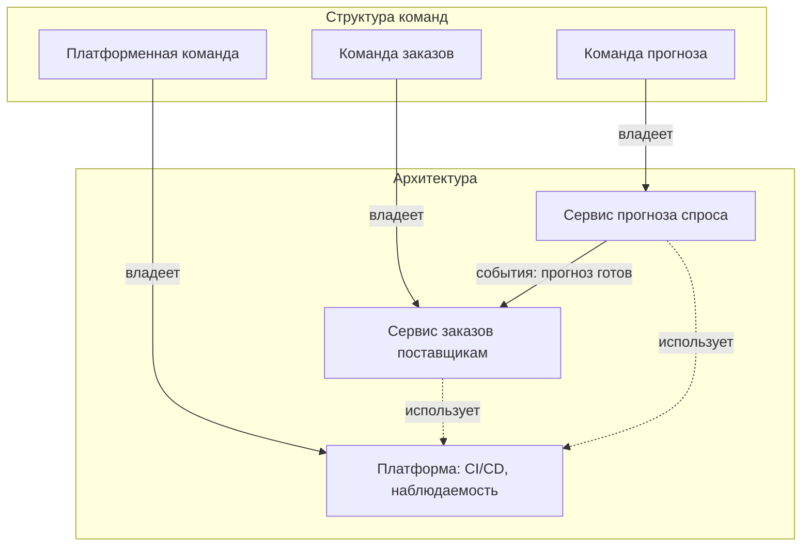
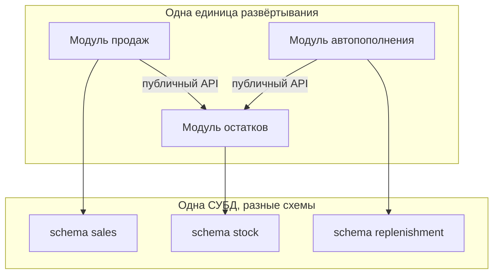

# 3.1 Зачем микросервисы и когда лучше модульный монолит

## Зачем это аналитику

Решение «пилим на микросервисы» часто принимается по моде, а платит за него весь проект: распределённые транзакции, сетевые сбои, согласованность в конечном счёте, сложная отладка. Архитектор должен уметь аргументированно сказать и «да», и «нет».

## Что понять

- [ ] **Что на самом деле покупают микросервисы**: независимое развёртывание, независимое масштабирование, изоляцию сбоев, технологическую свободу, и главное — **организационную масштабируемость**, когда много команд работает без постоянной координации.
- [ ] **Чем за это платят** («microservice premium», Фаулер): сеть вместо вызова функции (задержки, частичные отказы), отсутствие ACID-транзакций между сервисами, согласованность в конечном счёте, распределённая отладка, наблюдаемость, контрактное тестирование, инфраструктура (CI/CD, оркестрация, mesh).
- [ ] **Закон Конвея** и обратный манёвр Конвея: архитектура повторяет структуру коммуникаций в организации. Team Topologies: stream-aligned, platform, enabling, complicated-subsystem.
- [ ] **Распределённый монолит** — худший из миров: сервисы, которые нельзя развернуть по отдельности, общая база, синхронные цепочки вызовов. Признаки и как их увидеть на ревью архитектуры.
- [ ] **Модульный монолит**: одна единица развёртывания, но жёсткие границы модулей (свои схемы БД, взаимодействие только через публичные интерфейсы). Часто лучший старт; позволяет выделить сервис позже, когда граница проверена жизнью.
- [ ] **Стратегии миграции**: Strangler Fig, Branch by Abstraction, выделение по одному bounded context, работа с общими данными при миграции.
- [ ] **Критерии декомпозиции**: по бизнес-возможностям и поддоменам (а не по техническим слоям и не по сущностям — «сервис клиентов», «сервис заказов» как CRUD-обёртки над таблицами — антипаттерн).
- [ ] **Размер сервиса**: не строки кода, а связность (cohesion) внутри и зацепление (coupling) снаружи. Виды зацепления: по реализации, по времени, по развёртыванию, по домену.

## Урок

<!-- LESSON:START -->
Микросервисная архитектура — это способ строить систему из небольших независимо развёртываемых сервисов, каждый из которых отвечает за свою бизнес-возможность и сам владеет своими данными. Ключевые слова здесь не «небольших», а «независимо развёртываемых» и «владеет данными». Если убрать эти два свойства, остаётся набор процессов, которые общаются по сети, и все недостатки распределённой системы без её преимуществ.

Урок о том, как принимать решение: что микросервисы дают, чем за это платят, когда модульный монолит лучше и как переходить от одного к другому.

### Что на самом деле покупают микросервисы

Обычно перечисляют пять преимуществ.

1. **Независимое развёртывание.** Сервис выкатывается сам по себе, без согласования релиза с остальными. Изменение в расчёте прогноза не требует перевыкатки кассового контура.
2. **Независимое масштабирование.** Нагруженная часть масштабируется отдельно: поиск доменов во время распродажи коротких имён растёт в десять раз, биллинг — нет.
3. **Изоляция сбоев.** Падение рекомендаций не должно останавливать оформление заказа. Оговорка: изоляция не возникает сама, её надо спроектировать (тайм-ауты, предохранители, деградация функций).
4. **Технологическая свобода.** Модель прогноза на Python, платёжный шлюз на Java. На практике зоопарк технологий быстро становится долгом, и зрелые компании его ограничивают.
5. **Организационная масштабируемость.** Много команд работают параллельно, не блокируя друг друга.

Последний пункт главный, и он объясняет, почему это проблема организации, а не технологии. Монолит прекрасно масштабируется технически: его можно запустить в двадцати экземплярах за балансировщиком. Не масштабируется другое — работа людей в одной кодовой базе. Когда над монолитом работают 8–10 команд, каждое изменение требует согласований, релизный поезд ходит раз в две недели, одна сломанная функция задерживает выкатку всех, а владельцы модулей размываются. Микросервисы разрезают систему по линиям ответственности команд: команда владеет сервисом от требований до эксплуатации и выкатывает его, когда готова.

Отсюда важное следствие. Если над системой работает одна команда из шести человек, главное преимущество микросервисов ей не нужно, а цену придётся заплатить полностью.

### Чем за это платят

Мартин Фаулер назвал эту цену «надбавкой за микросервисы» (microservice premium): дополнительная сложность, которая окупается только начиная с определённого уровня сложности системы и организации. Из чего она состоит:

- **Сеть вместо вызова функции.** Вызов внутри процесса занимает наносекунды и либо выполнен, либо выбросил исключение. Сетевой вызов занимает миллисекунды и может закончиться частичным отказом: запрос дошёл, операция выполнена, а ответ потерян. Нужны тайм-ауты, повторы, идемпотентность.
- **Нет ACID-транзакций между сервисами.** «Списать остаток и создать заказ поставщику» было одной транзакцией в одной базе. Теперь это саги, компенсирующие действия, outbox (модуль 3.5).
- **Согласованность в конечном счёте.** Данные в разных сервисах какое-то время расходятся, и это должно быть допустимо с точки зрения бизнеса и описано в требованиях.
- **Распределённая отладка и наблюдаемость.** Ошибка пользователя проходит через пять сервисов; без сквозной трассировки, корреляционных идентификаторов и централизованных логов расследование превращается в археологию.
- **Контракты и их тестирование.** Интерфейс между модулями раньше проверял компилятор, теперь — контрактные тесты и дисциплина версионирования API и событий.
- **Инфраструктура.** Конвейер CI/CD на каждый сервис, оркестрация, реестр сервисов, управление конфигурацией и секретами, возможно, service mesh. Это отдельная платформенная команда.

| Преимущество | Когда реально нужно | Цена, которая к нему прилагается |
|---|---|---|
| Независимое развёртывание | Много команд, разный темп изменений частей системы | Версионирование контрактов, обратная совместимость |
| Независимое масштабирование | Нагрузка на части системы различается на порядки | Сетевые вызовы, балансировка, мониторинг каждого сервиса |
| Изоляция сбоев | Есть критичное ядро и некритичные функции | Проектирование деградации, тайм-ауты, предохранители |
| Технологическая свобода | Части требуют принципиально разных стеков | Разнородная эксплуатация, найм, поддержка |
| Организационная масштабируемость | Больше примерно 3–5 команд на одну систему | Всё перечисленное выше плюс платформа |

Эту таблицу удобно заполнять для конкретной системы на практике: какие строки реально нужны, а какие нет.

### Закон Конвея и обратный манёвр

Закон Конвея: организация, проектирующая систему, неизбежно создаёт архитектуру, повторяющую её структуру коммуникаций. Если интеграцию между двумя отделами делают три команды, получится три компонента с двумя стыками. Если одна команда владеет «базой данных», а другие ей пишут заявки, получится общая база как центр системы.

Обратный манёвр Конвея (inverse Conway maneuver): раз архитектура следует структуре команд, сначала проектируют команды так, как должна выглядеть желаемая архитектура. Хотите независимый сервис автопополнения — нужна команда, которая владеет автопополнением целиком, от требований до эксплуатации. Если нарезать сервисы, а команды оставить организованными по слоям (фронтенд, бэкенд, DBA), каждая доработка всё равно будет требовать координации трёх команд.

Связь с границами сервисов прямая: граница сервиса должна совпадать с границей ответственности одной команды. Сервис, которым владеют две команды, неизбежно станет полем согласований. Команда может владеть несколькими сервисами, но у сервиса один владелец.

Team Topologies (Скелтон и Паис) даёт словарь для такого проектирования. Четыре типа команд:

- **stream-aligned** — выровнена по потоку ценности (оформление заказа, продление доменов, платежи юрлиц); основной тип, остальные существуют, чтобы её разгрузить;
- **platform** — предоставляет внутренние сервисы самообслуживания (развёртывание, наблюдаемость, базы как сервис), снижая когнитивную нагрузку остальных;
- **enabling** — временно помогает другим командам освоить новую практику (контрактное тестирование, трассировку) и уходит;
- **complicated-subsystem** — владеет частью, требующей узкой экспертизы (модель прогноза спроса, антифрод-скоринг).

Три режима взаимодействия: сотрудничество (collaboration), «X как сервис» (X-as-a-Service) и содействие (facilitating). Для архитектора ценна мысль, что взаимодействие команд тоже проектируется, и долгое сотрудничество двух команд — сигнал, что граница проведена неправильно.

### Распределённый монолит

Распределённый монолит — система, которая физически разделена на сервисы, но логически осталась монолитом. Она получает все издержки сети и ни одного преимущества независимости. Это худший из миров, и он встречается чаще, чем настоящие микросервисы.

Признаки, которые видно на ревью архитектуры:

- **Совместный релиз.** Сервисы выкатываются вместе, в релизной заметке список из восьми сервисов с согласованными версиями. Вопрос на ревью: «можно выкатить этот сервис сегодня, не трогая остальные?»
- **Общая база данных.** Несколько сервисов читают и пишут одни таблицы. Любое изменение схемы требует согласования всех, а инвариантами никто не владеет.
- **Синхронные цепочки вызовов.** Запрос пользователя последовательно проходит через пять сервисов. Доступность цепочки — произведение доступностей: пять сервисов по 99,9% дают около 99,5%. Задержки складываются.
- **Болтливые интерфейсы.** Чтобы собрать одну страницу, сервис делает десятки вызовов к другому: граница проведена посреди одной бизнес-операции.
- **Общие библиотеки с доменной логикой.** Обновление общей модели «Заказ» требует пересобрать все сервисы.
- **Изменение одной бизнес-функции затрагивает несколько сервисов и команд.** Самый надёжный индикатор: посмотрите на последние десять задач и посчитайте, сколько сервисов менялось в каждой.

Шаги к исправлению: передать каждую таблицу одному владельцу, а остальным дать API или события; заменить синхронные цепочки асинхронными событиями или локальными копиями нужных данных; объединить сервисы, которые всегда меняются вместе, — это тоже правильное решение.

### Модульный монолит

Модульный монолит — одна единица развёртывания с жёсткими внутренними границами. Отличие от обычного монолита не в количестве папок, а в соблюдении правил:

- модули выделены по бизнес-возможностям, а не по слоям;
- у каждого модуля свои данные: своя схема БД, и другие модули в неё не ходят;
- взаимодействие только через публичный интерфейс модуля (сервисный API в коде или внутренние события), без обращения к внутренним классам и таблицам соседа;
- правила проверяются автоматически: тесты архитектуры, анализ зависимостей в сборке, права на схемы в базе.

Почему это часто лучший старт. Границы между бизнес-модулями почти никогда не угадываются с первого раза. В монолите ошибку в границе исправляет рефакторинг за день: перенести класс, поправить вызов, транзакция по-прежнему одна. В микросервисах та же ошибка означает изменение контрактов двух сервисов, миграцию данных между базами и согласование двух команд. Модульный монолит позволяет проверить границы жизнью, а когда появится реальная причина (отдельная команда, отдельный профиль нагрузки), выделить модуль в сервис почти механически: данные уже отделены, интерфейс уже есть.

Это позиция Фаулера «сначала монолит» (MonolithFirst) с важной поправкой: монолит должен быть модульным с первого дня, иначе выделять будет нечего.

### Стратегии миграции

**Strangler Fig** (фикус-душитель) — постепенная замена легаси по функциям. Перед монолитом ставится маршрутизирующий слой (API-шлюз, обратный прокси). Новая реализация функции делается отдельно, и маршрутизатор переключает на неё запросы — сначала часть трафика, затем весь. Функция за функцией монолит «усыхает». Откат — переключение маршрута обратно.

Разбор примера: регистратор доменов выделяет продление из легаси-системы. Шаги:

1. Маршрутизатор перед легаси, пока все запросы идут туда. Проверяется, что слой ничего не ломает.
2. Новый сервис продления со своей базой. Данные, которыми он не владеет (клиенты, балансы), приходят из легаси через CDC или события.
3. Режим тени: запросы идут в легаси, копия — в новый сервис, результаты сравниваются, но не применяются.
4. Переключение небольшой доли трафика (например, одной доменной зоны), затем всей.
5. Легаси перестаёт писать продления; данные о продлениях, нужные легаси (отчёты, биллинг), он получает событиями из нового сервиса.
6. Удаление кода продления из легаси.

Самое сложное — данные. Пока функция живёт в двух местах, возможны варианты: новый сервис временно читает базу легаси (быстро, но создаёт зацепление, которое надо убрать); синхронизация через CDC в одну сторону; двойная запись (опасна расхождениями без механизма сверки). Важно заранее определить, кто в каждый момент является источником истины для каждой сущности, и держать процесс сверки до окончания миграции.

**Branch by Abstraction** — для функций, которые нельзя перехватить на границе, потому что они вызываются изнутри монолита. Внутри кода вводится абстракция (интерфейс) над старой реализацией, все вызовы переводятся на неё, затем пишется новая реализация (например, клиент к новому сервису), переключение делается флагом, старая реализация удаляется. Всё это время основная ветка остаётся рабочей.

**Выделение по одному bounded context.** Выделять стоит не случайную функцию, а целый ограниченный контекст (модуль 3.2) с его данными: сначала тот, где выигрыш максимален, а зацепление с остальным минимально. Хороший первый кандидат — часть с отдельной командой, другим профилем нагрузки или частыми изменениями; плохой — ядро, через которое проходят все транзакции.

### Критерии декомпозиции

Правильная основа декомпозиции — бизнес-возможности (business capabilities) и поддомены: «формирование заказов поставщикам», «прогноз спроса», «приём платёжных поручений», «продление доменов». Возможность включает данные, правила и процессы, которые меняются вместе по одним бизнес-причинам.

Неправильные основы:

- **По техническим слоям**: сервис UI, сервис бизнес-логики, сервис доступа к данным. Любая функция требует изменения всех трёх.
- **По сущностям**: сервис клиентов, сервис заказов, сервис товаров как CRUD-обёртки над таблицами. Это антипаттерн, потому что бизнес-операции почти никогда не укладываются в одну сущность. Оформление заказа проверяет клиента, резервирует товар, считает цену и создаёт заказ — четыре синхронных вызова и распределённая транзакция на месте того, что было одной транзакцией. Логика расползается по вызывающим сервисам, а «сервис товаров» становится общей базой данных с HTTP-интерфейсом. К тому же «товар» для каталога, склада и ценообразования — разные модели с разными атрибутами (об этом модуль 3.2).

### Размер сервиса: связность и зацепление

Размер сервиса измеряют не строками кода и не числом эндпоинтов. Правильный критерий: высокая связность (cohesion) внутри — то, что меняется вместе, лежит вместе, — и слабое зацепление (coupling) снаружи — изменение в одном сервисе редко требует изменения другого.

Сэм Ньюмен в книге про миграцию монолита выделяет четыре вида зацепления:

| Вид зацепления | Что это | Пример | Как ослабить |
|---|---|---|---|
| По реализации (implementation) | Сервис зависит от внутреннего устройства другого | Чтение чужих таблиц напрямую | Только публичный API или события |
| По времени (temporal) | Оба сервиса должны быть доступны одновременно | Синхронный вызов в цепочке оформления заказа | Асинхронные сообщения, локальная копия данных |
| По развёртыванию (deployment) | Нельзя выкатить один без другого | Общая библиотека с доменной моделью | Версионирование контрактов, обратная совместимость |
| По домену (domain) | Сервису нужна чужая функция или данные | Заказам нужен статус клиента | Неустранимо, но минимизируется: передавать только нужное |

Зацепление по домену естественно, без него сервисы не нужны друг другу. Опасны первые три: они делают сервисы зависимыми сильнее, чем требует бизнес. Во втором издании «Building Microservices» Ньюмен предлагает другую классификацию (по домену, сквозное — pass-through, общее — common, по содержимому — content), но суть та же: чем больше сервис знает о чужом устройстве, тем хуже.

### Типичные ошибки

- Выбирать микросервисы, потому что «так делают все», не сформулировав, какое преимущество нужно этой системе и этой организации.
- Нарезать сервисы по сущностям или слоям и получить синхронные цепочки и распределённые транзакции на каждую бизнес-операцию.
- Оставить общую базу данных «на время» — время превращается в годы, а независимость сервисов остаётся на бумаге.
- Разделить систему на сервисы, не меняя структуру команд, и удивляться, что каждая задача требует координации.
- Начинать миграцию легаси с переписывания «всего сразу» вместо постепенного Strangler Fig с маршрутизацией и откатом.
- Не определить источник истины для данных на время миграции и получить расхождения между старой и новой системой.
- Считать, что модульный монолит — это «монолит с папками», без изоляции данных и автоматической проверки границ.

### Как говорить об этом на собеседовании

Сильный ответ начинается не с технологий, а с вопросов: сколько команд, как часто меняются разные части, различаются ли профили нагрузки, какие требования к изоляции сбоев. Senior умеет убедительно отговорить от микросервисов: одна-две команды — главное преимущество не нужно; домен ещё не изучен — границы будут неправильными, а переделывать их между сервисами дорого; нет платформы (CI/CD, наблюдаемость, дежурства) — надбавку за микросервисы нечем платить. И умеет сказать «да», когда есть много команд, мешающих друг другу в одной кодовой базе.

Хорошо звучат формулировки «главная проблема, которую решают микросервисы, — организационная», «граница сервиса — это граница владения», «сначала модульный монолит, выделение сервиса — когда граница проверена жизнью». Лучший пример — из опыта: модернизация легаси через Strangler Fig с описанием маршрутизации, синхронизации данных и отката, или случай, когда вы распознали распределённый монолит по совместным релизам и общей базе.

### Коротко

- Микросервисы — это независимое развёртывание и владение данными; без этого получается распределённый монолит.
- Главное, что они покупают, — организационная масштабируемость: много команд работают без постоянной координации.
- Цена — сеть, отсутствие распределённых ACID-транзакций, согласованность в конечном счёте, наблюдаемость, контракты, платформа.
- Архитектура повторяет структуру команд; границы сервисов проектируются вместе с границами ответственности команд.
- Распределённый монолит узнаётся по совместным релизам, общей базе и синхронным цепочкам.
- Модульный монолит с изолированными данными — частый лучший старт: он позволяет дёшево исправить ошибки в границах.
- Миграция — постепенная: Strangler Fig, Branch by Abstraction, выделение целого bounded context с явным источником истины для данных.
- Декомпозиция — по бизнес-возможностям, а не по сущностям и слоям; размер определяют связность и зацепление.
<!-- LESSON:END -->

## Читать дальше

- Newman, *Building Microservices* (2nd ed.): гл. 1 «What Are Microservices?», гл. 2 «How to Model Microservices» (виды coupling и cohesion).
- Newman, *Monolith to Microservices*: гл. 1–3 (когда не нужно, стратегии миграции, Strangler Fig).
- Richardson, *Microservices Patterns*: гл. 1 «Escaping monolithic hell», гл. 2 «Decomposition strategies».
- Martin Fowler: [MicroservicePremium](https://martinfowler.com/bliki/MicroservicePremium.html), [MonolithFirst](https://martinfowler.com/bliki/MonolithFirst.html), [StranglerFigApplication](https://martinfowler.com/bliki/StranglerFigApplication.html).
- Matthew Skelton, Manuel Pais, *Team Topologies* — по желанию, но очень полезно для разговора с руководством.

На system-design.space:

- [Стратегии декомпозиции](https://system-design.space/chapter/decomposition-strategies/)
- [Monolith to Microservices (short summary)](https://system-design.space/chapter/monolith-to-microservices-book/)
- [Building Microservices (short summary)](https://system-design.space/chapter/building-microservices-book/)

## Практика

1. Для системы из своего опыта (обезличенно) заполнить таблицу: какие преимущества микросервисов там реально нужны, а какие нет. Сделать вывод: микросервисы, модульный монолит или гибрид.
2. Найти в знакомой системе признаки распределённого монолита (общая БД, синхронные цепочки, совместный релиз) и предложить по одному шагу к исправлению.
3. Нарисовать план Strangler Fig для выделения одной функции из монолита: маршрутизация, синхронизация данных, откат.

## Вопросы для самопроверки

1. Какую главную проблему решают микросервисы? Почему это проблема организации, а не технологии?
2. Когда вы бы отговорили заказчика от микросервисов? Три аргумента.
3. Что такое распределённый монолит и как его распознать?
4. Чем модульный монолит отличается от обычного и почему это часто лучший старт?
5. Как работает Strangler Fig и что делать с данными во время миграции?
6. Почему декомпозиция по сущностям (сервис клиентов, сервис заказов, сервис товаров) обычно плохая?
7. Как связаны закон Конвея и границы сервисов?

## Заметки

<!-- Свои формулировки, ошибки, ссылки. -->
