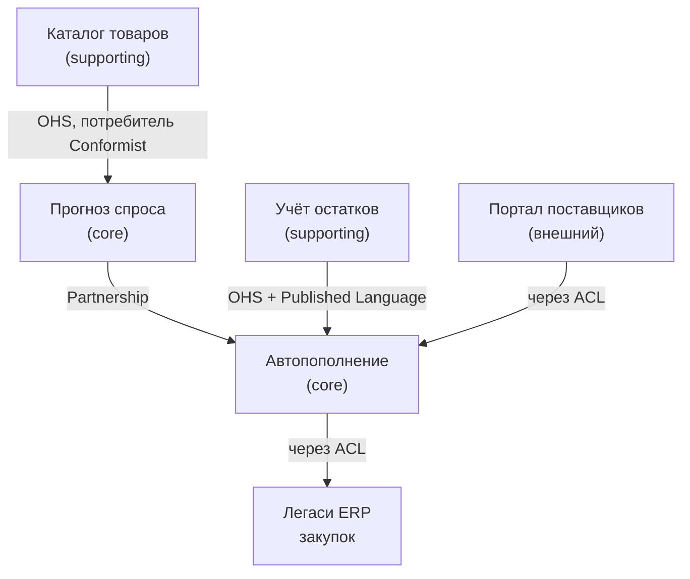

# 3.2 Стратегический DDD: поддомены, ограниченные контексты, карта контекстов

## Зачем это аналитику

Выделение доменных областей — самая «аналитическая» часть архитектуры. Разработчик может хорошо реализовать сервис, но где проходит граница, решает тот, кто понимает бизнес и язык предметной области. Ошибка в границах обходится дороже любой ошибки в коде: её исправляют переписыванием интеграций.

## Что понять

- [ ] **Поддомены (проблемное пространство)** — как устроен бизнес:
  - **core** — то, чем компания отличается от конкурентов, здесь сложная логика и своя разработка;
  - **supporting** — нужно бизнесу, но не даёт преимущества, простая логика;
  - **generic** — решено индустрией (биллинг, авторизация, почта): покупать или брать готовое.
  Тип поддомена определяет стратегию: где вкладывать лучшие силы, где покупать, где делать просто.
- [ ] **Ограниченный контекст (пространство решения)** — граница, внутри которой модель и язык однозначны. **Поддомен и контекст — разные вещи**: поддомен вы обнаруживаете, контекст проектируете. Один поддомен может быть реализован несколькими контекстами, и наоборот.
- [ ] **Единый язык (ubiquitous language)**: термины бизнеса, закреплённые в модели и коде. Главная эвристика границы — **одно слово начинает значить разное**. «Товар» для каталога, склада и бухгалтерии — три разные модели с разными атрибутами и жизненными циклами.
- [ ] **Другие эвристики границ**: разные эксперты предметной области; разные жизненные циклы сущности; разный темп изменений; разные требования к согласованности («должно быть атомарно» — признак, что это внутри одной границы); организационная граница команды.
- [ ] **Карта контекстов (context map)** — паттерны отношений:
  - Partnership, Shared Kernel — тесное сотрудничество;
  - Customer–Supplier, Conformist — одна сторона главная;
  - **Anticorruption Layer (ACL)** — защита своей модели от чужой (особенно от легаси и внешних систем);
  - Open Host Service + Published Language — публичный стабильный контракт;
  - Separate Ways — не интегрироваться вовсе.
- [ ] **Event Storming** как метод выявления: доменные события (оранжевые) → команды → акторы → политики → агрегаты → «горячие точки» → границы по кластерам событий. Big Picture против Process Level против Design Level.
- [ ] **Тактический DDD (обзорно)**: сущность, объект-значение, **агрегат как граница транзакционной согласованности** (одна транзакция — один агрегат), доменные события, репозиторий. Правило: инварианты внутри агрегата — строго, между агрегатами — в конечном счёте.
- [ ] **Связь с микросервисами**: сервис не больше ограниченного контекста, но контекст может состоять из нескольких сервисов. Микросервис ≠ агрегат.

## Урок

<!-- LESSON:START -->
Стратегический DDD отвечает на вопрос «где резать систему», а не «как писать классы». Тактические паттерны (агрегаты, репозитории) полезны, но без правильных границ они не спасают: можно идеально спроектировать агрегат внутри контекста, который смешивает две разные модели, и получить систему, где любое изменение задевает три команды. Поэтому начинать стоит со стратегии: понять, как устроен бизнес, затем спроектировать модели и их отношения.

### Проблемное пространство и пространство решения

В DDD полезно держать в голове два пространства.

**Проблемное пространство** — сам бизнес: чем компания зарабатывает, какие у неё виды деятельности, где она конкурирует. Здесь живут **поддомены (subdomains)**. Их не проектируют, их обнаруживают: поддомен «прогноз спроса» существует у розничной сети независимо от того, есть ли у неё под это софт или всё считают в таблицах.

**Пространство решения** — то, что мы строим: модели, сервисы, базы, интеграции. Здесь живут **ограниченные контексты (bounded contexts)**. Их проектируют, и это решение можно принять хорошо или плохо.

Путать эти пространства — одна из самых частых ошибок. Фраза «у нас поддомен платёжного шлюза» смешивает уровни: шлюз — это решение, а поддомен — «приём и исполнение платежей».

### Поддомены: куда вкладывать силы

Классификация поддоменов нужна не для красоты схемы, а для распределения денег и людей.

| Тип | Признак | Сложность логики | Стратегия |
|---|---|---|---|
| Core (основной) | Отличает компанию от конкурентов, приносит прибыль | Высокая, часто меняется | Своя разработка, лучшие люди, глубокое моделирование |
| Supporting (вспомогательный) | Нужен бизнесу, но не даёт преимущества | Низкая, в основном CRUD и простые правила | Делать просто, можно отдать на аутсорс или low-code |
| Generic (универсальный) | Задача уже решена индустрией одинаково для всех | Может быть высокой, но известной | Покупать, брать готовое или open source |

Обратите внимание на колонку сложности. Универсальный поддомен не обязательно простой: авторизация, биллинг или бухгалтерский учёт сложны, но решены многократно, и собственная реализация не даст преимущества. Вспомогательный — простой и специфичный для компании, поэтому готового решения может не быть, но и тратить на него сильных инженеров незачем.

Как определить core. Несколько вопросов, которые работают на практике:

- Если завтра конкурент получит этот компонент, потеряем ли мы преимущество?
- Готов ли бизнес заплатить за улучшение этой части, потому что это напрямую меняет выручку или издержки?
- Спорят ли о правилах этой области эксперты, меняются ли правила каждый квартал?
- Можно ли купить готовое решение, которое сделает то же самое не хуже?

Для розничной сети с сильной логистикой прогноз спроса и автопополнение — кандидат в core: точность прогноза прямо влияет на списания и упущенные продажи. Учёт остатков — supporting: без него нельзя, но у всех он примерно одинаковый. Кадровый учёт, бухгалтерия, рассылки — generic. Для банка, продающего ДБО юрлицам, core может оказаться скоринг и антифрод или скорость подключения клиента, а не сам перевод денег, который регламентирован и одинаков у всех.

Классификация не вечна. Поддомен, который был core, со временем может стать generic, когда рынок догонит, и наоборот: вспомогательная область может стать основной после смены стратегии. Поэтому классификацию стоит пересматривать, а не высекать в камне.

### Ограниченный контекст и единый язык

**Ограниченный контекст** — граница, внутри которой каждое слово модели имеет одно значение, а модель внутренне непротиворечива. Снаружи те же слова могут значить другое, и это нормально.

**Единый язык (ubiquitous language)** — словарь терминов, которым пользуются и эксперты, и разработчики, и который буквально отражён в коде: в именах классов, таблиц, событий, полей API. Язык един внутри контекста, а не во всей компании. Попытка построить один язык на всю организацию упирается в то, что у разных подразделений реально разные понятия.

Классический пример — «товар» в рознице:

- **Каталог**: товар — это карточка с названием, описанием, фотографиями, категорией, характеристиками для покупателя. Жизненный цикл: черновик, на модерации, опубликован, снят с продажи.
- **Склад**: товар — это складская единица с габаритами, весом, кратностью упаковки, условиями хранения, ячейкой. Жизненный цикл: принят, размещён, зарезервирован, отгружен.
- **Бухгалтерия**: товар — позиция номенклатуры со ставкой НДС, счётом учёта, себестоимостью и методом её расчёта.

Общий у них только идентификатор (артикул) и, возможно, название. Если слепить всё в одну модель, получится сущность со ста полями, которую меняют три команды, у которой три несовместимых набора статусов и которую боится трогать каждый.

Отсюда главная эвристика: **как только одно слово начинает значить разное для разных людей, между ними, скорее всего, граница контекста.** Верно и обратное: если в контексте появились два слова для одного понятия («клиент» и «контрагент» означают одно и то же), язык требует чистки.

Второе различие, которое нужно уметь объяснить: поддомен и контекст не соотносятся один к одному. Поддомен «управление запасами» может быть реализован двумя контекстами — «учёт остатков» и «резервирование». И наоборот, небольшой контекст «справочники» может обслуживать несколько вспомогательных поддоменов. Поддомен говорит, **что важно бизнесу**, контекст — **как мы разложили модели**.

### Эвристики для поиска границ

Одной эвристики мало, границы проводят по совокупности признаков.

1. **Разный смысл слов.** Разобрано выше, самый сильный сигнал.
2. **Разные эксперты.** Если правила одной части объясняет категорийный менеджер, а другой — начальник склада, и они не могут ответить на вопросы друг друга, это разные контексты.
3. **Разные жизненные циклы.** Заказ поставщику живёт от создания до приёмки; поставка на складе — от прибытия машины до размещения. Если у одной сущности два независимых набора статусов, это две сущности в двух контекстах.
4. **Разный темп изменений.** Правила расчёта страхового запаса меняются каждый месяц, справочник магазинов — раз в год. Смешивать их — значит заставлять стабильную часть проходить весь цикл релизов вместе с нестабильной.
5. **Требования к согласованности.** Если бизнес говорит «это должно меняться атомарно», данные должны быть внутри одной границы. Если допустима задержка в секунды или минуты, границу можно провести между ними.
6. **Организационная граница.** Команда, которая владеет моделью, — естественная граница. Закон Конвея работает в обе стороны: система повторяет структуру общения команд, а неудачная граница контекстов порождает постоянные межкомандные согласования.

Есть и антиэвристика: **не резать по сущностям данных**. Сервис «товары», сервис «клиенты», сервис «заказы» — это разрез по существительным, а не по поведению. Он приводит к тому, что любой бизнес-процесс требует синхронных вызовов во все сервисы сразу.

### Карта контекстов

Контексты не живут в изоляции: они обмениваются данными. **Карта контекстов (context map)** показывает, кто с кем связан и какой тип отношений между ними. Тип отношения — это не техника интеграции, а описание власти и зависимости между командами.

| Паттерн | Суть | Когда уместен |
|---|---|---|
| Partnership | Две команды согласуют изменения совместно, успех одной зависит от другой | Тесно связанные команды с хорошей коммуникацией |
| Shared Kernel | Общая часть модели или кода, которую обе стороны меняют только вместе | Маленькое общее ядро, одна организация, редкие изменения |
| Customer–Supplier | Поставщик учитывает потребности потребителя в своих планах | Потребитель важен поставщику и может влиять на его бэклог |
| Conformist | Потребитель принимает модель поставщика как есть | У потребителя нет рычагов, а модель поставщика приемлема |
| Anticorruption Layer | Потребитель переводит чужую модель в свою на границе | Чужая модель неудобна, нестабильна или это легаси |
| Open Host Service | Поставщик предоставляет стабильный публичный протокол для многих потребителей | Много потребителей, нельзя договариваться с каждым |
| Published Language | Документированный формат обмена: схема событий, отраслевой стандарт | Обычно вместе с Open Host Service |
| Separate Ways | Интеграции нет, каждая сторона решает задачу сама | Интеграция стоит дороже дублирования |

**Anticorruption Layer (ACL)** заслуживает отдельного внимания, потому что аналитик чаще всего именно его и описывает. ACL — слой перевода на стороне потребителя: он получает данные в чужих терминах и превращает их в термины своего контекста. Без него чужая модель просачивается внутрь: поля с чужими названиями, чужие статусы, чужие коды ошибок. Через год ваш контекст невозможно отделить от легаси.

ACL практически обязателен в трёх ситуациях: интеграция с легаси, модель которого вы не контролируете и не хотите тащить в новый код; интеграция с внешней системой (банк, платёжный провайдер, реестр доменов), которая может поменять формат без вашего согласия; постепенная миграция с монолита, когда новый контекст должен жить в своей модели, пока старый ещё работает.

Open Host Service — зеркальный паттерн со стороны поставщика: вместо того чтобы подстраиваться под каждого потребителя, он публикует один стабильный контракт. Потребитель такого контракта может быть конформистом, если язык хорош, или поставить свой ACL, если нет.

Пример карты для процесса автопополнения розничной сети:

Прогноз и автопополнение — два core-контекста, которые развиваются вместе, поэтому Partnership. Учёт остатков публикует события об изменениях в стабильном формате для всех. Прогноз принимает модель каталога как есть: ему нужны только категория и атрибуты, которые каталог и так хорошо описывает. Легаси ERP и внешний портал отделены ACL.

### Event Storming: как найти границы на практике

Event Storming — метод коллективного моделирования, предложенный Альберто Брандолини. Участники выкладывают процесс на длинную стену (или доску в Miro) стикерами разных цветов. Ценность метода в том, что он собирает в одной комнате людей, знания которых обычно разбросаны по отделам, и делает противоречия видимыми.

Основные элементы:

- **Доменное событие** (оранжевый стикер) — факт, значимый для бизнеса, в прошедшем времени: «Прогноз рассчитан», «Заказ поставщику отправлен», «Поставка принята».
- **Команда** — намерение, которое вызвало событие: «Отправить заказ поставщику».
- **Актор** — кто подаёт команду: роль человека или система.
- **Политика** — реакция на событие по правилу: «Когда остаток ниже точки заказа, сформировать заказ».
- **Агрегат** — то, что принимает команду и порождает событие, проверяя правила.
- **Модель чтения** — данные, на которые смотрит актор, принимая решение.
- **Внешняя система** — то, что вне нашего контроля.
- **Горячая точка (hot spot)** — вопрос, конфликт, незнание: «А что если поставщик привёз меньше?».

Цвета для остальных элементов в разных источниках немного различаются, важнее договориться о легенде в начале сессии.

Ход работы: сначала все пишут события хаотично, затем выстраивают их по времени, спорят о дублях и формулировках, отмечают горячие точки. Уже на этом этапе видно, где язык расходится: две группы называют одно событие по-разному или одно слово значит разное в разных частях стены.

Границы контекстов проявляются как **кластеры событий**: группы, внутри которых события тесно связаны одними и теми же понятиями и экспертами, а между группами связь тоньше — одно-два события, которые передаются через политику. Такое «событие на стыке» — будущая интеграция через публикацию события.

Три уровня сессий различаются целью и детализацией:

- **Big Picture** — весь бизнес-процесс или его крупный кусок, много участников из разных отделов. Цель — общее понимание, горячие точки, предварительные границы и поддомены. Команды и агрегаты обычно не рисуют.
- **Process Level** — один процесс подробно: события, команды, акторы, политики, модели чтения. Цель — договориться о поведении и правилах.
- **Design Level** — добавляются агрегаты и их инварианты. Цель — подготовить модель к реализации, это уже территория тактического DDD.

Аналитик, который провёл Big Picture хотя бы раз, лучше понимает, почему «прямо сейчас нарисуем микросервисы» — плохая идея: сначала нужно увидеть процесс целиком.

### Тактический DDD: только то, что нужно для стратегии

Тактические паттерны подробно разбираются отдельно, но несколько понятий нужны уже сейчас, потому что они влияют на границы.

- **Сущность (entity)** — объект с идентичностью, которая сохраняется при изменении атрибутов: заказ поставщику, платёжное поручение.
- **Объект-значение (value object)** — объект без идентичности, определяется значениями и неизменяем: сумма с валютой, период, адрес. Два объекта-значения с одинаковыми полями взаимозаменяемы.
- **Агрегат (aggregate)** — кластер сущностей и объектов-значений с одним корнем, через который идут все изменения. Агрегат — **граница транзакционной согласованности**: всё, что внутри, должно быть согласовано в момент фиксации транзакции.
- **Доменное событие** — факт изменения агрегата, который интересен другим.
- **Репозиторий** — способ загрузить и сохранить агрегат целиком, не раскрывая хранилище.

Правило «одна транзакция меняет один агрегат» кажется ограничением, но у него есть причины. Во-первых, агрегат — единица блокировки и конкурентного доступа: чем больше агрегатов в транзакции, тем больше конфликтов при параллельной работе. Во-вторых, агрегаты — единица распределения: сегодня два агрегата лежат в одной базе, завтра в разных сервисах, и транзакция через них станет распределённой. Если бизнес-правило требует атомарно менять два агрегата, это сигнал, что граница агрегата выбрана неверно, либо правило на самом деле допускает согласованность в конечном счёте.

Пример. Заказ поставщику с позициями — агрегат: инвариант «сумма заказа не больше лимита поставщика» проверяется внутри одной транзакции. Остаток на складе — другой агрегат. Когда поставка принята, остаток должен увеличиться, но ему не нужно делать это в той же транзакции, что закрытие заказа: событие «Поставка принята» обновит остатки через доли секунды. Инвариант внутри агрегата — строго, между агрегатами — в конечном счёте.

Агрегаты ссылаются друг на друга по идентификатору, а не держат объектные ссылки. Это делает их независимыми для хранения и распределения.

### Контексты и микросервисы

Связь между ограниченным контекстом и микросервисом формулируется как верхняя граница: **микросервис не должен быть больше ограниченного контекста**. Если сервис содержит две модели с разным языком, он наследует все проблемы смешанной модели.

Обратное не обязательно: контекст может быть реализован несколькими сервисами. Например, контекст «прогноз спроса» может состоять из сервиса расчёта (тяжёлые пакетные вычисления), сервиса выдачи прогнозов (быстрое чтение) и сервиса управления параметрами моделей. Язык у них один, команда одна, но требования к масштабированию и развёртыванию разные.

Нижняя граница — не агрегат. Микросервис на каждый агрегат дробит систему так, что простые операции превращаются в распределённые взаимодействия. «Микросервис равен агрегату» — утверждение, которое на собеседовании стоит опровергать.

Контекст — это ещё и граница владения: у контекста одна команда-владелец. Одна команда может владеть несколькими контекстами, но контекст, которым владеют две команды, почти всегда превращается в поле постоянных согласований.

### Разбор: нужен ли общий сервис товаров

Вернёмся к «товару», который нужен каталогу, складу и бухгалтерии. Соблазн — сделать сервис товаров со всеми атрибутами, которым пользуются все.

Что произойдёт. Сервис станет точкой зацепления: любое поле, нужное одному потребителю, меняется через команду сервиса. Модель разрастётся, набор статусов станет суммой трёх разных жизненных циклов. Требования к доступности сервиса станут максимальными из всех потребителей. Команда сервиса не будет экспертом ни в одной из трёх областей.

Более здоровое решение:

- Каждый контекст держит свою модель товара со своими атрибутами и своим жизненным циклом.
- Есть один источник идентичности — обычно каталог или справочник номенклатуры: он выдаёт артикул и базовые атрибуты и публикует события «товар создан», «товар изменён».
- Склад и бухгалтерия подписываются на события и дополняют модель своими атрибутами, которые ведут их эксперты.
- Если источник — легаси-система, между ней и новыми контекстами ставится ACL.

Это не догма: если атрибутов мало и они действительно общие, небольшой справочник с Open Host Service может быть разумным компромиссом. Ключевой вопрос — чьи эксперты отвечают за атрибут и чей жизненный цикл он описывает.

### Типичные ошибки

- **Границы по сущностям данных**: сервис клиентов, сервис товаров, сервис заказов. Разрез по существительным даёт болтливые синхронные интеграции и распределённый монолит.
- **Отождествление поддомена и контекста**: «у нас пять поддоменов, значит, пять сервисов». Поддомен описывает бизнес, контекст — решение, и соответствие не один к одному.
- **Одинаковые усилия на всё**: собственная разработка авторизации или биллинга при том, что core-область делают стажёры. Классификация поддоменов существует, чтобы этого не допускать.
- **Интеграция с легаси без ACL**: чужие статусы и коды попадают в новые модели, и миграция никогда не заканчивается.
- **Shared Kernel как способ сэкономить**: общая библиотека моделей для всех сервисов, которую никто не может менять без согласования с каждым.
- **Микросервис на каждый агрегат**: простые операции превращаются в распределённые транзакции.
- **Event Storming ради красивой доски**: сессия без горячих точек и без вывода о границах ничего не дала.

### Как говорить об этом на собеседовании

Senior-уровень показывает умение объяснить, **почему** граница проходит именно здесь, и назвать цену альтернативы. Хорошая структура ответа: сначала поддомены и их тип, затем контексты и эвристики, по которым проведены границы, затем тип отношений между контекстами и где стоит ACL. Упоминайте, что классификация поддоменов определяет, где покупать, а где разрабатывать, — это показывает мышление в терминах бизнеса, а не технологий.

Полезно иметь готовый пример из опыта в обезличенном виде: «в процессе автопополнения слово "заказ" означало три разные вещи — рекомендацию системы, документ закупщика и документ поставщику; мы развели их по контекстам, и интеграция с ERP пошла через слой перевода». Если спросят про соотношение контекстов и сервисов — формулируйте через верхнюю границу: сервис не больше контекста, контекст может быть несколькими сервисами, агрегат — не единица развёртывания.

### Коротко

- Поддомены обнаруживают в бизнесе, контексты проектируют в решении; соответствие между ними не один к одному.
- Core — туда лучшие силы; supporting — делать просто; generic — покупать или брать готовое.
- Главный сигнал границы — одно слово значит разное; дополняют его эксперты, жизненные циклы, темп изменений, согласованность, структура команд.
- Карта контекстов описывает отношения власти и зависимости; ACL защищает модель от легаси и внешних систем.
- Event Storming выявляет границы как кластеры событий и делает противоречия видимыми через горячие точки.
- Агрегат — граница транзакционной согласованности: одна транзакция — один агрегат, между агрегатами — согласованность в конечном счёте.
- Микросервис не больше контекста, контекст может быть несколькими сервисами, агрегат — не микросервис.
<!-- LESSON:END -->

## Читать дальше

- Khononov, *Learning Domain-Driven Design*: часть I целиком (гл. 1 «Analyzing Business Domains», гл. 2 «Discovering Domain Knowledge», гл. 3 «Managing Domain Complexity», гл. 4 «Integrating Bounded Contexts»); гл. 12 «EventStorming»; гл. 14 «Microservices». Главная книга модуля.
- Vaughn Vernon, *Domain-Driven Design Distilled* — короткий обзор (есть русский перевод «Предметно-ориентированное проектирование: самое основное»).
- Alberto Brandolini, *Introducing EventStorming* (Leanpub) — первоисточник по методу.
- [DDD Crew на GitHub](https://github.com/ddd-crew): шаблоны Bounded Context Canvas, Context Mapping, Core Domain Charts.
- Эрик Эванс, «Предметно-ориентированное проектирование» — классика, но тяжёлая. Читать выборочно часть IV «Стратегическое проектирование».

На system-design.space:

- [Learning Domain-Driven Design (short summary)](https://system-design.space/chapter/learning-ddd-book/)
- [Доменно-ориентированная микросервисная архитектура Uber (DOMA)](https://system-design.space/chapter/introducing-domain-oriented-microservice-architecture/)

## Практика

1. Провести Event Storming в одиночку (Miro или FigJam) для обезличенного процесса, который знаешь досконально: например, «от прогноза спроса до поставки на полку» или «от заявки клиента до исполнения платежа». Минимум 30 доменных событий.
2. Найти в процессе три термина, которые значат разное в разных частях. Провести по ним границы контекстов.
3. Классифицировать поддомены на core / supporting / generic и обосновать каждый выбор.
4. Нарисовать карту контекстов с типами отношений. Отметить, где нужен ACL.
5. Для одного контекста заполнить Bounded Context Canvas.

## Вопросы для самопроверки

1. Чем поддомен отличается от ограниченного контекста?
2. Назовите пять эвристик, по которым можно провести границу контекста.
3. Как определить core-поддомен и почему это важно для распределения ресурсов?
4. Что такое Anticorruption Layer и когда он обязателен?
5. Как Event Storming помогает найти границы?
6. Что такое агрегат и почему одна транзакция должна менять только один агрегат?
7. Один ограниченный контекст — один микросервис? Обоснуйте.
8. «Товар» нужен каталогу, складу и бухгалтерии. Делать общий сервис товаров или нет?

## Заметки

<!-- Свои формулировки, ошибки, ссылки. -->
