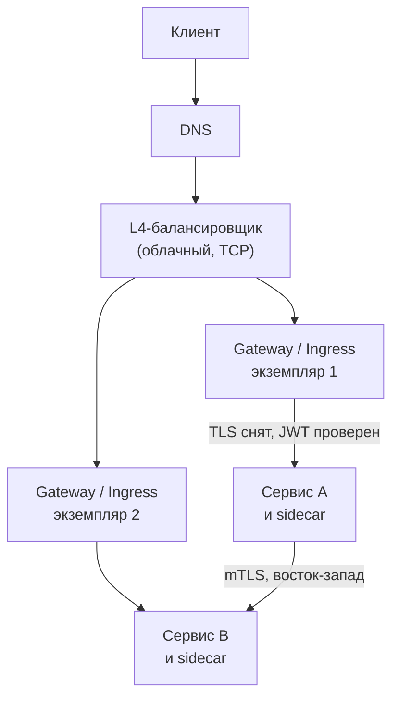
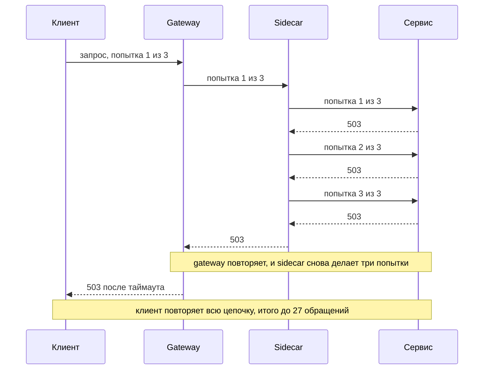

# 3.3 Сеть: модель OSI, балансировщик, API Gateway, service mesh

## Зачем это аналитику

На схемах развёртывания постоянно рисуют «балансировщик», «gateway», «ingress», «sidecar», и часто путают их. Архитектор должен понимать, какой компонент что видит в трафике и какие решения способен принять, иначе требования уходят не туда: rate limiting на L4-балансировщик или маршрутизация по пути в сервис.

## Что понять

- [ ] **Модель OSI и стек TCP/IP** — практический минимум:

  | Уровень OSI | Что | Примеры | Что «видит» устройство на этом уровне |
  |---|---|---|---|
  | L7 Прикладной | Протоколы приложений | HTTP, gRPC, DNS, SMTP | URL, заголовки, методы, тело, cookie, JWT |
  | L6 Представления | Кодирование, шифрование | TLS (условно), сжатие | На практике TLS относят к L6 или «между L4 и L7» |
  | L5 Сеансовый | Сессии | Практически растворён в L7 | — |
  | L4 Транспортный | Доставка между процессами | TCP, UDP, QUIC (поверх UDP) | IP и порты, флаги TCP. Содержимое не видит |
  | L3 Сетевой | Маршрутизация между сетями | IP, ICMP | IP-адреса |
  | L2 Канальный | Кадры в сегменте | Ethernet, VLAN, ARP | MAC-адреса |
  | L1 Физический | Сигнал | Кабель, радио | Биты |

- [ ] **Балансировщик нагрузки** распределяет трафик между **экземплярами одного сервиса**:
  - **L4** (TCP / UDP): решение по IP и порту, не разбирает HTTP, быстрый, может не терминировать TLS (TLS passthrough). Примеры: IPVS, HAProxy в режиме tcp, AWS NLB, MetalLB.
  - **L7** (HTTP): терминирует TLS, маршрутизирует по хосту, пути, заголовкам, умеет sticky sessions, health checks на уровне HTTP. Примеры: nginx, HAProxy http, Envoy, AWS ALB, Kubernetes Ingress-контроллер.
  - Алгоритмы: round robin, least connections, взвешенные, consistent hashing. Health checks: активные и пассивные (outlier detection).
- [ ] **API Gateway** — всегда L7 и решает **прикладные** задачи на границе системы: единая точка входа, маршрутизация **между разными сервисами**, аутентификация (проверка токена), грубая авторизация, rate limiting и квоты по клиентам, трансформация запросов и ответов, агрегация нескольких вызовов, версионирование, API-ключи, биллинг. Примеры: Kong, KrakenD, Apigee, Tyk, Spring Cloud Gateway, AWS API Gateway.
- [ ] **Главное различие**: балансировщик решает, **какой экземпляр** обслужит запрос; gateway решает, **пускать ли запрос** и **в какой сервис**, и что с ним сделать по пути. Они не взаимоисключающие: типичная цепочка — L4-балансировщик → L7 ingress / gateway → сервис (внутри может быть ещё балансировка на стороне клиента или в mesh).
- [ ] **Reverse proxy** — общее понятие, которое реализуют и L7-балансировщик, и gateway.
- [ ] **Backend for Frontend (BFF)**: отдельный gateway под каждый тип клиента (веб, мобильное приложение, партнёры), потому что им нужны разные агрегации и разные контракты.
- [ ] **Service mesh** (Istio, Linkerd): sidecar-прокси (Envoy) рядом с каждым сервисом управляет **трафиком восток-запад** (между сервисами): mTLS, ретраи, таймауты, circuit breaking, трассировка — без изменения кода. Gateway — трафик **север-юг** (снаружи внутрь). Цена mesh: сложность, задержка, ресурсы.
- [ ] **Service discovery**: клиентское (клиент получает список экземпляров и балансирует сам) и серверное (через балансировщик); DNS в Kubernetes, Service и kube-proxy (L4).
- [ ] **Kubernetes-срез**: Service (L4, ClusterIP / NodePort / LoadBalancer), Ingress и Gateway API (L7).
- [ ] **Где что настраивать**: TLS-терминация, проверка JWT, rate limiting, ретраи — какой уровень за что отвечает, и почему ретраи одновременно на mesh, в gateway и в клиенте — это «шторм ретраев».

## Урок

<!-- LESSON:START -->
Балансировщик, reverse proxy, ingress, API gateway и sidecar технически могут быть одним и тем же продуктом: nginx или Envoy способны сыграть почти любую из этих ролей. Поэтому различать их нужно не по названию продукта, а по двум вопросам: **на каком уровне компонент разбирает трафик** и **какую задачу он решает в архитектуре**. От ответа зависит, куда направлять требования: rate limiting по клиенту, проверку токена, маршрутизацию по версии API, ретраи.

### Что компонент видит в трафике

Таблица уровней OSI в разделе выше — справочник. Для архитектора из неё важны два уровня: L4 и L7.

**L4 (транспортный)** оперирует соединениями TCP и датаграммами UDP. Устройство на этом уровне видит IP-адреса отправителя и получателя, порты, флаги TCP. Всё, что лежит в полезной нагрузке, для него просто байты. Даже если трафик не зашифрован, L4-устройство не разбирает HTTP: у него нет понятия «запрос», «путь», «заголовок».

**L7 (прикладной)** разбирает протокол приложения. Чтобы прочитать URL, заголовок `Authorization` или cookie, компонент должен собрать поток байтов в HTTP-сообщения, а если трафик идёт по HTTPS — сначала **терминировать TLS**, то есть расшифровать его своим сертификатом и ключом.

Отсюда ответ на вопрос, почему L4-балансировщик не может маршрутизировать по URL. Причин две. Во-первых, решение о направлении принимается при установке соединения, когда никакого HTTP-запроса ещё нет — первым приходит TCP-рукопожатие. Во-вторых, при HTTPS путь запроса зашифрован, и L4-устройство без ключа его не увидит. Единственное, что можно извлечь из начала TLS-сессии без расшифровки, — имя хоста из расширения SNI, и некоторые L4-прокси используют его для маршрутизации в режиме TLS passthrough. Но это имя хоста, а не путь.

Есть следствие, которое часто упускают. **L4-балансировщик распределяет соединения, а не запросы.** Для HTTP/1.1 с короткими соединениями разницы почти нет. Для gRPC и HTTP/2, где клиент держит одно долгоживущее соединение и мультиплексирует в нём тысячи запросов, L4-балансировка даёт перекос: весь поток от клиента уходит на один экземпляр. Поэтому для gRPC нужна L7-балансировка (прокси или mesh) или балансировка на стороне клиента.

### Балансировщик нагрузки

Балансировщик распределяет трафик между **экземплярами одного сервиса**, которые взаимозаменяемы. Его главные решения: какой экземпляр выбрать и какой экземпляр исключить как неисправный.

**L4-балансировщик** быстрый и дешёвый по ресурсам, не хранит состояние HTTP, может пропускать TLS насквозь до сервиса. Используется на входе в кластер (облачные сетевые балансировщики), внутри Kubernetes (kube-proxy) и для не-HTTP протоколов: базы данных, брокеры, SMTP.

**L7-балансировщик** терминирует TLS, маршрутизирует по хосту, пути и заголовкам, умеет sticky sessions по cookie, делает HTTP-проверки здоровья (запрос к `/health` и анализ кода ответа), добавляет заголовки вроде `X-Forwarded-For`, чтобы сервис знал реальный адрес клиента. Платит за это ресурсами процессора на расшифровку и разбор.

Полезная деталь для практики: за L4-прокси, работающим в режиме обычного проксирования, сервис видит в качестве адреса клиента адрес прокси, а не пользователя, и никаких добавленных заголовков. За L7-прокси адрес клиента передаётся в заголовке, если это настроено. Для L4 существуют отдельные механизмы передачи адреса (например, PROXY protocol), но их должны поддерживать обе стороны.

Алгоритмы выбора экземпляра:

| Алгоритм | Как работает | Когда подходит | Слабое место |
|---|---|---|---|
| Round robin | По кругу | Однородные экземпляры, похожие запросы | Не учитывает текущую нагрузку |
| Weighted round robin | По кругу с весами | Экземпляры разной мощности, канареечный выпуск | Веса статичны |
| Least connections | Туда, где меньше активных соединений | Запросы разной длительности | Нужен учёт состояния в балансировщике |
| Least response time / power of two choices | Выбор лучшего из нескольких по метрике | Неоднородная задержка | Сложнее в настройке |
| Consistent hashing | Экземпляр по хэшу ключа (клиент, сессия, id) | Локальные кэши, привязка к экземпляру | Неравномерность при малом числе узлов, «горячие» ключи |

Consistent hashing важен для систем с локальным состоянием: при добавлении или удалении экземпляра перераспределяется только небольшая доля ключей, а не все.

**Проверки здоровья** бывают активными и пассивными. Активные — балансировщик сам периодически опрашивает экземпляры. Пассивные (outlier detection) — балансировщик наблюдает за реальными ответами и временно исключает экземпляр, который возвращает ошибки или отвечает слишком медленно. Пассивные проверки быстрее реагируют на частичные отказы, когда `/health` отвечает «всё хорошо», а бизнес-запросы падают.

### Reverse proxy, L7-балансировщик и API gateway

**Reverse proxy** — общее понятие: сервер, который принимает запросы от клиентов от имени бэкендов и пересылает их дальше. Клиент не знает о бэкендах. L7-балансировщик и API gateway — оба разновидности reverse proxy, различаются задачами.

**API gateway** работает на L7 и решает **прикладные** задачи на границе системы:

- единая точка входа и маршрутизация **между разными сервисами** по пути и версии;
- аутентификация: проверка JWT или API-ключа, отказ до того, как запрос дойдёт до сервиса;
- грубая авторизация: доступен ли клиенту этот продукт или scope;
- rate limiting и квоты по клиенту или тарифу;
- трансформация запросов и ответов, перевод между протоколами;
- агрегация нескольких внутренних вызовов в один внешний ответ;
- учёт вызовов для биллинга и аналитики, портал разработчика.

Главное различие в одной фразе: **балансировщик решает, какой экземпляр обслужит запрос; gateway решает, пускать ли запрос, в какой сервис и что с ним сделать по пути.** Балансировщик ничего не знает о клиенте как о бизнес-сущности, gateway знает: у клиента есть тариф, ключ, квота.

Один продукт может выполнять обе роли: gateway обычно умеет балансировать между экземплярами выбранного сервиса. Но роли остаются разными, и это важно для требований. «Ограничить партнёра сотней запросов в минуту» — требование к gateway, потому что только он знает, кто этот партнёр. «Распределять трафик на экземпляры с наименьшим числом соединений» — требование к балансировщику.

Нужен ли балансировщик, если есть gateway? Как правило, да: gateway сам должен быть отказоустойчивым, то есть работать в нескольких экземплярах, и перед ними нужен кто-то, кто распределит трафик. Обычно это L4-балансировщик облака или кластера.

### Типичная цепочка

Клиент по DNS получает адрес L4-балансировщика. Тот распределяет соединения между экземплярами gateway. Gateway терминирует TLS, проверяет токен и лимиты, выбирает сервис по пути и экземпляр сервиса. Внутри кластера сервисы вызывают друг друга через sidecar-прокси mesh, если он есть, или через Service Kubernetes.

### Backend for Frontend

Один gateway на всех клиентов со временем превращается в узкое место: веб-приложению нужны одни агрегации, мобильному — другие (меньше данных, меньше вызовов, другой формат), партнёрскому API — стабильный версионированный контракт и строгие квоты. Изменения для одного клиента ломают других, а команда gateway становится очередью.

**Backend for Frontend (BFF)** — отдельный gateway или тонкий сервис под каждый тип клиента, которым часто владеет команда этого клиента. BFF агрегирует внутренние вызовы в форму, удобную конкретному интерфейсу.

Пример из банка для юрлиц. Веб-кабинет показывает на главной экране список счетов с остатками, последние платёжные поручения и уведомления — BFF для веба делает три внутренних вызова и отдаёт один ответ. Мобильное приложение показывает только остатки и поручения на подпись — его BFF отдаёт укороченную модель. Интеграция host-to-host для бухгалтерских систем клиентов идёт через отдельный партнёрский контур: аутентификация по сертификату, строгий rate limiting, версионированный контракт, который не меняется при каждом релизе веба. Три клиента — три разных контракта и три разных темпа изменений.

Одного gateway недостаточно, когда у клиентов разные контракты, разные требования к безопасности и разный темп изменений. Цена BFF — дублирование части логики агрегации и больше компонентов в эксплуатации.

### Север-юг и восток-запад

Трафик **север-юг (north-south)** — снаружи внутрь системы и обратно: пользователи, партнёры, внешние системы. Его обслуживают балансировщики на входе, ingress и gateway. Здесь главные задачи — безопасность периметра, аутентификация внешних клиентов, лимиты, публичный контракт.

Трафик **восток-запад (east-west)** — между сервисами внутри системы. В микросервисной архитектуре его обычно намного больше, чем внешнего: один внешний запрос порождает несколько внутренних вызовов. Здесь задачи другие: взаимная аутентификация сервисов, надёжность вызовов (таймауты, ретраи, circuit breaking), наблюдаемость цепочек.

### Service mesh

**Service mesh** выносит сетевую логику межсервисных вызовов из кода в инфраструктуру. В классической схеме рядом с каждым экземпляром сервиса работает sidecar-прокси (в Istio это Envoy, в Linkerd — собственный лёгкий прокси), через который проходит весь входящий и исходящий трафик. Плоскость управления (control plane) раздаёт прокси конфигурацию: маршруты, политики, сертификаты.

Что даёт mesh без изменения кода:

- mTLS между сервисами с автоматической выдачей и ротацией сертификатов, то есть шифрование и взаимная аутентификация восток-запад;
- L7-балансировку между экземплярами, включая gRPC;
- таймауты, ретраи, circuit breaking, outlier detection;
- метрики, распределённую трассировку (при условии, что сервисы пробрасывают заголовки контекста трассировки);
- управление трафиком: канареечные выпуски, разделение по весам, зеркалирование;
- политики доступа: какой сервис может вызывать какой.

Цена:

- **сложность**: ещё одна распределённая система, которую нужно понимать, обновлять и отлаживать; ошибка в конфигурации mesh может положить всё взаимодействие;
- **задержка**: каждый вызов проходит через два дополнительных прокси — исходящий у клиента и входящий у сервера;
- **ресурсы**: sidecar у каждого экземпляра потребляет память и процессор, при сотнях подов это заметно.

Чтобы снизить эти издержки, в новых версиях некоторых mesh появились режимы без sidecar в каждом поде, где часть функций выполняет общий прокси на узле. Детали зависят от продукта и версии.

Mesh оправдан, когда сервисов много, команды разные, а требования к безопасности и наблюдаемости единые. Для десятка сервисов одной команды его цена часто выше пользы.

### Service discovery и Kubernetes

Экземпляры сервисов появляются и исчезают, их адреса меняются. **Service discovery** отвечает на вопрос «куда слать запрос».

- **Клиентское обнаружение**: клиент получает из реестра список экземпляров и сам выбирает один. Меньше промежуточных узлов, гибкие алгоритмы, но логика балансировки должна быть в каждом клиенте (библиотека или sidecar).
- **Серверное обнаружение**: клиент обращается к стабильному адресу балансировщика, а тот знает актуальный список экземпляров. Клиент проще, но появляется ещё один узел в пути.

В Kubernetes это устроено так:

- **Service** даёт группе подов стабильное имя в DNS кластера и виртуальный IP (тип ClusterIP). Компонент kube-proxy на каждом узле программирует правила перенаправления, и соединение на виртуальный IP уходит на один из подов. Это **L4**: балансируются соединения.
- **NodePort** открывает сервис на порту каждого узла, **LoadBalancer** дополнительно заказывает внешний балансировщик у облака или у решения вроде MetalLB.
- **Headless Service** не имеет виртуального IP: DNS возвращает адреса всех подов, и клиент балансирует сам. Так делают, например, для gRPC с клиентской балансировкой.
- **Ingress** — ресурс для L7-маршрутизации входящего HTTP-трафика по хосту и пути; работу выполняет ingress-контроллер (nginx, HAProxy, Envoy и другие).
- **Gateway API** — более новый и выразительный набор ресурсов для той же задачи: разделяет роли инфраструктуры (класс шлюза, сам шлюз) и прикладных команд (маршруты), поддерживает не только HTTP. Название совпадает с «API gateway», но это не замена продукта управления API: квоты, ключи и портал разработчика в нём не предусмотрены.

### Где что настраивать

| Функция | Где обычно | Почему |
|---|---|---|
| TLS для внешних клиентов | Входной L7: ingress или gateway | Нужно разобрать HTTP для маршрутизации и проверки токена |
| TLS между сервисами | Mesh (mTLS) или сами сервисы | Периметр не единственная защита, трафик внутри тоже шифруют |
| Проверка JWT | Gateway и сервис | Gateway отсекает мусор, сервис принимает решения по данным |
| Грубая авторизация (scope, продукт) | Gateway | Не зависит от бизнес-данных |
| Тонкая авторизация (доступ к конкретному счёту) | Сервис | Требует бизнес-данных, которых у gateway нет |
| Rate limiting по клиенту | Gateway | Только он знает клиента и тариф |
| Защита сервиса от перегрузки | Сервис или mesh | Лимит по ёмкости конкретного сервиса |
| Таймауты | Все уровни, согласованно | Внешний таймаут должен быть больше суммы внутренних |
| Ретраи | Один уровень | Иначе умножение запросов |

Про JWT стоит уметь рассуждать. Проверка только на gateway означает, что внутренние сервисы доверяют любому запросу из сети. Если злоумышленник или ошибочный сервис окажется внутри периметра, защиты нет. Проверка только в сервисах означает, что мусорные и просроченные токены нагружают весь контур и каждая команда реализует проверку заново. Разумный подход — проверять на gateway подпись, срок действия и аудиторию, а в сервисе снова проверять токен (это дёшево: подпись проверяется локально по публичному ключу) и принимать авторизационные решения по его claims и своим данным. Поверх этого mTLS в mesh подтверждает, что вызов пришёл от легитимного сервиса.

### Шторм ретраев

Ретрай помогает пережить кратковременный сбой. Но когда ретраи настроены на нескольких уровнях сразу, они перемножаются. Пусть клиент делает до трёх попыток, gateway — до трёх, sidecar — до трёх. Если нижний сервис перегружен и отвечает ошибками, один пользовательский запрос превращается в 3 × 3 × 3 = 27 обращений к нему. Перегруженный сервис получает кратно больше нагрузки именно тогда, когда ему хуже всего, и не может восстановиться.

Как избежать:

- ретраить на **одном** уровне, обычно ближайшем к источнику сбоя (mesh или клиентская библиотека), остальные уровни настраивать без ретраев;
- ретраить только **идемпотентные** операции или запросы с ключом идемпотентности; повтор платёжного поручения без такого ключа — прямой путь к двойному списанию;
- экспоненциальная задержка со случайным разбросом (jitter), чтобы повторы не приходили синхронной волной;
- бюджет ретраев: повторы не больше заданной доли от общего трафика;
- согласованные таймауты: каждый внутренний уровень должен укладываться во время, оставшееся у внешнего, иначе внешний уровень уже сдался, а внутренний ещё работает впустую.

### Типичные ошибки

- **Rate limiting по клиенту на L4-балансировщике.** L4 не знает клиента как бизнес-сущность, он видит только IP. За NAT одного офиса могут быть сотни пользователей, а один клиент может приходить с разных адресов.
- **Маршрутизация по пути внутри сервиса вместо gateway или ingress.** Сервис превращается в прокси для чужих запросов.
- **Gateway с бизнес-логикой.** Агрегация и трансформация допустимы, но правила расчёта и проверки бизнес-инвариантов в gateway делают его вторым монолитом.
- **Проверка токена только на периметре.** Внутренний трафик без аутентификации — это доверие по факту нахождения в сети.
- **Ретраи на всех уровнях и для неидемпотентных операций.** Шторм ретраев и дубли операций.
- **L4-балансировка для gRPC.** Долгоживущие соединения дают перекос нагрузки на отдельные экземпляры.
- **Service mesh «потому что так модно»** для небольшой системы одной команды: сложность и задержка без соразмерной пользы.

### Как говорить об этом на собеседовании

Сильный ответ строится вокруг вопроса «что компонент видит и какое решение способен принять». Балансировщик видит соединения или запросы и выбирает экземпляр; gateway видит клиента, токен и продукт и решает, пускать ли запрос и куда. Рисуйте цепочку от DNS до сервиса и отмечайте на ней, где терминируется TLS, где проверяется токен, где стоят лимиты и на каком уровне ретраи. Это сразу показывает, что вы думаете о системе целиком.

Уровень senior выдают нюансы с последствиями: L4 балансирует соединения, поэтому gRPC требует L7 или клиентской балансировки; ретраи перемножаются по уровням; JWT проверяют и на границе, и в сервисе по разным причинам; mesh стоит задержки и ресурсов, и его нужно обосновывать. Пример из опыта: как разделили контуры для веб-кабинета, мобильного приложения и host-to-host интеграции банка, и почему партнёрский контур получил свой gateway с отдельными лимитами.

### Коротко

- L4 видит адреса и порты и балансирует соединения; L7 разбирает HTTP и может маршрутизировать по хосту, пути и заголовкам, но должен терминировать TLS.
- Балансировщик выбирает экземпляр одного сервиса; gateway решает, пускать ли запрос, в какой сервис и что с ним сделать.
- Типичная цепочка: L4 на входе, затем L7 ingress или gateway, затем сервисы, внутри — Service Kubernetes или mesh.
- BFF нужен, когда у разных клиентов разные контракты, требования безопасности и темп изменений.
- Gateway отвечает за север-юг, mesh — за восток-запад; mesh даёт mTLS, надёжность и наблюдаемость ценой сложности, задержки и ресурсов.
- Service Kubernetes — это L4; Ingress и Gateway API — L7.
- JWT проверяют на gateway и в сервисе; тонкую авторизацию делает сервис.
- Ретраи — на одном уровне, только для идемпотентных операций, с задержкой, разбросом и бюджетом.
<!-- LESSON:END -->

## Читать дальше

- Richardson, *Microservices Patterns*: гл. 8 «External API patterns» (API Gateway, BFF).
- Newman, *Building Microservices* (2nd ed.): гл. 5 «Implementing Microservice Communication» — разделы о gateway и service mesh.
- [microservices.io: API Gateway / BFF](https://microservices.io/patterns/apigateway.html), [Client-side discovery](https://microservices.io/patterns/client-side-discovery.html), [Server-side discovery](https://microservices.io/patterns/server-side-discovery.html).
- Документация Envoy: [What is Envoy](https://www.envoyproxy.io/docs/envoy/latest/intro/what_is_envoy) — хорошее объяснение L3/L4 и L7 фильтров.
- NGINX: статьи «What Is Layer 4 Load Balancing?» и «What Is Layer 7 Load Balancing?».
- Документация Kubernetes: [Service](https://kubernetes.io/docs/concepts/services-networking/service/), [Gateway API](https://kubernetes.io/docs/concepts/services-networking/gateway/).

На system-design.space:

- [Модель OSI](https://system-design.space/chapter/osi-model/)
- [Балансировка трафика](https://system-design.space/chapter/load-balancing/)
- [Алгоритмы балансировки трафика](https://system-design.space/chapter/load-balancing-algorithms/)
- [Обнаружение сервисов](https://system-design.space/chapter/service-discovery/)
- [Архитектура сервисной сетки (service mesh)](https://system-design.space/chapter/service-mesh-architecture/)
- [Визуализация: Архитектура API Gateway](https://system-design.space/visuals/api-gateway-architecture/)
- [Лаба: Балансировка при медленном и отказавшем узле](https://system-design.space/labs/load-balancing-node-failure/)

## Практика

1. В Docker Compose поднять два экземпляра простого HTTP-сервиса (например, `traefik/whoami`) и перед ними nginx:
   - как L4-балансировщик (блок `stream {}`);
   - как L7-балансировщик (блок `http {}` с `upstream`) и маршрутизацией по пути `/a` и `/b` на разные сервисы.
   Посмотреть, какие заголовки видит сервис в каждом случае.
2. Поставить перед ними KrakenD или Kong (без базы данных, декларативная конфигурация) и настроить проверку JWT из Keycloak (модуль [1.4](../01-http-rest-security/1.4-oauth-oidc-jwt.md)) и rate limiting.
3. Нарисовать схему развёртывания знакомой системы (обезличенно): где L4, где L7, где gateway, где терминируется TLS, где проверяется токен.

## Вопросы для самопроверки

1. Чем API Gateway отличается от балансировщика нагрузки? Может ли один продукт быть и тем и другим?
2. На каком уровне OSI работает L4-балансировщик и почему он не может маршрутизировать по URL?
3. Нужен ли балансировщик, если есть gateway? Нарисуйте типовую цепочку.
4. Что такое BFF и когда одного gateway недостаточно?
5. Чем трафик «север-юг» отличается от «восток-запад»? Что за что отвечает?
6. Что даёт service mesh и какую цену за это платят?
7. Где проверять JWT: на gateway, в сервисе или и там и там? Почему?
8. Почему ретраи, настроенные сразу в клиенте, mesh и gateway, опасны?

## Заметки

<!-- Свои формулировки, ошибки, ссылки. -->
