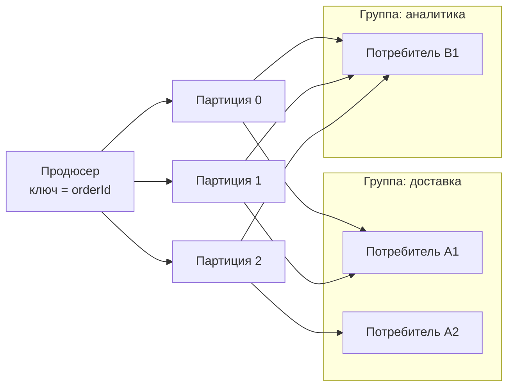

# 3.4 Коммуникация: синхронная, асинхронная, брокеры, гарантии доставки

## Зачем это аналитику

Выбор между «вызовем REST» и «отправим событие в Kafka» определяет доступность, согласованность и сложность всей системы. В требованиях к интеграции через брокер должны быть описаны гарантии доставки, порядок, идемпотентность потребителя, обработка ошибок и схема сообщений. Без этого получаются дубли, потерянные события и «почему у нас заказ в двух статусах».

## Что понять

- [ ] **Синхронное взаимодействие** (REST, gRPC): простое, но создаёт зацепление по времени — если сервис B недоступен, A тоже не может работать. Доступность цепочки = произведение доступностей её звеньев (три сервиса по 99,9% → около 99,7%).
- [ ] **Асинхронное взаимодействие** (сообщения): развязка по времени, буферизация пиков, но согласованность в конечном счёте и сложнее отладка.
- [ ] **Команда, событие, запрос**: команда адресована конкретному получателю и может быть отклонена; событие — факт, случившийся в прошлом, у него может быть сколько угодно подписчиков. Event notification (тонкое событие) против Event-carried state transfer (событие с полным состоянием).
- [ ] **Очередь против лога**:
  - RabbitMQ (очередь): сообщение удаляется после подтверждения, конкурирующие потребители, гибкая маршрутизация (exchanges), dead letter queue.
  - Kafka (распределённый лог): сообщения хранятся по времени, потребители читают со своим смещением (offset), можно перечитать историю, порядок гарантирован **только внутри партиции**.
- [ ] **Kafka на уровне архитектора**: топик, партиция, ключ сообщения (определяет партицию и тем самым порядок), consumer group (одна партиция — один потребитель в группе), фиксация offset, `acks=all`, реплики и `min.insync.replicas`, retention, log compaction.
- [ ] **Гарантии доставки**:
  - at-most-once — может потеряться;
  - at-least-once — может задвоиться (стандарт де-факто);
  - exactly-once — в общем случае недостижимо между системами; Kafka даёт exactly-once только внутри Kafka (транзакции продюсера + read_committed). На практике это at-least-once + **идемпотентный потребитель**.
- [ ] **Идемпотентный потребитель**: таблица обработанных `message_id` в той же транзакции, что и изменение данных; или естественная идемпотентность операции (upsert, установка статуса вместо инкремента).
- [ ] **Порядок сообщений**: когда он важен (изменения одного заказа) и как его обеспечить (ключ партиции = id сущности). Что ломает порядок: ретраи, параллельная обработка, повторная отправка из DLQ.
- [ ] **Ошибки обработки**: ретраи с задержкой, retry-топики, dead letter queue, «ядовитые» сообщения (poison messages), ручной разбор.
- [ ] **Схемы и эволюция контрактов**: Avro, Protobuf, JSON Schema; Schema Registry; обратная и прямая совместимость. AsyncAPI как OpenAPI для событий.
- [ ] **Хореография против оркестрации** — предварительно, детально в модуле [3.5](3.5-data-patterns.md).

## Урок

<!-- LESSON:START -->
Интеграция между сервисами — это всегда выбор между двумя видами зацепления. Синхронный вызов связывает стороны во времени: обе должны работать одновременно. Асинхронное сообщение развязывает их во времени, но переносит сложность в другие места: порядок, дубли, ошибки, эволюция схем. Задача архитектора — осознанно выбрать, где какой вид зацепления допустим, и описать правила так, чтобы разработчики продюсера и потребителя поняли их одинаково.

### Синхронное взаимодействие

REST и gRPC просты для понимания: запрос, ответ, код ошибки. Их главный недостаток — **зацепление по времени (temporal coupling)**. Если сервис B недоступен или медленный, сервис A, который его вызывает, тоже не может выполнить операцию или отвечает медленно.

Доступность синхронной цепочки — произведение доступностей её звеньев. Три сервиса по 99,9% дают 0,999 × 0,999 × 0,999 ≈ 0,997, то есть около 99,7%. В пересчёте на месяц это уже не 43 минуты простоя, а около двух часов. Каждое новое звено в цепочке ухудшает общий результат, а задержки складываются.

Синхронный вызов уместен, когда:

- пользователю нужен ответ прямо сейчас, и без него продолжить нельзя (проверить остаток средств перед подписанием платёжного поручения);
- операция — чтение актуальных данных, и устаревшая копия недопустима;
- взаимодействие редкое и простое, а издержки брокера не окупаются.

### Асинхронное взаимодействие

Отправитель кладёт сообщение в брокер и продолжает работу. Получатель обрабатывает его, когда может. Брокер буферизует пики: если потребитель медленнее продюсера, сообщения копятся, а не теряются.

Цена:

- **согласованность в конечном счёте**: между событием и его отражением у потребителя проходит время, и интерфейс должен это учитывать;
- **сложнее отладка**: нет единого стека вызовов, нужна трассировка по идентификаторам корреляции;
- **новые классы ошибок**: дубли, нарушение порядка, ядовитые сообщения, отставание потребителя;
- **брокер — ещё одна критичная система** в эксплуатации.

| Ситуация | Скорее синхронно | Скорее асинхронно |
|---|---|---|
| Пользователь ждёт результата | Да | Нет, если можно показать «принято в обработку» |
| Много получателей одного факта | Нет, вызывать каждого — зацепление | Да, публикация события |
| Пиковые нагрузки у отправителя | Нет, пик ударит по получателю | Да, брокер сгладит |
| Нужна строгая актуальность данных | Да | Нет |
| Длительная обработка | Нет, таймауты | Да |

### Команда, событие, запрос

Сообщения различаются по смыслу, и это различие важно для контракта.

- **Команда (command)** — просьба что-то сделать, адресованная конкретному получателю: «Зарезервировать товар», «Исполнить платёж». Получатель может её отклонить. Имя в повелительном наклонении. Обычно у команды один обработчик.
- **Событие (event)** — факт, который уже произошёл: «Заказ создан», «Платёж исполнен». Отклонить факт нельзя, его можно только проигнорировать. Имя в прошедшем времени. Отправитель не знает, кто и сколько подписчиков его получат.
- **Запрос (query)** — просьба вернуть данные без изменения состояния.

Путаница команды и события — частая причина плохих контрактов. Если сервис заказов публикует «событие» `ReserveStock`, он на самом деле управляет складом, только скрыто. Если склад поменяет правила резервирования, отправитель об этом не узнает. Честнее либо отправить явную команду в очередь склада и ждать ответа, либо публиковать факт `OrderPlaced` и оставить складу решение, что с ним делать.

События бывают тонкими и толстыми.

**Event notification** — тонкое событие: только идентификатор и тип. Потребитель, которому нужны детали, идёт за ними синхронным запросом к источнику. Схема простая и редко меняется, но под нагрузкой источник получает волну запросов, и зацепление по времени возвращается.

**Event-carried state transfer** — событие несёт состояние, достаточное потребителю. Потребитель строит у себя локальную копию и не обращается к источнику. Цена — большие сообщения, более сложная эволюция схемы и копии данных в нескольких местах.

```json
{
  "eventId": "7f3c9a2e-5b1d-4e8a-9c0f-2d6b8e1a4f70",
  "eventType": "OrderPaid",
  "occurredAt": "2026-03-14T10:15:30Z",
  "orderId": "ORD-100245",
  "version": 4,
  "payload": {
    "amount": "15490.00",
    "currency": "RUB",
    "paymentMethod": "CARD"
  }
}
```

Поле `version` здесь — порядковый номер изменения заказа, оно пригодится при обсуждении порядка.

### Очередь против лога

RabbitMQ и Kafka часто сравнивают как два брокера, но это разные модели.

**Очередь (RabbitMQ)**. Продюсер публикует сообщение в exchange, который по правилам маршрутизации раскладывает его по очередям. Потребители забирают сообщения из очереди, после подтверждения (ack) сообщение удаляется. Несколько потребителей одной очереди конкурируют: каждое сообщение получает один из них. Если нужно, чтобы сообщение получили несколько независимых систем, для каждой создаётся своя очередь. Есть встроенный механизм dead letter exchange: отклонённые или просроченные сообщения уходят в отдельную очередь.

**Лог (Kafka)**. Топик — это журнал, разбитый на партиции, в который сообщения только дописываются. Сообщения не удаляются после чтения, а хранятся по политике retention. Каждый потребитель сам помнит, до какого места дочитал (offset). Независимых групп потребителей может быть сколько угодно, и они не мешают друг другу. Можно перемотать offset назад и перечитать историю — например, чтобы построить новую витрину или исправить ошибку обработки.

| Критерий | RabbitMQ | Kafka |
|---|---|---|
| Модель | Очередь, сообщение удаляется после ack | Лог, сообщение хранится по retention |
| Повторное чтение | Нет для классических очередей (есть в отдельном типе RabbitMQ Streams) | Да, перемоткой offset |
| Маршрутизация | Гибкая: exchanges, ключи, заголовки | По топику и ключу партиции |
| Порядок | В пределах очереди при одном потребителе | В пределах партиции |
| Масштабирование потребителей | Конкурирующие потребители одной очереди | Не больше потребителей в группе, чем партиций |
| DLQ | Встроенная (dead letter exchange) | Реализуется клиентом или фреймворком |
| Типичные задачи | Очереди задач, команды, сложная маршрутизация | Потоки событий, интеграция многих потребителей, аналитика, event sourcing |

Выбор: если нужны задания для рабочих процессов, приоритеты, гибкая маршрутизация и сообщение имеет смысл только до обработки — RabbitMQ. Если события — это факты, которые нужны многим потребителям, в том числе будущим, с возможностью перечитать историю и высокой пропускной способностью — Kafka.

### Kafka на уровне архитектора



Понятия, которые архитектор должен уверенно использовать:

- **Топик** — именованный поток сообщений одного смысла, например события заказов.
- **Партиция** — упорядоченная часть топика. Единица параллелизма и единица порядка.
- **Ключ сообщения** определяет партицию: по умолчанию партиция вычисляется из хэша ключа. Все сообщения с одинаковым ключом попадают в одну партицию и читаются в порядке записи. Сообщения без ключа распределяются по партициям без гарантии порядка между ними.
- **Consumer group** — группа потребителей, которые делят партиции топика между собой. Каждая партиция в группе читается ровно одним потребителем. Если потребителей больше, чем партиций, лишние простаивают. При подключении или падении потребителя происходит ребалансировка: партиции перераспределяются.
- **Фиксация offset (commit)** — потребитель сообщает, до какого места обработал. От момента фиксации зависит гарантия доставки.
- **Реплики**: у каждой партиции есть лидер и последователи на других брокерах. Коэффициент репликации три — типичный выбор для продакшена.
- **`acks=all`** — продюсер считает запись успешной, только когда её подтвердили все синхронизированные реплики. Вместе с **`min.insync.replicas`** (например, 2 при трёх репликах) это означает: запись не пройдёт, если синхронизированных реплик меньше двух, но и не потеряется при падении одного брокера.
- **Retention** — хранение по времени или размеру; старые сегменты удаляются независимо от того, прочитаны ли они.
- **Log compaction** — альтернативная политика: для каждого ключа хранится как минимум последнее значение. Топик превращается в снимок актуального состояния, например справочника товаров. Сообщение со значением null (tombstone) означает удаление ключа.

Важное следствие: **увеличение числа партиций меняет соответствие ключей партициям**. Сообщения одного заказа до и после изменения могут оказаться в разных партициях, и порядок между ними нарушится. Число партиций стоит выбирать с запасом заранее.

### Гарантии доставки

Гарантии определяются тем, когда фиксируется факт обработки относительно самой обработки.

- **At-most-once** — не более одного раза. Потребитель фиксирует offset до обработки: если он упадёт посередине, сообщение будет потеряно. Допустимо для метрик и телеметрии.
- **At-least-once** — не менее одного раза. Потребитель фиксирует offset после обработки: если он упадёт между обработкой и фиксацией, сообщение придёт снова. Дубли неизбежны. Это стандарт де-факто. Со стороны продюсера аналог — повтор отправки при отсутствии подтверждения, который тоже может дать дубль.
- **Exactly-once** — ровно один раз. Между произвольными системами в общем случае недостижимо: нельзя атомарно изменить базу данных потребителя и зафиксировать offset в брокере, если у них нет общей транзакции.

Что Kafka даёт на самом деле. Идемпотентный продюсер устраняет дубли, возникающие при повторной отправке в одну партицию. Транзакции продюсера позволяют атомарно записать сообщения в несколько партиций и зафиксировать offset прочитанного. Потребители с уровнем изоляции `read_committed` не видят сообщения незавершённых и отменённых транзакций. Вместе это даёт exactly-once для цепочки «прочитать из Kafka — обработать — записать в Kafka». Как только в цепочке появляется внешняя база данных или HTTP-вызов, гарантия заканчивается.

Поэтому на практике формула такая: **at-least-once плюс идемпотентный потребитель**. Результат для бизнеса неотличим от exactly-once: сообщение может прийти дважды, но эффект будет один.

Отдельная проблема на стороне продюсера — двойная запись: сервис сохраняет заказ в базу и отправляет событие в брокер, и одна из двух операций может не пройти. Её решают паттерном Transactional Outbox, который разбирается в модуле 3.5.

### Идемпотентный потребитель

Есть два подхода.

**Естественная идемпотентность** — операция спроектирована так, что повтор ничего не меняет. Установка статуса вместо перехода («статус = оплачен»), upsert по ключу вместо вставки, запись абсолютного значения остатка вместо инкремента. Если событие несёт «остаток стал 120», его можно применить сколько угодно раз. Если «остаток уменьшился на 5» — нельзя.

**Учёт обработанных сообщений** — таблица с идентификаторами уже обработанных сообщений, запись в которую делается **в той же транзакции**, что и изменение бизнес-данных. Если транзакция откатилась, отметки нет, и повтор обработает сообщение заново. Если зафиксировалась — повтор будет распознан.

```sql
BEGIN;

INSERT INTO processed_messages (message_id, consumer, processed_at)
VALUES ($1, 'stock-service', now())
ON CONFLICT (message_id, consumer) DO NOTHING;

-- если вставлено 0 строк, сообщение уже обработано:
-- приложение делает ROLLBACK и фиксирует offset

UPDATE stock_balance
SET quantity = quantity - $2
WHERE store_id = $3 AND sku = $4;

COMMIT;
```

Требования, которые аналитик должен записать в постановку: какой идентификатор считается ключом идемпотентности (идентификатор сообщения от продюсера, а не offset, потому что при повторной отправке продюсером offset будет другим); сколько хранить отметки (не меньше, чем максимальный срок, за который возможен повтор); что делать с дублем (молча подтвердить, записать метрику).

### Порядок сообщений

Порядок важен, когда сообщения описывают изменения **одной сущности**: создание, оплата, отмена одного заказа. Порядок между разными заказами обычно не важен, и требовать глобального порядка — значит отказаться от параллелизма.

Способ обеспечить порядок в Kafka: **ключ сообщения = идентификатор сущности**. Все события заказа попадают в одну партицию и читаются одним потребителем группы последовательно.

Что ломает порядок даже при правильном ключе:

- **ретраи продюсера** без идемпотентного режима, когда несколько запросов находятся в полёте: повторённый пакет может записаться после следующего;
- **параллельная обработка внутри потребителя**: если потребитель читает партицию и раздаёт сообщения пулу потоков, порядок теряется, если не распределять по потокам тоже по ключу;
- **retry-топики**: упавшее сообщение уходит на повтор, а следующие за ним события той же сущности обрабатываются раньше;
- **повторная отправка из DLQ**: разобранное вручную сообщение возвращается, когда сущность уже ушла вперёд;
- **изменение числа партиций** — разобрано выше.

Страховка на стороне потребителя — версия сущности в событии. Потребитель хранит последнюю применённую версию и игнорирует события с версией не выше неё. Для событий с полным состоянием это решает проблему целиком: применяется только самая свежая версия.

### Разбор: заказ в двух статусах

Интернет-магазин. Сервис заказов публикует события `OrderPaid` и `OrderCancelled`. Сервис доставки по ним создаёт или отменяет отгрузку. Жалоба: заказ отменён, а курьер приехал.

Разбор показывает три причины. Продюсер отправлял события без ключа, и два события одного заказа попали в разные партиции, которые читали разные экземпляры доставки. Отмена обработалась первой: отгрузки ещё не было, отменять нечего, событие подтверждено. Затем пришла оплата и создала отгрузку. Вдобавок оплата один раз падала из-за таймаута базы и уходила в retry-топик, что тоже переставляло события.

Исправление: ключ партиции — `orderId`; в событиях поле `version`, потребитель игнорирует устаревшие версии; при отмене заказа, для которого ещё нет отгрузки, доставка запоминает отмену, чтобы более раннее событие оплаты уже не создало отгрузку; для ошибок, которые могут пройти при повторе, — повтор с задержкой на месте, с остановкой чтения партиции, а не отправка в retry-топик.

### Ошибки обработки

Ошибки делятся на **временные** (недоступна база, таймаут внешнего сервиса) и **постоянные** (невалидные данные, нарушение схемы, баг в коде для конкретного случая). Временные лечатся повтором, постоянные — нет.

Инструменты:

- **Повтор на месте с задержкой.** Потребитель не фиксирует offset и повторяет обработку с экспоненциальной задержкой. Порядок сохраняется, но вся партиция стоит, пока сообщение не пройдёт.
- **Retry-топики.** Упавшее сообщение перекладывается в отдельный топик с задержкой (иногда в несколько ступеней), основная партиция продолжает работу. Пропускная способность сохраняется, порядок по сущности может нарушиться.
- **Dead letter queue.** После исчерпания попыток сообщение уходит в отдельную очередь или топик вместе с информацией об ошибке. Там его разбирает человек или автоматический процесс, после исправления сообщение можно вернуть.
- **Ядовитое сообщение (poison message)** — то, которое стабильно роняет потребитель. Без ограничения попыток оно блокирует партицию навсегда или бесконечно крутится в повторах. Поэтому число попыток всегда конечно, а постоянные ошибки распознаются сразу и отправляются в DLQ без повторов.

Для DLQ нужны требования: кто разбирает, в какой срок, какой алерт срабатывает при появлении сообщений, как вернуть сообщение и как при этом не нарушить порядок. DLQ без владельца — это просто место, где тихо теряются данные.

Мониторинг отставания потребителя (consumer lag) — основная метрика здоровья асинхронной интеграции: растущий lag означает, что потребитель не успевает или остановился на ядовитом сообщении.

### Схемы и эволюция контрактов

Продюсер и потребители развёртываются независимо, поэтому схема события должна меняться так, чтобы не ломать тех, кто ещё не обновился. Сообщения в Kafka к тому же хранятся долго: новый потребитель может читать события, записанные по схеме годичной давности.

Форматы: **Avro** и **Protobuf** — бинарные, со строгой схемой и явными правилами совместимости; **JSON Schema** — для JSON, проще для отладки, но крупнее по объёму. **Schema Registry** хранит версии схем, проверяет совместимость новой версии при регистрации и позволяет не передавать схему в каждом сообщении, а только ссылку на неё.

Виды совместимости:

- **Обратная (backward)** — потребитель с новой схемой читает данные, записанные по старой. Позволяет сначала обновить потребителей.
- **Прямая (forward)** — потребитель со старой схемой читает данные, записанные по новой. Позволяет сначала обновить продюсера.
- **Полная (full)** — обе сразу.

Практические правила, которые почти всегда безопасны: добавлять только необязательные поля со значением по умолчанию; не удалять и не переименовывать обязательные поля; не менять тип и смысл существующего поля; в Protobuf не переиспользовать номера удалённых полей. Если нужно несовместимое изменение — новая версия события или новый топик, период параллельной публикации и план отключения старой версии.

**AsyncAPI** делает для асинхронных интерфейсов то же, что OpenAPI для HTTP: машиночитаемо описывает каналы (топики, очереди), сообщения, их схемы, операции отправки и получения, привязки к конкретному брокеру. В спецификации события стоит зафиксировать не только схему, но и ключ партиции, гарантии, правила эволюции и владельца.

### Хореография и оркестрация

Когда процесс затрагивает несколько сервисов, есть два способа им управлять. **Хореография** — каждый сервис реагирует на события других и публикует свои, центрального координатора нет. Слабое зацепление, но процесс целиком не виден ни в одном месте. **Оркестрация** — отдельный компонент отправляет команды участникам и ведёт состояние процесса. Процесс явный, но оркестратор знает обо всех. Подробный разбор, включая саги и компенсации, — в модуле 3.5.

### Типичные ошибки

- **Команда, замаскированная под событие.** Отправитель фактически управляет получателем, но контракт выглядит как публикация факта.
- **События без ключа партиции** для сущностей, где важен порядок изменений.
- **Вера в exactly-once** без идемпотентного потребителя: «у нас Kafka с транзакциями, дублей не будет», хотя обработка пишет во внешнюю базу.
- **Неидемпотентные операции в потребителе**: инкременты и вставки без проверки дублей.
- **Бесконечные ретраи** без различения временных и постоянных ошибок; ядовитое сообщение останавливает партицию.
- **DLQ без владельца и алертов.**
- **Изменение схемы без проверки совместимости**: удалили поле, и потребители, которые ещё не обновились, начали падать.

### Как говорить об этом на собеседовании

На вопрос «REST или Kafka» senior отвечает не выбором технологии, а вопросами: нужен ли ответ сейчас, сколько получателей у факта, какая допустима задержка согласованности, что будет при недоступности получателя. Затем называет цену выбранного варианта: для асинхронного — дубли, порядок, ошибки, эволюция схем, мониторинг lag.

Сильный сигнал — умение сформулировать требования к интеграции через брокер как чек-лист: тип сообщения (команда или событие), ключ партиции и что он гарантирует, гарантия доставки и как потребитель обеспечивает идемпотентность, стратегия ошибок и владелец DLQ, формат схемы и правила совместимости. Про exactly-once лучше сказать точно: в Kafka он есть для цепочки внутри Kafka, а между системами его заменяет at-least-once плюс идемпотентность. Хороший пример из практики — разбор инцидента с нарушенным порядком событий и то, как его исправили ключом и версией.

### Коротко

- Синхронный вызов создаёт зацепление по времени, доступность цепочки — произведение доступностей звеньев.
- Асинхронность развязывает сервисы во времени ценой согласованности в конечном счёте, дублей и сложной отладки.
- Команда адресована и может быть отклонена, событие — факт для любого числа подписчиков.
- RabbitMQ — очередь с удалением после подтверждения и гибкой маршрутизацией; Kafka — лог с хранением, offset и повторным чтением.
- Порядок в Kafka — только внутри партиции; ключ = идентификатор сущности, версия в событии как страховка.
- Exactly-once между системами недостижим; стандарт — at-least-once плюс идемпотентный потребитель с отметкой в той же транзакции.
- Ошибки: временные повторяем ограниченно с задержкой, постоянные — сразу в DLQ, у DLQ есть владелец и алерт.
- Схемы меняются только совместимо: новые поля необязательные и со значением по умолчанию, проверка в Schema Registry.
<!-- LESSON:END -->

## Читать дальше

- Richardson, *Microservices Patterns*: гл. 3 «Interprocess communication in a microservice architecture».
- Newman, *Building Microservices* (2nd ed.): гл. 4 «Microservice Communication Styles».
- Kleppmann, *DDIA* (1-е изд.): гл. 4 «Encoding and Evolution» (схемы и совместимость), гл. 11 «Stream Processing».
- Martin Fowler, [What do you mean by "Event-Driven"?](https://martinfowler.com/articles/201701-event-driven.html) — четыре разных смысла слова «событийный».
- Документация Kafka: [Design](https://kafka.apache.org/documentation/#design) — разделы о гарантиях доставки. Альтернатива: *Kafka: The Definitive Guide* (2nd ed.), главы о продюсерах, потребителях и надёжной доставке.
- [AsyncAPI](https://www.asyncapi.com/docs) — Getting Started.

На system-design.space:

- [Паттерны межсервисной коммуникации](https://system-design.space/chapter/inter-service-communication-patterns/)
- [Событийно-ориентированная архитектура](https://system-design.space/chapter/event-driven-architecture/)
- [Kafka: The Definitive Guide, 2nd Edition (краткий обзор)](https://system-design.space/chapter/kafka-book/)
- [Надёжная доставка событий: Outbox, Inbox, CDC и порядок](https://system-design.space/chapter/reliable-event-delivery/)

## Практика

1. Поднять Kafka в Docker (образ `apache/kafka`, режим KRaft без ZooKeeper) и Kafka UI. Создать топик с тремя партициями, отправить сообщения с ключами и без, посмотреть распределение по партициям.
2. Запустить двух потребителей в одной группе и в разных группах, сравнить поведение. Остановить одного и посмотреть ребалансировку.
3. Написать AsyncAPI-спецификацию на два события обезличенного процесса («заказ создан», «заказ оплачен»): ключ, схема, гарантии, правила эволюции.
4. Описать требования к потребителю: идемпотентность, порядок, ретраи, DLQ, мониторинг отставания (consumer lag).

## Вопросы для самопроверки

1. Когда синхронный вызов лучше асинхронного сообщения, и наоборот?
2. Чем команда отличается от события?
3. Чем Kafka отличается от RabbitMQ по модели работы? Когда что выбрать?
4. Как в Kafka гарантировать порядок событий по одному заказу?
5. Что такое exactly-once, и почему на практике делают at-least-once + идемпотентность?
6. Как спроектировать идемпотентного потребителя?
7. Что делать с сообщением, которое стабильно падает при обработке?
8. Как менять схему события, не ломая потребителей?

## Заметки

<!-- Свои формулировки, ошибки, ссылки. -->
