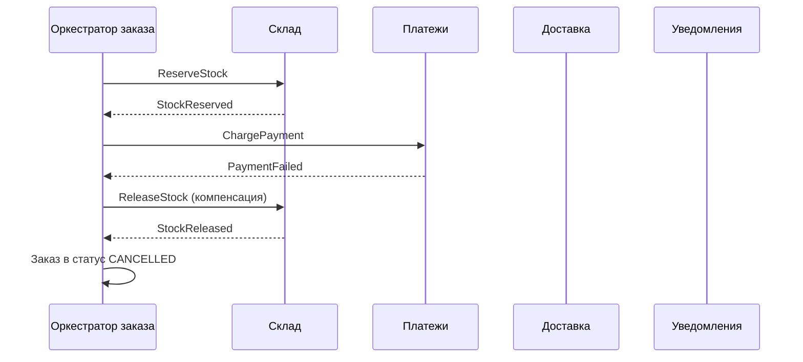
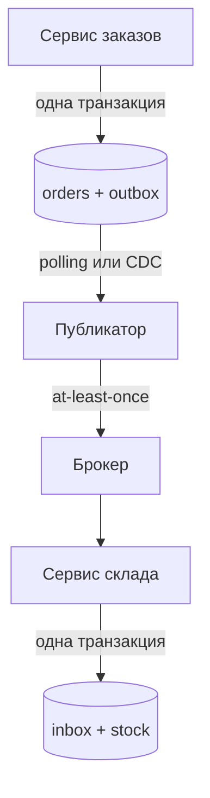

# 3.5 Данные: database per service, Saga, Transactional Outbox, CQRS

## Зачем это аналитику

Как только данные разнесены по сервисам, исчезает транзакция, которая «откатит всё сразу». Бизнес-процесс, затрагивающий несколько сервисов, приходится проектировать как последовательность локальных шагов с компенсациями. Это прямая работа аналитика: какие шаги, что считается успехом, что откатывается, что нельзя откатить, что видит пользователь в промежуточных состояниях.

## Что понять

- [ ] **Database per service**: сервис владеет своими данными, другие получают их только через API или события. Почему общая база — антипаттерн (зацепление по схеме, невозможность независимого развёртывания), и какие компромиссы допустимы (отдельные схемы на одном кластере).
- [ ] **Почему не 2PC / XA**: блокировки на время всей транзакции, координатор как единая точка отказа, большинство брокеров и NoSQL не поддерживают. Теорема CAP и PACELC — на уровне «при сетевом разделении выбираем между согласованностью и доступностью, а без разделения — между задержкой и согласованностью».
- [ ] **Saga** — последовательность локальных транзакций, каждая публикует событие или команду для следующего шага; при ошибке выполняются **компенсирующие транзакции** в обратном порядке.
  - **Хореография**: сервисы реагируют на события друг друга. Просто для 2–3 шагов, но логика процесса размазана, сложно понять текущее состояние и циклические зависимости.
  - **Оркестрация**: отдельный оркестратор (конечный автомат) отдаёт команды и ждёт ответов. Процесс виден в одном месте, проще мониторинг и изменения. Инструменты: Temporal, Camunda / Zeebe, собственный оркестратор на таблице состояний.
- [ ] **Типы шагов саги**: компенсируемые; **поворотный (pivot)** — точка невозврата, после которой сага идёт только вперёд; повторяемые (retriable) — гарантированно завершаются. Правильный порядок: сначала компенсируемые, потом pivot, потом повторяемые.
- [ ] **Компенсация ≠ откат**: это новая бизнес-операция (возврат денег, отмена резерва, письмо с извинениями). Некоторые действия компенсировать нельзя (отправленное SMS) — их ставят после pivot.
- [ ] **Отсутствие изоляции в саге** и контрмеры: семантическая блокировка (статус `PENDING`), коммутативные обновления, пессимистичный порядок шагов, перечитывание значения, версия.
- [ ] **Transactional Outbox**: проблема двойной записи («записали в БД, но упали до отправки в Kafka» или наоборот). Решение: событие пишется в таблицу `outbox` в **той же** локальной транзакции, отдельный процесс публикует его в брокер (polling publisher или CDC через Debezium). Гарантия — at-least-once, значит потребитель идемпотентен.
- [ ] **Inbox / идемпотентный приёмник** — зеркальный паттерн на стороне потребителя.
- [ ] **CQRS**: разделение модели записи и модели чтения. Когда нужно (сложные запросы по данным нескольких сервисов, разная нагрузка на чтение и запись) и какая цена (задержка обновления проекций, их перестроение).
- [ ] **API Composition** против CQRS-проекции для запросов, собирающих данные нескольких сервисов.
- [ ] **Event Sourcing** (обзорно): состояние как последовательность событий. Не путать с event-driven архитектурой; нужен редко.

## Урок

<!-- LESSON:START -->
### Исходная точка: у каждого сервиса свои данные

Принцип «база данных на сервис» (database per service) означает, что таблицы сервиса — его внутренняя деталь реализации, как приватные поля класса. Другие сервисы получают данные только через опубликованный контракт: синхронный API или события. Прямой `SELECT` из чужой таблицы запрещён, даже если технически доступен.

Почему общая база — антипаттерн:

- **Зацепление по схеме.** Схема таблицы становится неявным публичным контрактом. Переименовать колонку в сервисе заказов нельзя, потому что её читает отчётность, склад и ещё кто-то, о ком никто не помнит.
- **Нет независимого развёртывания.** Миграция схемы требует синхронного релиза нескольких команд — ровно то, от чего микросервисы должны были избавить.
- **Нет изоляции нагрузки.** Тяжёлый аналитический запрос соседа блокирует или замедляет транзакционную нагрузку.
- **Размытое владение данными.** Если в таблицу пишут три сервиса, непонятно, кто отвечает за инварианты. Бизнес-правило «резерв не больше остатка» проверяется в одном месте, а обходится в другом.

Допустимые компромиссы существуют. Несколько сервисов могут жить на одном кластере PostgreSQL в разных схемах или базах с раздельными ролями: это экономит на эксплуатации, при этом логическое владение соблюдено — роль сервиса А физически не имеет прав на схему сервиса Б. Цена компромисса — общий ресурс (CPU, диск, соединения, окно обслуживания) и общая точка отказа. Для небольшой системы это разумно; принцип нарушается не общим сервером, а общими таблицами.

Следствие принципа неприятное: бизнес-операция, затрагивающая несколько сервисов, больше не помещается в одну ACID-транзакцию.

### Почему не распределённая транзакция

Классический ответ на «несколько ресурсов в одной транзакции» — двухфазная фиксация (two-phase commit, 2PC), в Java-мире оформленная как XA. Координатор сначала спрашивает всех участников «готовы?» (фаза prepare), каждый участник записывает изменения, держит блокировки и отвечает «да»; затем координатор рассылает commit.

Проблемы в контексте микросервисов:

- **Блокировки держатся на время всей транзакции**, включая сетевые задержки до самого медленного участника. Пропускная способность падает, растёт вероятность взаимных блокировок.
- **Координатор — единая точка отказа.** Если он упал после prepare, но до commit, участники остаются в «сомнительном» (in-doubt) состоянии с удерживаемыми блокировками, пока координатор не восстановится.
- **Поддержка ограничена.** Kafka, большинство NoSQL-хранилищ и HTTP-API партнёров в XA не участвуют. Платёжный шлюз не будет держать для вас prepare.
- **Доступность перемножается.** Транзакция успешна, только если доступны все участники одновременно.

Фоном здесь служат теорема CAP и её расширение PACELC. Практическая формулировка: при сетевом разделении (P) система выбирает между согласованностью (C) и доступностью (A); а в штатном режиме (Else) — между задержкой (L) и согласованностью (C). Микросервисная архитектура обычно выбирает доступность и низкую задержку, платя за это согласованностью «в конечном счёте» (eventual consistency). Саги — способ сделать эту согласованность управляемой.

### Сага: цепочка локальных транзакций

Сага (saga) — бизнес-операция, разбитая на последовательность локальных транзакций, каждая в своём сервисе и своей базе. Каждый шаг фиксируется сразу и сообщает о результате событием или ответом на команду. Если шаг не удался, уже выполненные шаги отменяются **компенсирующими транзакциями** (compensating transactions) в обратном порядке. Идея восходит к статье Гарсиа-Молины и Салем 1987 года, где речь шла о длинных транзакциях в одной СУБД.

Возьмём оформление заказа в интернет-магазине: создать заказ → зарезервировать товар → списать оплату → подтвердить доставку → уведомить клиента.

#### Хореография

При хореографии (choreography) нет центра управления. Каждый сервис подписан на события других и знает, что делать дальше: сервис заказов публикует `OrderCreated`, склад резервирует и публикует `StockReserved`, платежи на это списывают деньги и публикуют `PaymentCompleted`, и так далее. При ошибке оплаты платежи публикуют `PaymentFailed`, склад снимает резерв, заказ переходит в `CANCELLED`.

Плюсы: мало инфраструктуры, слабая связность — издатель не знает подписчиков. Для процесса из двух-трёх шагов это оправдано.

Минусы проявляются с ростом:

- логика процесса размазана по сервисам, её нельзя прочитать в одном месте;
- на вопрос «на каком шаге заказ 1234» отвечает только сборка событий из нескольких топиков;
- легко получить циклические зависимости: склад слушает платежи, платежи слушают склад;
- изменение порядка шагов — согласованный релиз нескольких команд.

#### Оркестрация

При оркестрации (orchestration) есть отдельный компонент — оркестратор, по сути конечный автомат, хранящий состояние каждого экземпляра саги. Он отправляет команды участникам («зарезервируй», «спиши») и переходит в следующее состояние по их ответам.



Процесс виден в одном месте, текущее состояние каждого заказа — строка в таблице оркестратора, мониторинг и изменения проще. Цена — ещё один компонент и риск превратить оркестратор в «божественный сервис», который знает о бизнес-логике участников больше, чем должен. Правило: оркестратор знает **порядок** шагов, а **правила** каждого шага остаются у участников.

Реализации: движки рабочих процессов вроде Temporal или Camunda / Zeebe, либо собственный оркестратор на таблице состояний (`saga_id`, `state`, `step`, `updated_at`, `payload`) с фоновым обработчиком таймаутов. Для двух-трёх саг в системе собственный вариант часто проще; при десятках процессов с таймерами, ручными шагами и версиями процессов движок окупается.

| Критерий | Хореография | Оркестрация |
|---|---|---|
| Где описан процесс | Нигде целиком, в подписках сервисов | В оркестраторе |
| Текущее состояние экземпляра | Собирается из событий | Одна запись |
| Связность | Слабая, но неявная | Явная, к оркестратору |
| Подходит для | 2–3 шага, стабильный процесс | Длинные и меняющиеся процессы |
| Главный риск | Циклы и потеря понимания процесса | Логика участников утекает в оркестратор |

### Типы шагов и их порядок

Не все шаги саги равноправны. Удобная классификация из книги Ричардсона:

- **Компенсируемые (compensatable)** — шаги, которые можно отменить: резерв товара (снять резерв), холдирование суммы на карте (снять холд).
- **Поворотный (pivot)** — точка невозврата. Если он успешен, сага обязана дойти до конца; если нет — откатывается. Обычно это шаг, после которого отмена либо невозможна, либо бизнес-неприемлема: фактическое списание денег, передача заказа в сборку.
- **Повторяемые (retriable)** — шаги после pivot, которые гарантированно завершаются при достаточном числе повторов: подтвердить доставку, отправить уведомление, начислить бонусы. Они не должны иметь бизнес-причин для отказа, только технические.

Отсюда правило порядка: **сначала компенсируемые, потом pivot, потом повторяемые.** Всё, что может отказать по бизнес-причинам (нет товара, недостаточно средств, лимит), — до pivot. Всё, что нельзя отменить, — после.

Для нашего заказа: резерв товара и холд оплаты — компенсируемые; подтверждение списания (capture) — pivot; создание заявки в доставку и SMS — повторяемые. Если бы SMS «ваш заказ оплачен» стояло до оплаты, при отказе банка клиент получил бы ложное сообщение, отменить которое нельзя.

### Компенсация — не откат

Компенсация не возвращает базу в прошлое. Это **новая бизнес-операция**, семантически отменяющая эффект предыдущей, и её следы остаются. Возврат денег — отдельная проводка, а не удалённое списание. Отмена резерва — запись о снятии, а не удаление строки. Иногда компенсация — вообще не изменение данных, а действие: письмо с извинениями, промокод, задача оператору.

Отсюда требования, которые пишет аналитик:

- для каждого компенсируемого шага — какая операция его отменяет и что видит пользователь;
- компенсация должна быть идемпотентной и сама по себе повторяемой: она не имеет права «не получиться» окончательно;
- действия без компенсации (отправленное SMS, выгруженный в банк реестр, звонок курьера) — после pivot; если это невозможно, их откладывают до момента, когда исход известен.

В домене регистратора доменов хороший пример — регистрация через реестр доменной зоны. Списание со счёта клиента компенсируемо (возврат на баланс), а успешная регистрация в реестре — фактически pivot: удаление домена может быть платным или ограниченным правилами реестра. Поэтому сначала холд средств на балансе, потом запрос в реестр, потом окончательное списание и письма.

### Отсутствие изоляции и контрмеры

Сага даёт атомарность в смысле «в итоге либо всё, либо компенсировано», согласованность и долговечность, но **не даёт изоляции**: промежуточные результаты локальных транзакций видны другим сразу после их коммита. Возникают аномалии:

- **Потерянное обновление (lost update):** одна сага перезаписывает изменения другой, не видя их.
- **Грязное чтение (dirty read):** другая сага или пользователь читает данные, которые позже будут компенсированы. Пример: отчёт по остаткам учёл резерв, который через секунду снят.
- **Нечёткое чтение (fuzzy / non-repeatable read):** два шага одной саги читают одно значение и видят разное, потому что между ними прошла чужая транзакция.

Контрмеры:

- **Семантическая блокировка (semantic lock).** Запись помечается статусом вроде `PENDING` или `APPROVAL_PENDING`, и другие операции учитывают этот флаг: не отменяют заказ в процессе оплаты, не включают незавершённые заказы в отчёт. Это прикладная блокировка, её надо спроектировать, включая что делать с запросом, наткнувшимся на неё: ждать, отказать, поставить в очередь.
- **Коммутативные обновления (commutative updates).** Операции, результат которых не зависит от порядка: «уменьшить остаток на 3» вместо «установить остаток 7». Тогда компенсация «увеличить на 3» корректна при любых промежуточных изменениях.
- **Пессимистичный порядок (pessimistic view).** Переупорядочить шаги так, чтобы рискованные для грязного чтения шаги шли в повторяемой части. Например, увеличение кредитного лимита — в конце, а не в начале.
- **Перечитывание значения (reread value).** Перед обновлением проверить, что запись не изменилась с момента первого чтения; если изменилась — прервать и перезапустить сагу. По сути оптимистичная блокировка.
- **Журнал операций (version file).** Записывать операции, выполненные над записью, чтобы можно было корректно их переупорядочить, например, пришедшую раньше времени отмену авторизации и запоздавшую авторизацию. По сути это превращает некоммутативные операции в коммутативные.
- **По ценности (by value).** Выбирать механизм согласованности по бизнес-риску запроса: низкорисковые операции выполнять сагой с перечисленными контрмерами, а высокорисковые (например, крупные суммы) — с более строгими гарантиями, вплоть до распределённой транзакции.

### Transactional Outbox: как не потерять событие

Каждый шаг саги делает две вещи: меняет свою базу и сообщает об этом (событием в брокер). Это двойная запись (dual write) в две независимые системы, и атомарности между ними нет:

- записали заказ в БД, упали до отправки в Kafka — заказ есть, саги нет, он «застрял»;
- отправили событие, упали до коммита в БД — остальные сервисы работают с заказом, которого не существует.

Менять порядок бесполезно: один из вариантов сбоя остаётся всегда.

Решение — **Transactional Outbox**. Событие пишется в таблицу `outbox` **в той же локальной транзакции**, что и бизнес-изменение. Атомарность обеспечивает сама СУБД. Отдельный процесс-публикатор читает `outbox` и отправляет события в брокер.

```sql
BEGIN;
INSERT INTO orders (id, status, total) VALUES ($1, 'PENDING', $2);
INSERT INTO outbox (id, aggregate_type, aggregate_id, event_type, payload, created_at)
VALUES (gen_random_uuid(), 'order', $1, 'OrderCreated', $3, now());
COMMIT;
```

Публикатор бывает двух видов:

- **Опрашивающий (polling publisher):** периодически выбирает неопубликованные записи, отправляет, помечает или удаляет. При нескольких экземплярах публикатора выборку делают через `SELECT ... FOR UPDATE SKIP LOCKED`, чтобы экземпляры не брали одни и те же строки. Прост, но добавляет задержку интервала опроса и нагрузку на базу.
- **Захват изменений (change data capture, CDC):** инструмент вроде Debezium читает журнал транзакций базы (в PostgreSQL — WAL через логическую репликацию) и превращает вставки в `outbox` в сообщения. Нагрузка на таблицу меньше, задержка ниже, но появляется инфраструктура: коннекторы, слот репликации, мониторинг его отставания.

Что нужно продумать при проектировании таблицы: ключ агрегата (от него зависит ключ партиции в Kafka и, значит, порядок событий одного заказа), индекс по неопубликованным записям, стратегия очистки (удалять сразу после публикации или по возрасту), поведение при ошибке брокера (не помечать запись, повторить позже, алерт по возрасту самой старой записи).

Гарантия Outbox — **at-least-once**. Публикатор может отправить событие и упасть до того, как пометит запись; после рестарта он отправит его снова. Поэтому потребитель обязан быть идемпотентным. Это не недостаток конкретной реализации, а свойство любой схемы «отправить, потом подтвердить».

#### Inbox: идемпотентный приёмник

Зеркальный паттерн на стороне потребителя. Потребитель в одной локальной транзакции записывает идентификатор сообщения в таблицу `inbox` (с уникальным ключом) и выполняет бизнес-изменение. Если сообщение пришло повторно, вставка нарушит уникальность, транзакция откатится или обработка будет пропущена. Альтернатива — естественная идемпотентность операции: «установить статус PAID для платежа X» безопасно повторять, «прибавить 100 к балансу» — нет.



### Что видит пользователь, пока сага не закончилась

Промежуточные состояния — не техническая деталь, а часть пользовательского опыта. Аналитик описывает конечный автомат статусов заказа и то, как каждый статус выглядит на экране. Например: `PENDING` («Заказ оформляется»), `AWAITING_PAYMENT`, `PAID`, `CANCELLED` с причиной, `FAILED` для ручного разбора.

Варианты интерфейса: сразу вернуть «заказ принят, номер такой-то» и показывать статус с автообновлением; подождать завершения синхронно, но с верхней границей по времени и переходом к асинхронному статусу; уведомить по завершении. Ложное обещание («заказ оплачен») до pivot недопустимо. Отдельно проектируется реакция на застрявшие саги: таймаут на каждое состояние, фоновая проверка и выход либо в компенсацию, либо в очередь ручного разбора.

### CQRS и API Composition: запросы поверх нескольких сервисов

Разнеся данные, мы потеряли и `JOIN`. Экран «мои заказы с товарами, статусом доставки и суммой возврата» требует данных четырёх сервисов. Два подхода.

**API Composition.** Композитор (API-шлюз, BFF или отдельный сервис) вызывает нужные сервисы и склеивает ответ в памяти. Просто, данные свежие. Ограничения: доступность и задержка определяются самым медленным и наименее надёжным участником; фильтрация и сортировка по полям разных сервисов («заказы, где доставка просрочена, отсортированные по сумме») требуют выгрузить много данных и соединять их в памяти; большие выборки становятся неэффективными.

**CQRS (Command Query Responsibility Segregation).** Модель записи и модель чтения разделяются. Сервис записи владеет данными и публикует события; отдельная проекция (read model) подписывается на события нескольких сервисов и держит денормализованное представление, оптимизированное под конкретный запрос: таблицу в PostgreSQL, индекс в Elasticsearch, витрину в ClickHouse.

Когда CQRS оправдан: сложные запросы по данным нескольких сервисов с фильтрами и сортировкой; нагрузка на чтение на порядки выше записи; разные требования к хранилищу для записи и чтения (например, полнотекстовый поиск). Цена:

- **задержка обновления проекции** — пользователь оплатил заказ, а в списке ещё «ожидает оплаты»; интерфейс и требования должны это учитывать (например, показывать статус из сервиса записи на карточке заказа, а проекцию — в списке);
- **перестроение** — при изменении схемы проекции или ошибке её нужно пересчитать с нуля, значит нужен источник всех событий или начальная выгрузка;
- дополнительная инфраструктура, идемпотентная обработка событий, контроль порядка.

Практическое правило: начинать с API Composition и переходить к проекции, когда появляются запросы, которые композицией не решаются эффективно. В розничной сети отчёт «продажи и остатки по магазинам и категориям за неделю» — классический случай проекции; карточка одного заказа — композиции.

### Event Sourcing обзорно

Event Sourcing — способ хранения, при котором источник истины — не текущее состояние, а неизменяемый журнал событий агрегата (`OrderCreated`, `ItemAdded`, `OrderPaid`); текущее состояние получается их свёрткой. Плюсы: полный аудит, возможность восстановить состояние на любой момент, естественный источник событий для проекций. Минусы: сложные эволюция схемы событий и запросы (почти всегда требуется CQRS), снапшоты для длинных историй, непривычная модель для команды.

Не путать с событийно-ориентированной архитектурой (event-driven architecture): там события — способ взаимодействия сервисов, а хранить состояние можно обычными таблицами. Большинству систем Event Sourcing не нужен; он оправдан там, где история изменений — сама бизнес-ценность: учёт, бухгалтерия, аудит операций.

### Типичные ошибки

- Считать сагу «распределённой транзакцией с откатом» и не проектировать компенсации как отдельные бизнес-операции со своими статусами и последствиями для клиента.
- Ставить необратимые действия (уведомления, выгрузки партнёрам) до pivot, а шаги с бизнес-отказом — после него.
- Публиковать событие напрямую из кода после коммита в БД без Outbox и считать, что «падения редки».
- Полагаться на exactly-once и не требовать идемпотентности от потребителей и от компенсаций.
- Не описывать промежуточные статусы и таймауты: сага зависает в `PENDING`, а в требованиях нет ни алерта, ни очереди ручного разбора.
- Внедрять CQRS или Event Sourcing «на вырост», когда хватило бы API Composition и обычных таблиц.
- Оставлять «временный» доступ одного сервиса к таблицам другого, который затем становится постоянным контрактом.

### Как говорить об этом на собеседовании

Уровень senior показывает не знание названий паттернов, а умение провести процесс через отказы. Хороший ответ на «спроектируйте оформление заказа» звучит так: выделяю шаги, классифицирую их на компенсируемые, pivot и повторяемые, объясняю порядок; называю, где нужен Outbox и почему потребители идемпотентны; описываю статусы, которые видит клиент, и что происходит при таймауте на каждом шаге.

Полезно сравнить хореографию и оркестрацию через критерии (число шагов, частота изменений, требования к наблюдаемости), а не через «оркестрация лучше». Сильный ход — назвать компромиссы самостоятельно: «CQRS даст быстрый список заказов, но пользователь может секунду видеть старый статус, поэтому карточку заказа читаем из сервиса-владельца». Если есть опыт из практики, например, как в банковской системе платёжное поручение проходит статусы до исполнения и что происходит при отказе банка-корреспондента, его стоит рассказать как сагу.

### Коротко

- Сервис владеет своими данными; общий сервер допустим, общие таблицы — нет.
- 2PC не подходит микросервисам: долгие блокировки, координатор как точка отказа, брокеры и внешние API его не поддерживают.
- Сага — цепочка локальных транзакций с компенсациями; хореография для коротких процессов, оркестрация для длинных и меняющихся.
- Порядок шагов: компенсируемые, pivot, повторяемые; необратимое — после pivot.
- Компенсация — новая бизнес-операция, а не откат; она должна быть идемпотентной и гарантированно выполнимой.
- Сага не изолирована; контрмеры — семантические блокировки, коммутативные операции, перечитывание, порядок шагов.
- Outbox решает двойную запись и даёт at-least-once, поэтому нужен Inbox или идемпотентный потребитель.
- CQRS оправдан сложными межсервисными запросами и асимметрией нагрузки; по умолчанию — API Composition.
<!-- LESSON:END -->

## Читать дальше

- Richardson, *Microservices Patterns*: гл. 4 «Managing transactions with sagas», гл. 7 «Implementing queries in a microservice architecture» (API Composition, CQRS). Гл. 6 про Event Sourcing — обзорно.
- [microservices.io: Saga](https://microservices.io/patterns/data/saga.html), [Transactional Outbox](https://microservices.io/patterns/data/transactional-outbox.html), [Database per service](https://microservices.io/patterns/data/database-per-service.html), [CQRS](https://microservices.io/patterns/data/cqrs.html).
- Newman, *Building Microservices* (2nd ed.): гл. 6 «Workflow» — саги, хореография и оркестрация.
- Garcia-Molina, Salem, *Sagas* (1987) — оригинальная статья, короткая.
- Документация [Debezium Outbox Event Router](https://debezium.io/documentation/reference/stable/transformations/outbox-event-router.html).
- Kleppmann, *DDIA* (1-е изд.): гл. 9 «Consistency and Consensus» — разделы о линеаризуемости и распределённых транзакциях.

На system-design.space:

- [Saga и компенсирующие транзакции](https://system-design.space/chapter/saga-pattern/)
- [Распределённые транзакции: 2PC и 3PC](https://system-design.space/chapter/distributed-transactions-2pc-3pc/)
- [Оркестрация бизнес-процессов: Temporal, Cadence и Step Functions](https://system-design.space/chapter/workflow-orchestration-patterns/)
- [Визуализация: Протоколы распределённых транзакций](https://system-design.space/visuals/distributed-transactions/)
- [Лаба: Outbox, захват изменений и порядок событий](https://system-design.space/labs/cdc-outbox-event-ordering/)

## Практика

1. Обезличенный процесс «оформление заказа»: резерв товара → оплата → подтверждение доставки → уведомление. Расписать сагу в двух вариантах (хореография и оркестрация): sequence-диаграмма, события и команды, компенсации.
2. Отметить pivot, компенсируемые и повторяемые шаги. Обосновать порядок.
3. Составить **таблицу отказов**: для каждого шага — «упал до начала», «упал после локального коммита, но до публикации события», «ответ потерян», «таймаут». Что произойдёт и как система восстановится.
4. Описать промежуточные статусы заказа, которые видит пользователь, и конечный автомат статусов.
5. Спроектировать таблицу `outbox`: поля, индексы, очистка, что делает публикатор при ошибке. Связать с `SKIP LOCKED` из лабы 2.

## Вопросы для самопроверки

1. Почему в микросервисах не используют распределённые транзакции (2PC)?
2. Что такое сага? Чем хореография отличается от оркестрации и когда выбрать каждую?
3. Что такое компенсирующая транзакция? Приведите пример действия, которое нельзя компенсировать, и как с ним поступить.
4. Что такое pivot-транзакция?
5. Сервис записал заказ в БД и упал до отправки события в Kafka. Что произошло и какой паттерн это решает?
6. Почему после Outbox потребитель всё равно должен быть идемпотентным?
7. Какие аномалии возникают из-за отсутствия изоляции в саге и как с ними бороться?
8. Когда нужен CQRS, а когда достаточно API Composition?
9. Что на экране у пользователя, пока сага не завершилась?

## Заметки

<!-- Свои формулировки, ошибки, ссылки. -->
