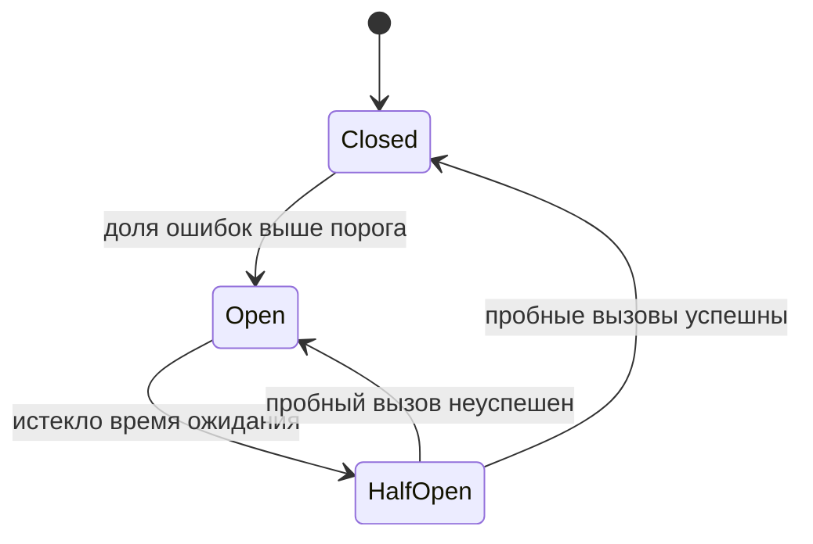

# 3.6 Устойчивость: таймауты, ретраи, circuit breaker, bulkhead

## Зачем это аналитику

В распределённой системе что-то всегда сломано. Вопрос в том, превратится ли отказ одного партнёра в отказ всей системы. Политики таймаутов, ретраев и деградации — это требования, и у каждой есть бизнес-смысл: что видит пользователь, когда внешний сервис лежит, сколько можно ждать, что можно отложить.

## Что понять

- [ ] **Каскадный отказ**: медленный сервис опаснее упавшего. Потоки вызывающего сервиса ждут ответа, пул исчерпывается, вызывающий тоже перестаёт отвечать — и так вверх по цепочке. Антипаттерны Нигарда: integration points, cascading failures, blocked threads, unbounded result sets, slow responses.
- [ ] **Таймаут** — первая и обязательная защита. Любой сетевой вызов без таймаута — дефект. Как выбирать значение: по перцентилям (p99) нижестоящего сервиса и по бюджету времени всего запроса. **Распространение дедлайна** (deadline propagation): нижестоящему передаётся оставшееся время, а не свой полный таймаут.
- [ ] **Retry**: только для временных ошибок (таймаут, 503, 429, обрыв соединения) и только для идемпотентных операций (или с Idempotency-Key). **Экспоненциальная задержка с jitter**, иначе ретраи всех клиентов синхронизируются и добивают сервис. Ограничение числа попыток и **retry budget** (не больше N% дополнительной нагрузки). Ретраи на нескольких уровнях перемножаются: 3 × 3 × 3 = 27 запросов.
- [ ] **Circuit Breaker**: при высокой доле ошибок перестать вызывать сервис и сразу возвращать ошибку или fallback. Три состояния: **Closed** (вызовы идут, ошибки считаются) → **Open** (вызовы не идут, ждём) → **Half-Open** (пробные вызовы; успех → Closed, ошибка → Open). Параметры: порог доли ошибок, размер окна, минимальное число вызовов, время в Open. Даёт упавшему сервису восстановиться и экономит ресурсы вызывающего.
- [ ] **Bulkhead (переборки)**: изоляция ресурсов, чтобы проблема одного партнёра не съела всё. Отдельные пулы потоков или семафоры (ограничение числа одновременных вызовов) на каждый внешний сервис; отдельные пулы соединений; отдельные экземпляры для критичных и некритичных клиентов. Название — от отсеков в корпусе корабля.
- [ ] **Fallback и деградация**: кэшированное значение, значение по умолчанию, отложенная обработка («примем заказ, оплату проверим позже»), отключение некритичной функции. Решение о fallback — **бизнесовое**, его принимает аналитик вместе с заказчиком.
- [ ] **Rate limiting и load shedding** на стороне сервиса: лучше быстро отказать части запросов (429 / 503), чем медленно обслужить всех.
- [ ] **Backpressure** в асинхронных системах: потребитель сигнализирует, что не успевает.
- [ ] **Health checks**: liveness против readiness в Kubernetes; почему readiness не должен проверять зависимости «насквозь».
- [ ] **Chaos engineering**: проверять гипотезы об устойчивости, внося сбои намеренно.
- [ ] **Инструменты**: Resilience4j (Java), Polly (.NET), настройки Envoy / Istio (outlier detection, retries, timeouts). Понимать, что в библиотеке, а что в mesh.

## Урок

<!-- LESSON:START -->
### Как отказ одного превращается в отказ всех

Каждое обращение по сети — точка интеграции (integration point), и Майкл Нигард в *Release It!* называет такие точки главным источником нестабильности. Упавший партнёр сравнительно безобиден: соединение отвергается сразу, вызывающий получает ошибку за миллисекунды и может что-то с ней сделать. Опасен партнёр, который **медленно** отвечает или не отвечает вовсе.

Механизм каскадного отказа (cascading failure) такой. Сервис оформления заказа обслуживает запросы пулом из 200 потоков. Скоринговый сервис начинает отвечать за 30 секунд вместо 100 мс. Каждый поток, попавший на скоринг, зависает на 30 секунд. При потоке 50 запросов в секунду пул исчерпывается за четыре секунды, после чего сервис заказов перестаёт отвечать **на все запросы**, включая те, что скоринг вообще не используют. Теперь уже вызывающие сервис заказов (шлюз, мобильный бэкенд) держат свои потоки в ожидании — и отказ поднимается вверх по цепочке.

Нигард описывает связанную группу антипаттернов:

- **Integration points** — любой внешний вызов может зависнуть, вернуть мусор или отказать неожиданным образом.
- **Cascading failures** — отказ нижнего слоя распространяется вверх через ожидающих клиентов.
- **Blocked threads** — потоки, застрявшие на сетевом вызове, блокировке или пуле соединений, — основной механизм каскада.
- **Unbounded result sets** — запрос без ограничения выборки, который однажды возвращает миллион строк и съедает память.
- **Slow responses** — медленный ответ хуже быстрого отказа, потому что удерживает ресурсы обеих сторон.

Все паттерны модуля — способы разорвать эту цепочку: ограничить время ожидания, количество попыток, долю ресурсов на одного партнёра и заранее решить, что делать без него.

### Таймаут: первая линия защиты

Сетевой вызов без таймаута — дефект, а не упрощение. Многие клиентские библиотеки по умолчанию ждут бесконечно или очень долго, поэтому таймаут должен задаваться явно, и отдельно для установления соединения и для чтения ответа.

Как выбрать значение. Две опоры:

1. **Распределение времени ответа нижестоящего сервиса.** Таймаут ставят немного выше его p99 (или p99.9) в нормальном режиме. Если p99 скоринга — 400 мс, таймаут 500–800 мс отсечёт аномалии, не обрезая нормальные ответы. Таймаут ниже p99 означает, что вы сами генерируете ошибки на здоровом сервисе.
2. **Бюджет времени всего запроса.** Если пользователь должен получить ответ за 2 секунды, сумма таймаутов последовательных вызовов с учётом ретраев не может превышать 2 секунды минус собственная работа сервиса.

Пример расчёта. Запрос оформления кредитной заявки юрлица — 2 секунды, внутри последовательно скоринг (p99 300 мс), проверка лимитов (p99 150 мс), сохранение и отправка в очередь (p99 50 мс). Резерв на собственную логику — 200 мс. Остаётся 1800 мс. Можно дать скорингу таймаут 500 мс и одну повторную попытку (итого до 1000 мс плюс пауза), лимитам — 300 мс без ретрая или с одним коротким, сохранению — 200 мс. Если сумма не сходится, это сигнал: либо один из вызовов надо сделать асинхронным, либо пересмотреть требование ко времени ответа.

**Распространение дедлайна (deadline propagation).** Каждый уровень передаёт вниз не свой фиксированный таймаут, а оставшееся время. Если шлюз дал запросу 2 секунды, и 1,5 уже потрачено, нижестоящий сервис получает 500 мс и не начинает работу, которую заведомо не успеет. Без этого нижние сервисы продолжают трудиться над запросами, от которых клиент давно отказался. В gRPC дедлайн — встроенная часть протокола; в HTTP его передают своим заголовком по соглашению внутри компании.

### Повторы: полезны только с ограничениями

Повторная попытка (retry) лечит кратковременные сбои: обрыв соединения, перезапуск экземпляра, короткую перегрузку. Два условия допустимости:

- **Ошибка временная.** Ретраить имеет смысл таймаут, `503 Service Unavailable`, `429 Too Many Requests` (с учётом `Retry-After`, если он есть), `502/504` от прокси, обрыв соединения. Не имеет смысла ретраить `400`, `401`, `403`, `404`, `422` и бизнес-отказы («недостаточно средств») — повтор даст тот же результат.
- **Операция идемпотентна.** `GET` и `PUT` по определению идемпотентны; `POST` на создание платежа — нет. Таймаут не означает, что операция не выполнилась: возможно, платёж прошёл, а потерялся ответ. Повторять такой вызов можно только с ключом идемпотентности (`Idempotency-Key`), по которому сервер распознает повтор и вернёт результат первой попытки.

**Экспоненциальная задержка с jitter.** Если все клиенты повторяют через фиксированную секунду, их повторы приходят синхронной волной ровно в тот момент, когда сервис пытается подняться. Экспоненциальная задержка (exponential backoff: 100 мс, 200, 400, 800…) снижает частоту, а случайная составляющая (jitter) размазывает волну во времени. Распространённый вариант — «полный jitter»: задержка выбирается случайно от нуля до текущего экспоненциального предела.

```text
delay = random(0, min(cap, base * 2^attempt))
```

**Ограничения.** Число попыток конечно (обычно 2–3 всего). Сверх этого применяют **бюджет повторов (retry budget)**: повторы разрешены, пока они составляют не больше заданной доли от исходного трафика, например 10–20%. Когда сервис действительно лежит, почти все вызовы падают, бюджет исчерпывается, и клиент перестаёт умножать нагрузку.

**Умножение на уровнях.** Если шлюз, сервис заказов и клиент скоринга каждый делают по три попытки, один пользовательский запрос в худшем случае порождает 3 × 3 × 3 = 27 обращений к скорингу — именно тогда, когда скоринг перегружен. Правило: ретраи выполняет один уровень, обычно ближайший к нестабильному ресурсу, а остальные либо не повторяют, либо повторяют только ошибки соединения до отправки запроса.

### Circuit Breaker

Размыкатель цепи (circuit breaker) — обёртка вокруг вызова, которая следит за долей неудач и при превышении порога перестаёт вызывать партнёра, сразу возвращая ошибку или fallback. Это экономит ресурсы вызывающего (потоки не ждут заведомо неуспешных ответов) и даёт упавшему сервису передышку.



- **Closed** — штатный режим. Вызовы проходят, результаты записываются в скользящее окно (по числу вызовов или по времени).
- **Open** — вызовы не выполняются, сразу возвращается ошибка. Состояние держится заданное время.
- **Half-Open** — пропускается ограниченное число пробных вызовов. Успех возвращает в Closed, неудача — снова в Open.

Параметры, которые нужно выбрать осознанно:

- **порог доли ошибок** (например, 50%) и, отдельно, порог доли медленных вызовов — медленный ответ тоже неудача;
- **размер окна** — сколько последних вызовов или секунд учитывать;
- **минимальное число вызовов** — чтобы две ошибки из трёх ночью не размыкали цепь;
- **время в Open** — достаточное, чтобы партнёр успел восстановиться;
- **число пробных вызовов** в Half-Open;
- **какие ошибки считать** — бизнес-отказы (`422`, «клиент не найден») не должны размыкать цепь.

Circuit breaker и rate limiter легко спутать, но они защищают разные стороны. Размыкатель стоит на стороне **вызывающего** и реагирует на **здоровье партнёра**: «он болен, не будем к нему ходить». Ограничитель частоты (rate limiter) обычно стоит на стороне **вызываемого** (или вызывающего, чтобы соблюсти квоту партнёра) и реагирует на **объём трафика**: «больше N запросов в секунду не принимаем», независимо от того, здоров ли кто-нибудь.

### Bulkhead: переборки

Название — от водонепроницаемых отсеков в корпусе судна: пробоина затапливает один отсек, а не весь корабль. В сервисе это изоляция ресурсов по партнёрам или классам клиентов.

Вернёмся к примеру с пулом из 200 потоков. Если выделить скорингу собственный пул из 30 потоков или семафор на 30 одновременных вызовов, то при зависании скоринга будут заняты только эти 30. Остальные 170 продолжат обслуживать запросы, которым скоринг не нужен: просмотр заявок, выписки, статусы платежей. Запрос, для которого слот не нашёлся, быстро получит отказ или fallback, а не встанет в бесконечную очередь.

Формы переборок:

- отдельные пулы потоков или семафоры на каждого внешнего партнёра;
- отдельные пулы соединений к базе для транзакционной нагрузки и для отчётов;
- отдельные экземпляры сервиса для критичных и некритичных клиентов: например, приём платёжных поручений и выгрузка выписок за год не должны делить одни и те же поды;
- отдельные очереди или партиции для разных типов сообщений, чтобы поток массовых уведомлений не задерживал платёжные события.

Размер переборки считают по закону Литтла: одновременных вызовов в среднем примерно столько, сколько «частота запросов × время ответа». 50 вызовов в секунду при 200 мс — около 10 одновременных; лимит в 20–30 даёт запас и при этом ограничивает ущерб.

### Fallback и деградация — бизнес-решение

Когда партнёр недоступен, вариантов поведения несколько:

- **кэшированное значение** — курс валюты пятиминутной давности, вчерашний прогноз спроса для расчёта заказа поставщику;
- **значение по умолчанию** — базовые рекомендации вместо персональных;
- **отложенная обработка** — «примем заказ, оплату проверим позже», заявку в очередь на повторную отправку;
- **отключение некритичной функции** — не показывать блок отзывов, но дать оформить покупку;
- **честная ошибка** — когда ни один вариант не допустим.

Технически реализовать любой из них несложно. Сложно решить, какой допустим: можно ли принять платёжное поручение без онлайн-проверки лимита, если потом лимит окажется превышен? Сколько часов данные о курсе считаются приемлемыми? Кто компенсирует убыток, если заказ приняли, а товар с устаревшим остатком закончился? Это вопросы риска и денег, и решает их заказчик вместе с аналитиком; разработчик получает решение в виде требования. Хорошая постановка содержит для каждого внешнего вызова строку: что видит пользователь и что происходит с данными, если вызов не удался.

### Защита со стороны сервиса: rate limiting, load shedding, backpressure

Все предыдущие паттерны — защита вызывающего. Вызываемый сервис тоже должен себя защищать, потому что клиенты не всегда ведут себя корректно.

**Ограничение частоты (rate limiting)** — квоты на клиента, ключ API или операцию. Превышение — ответ `429` с подсказкой, когда повторить. Это вопрос справедливости и защиты от одного шумного клиента.

**Сброс нагрузки (load shedding)** — реакция на собственную перегрузку, а не на конкретного клиента. Когда очередь запросов растёт или время ожидания в ней превышает порог, сервис сразу отвечает `503` на часть запросов, не начиная их обработку. Логика: лучше быстро отказать 20% и нормально обслужить 80%, чем медленно обслужить всех, превысив таймауты у каждого, — тогда полезная пропускная способность падает до нуля. Отбрасывать стоит в первую очередь менее важный трафик (фоновые синхронизации раньше, чем оплаты).

**Обратное давление (backpressure)** — то же в асинхронных системах. Потребитель, который не успевает, должен дать производителю сигнал замедлиться, а не накапливать бесконечный буфер в памяти. В модели с брокером потребитель сам регулирует темп, забирая сообщения по мере готовности, и сигналом служит растущее отставание (lag) — его и нужно мониторить. В потоковых библиотеках backpressure встроен в протокол (запрос N элементов). Неограниченная очередь не решает проблему, а откладывает её и превращает в нехватку памяти.

### Health checks: liveness и readiness

В Kubernetes у пода две разные проверки с разными последствиями:

- **Liveness** — «процесс жив и не завис». Провал ведёт к **перезапуску** контейнера.
- **Readiness** — «готов принимать трафик». Провал **исключает** под из балансировки, не перезапуская его.

Частая ошибка — проверять в readiness (а тем более в liveness) доступность всех зависимостей «насквозь»: базы, брокера, трёх партнёров. Если общий партнёр, скажем, SMS-шлюз, недоступен, readiness проваливается **у всех подов одновременно**, сервис полностью выпадает из балансировки — даже для запросов, которым SMS не нужен. Мы своими руками превратили частичный отказ в полный. С liveness хуже: поды начинают перезапускаться по кругу, добавляя нагрузку на холодный старт.

Правильно: liveness проверяет только сам процесс; readiness — то, без чего **этот экземпляр** точно бесполезен (прогрев завершён, собственный пул соединений инициализирован) и что отличает его от соседей. Отказ внешних зависимостей обрабатывается таймаутами, размыкателями и fallback, а не выключением сервиса.

### Хаос-инжиниринг

Настройки устойчивости — гипотезы, пока их не проверили. Хаос-инжиниринг (chaos engineering) — контролируемые эксперименты: формулируется ожидаемое устойчивое состояние («доля успешных оформлений заказов не ниже 99%»), вносится сбой (задержка 5 секунд у платёжного шлюза, падение одного экземпляра базы, потеря пакетов), измеряется, выдержала ли система. Начинают на тестовом стенде с малого радиуса поражения, в продакшн выходят постепенно и с кнопкой остановки. Часто полезнее самих экспериментов оказываются «дни игр» (game days), где команда вручную проигрывает отказ и заодно проверяет алерты и инструкции.

### Где это живёт: библиотека или mesh

| Механизм | Библиотека в коде (Resilience4j, Polly) | Service mesh (Envoy, Istio) |
|---|---|---|
| Таймауты | Да | Да |
| Ретраи | Да, с учётом бизнес-смысла ошибок | Да, по кодам ответа и типу сбоя |
| Circuit breaker | Да, по доле ошибок и медленных вызовов | Ограничения соединений и outlier detection — исключение нездоровых экземпляров из балансировки |
| Bulkhead | Да, пулы и семафоры | Лимиты соединений и запросов на кластер |
| Fallback | Да | Нет — прокси не знает бизнес-смысла |

Mesh хорош тем, что политики задаются единообразно и без изменения кода, и видит сеть на уровне экземпляров. Но он не знает, идемпотентна ли операция и какой fallback допустим. Поэтому бизнес-зависимые решения (что ретраить, чем заменить ответ) остаются в коде, а сетевые — можно отдать mesh. Главное — не включить ретраи в обоих местах одновременно и не получить то самое умножение попыток.

### Типичные ошибки

- Не указывать таймауты в требованиях к интеграции или брать значение «с потолка», без связи с p99 партнёра и бюджетом запроса.
- Ретраить неидемпотентные операции (создание платежа) без ключа идемпотентности и получать двойные списания.
- Ретраить без jitter и на нескольких уровнях сразу, превращая небольшой сбой в самоподдерживающуюся перегрузку.
- Считать бизнес-отказы ошибками для circuit breaker и размыкать цепь из-за валидных ответов «клиент не найден».
- Оставлять решение о fallback разработчику, который молча подставит нули или пустой список.
- Проверять все внешние зависимости в readiness или liveness и выключать весь сервис из-за одного партнёра.
- Добавлять неограниченные очереди и буферы вместо backpressure и load shedding.

### Как говорить об этом на собеседовании

Сильный ответ начинается с механизма, а не с перечня паттернов: медленный партнёр занимает потоки, пул исчерпывается, отказ поднимается вверх, поэтому нужны ограничение времени, изоляция ресурсов и быстрый отказ. Дальше — конкретика: таймаут от p99 и бюджета запроса, дедлайн передаётся вниз, ретраи только временных ошибок идемпотентных операций, с jitter, на одном уровне, под бюджетом.

Senior отличается тем, что переводит технику в требования. Покажите таблицу политик для процесса с тремя партнёрами, где у каждой строки есть колонка «что видит пользователь», и объясните, что fallback согласуется с заказчиком, потому что это решение о риске. Хороший пример из опыта: интеграция с банком или внешним реестром, где повтор без ключа идемпотентности приводил к дублям, или где отказ SMS-шлюза не должен блокировать подтверждение операции.

### Коротко

- Медленный сервис опаснее упавшего: он удерживает ресурсы вызывающего и запускает каскад.
- Любой сетевой вызов с явным таймаутом, выбранным от p99 партнёра и бюджета запроса; дедлайн передаётся вниз.
- Ретраи — только для временных ошибок и идемпотентных операций, с экспоненциальной задержкой, jitter, лимитом попыток и бюджетом, на одном уровне.
- Circuit breaker: Closed, Open, Half-Open; защищает вызывающего от больного партнёра. Rate limiter ограничивает объём трафика.
- Bulkhead изолирует ресурсы, чтобы один партнёр не занял все потоки и соединения.
- Fallback — бизнес-решение, фиксируется в требованиях вместе с тем, что видит пользователь.
- Сервис защищает себя сам: rate limiting, load shedding, backpressure.
- Readiness не проверяет общие внешние зависимости, иначе частичный отказ становится полным.
<!-- LESSON:END -->

## Читать дальше

- Nygard, *Release It!* (2nd ed.): гл. 4 «Stability Antipatterns», гл. 5 «Stability Patterns». Главный источник модуля.
- AWS Builders' Library: [Timeouts, retries, and backoff with jitter](https://aws.amazon.com/builders-library/timeouts-retries-and-backoff-with-jitter/), [Using load shedding to avoid overload](https://aws.amazon.com/builders-library/using-load-shedding-to-avoid-overload/).
- Google SRE Book: главы [Handling Overload](https://sre.google/sre-book/handling-overload/) и [Addressing Cascading Failures](https://sre.google/sre-book/addressing-cascading-failures/).
- Martin Fowler, [CircuitBreaker](https://martinfowler.com/bliki/CircuitBreaker.html).
- Документация [Resilience4j](https://resilience4j.readme.io/docs): CircuitBreaker, Bulkhead, Retry, RateLimiter, TimeLimiter — хорошо описаны параметры.
- Newman, *Building Microservices* (2nd ed.): гл. 12 «Resiliency».

На system-design.space:

- [Паттерны устойчивости: размыкатель цепи, изоляция и повторы](https://system-design.space/chapter/resilience-patterns/)
- [Визуализация: Состояния размыкателя цепи](https://system-design.space/visuals/circuit-breaker/)
- [Backpressure и управление потоком](https://system-design.space/chapter/backpressure-flow-control/)
- [Release It! (short summary)](https://system-design.space/chapter/release-it-book/)
- [Хаос-инжиниринг: Gremlin, Litmus, Chaos Monkey](https://system-design.space/chapter/chaos-engineering-tooling/)

## Практика

1. Нарисовать конечный автомат circuit breaker с переходами и параметрами.
2. Для обезличенного процесса, который вызывает трёх внешних партнёров (например, скоринг, платёжный шлюз, SMS), составить **таблицу политик**:

   | Вызов | Таймаут | Ретраи и задержка | Идемпотентность | Circuit breaker | Bulkhead | Fallback | Что видит пользователь |
   |---|---|---|---|---|---|---|---|

3. Посчитать бюджет времени: пользовательский запрос должен уложиться в 2 секунды, внутри три последовательных вызова. Распределить таймауты и число ретраев.
4. По желанию: в Python смоделировать сервис с задержками и клиента с ретраями без jitter и с jitter, посмотреть распределение нагрузки во времени.

## Вопросы для самопроверки

1. Почему медленный сервис опаснее упавшего?
2. Как выбрать значение таймаута?
3. Какие ошибки можно ретраить, а какие нельзя? Зачем нужен jitter?
4. Опишите состояния circuit breaker и переходы между ними.
5. Что такое bulkhead? Приведите пример, когда без него один партнёр кладёт всю систему.
6. Чем circuit breaker отличается от rate limiter?
7. Кто и как решает, какой fallback допустим?
8. Чем liveness-проверка отличается от readiness, и почему readiness не должен проверять все зависимости?
9. Что будет, если ретраи настроены на трёх уровнях по три попытки?

## Заметки

<!-- Свои формулировки, ошибки, ссылки. -->
