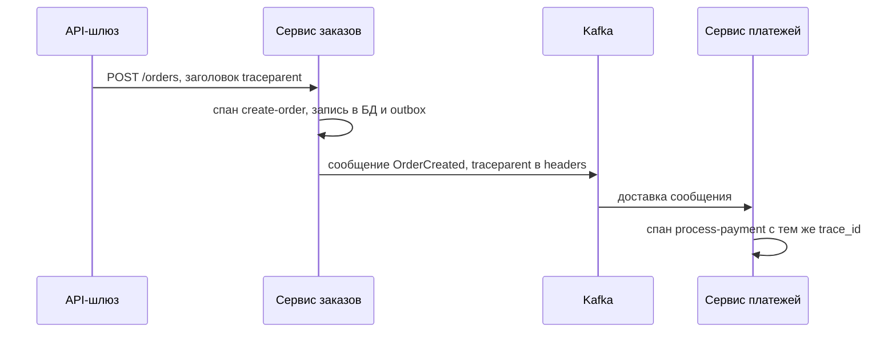

# 3.7 Наблюдаемость: логи, метрики, трассировка, SLO

## Зачем это аналитику

В распределённой системе без сквозной трассировки невозможно ответить на вопрос «где застрял заказ». Требования к наблюдаемости (какие бизнес-события логировать, какие метрики снимать, какой SLO обещаем) — часть постановки, а не «потом DevOps настроит».

## Что понять

- [ ] **Три сигнала**: логи (что произошло), метрики (сколько и как быстро), трассы (путь одного запроса через все сервисы). Плюс профилирование как четвёртый сигнал.
- [ ] **Структурированные логи** (JSON), корреляционный идентификатор, уровни, что нельзя логировать (токены, персональные данные).
- [ ] **Распределённая трассировка**: trace, span, распространение контекста (W3C Trace Context, заголовок `traceparent`), в том числе через брокер сообщений (в заголовках сообщения). Семплирование.
- [ ] **OpenTelemetry** как стандарт сбора всех сигналов; бэкенды: Jaeger / Tempo (трассы), Prometheus (метрики), Loki / ELK (логи), Grafana.
- [ ] **Методы метрик**: RED (Rate, Errors, Duration) для сервисов; USE (Utilization, Saturation, Errors) для ресурсов; четыре золотых сигнала Google (latency, traffic, errors, saturation).
- [ ] **Перцентили, а не среднее**: p50, p95, p99. Почему среднее время ответа почти бесполезно.
- [ ] **SLI, SLO, SLA и error budget**: SLI — что измеряем; SLO — внутренняя цель; SLA — договорное обязательство с последствиями. Error budget как инструмент выбора между скоростью релизов и надёжностью.
- [ ] **Бизнес-метрики**: заказы в минуту, доля неуспешных оплат, число «застрявших» саг, возраст самого старого сообщения в очереди. Их задаёт аналитик.
- [ ] **Алертинг по симптомам, а не по причинам**: алерт на рост ошибок у пользователей, а не на загрузку CPU.

## Урок

<!-- LESSON:START -->
### Мониторинг и наблюдаемость

Мониторинг отвечает на заранее известные вопросы: жив ли сервис, не выросла ли доля ошибок. Наблюдаемость (observability) — свойство системы, позволяющее по её внешним сигналам ответить и на вопросы, которые никто не задавал заранее: «почему заказы клиентов из одного региона с оплатой картой после 18:00 обрабатываются вдвое дольше». В монолите многое можно было выяснить отладчиком и одним лог-файлом. В системе из двадцати сервисов с брокером между ними запрос проходит через процессы, машины и очереди, и без заранее заложенных сигналов вопрос «где застрял заказ» не имеет ответа.

Поэтому требования к наблюдаемости — часть постановки. Какие бизнес-события фиксируются, по какому ключу искать заказ, какие показатели считаются нормой и что будит дежурного — это решается вместе с функциональными требованиями, а не после первого инцидента.

### Три сигнала и четвёртый

| Сигнал | Что это | На какой вопрос отвечает | Цена |
|---|---|---|---|
| Логи | Записи о дискретных событиях с контекстом | Что именно произошло в этом месте | Высокий объём, дорого хранить и искать |
| Метрики | Числовые ряды, агрегированные по времени | Сколько, как часто, как быстро — в целом | Дёшево, но теряются детали отдельного запроса |
| Трассы | Дерево операций одного запроса через все сервисы | Где и на что ушло время этого запроса | Объём большой, поэтому семплирование |
| Профили | Распределение CPU и памяти по функциям кода | Какой код тратит ресурсы | Нужны специальные агенты |

Сигналы дополняют друг друга. Типичный путь расследования: метрика показывает рост p99 времени оформления заказа → по трассам находятся медленные запросы и выясняется, что время уходит в сервис резервирования → логи этого сервиса по идентификатору трассы показывают, что запрос ждал блокировку строки остатка. Вопрос «почему этот конкретный заказ обрабатывался 30 секунд» — это вопрос к трассе: метрики говорят об агрегатах, логи разбросаны по сервисам, и только трасса собирает путь одного запроса с длительностями каждого участка. Логи с тем же идентификатором затем дают детали.

Непрерывное профилирование (continuous profiling) всё чаще называют четвёртым сигналом: оно объясняет, почему сервис стал потреблять больше CPU после релиза, до уровня функции.

### Логи: структурированные и связанные

Строка вида `Order 1234 paid by client 77` удобна человеку и неудобна системе поиска. Структурированный лог — запись в JSON с постоянными полями, по которым можно фильтровать и агрегировать:

```json
{
  "ts": "2026-03-14T10:15:02.345Z",
  "level": "INFO",
  "service": "payment-service",
  "trace_id": "4bf92f3577b34da6a3ce929d0e0e4736",
  "span_id": "00f067aa0ba902b7",
  "event": "payment.captured",
  "order_id": "ORD-1234",
  "amount": 5490.00,
  "currency": "RUB",
  "duration_ms": 184
}
```

Ключевые элементы:

- **Корреляционный идентификатор.** Сегодня обычно им служит `trace_id` из контекста трассировки; он попадает в каждую запись автоматически. Дополнительно полезно логировать бизнес-ключ (`order_id`, номер платёжного поручения), потому что поддержка ищет по нему, а не по трассе.
- **Уровни.** `ERROR` — требует внимания, операция не выполнена; `WARN` — отклонение, с которым система справилась (сработал fallback, повтор); `INFO` — бизнес-события и смены состояний; `DEBUG` — детали для разработки, в продакшне обычно выключен. Если `ERROR` пишется на каждый ожидаемый отказ валидации, настоящие ошибки в нём тонут.
- **Бизнес-события как часть требований.** «Заказ создан», «резерв выполнен», «оплата отклонена с причиной X», «сага перешла в компенсацию» — это то, что аналитик перечисляет явно, с набором полей.

Что нельзя логировать: пароли, токены доступа, ключи API, полные номера карт и CVV, данные документов и прочие персональные данные сверх необходимого. Логи копируются в несколько систем, хранятся долго и доступны многим людям, поэтому попавший туда секрет можно считать скомпрометированным. Практика — маскирование на уровне библиотеки логирования и явный список запрещённых полей в требованиях. Для банковских систем это ещё и требование регулятора и службы безопасности.

### Распределённая трассировка

**Трасса (trace)** — всё, что произошло в системе в ответ на один внешний запрос. Она состоит из **спанов (span)** — операций с началом, длительностью, атрибутами и ссылкой на родителя: входящий HTTP-запрос в шлюз, вызов сервиса заказов, SQL-запрос, публикация сообщения, его обработка потребителем. Из ссылок на родителей строится дерево, которое бэкенд показывает как диаграмму Ганта.

Чтобы спаны разных сервисов оказались в одной трассе, контекст надо **передавать (propagate)** с каждым вызовом. Стандарт W3C Trace Context определяет HTTP-заголовок `traceparent`:

```http
POST /payments HTTP/1.1
traceparent: 00-4bf92f3577b34da6a3ce929d0e0e4736-00f067aa0ba902b7-01
```

Четыре поля через дефис: версия формата, идентификатор трассы (одинаков для всех спанов), идентификатор родительского спана и флаги (младший бит — признак, что трасса выбрана для записи). Сопутствующий заголовок `tracestate` несёт данные конкретных вендоров, а W3C Baggage — произвольные пары «ключ-значение» для передачи вниз по цепочке.

**Через брокер** контекст идёт в заголовках сообщения. В Kafka у записи есть заголовки (headers), и инструментированный продюсер кладёт туда тот же `traceparent`, а потребитель извлекает его и создаёт свой спан обработки. Связь между спаном публикации и спаном обработки бывает родительской или оформляется ссылкой (span link) — второе естественнее, когда потребитель обрабатывает сообщения пачкой или с большой задержкой. Если использовать Outbox, контекст нужно сохранить в строке outbox вместе с событием, иначе публикатор начнёт новую трассу и цепочка оборвётся.



**Семплирование (sampling).** Записывать каждую трассу при большом трафике дорого. Варианты:

- **Head-based** — решение принимается в начале трассы (например, записать 5%) и передаётся вниз через флаг в `traceparent`. Дёшево, но редкие медленные и ошибочные запросы с большой вероятностью не попадут в выборку.
- **Tail-based** — все спаны сначала собираются в буфер коллектора, решение принимается после завершения трассы: сохранить все с ошибками, все медленнее порога и небольшой процент остальных. Полезнее для расследований, но требует памяти и компонента, который видит трассу целиком.

Для аналитика важно понимать следствие: если трассировка семплирована, «найти трассу конкретного заказа» может не получиться. Поэтому поиск по бизнес-ключу обеспечивают логи, а трассы — для анализа задержек.

### OpenTelemetry и бэкенды

OpenTelemetry (OTel) — открытый стандарт и набор SDK для сбора всех сигналов: API для инструментирования, автоматическая инструментация популярных фреймворков, протокол передачи OTLP и Collector — промежуточный сервис, который принимает, обрабатывает (в том числе делает tail-семплирование и фильтрацию полей) и отправляет данные в выбранные хранилища. Главная ценность — отвязка инструментирования кода от конкретного вендора: сменить бэкенд можно без переписывания приложения.

Типичная открытая связка: Prometheus для метрик, Jaeger или Grafana Tempo для трасс, Loki или стек ELK (Elasticsearch, Logstash, Kibana) для логов, Grafana для дашбордов поверх всего. Ценность появляется, когда сигналы связаны: из точки на графике задержки перейти к примерам трасс, из спана — к логам с тем же `trace_id`.

### Какие метрики снимать

Чтобы не изобретать набор метрик каждый раз, используют методы.

- **RED** — для сервисов, обрабатывающих запросы: Rate (запросов в секунду), Errors (доля или число ошибок), Duration (распределение времени ответа).
- **USE** — для ресурсов (CPU, диск, пул соединений, очередь): Utilization (доля времени занятости), Saturation (сколько работы ждёт — длина очереди), Errors.
- **Четыре золотых сигнала** из книги Google SRE: latency, traffic, errors, saturation. По сути объединение RED с насыщенностью.

Насыщенность — самый недооценённый сигнал: загрузка пула соединений 100% и растущая очередь ожидающих предсказывают отказ раньше, чем вырастут ошибки. Для асинхронных систем её аналог — отставание потребителя (consumer lag) и возраст самого старого необработанного сообщения.

### Перцентили вместо среднего

Время ответа почти никогда не распределено нормально: у него длинный правый хвост. Среднее смешивает типичные быстрые ответы с редкими очень медленными и не описывает ни тех, ни других. Пример: 98 запросов по 100 мс и 2 запроса по 10 секунд дают среднее около 300 мс. Такого времени ответа не получил ни один пользователь, а 2% клиентов ждали 10 секунд, и среднее этого не показывает.

Перцентиль pN — значение, быстрее которого выполнились N% запросов. p50 (медиана) описывает типичный опыт, p95 и p99 — хвост. Хвост важнее, чем кажется: пользовательская операция часто делает десятки обращений к бэкенду, и вероятность того, что хотя бы одно из них попадёт в «редкий» медленный процент, становится большой. Кроме того, в хвост нередко попадают самые ценные клиенты — у кого больше всего данных.

Технически перцентили считают из гистограмм. Важная тонкость: перцентили нельзя усреднять между экземплярами или интервалами — среднее из p99 десяти подов не является p99 сервиса. Агрегировать нужно исходные гистограммы.

### SLI, SLO, SLA и бюджет ошибок

- **SLI (Service Level Indicator)** — измеряемый показатель, отражающий опыт пользователя. Обычно в форме доли «хороших» событий: доля запросов на оформление заказа, завершившихся успешно быстрее 2 секунд.
- **SLO (Service Level Objective)** — внутренняя цель для SLI на окне: 99% таких запросов за скользящие 28 дней.
- **SLA (Service Level Agreement)** — договорное обязательство перед клиентом с последствиями при нарушении: скидки, штрафы, право расторжения. SLA ставят мягче SLO, чтобы нарушение внутренней цели было сигналом задолго до юридических последствий.

**Бюджет ошибок (error budget)** — допустимый объём «плохого» за окно: 100% минус SLO. При SLO 99% и 2 миллионах запросов за 28 дней бюджет — 20 000 неудачных или медленных запросов. В терминах времени 99,9% доступности за 30 дней — примерно 43 минуты недоступности.

Бюджет превращает спор «релизить или стабилизировать» в правило. Пока бюджет не израсходован, команда выпускает изменения, экспериментирует, проводит рискованные миграции. Когда бюджет исчерпан или скорость его расходования высока, приоритет переходит к надёжности: заморозка рискованных релизов, работа над причинами инцидентов. Бюджет, который никогда не расходуется, — знак, что SLO слишком мягкий или команда слишком осторожна.

Правильный SLO выбирают от пользователя, а не от текущих возможностей системы: какой уровень заметен клиентам и во что обойдётся каждая следующая «девятка». 100% — неверная цель: она недостижима, запрещает любые изменения, и пользователь всё равно не отличит её от 99,99% из-за ненадёжности собственной сети.

### Бизнес-метрики

Технические метрики могут быть зелёными, пока бизнес стоит: все сервисы отвечают 200, но из-за ошибки в маршрутизации события оплаты никто не обрабатывает. Поэтому аналитик задаёт бизнес-метрики процесса:

- заказов оформлено в минуту — и отклонение от обычного для этого часа и дня недели уровня;
- доля неуспешных оплат с разбивкой по причинам (отказ банка, таймаут шлюза, фрод);
- число саг в незавершённом состоянии дольше порога и возраст самой старой из них;
- возраст самого старого сообщения в очереди и отставание потребителей;
- для ритейла — число магазинов, по которым не пришли продажи за день, или доля SKU без рассчитанного прогноза к моменту формирования заказа поставщику;
- для банка — платёжные поручения, находящиеся в статусе «отправлено в банк» дольше норматива.

Такие метрики часто первыми показывают проблему, которую не видит ни одна техническая.

### Алертинг по симптомам

Алерт должен означать: пользователи страдают или скоро начнут, и человеку нужно действовать. Отсюда правило — **алертить по симптомам, а не по причинам**. Симптом — рост доли ошибок оформления заказа, рост p99, быстрое расходование бюджета ошибок, падение числа заказов ниже ожидаемого. Причина — CPU 90%, перезапуск пода, заполненный диск.

Почему не по причинам: высокий CPU может ничему не вредить (система рассчитана на такую загрузку), а реальный отказ может случиться при нормальном CPU по причине, которую никто не предусмотрел. Алерты по причинам дают много ложных срабатываний, приучают дежурных игнорировать уведомления и при этом пропускают неожиданные поломки. Причинные метрики нужны — на дашбордах, для диагностики после того, как симптом сработал. Исключение — причины, которые гарантированно и скоро станут симптомом: диск заполнится через несколько часов при текущем темпе.

Хорошая практика для SLO — алерты по скорости расходования бюджета (burn rate): быстрый расход за короткое окно — срочное уведомление, медленный за длинное — задача в рабочее время.

### Разбор: требования к наблюдаемости для оформления заказа

Для саги из модуля 3.5 требования могут выглядеть так.

- **Идентификация.** Каждое событие и лог-запись содержат `order_id` и `trace_id`; контекст трассы сохраняется в outbox и передаётся в заголовках сообщений.
- **Бизнес-события в логах (INFO):** заказ создан, резерв выполнен или отклонён, оплата захолдирована или отклонена с кодом причины, компенсация начата и завершена, заказ передан в доставку.
- **Метрики:** RED для каждого сервиса саги; гистограмма времени от создания до финального статуса; число саг по состояниям; возраст самой старой незавершённой саги; доля компенсаций.
- **SLO:** 99% запросов на оформление отвечают успешно быстрее 2 секунд за 28 дней; 99,5% заказов достигают финального статуса за 5 минут.
- **Алерты:** быстрый расход бюджета любого из SLO; есть сага в промежуточном статусе дольше 15 минут; доля отказов оплаты выше обычного уровня для этого часа.
- **Поиск.** Поддержка находит все записи заказа по `order_id` в системе логов; инженер переходит к трассе, если она сохранена семплированием.

### Типичные ошибки

- Считать наблюдаемость задачей эксплуатации и не включать бизнес-события, метрики и SLO в постановку.
- Смотреть на среднее время ответа и усреднять перцентили разных экземпляров.
- Терять контекст трассы на асинхронной границе: не передавать `traceparent` в заголовках сообщений или не сохранять его в outbox.
- Рассчитывать на трассу для поиска конкретного заказа при head-семплировании в несколько процентов.
- Логировать токены, пароли и персональные данные «для отладки».
- Настраивать алерты на CPU и память вместо пользовательских симптомов и получать усталость дежурных от ложных срабатываний.
- Ставить SLO 100% или записывать в SLA то же значение, что и во внутреннем SLO.

### Как говорить об этом на собеседовании

На вопрос о наблюдаемости сильный кандидат отвечает через расследование: как по метрике заметить проблему, по трассе найти медленный участок, по логам с тем же `trace_id` — причину. Стоит показать понимание асинхронной границы (контекст в заголовках Kafka, связь с outbox) и компромиссов семплирования.

Уровень senior виден по тому, что вы связываете технику с бизнесом: формулируете SLI от пользовательского сценария, считаете бюджет ошибок, объясняете, как бюджет регулирует темп релизов, и перечисляете бизнес-метрики, которые должны быть в требованиях, — например, число застрявших саг или платёжных поручений, зависших в статусе отправки. Хорошо звучит фраза «мы алертим по симптомам и по скорости расходования бюджета, а причинные метрики держим на дашбордах для диагностики».

### Коротко

- Логи — что произошло, метрики — сколько и как быстро, трассы — путь одного запроса; профили — где код тратит ресурсы.
- Логи структурированные, с `trace_id` и бизнес-ключом; секреты и лишние персональные данные в них не попадают.
- Контекст трассы передаётся заголовком `traceparent`, в Kafka — в заголовках сообщения; при Outbox его нужно сохранить вместе с событием.
- OpenTelemetry отвязывает инструментирование от бэкенда; семплирование head или tail — компромисс между ценой и полнотой.
- RED для сервисов, USE для ресурсов; насыщенность и отставание очередей предсказывают отказы.
- Среднее скрывает хвост; смотреть p95 и p99 и агрегировать гистограммы, а не перцентили.
- SLI измеряет, SLO — внутренняя цель, SLA — договор с последствиями; бюджет ошибок балансирует скорость и надёжность.
- Алертить по симптомам и расходу бюджета; бизнес-метрики задаёт аналитик.
<!-- LESSON:END -->

## Читать дальше

- Google SRE Book: главы [Service Level Objectives](https://sre.google/sre-book/service-level-objectives/) и [Monitoring Distributed Systems](https://sre.google/sre-book/monitoring-distributed-systems/).
- [Документация OpenTelemetry](https://opentelemetry.io/docs/concepts/): Concepts — Signals, Context Propagation.
- Richardson, *Microservices Patterns*: гл. 11 «Developing production-ready services» (наблюдаемость и безопасность).
- Newman, *Building Microservices* (2nd ed.): гл. 10 «From Monitoring to Observability».
- Charity Majors et al., *Observability Engineering* (O'Reilly) — по желанию.

На system-design.space:

- [Наблюдаемость и проектирование мониторинга](https://system-design.space/chapter/observability-monitoring-design/)
- [Распределённая трассировка в микросервисах (Jaeger, Tempo)](https://system-design.space/chapter/distributed-tracing-microservices/)
- [Показатель уровня сервиса (SLI), целевой уровень сервиса (SLO), соглашение об уровне сервиса (SLA) и бюджет ошибок](https://system-design.space/chapter/sli-slo-sla-error-budgets/)
- [Лаба: Хвостовая выборка трасс в рамках бюджета](https://system-design.space/labs/trace-tail-sampling-budget/)

## Практика

1. Для саги из модуля [3.5](3.5-data-patterns.md) описать требования к наблюдаемости: какие бизнес-события логируются, какие метрики снимаются, как найти конкретный заказ по всем сервисам, какие алерты нужны.
2. Сформулировать 2–3 SLO для пользовательского сценария (например, «99% запросов на оформление заказа успешно завершаются быстрее 2 секунд за 28 дней») и посчитать error budget.
3. По желанию: поднять демо [OpenTelemetry Astronomy Shop](https://opentelemetry.io/docs/demo/) и пройти одну трассу через все сервисы в Jaeger.

## Вопросы для самопроверки

1. Чем отличаются логи, метрики и трассы? Какой сигнал ответит на вопрос «почему этот конкретный заказ обрабатывался 30 секунд»?
2. Как trace-контекст передаётся через Kafka?
3. Почему нельзя ориентироваться на среднее время ответа?
4. Чем SLO отличается от SLA? Что такое error budget и как его используют?
5. Какие бизнес-метрики вы бы заложили в требования для процесса оформления заказа?
6. Почему алертить нужно по симптомам, а не по причинам?

## Заметки

<!-- Свои формулировки, ошибки, ссылки. -->
