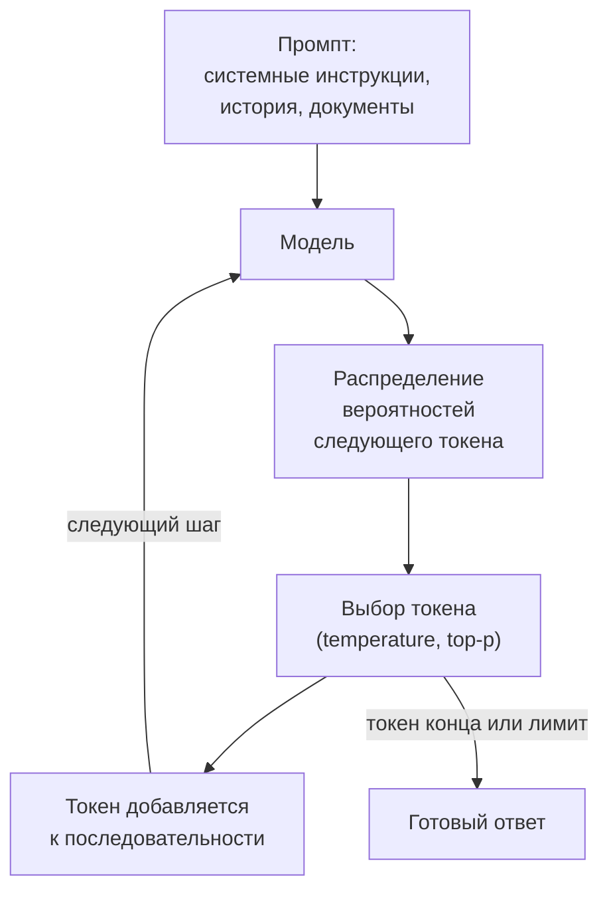

# 5.1 Как работают LLM: взгляд инженера

## Зачем это аналитику

Без модели того, как LLM генерирует текст, невозможно разумно ставить требования: почему ответ недетерминирован, откуда берутся галлюцинации, почему длинный контекст дорог и медленен, почему модель «забывает» середину документа. Это язык, на котором говорят с ML-командой и с заказчиком.

## Что понять

- [ ] Токены и токенизация: почему стоимость и лимиты считают в токенах, а не в символах, и почему русский текст «дороже» английского.
- [ ] Авторегрессионная генерация: модель предсказывает следующий токен; температура, top-p и их влияние на разнообразие и воспроизводимость.
- [ ] Контекстное окно: что в него входит (системный промпт, история, документы, ответ), эффект «потери середины», стоимость длинного контекста.
- [ ] Этапы жизни модели: предобучение, дообучение на инструкциях, выравнивание по предпочтениям — что из этого даёт знания, а что поведение.
- [ ] Галлюцинации: почему модель уверенно выдумывает и какие архитектурные меры это снижают (контекст, цитирование, проверка, отказ отвечать).
- [ ] Эмбеддинги как числовое представление смысла текста — основа поиска по смыслу.
- [ ] Экономика: цена входных и выходных токенов, задержка до первого токена и скорость генерации, кэширование промптов, выбор модели под задачу.
- [ ] Промпт-инжиниринг как инженерная практика: роли, инструкции, примеры (few-shot), структурированный вывод.

## Урок

<!-- LESSON:START -->
Большая языковая модель (large language model, LLM) для инженера — это функция с очень необычными свойствами. На вход она принимает последовательность токенов, на выход выдаёт распределение вероятностей следующего токена. Всё остальное — чат, «рассуждения», вызов инструментов, JSON на выходе — надстройки над этим простым контрактом. Если держать его в голове, большинство странностей LLM перестают быть странностями и становятся предсказуемыми свойствами, под которые можно проектировать.

### Токены: единица измерения всего

Модель не видит символов и слов. Текст сначала режется токенизатором (tokenizer) на фрагменты из фиксированного словаря — обычно это десятки или сотни тысяч элементов. Словарь строится статистически по обучающему корпусу (алгоритмы семейства BPE, byte-pair encoding): частые последовательности символов склеиваются в один токен, редкие разбиваются на части вплоть до отдельных байтов.

Отсюда три практических следствия.

1. **Всё считается в токенах.** Модель физически обрабатывает токены: объём вычислений, память под контекст и время генерации пропорциональны их числу. Поэтому и лимиты контекста, и цены, и скорость генерации выражены в токенах, а не в символах или словах.
2. **Разные языки стоят по-разному.** Словари исторически строились на корпусах с преобладанием английского. Английское слово часто укладывается в один токен, русское — в два-три, особенно с учётом падежных окончаний. В зависимости от токенизатора один и тот же смысл на русском занимает примерно в полтора-три раза больше токенов, чем на английском. В новых токенизаторах с большими многоязычными словарями разрыв меньше, но обычно не исчезает. Это прямо бьёт по стоимости, по задержке и по тому, сколько документов влезает в контекст.
3. **Модель плохо «видит» внутрь токена.** Задачи вроде «посчитай буквы в слове» или «переверни строку» неудобны модели, потому что буквы спрятаны внутри токенов. Похожая история с числами: длинное число может быть разрезано на куски произвольно, и арифметика «в уме» ненадёжна. Вывод для архитектуры — считать и сравнивать числа должен код, а не модель.

Ориентир для грубых оценок: в английском тексте токен в среднем около четырёх символов. Для русского правильнее не угадывать коэффициент, а прогнать несколько типовых документов через токенизатор выбранной модели — это и есть первое упражнение практики.

### Как модель генерирует текст

Модель авторегрессионная (autoregressive): она порождает ответ по одному токену. На каждом шаге берётся вся последовательность — промпт плюс уже сгенерированное, — и модель вычисляет вероятности для каждого токена словаря. Из этого распределения выбирается один токен, приписывается к последовательности, и цикл повторяется до токена конца или до лимита длины.



Важно: у модели нет плана ответа, записанного заранее, и нет отдельного шага «проверить факты». Каждый токен — это ставка на то, что наиболее правдоподобно продолжает текст. Модель не может «вернуться» и исправить уже выданный токен; она может только дописать поправку дальше.

#### Температура и top-p

Способ выбора токена из распределения называется сэмплированием (sampling). Два главных параметра:

- **Температура (temperature)** масштабирует распределение перед выбором. Низкая температура делает вероятный токен ещё вероятнее — ответ становится консервативным и однообразным. Высокая выравнивает распределение — растёт разнообразие и вместе с ним шанс выбрать неудачное продолжение. Температура 0 на практике означает «всегда брать самый вероятный токен» (жадный выбор).
- **Top-p (nucleus sampling)** отсекает хвост: выбор идёт только среди самых вероятных токенов, чья суммарная вероятность достигает p. При top-p = 0,9 редкие токены из последних 10% массы вероятности не рассматриваются вообще.

Обычно настраивают что-то одно, не оба параметра сразу. Для извлечения данных, классификации и генерации кода берут низкую температуру; для черновиков текстов и мозгового штурма — повыше.

#### Почему ответы разные и как сделать их стабильнее

При ненулевой температуре разные ответы на один вопрос — это штатное поведение, а не сбой. Но и при температуре 0 полной воспроизводимости у облачных моделей обычно нет: вычисления на GPU с плавающей точкой идут в разном порядке в зависимости от того, с какими чужими запросами ваш запрос попал в один пакет (batch), и маленькие численные расхождения иногда меняют выбор токена. Дальше ответ расходится, потому что каждый следующий токен зависит от предыдущих. Плюс провайдер может обновить модель под тем же названием.

Как повышать стабильность, если она нужна для требований:

- низкая температура и фиксированная версия модели (снимок с датой, а не псевдоним «последняя»);
- жёсткий формат вывода — структурированный JSON по схеме оставляет меньше места для вариаций;
- чёткие инструкции и примеры, сужающие пространство допустимых ответов;
- для критичных решений — проверка результата кодом или повторный прогон с голосованием;
- кэширование ответов на идентичные запросы, если бизнесу важно, чтобы одинаковый вопрос давал одинаковый ответ.

В требованиях формулируйте не «ответ должен быть одинаковым», а «ответ должен удовлетворять проверяемым критериям» — формату, наличию обязательных полей, ссылкам на источник.

### Контекстное окно

Контекстное окно (context window) — максимальное число токенов, которое модель обрабатывает за один вызов. Туда входит всё сразу:

| Составляющая | Что это | Особенность |
|---|---|---|
| Системный промпт | Роль, правила, формат, описания инструментов | Одинаков для всех запросов, хорошо кэшируется |
| История диалога | Предыдущие реплики пользователя и модели | Растёт с каждым ходом, её надо обрезать или сжимать |
| Документы и данные | Фрагменты из поиска, результаты инструментов | Главный источник «раздувания» контекста |
| Текущий вопрос | Запрос пользователя | Обычно небольшой |
| Ответ модели | Генерируемые токены | Тоже занимает окно, лимит на вывод задаётся отдельно |

Модель не помнит ничего между вызовами. Ощущение «диалога» создаёт приложение, которое каждый раз заново отправляет всю историю. Поэтому длинный чат с каждым ходом становится дороже и медленнее.

#### Почему «положить всё в контекст» — плохая стратегия

Размеры окон у современных моделей — от сотен тысяч токенов и выше, и возникает соблазн просто загрузить туда всю базу знаний. Против этого четыре аргумента.

1. **Стоимость линейна по входу.** Каждый вызов оплачивает весь контекст. Если в каждом запросе лишние 100 тысяч токенов, вы платите за них при каждом вопросе каждого пользователя.
2. **Задержка.** Обработка входа (prefill) занимает время, и время до первого токена растёт с длиной промпта. Вычислительная сложность механизма внимания растёт быстрее, чем линейно, хотя провайдеры это во многом оптимизируют.
3. **Потеря середины (lost in the middle).** Исследования показали, что модели лучше используют информацию в начале и в конце контекста, а факты в середине длинного контекста извлекаются хуже. Новые модели в этом заметно улучшились, но на длинных контекстах со множеством похожих документов эффект и отвлечение на нерелевантное остаются.
4. **Шум.** Нерелевантные документы не нейтральны: модель может взять ответ из похожего, но неверного фрагмента — например, из прошлой версии регламента.

Правильная стратегия — отбирать в контекст только нужное (это задача RAG, модуль 5.2), ставить ключевые инструкции и вопрос в начало или конец, а длинную историю сжимать в резюме.

### Как модель получает знания и поведение

Жизнь модели делится на этапы, и важно понимать, что именно даёт каждый.

- **Предобучение (pre-training).** Модель учится предсказывать следующий токен на огромном корпусе текстов. Именно здесь она получает знания о мире, языках, коде и стиль речи. Это самый дорогой этап, его делают только провайдеры моделей. Результат — «базовая модель», которая умеет продолжать текст, но плохо следует инструкциям.
- **Дообучение на инструкциях (supervised fine-tuning, instruction tuning).** Модель дообучают на парах «инструкция — хороший ответ». Она учится формату диалога: отвечать на вопрос, а не продолжать его.
- **Выравнивание по предпочтениям (preference alignment).** Например, RLHF (reinforcement learning from human feedback) и родственные методы: модель учится выбирать ответы, которые люди или модель-оценщик считают лучшими, — полезные, безопасные, честные в отказах.

Главное различие: **знания приходят в основном из предобучения, а дообучение и выравнивание в основном формируют поведение** — формат, тон, следование инструкциям, готовность отказаться. Отсюда частая ошибка заказчика: «давайте дообучим модель на наших регламентах, чтобы она их знала». Дообучение плохо и ненадёжно добавляет фактические знания, их нельзя легко обновить, удалить или процитировать. Для знаний компании правильный инструмент — RAG.

Когда дообучение всё же оправдано: нужен устойчивый специфичный формат или стиль, который не удаётся получить промптом; узкая задача (классификация, извлечение) решается маленькой дообученной моделью дешевле и быстрее, чем большой; нужно сократить длинный промпт с десятками примеров. Порядок действий почти всегда такой: сначала промпт, затем RAG и инструменты, и только если этого недостаточно и есть размеченные данные с процессом оценки — дообучение.

### Галлюцинации

Галлюцинация (hallucination) — правдоподобный, уверенно поданный, но неверный ответ. Это не баг конкретной модели, а следствие механизма: модель оптимизирована выдавать правдоподобное продолжение, и на вопрос, ответа на который она не знает, правдоподобным продолжением часто оказывается выдуманный ответ в правильной форме — номер статьи, дата, название параметра API. У модели нет встроенного знания о границах своих знаний, а уверенный тон — свойство стиля, а не надёжности.

Особенно часто модель выдумывает:

- редкие факты, которых мало в обучающих данных;
- то, что появилось после даты среза знаний;
- точные идентификаторы: номера, ссылки, цитаты, версии;
- внутренние факты компании, которых модель не видела вообще.

Архитектурные меры, в порядке убывания эффективности:

1. **Дать факты в контексте.** Модель гораздо надёжнее пересказывает предоставленный текст, чем вспоминает. Это суть RAG.
2. **Требовать цитирование.** Каждое утверждение — со ссылкой на фрагмент источника. Ссылки можно проверить кодом: существует ли такой фрагмент и есть ли в нём цитируемый текст.
3. **Разрешить и поощрить отказ.** Явная инструкция «если в предоставленных документах нет ответа — скажи, что не знаешь» плюс проверка, что система действительно так делает на вопросах без ответа.
4. **Проверять результат.** Валидация по схеме, сверка чисел с источником, отдельный вызов модели-проверяющего, правила предметной области (сумма платежа не может быть отрицательной).
5. **Отдавать точные операции инструментам.** Расчёты, поиск по базе, текущие остатки — через вызов функции, а не из «памяти» модели.
6. **Проектировать интерфейс под ошибку.** Показывать источники, помечать сгенерированное, оставлять человека в контуре для решений с последствиями.

Нулевой уровень галлюцинаций недостижим. Требование формулируется как допустимая доля ошибок на контрольном наборе и как поведение системы при ошибке.

### Эмбеддинги

Эмбеддинг (embedding) — вектор чисел фиксированной длины (обычно сотни или тысячи измерений), который отдельная модель эмбеддингов строит для фрагмента текста. Модель обучена так, чтобы тексты с близким смыслом давали близкие векторы. Близость измеряют косинусной мерой или скалярным произведением.

Благодаря этому «заявка на возврат товара» и «хочу вернуть покупку» оказываются рядом, хотя общих слов у них почти нет. На этом построен семантический поиск: документы заранее превращаются в векторы и кладутся в индекс, запрос пользователя превращается в вектор тем же способом, и ищутся ближайшие соседи.

Что важно помнить:

- векторы разных моделей эмбеддингов несовместимы: смена модели означает переиндексацию всего корпуса;
- эмбеддинги хорошо ловят смысл, но плохо — точные совпадения: артикулы, номера договоров, коды ошибок. Поэтому в поиске их комбинируют с лексическим поиском;
- модель эмбеддингов — отдельная, обычно дешёвая и быстрая; её качество на русском языке надо проверять отдельно.

Подробно поиск разобран в модуле 5.2.

### Экономика и задержка

#### Цена

Провайдеры тарифицируют отдельно входные и выходные токены, выходные обычно в несколько раз дороже: каждый выходной токен требует отдельного шага генерации, тогда как вход обрабатывается параллельно. Базовая формула стоимости функции:

```text
Стоимость в месяц = N_запросов × (T_вход × P_вход + T_выход × P_выход)

T_вход  = системный промпт + история + документы + вопрос
T_выход = средняя длина ответа (включая скрытые рассуждения, если модель их тарифицирует)
P       = цена за один токен (провайдеры публикуют цену за миллион)
```

Если модель использует режим рассуждений (reasoning, extended thinking), токены рассуждений обычно оплачиваются как выходные и могут в разы превышать видимый ответ — это надо закладывать в оценку.

#### Разобранный пример: оценка до разработки

Розничная сеть хочет функцию «объясни категорийному менеджеру, почему система автопополнения заказала у поставщика именно такой объём». Оценим до разработки.

- Запросов: 300 менеджеров × 20 вопросов в день × 22 рабочих дня ≈ 130 тысяч в месяц.
- Вход: системный промпт 1,5 тыс. токенов, данные прогноза и остатков по позиции 3 тыс., вопрос 100 — около 4,6 тыс. токенов.
- Выход: ответ 400 токенов.
- Итого в месяц: около 600 млн входных токенов и 52 млн выходных.

Дальше подставляются текущие цены двух-трёх подходящих моделей. Сразу видны рычаги: входных токенов на порядок больше, поэтому сокращение данных о позиции и кэширование системного промпта дадут больше, чем укорачивание ответа. Если запросы на русском, а оценка токенов сделана по английскому образцу, ошибка может быть в разы — поэтому объёмы надо мерить на реальных документах. К модельной стоимости добавьте эмбеддинги, инфраструктуру, логирование и прогоны оценки качества.

#### Задержка

Время ответа складывается из двух фаз:

```text
Время ответа ≈ TTFT + T_выход / скорость_генерации

TTFT (time to first token) — сеть + очередь у провайдера + обработка входа (растёт с длиной промпта)
скорость_генерации — токенов в секунду, зависит от модели и нагрузки
```

Как сокращать: выбирать модель меньше там, где хватает её качества; сокращать вход; ограничивать длину ответа и просить краткий формат; использовать потоковую выдачу (streaming), чтобы пользователь видел текст по мере генерации — это не уменьшает общее время, но резко улучшает воспринимаемое; распараллеливать независимые вызовы; не делать цепочки из многих последовательных вызовов там, где хватит одного.

#### Кэширование промптов

Кэширование промптов (prompt caching) позволяет провайдеру переиспользовать обработанный префикс контекста между вызовами. Если начало промпта совпадает побайтно — системные инструкции, описания инструментов, большой справочный документ, — повторная обработка этой части стоит заметно дешевле и идёт быстрее. Кэш живёт ограниченное время. Следствие для проектирования: стабильная часть промпта ставится в начало, изменяемая (вопрос, текущая дата, данные пользователя) — в конец. Вставка текущего времени в первую строку системного промпта незаметно ломает кэш.

#### Выбор модели

Нет «лучшей модели», есть подходящая для задачи. Крупные модели лучше рассуждают и следуют сложным инструкциям, малые — дешевле и быстрее на порядок. Разумная практика: начать с сильной модели, чтобы понять достижимое качество, собрать контрольный набор, затем проверить, какая самая дешёвая модель держит нужную планку. Частый приём — маршрутизация: простые запросы идут на малую модель, сложные — на крупную.

### Промпт-инжиниринг как инженерная практика

Промпт — это спецификация поведения, и к нему применимы те же требования, что к любой спецификации: однозначность, полнота, проверяемость, версионирование.

Основные элементы:

- **Роли сообщений.** Системное сообщение задаёт роль, правила и границы; сообщения пользователя — входные данные; сообщения ассистента — ответы, в том числе примеры. Системным инструкциям модель обычно следует приоритетнее.
- **Инструкция.** Что сделать, для кого, в каком объёме, что делать в пограничных случаях. Хорошая проверка: сможет ли новый сотрудник выполнить задачу по этому тексту без вопросов.
- **Контекст и данные.** Отделены от инструкций явными разделителями — например, тегами или заголовками, — чтобы модель не спутала текст письма с командой.
- **Примеры (few-shot).** Два-пять примеров «вход — ожидаемый выход», покрывающих типичные и пограничные случаи. Примеры сильнее любых описаний задают формат, но модель склонна копировать их поверхностные черты, поэтому они должны быть разнообразными.
- **Структурированный вывод.** Ответ в JSON по схеме. Многие API умеют принуждать вывод к заданной JSON Schema; если нет — валидируйте на стороне приложения и повторяйте запрос при ошибке.

Пример для банка: классификация входящих обращений юрлиц.

```text
[system]
Ты классифицируешь обращения корпоративных клиентов банка.
Категории: payment_status, statement_request, limits, access_problem, other.
Правила:
- Выбирай одну категорию. Если сомневаешься — other.
- Не додумывай номер платёжного поручения: если его нет в тексте, верни null.
Ответ — только JSON: {"category": "...", "payment_order_number": "... или null", "urgent": true/false}

[user]  Где мой платёж №5412 от вчера? Контрагент ждёт деньги, горит отгрузка.
[assistant] {"category": "payment_status", "payment_order_number": "5412", "urgent": true}

[user]  <текст нового обращения>
```

Инженерная часть — не в формулировках, а в процессе: промпты хранятся в репозитории с версиями, у каждого есть контрольный набор примеров, и любое изменение промпта или смена модели прогоняется через этот набор до выката. Без этого «улучшение» промпта для одного случая незаметно ломает десять других. Подробнее об оценке — в модуле 5.4.

### Типичные ошибки

- Оценивать стоимость и объём контекста в символах или словах, да ещё по английскому образцу, — для русского текста ошибка может быть в разы.
- Требовать от LLM детерминированности вместо проверяемых критериев результата и не фиксировать версию модели.
- Предлагать дообучение, чтобы модель «знала» регламенты компании, хотя для знаний нужен RAG, а дообучение меняет прежде всего поведение.
- Загружать в контекст всё подряд: платить за лишние токены при каждом вызове, терять скорость и получать ответы из нерелевантных фрагментов.
- Доверять модели вычисления, сравнения чисел и точные идентификаторы вместо того, чтобы отдать их коду или инструменту.
- Ставить изменяемые данные в начало промпта и тем самым ломать кэширование.
- Править промпт «на глаз» по одному примеру без контрольного набора и регрессионной проверки.

### Как говорить об этом на собеседовании

Senior отличается тем, что объясняет поведение модели через механизм и сразу переводит его в архитектурные решения. Не «модель иногда врёт», а «модель генерирует правдоподобное продолжение и не знает границ своих знаний, поэтому факты мы подаём через контекст, требуем цитирование, проверяем ссылки кодом и измеряем долю неподтверждённых утверждений на контрольном наборе». Не «это дорого», а формула стоимости с подставленными объёмами и указанием главного рычага — обычно входных токенов.

Хорошо работает короткий расчёт на доске: число запросов, средний вход и выход, ориентировочная стоимость и задержка, варианты снижения — меньшая модель, кэширование префикса, сокращение контекста. Полезно показать, что вы различаете знания и поведение: «дообучение рассматриваем, только если промпт, RAG и инструменты не дают нужного формата, а у нас есть размеченные данные и процесс оценки».

### Коротко

- LLM предсказывает следующий токен; всё остальное — надстройки над этим контрактом.
- Лимиты, цена и скорость считаются в токенах; русский текст обычно занимает заметно больше токенов, чем английский, — мерить надо на своих документах.
- Температура и top-p управляют разнообразием; полной воспроизводимости нет даже при нуле, поэтому требования формулируют через проверяемые критерии.
- Контекстное окно вмещает всё — инструкции, историю, документы и ответ; длинный контекст дорог, медленен и страдает от потери середины.
- Знания даёт предобучение, поведение — дообучение и выравнивание; для знаний компании нужен RAG, а не дообучение.
- Галлюцинации — следствие механизма; снижаются фактами в контексте, цитированием, разрешённым отказом и проверкой кодом.
- Эмбеддинги переводят смысл в векторы и лежат в основе семантического поиска.
- Стоимость = запросы × (вход × цена входа + выход × цена выхода); задержка = TTFT + длина ответа / скорость; стабильный префикс промпта кэшируется.
<!-- LESSON:END -->

## Читать дальше

- Hands-On Large Language Models — главы о токенах, эмбеддингах и устройстве трансформера.
- Chip Huyen, AI Engineering — главы об устройстве фундаментальных моделей и промпт-инжиниринге.
- 3Blue1Brown, видеосерия о нейросетях и трансформерах (YouTube) — наглядно, без формул.

На system-design.space:

- [AI Engineering: как проектировать LLM-системы, агентные сценарии и AI-помощников](https://system-design.space/chapter/ai-engineering-overview/)
- [AI Engineering и ML Engineering: как выбрать маршрут](https://system-design.space/chapter/ai-ml-overview/)
- [Prompt Engineering for LLMs (short summary)](https://system-design.space/chapter/prompt-engineering-book/)
- [Оптимизация инференса больших языковых моделей](https://system-design.space/chapter/llm-inference-optimization/)

## Практика

1. Посчитать в любом онлайн-токенизаторе, сколько токенов занимает одна ваша типовая спецификация на русском и та же в переводе на английский. Оценить стоимость обработки 1000 таких документов по текущим ценам двух моделей.
2. Задать одной модели один и тот же вопрос 5 раз с температурой 0 и 5 раз с температурой 1. Записать, что меняется.
3. Сформулировать для обезличенной задачи (например, классификация обращений) промпт с ролью, инструкцией, тремя примерами и форматом ответа в JSON. Проверить на 10 примерах.

## Вопросы для самопроверки

1. Что такое токен и почему лимиты и стоимость считают в токенах?
2. Почему LLM может дать разные ответы на один и тот же вопрос, и как сделать ответы стабильнее?
3. Откуда берутся галлюцинации и какие архитектурные меры их снижают?
4. Что входит в контекстное окно и почему «засунуть всё в контекст» — плохая стратегия?
5. Чем предобучение отличается от дообучения, и когда дообучение не нужно?
6. Из чего складывается задержка ответа LLM и как её сократить?
7. Как оценить стоимость ИИ-функции до её разработки?

## Заметки

<!-- Свои формулировки, ошибки, ссылки. -->
