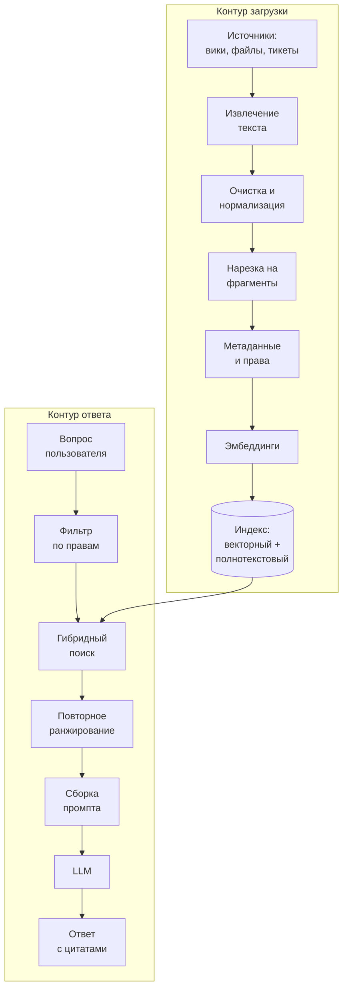

# 5.2 RAG: поиск и генерация по своим данным

## Зачем это аналитику

RAG — самый частый способ дать модели знания компании: регламенты, спецификации, базу знаний поддержки. Почти все проблемы RAG — не в модели, а в данных, нарезке, поиске и правах доступа, то есть в зоне ответственности аналитика и архитектора.

## Что понять

- [ ] Зачем RAG: актуальность, знания компании, цитирование источников, контроль доступа — в отличие от дообучения.
- [ ] Конвейер загрузки: извлечение текста, очистка, нарезка на фрагменты (размер, перекрытие, нарезка по структуре), метаданные, эмбеддинги, индекс.
- [ ] Поиск: векторный (ANN, HNSW), лексический (BM25), гибридный со слиянием результатов, повторное ранжирование (reranker).
- [ ] Сборка ответа: шаблон промпта, количество фрагментов, цитирование, инструкция отвечать «не знаю» при отсутствии данных.
- [ ] Права доступа: фильтрация по правам до поиска, а не после; мультиарендность.
- [ ] Актуализация индекса: инкрементальная загрузка, удаление устаревшего, версии документов.
- [ ] Метрики: качество поиска (recall@k, precision@k) и качество ответа (верность источнику, полнота, релевантность).
- [ ] pgvector как способ сделать RAG на уже знакомом PostgreSQL, и когда нужна отдельная векторная база.

## Урок

<!-- LESSON:START -->
RAG (retrieval-augmented generation, генерация с извлечением) — схема, в которой перед вызовом модели система находит в своих данных фрагменты, относящиеся к вопросу, и кладёт их в контекст вместе с инструкцией «отвечай по этим источникам». Модель в такой схеме работает не как база знаний, а как читатель и редактор: она пересказывает, сопоставляет и формулирует, а факты приходят из поиска.

Отсюда главный инженерный вывод: качество RAG ограничено сверху качеством поиска. Если нужный фрагмент не попал в контекст, лучшая модель не ответит правильно. Если попал устаревший — ответит уверенно и неправильно. Поэтому большая часть работы над RAG — это работа с данными: откуда они берутся, как режутся, как размечаются, кто имеет к ним доступ и как они обновляются.

### Зачем RAG, а не дообучение

Заказчик часто формулирует задачу как «научить модель нашим регламентам». Есть два пути: дообучить модель на документах или подавать документы в контекст в момент вопроса. Сравнение по свойствам, которые обычно важны бизнесу:

| Свойство | RAG | Дообучение |
|---|---|---|
| Актуальность | Новый документ доступен после индексации, за минуты | Нужен новый цикл обучения и выката |
| Удаление знаний | Удалили из индекса — знание исчезло | Практически невозможно гарантировать |
| Цитирование | Ответ ссылается на конкретный фрагмент | Источник знания не отследить |
| Права доступа | Фильтруются на уровне поиска для каждого пользователя | Всё, что выучено, доступно всем |
| Надёжность фактов | Высокая при хорошем поиске | Низкая: модель плохо запоминает редкие факты |
| Что улучшает | Знания | Поведение: формат, стиль, узкие навыки |

Дообучение уместно, когда нужно изменить поведение — устойчивый формат, терминология, узкая классификация — и есть размеченные примеры. Для знаний компании по умолчанию выбирается RAG. Варианты не исключают друг друга: иногда модель дообучают следовать формату ответов с цитатами, а знания по-прежнему подают через поиск.

Есть и третий вариант, о котором стоит помнить: если корпус маленький (десятки страниц) и меняется редко, его можно целиком положить в системный промпт и закэшировать. Это проще RAG и иногда точнее. RAG становится необходим, когда корпус не помещается в контекст или его нельзя показывать целиком каждому пользователю.

### Архитектура: два контура

RAG-система состоит из двух независимых контуров: загрузки (ingestion), который готовит индекс заранее, и ответа (query), который работает на каждый вопрос.



### Конвейер загрузки

#### Извлечение и очистка

Источники разнородны: страницы вики с макросами, PDF со сканами и колонтитулами, таблицы в Word, выгрузки тикетов. Извлечение текста — первый и самый недооценённый источник ошибок. Таблица, превращённая в поток слов без структуры, теряет смысл; повторяющийся колонтитул «Конфиденциально, версия 3» попадает в каждый фрагмент и засоряет поиск; отсканированный документ без распознавания не даёт текста вовсе.

Очистка — это удаление навигации, колонтитулов, служебных блоков, нормализация пробелов и кодировок, сохранение структуры заголовков и таблиц (например, в виде Markdown). Это обычная задача ETL, и к ней применимы все знакомые практики: профилирование источников, правила на каждый тип документа, контроль качества выборкой.

#### Нарезка на фрагменты

Документы режутся на фрагменты (chunks), потому что эмбеддинг длинного документа размывает смысл, а в контекст надо положить только относящиеся к делу части.

Размер фрагмента — это компромисс:

- **Мелкие фрагменты** (одно-два предложения) дают точные эмбеддинги и высокую точность поиска, но теряют контекст: фрагмент «срок — 3 рабочих дня» бесполезен без того, к чему относится срок.
- **Крупные фрагменты** (несколько страниц) сохраняют контекст, но их эмбеддинг усредняет несколько тем, поиск становится менее точным, а в контекст влезает меньше разных источников.

Типичный рабочий диапазон — от нескольких сотен до примерно тысячи токенов, но правильное значение подбирается экспериментом на своих вопросах, а не берётся из статьи.

Приёмы, которые помогают:

- **Нарезка по структуре.** Резать по заголовкам, разделам, пунктам регламента, а не по счётчику символов. Раздел «Порядок возврата товара» — естественная единица.
- **Перекрытие (overlap).** Соседние фрагменты пересекаются на небольшую часть, чтобы мысль на границе не разрезалась пополам.
- **Контекстный заголовок.** К каждому фрагменту приписывается путь: «Регламент возвратов › Раздел 4 › Возврат без чека». Похожую идею развивает приём контекстного извлечения (contextual retrieval): перед индексацией модель пишет для фрагмента короткое пояснение, о чём он в контексте всего документа.
- **Родительские фрагменты.** Ищут по мелким фрагментам, а в контекст кладут охватывающий их крупный раздел — точность поиска мелких и контекст крупных.

#### Метаданные

У каждого фрагмента должны быть метаданные: идентификатор и версия документа, раздел, дата изменения, тип документа, владелец, язык и — обязательно — сведения о доступе (группы, роли, арендатор). Метаданные нужны для фильтрации при поиске, для цитирования, для актуализации и для отладки. Без них невозможно ответить на вопрос «откуда модель это взяла».

#### Эмбеддинги и индекс

Каждый фрагмент превращается в вектор моделью эмбеддингов (см. модуль 5.1). Модель надо выбирать с проверкой на своих данных и языке. Запросы и документы должны кодироваться одной и той же моделью; смена модели требует полной переиндексации, поэтому версия модели эмбеддингов — тоже метаданные индекса.

### Поиск

#### Векторный поиск

Точный поиск ближайших соседей требует сравнить запрос с каждым вектором — на миллионах фрагментов это медленно. Поэтому используют приближённый поиск ближайших соседей (approximate nearest neighbor, ANN), который жертвует небольшой долей полноты ради скорости.

Самый распространённый алгоритм — **HNSW** (hierarchical navigable small world). Он строит многоуровневый граф, где каждый вектор связан с несколькими близкими. Поиск начинается на верхнем разреженном уровне и спускается вниз, жадно переходя к соседям, которые ближе к запросу. Параметры построения и поиска задают компромисс между скоростью, памятью и полнотой. Альтернатива — **IVF** (inverted file): векторы разбиваются на кластеры, и поиск идёт только в нескольких ближайших к запросу кластерах.

#### Лексический поиск

Лексический поиск — классический полнотекстовый по совпадению слов, обычно с ранжированием **BM25**, которое учитывает частоту термина в документе, его редкость в корпусе и длину документа. Он хуже векторного понимает перефразирование, но надёжно находит точные совпадения: артикулы, номера статей, коды ошибок, названия полей, аббревиатуры.

#### Гибридный поиск

Гибридный поиск (hybrid search) запускает оба поиска и сливает результаты. Проблема слияния в том, что оценки несопоставимы: косинусная близость и BM25 живут в разных шкалах. Поэтому часто сливают не по оценкам, а по позициям — например, методом **RRF** (reciprocal rank fusion): каждый документ получает сумму величин `1 / (k + позиция)` по всем спискам, где он встретился, с константой k (часто берут 60). Документ, стоящий высоко в обоих списках, поднимается наверх.

Зачем гибрид, если векторный поиск «понимает смысл»: вопрос «что означает ошибка E-4031 при продлении домена» векторный поиск может связать с общими текстами про ошибки продления, а лексический найдёт ровно ту страницу, где встречается код E-4031. На реальных корпоративных данных гибрид почти всегда лучше каждого поиска по отдельности.

#### Повторное ранжирование

Первичный поиск быстрый, но грубый: эмбеддинги запроса и документа строятся независимо друг от друга. Повторное ранжирование (reranking) берёт первые несколько десятков кандидатов и оценивает каждую пару «запрос — фрагмент» совместно — моделью-кросс-энкодером (cross-encoder) или LLM. Такая оценка заметно точнее, но на порядки дороже в расчёте на документ.

Поэтому reranker не заменяет первичный поиск: прогнать его по всему корпусу невозможно по времени и цене, и он может переупорядочить только то, что ему дали. Если нужный фрагмент не попал в первые 50 кандидатов, reranker его не спасёт. Схема «широкая выборка дешёвым поиском → точное переранжирование → в контекст лучшие 5–10» — стандартный компромисс.

### Сборка ответа

Промпт для генерации собирается из шаблона:

```text
[system]
Ты отвечаешь сотрудникам розничной сети по внутренним регламентам.
Отвечай только на основе фрагментов в блоке <sources>.
После каждого утверждения ставь ссылку вида [S2].
Если во фрагментах нет ответа — ответь: «В регламентах ответа не нашёл» и не додумывай.
Если фрагменты противоречат друг другу — укажи оба и дату каждого.

<sources>
[S1] Регламент возвратов, раздел 4.2, ред. от 2026-03-01: ...
[S2] Регламент возвратов, раздел 4.3, ред. от 2026-03-01: ...
</sources>

[user] <вопрос>
```

Решения, которые принимает аналитик:

- **Сколько фрагментов.** Слишком мало — теряется полнота, слишком много — шум, стоимость и потеря середины. Обычно несколько штук после reranker; число подбирается по метрикам.
- **Порядок.** Самые релевантные — в начало или конец блока источников.
- **Цитирование.** Идентификаторы источников в ответе проверяются кодом: такой идентификатор существует и был в контексте. Интерфейс показывает ссылку на документ и раздел.
- **Право на «не знаю».** Без явной инструкции модель достроит ответ из общих знаний. Поведение на вопросах без ответа проверяется отдельным набором тестов.
- **Переформулировка запроса.** В диалоге вопрос «а для юрлиц?» бессмыслен без истории; перед поиском его переписывают в самостоятельный запрос.

### Права доступа

Пользователь не должен получить ответ из документа, к которому у него нет доступа, — даже косвенно, через пересказ. Ключевое правило: **фильтрация по правам выполняется в самом поиске, до выбора top-k, а не после генерации и не после поиска.**

Почему «после» не работает. Если сначала найти 10 лучших фрагментов, а потом выкинуть недоступные, может не остаться ничего, хотя среди доступных документов ответ был, — полнота падает непредсказуемо. Если фильтровать ещё позже, на уровне ответа, закрытый текст уже побывал в контексте модели и может просочиться в пересказ. Фильтр, применённый в самом запросе к индексу, гарантирует, что недоступный фрагмент не станет кандидатом.

Практика:

- права копируются в метаданные фрагментов при загрузке и обновляются при изменении прав в источнике — это отдельный поток синхронизации с собственной задержкой, которую нужно указать в требованиях;
- идентичность пользователя и его группы берутся из аутентификации, а не из текста запроса;
- **мультиарендность** (multi-tenancy) — например, банк, где каждый корпоративный клиент видит только свои документы, — решается фильтром по арендатору в каждом запросе, отдельными индексами или отдельными схемами. Отдельные индексы надёжнее изолируют, фильтр дешевле; при общем индексе нужна защита уровня базы, например политики на уровне строк (row-level security) в PostgreSQL;
- кэш ответов тоже должен учитывать права, иначе ответ одного пользователя достанется другому.

### Актуализация индекса

Индекс — это производная копия источников, и у неё те же проблемы, что у любой реплики: отставание, пропущенные изменения, «призраки» удалённых записей.

- **Инкрементальная загрузка.** Отслеживать изменения в источнике — по дате изменения, событиям, журналу изменений (CDC) — и переобрабатывать только изменённые документы. Хэш содержимого фрагмента позволяет не пересчитывать эмбеддинги неизменённых частей.
- **Удаление.** При удалении или архивации документа удаляются все его фрагменты. Удобнее всего хранить связь «документ → фрагменты» и при переиндексации документа заменять его фрагменты целиком в одной транзакции. Периодическая сверка (reconciliation) списка документов в индексе и в источнике ловит пропущенные удаления.
- **Версии.** Для регламентов часто нужна только действующая версия; тогда старые фрагменты удаляются или помечаются неактивными и исключаются фильтром. Если важна история («какой порядок действовал в марте»), версия и период действия становятся метаданными и параметрами поиска.
- **Смена модели эмбеддингов или нарезки** — полная переиндексация в новый индекс и переключение, по аналогии с миграцией без простоя.

Нефункциональное требование к свежести формулируется явно: «изменение регламента отражается в ответах не позже чем через 15 минут».

### Метрики

Качество RAG оценивается раздельно для поиска и для генерации — иначе невозможно понять, где проблема.

| Уровень | Метрика | Что показывает |
|---|---|---|
| Поиск | recall@k | Доля вопросов, для которых нужный фрагмент есть среди первых k |
| Поиск | precision@k | Доля релевантных фрагментов среди первых k |
| Поиск | MRR | Насколько высоко стоит первый релевантный фрагмент |
| Ответ | Верность источнику (faithfulness) | Все ли утверждения ответа подтверждаются фрагментами контекста |
| Ответ | Полнота | Покрывает ли ответ всё существенное из эталона |
| Ответ | Релевантность | Отвечает ли ответ на заданный вопрос |

Для оценки нужен контрольный набор: вопросы, эталонные ответы и идентификаторы фрагментов-источников. Метрики поиска считаются автоматически по идентификаторам, метрики ответа — разметкой людьми или моделью-оценщиком, откалиброванной на ручной разметке.

Как отличить проблему поиска от проблемы генерации: посмотреть, был ли правильный фрагмент в контексте. Нет — проблема в поиске, нарезке или данных (низкий recall@k). Был, но ответ неверный или неполный — проблема в промпте, модели или в том, что фрагментов слишком много и нужный утонул. Ответ содержит утверждения, которых нет в контексте, — проблема верности источнику, то есть галлюцинация поверх поиска. Такая диагностика возможна только при логировании каждого запроса: вопрос, переписанный запрос, кандидаты с оценками, итоговый контекст, ответ.

### pgvector: RAG на знакомом PostgreSQL

pgvector — расширение PostgreSQL, добавляющее тип `vector`, операторы расстояния и индексы HNSW и IVFFlat. Для аналитика, который хорошо знает PostgreSQL, это самый короткий путь к работающему RAG: векторы, метаданные, права и полнотекстовый поиск живут в одной базе, в одной транзакции и под одним бэкапом.

Разобранный пример — база знаний регистратора доменов:

```sql
CREATE EXTENSION IF NOT EXISTS vector;

CREATE TABLE kb_chunk (
    chunk_id     bigserial PRIMARY KEY,
    doc_id       bigint      NOT NULL,
    doc_version  int         NOT NULL,
    section_path text        NOT NULL,   -- 'Продление › Льготный период'
    content      text        NOT NULL,
    content_hash text        NOT NULL,
    allowed_groups text[]    NOT NULL,   -- права, скопированные из источника
    is_active    boolean     NOT NULL DEFAULT true,
    updated_at   timestamptz NOT NULL,
    embedding    vector(1024) NOT NULL,  -- размерность задаётся моделью эмбеддингов
    tsv          tsvector GENERATED ALWAYS AS (to_tsvector('russian', content)) STORED
);

CREATE INDEX ON kb_chunk USING hnsw (embedding vector_cosine_ops);
CREATE INDEX ON kb_chunk USING gin (tsv);
CREATE INDEX ON kb_chunk USING gin (allowed_groups);

-- Векторная часть гибридного поиска: права и актуальность — в том же запросе
SELECT chunk_id, section_path, embedding <=> $1 AS distance
FROM kb_chunk
WHERE is_active
  AND allowed_groups && $2          -- группы текущего пользователя
ORDER BY embedding <=> $1           -- косинусное расстояние
LIMIT 50;
```

Лексическая часть — отдельный запрос по `tsv` с `ts_rank`, а слияние по RRF делается в приложении или в SQL через объединение двух ранжированных списков.

Тонкость фильтров с приближённым индексом: HNSW сначала находит ограниченное число ближайших кандидатов, а условие `WHERE` применяется к ним. При жёстком фильтре (у пользователя доступ к 1% документов) большая часть кандидатов отсеется, и запрос вернёт меньше строк, чем `LIMIT`. Решения: увеличить глубину поиска индекса, использовать итеративное сканирование индекса (iterative index scans, есть в pgvector с версии 0.8.0), разделить данные по арендаторам (партиции, частичные индексы) или для маленьких подмножеств обходиться без индекса точным перебором. Это надо проверить нагрузочным тестом на реальном распределении прав.

Когда нужна отдельная векторная база: корпус в сотни миллионов векторов и выше, когда индекс перестаёт помещаться в память одного узла; очень высокая нагрузка на поиск, требующая горизонтального масштабирования именно векторной части; нужны встроенные возможности, которых нет в расширении. До этих масштабов довод «у нас уже есть PostgreSQL, команда его умеет, права и транзакции уже работают» обычно весомее.

### Типичные ошибки

- Считать RAG задачей выбора модели, игнорируя извлечение текста, нарезку и метаданные, где возникает большинство проблем.
- Резать документы по фиксированному числу символов без учёта структуры и без контекстного заголовка у фрагмента.
- Полагаться только на векторный поиск и терять точные совпадения по артикулам, кодам и номерам.
- Фильтровать права после поиска или после генерации, а не в самом запросе к индексу.
- Не удалять фрагменты удалённых и заменённых документов: модель отвечает по отменённому регламенту.
- Оценивать систему «на глаз» по нескольким вопросам, без контрольного набора и раздельных метрик поиска и ответа.
- Не логировать найденные кандидаты и итоговый контекст — плохой ответ потом невозможно разобрать.

### Как говорить об этом на собеседовании

На задаче «спроектируйте ассистента по базе знаний» senior начинает не с модели, а с данных и ограничений: какие источники, объём и частота изменений, модель прав доступа, требования к свежести и цитированию, язык. Затем рисует два контура — загрузку и ответ — и проговаривает решения по каждому этапу с компромиссами: размер фрагмента, гибридный поиск с RRF, reranker на ограниченном числе кандидатов, фильтрация прав внутри поиска.

Сильный ход — сразу предложить метрики и способ диагностики: «recall@k на контрольном наборе отделяет проблемы поиска от проблем генерации, верность источнику ловит галлюцинации». Уместно упомянуть pgvector как вариант старта на существующем PostgreSQL и назвать условия, при которых вы бы перешли на отдельную векторную базу.

### Коротко

- RAG подаёт знания через контекст: актуальность, удаление, цитирование и права — то, чего не даёт дообучение.
- Качество ответа ограничено качеством поиска; основная работа — в данных, нарезке и метаданных.
- Размер фрагмента — компромисс точности и контекста; режьте по структуре, с перекрытием и контекстным заголовком.
- Гибридный поиск (векторный плюс BM25 со слиянием RRF) надёжнее каждого по отдельности; reranker уточняет, но не заменяет первичный поиск.
- Права фильтруются в запросе к индексу до выбора top-k; мультиарендность требует изоляции на уровне данных.
- Индекс — реплика источников: инкрементальная загрузка, удаление, версии и сверка обязательны.
- Метрики раздельные: recall@k и precision@k для поиска, верность источнику, полнота и релевантность для ответа.
- pgvector закрывает большинство корпоративных сценариев; отдельная векторная база — при очень больших объёмах и нагрузке.
<!-- LESSON:END -->

## Читать дальше

- Chip Huyen, AI Engineering — глава о RAG и агентах.
- Документация pgvector (GitHub: pgvector/pgvector) — типы индексов HNSW и IVFFlat.
- Anthropic, статья «Contextual Retrieval» (2024) — практичный приём улучшения поиска.

На system-design.space:

- [Архитектура генеративных ИИ-систем с извлечением контекста (RAG)](https://system-design.space/chapter/genai-rag-system-architecture/)
- [Векторный поиск и приближённые ближайшие соседи (ANN)](https://system-design.space/chapter/vector-search-ann/)
- [Практикум: стенограмма пробного интервью по RAG-платформе](https://system-design.space/chapter/rag-mock-interview-transcript/)
- [Практика системного дизайна: RAG-система](https://system-design.space/practice/rag/)

## Практика

1. Спроектировать RAG для обезличенной базы знаний (например, 2000 спецификаций в вики): источники, нарезка, метаданные, права, частота обновления. Нарисовать схему загрузки и схему ответа.
2. Поднять PostgreSQL с pgvector на стенде из блока 2, загрузить 50–100 абзацев любых открытых текстов с эмбеддингами (через API любой модели) и сравнить векторный поиск с полнотекстовым `tsvector` на 10 вопросах.
3. Составить набор из 20 контрольных вопросов с эталонными ответами и источниками для оценки своей RAG-системы.

## Вопросы для самопроверки

1. Когда выбирать RAG, а когда дообучение модели?
2. Как размер фрагмента влияет на качество поиска и ответа?
3. Зачем гибридный поиск, если есть векторный?
4. Что делает reranker и почему он не заменяет первичный поиск?
5. Как обеспечить, чтобы пользователь не получил ответ из документа, к которому у него нет доступа?
6. Как понять, что плохой ответ — это проблема поиска, а не генерации?
7. Как держать индекс в актуальном состоянии при изменении и удалении документов?

## Заметки

<!-- Свои формулировки, ошибки, ссылки. -->
