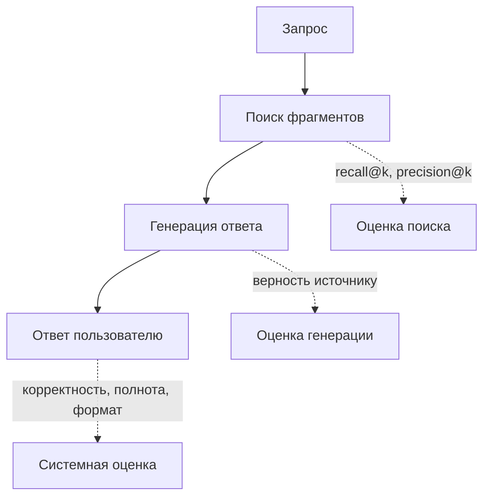
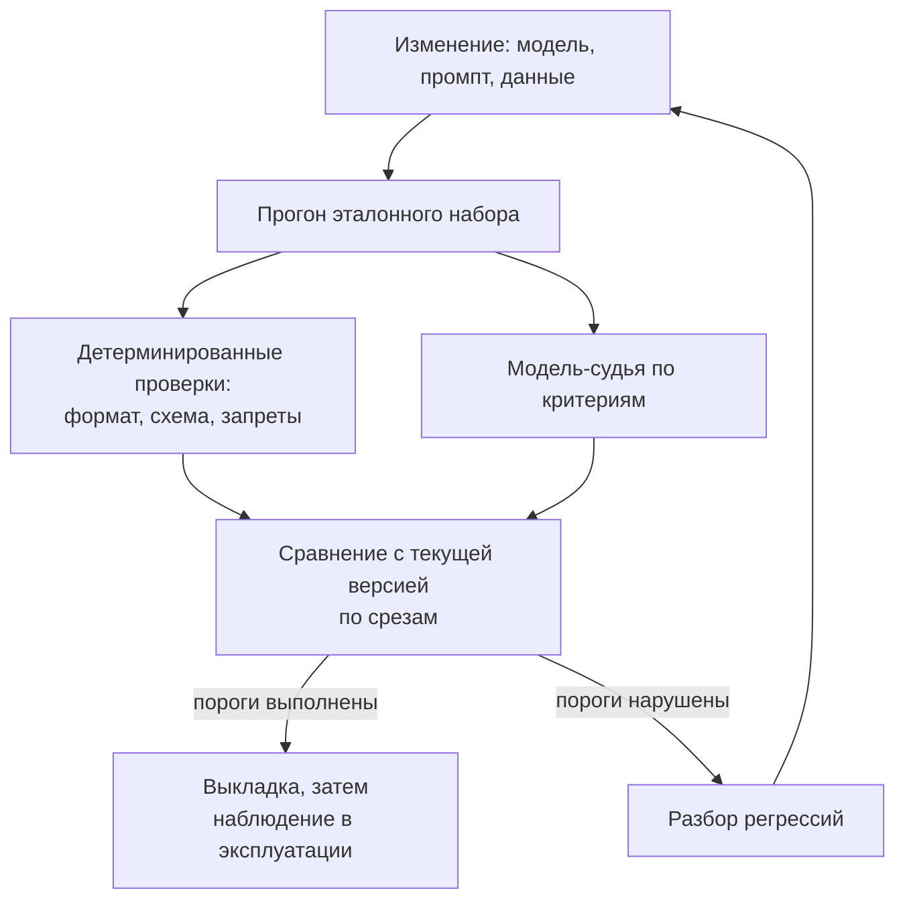

# 5.4 Оценка качества ИИ-систем (evals)

## Зачем это аналитику

«Работает хорошо» — не критерий приёмки. ИИ-система недетерминирована, и без набора оценок невозможно ни принять её, ни сменить модель, ни заметить деградацию. Требования к качеству ИИ-функции и способ их проверки — прямая работа аналитика.

## Что понять

- [ ] Почему обычное тестирование не подходит: нет единственного правильного ответа, недетерминированность, зависимость от данных.
- [ ] Уровни оценки: компоненты (поиск, классификатор, извлечение) и система целиком (ответ пользователю).
- [ ] Эталонный набор (golden set): как собрать, сколько примеров нужно, как покрыть сложные и граничные случаи, как поддерживать.
- [ ] Метрики: точные совпадения и классические (precision, recall, F1) там, где можно; для текстов — верность источнику, полнота, релевантность, соблюдение формата.
- [ ] LLM как судья: когда допустим, как калибровать по человеческой разметке, типичные искажения.
- [ ] Регрессия: прогон набора при каждой смене модели, промпта или данных; пороги приёмки.
- [ ] Оценка в эксплуатации: обратная связь пользователей, выборочная разметка, мониторинг дрейфа, A/B-сравнение.
- [ ] Precision и recall на пальцах и компромисс между ними в бизнес-терминах.

## Урок

<!-- LESSON:START -->
### Почему тест-кейсы не работают

Классический тест-кейс устроен просто: вход, ожидаемый выход, сравнение на равенство. Для ИИ-функции ломается каждая из трёх частей.

Во-первых, у большинства запросов нет единственного правильного ответа. На вопрос «какой срок возврата товара надлежащего качества» корректно ответить десятком формулировок, и все они будут верны. Сравнение строк отбракует хорошие ответы и пропустит плохие, если плохой случайно совпал с эталоном по словам.

Во-вторых, система недетерминирована. Даже при нулевой температуре провайдер может менять инфраструктуру, порядок вычислений или саму модель под тем же именем. Один прогон теста ничего не доказывает: ответ, прошедший проверку утром, вечером может выйти другим.

В-третьих, поведение зависит от данных, которых нет в тесте. RAG-ассистент отвечает по базе знаний; когда в базу добавили новый регламент, ответы на старые вопросы изменились, хотя код не менялся. Классификатор обращений деградирует, когда клиенты начинают писать о новом продукте.

Отсюда смена подхода. Вместо «прошёл / не прошёл» на одном примере — статистическая оценка на наборе: доля ответов, удовлетворяющих критериям, с порогом приёмки. Вместо равенства строк — набор критериев качества и способ проверки каждого. Вместо однократной приёмки — постоянный контур: прогон при каждом изменении и наблюдение в эксплуатации. Этот набор проверок и называют оценками (evals).

### Два уровня оценки

Составная ИИ-система — это цепочка: разбор запроса, поиск, переранжирование, генерация, постобработка. Оценивать только итоговый ответ недостаточно: при плохом результате непонятно, где сломалось.

**Оценка компонентов** проверяет каждое звено отдельно, и там, как правило, есть проверяемая истина:

- поиск (retrieval): попал ли нужный документ в первые k результатов (recall@k), какая доля выданных документов релевантна (precision@k);
- классификатор намерений или тематики: обычные precision, recall, F1 по классам, матрица ошибок;
- извлечение полей (из договора, платёжного поручения, накладной): точное совпадение по каждому полю после нормализации (даты, суммы, ИНН).

**Оценка системы целиком** смотрит на то, что получил пользователь: ответ верен, опирается на источники, полон, в нужном формате, не содержит запрещённого.

Эти уровни дополняют друг друга. Системная метрика говорит, есть ли проблема; компонентные — где она. Если доля верных ответов упала, а recall@5 поиска остался прежним, искать надо в промпте или модели генерации. Если упал recall поиска — в индексации или разбиении документов на фрагменты.

### Эталонный набор

Эталонный набор (golden set) — это зафиксированные примеры входов с тем, что считать хорошим результатом. Для извлечения полей это точные значения. Для открытых ответов — не готовый текст, а ключевые факты, которые ответ обязан содержать, ссылки на правильные источники и то, чего в ответе быть не должно.

#### Откуда брать примеры

Лучший источник — реальные запросы: логи пилота, обращения в поддержку, вопросы из чатов сотрудников. Синтетические примеры, сгенерированные моделью, полезны для расширения покрытия, но их распределение отличается от реального: они грамотнее, короче и «удобнее» настоящих вопросов.

Набор должен покрывать не только типичное, но и трудное:

- частые запросы — чтобы метрика отражала массовый опыт;
- граничные случаи: неоднозначные формулировки, опечатки, смешение языков, очень длинные вопросы;
- вопросы, ответа на которые в базе нет, — правильное поведение здесь «не знаю», а не выдумка;
- вопросы с противоречивыми источниками (старая и новая редакция регламента);
- вредоносные и нецелевые запросы — попытки вытащить системный промпт, вопросы не по теме;
- известные прошлые провалы — каждый найденный в эксплуатации дефект превращается в пример набора.

Полезно размечать примеры по срезам (тип вопроса, продукт, сложность) и считать метрики по каждому срезу. Среднее может не измениться, пока в одном срезе качество падает вдвое.

#### Сколько примеров нужно

Точного числа нет, но есть логика. Метрика на наборе — это оценка доли, и у неё есть погрешность. Для доли p на n примерах стандартная ошибка примерно равна корню из p(1−p)/n. При p около 0,8 и n = 100 это около 4 процентных пунктов, то есть 95-процентный интервал — примерно ±8 п. п. При n = 400 — около ±4 п. п.

Практический вывод: несколько десятков примеров хватает, чтобы на ранней стадии ловить грубые поломки и итерировать промпт. Чтобы уверенно различать версии, отличающиеся на несколько пунктов, нужны сотни. Если срезы важны по отдельности, требование к объёму относится к каждому срезу.

#### Поддержка

Эталонный набор — живой артефакт, у него есть владелец и версия. Регламенты меняются, и эталонный ответ устаревает. Раз в период набор пересматривают: убирают устаревшее, добавляют новые темы и дефекты из эксплуатации. Важно не «подгонять» систему под набор: если промпт годами шлифуют на одних и тех же 200 примерах, метрика растёт, а реальное качество — нет. Помогает отложенная часть набора, на которой не итерируют, а только принимают версии.

### Метрики

#### Там, где есть правильный ответ

Если задачу можно свести к классификации или извлечению — это стоит сделать, потому что такие метрики дешёвые, объективные и стабильные. Точное совпадение (exact match) после нормализации подходит для полей и кодов. Для классов — precision, recall и F1.

**Precision и recall на пальцах.** Пусть система помечает обращения клиентов банка как «подозрение на мошенничество».

- Precision (точность): из всех помеченных — какая доля действительно мошенничество. Низкая точность — много ложных тревог.
- Recall (полнота): из всех реальных случаев мошенничества — какую долю система поймала. Низкая полнота — пропуски.
- F1 — гармоническое среднее двух, удобно как одна цифра, но скрывает, чем именно вы жертвуете.

Почти всегда можно поднять одно за счёт другого, сдвинув порог уверенности. Пометить всё подряд — полнота 100%, точность мизерная. Помечать только очевидное — точность высокая, половина случаев пропущена.

Выбор — бизнес-решение, и его надо проговаривать в стоимости ошибок:

| Ситуация | Что дороже | Что приоритетнее |
|---|---|---|
| Антифрод по платёжным поручениям | Пропущенный мошеннический платёж | Recall, ложные тревоги разбирает оператор |
| Автоматическая блокировка счёта клиента | Блокировка честного клиента | Precision |
| Поиск документов для ответа ассистента | Пропущенный нужный регламент | Recall поиска, лишнее отсеет переранжирование |
| Автоответ клиенту без проверки человеком | Неверный ответ от имени компании | Precision: лучше «передаю специалисту» |

Хорошая формулировка требования звучит так: «при полноте не ниже X точность не ниже Y», плюс указание, что происходит с сомнительными случаями.

#### Там, где ответ — свободный текст

Для генерации используют критерии, которые проверяют отдельно:

- **верность источнику (faithfulness, groundedness)** — каждое утверждение ответа подтверждается найденными фрагментами; это главный критерий против выдумки;
- **корректность** — ответ совпадает по смыслу с ключевыми фактами эталона;
- **полнота** — перечислены все обязательные условия, а не только первое;
- **релевантность** — ответ отвечает на заданный вопрос, а не на соседний;
- **соблюдение формата** — JSON валиден по схеме, есть ссылки на источники, длина в пределах.

Формат, наличие ссылок, запрещённые слова, валидность JSON проверяются кодом детерминированно. Остальное требует суждения — человека или модели-судьи. Шкала должна быть простой. Бинарная оценка «соответствует / не соответствует» с чётким определением воспроизводится лучше, чем шкала 1–10, где никто не может объяснить разницу между 6 и 7.

Метрики лексического пересечения с эталоном (BLEU, ROUGE) для ответов ассистента подходят плохо: верный ответ другими словами получает низкий балл.

### LLM как судья

Модель-судья (LLM-as-a-judge) получает вопрос, ответ, иногда источники и эталон, и выносит оценку по критерию. Это масштабирует оценку до тысяч ответов, но судья — тоже недетерминированная модель со своими ошибками.

#### Когда допустимо

Судья хорошо работает на узких вопросах с явным определением: «содержит ли ответ утверждения, которых нет в приведённых фрагментах», «упомянут ли срок и условие о сохранении чека». Плохо — на размытых: «насколько ответ хорош по шкале от 1 до 10». Судья не заменяет экспертизу там, где сам вопрос требует знаний предметной области, которых нет в контексте.

#### Калибровка

Судью принимают так же, как любую ИИ-функцию, — по разметке:

1. Эксперт вручную размечает выборку ответов по критерию, фиксируя обоснование.
2. Судья оценивает те же ответы.
3. Считают согласие: долю совпадений, а для несбалансированных классов — отдельно, насколько судья находит плохие ответы (его recall по классу «плохо») и насколько ему можно верить, когда он говорит «плохо».
4. Разбирают расхождения. Часто виноват не судья, а нечёткий критерий: два эксперта тоже разошлись бы.
5. Уточняют промпт судьи, добавляют примеры, повторяют на новой выборке, чтобы не подогнать судью под старую.

Полезно сравнить согласие судьи с человеком с согласием двух людей между собой: требовать от судьи большего, чем достижимо для людей, бессмысленно.

#### Типичные искажения

- **Позиционное смещение**: при сравнении двух ответов предпочтение первому или второму. Лечится прогоном в обоих порядках.
- **Предпочтение длинных ответов**: развёрнутый ответ кажется полнее, даже если содержит лишнее.
- **Предпочтение «своего»**: модель склонна выше оценивать тексты своей же модели или семейства.
- **Уверенный тон**: уверенно написанная ошибка оценивается выше неуверенной правды.
- **Снисходительность**: судьи склонны ставить «хорошо», если критерий не требует явно найти изъян.

Судья версионируется вместе с промптом: смена модели судьи меняет шкалу, и старые и новые цифры становятся несравнимы.

### Регрессия и пороги приёмки

Любое изменение — модели, промпта, параметров поиска, правил разбиения документов, самой базы знаний — может ухудшить качество. Поэтому прогон эталонного набора встраивают в процесс изменений так же, как регрессионные автотесты.

Пороги бывают двух видов. Абсолютные: «верность источнику не ниже заданного уровня», «ноль случаев раскрытия системного промпта на наборе атак». Относительные: «новая версия не хуже текущей более чем на N п. п. ни в одном срезе». Жёсткие требования безопасности формулируют как абсолютный запрет, качество — как не-ухудшение.

#### Разобранный пример: переход на более дешёвую модель

Интернет-магазин использует ассистента для ответов покупателям о доставке, оплате и возвратах. Предлагают заменить модель генерации на более дешёвую. Как принять решение.

1. **Критерии и пороги.** Заранее, до прогона, фиксируют: верность источнику, корректность по ключевым фактам, полнота условий, корректный отказ на вопросы без ответа в базе, формат со ссылкой на статью. Порог: не хуже текущей версии более чем на 2 п. п. по каждому критерию, отказ на вопросы без ответа — не хуже, чем сейчас.
2. **Набор.** 400 вопросов из реальных логов, размеченных по темам (доставка, оплата, возврат, акции) и сложности, плюс 50 вопросов без ответа в базе и 30 провокационных.
3. **Прогон.** Обе модели отвечают на весь набор, каждый вопрос — несколько раз, чтобы оценить разброс. Поиск общий, меняется только генерация — так различия относятся именно к модели.
4. **Оценка.** Формат и ссылки — кодом. Верность и корректность — откалиброванным судьёй. Спорные ответы и все случаи, где версии расходятся, — выборочно человеком.
5. **Результат.** Допустим, средняя корректность отличается на 1 п. п. — в пределах погрешности. Но в срезе «возвраты» дешёвая модель чаще теряет второе условие (сроки и состояние товара), полнота там ниже на 9 п. п. На среднем это почти не видно, потому что возвраты — около шестой части набора.
6. **Решение.** Варианты: оставить дорогую модель только для темы возвратов (маршрутизация), доработать промпт и повторить прогон, либо принять с записью риска. Решение фиксируется вместе с цифрами.

Главный урок примера — смотреть на срезы и на разброс, а не на одно среднее.

### Оценка в эксплуатации

После запуска эталонных ответов для реальных запросов нет. Качество приходится оценивать косвенно и выборочно.

- **Явная обратная связь**: оценки «полезно / нет», жалобы. Сигнал смещённый — голосует малая и недовольная доля, — но годится для поиска проблемных тем.
- **Неявные сигналы**: пользователь переформулировал вопрос, ушёл в поддержку к человеку, скопировал ответ, завершил сценарий. Для каждой функции набор своих.
- **Выборочная разметка**: регулярно отбирают случайную выборку диалогов и размечают её людьми или откалиброванным судьёй по тем же критериям, что и на эталонном наборе. Это даёт метрику качества на реальном трафике.
- **Онлайн-проверки без эталона**: верность источнику можно проверять судьёй на каждом ответе, сравнивая с найденными фрагментами, — эталон для этого не нужен.
- **Мониторинг дрейфа**: меняется ли распределение тем и длины запросов, доля вопросов, на которые поиск ничего не находит, доля отказов. Рост вопросов о новом продукте, которого нет в базе, — сигнал обновить базу и набор.
- **A/B-сравнение**: часть трафика получает новую версию, сравнивают бизнес-метрики — долю решённых без оператора обращений, повторные обращения, конверсию. Нужна заранее выбранная метрика и достаточный объём трафика.

Всё найденное в эксплуатации возвращается в эталонный набор. Так замыкается цикл: эксплуатация поставляет новые трудные примеры, набор защищает от их повторения.

Для этого нужна наблюдаемость: логирование запроса, найденных фрагментов, версии промпта и модели, ответа, оценок. Без версии в логе невозможно понять, какая конфигурация дала плохой ответ. Логирование персональных данных при этом должно подчиняться требованиям безопасности — об этом модуль 5.5.

### Критерии приёмки как раздел постановки

Для аналитика итог всего сказанного — раздел требований, который отвечает на вопросы:

- какие критерии качества, с определениями и примерами «хорошо / плохо»;
- на каком наборе проверяем: источник, объём, срезы, владелец, порядок обновления;
- как проверяем каждый критерий: код, судья (с каким уровнем согласия с людьми), эксперт;
- пороги: абсолютные для безопасности, относительные для качества, по срезам;
- что запускает повторную проверку: смена модели, промпта, данных, параметров;
- как контролируем в эксплуатации: какие сигналы, какая выборка, кто размечает, какая реакция на падение.

### Типичные ошибки

- Принимать ИИ-функцию по демонстрации на десятке удачных вопросов без набора и порогов.
- Смотреть только на итоговый ответ и не мерить поиск отдельно, из-за чего не понятно, что чинить.
- Использовать одну среднюю метрику и не видеть провала в отдельном срезе.
- Доверять модели-судье без калибровки по человеческой разметке и без проверки на смещения.
- Собирать эталонный набор только из синтетических или только из «удобных» вопросов, без вопросов без ответа и провокаций.
- Формулировать шкалу 1–10 без определений: оценки не воспроизводятся ни людьми, ни судьёй.
- Не версионировать набор, промпт и судью, после чего цифры разных месяцев несравнимы.

### Как говорить об этом на собеседовании

Уровень senior виден по тому, что вы говорите о качестве как о требовании с проверяемым критерием, а не как об ощущении. Хорошая структура ответа: «разделяю оценку компонентов и системы; для поиска — recall@k, для ответа — верность источнику, корректность, полнота и формат; эталонный набор из реальных запросов со срезами и трудными случаями; судья откалиброван по разметке экспертов; пороги — не-ухудшение по каждому срезу и абсолютный запрет на утечки; в эксплуатации — выборочная разметка и обратная связь, дефекты возвращаются в набор».

Полезно показать, что вы понимаете статистику: назвать порядок погрешности на ста примерах и объяснить, почему для сравнения версий нужны сотни. Компромисс precision и recall переводите в деньги и риски конкретного бизнеса — например, «в антифроде пропуск дороже ложной тревоги, поэтому фиксируем минимальную полноту и уже при ней оптимизируем точность».

### Коротко

- ИИ-функцию принимают статистически: доля успешных ответов на наборе с порогом, а не пример за примером.
- Оценивают два уровня: компоненты с проверяемой истиной и систему целиком по критериям качества.
- Эталонный набор строится из реальных запросов, покрывает трудные случаи и срезы, версионируется и пополняется дефектами из эксплуатации.
- Где задачу можно свести к классификации или извлечению — используйте точные метрики; для текста — верность, корректность, полноту, релевантность и формат.
- Precision и recall — выбор между ложными тревогами и пропусками; его делают по стоимости ошибок.
- Модель-судья допустима на узких критериях и только после калибровки по человеческой разметке.
- Любая смена модели, промпта или данных запускает регрессионный прогон с порогами по срезам.
- В эксплуатации качество оценивают по сигналам пользователей, выборочной разметке, мониторингу дрейфа и A/B-сравнениям.
<!-- LESSON:END -->

## Читать дальше

- Chip Huyen, AI Engineering — главы об оценке.
- Hamel Husain, статьи «Your AI Product Needs Evals» и «Creating a LLM-as-a-Judge» (hamel.dev).

На system-design.space:

- [Оценивание и наблюдаемость для AI-систем](https://system-design.space/chapter/ai-evaluation-observability/)
- [Precision и recall на пальцах](https://system-design.space/chapter/precision-recall-basics/)
- [Человек в контуре, качество данных и операционный цикл AI](https://system-design.space/chapter/human-in-the-loop-data-quality-ops/)
- [Выпуск моделей, калибровка и контуры экспериментов](https://system-design.space/chapter/model-release-calibration-experiments/)

## Практика

1. Для RAG из модуля 5.2 определить 4–5 критериев качества ответа, шкалу оценки по каждому и пороги приёмки.
2. Разметить вручную 20 ответов модели по этим критериям, затем попросить модель-судью оценить те же ответы. Посчитать долю совпадений и разобрать расхождения.
3. Написать раздел «Критерии приёмки» для обезличенной ИИ-функции: метрики, эталонный набор, пороги, кто и как проверяет.

## Вопросы для самопроверки

1. Почему ИИ-функцию нельзя принять обычными тест-кейсами?
2. Как собрать эталонный набор и сколько в нём должно быть примеров?
3. Чем precision отличается от recall? Приведите бизнес-пример, где важнее одно, и пример, где важнее другое.
4. Когда можно использовать LLM как судью и как проверить, что судья адекватен?
5. Как убедиться, что смена модели на более дешёвую не ухудшила качество?
6. Как отслеживать качество после запуска, если эталонного ответа для реальных запросов нет?

## Заметки

<!-- Свои формулировки, ошибки, ссылки. -->
