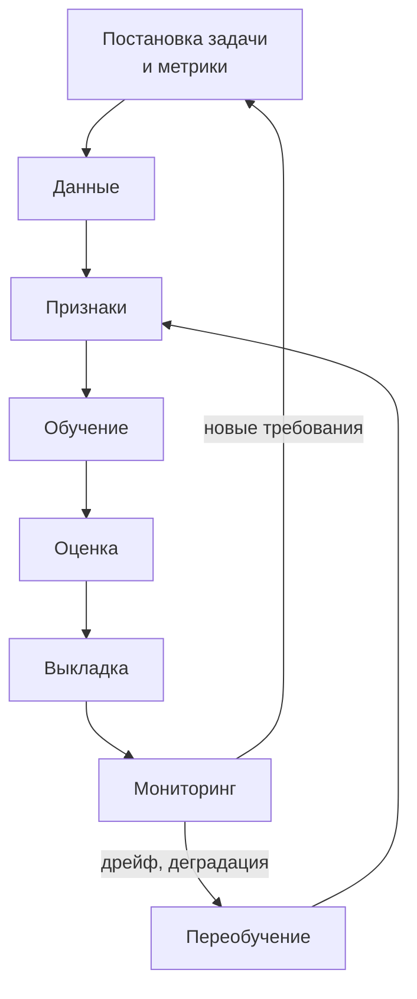

# 5.6 ML-системы в эксплуатации: от данных до переобучения

## Зачем это аналитику

Классический ML (прогноз спроса, скоринг, антифрод, рекомендации) — это не модель, а система вокруг неё: данные, признаки, обучение, выкладка, мониторинг, переобучение. Модель — меньшая часть работы. Вы знаете такую систему изнутри по прогнозированию спроса; модуль даёт язык и схему, чтобы рассказывать о ней как архитектор.

## Что понять

- [ ] Жизненный цикл: постановка задачи и метрики → данные → признаки → обучение → оценка → выкладка → мониторинг → переобучение.
- [ ] Пакетный и онлайн-инференс: когда прогноз считается заранее, а когда по запросу; требования к задержке.
- [ ] Feature store: зачем, офлайн- и онлайн-хранилище, согласованность признаков при обучении и в эксплуатации (training-serving skew).
- [ ] Утечка данных из будущего (data leakage) и почему валидация временных рядов делается по времени, а не случайно.
- [ ] Выкладка моделей: реестр моделей, теневой режим, canary, A/B-тест, откат.
- [ ] Мониторинг: дрейф входных данных, дрейф целевой переменной, деградация качества при запаздывающих фактах.
- [ ] Переобучение: по расписанию или по сигналу, контроль качества новой версии перед выкладкой.
- [ ] Бизнес-метрика против ML-метрики: например, ошибка прогноза против упущенных продаж и остатков.

## Урок

<!-- LESSON:START -->
### Модель — меньшая часть системы

Когда говорят «у нас ML-прогноз спроса», обычно представляют алгоритм. В эксплуатации же большая часть кода и почти все инциденты связаны не с ним, а с тем, что вокруг: загрузка продаж и остатков, расчёт признаков, календарь акций, расписание расчёта, передача прогноза в заказ, контроль качества, переобучение. Модель можно заменить за неделю; систему вокруг неё строят годами.

Для архитектора это значит, что ML-система описывается как обычная система данных с дополнительными свойствами: результат вероятностный, качество узнаётся с задержкой, а поведение зависит от данных, которые меняются без изменения кода.

### Жизненный цикл

Жизненный цикл удобно описывать как цикл, а не как линию, потому что эксплуатация постоянно возвращает систему к данным и обучению.

- **Постановка задачи и метрики.** Что прогнозируем, на каком уровне (товар в магазине в день или товар в регионе в неделю), на какой горизонт, как прогноз используется и какой бизнес-результат считаем успехом. Ошибка здесь не лечится хорошей моделью.
- **Данные.** Источники, их качество, задержки, история изменений. Для спроса — чеки, остатки, поставки, цены, промо, ассортиментная матрица, календарь.
- **Признаки.** Преобразование сырых данных в то, что видит модель: лаги продаж, скользящие средние, признаки промо и цены, день недели, праздники.
- **Обучение и оценка.** Подбор модели и проверка на отложенных данных с правильной схемой валидации.
- **Выкладка.** Перевод версии в эксплуатацию с возможностью отката.
- **Мониторинг.** Качество данных, распределения признаков, прогнозы, фактическая ошибка и бизнес-метрики.
- **Переобучение.** Обновление модели на свежих данных по расписанию или по сигналу.

### Пакетный и онлайн-инференс

Инференс (inference) — расчёт предсказания обученной моделью. Он бывает двух видов.

**Пакетный (batch)**: прогнозы считаются заранее для всех объектов по расписанию и сохраняются в таблицу, откуда их читают потребители. Прогноз спроса — классический пример: ночью после загрузки продаж за день считается прогноз на ближайшие недели для каждой пары «товар — магазин», утром его использует расчёт заказов. Требования к задержке мягкие — важно уложиться в окно между поступлением данных и формированием заказов, — зато объём большой: миллионы пар.

**Онлайн (online, real-time)**: предсказание считается по запросу, когда нужен ответ здесь и сейчас с учётом свежего контекста. Антифрод по платежу, рекомендации на странице интернет-магазина, скоринг заявки. Задержка измеряется миллисекундами, нужны доступность уровня основного сервиса, горизонтальное масштабирование и деградация при отказе модели (правило-заглушка, ответ по умолчанию).

Выбор определяется не модой, а тем, меняется ли ответ от информации, появившейся секунды назад, и сколько объектов нужно покрыть. Если прогноз нужен раз в сутки для всех — пакетный режим проще, дешевле и надёжнее. Существует и промежуточный вариант: заранее рассчитанный базовый прогноз, который онлайн корректируется по свежим событиям.

### Признаки и training-serving skew

Расхождение между обучением и эксплуатацией (training-serving skew) — ситуация, когда признаки, на которых модель училась, считаются не так, как признаки, которые она получает в работе. Модель при этом не падает, а тихо ухудшается.

Как это возникает:

- признаки для обучения считает аналитик в SQL по историческому хранилищу, а в эксплуатации — разработчик в сервисе на другом языке, и они по-разному обрабатывают пропуски, возвраты или границы суток;
- при обучении использовались очищенные «задним числом» данные, а в эксплуатации приходят сырые, с опозданиями и дублями;
- при обучении «продажи за вчера» известны полностью, а в момент ночного расчёта часть магазинов ещё не прислала чеки.

**Хранилище признаков (feature store)** — компонент, который делает определение признака единым для обучения и эксплуатации. Признак описывается один раз, а платформа материализует его в два места:

- **офлайн-хранилище** — полная история значений признаков с временными метками; из него собирают обучающие выборки с корректными значениями «на момент времени» (point-in-time), то есть ровно такими, какими они были известны тогда;
- **онлайн-хранилище** — актуальные значения с низкой задержкой чтения по ключу для онлайн-инференса.

Помимо устранения расхождений, хранилище признаков даёт повторное использование (один признак — несколько моделей), каталог с владельцами и описаниями и контроль свежести. Для небольшой системы с пакетным инференсом отдельный продукт может быть избыточен: того же достигают общей библиотекой расчёта признаков, которая вызывается и при обучении, и в эксплуатации, плюс витриной с датой актуальности. Принцип важнее инструмента: одно определение признака, одна реализация.

### Утечка данных из будущего

Утечка данных (data leakage) — попадание в обучение информации, которой в момент реального прогноза не будет. Модель на тестах выглядит отлично, а в эксплуатации оказывается заметно хуже.

Типичные источники в прогнозе спроса:

- признак «средние продажи товара за месяц» посчитан по всему месяцу, включая дни после даты прогноза;
- используются фактические остатки или фактическая цена на день продажи, хотя при расчёте заказа за неделю вперёд они неизвестны — известна только плановая цена;
- признак промо взят из итогового отчёта, где отмечены только состоявшиеся акции, а в момент прогноза известен план, который потом меняли;
- нормализация и заполнение пропусков вычислены по всему набору данных, включая тестовый период.

Отдельно — **валидация временных рядов**. Случайное разбиение на обучение и тест перемешивает дни: модель учится на среду и четверг и «предсказывает» вторник между ними, фактически интерполируя. Соседние дни коррелированы, и оценка получается завышенной. Кроме того, случайное разбиение не воспроизводит главную трудность эксплуатации — прогноз вперёд при смене сезона, ассортимента и цен.

Правильная схема — разбиение по времени: обучаемся на прошлом, проверяем на следующем за ним периоде, с тем же горизонтом, что в эксплуатации. Лучше — несколько таких окон со сдвигом (скользящая или расширяющаяся валидация, walk-forward), чтобы увидеть устойчивость по сезонам. Если прогноз делается на 14 дней вперёд по данным, доступным к вечеру дня D, то и в валидации признаки должны браться на момент D, а ошибка считаться на днях D+1…D+14.

### Выкладка моделей

Новая версия модели — такое же изменение продукта, как новая версия кода, только её поведение труднее предсказать. Поэтому выкладка строится поэтапно.

- **Реестр моделей (model registry)** хранит версии с метаданными: на каких данных и каким кодом обучена, какие признаки ожидает, какие метрики показала, кто утвердил, в каком статусе (кандидат, в эксплуатации, в архиве). Это основа воспроизводимости и отката.
- **Теневой режим (shadow)**: новая версия считает прогнозы на реальных данных параллельно с текущей, но её результат никуда не передаётся. Сравнивают прогнозы и, когда придут факты, ошибки. Для пакетного прогноза это почти бесплатно и очень информативно.
- **Canary**: новая версия обслуживает малую долю объектов — например, несколько магазинов или одну товарную группу, — с контролем метрик и готовностью откатиться.
- **A/B-тест**: объекты случайно делятся на группы, и сравнивается бизнес-метрика. В ритейле рандомизируют обычно по магазинам, а не по товарам внутри магазина, потому что товары влияют друг на друга (замещение, общая полка, общий заказ). Магазинов немного и они разнородны, поэтому тест требует аккуратного подбора групп и времени.
- **Откат**: предыдущая версия остаётся в реестре и готова к работе; переключение — изменение конфигурации, а не повторное обучение. Для пакетного режима также нужен план: что делать с уже переданными в заказ прогнозами.

### Мониторинг

Особенность ML-мониторинга — качество модели часто невозможно измерить сразу. Факт продаж по прогнозу на две недели вперёд станет известен только через две недели, а для скоринга кредита — через месяцы. Поэтому мониторинг строят слоями — от того, что видно сразу, к тому, что видно позже.

| Слой | Что контролируем | Когда видно |
|---|---|---|
| Данные | Полнота загрузки, доля пропусков, дубли, задержки источников, схема | Сразу |
| Входные признаки | Распределения по сравнению с обучающими данными | Сразу |
| Прогнозы | Распределение прогнозов, доля нулей, выбросы, сумма по сети против истории | Сразу |
| Целевая переменная | Изменение распределения фактических продаж | По мере прихода фактов |
| Качество | Ошибка прогноза по горизонтам и срезам | С задержкой на горизонт |
| Бизнес | Упущенные продажи, остатки, списания, доступность на полке | С ещё большей задержкой |

**Дрейф входных данных (data drift, covariate shift)** — изменение распределения признаков: новые магазины другого формата, изменилась ценовая политика, в чеках появился новый способ оплаты. Обнаруживается статистическим сравнением текущих распределений с эталонными — например, индексом стабильности популяции (PSI) или тестами на различие распределений — по каждому важному признаку и срезу.

**Дрейф целевой переменной** — меняется само поведение спроса: сезон, событие на рынке, конкурент открылся рядом. **Дрейф зависимости (concept drift)** — меняется связь между признаками и спросом: раньше скидка 20% удваивала продажи, теперь покупатели привыкли и реагируют слабее.

Пока факты не пришли, опираются на опережающие сигналы: дрейф входов, аномалии в прогнозах, а также частичные факты — ошибку по первым дням горизонта, которые уже наступили. Если ошибка прогноза на завтра выросла, вероятно, вырастет и ошибка на две недели.

### Переобучение

Переобучение (retraining) бывает двух видов:

- **По расписанию** — например, раз в неделю на свежих данных. Просто, предсказуемо, подходит, когда данные меняются постепенно.
- **По сигналу** — при обнаружении дрейфа, падения качества или значимом событии (новый формат магазинов, смена ассортимента). Требует надёжного мониторинга, иначе либо срабатывает слишком часто, либо не срабатывает вовсе.

На практике их сочетают: регулярное переобучение плюс внеплановое по сигналу.

Главное правило: новая версия, полученная автоматически, не выкатывается автоматически без проверки. Конвейер переобучения включает контроль качества данных, обучение, оценку на свежем отложенном периоде, сравнение с текущей версией по срезам и порогам, при необходимости теневой период — и только потом переключение. Модель, обученная на данных с дефектом загрузки, может выглядеть нормально по средней метрике и провалиться на конкретной категории.

### Бизнес-метрика против ML-метрики

ML-метрика измеряет точность предсказания: средняя абсолютная ошибка (MAE), взвешенная абсолютная процентная ошибка (WAPE), смещение (bias) — систематическая недо- или переоценка. Бизнес измеряет другое: упущенные продажи из-за отсутствия товара, уровень остатков и оборачиваемость, списания скоропортящегося, загрузку склада.

Связь между ними нелинейна и опосредована:

- Прогноз передаётся в расчёт заказа, где есть страховой запас, кратность упаковки, минимальная партия, графики поставок, ограничения полки. Улучшение прогноза на 2% может полностью поглотиться округлением до коробки.
- Ошибки несимметричны. Недопрогноз по молоку — пустая полка и упущенная выручка, перепрогноз — списание. Для товаров с долгим сроком хранения перепрогноз стоит лишь замороженных денег. Средняя ошибка это не различает, смещение — различает.
- Ошибка распределена неравномерно. Модель может хорошо прогнозировать массовые товары и плохо — медленно продающийся длинный хвост, где и сосредоточены упущенные продажи или остатки.
- Сами данные искажены решениями системы: если товара не было на полке, продажи были ноль, но спрос — нет. Обучение на таких данных без коррекции закрепляет недозаказ.

#### Разобранный пример: принимать ли новую модель

В сети магазинов с продуктами и бытовыми товарами прогноз считается ночью по каждой паре «товар — магазин» на 21 день и передаётся в автоматический заказ. Команда предлагает новую модель: по WAPE она лучше на 3 п. п. на отложенном квартале.

Вопросы, которые стоит задать до решения:

1. **Как валидировали.** По времени, с тем же горизонтом и с признаками на момент прогноза? Использовались ли плановые цены и промо, а не фактические?
2. **Где выигрыш.** Разбивка по категориям и скорости продаж: выигрыш может быть на массовых товарах при ухудшении на свежих продуктах.
3. **Смещение.** Не уменьшилась ли ошибка за счёт систематического занижения? Для скоропорта это снизит списания и увеличит пустые полки.
4. **Что будет с заказом.** Прогнать обе модели через тот же расчёт заказа на исторических данных (симуляция) и сравнить модельные остатки, дефицит и списания.
5. **Как выкатывать.** Теневой режим на две-три недели, затем canary на группе магазинов, сравнение с контрольной группой по доступности товара и списаниям.

Решение о выкладке принимают по бизнес-метрике с ограничениями по ML-метрике: «доля дней с нулевым остатком не выше текущей, списания не выше, смещение по скоропорту в пределах заданного коридора». ML-метрика служит ранним сигналом и способом отсеять явно плохие кандидаты, бизнес-метрика — критерием приёмки.

Для практики полезно учесть и типовые трудные случаи: праздники и акции, которые повторяются редко и сдвигаются по датам; новый товар без истории (прогноз по аналогам или по категории); запоздавшие данные из части магазинов (расчёт с флагом неполноты или на вчерашних данных); закрытие магазина на ремонт. У каждого должны быть способ обнаружения и заранее описанное поведение системы.

### Типичные ошибки

- Проверять модель временного ряда случайным разбиением и радоваться завышенной точности.
- Считать признаки для обучения и для эксплуатации двумя разными реализациями.
- Использовать в обучении фактические цены, остатки или промо, которые в момент прогноза неизвестны.
- Принимать модель по средней ML-метрике без разбивки по срезам, смещения и симуляции влияния на заказ.
- Автоматически выкатывать переобученную модель без сравнения с текущей и без возможности быстрого отката.
- Мониторить только инфраструктуру и ошибку по фактам, узнавая о проблеме через три недели вместо того, чтобы смотреть на входные данные и прогнозы сразу.
- Обучаться на продажах как на спросе, не учитывая дни отсутствия товара.

### Как говорить об этом на собеседовании

Сильная позиция — описывать ML-систему как систему данных с обратной связью, а не как модель. Расскажите о своём прогнозе спроса по схеме: источники и задержки данных, признаки с одним определением для обучения и эксплуатации, валидация по времени с тем же горизонтом, пакетный ночной расчёт и передача в заказ, поэтапная выкладка через теневой режим и группу магазинов, мониторинг слоями, переобучение по расписанию с контролем качества.

Уровень senior показывает связь с бизнесом: объясните, почему улучшение WAPE не гарантирует снижения дефицита — из-за кратности упаковки, страховых запасов, асимметрии ошибок и цензурированного спроса, — и как вы принимали бы новую версию по доступности товара и списаниям. Упомяните конкретные ловушки из опыта: запоздавшие данные магазинов, промо-календарь, который меняется после прогноза, новинки без истории.

### Коротко

- ML-система — это данные, признаки, обучение, выкладка, мониторинг и переобучение; модель — меньшая её часть.
- Пакетный инференс выбирают, когда прогноз нужен по расписанию для многих объектов, онлайн — когда ответ зависит от свежего контекста и нужен за миллисекунды.
- Хранилище признаков и единая реализация признаков устраняют расхождение между обучением и эксплуатацией.
- Временные ряды валидируют по времени, с тем же горизонтом и признаками «на момент прогноза», иначе оценка завышена.
- Новую версию выкатывают через реестр, теневой режим, canary или A/B с готовым откатом.
- Мониторинг строится слоями: данные и прогнозы видно сразу, качество и бизнес-эффект — с задержкой.
- Переобучение идёт по расписанию и по сигналу, но выкладка новой версии всегда проходит контроль.
- Приёмку ведут по бизнес-метрике с ограничениями по ML-метрике, учитывая асимметрию ошибок и логику заказа.
<!-- LESSON:END -->

## Читать дальше

- Chip Huyen, *Designing Machine Learning Systems* — главы о данных, признаках, выкладке и мониторинге.
- Google, «Rules of Machine Learning» (Martin Zinkevich) — короткий свод практик.

На system-design.space:

- [ML Lifecycle: от данных и обучения до рабочей среды и контуров обратной связи](https://system-design.space/chapter/ml-production-lifecycle-architecture/)
- [Хранилище признаков и сервинг моделей](https://system-design.space/chapter/feature-store-model-serving/)
- [Сервинг моделей и архитектура инференса](https://system-design.space/chapter/model-serving-inference-architecture/)
- [Конвейер MLOps](https://system-design.space/chapter/ml-ops-pipeline-case/)
- [Практика системного дизайна: конвейер MLOps](https://system-design.space/practice/mlops/)

## Практика

1. Нарисовать архитектуру обезличенной системы прогноза спроса для сети магазинов: источники, признаки, обучение, расчёт прогноза, передача в заказ, мониторинг, переобучение.
2. Составить таблицу «что может пойти не так»: утечка данных, дрейф, запоздавшие данные, праздники и акции, новый товар без истории. Для каждого пункта — как обнаружить и что делать.
3. Сформулировать связь ML-метрики и бизнес-метрики для прогноза спроса и предложить, по какой из них принимать новую версию модели.

## Вопросы для самопроверки

1. Из каких этапов состоит жизненный цикл ML-системы?
2. Что такое training-serving skew и как feature store помогает его избежать?
3. Почему временные ряды нельзя валидировать случайным разбиением?
4. Как безопасно выкатить новую версию модели?
5. Что такое дрейф данных и как его обнаружить, если фактические значения приходят с опозданием?
6. Почему хорошая ML-метрика не гарантирует бизнес-результат?

## Заметки

<!-- Свои формулировки, ошибки, ссылки. -->
