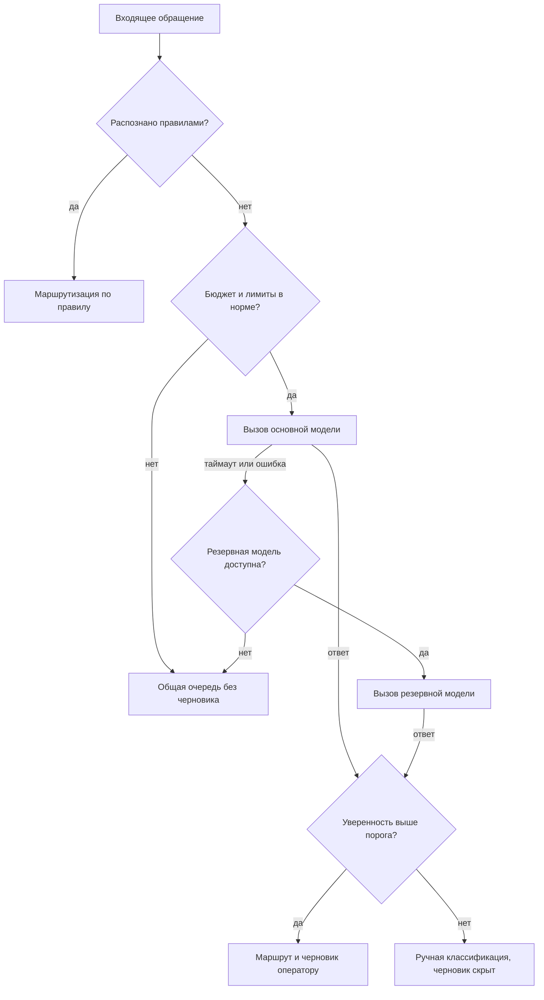

# 5.7 Как постановить ИИ-функцию: требования, приёмка, эксплуатация

## Зачем это аналитику

Постановка ИИ-функции отличается от обычной: результат вероятностный, качество измеряется на наборе, у функции есть стоимость каждого вызова и режимы отказа, которых нет у детерминированного кода. Этого модуля нет в готовых курсах — это синтез блока с точки зрения аналитика.

## Что понять

- [ ] С чего начинать: нужна ли здесь LLM вообще, или хватит правил, поиска или классического ML.
- [ ] Формулировка задачи: вход, выход, пользователь, что считается хорошим результатом, цена ошибки каждого типа.
- [ ] Требования к качеству: метрики, эталонный набор, пороги приёмки, кто размечает.
- [ ] Нефункциональные требования: задержка, стоимость на запрос и в месяц, лимиты провайдера, доступность и поведение при недоступности модели.
- [ ] Деградация и fallback: что видит пользователь при низкой уверенности, при отказе модели, при превышении бюджета.
- [ ] Человек в контуре: где ответ модели — черновик, а где решение; как пользователь исправляет и как это собирается для улучшения.
- [ ] Данные и безопасность: какие данные уходят в модель, где хранятся логи, права доступа, требования регулятора.
- [ ] Эксплуатация: мониторинг качества, стоимость, смена версии модели, процесс разбора жалоб.

## Урок

<!-- LESSON:START -->
Обычная постановка описывает, что система делает. Постановка ИИ-функции описывает ещё и то, насколько хорошо она это делает, сколько это стоит, что происходит, когда она ошибается, и кто за ошибку отвечает. Детерминированный код либо выполняет требование, либо нет. Модель выполняет его в какой-то доле случаев, и эта доля плавает от версии к версии, от данных к данным, от формулировки промпта. Поэтому требования смещаются от «что» к «с каким качеством, при каких условиях и что делать в остальных случаях».

Ниже — порядок, в котором аналитику стоит проходить постановку, и каркас документа, который из этого складывается.

### Шаг ноль: нужна ли здесь LLM

Первый вопрос к заказчику — не «какую модель берём», а «какую проблему решаем и как её решают сейчас». Большая языковая модель (LLM) — дорогой, медленный и недетерминированный инструмент. Она оправдана там, где вход — неструктурированный текст или смесь форматов, где правил слишком много или они не формализуются, где допустим ответ «в целом правильный» и где нужна генерация текста, а не выбор из списка.

| Признак задачи | Скорее хватит | Почему |
|---|---|---|
| Решение описывается десятком явных условий | Правила, справочники | Дешево, объяснимо, тестируется полностью |
| Нужно найти документ или запись по смыслу | Полнотекстовый или векторный поиск | Выдача ранжирована, модель не нужна для генерации |
| Выбор из фиксированного набора классов, есть тысячи размеченных примеров | Классический ML (классификатор) | Быстрее и дешевле на запрос, стабильнее |
| Числовой прогноз по истории | Классический ML, статистика | LLM плохо считает и не видит временные ряды |
| Свободный текст на входе, классов много или они меняются, нужен текстовый ответ | LLM | Работает без большой разметки, генерирует текст |

Типичная хорошая архитектура — гибрид: правила отсекают очевидное, поиск подбирает контекст, модель работает только на остатке. Например, обращения с номером платёжного поручения и словом «отзыв» маршрутизируются правилом, а модель получает только то, что правила не распознали.

Вопросы, которые стоит задать до согласия делать функцию на LLM:

- Как задача решается сейчас, сколько это занимает времени и сколько стоит?
- Что будет, если функция ошибётся? Кто заметит и когда?
- Есть ли примеры правильных ответов, и кто может их разметить?
- Какой уровень качества сделает функцию полезной, а какой — вредной?
- Какие данные попадут в модель, и можно ли их передавать внешнему провайдеру?
- Какой бюджет на эксплуатацию допустим в месяц?

Если на вопросы про цену ошибки и эталонные примеры ответа нет, делать функцию рано: её невозможно будет принять.

### Формулировка задачи

Постановка начинается с пяти элементов.

**Вход.** Что именно получает модель: текст обращения, вложения, историю переписки, карточку клиента, результаты поиска. Для каждого источника — формат, объём, доля пустых и мусорных значений. Объём входа определяет стоимость и задержку, так что его нужно оценить в токенах, а не «примерно страница».

**Выход.** Структура ответа: класс из справочника, поля JSON, текст черновика, ссылки на источники. Чем строже формат, тем проще проверять качество и встраивать результат в процесс. Свободный текст оставляют только там, где он действительно нужен, и даже тогда рядом возвращают структурированные поля: класс, уверенность, использованные источники.

**Пользователь.** Кто видит результат и что с ним делает: оператор правит черновик, клиент читает ответ сам, система автоматически маршрутизирует. От этого зависит допустимая цена ошибки.

**Хороший результат.** Описание словами и на примерах: что считается правильной классификацией, какой черновик приемлем, что недопустимо ни при каких условиях (выдуманная сумма, обещание, которого банк не давал, раскрытие данных другого клиента).

**Цена ошибки каждого типа.** Ошибки неравноценны. Для классификации это как минимум ложное срабатывание и пропуск; для генерации — неточность, которую пользователь заметит и исправит, и неточность, которую он не заметит. Нужно явно записать, какая ошибка дороже и насколько. Это определит, какую метрику оптимизировать и где ставить порог уверенности.

### Требования к качеству

Критерий приёмки вероятностной функции формулируется не на отдельном примере, а на наборе.

**Эталонный набор (golden set).** Выборка реальных входов с правильными ответами. Требования к нему: репрезентативность (распределение по классам и сложности как в эксплуатации), покрытие редких, но дорогих случаев отдельным срезом, фиксированная версия. Набор, собранный из «удобных» примеров, даст завышенную оценку.

**Метрики.** Для классификации — точность (precision) и полнота (recall) по каждому классу, а не только общая доля правильных ответов (accuracy): при перекосе классов общая доля скрывает провал на редком, но важном классе. Для генерации — оценка по рубрике (фактическая точность, полнота, соответствие тону, отсутствие запрещённого), выставляемая людьми или моделью-оценщиком (LLM-as-a-judge), откалиброванной на человеческих оценках. Подробнее о методах — в модуле об оценке качества.

**Пороги приёмки.** Формулировка должна быть проверяемой: «На эталонном наборе версии 1.0 из 500 обращений полнота класса "Претензия по списанию" не ниже 0,95, общая доля верной маршрутизации не ниже 0,85, доля черновиков с фактической ошибкой не выше 3%, ноль случаев раскрытия данных другого клиента». Порог выводится из цены ошибки и из текущего уровня людей, а не назначается «на глаз».

Размер набора имеет значение. При доле правильных ответов около 90% на 100 примерах погрешность оценки (95-процентный интервал) — порядка ±6 процентных пунктов, на 400 — около ±3. Если разница между двумя версиями промпта меньше погрешности, утверждать, что одна лучше, нельзя.

**Кто размечает.** Эталон размечают эксперты предметной области, а не разработчики. В требованиях фиксируются: кто размечает, по какой инструкции, как решаются разногласия (второй разметчик, арбитр), как часто набор пополняется. Если два эксперта расходятся в 20% случаев, требовать от модели 95% согласия с одним из них бессмысленно — сначала нужно договориться о критериях.

### Нефункциональные требования

У ИИ-функции есть НФТ, которых нет у обычного кода, или которые проявляются иначе.

**Задержка.** Время генерации растёт с длиной ответа. Для интерактивных сценариев фиксируют время до первого токена (time to first token) и полное время ответа по перцентилям, например p95. Для фоновой классификации задержка обычно некритична, и это открывает дешёвые режимы пакетной обработки, которые некоторые провайдеры предлагают со скидкой.

**Стоимость.** Конкретные цены меняются слишком часто, чтобы вписывать их в требования; в требования вписывается формула и бюджет:

```text
Стоимость запроса = T_in × P_in + T_out × P_out
  T_in, T_out — токены входа и выхода на один запрос (среднее или p90)
  P_in, P_out — цена за токен входа и выхода у выбранной модели

Стоимость в месяц = N × Стоимость запроса × (1 + k_retry) + C_fix
  N        — число запросов в месяц
  k_retry  — доля повторных вызовов (ошибки формата, ретраи, цепочки)
  C_fix    — регулярные расходы: прогоны оценки, эмбеддинги, мониторинг
```

Входные токены часто доминируют: системный промпт, инструкции и найденный контекст повторяются в каждом вызове. Кеширование промптов у провайдера и сокращение контекста снижают стоимость сильнее, чем смена модели.

**Лимиты провайдера.** Ограничения на число запросов и токенов в минуту, размер контекстного окна, максимальную длину ответа. Для пиковой нагрузки (утро понедельника, конец месяца) нужно проверить, что лимиты не упрутся, и определить поведение при отказе по лимиту: очередь, откладывание, резервная модель.

**Доступность.** Внешний API модели — зависимость со своей доступностью и деградациями. Доступность функции не может быть выше доступности провайдера без резервного пути. Требование формулируется так: «при недоступности основной модели дольше N секунд функция переходит в режим X».

**Воспроизводимость.** Одинаковый вход может давать разный выход. Если результат должен быть объясним постфактум (спор с клиентом, аудит), в логе сохраняется полный вход, версия модели, версия промпта и ответ.

### Деградация и fallback

Для каждого нештатного режима постановка отвечает на вопрос: что видит пользователь и что происходит с объектом процесса.



Три режима, которые нужно описать явно:

- **Низкая уверенность.** Модель не даёт калиброванной вероятности «из коробки», поэтому уверенность строят косвенно: согласие нескольких прогонов, отдельная оценка моделью, признак «не нашёл источника», правила проверки выхода. Ниже порога система не прячет результат молча, а честно показывает: «автоматическая классификация не выполнена». Порог настраивается на эталонном наборе по цене ошибок.
- **Отказ модели.** Таймаут, ошибка, невалидный формат после ретраев. Процесс не должен останавливаться: обращение уходит в ручную очередь. Для генерации черновика допустимо просто не показать его.
- **Превышение бюджета.** Месячный или дневной лимит расходов достигнут. Варианты: переключиться на более дешёвую модель, обрабатывать только приоритетные категории, отключить функцию до конца периода. Выбор — бизнес-решение, аналитик его выясняет и фиксирует.

Общее правило: fallback ведёт к процессу, который работал до внедрения функции. Если такого процесса уже нет, потому что людей сократили, отказ модели становится остановкой бизнеса, и это нужно проговорить заранее.

### Человек в контуре

Ключевое решение — статус ответа модели. Удобно различать три уровня:

- **Подсказка.** Модель предлагает, человек выбирает или игнорирует. Ошибка модели почти бесплатна.
- **Черновик.** Модель готовит результат, человек проверяет и подтверждает. Ошибка стоит времени на правку и риска, что проверяющий не заметит.
- **Решение.** Результат применяется без человека. Допустимо только там, где ошибка обратима, дешева или ловится на следующем шаге.

Уровень может различаться по классам и порогам: маршрутизацию типовых обращений система делает сама, а ответ по претензии всегда остаётся черновиком. Это прямо записывается в требования: «Автоматическая маршрутизация при уверенности выше порога для классов A, B, C; для класса D — только подсказка».

Риск черновика — эффект автоматизации (automation bias): через месяц оператор перестаёт читать и нажимает «отправить». Контрмеры в требованиях: обязательная подсветка фрагментов с суммами и датами, выборочный контроль отправленных ответов, метрика доли черновиков, отправленных без правок за подозрительно короткое время.

Исправления человека — главный источник улучшений, если их собирать. В постановку входят: сохранение исходного ответа модели и финальной версии, причина правки из короткого справочника («неверный класс», «фактическая ошибка», «тон»), возможность отметить ответ как вредный. Из этих данных пополняется эталонный набор и считается реальное качество в эксплуатации.

### Данные и безопасность

Вопросы, на которые постановка должна ответить:

- **Что уходит в модель.** Перечень полей. Персональные данные, банковская тайна, коммерческая тайна — нужны ли они модели на самом деле или их можно замаскировать до вызова и восстановить после.
- **Куда уходит.** Внешний провайдер, облако с размещением в определённой юрисдикции, собственная модель в контуре компании. От этого зависит, разрешена ли передача по требованиям регулятора и внутренним политикам: трансграничная передача персональных данных, требования к локализации, ограничения банковского регулирования.
- **Использует ли провайдер данные.** Условия договора: хранение запросов, использование для обучения, срок удаления.
- **Где логи.** Полные промпты и ответы — чувствительные данные. Срок хранения, кто имеет доступ, маскирование в логах, разделение технических логов и аудиторского следа.
- **Права доступа.** Если модель получает контекст через поиск, поиск обязан учитывать права пользователя: оператор не должен получить в черновике выдержку из документов клиента, к которому у него нет доступа. Фильтрация делается до передачи в модель, а не инструкцией в промпте.
- **Атаки через вход.** Текст обращения пишет внешний человек, значит, в нём может быть попытка внедрения инструкций (prompt injection). Требования: модель не имеет права на действия с побочными эффектами по содержимому обращения, выход проверяется по схеме. Подробности — в модуле о безопасности LLM.

### Эксплуатация

Функция без эксплуатационных требований деградирует незаметно.

**Мониторинг качества.** Онлайн-метрики, доступные без разметки: доля низкой уверенности, доля ручных переклассификаций, доля черновиков с правками, длина правок, жалобы. Плюс регулярная выборочная разметка свежих данных, чтобы сравнивать с эталоном. Резкий сдвиг распределения входов (новый продукт, сезон, изменение формы обращения) — повод перепроверить качество.

**Стоимость.** Дашборд расходов по дням и по функциям, алерты на превышение, разбивка на токены входа и выхода.

**Смена версии модели.** Провайдеры выпускают новые версии и выводят старые из эксплуатации. Требования: версия модели зафиксирована явно, а не через псевдоним «последняя»; переход на новую версию проходит прогон на эталонном наборе с теми же порогами приёмки; есть возможность отката; промпты версионируются вместе с кодом.

**Разбор жалоб.** Процесс: кто принимает жалобу на ответ, как находит запись по идентификатору (вход, версия модели и промпта, ответ), кто классифицирует причину, как случай попадает в эталонный набор и в план исправлений. Срок реакции на критичные случаи — отдельное требование.

### Пример: классификация обращений юрлиц с черновиком ответа

Банк для юрлиц получает обращения через чат и почту: вопросы по платёжным поручениям, выпискам, тарифам, претензии по списаниям. Сейчас их вручную разбирает первая линия.

**Задача.** Вход — текст обращения и до трёх последних сообщений переписки, реквизиты клиента из карточки. Выход — класс из справочника на 25 значений, уверенность, черновик ответа со ссылками на статьи базы знаний.

**Цена ошибок.** Неверный класс типового вопроса стоит минут переадресации. Пропущенная претензия по списанию — нарушение сроков рассмотрения и риск жалобы регулятору. Значит, для класса «Претензия» оптимизируется полнота, даже ценой ложных срабатываний. Черновик с неверной суммой или датой опаснее, чем отсутствие черновика.

**Статус ответа.** Маршрутизация автоматическая для 20 типовых классов при высокой уверенности; претензии и спорные случаи — всегда на человека. Черновик всегда проверяет оператор, суммы и даты в нём подсвечены.

**Экономика.** Порядок расчёта, без привязки к ценам:

```text
N          = 30 000 обращений в месяц
T_in       ≈ 2 500 токенов (инструкции, справочник, переписка, 3 статьи базы знаний)
T_out      ≈ 400 токенов (класс, уверенность, черновик)
Затраты    = N × (T_in × P_in + T_out × P_out) × (1 + k_retry) + C_fix

Экономия   = N × d_auto × t_saved × S_hour
  d_auto   — доля обращений, где функция реально сократила работу (из пилота)
  t_saved  — сэкономленные минуты на обращение, переведённые в часы
  S_hour   — полная стоимость часа оператора

Окупаемость: Экономия − Затраты − поддержка функции > 0
```

Расчёт делается для двух моделей: дорогая даёт выше качество и, возможно, большую d_auto; дешёвая дешевле на запрос, но может требовать больше правок. Решает разница в экономии, а не в цене токена. Отдельно учитывается стоимость внедрения: разметка эталона, интеграция, пилот. Важно, что d_auto и t_saved берутся из пилота с замером, а не из ожиданий: часть времени, «сэкономленного» на наборе текста, уходит на проверку черновика.

### Каркас шаблона постановки

Каркас ниже — последовательность разделов и ключевых вопросов. Полный шаблон под свои задачи собирается в практике.

| Раздел | Ключевые вопросы |
|---|---|
| Проблема и базовая линия | Как решается сейчас, сколько времени и денег, почему не правила или классический ML |
| Вход и выход | Источники, объём в токенах, формат выхода, структура полей |
| Пользователь и статус ответа | Кто получает результат, подсказка, черновик или решение, по каким классам |
| Цена ошибок | Типы ошибок, какая дороже, что недопустимо никогда |
| Качество и приёмка | Метрики, эталонный набор, пороги, кто и как размечает |
| НФТ | Задержка по перцентилям, стоимость по формуле, бюджет, лимиты, доступность |
| Деградация | Поведение при низкой уверенности, отказе модели, превышении бюджета |
| Данные и безопасность | Какие поля уходят, куда, логи, права, регулятор, защита от внедрения инструкций |
| Обратная связь | Как собираются правки и оценки, как пополняется эталон |
| Эксплуатация | Мониторинг качества и стоимости, смена версии модели, разбор жалоб |
| Экономика | Расчёт затрат и экономии, условия окупаемости, критерии остановки функции |

Последний пункт часто забывают: заранее записанное условие, при котором функцию выключают, защищает от ситуации, когда неудачный эксперимент живёт годами.

### Типичные ошибки

- Начинать с выбора модели, а не с проблемы и базовой линии: потом нечем доказать пользу.
- Писать критерий приёмки на единичных примерах из демо вместо порогов на эталонном наборе.
- Использовать одну общую метрику точности, когда цена ошибок по классам различается в разы.
- Не описывать поведение при отказе модели и превышении бюджета: первое же падение провайдера останавливает процесс.
- Считать стоимость только по цене токена выхода, забывая про повторяющийся контекст, ретраи и прогоны оценки.
- Объявлять ответ «черновиком» и не проектировать защиту от автоматического согласия оператора.
- Полагаться на инструкцию в промпте вместо фильтрации данных по правам доступа до вызова модели.

### Как говорить об этом на собеседовании

Сильный ответ начинается с вопроса «нужна ли тут LLM» и базовой линии, а не с архитектуры RAG. Покажите, что вы переводите вероятностное поведение в проверяемые требования: эталонный набор, метрики по классам, пороги, выведенные из цены ошибки. Формулировки вроде «для класса претензий мы оптимизировали полноту, потому что пропуск дороже ложного срабатывания» или «при недоступности модели обращение уходит в ручную очередь, процесс не останавливается» звучат как опыт, а не как пересказ статьи.

Хорошо работает расчёт экономики по формуле с явными допущениями и оговоркой, что допущения проверяются пилотом. Если был опыт с ИИ-функциями, расскажите про эксплуатацию: как меняли версию модели, как разбирали жалобы, что показал мониторинг. Именно это отличает внедрённую функцию от демо.

### Коротко

- Сначала проверить, не решается ли задача правилами, поиском или классическим ML; LLM оправдана для неструктурированного входа и генерации текста.
- Постановка фиксирует вход, выход, пользователя, образ хорошего результата и цену каждого типа ошибки.
- Приёмка вероятностной функции — пороги метрик на версионированном эталонном наборе, размеченном экспертами по инструкции.
- Специфичные НФТ: задержка по перцентилям, стоимость по формуле с бюджетом, лимиты провайдера, доступность внешней модели, воспроизводимость через логи.
- Для низкой уверенности, отказа модели и превышения бюджета описывается явный путь, обычно к ручному процессу.
- Статус ответа — подсказка, черновик или решение — задаётся по классам и порогам; правки людей собираются для улучшения.
- Данные фильтруются по правам до вызова модели; куда уходят данные и где лежат логи, решается с учётом регулятора.
- Эксплуатация включает мониторинг качества и расходов, контролируемую смену версии модели и процесс разбора жалоб.
<!-- LESSON:END -->

## Читать дальше

- Google PAIR, *People + AI Guidebook* (pair.withgoogle.com/guidebook) — проектирование ИИ-функций вокруг пользователя.
- Chip Huyen, AI Engineering — главы о планировании ИИ-приложений.

На system-design.space:

- [Стоимость и маршрутизация LLM](https://system-design.space/chapter/llm-cost-routing/)
- [Человек в контуре, качество данных и операционный цикл AI](https://system-design.space/chapter/human-in-the-loop-data-quality-ops/)
- [AI Engineering (short summary)](https://system-design.space/chapter/ai-engineering-book/)

## Практика

1. Составить шаблон постановки ИИ-функции (разделы и вопросы, на которые нужно ответить) и положить его в «Заметки».
2. Заполнить шаблон для обезличенной функции: например, «автоматическая классификация входящих обращений с черновиком ответа» или «проверка постановки на полноту перед ревью».
3. Посчитать экономику функции: объём запросов, токены на запрос, стоимость в месяц для двух моделей, экономия времени сотрудников.

## Вопросы для самопроверки

1. Какие вопросы нужно задать заказчику, прежде чем соглашаться делать функцию на LLM?
2. Как сформулировать критерий приёмки для функции, результат которой вероятностный?
3. Какие нефункциональные требования специфичны для ИИ-функций?
4. Что должна делать система, если модель недоступна или не уверена в ответе?
5. Где в процессе нужен человек, и как это отразить в требованиях?
6. Как посчитать, окупается ли ИИ-функция?

## Заметки

<!-- Свои формулировки, ошибки, ссылки. -->
