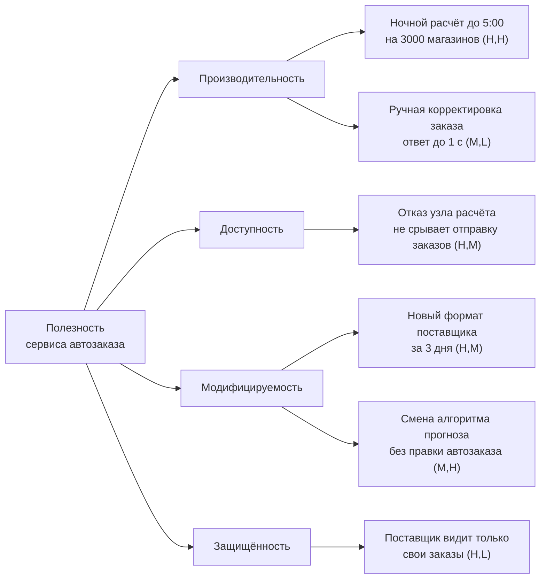

# 6.1 Атрибуты качества и нефункциональные требования

## Зачем это аналитику

Архитектуру определяют не функции, а атрибуты качества: производительность, доступность, модифицируемость, безопасность. Требование «система должна быть быстрой» непроверяемо и потому бесполезно. Умение превратить его в измеримый сценарий — ключевой навык архитектора и сильного аналитика.

## Что понять

- [ ] Функциональные требования, атрибуты качества и ограничения — почему архитектура в первую очередь отвечает на второе и третье.
- [ ] Модель качества ISO/IEC 25010: характеристики и подхарактеристики как чек-лист, чтобы ничего не забыть.
- [ ] Сценарий атрибута качества: источник, стимул, артефакт, среда, реакция, мера реакции.
- [ ] Приоритизация: дерево полезности (utility tree), важность для бизнеса против сложности реализации.
- [ ] Конфликты атрибутов: производительность против безопасности, доступность против согласованности, модифицируемость против производительности.
- [ ] Тактики: типовые архитектурные приёмы для каждого атрибута (например, для доступности — резервирование, обнаружение отказов, деградация).
- [ ] Как проверять: нагрузочные тесты, учения по отказам, архитектурные fitness functions.

## Урок

<!-- LESSON:START -->
Две системы с одинаковым набором функций могут иметь совершенно разную архитектуру. Интернет-магазин на сто заказов в день и на сто заказов в секунду умеет одно и то же: показать каталог, принять заказ, списать остаток. Различаются они требованиями к производительности, доступности и масштабируемости. Именно эти требования заставляют делить систему на части, выбирать хранилища, вводить очереди и кеши. Отсюда главная мысль урока: архитектура — ответ прежде всего на атрибуты качества и ограничения, а функции лишь размещаются внутри неё.

### Три вида требований

**Функциональные требования** описывают, что система делает: «принять платёжное поручение», «сформировать заказ поставщику по прогнозу». Их можно реализовать почти в любой архитектуре, включая один монолит с одной базой.

**Атрибуты качества (quality attributes)** описывают, насколько хорошо система это делает и в каких условиях: за какое время, при какой нагрузке, с какой вероятностью отказа, сколько стоит изменение. В русской практике их чаще называют нефункциональными требованиями, но термин «атрибут качества» точнее: он подчёркивает, что речь о свойстве системы, которое можно измерить.

**Ограничения (constraints)** — решения, принятые до архитектора и не подлежащие обсуждению: стандарт компании на PostgreSQL, размещение данных в определённой юрисдикции, срок запуска, бюджет, навыки команды, обязательная интеграция с существующей учётной системой. Ограничение отличается от атрибута тем, что его не оптимизируют, а соблюдают.

Почему архитектура отвечает на второе и третье: функциональность локализуется в модулях и меняется по ходу проекта относительно дёшево. Атрибуты качества сквозные: доступность 99,95% нельзя добавить в один модуль, она требует резервирования, обнаружения отказов и процедур восстановления по всей цепочке. Перестроить систему под новый атрибут качества почти всегда дороже, чем добавить функцию.

Практическое следствие для аналитика: когда в постановке есть только функции, архитектор будет угадывать атрибуты качества. Угадывает он обычно по худшему сценарию, и система получается дороже, чем нужно, или по лучшему — и тогда она падает на первой распродаже.

### ISO/IEC 25010 как чек-лист

Стандарт ISO/IEC 25010 описывает модель качества программного продукта: набор характеристик, каждая из которых раскладывается на подхарактеристики. Проекту не нужно выполнять стандарт целиком. Его ценность — в полноте: пройдясь по списку, легко заметить, что про совместимость, восстанавливаемость или переносимость в требованиях не сказано ничего.

Ниже — характеристики в редакции 2011 года, которая наиболее широко известна и цитируется.

| Характеристика | Подхарактеристики | Вопрос для постановки |
|---|---|---|
| Функциональная пригодность | Полнота, корректность, целесообразность | Все ли нужные функции есть и дают ли верный результат |
| Производительность | Временные характеристики, использование ресурсов, ёмкость | Сколько времени, при какой нагрузке, на каком объёме данных |
| Совместимость | Сосуществование, интероперабельность | С какими системами обменивается данными и делит ресурсы |
| Удобство использования | Узнаваемость, обучаемость, управляемость, защита от ошибок пользователя, эстетика, доступность | Кто пользователь и какие ошибки он не должен иметь возможности совершить |
| Надёжность | Зрелость, доступность, отказоустойчивость, восстанавливаемость | Сколько может быть недоступна, как быстро восстанавливается, что теряется |
| Защищённость | Конфиденциальность, целостность, неотказуемость, подотчётность, подлинность | Кто что видит, как доказывается авторство операции, что журналируется |
| Сопровождаемость | Модульность, повторное использование, анализируемость, модифицируемость, тестируемость | Какие изменения ожидаются и сколько они должны стоить |
| Переносимость | Адаптируемость, устанавливаемость, заменяемость | На какие окружения переезжает, что может быть заменено |

В редакции 2023 года модель пересмотрена: добавлена характеристика, связанная с безопасностью для людей и окружения (safety), часть характеристик переименована и расширена. Для роли чек-листа это непринципиально: важно пройти все направления и явно решить, какие из них для системы значимы.

Ответ на вопрос «зачем стандарт, если требования пишутся под проект»: стандарт даёт не требования, а общий словарь и защиту от пропусков. Требования под проект формулируются сценариями, а стандарт помогает проверить, что сценарии покрывают все значимые направления.

### Сценарий атрибута качества

Размытое «система должна быть надёжной» превращается в проверяемое требование через сценарий из шести частей. Этот формат предложен в книге Басса, Клементса и Кацмана *Software Architecture in Practice*.

- **Источник стимула** — кто или что вызывает событие: пользователь, внешняя система, оператор, аппаратный сбой, злоумышленник.
- **Стимул** — само событие: запрос, отказ узла, попытка несанкционированного доступа, запрос на изменение.
- **Артефакт** — на что воздействует стимул: вся система, конкретный сервис, база данных, код модуля.
- **Среда** — в каком состоянии система: штатный режим, пиковая нагрузка, деградированный режим, время обслуживания, этап разработки.
- **Реакция** — что система делает в ответ.
- **Мера реакции** — как проверить, что реакция достаточна: время, доля, объём потерь, трудозатраты.

Пример для доступности в банке для юрлиц:

| Часть | Значение |
|---|---|
| Источник | Отказ оборудования в основном дата-центре |
| Стимул | Узел базы данных сервиса приёма платёжных поручений перестаёт отвечать |
| Артефакт | Сервис приёма платёжных поручений и его хранилище |
| Среда | Рабочий день, штатная нагрузка |
| Реакция | Отказ обнаружен, трафик переключён на реплику, клиенты получают ошибку с предложением повторить только на время переключения |
| Мера | Переключение не дольше 60 секунд, ни одно принятое поручение не потеряно, повторная отправка не создаёт дубля |

Мера реакции — самая ценная часть. Именно она превращает пожелание в требование, которое можно проверить тестом или учениями, и именно её заказчик чаще всего не может назвать сразу. Задача аналитика — выяснить её через последствия: сколько стоит минута простоя, какие потери данных допустимы, во что обходится час ожидания для пользователя.

Для производительности сценарий выглядит так: «Во время ночного пересчёта (среда) сервис автозаказа (артефакт) получает от планировщика (источник) команду рассчитать заказы для всех магазинов сети (стимул); расчёт завершается (реакция) до 5:00 при объёме до 3 000 магазинов и 40 000 товаров (мера)». Сразу видно, что требование касается пропускной способности пакета, а не отклика API, и проектировать нужно параллельную обработку, а не кеш.

Для модифицируемости стимулом становится запрос на изменение, а средой — время разработки: «Разработчик добавляет новый тип поставщика с собственным форматом заказа; изменение затрагивает только адаптер поставщика и занимает не больше трёх дней вместе с тестами».

### Приоритизация: дерево полезности

Все атрибуты качества «важны», пока не выясняется, что за каждый нужно платить. Дерево полезности (utility tree) из метода ATAM структурирует этот разговор. Корень — общая полезность системы. Второй уровень — атрибуты качества. Третий — уточнения атрибута. Листья — конкретные сценарии, каждый с двумя оценками: важность для бизнеса и сложность реализации (обычно H, M, L).

Как читать оценки:

- **(H,H)** — главные архитектурные драйверы. На них тратится основное внимание архитектора, по ним проводится анализ компромиссов и прототипирование.
- **(H,M) и (H,L)** — важные, но понятные. Нужно убедиться, что решение их покрывает, чаще всего типовыми тактиками.
- **(M,H) и (L,H)** — кандидаты на обсуждение с бизнесом: дорого, а ценность средняя. Часто разумно ослабить требование.
- **(L,L)** — фиксируются и не обсуждаются.

Дерево ценно не картинкой, а процессом: заказчик вынужден ранжировать, а архитектор получает список сценариев, на которых проверяется решение. Если все листья помечены H по важности, это сигнал, что ранжирование не проведено, — стоит спросить, от какого сценария бизнес откажется первым при сокращении бюджета вдвое.

### Конфликты атрибутов

Атрибуты качества почти никогда не улучшаются одновременно. Три классические пары:

**Производительность против защищённости.** Шифрование, проверка токена на каждом вызове, детальный аудит, изоляция сетевых зон добавляют задержку и нагрузку. Компромиссы: проверять подпись токена локально вместо обращения к серверу авторизации на каждый запрос, писать аудит асинхронно с гарантией доставки, разделять поток данных по чувствительности и усиливать защиту только там, где она нужна.

**Доступность против согласованности.** При разрыве сети между узлами система выбирает: отказать в операции, чтобы не допустить расхождения, или принять её и согласовать данные позже. Это следствие теоремы CAP; расширение PACELC добавляет, что и без разрывов приходится выбирать между задержкой и согласованностью. Компромисс ищется по типам данных: остаток денег на счёте — строгая согласованность, остаток товара в каталоге интернет-магазина — допустимо показать с задержкой и перепроверить при оформлении.

**Модифицируемость против производительности.** Слои абстракции, обобщённые интерфейсы, обмен через шину упрощают изменения, но добавляют преобразования и сетевые переходы. Компромиссы: держать гибкость на границах, где изменения действительно ожидаются, и позволять прямые, оптимизированные пути на горячем участке; денормализовать для чтения, сохраняя нормализованный источник истины.

Способ найти компромисс один: вернуться к сценариям и их мерам. Спор «безопасность важнее скорости» не решается. Спор «проверка через сервер авторизации добавляет 30 мс к p95, бюджет 200 мс, запас есть» решается за минуту. Выбранный компромисс фиксируется в записи архитектурного решения вместе с причинами.

### Тактики

Тактика — типовой архитектурный приём, который улучшает конкретный атрибут. Тактики удобны тем, что превращают сценарий в список кандидатов на решение.

| Атрибут | Группы тактик | Примеры |
|---|---|---|
| Доступность | Обнаружение отказов, восстановление, предотвращение | Heartbeat и health check, резервирование активное и пассивное, повтор с идемпотентностью, автоматическое переключение, деградация функциональности, вывод узла из обслуживания |
| Производительность | Управление спросом на ресурсы, управление ресурсами | Ограничение частоты запросов, приоритизация, пакетная обработка, кеширование, реплики для чтения, параллелизм, секционирование данных |
| Модифицируемость | Снижение связности, повышение связности внутри модуля, отложенное связывание | Интерфейсы и адаптеры, выделение модулей по причинам изменений, конфигурация вместо кода, плагины, события вместо прямых вызовов |
| Защищённость | Обнаружение атак, противодействие, реакция, восстановление | Аутентификация и авторизация, шифрование, минимальные привилегии, ограничение поверхности атаки, аудит, отзыв доступа |

Деградация заслуживает отдельного упоминания: это тактика доступности, которая требует решений от бизнеса. Если сервис рекомендаций недоступен, карточка товара показывается без рекомендаций; если недоступен сервис прогноза, автозаказ строится по средним продажам прошлой недели. Какие функции можно отключить и что показывается взамен, должно быть в требованиях, а не придумано дежурным в момент аварии.

### Как проверять

Требование, которое не проверяется, со временем перестаёт выполняться.

**Нагрузочное тестирование** проверяет производительность до выхода в эксплуатацию. Виды: нагрузочный тест на ожидаемом профиле, стресс-тест до отказа (найти предел и посмотреть, как система деградирует), длительный тест (утечки ресурсов, рост очередей), тест всплеска. Условия осмысленного теста: профиль нагрузки взят из реальных данных или обоснованной оценки, объём данных в базе сопоставим с эксплуатационным (план запроса на тысяче строк и на ста миллионах разный), окружение сопоставимо по ресурсам, мера реакции из сценария задана заранее, и результаты сравниваются с ней по перцентилям, а не по среднему.

**Учения по отказам.** Доступность проверяется только отказом. Плановые учения (game day) — заранее подготовленное отключение узла, зоны или зависимости с наблюдением за реакцией и замером времени восстановления. Хаос-инжиниринг (chaos engineering) делает это регулярным и автоматическим. Для начала достаточно сценариев из дерева полезности: отключить узел расчёта и проверить, что заказы уходят поставщикам.

**Архитектурные функции пригодности (fitness functions).** Идея из книги *Building Evolutionary Architectures* (Форд, Парсонс, Куа): каждое важное архитектурное свойство выражается автоматической проверкой, которая регулярно выполняется. Примеры:

- Тест в сборке проверяет, что модуль автозаказа не импортирует внутренние классы модуля прогноза, только его публичный интерфейс.
- Нагрузочный тест в конвейере на каждый релиз: p95 ручной корректировки заказа не выше 1 секунды на эталонном объёме данных.
- Проверка отсутствия циклических зависимостей между модулями.
- В эксплуатации — отслеживание доли ошибок относительно целевого уровня обслуживания (SLO) с оповещением при быстром расходовании бюджета ошибок.

Функции пригодности переводят атрибуты качества из документа в код, и это лучший способ не потерять их после ухода автора требований.

### Типичные ошибки

- Писать атрибуты качества прилагательными («быстро», «надёжно», «масштабируемо») без меры реакции и среды.
- Задавать производительность средним временем отклика вместо перцентилей и не указывать нагрузку и объём данных, при которых она измеряется.
- Путать ограничения с атрибутами качества и пытаться оптимизировать то, что нужно просто соблюсти, или наоборот.
- Помечать все сценарии как высокоприоритетные и не обсуждать с бизнесом, от чего можно отказаться.
- Требовать максимума по всем атрибутам сразу, не видя конфликтов, и узнавать о них на нагрузочном тесте.
- Считать нагрузочный тест на пустой базе или слабом стенде доказательством производительности.
- Описать деградацию в требованиях, но ни разу не проверить её учениями.

### Как говорить об этом на собеседовании

На вопрос о нефункциональных требованиях senior отвечает не списком «производительность, надёжность, безопасность», а способом работы: «я перевожу пожелание в сценарий с измеримой мерой, приоритизирую сценарии с бизнесом по важности и сложности и проверяю их тестами». Хорошо привести один сценарий целиком, например для доступности сервиса приёма платежей: отказ узла, время переключения, ноль потерянных поручений, отсутствие дублей.

Покажите понимание компромиссов на своём примере: где выбрали согласованность ценой доступности или гибкость ценой задержки, и по какой мере это решили. Упоминание дерева полезности, тактик и функций пригодности показывает знакомство с инструментарием, но ценнее история о том, как сценарий с конкретной мерой изменил архитектурное решение.

### Коротко

- Архитектуру определяют атрибуты качества и ограничения; функции размещаются в ней и меняются дешевле.
- ISO/IEC 25010 — чек-лист направлений качества, который защищает от пропусков, а не готовые требования.
- Сценарий из шести частей (источник, стимул, артефакт, среда, реакция, мера) делает требование проверяемым; ключевая часть — мера реакции.
- Дерево полезности ранжирует сценарии по важности и сложности; драйверы архитектуры — пары (H,H).
- Атрибуты конфликтуют: производительность и защищённость, доступность и согласованность, модифицируемость и производительность. Компромисс решается через меры сценариев и фиксируется в ADR.
- Тактики — типовые приёмы для каждого атрибута; деградация требует решений бизнеса заранее.
- Проверка — нагрузочные тесты на реалистичных данных, учения по отказам и автоматические функции пригодности.
<!-- LESSON:END -->

## Читать дальше

- Bass, Clements, Kazman, *Software Architecture in Practice* — главы об атрибутах качества и сценариях.
- Стандарт ISO/IEC 25010 (обзор на iso25000.com).
- Карл Вигерс, «Разработка требований к программному обеспечению» — главы о нефункциональных требованиях.

На system-design.space:

- [Что такое архитектура ПО и зачем она нужна в системном дизайне](https://system-design.space/chapter/software-architecture-overview/)
- [Fundamentals of Software Architecture (краткий обзор)](https://system-design.space/chapter/fundamentals-arch-book/)
- [Software Requirements (краткий обзор)](https://system-design.space/chapter/wigers-requirements-book/)
- [Задержка (latency): физика, перцентили и бюджеты](https://system-design.space/chapter/latency-budgets/)

## Практика

1. Взять пять размытых требований из своей практики (обезличенно: «быстро», «надёжно», «безопасно», «легко менять», «масштабируемо») и переписать каждое как сценарий из шести частей.
2. Построить дерево полезности для обезличенной системы: 3–4 атрибута, по 2–3 сценария, оценки важности и сложности.
3. Найти в своей системе два конфликтующих атрибута и записать, какой компромисс был выбран и почему.

## Вопросы для самопроверки

1. Чем атрибут качества отличается от функционального требования?
2. Из каких частей состоит сценарий атрибута качества? Приведите пример для доступности.
3. Как приоритизировать атрибуты качества, если все «важны»?
4. Приведите два примера конфликтующих атрибутов и способы найти компромисс.
5. Как проверить, что система удовлетворяет требованию производительности, до выхода в эксплуатацию?
6. Зачем нужен стандарт ISO 25010, если требования всё равно пишутся под проект?

## Заметки

<!-- Свои формулировки, ошибки, ссылки. -->
