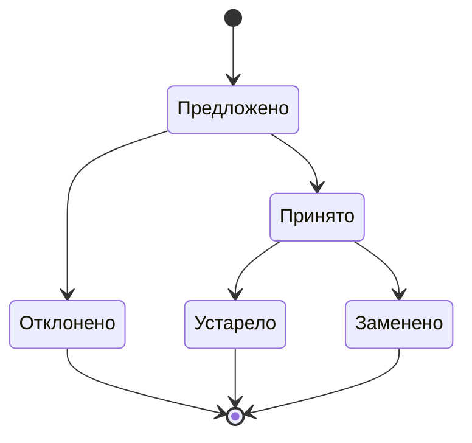

# 6.2 Architecture Decision Records: журнал решений

## Зачем это аналитику

Через год никто не помнит, почему выбрали Kafka, а не RabbitMQ, и почему у сервиса своя база. Решение пересматривают заново, и часто хуже. ADR — короткий документ, который фиксирует решение вместе с контекстом и последствиями. Это самый дешёвый инструмент архитектурной дисциплины и очень частый вопрос на собеседовании: «как у вас принимаются и фиксируются решения?»

## Что понять

- [ ] Что такое архитектурно значимое решение: дорого изменить, влияет на атрибуты качества, затрагивает несколько команд.
- [ ] Формат Нигарда: заголовок, статус, контекст, решение, последствия. Варианты: MADR, Y-statement.
- [ ] Статусы и жизненный цикл: предложено → принято → заменено другим решением; ADR не редактируют задним числом.
- [ ] Как писать контекст и рассмотренные альтернативы так, чтобы решение было понятно постороннему.
- [ ] Где хранить: рядом с кодом в репозитории или в вики, плюсы и минусы.
- [ ] Процесс: кто предлагает, кто согласует, архитектурный совет или RFC-процесс, как не превратить это в бюрократию.
- [ ] Связь ADR с атрибутами качества и рисками.

## Урок

<!-- LESSON:START -->
Архитектура — это не диаграмма, а сумма решений, каждое из которых было разумным в своём контексте. Диаграмма показывает результат, но не показывает, почему он такой. Когда контекст забыт, решение выглядит странным, и у новой команды два плохих варианта: слепо соблюдать то, чего не понимает, или отменить то, что было сделано по важной причине. Запись архитектурного решения (Architecture Decision Record, ADR) сохраняет именно причину.

### Какие решения записывать

Не каждое техническое решение архитектурное. Архитектурно значимым решение делают несколько признаков:

- **Дорого изменить.** Смена хранилища, протокола интеграции, модели данных, границ сервисов требует миграций и координации. Выбор библиотеки логирования — обычно нет.
- **Влияет на атрибуты качества.** Решение меняет доступность, производительность, защищённость, модифицируемость системы. Если после решения меняются ответы на сценарии атрибутов качества, это архитектура.
- **Затрагивает несколько команд или систем.** Формат событий, контракт API, общий механизм аутентификации — решение одной команды становится ограничением для других.
- **Создаёт прецедент.** Первое использование нового подхода (первый сервис с собственной базой, первый асинхронный контракт) задаёт правило для следующих.

| Записывать в ADR | Обычно не записывать |
|---|---|
| Выбор способа интеграции между системами | Выбор библиотеки внутри одного сервиса, если её легко заменить |
| Выделение сервиса и его собственного хранилища | Именование классов и структура пакетов |
| Модель согласованности данных между сервисами | Настройки, которые меняются конфигурацией |
| Отказ от очевидного варианта | Решения, полностью определённые стандартом компании |
| Принятие известного риска или технического долга | Исправление дефекта |
| Компромисс между конфликтующими атрибутами качества | Выбор из равноценных вариантов без последствий |

Полезный тест: если через год новый сотрудник спросит «почему так», и ответ займёт больше двух предложений или потребует найти человека, который уже ушёл, — решение стоило записать. Отдельно стоит записывать решения «не делать»: отказ от микросервисов, от кеша, от брокера. Их забывают быстрее всего и чаще всего пересматривают без причины.

### Формат Нигарда

Майкл Нигард в 2011 году предложил минимальный формат, который прижился именно благодаря краткости. ADR — это короткий текстовый файл, одна-две страницы, с пятью частями.

**Заголовок.** Номер и короткая фраза в форме решения: «ADR-014. Публиковать события через таблицу outbox». Не «Обсуждение интеграции», а то, что решено. Номера сквозные и не переиспользуются.

**Статус.** Предложено, принято, устарело, заменено другим решением (со ссылкой на заменяющее).

**Контекст.** Какие силы действуют: проблема, требования, ограничения, атрибуты качества, риски, состояние команды и сроков. Контекст пишется нейтрально, без агитации за решение. Это самая важная часть, потому что именно она устаревает и именно по ней через год понятно, актуально ли решение.

**Решение.** Что делаем, в активном залоге и утвердительно: «Мы будем...». Коротко и конкретно, без повторения контекста.

**Последствия.** Все последствия, не только хорошие: что становится проще, что сложнее, какие риски принимаются, какие новые задачи появляются, при каких условиях решение стоит пересмотреть.

Исходный формат Нигарда не выделяет альтернативы в отдельный раздел — их упоминают в контексте. На практике отдельный раздел «Рассмотренные варианты» почти всегда полезен.

### MADR и Y-statement

**MADR** (Markdown Architectural Decision Records) — более структурированный шаблон. Он явно выделяет формулировку проблемы, факторы решения (decision drivers), рассмотренные варианты, выбранный вариант с обоснованием, плюсы и минусы каждого варианта. Удобен, когда решение действительно выбирается из нескольких равносильных кандидатов и важно показать, по каким критериям. Минус — соблазн заполнить все разделы ради формы.

**Y-statement** — решение в одном предложении по фиксированной схеме:

```text
В контексте <ситуация или функция>,
учитывая <проблема или требование>,
мы решили <выбранный вариант>
и отказались от <другие варианты>,
чтобы достичь <атрибут качества или выгода>,
принимая <недостаток или риск>.
```

Y-statement хорош как резюме в начале полного ADR, как формат для небольших решений и как проверка мышления: если предложение не складывается, значит, не ясно, от чего отказались или какой ценой.

### Пример ADR в формате Нигарда

Регистратор доменов, монолит с базой PostgreSQL. События о смене статуса домена (зарегистрирован, продлён, освобождён) нужны биллингу, уведомлениям и сервису аукционов.

```markdown
# ADR-014. Публиковать события о статусе домена через таблицу outbox

## Статус
Принято. Заменяет ADR-006.

## Контекст
Монолит после изменения статуса домена коммитит транзакцию в PostgreSQL,
а затем отправляет событие в брокер сообщений (ADR-006). При сбое
между коммитом и отправкой событие теряется. За квартал зафиксировано
несколько десятков расхождений: домен продлён, а счёт не выставлен,
или домен освобождён, а аукцион о нём не знает. Расхождения ищутся
ночной сверкой и исправляются вручную.

Требования: ни одно изменение статуса не должно потеряться; задержка
доставки до потребителей до 30 секунд допустима; нельзя требовать
от монолита распределённых транзакций. Команда монолита — 4 человека,
опыта эксплуатации CDC-инструментов нет. Администрирование PostgreSQL
выполняет отдельная команда инфраструктуры.

Рассмотренные варианты:
1. Оставить двойную запись и усилить сверку. Не устраняет причину.
2. Захват изменений из журнала БД (CDC). Надёжно, но требует доступа
   к логической репликации, нового компонента и компетенций, которых нет.
3. Таблица outbox в той же транзакции и отдельный публикатор,
   читающий её опросом.

## Решение
Мы будем записывать событие в таблицу outbox в той же транзакции,
что и изменение статуса домена. Отдельный процесс-публикатор раз
в несколько секунд читает неотправленные записи, публикует их
в брокер и помечает отправленными. Потребители обрабатывают события
идемпотентно по идентификатору события.

## Последствия
- Событие публикуется тогда и только тогда, когда транзакция
  закоммичена. Потеря событий из-за сбоя между записью и отправкой
  исключена.
- Доставка «как минимум один раз»: возможны дубли. Все потребители
  обязаны хранить обработанные идентификаторы событий.
- Задержка доставки растёт до интервала опроса плюс время публикации.
- Дополнительная нагрузка на основную базу от опроса; таблицу нужно
  регулярно очищать, для этого нужна отдельная задача.
- Порядок событий сохраняется в пределах одного домена, если публикатор
  работает в один поток на домен; глобальный порядок не гарантируется.
- Ночная сверка остаётся, но как контроль, а не как механизм исправления.
- Пересмотреть в пользу CDC, если нагрузка от опроса станет заметной
  или команда получит опыт эксплуатации CDC.
```

Обратите внимание на свойства примера. Контекст содержит измеримую проблему, требования и ограничения команды — без них выбор outbox вместо CDC выглядел бы произвольным. Альтернативы названы с причиной отказа. Последствия включают новые обязательства для других команд (идемпотентность потребителей) и явное условие пересмотра.

### Статусы и жизненный цикл



Статус «устарело» означает, что решение больше не применяется, но и замены нет (например, подсистема выведена из эксплуатации). «Заменено» ставится вместе со ссылкой на новый ADR, а новый ADR ссылается обратно. Отклонённые предложения тоже хранятся: они отвечают на вопрос «а почему не сделали так», который обязательно зададут.

Принятый ADR не редактируют по существу. Если решение меняется, пишется новый ADR, а старый получает статус «заменено». Причины:

- **Сохраняется история рассуждений.** Решение было верным в своём контексте. Если переписать его задним числом, пропадёт знание о том, какие силы действовали тогда и что изменилось с тех пор.
- **Честность журнала.** Журнал, который правят, перестаёт быть источником правды: нельзя понять, что знали в момент решения, а что дописали потом.
- **Аудит и разбор инцидентов.** В регулируемых отраслях и при разборе аварий важно, какое решение действовало в конкретный момент.

Допустимы только правки, не меняющие смысла: исправление опечатки, обновление статуса, добавление ссылки на заменяющий ADR.

### Как писать контекст и альтернативы

ADR пишется для постороннего: для человека, который придёт через год и не участвовал в обсуждении. Отсюда правила.

- Контекст описывает проблему, а не решение. Если из контекста уже понятно, что выбран вариант 3, а варианты 1 и 2 упомянуты для вида, текст теряет доверие.
- Факты вместо оценок: «за квартал несколько десятков расхождений» вместо «часто теряются события»; «команда 4 человека, опыта CDC нет» вместо «сложно».
- Требования и ограничения явно: какие сценарии атрибутов качества решение должно выполнить, что нельзя менять.
- Каждая альтернатива — реальный вариант, который кто-то всерьёз предлагал, с причиной отказа. Вариант «ничего не делать» полезно включать почти всегда.
- Аббревиатуры и внутренние названия расшифровываются или даются ссылкой.
- Ссылки на связанные ADR, исследования, прототипы и замеры.

Проверка качества: дать ADR коллеге из соседней команды. Если он может объяснить, почему выбран этот вариант и при каких условиях стоит пересмотреть, контекст написан достаточно.

### Где хранить

**В репозитории рядом с кодом**, обычно в каталоге вроде `docs/adr`, по файлу на решение в Markdown. Плюсы: решение проходит ревью тем же пулл-реквестом, что и код; версионирование бесплатно; разработчики видят ADR там, где работают; история изменений прозрачна. Минусы: неудобно людям без доступа к репозиторию (аналитикам, бизнесу, другим командам), сложно искать по многим репозиториям, решения уровня нескольких систем непонятно к какому репозиторию относить.

**В вики.** Плюсы: доступно всем, удобный поиск, комментарии, привычно для аналитиков и архитекторов. Минусы: легко отредактировать задним числом, история изменений менее заметна, ADR отрываются от кода и устаревают незаметно, дисциплина нумерации и статусов держится на людях.

Частый компромисс: решения уровня одного сервиса — в его репозитории, решения уровня нескольких систем — в отдельном архитектурном репозитории или разделе вики с жёстким шаблоном, и во всех местах одинаковая нумерация и статусы. Главное — одно известное всем место для каждого уровня.

### Процесс: как принимать решения без бюрократии

Базовая схема: предложить может любой; предложение оформляется как ADR со статусом «предложено»; обсуждается с теми, кого оно затрагивает; принимается тем, кто отвечает за этот уровень; статус меняется на «принято».

Кто согласует, зависит от масштаба решения:

- **Внутри одной команды** — сама команда, архитектор или ведущий разработчик при необходимости консультируется. Ревью через пулл-реквест.
- **Затрагивает несколько команд** — затронутые команды и архитектор направления. Нужен срок на комментарии, после которого решение принимается.
- **Затрагивает платформу или стандарты компании** — архитектурный совет или RFC-процесс: развёрнутый документ (запрос комментариев, request for comments), открытый период обсуждения и финальное решение ответственного.

Альтернатива централизованному совету — консультативный процесс (advice process): решение может принять любой, но обязан спросить совета у тех, кого решение затрагивает, и у экспертов. Совет не обязывает, но его и ответ на него записывают в ADR. Такой подход масштабируется лучше, чем очередь на архитектурный совет, и сохраняет ответственность за решением у того, кто будет с ним жить.

Чтобы процесс не тормозил команды:

- Явные критерии, какие решения требуют ADR и какой уровень согласования. Всё остальное команда решает сама.
- Ограничение по времени: у обсуждения есть срок, по истечении которого молчание считается согласием или решение принимает ответственный.
- Короткий шаблон. ADR на одну-две страницы пишется за час, иначе его не будут писать.
- Асинхронное ревью по умолчанию, встреча — только при реальном разногласии.
- Совет разбирает только межкомандные решения и работает как консультант, а не как шлагбаум.
- Допустимо записать ADR после решения, если оно принималось срочно, — лучше поздняя запись, чем никакой.

### Связь с атрибутами качества и рисками

ADR — место, где атрибуты качества встречаются с решениями. Сценарии и дерево полезности из предыдущего модуля отвечают на вопрос «что важно», ADR — «как мы этого добились и чем заплатили». Хороший ADR ссылается на сценарии, которые решение обеспечивает, и называет атрибуты, которыми пожертвовали: в примере выше надёжность доставки получена ценой задержки и дополнительной нагрузки на базу.

С рисками связь двойная. Во-первых, раздел последствий — это реестр принятых рисков: дубли событий, рост таблицы, отсутствие глобального порядка. Каждый риск должен иметь владельца или задачу на смягчение. Во-вторых, условия пересмотра в ADR — это заранее определённые сигналы, что риск реализовался или контекст изменился. При архитектурном ревью журнал ADR даёт готовый список мест, где сознательно приняты компромиссы, и их стоит проверить первыми.

### Типичные ошибки

- Писать ADR на всё подряд, включая выбор библиотеки, — журнал превращается в шум, и важные решения в нём теряются.
- Писать контекст, из которого решение уже очевидно, а альтернативы упоминать для вида без реальных причин отказа.
- Перечислять только положительные последствия, скрывая принятые риски и новые обязательства других команд.
- Редактировать принятый ADR при изменении решения вместо создания нового со ссылкой «заменяет».
- Хранить ADR в месте, о котором не знают те, кто принимает следующие решения.
- Сделать архитектурный совет обязательной точкой для любого изменения: команды начнут обходить процесс и принимать решения без записи.

### Как говорить об этом на собеседовании

На вопрос «как у вас принимаются и фиксируются решения» сильный ответ описывает процесс с уровнями: какие решения команда принимает сама, какие требуют согласования затронутых, где хранятся записи и как они попадают в ревью. Приведите конкретный ADR из опыта в обезличенном виде: контекст с фактами, альтернативы, выбранный вариант и цену, которую за него заплатили. Если решение потом пересматривали, расскажите, что изменилось в контексте, — это демонстрирует понимание, зачем ADR неизменяемы.

Если в прошлых проектах решения фиксировались плохо или никак, честно скажите об этом и объясните, что бы вы изменили: например, ввели бы короткий шаблон, критерии значимости и асинхронное ревью. Интервьюеры ценят трезвую оценку прошлого опыта выше, чем описание идеального процесса, которого не было.

### Коротко

- ADR сохраняет не только решение, но и причину: контекст, альтернативы и последствия.
- Записывать стоит решения, которые дорого изменить, которые влияют на атрибуты качества, затрагивают несколько команд или создают прецедент, включая решения «не делать».
- Формат Нигарда: заголовок, статус, контекст, решение, последствия; MADR добавляет структуру вариантов и критериев; Y-statement сжимает решение в одно предложение.
- Принятый ADR не редактируют по существу: изменение оформляется новым ADR со статусом «заменяет», чтобы сохранить историю рассуждений.
- Контекст пишется для постороннего: факты, требования, ограничения и реальные альтернативы с причинами отказа.
- Хранение в репозитории ближе к коду, в вики доступнее; важно одно известное место на каждый уровень решений.
- Процесс масштабируется за счёт уровней согласования, ограничений по времени, короткого шаблона и консультативной, а не запретительной роли совета.
- Раздел последствий — реестр принятых рисков и компромиссов между атрибутами качества.
<!-- LESSON:END -->

## Читать дальше

- Michael Nygard, «Documenting Architecture Decisions» (2011) — исходная статья.
- Шаблоны и примеры: adr.github.io, MADR (adr.github.io/madr).
- Fundamentals of Software Architecture — глава об архитектурных решениях.

На system-design.space:

- [Архитектура в масштабе: как мы принимаем архитектурные решения](https://system-design.space/chapter/architecture-decisions-scale/)
- [Эволюция архитектуры Т-Банка (2006–2024)](https://system-design.space/chapter/tbank-architecture-evolution/)
- [Software Architecture: The Hard Parts (краткий обзор)](https://system-design.space/chapter/hard-parts-book/)

## Практика

1. Написать три ADR по решениям из своей практики (обезличенно), где вы участвовали или знаете контекст: например, выбор способа интеграции, выбор хранилища, решение о декомпозиции.
2. Написать один ADR задним числом для решения, с которым вы не согласны, честно изложив контекст и альтернативы. Затем — ADR, который его заменяет.
3. Предложить короткий регламент принятия архитектурных решений для команды из 10–15 человек: кто, когда, как согласуется, где хранится.

## Вопросы для самопроверки

1. Какие решения стоит фиксировать в ADR, а какие нет?
2. Из каких разделов состоит ADR и что в каждом писать?
3. Почему ADR не редактируют после принятия?
4. Как организовать процесс принятия решений, чтобы он не тормозил команды?
5. Как вы фиксировали архитектурные решения на прошлых проектах и что бы изменили?

## Заметки

<!-- Свои формулировки, ошибки, ссылки. -->
