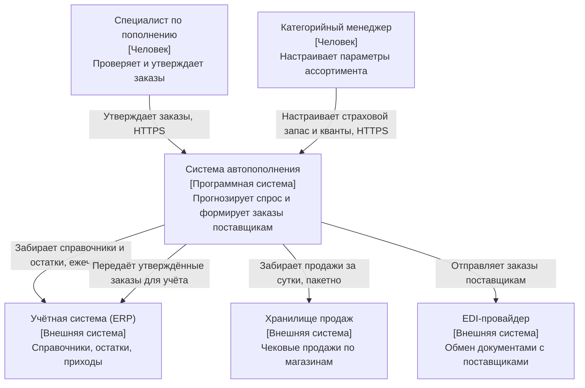
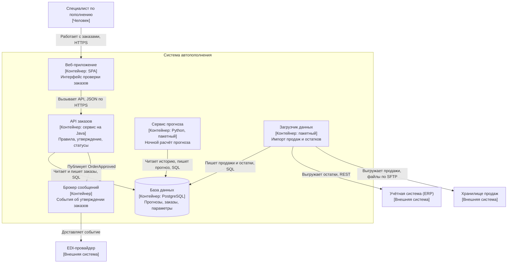

# 6.3 Модели и документы: C4, arc42, диаграммы как код

## Зачем это аналитику

Диаграммы — главный способ архитектора передать замысел. Беда большинства схем в том, что на одной картинке смешаны люди, системы, контейнеры, классы и сеть. C4 даёт уровни детализации, arc42 — структуру документа. Вместе они отвечают на вопрос «как описать архитектуру, чтобы её поняли и разработчик, и заказчик».

## Что понять

- [ ] C4: четыре уровня — контекст системы, контейнеры, компоненты, код. Кому нужен каждый уровень.
- [ ] Что такое «контейнер» в C4 (приложение или хранилище, которое разворачивается отдельно) и почему это не Docker-контейнер.
- [ ] Дополнительные диаграммы C4: развёртывание, динамическая (последовательность взаимодействий), системный ландшафт.
- [ ] Правила хорошей диаграммы: заголовок, легенда, подписи связей с протоколом и назначением, единый уровень абстракции.
- [ ] arc42: 12 разделов шаблона, какие из них обязательны для небольшой системы.
- [ ] Диаграммы как код: PlantUML, Structurizr DSL, Mermaid — версионирование и ревью вместе с кодом.
- [ ] Место UML, BPMN и ArchiMate рядом с C4: что для чего.

## Урок

<!-- LESSON:START -->
### Почему архитектурные схемы так часто не работают

Типичная «архитектурная схема» в корпоративном Confluence выглядит так: прямоугольники разного цвета, часть из них — сервисы, часть — базы данных, часть — команды, где-то нарисован балансировщик, где-то класс `OrderManager`, стрелки без подписей. Автор понимает её, потому что держит контекст в голове. Остальные — нет.

Причина почти всегда одна: на схеме смешаны разные уровни абстракции и разные вопросы. «Кто пользуется системой», «из каких частей она состоит», «как эти части разворачиваются» и «как устроен код внутри» — это четыре разных вопроса для разных читателей. Ответ на все сразу не отвечает ни на один.

Модель C4 (автор — Саймон Браун) решает эту проблему не новой нотацией, а договорённостью об уровнях. Шаблон arc42 (авторы — Гернот Штарке и Петер Хрушка) решает соседнюю задачу: куда в документе положить схемы, решения, ограничения и риски, чтобы читатель знал, где искать. Первое — про картинки, второе — про структуру текста вокруг них.

### C4: четыре уровня масштаба

Удобная аналогия — карта. Сначала вы видите страну, затем город, затем квартал, затем здание. На каждом масштабе показано ровно то, что на нём различимо. C4 предлагает такие же ступени для программной системы.

| Уровень | Что показывает | Главный вопрос | Основной читатель |
|---|---|---|---|
| 1. Контекст системы (System Context) | Система как один блок, её пользователи и внешние системы | Что это за система, кто с ней работает, с чем она интегрирована | Все: бизнес, заказчик, смежные команды, новые сотрудники |
| 2. Контейнеры (Container) | Приложения и хранилища внутри системы, связи между ними | Из каких разворачиваемых частей состоит система и как они общаются | Архитекторы, разработчики, эксплуатация, аналитики интеграций |
| 3. Компоненты (Component) | Крупные модули внутри одного контейнера | Как устроен конкретный сервис изнутри | Разработчики этого контейнера |
| 4. Код (Code) | Классы, интерфейсы, таблицы | Как реализован компонент | Разработчики; обычно генерируется из IDE или не рисуется вовсе |

Важная практическая деталь: уровни 1 и 2 полезны почти всегда, уровень 3 — выборочно, для сложных или критичных контейнеров, уровень 4 почти никогда не стоит рисовать вручную. Он устаревает при первом рефакторинге, а IDE покажет то же самое актуальным.

Элементов в C4 немного: человек (person), программная система (software system), контейнер (container), компонент (component) и связи между ними. Каждый элемент подписывается именем, типом, коротким описанием ответственности и, для контейнеров и компонентов, технологией. Связь подписывается глаголом, отражающим назначение, и, где это важно, протоколом.

### Что такое контейнер и почему это не Docker

Контейнер в C4 — это отдельно запускаемая или разворачиваемая единица, которая исполняет код или хранит данные. Примеры: веб-приложение на сервере, одностраничное приложение в браузере, мобильное приложение, бэкенд-сервис, пакетный обработчик, база данных, бакет объектного хранилища, топик брокера сообщений, если он используется как самостоятельное хранилище.

Критерий — граница процесса и развёртывания. Всё, что внутри контейнера, общается вызовами в памяти. Всё, что между контейнерами, общается по сети или через общее хранилище: HTTP, gRPC, SQL-соединение, брокер.

Термин появился раньше, чем Docker стал повсеместным, и совпадение имён неудачное. Отличия принципиальные:

- Одно SPA в браузере пользователя — контейнер C4, хотя никакого Docker там нет.
- Один сервис, запущенный в десяти репликах Docker, — один контейнер C4. Количество экземпляров — тема диаграммы развёртывания.
- Одна база PostgreSQL, в которой живут схемы трёх сервисов, в C4 честнее показать как три логических хранилища или как одно общее с явной пометкой: связанность через общую базу — архитектурный факт, который схема не должна прятать.

Если на уровне контейнеров вы начинаете рисовать поды, узлы кластера и балансировщики, вы смешали логическое устройство с развёртыванием.

### Пример: система автопополнения розничной сети

Возьмём обезличенную систему, которая прогнозирует спрос по магазинам и товарам и формирует заказы поставщикам. Её пользователи — специалисты по пополнению, которые проверяют и утверждают заказы, и категорийные менеджеры, которые настраивают параметры ассортимента.

#### Уровень 1: контекст

Диаграмма контекста отвечает на вопрос, где проходит граница системы. Внутренности не показываются вовсе.



Такую схему можно показать директору по цепочкам поставок и службе информационной безопасности: первый увидит роли и источники данных, вторая — внешние контуры. Направление стрелки здесь означает направление зависимости или инициативы вызова, и это стоит зафиксировать в легенде, иначе читатели будут трактовать его по-разному.

#### Уровень 2: контейнеры

Теперь «разрезаем» блок системы автопополнения. Внешние системы остаются на схеме, но только те, с которыми связаны показанные контейнеры.



Что видно на этой схеме и не было видно на первой: прогноз и загрузка — пакетные процессы, а утверждение заказов — онлайн; все контейнеры связаны через одну базу; отправка поставщику асинхронна. Каждое из этих наблюдений — повод для вопроса на архитектурном ревью. Например, общая база означает, что ночной расчёт прогноза может конкурировать за ресурсы с дневной работой специалистов.

Обратите внимание на подписи связей: глагол плюс протокол или формат. «Использует» или пустая стрелка ничего не сообщают. Хорошая подпись позволяет аналитику интеграций сразу понять, где искать контракт.

Mermaid поддерживает и отдельный синтаксис C4-диаграмм, но на момент написания он помечен как экспериментальный, а его раскладка плохо управляется. Обычный `flowchart` с явными подписями типов элементов надёжнее и читается одинаково в любом рендерере.

### Дополнительные диаграммы C4

Четыре уровня описывают статическую структуру. Помимо них C4 предлагает три вспомогательных вида.

**Системный ландшафт (System Landscape).** Та же нотация, что у контекста, но без фокуса на одной системе: все системы предприятия или крупного домена и связи между ними. Полезна для архитектора предприятия и для онбординга: «где мы находимся среди сорока систем компании».

**Динамическая диаграмма (Dynamic).** Показывает, как элементы взаимодействуют в рамках одного сценария: пронумерованные шаги на схеме контейнеров или компонентов. По смыслу это то же, что UML-диаграмма последовательности, и на практике её часто рисуют именно как `sequenceDiagram`. Рисовать её стоит для ключевых или неочевидных сценариев: утверждение заказа с отправкой поставщику, обработка отказа EDI, повторная отправка. Для каждого CRUD-экрана — не нужно.

**Диаграмма развёртывания (Deployment).** Отображает контейнеры на инфраструктуру: окружения, узлы, кластеры, зоны доступности, балансировщики, количество реплик. Здесь уместны Kubernetes, managed-базы и сетевые сегменты — всё то, чего не должно быть на уровне контейнеров. Одна логическая схема может иметь несколько диаграмм развёртывания: для промышленной среды, для тестовой, для резервной площадки.

### Правила хорошей диаграммы

C4 сознательно не навязывает цвета и формы. Взамен есть набор правил, соблюдение которых отличает рабочую схему от декоративной.

1. **Заголовок с типом и областью.** «Система автопополнения — диаграмма контейнеров», а не «Архитектура». Читатель должен понять масштаб до того, как начнёт разглядывать блоки.
2. **Легенда.** Что означают цвета, формы, сплошные и пунктирные линии, направление стрелки. Даже если кажется очевидным. Особенно если используются цвета: при чёрно-белой печати и для людей с нарушением цветовосприятия цвет не должен быть единственным носителем смысла.
3. **Каждый элемент подписан:** имя, тип, технология, одна фраза об ответственности.
4. **Каждая связь подписана:** что передаётся или зачем вызывается, плюс протокол там, где это важно. Однонаправленные стрелки предпочтительнее двунаправленных: у каждой связи есть инициатор.
5. **Единый уровень абстракции.** На схеме контейнеров нет классов и нет серверов. На схеме контекста нет баз данных.
6. **Разумный размер.** Если на схеме больше двадцати-тридцати элементов, её, скорее всего, нужно разделить: по подсистемам или по сценариям.
7. **Акронимы расшифрованы** — на схеме или в глоссарии рядом.

Самые частые причины непонятных схем — нарушение пунктов 4 и 5: безымянные стрелки и смешение уровней. Вторая по частоте — отсутствие указания, какую ситуацию отражает схема: текущее состояние, целевое или переходное.

### arc42: структура архитектурного документа

Диаграммы без текста не объясняют «почему». arc42 — это шаблон документа из 12 разделов, который отвечает на вопросы «что», «почему», «как» и «с какими рисками». Шаблон прагматичный: все разделы необязательны, заполнять нужно то, что приносит пользу читателям.

| № | Раздел | Содержание | Связь с C4 и практикой |
|---|---|---|---|
| 1 | Введение и цели (Introduction and Goals) | Назначение системы, ключевые функции, 3–5 главных целей по качеству, заинтересованные стороны | Основа для анализа компромиссов |
| 2 | Ограничения (Architecture Constraints) | Технические, организационные, регуляторные ограничения, которые не обсуждаются | Корпоративный стек, требования ИБ, сроки |
| 3 | Контекст и границы (Context and Scope) | Бизнес-контекст и технический контекст: внешние участники и интерфейсы | Диаграмма контекста C4 |
| 4 | Стратегия решения (Solution Strategy) | Ключевые решения на одной странице: стиль, основные технологии, подход к главным целям | Краткое резюме, ссылки на ADR |
| 5 | Представление строительных блоков (Building Block View) | Статическая декомпозиция системы по уровням | Диаграммы контейнеров и компонентов |
| 6 | Представление времени выполнения (Runtime View) | Важные сценарии взаимодействия | Динамические диаграммы, последовательности |
| 7 | Представление развёртывания (Deployment View) | Инфраструктура, окружения, размещение блоков | Диаграмма развёртывания C4 |
| 8 | Сквозные концепции (Cross-cutting Concepts) | Подходы, общие для многих частей: безопасность, логирование, обработка ошибок, модель данных, i18n | Часто самый ценный раздел для разработчиков |
| 9 | Архитектурные решения (Architecture Decisions) | Важные решения с обоснованием | Журнал ADR или ссылки на него |
| 10 | Требования к качеству (Quality Requirements) | Обзор требований к качеству (в прежних версиях — дерево качества) и конкретные сценарии с измеримыми откликами | Вход для ATAM и fitness functions |
| 11 | Риски и технический долг (Risks and Technical Debt) | Известные риски и долг, их последствия и меры | Итог ревью и риск-сторминга |
| 12 | Глоссарий (Glossary) | Термины предметной области и техники | Единый язык с бизнесом |

Порядок разделов не случаен: от целей и ограничений к контексту, затем к решениям и их проявлению в структуре, поведении и инфраструктуре, в конце — оценка качества и рисков.

#### Что оставить для небольшой системы

Для сервиса, который делает одна команда, полный arc42 — избыточен. Разумный минимум:

- **1. Цели** — без них невозможно объяснить ни одно решение.
- **2. Ограничения** — коротким списком; они снимают половину вопросов «почему не взяли X».
- **3. Контекст** — диаграмма уровня 1 и таблица внешних интерфейсов.
- **4. Стратегия решения** — полстраницы.
- **5. Строительные блоки** — диаграмма уровня 2.
- **9. Решения** — ссылки на ADR.
- **11. Риски и долг** — список, который действительно обновляется.

Разделы 6 и 7 добавляются, когда есть неочевидные сценарии или нетривиальная инфраструктура. Раздел 8 появляется, когда в системе больше одного контейнера с общими правилами. Глоссарий почти бесплатен и полезен, если домен насыщен терминами: в автопополнении «страховой запас», «квант поставки», «горизонт прогноза» и «плечо поставки» понимаются разными людьми по-разному.

Важно, что arc42 не требует одного большого документа. Разделы могут жить в отдельных файлах в репозитории, а документ собираться генератором сайта.

### Диаграммы как код

Схемы, нарисованные в графическом редакторе, живут отдельно от системы и устаревают молча. Подход «диаграммы как код» (diagrams as code) описывает схему текстом, хранит его в том же репозитории, что и код или документацию, и рендерит автоматически.

Основные инструменты:

- **Mermaid** — встроен в рендер Markdown во многих платформах: GitHub, GitLab, ряде вики и генераторов сайтов. Низкий порог входа, но слабый контроль раскладки и нет общей модели между диаграммами.
- **PlantUML** — зрелый инструмент с широким набором UML-диаграмм; для C4 есть отдельная библиотека макросов C4-PlantUML. Нужен сервер или локальный рендерер на Java.
- **Structurizr DSL** — язык, созданный автором C4. Его принцип отличается от двух предыдущих: вы описываете одну модель (элементы и связи), а диаграммы задаются как представления (views) этой модели.

Фрагмент Structurizr DSL для примера выше:

```
workspace {
    model {
        planner = person "Специалист по пополнению"
        erp = softwareSystem "Учётная система (ERP)"
        ars = softwareSystem "Система автопополнения" {
            web = container "Веб-приложение" "Интерфейс проверки заказов" "SPA"
            api = container "API заказов" "Правила и утверждение" "Java"
            db = container "База данных" "Прогнозы и заказы" "PostgreSQL"
        }
        planner -> web "Работает с заказами" "HTTPS"
        web -> api "Вызывает API" "JSON/HTTPS"
        api -> db "Читает и пишет" "SQL"
        ars -> erp "Забирает остатки"
    }
    views {
        systemContext ars {
            include *
            autolayout lr
        }
        container ars {
            include *
            autolayout lr
        }
    }
}
```

Модельный подход даёт главное преимущество: переименовали контейнер — он изменился на всех диаграммах. В Mermaid и PlantUML каждая диаграмма самостоятельна, и согласованность между уровнями приходится поддерживать руками.

#### Плюсы и минусы

Плюсы:

- История изменений и ревью через merge request: архитектурное изменение обсуждается рядом с кодом, который его реализует.
- Диаграмма обновляется в том же изменении, что и система, — появляется шанс, что она будет актуальной.
- Текст удобно сравнивать, искать, генерировать и проверять в CI: например, что рендер не сломан.
- Нет зависимости от лицензии и формата графического редактора.

Минусы:

- Слабый контроль раскладки: автоматическое размещение иногда даёт запутанные схемы, и борьба с ним отнимает время.
- Порог входа для не-технических участников: бизнес-аналитику или заказчику проще подвинуть блок мышью.
- Нет «модели» в Mermaid и PlantUML — дублирование между диаграммами.
- Риск ложной уверенности: схема в репозитории тоже может устареть, если её обновление не входит в определение готовности.

Прагматичный компромисс: ключевые диаграммы (контекст, контейнеры, ключевые сценарии) — как код в репозитории; эскизы для обсуждения — на доске, без сожаления о том, что они будут выброшены.

### C4 рядом с UML, BPMN и ArchiMate

C4 не конкурирует с этими нотациями, а занимает свою нишу: структура программных систем для широкой технической аудитории.

- **UML** — богатая нотация уровня проектирования. На практике архитектору и аналитику нужны в основном диаграмма последовательности (для сценариев и интеграций), диаграмма состояний (жизненный цикл сущности: статусы заказа поставщику, платёжного поручения, домена) и иногда диаграмма классов или развёртывания. Диаграмма последовательности — естественное дополнение C4 для динамического вида.
- **BPMN** — язык бизнес-процессов: кто что делает, в каком порядке, какие решения и события. Уместна, когда нужно описать процесс с участием людей и систем, согласовать его с бизнесом или передать в BPM-движок. BPMN не описывает устройство системы.
- **ArchiMate** — язык корпоративной архитектуры (открытый стандарт The Open Group). Связывает бизнес-слой, слой приложений и технологический слой: какие бизнес-возможности поддерживаются какими приложениями, на какой инфраструктуре. Нужен архитектору предприятия; для команды, проектирующей одну систему, обычно избыточен.

Простое правило выбора: процесс с людьми и ролями — BPMN; обмен сообщениями между участниками во времени — UML-последовательность; жизненный цикл объекта — UML-состояния; из чего состоит система и с чем связана — C4; карта предприятия от бизнес-возможностей до инфраструктуры — ArchiMate.

Пример из банка для юрлиц: процесс согласования платёжного поручения двумя подписантами описывается в BPMN; обмен ДБО с АБС при отправке поручения — диаграммой последовательности; статусы поручения — диаграммой состояний; расположение ДБО среди фронтов, АБС, антифрода и шлюзов — диаграммой контекста C4.

### Типичные ошибки

- Смешивать уровни: на одной схеме пользователи, микросервисы, таблицы и серверы. Итог — схема, которую никто, кроме автора, не читает.
- Путать контейнер C4 с Docker-контейнером и рисовать реплики, поды и балансировщики на уровне контейнеров вместо диаграммы развёртывания.
- Оставлять связи без подписей или подписывать их словом «использует»; не указывать протокол там, где он влияет на интеграцию.
- Рисовать уровень кода вручную и уровень компонентов для каждого сервиса: большой объём, быстро устаревает, почти не читается.
- Не указывать, какое состояние отражает схема: текущее, целевое или переходное. Особенно опасно в проектах модернизации.
- Заполнять все 12 разделов arc42 ради полноты; документ становится большим, и никто не поддерживает его в актуальном виде.
- Считать, что перенос диаграмм в репозиторий сам по себе делает их актуальными, не включив обновление схем в определение готовности.

### Как говорить об этом на собеседовании

Уровень senior показывает не знание названий уровней, а умение выбрать схему под аудиторию и вопрос. Хорошая формулировка: «Для бизнеса и смежных команд я показываю контекст, для разработки и эксплуатации — контейнеры и развёртывание, компоненты рисую только для сложных сервисов. Ключевые сценарии интеграции — диаграммами последовательности». Упомяните, что контейнер — это единица развёртывания, а не Docker, и что количество реплик — вопрос диаграммы развёртывания.

Про документацию полезно сказать, что вы используете arc42 как чек-лист, а не как форму: цели, ограничения, контекст, стратегия, блоки, решения в ADR и риски — минимум, остальное по необходимости. Если спросят про диаграммы как код, назовите и плюсы (ревью, версионирование, актуальность), и минусы (раскладка, порог для бизнеса, дублирование без модели), и то, как вы с ними обходились на реальном проекте.

### Коротко

- C4 — четыре уровня масштаба: контекст, контейнеры, компоненты, код. Уровни 1 и 2 нужны почти всегда, 3 — выборочно, 4 — почти никогда вручную.
- Контейнер — отдельно разворачиваемая единица, исполняющая код или хранящая данные. Реплики и оркестрация — тема диаграммы развёртывания.
- Дополнительные виды: системный ландшафт, динамическая диаграмма, развёртывание.
- Хорошая схема: заголовок с типом, легенда, подписанные элементы и связи, один уровень абстракции, явное состояние (текущее или целевое).
- arc42 — 12 разделов от целей к рискам; все необязательны. Для небольшой системы достаточно целей, ограничений, контекста, стратегии, блоков, решений и рисков.
- Диаграммы как код дают ревью и историю, но требуют дисциплины обновления; Structurizr DSL отличается наличием единой модели.
- BPMN — для процессов, UML — для последовательностей и состояний, ArchiMate — для корпоративной архитектуры, C4 — для структуры программных систем.
<!-- LESSON:END -->

## Читать дальше

- c4model.com — нотация, примеры, FAQ.
- arc42.org и docs.arc42.org — шаблон с пояснениями и примерами.
- Structurizr DSL (docs.structurizr.com).

На system-design.space:

- [C4 Model: контекст, контейнеры, компоненты, код](https://system-design.space/chapter/c4-model/)
- [UML: диаграммы как язык архитектуры](https://system-design.space/chapter/uml/)
- [BPMN: язык моделирования бизнес-процессов](https://system-design.space/chapter/bpmn/)
- [ArchiMate: язык корпоративной архитектуры](https://system-design.space/chapter/archimate/)

## Практика

1. Нарисовать для обезличенной системы диаграммы C4 уровней 1 и 2 в Mermaid или PlantUML и положить исходники в репозиторий.
2. Добавить динамическую диаграмму для одного ключевого сценария и диаграмму развёртывания.
3. Собрать короткий документ по arc42: цели, ограничения, контекст, стратегия решения, представление блоков, решения (ссылки на ADR), риски.

## Вопросы для самопроверки

1. Какие уровни есть в C4 и кому адресован каждый?
2. Что такое контейнер в терминах C4?
3. Какие ошибки чаще всего делают архитектурные диаграммы непонятными?
4. Зачем нужен шаблон arc42 и какие разделы вы бы оставили для небольшой системы?
5. Какие плюсы у диаграмм как кода и какие минусы?
6. Когда уместна BPMN, когда UML-последовательность, а когда C4?

## Заметки

<!-- Свои формулировки, ошибки, ссылки. -->
