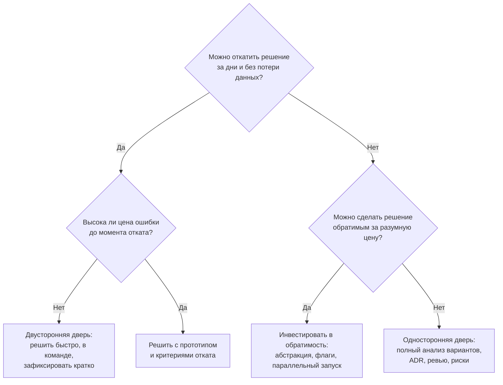

# 6.4 Анализ компромиссов и оценка архитектуры

## Зачем это аналитику

«В архитектуре нет правильных ответов, есть компромиссы» — первый закон из книги Ричардса и Форда. Архитектор отличается тем, что умеет явно назвать, что он выигрывает и чем платит, сравнить варианты по понятным критериям и показать риски. На собеседовании это проверяется вопросом «почему не иначе?»

## Что понять

- [ ] Компромисс как центральное понятие: у каждого решения есть цена, и её нужно назвать вслух.
- [ ] Матрица решений: критерии из атрибутов качества, веса, оценки вариантов; почему цифры — повод для обсуждения, а не ответ.
- [ ] ATAM и его облегчённая версия: сценарии → архитектурные подходы → чувствительные точки, точки компромисса, риски и не-риски.
- [ ] Анализ рисков: вероятность, влияние, меры; риск-сторминг как командная практика.
- [ ] Обратимость решений: «двусторонние двери» и «односторонние двери», сколько анализа нужно в каждом случае.
- [ ] Фреймворк выбора технологии: зрелость, сообщество, компетенции команды, стоимость владения, привязка к вендору.
- [ ] Как представить сравнение заказчику: одна страница, рекомендация, последствия, что будет при ошибке.

## Урок

<!-- LESSON:START -->
### Компромисс как единица архитектурной работы

Любое архитектурное решение что-то улучшает и что-то ухудшает. Кэш ускоряет чтение и добавляет риск устаревших данных. Асинхронная интеграция развязывает системы и усложняет отладку и сверки. Микросервисы дают независимые релизы и приносят распределённые транзакции. Если в обосновании решения перечислены только плюсы, анализ не проведён — он просто не записан, и цена всплывёт позже, обычно в эксплуатации.

Поэтому зрелое обоснование всегда состоит из трёх частей: что мы получаем, чем платим, почему эта цена приемлема в нашем контексте. Третья часть важнее первых двух. Одно и то же решение правильно для одной системы и ошибочно для другой, потому что различаются приоритеты качества, нагрузка, компетенции команды и цена ошибки.

Отсюда следствие для собеседований и для работы: на вопрос «почему не иначе?» нельзя отвечать «так лучше». Нужно назвать атрибут качества, который был приоритетным, и явно признать, какой атрибут пострадал.

### Процесс сравнения вариантов

Сравнение вариантов — не один артефакт, а последовательность шагов. Хорошо работает такой порядок:

1. **Сформулировать проблему и границы.** Какое решение принимаем, что уже зафиксировано, какие ограничения не обсуждаются (регуляторика, корпоративный стек, срок).
2. **Выписать драйверы.** Бизнес-цели и 3–5 приоритетных атрибутов качества с измеримыми сценариями. Без этого критерии оценки будут случайными.
3. **Собрать варианты.** Минимум два реальных, желательно три. Вариант «ничего не менять» или «минимальная доработка» часто полезно включать как базовую линию.
4. **Отсечь по порогам.** Варианты, нарушающие жёсткие ограничения, выбывают до всякой взвешенной оценки.
5. **Оценить оставшиеся** по критериям: матрица решений, прототип, расчёт нагрузки, консультация с эксплуатацией.
6. **Проверить чувствительность.** Меняется ли вывод, если немного сдвинуть веса или оценки.
7. **Оформить решение** в ADR и короткую записку для заказчика: рекомендация, цена, риски, условия пересмотра.

### Матрица решений

Матрица решений (decision matrix) — таблица, где строки — критерии, столбцы — варианты, у каждого критерия есть вес, у каждой пары «критерий — вариант» есть оценка. Итог — взвешенная сумма.

Критерии должны вытекать из приоритетных атрибутов качества и бизнес-целей, а не из общего списка «производительность, масштабируемость, надёжность». Веса — из приоритетов заинтересованных сторон. Оценки — по заранее договорённой шкале с описанием, что означает 1, 3 и 5.

#### Пример: выписки в банке для юрлиц

Интернет-банк для юрлиц формирует выписки по счетам. В конце месяца клиенты массово запрашивают выписки за период, и тяжёлые запросы начинают замедлять основную базу, через которую проходят платёжные поручения. Рассматриваем три варианта:

- **A** — оставить запросы на основной базе, оптимизировать индексы и запросы.
- **B** — перевести формирование выписок на реплику для чтения.
- **C** — построить отдельную витрину выписок, наполняемую через захват изменений (CDC).

Шкала: 5 — лучше всего по критерию, 1 — хуже всего. Для критериев-затрат (нагрузка, сложность, стоимость) высокая оценка означает низкие затраты.

| Критерий | Вес | A: основная база | B: реплика | C: витрина через CDC |
|---|---|---|---|---|
| Актуальность данных для клиента | 25% | 5 | 4 | 3 |
| Изоляция платежей от нагрузки выписок | 25% | 1 | 4 | 5 |
| Простота эксплуатации | 15% | 5 | 4 | 2 |
| Срок до запуска | 15% | 5 | 4 | 2 |
| Стоимость владения | 10% | 5 | 4 | 2 |
| Обратимость | 10% | 5 | 4 | 3 |
| Итог | 100% | 4,0 | 4,0 | 3,1 |

Формально A и B равны. Это и есть главный урок: цифра не отвечает на вопрос, она показывает, где обсуждать. Вариант A получил 1 по изоляции платежей — критерию, который для банка по сути является порогом, а не одним из слагаемых. Если платежи тормозят в последний день месяца, никакая простота эксплуатации это не компенсирует. Правильная постановка — сделать изоляцию пороговым условием, и тогда A выбывает на шаге 4.

Теперь проверка чувствительности. Сдвинем веса: изоляция 35%, актуальность 15%. Итоги станут A — 3,6, B — 4,0, C — 3,3. Вывод «B предпочтительнее A» устойчив. А вот положение C зависит от того, насколько вырастет объём: если бизнес планирует аналитику по операциям клиентов и хранение выписок за много лет, у витрины появятся дополнительные преимущества, которых в матрице сейчас нет. Это стоит записать как условие пересмотра решения.

#### Почему матрица опасна

- **Ложная точность.** Разница 3,9 и 4,1 ничего не значит при оценках, выставленных «на глаз».
- **Подгонка.** Автор, который уже выбрал вариант, бессознательно подбирает веса. Защита: фиксировать веса и шкалы до оценки вариантов и желательно с участием заинтересованных сторон.
- **Компенсация.** Взвешенная сумма позволяет провалу по одному критерию компенсироваться хорошими оценками по другим. Для критичных атрибутов нужны пороги, а не веса.
- **Зависимые критерии.** «Срок запуска» и «стоимость разработки» во многом одно и то же; двойной учёт искажает результат.
- **Неучтённое.** Матрица сравнивает только то, что в неё внесли. Риски и обратимость часто забывают.

Правильное использование: матрица — инструмент структурировать разговор и сделать явными предпочтения. Итоговая рекомендация формулируется словами, со ссылкой на ключевые компромиссы.

### ATAM и его облегчённая версия

Метод анализа архитектурных компромиссов (Architecture Tradeoff Analysis Method, ATAM) разработан в Институте программной инженерии (SEI) Карнеги-Меллон; основные авторы — Рик Казман, Марк Кляйн и Пол Клементс. Это структурированное ревью архитектуры с участием заинтересованных сторон, цель которого — не выставить оценку, а найти риски и компромиссы относительно целей по качеству.

#### Основные шаги

В полной версии ATAM занимает несколько дней и проходит в несколько фаз. По существу шаги такие:

1. Представить метод, бизнес-драйверы и архитектуру.
2. Выделить архитектурные подходы (approaches): стили, тактики, паттерны — «реплика для чтения», «асинхронная очередь», «кэш с TTL», «активный-пассивный кластер».
3. Построить дерево полезности (utility tree): атрибуты качества → уточнения → конкретные сценарии, каждый с оценкой важности для бизнеса и сложности реализации (высокая, средняя, низкая).
4. Проанализировать подходы на приоритетных сценариях.
5. С широким кругом участников провести мозговой штурм сценариев и сравнить их с деревом.
6. Повторить анализ для новых важных сценариев.
7. Представить результаты: риски, не-риски, точки чувствительности, точки компромисса, темы рисков.

Сценарий качества записывается так, чтобы его можно было проверить: источник, стимул, окружение, артефакт, отклик, мера отклика. Например: «В последний рабочий день месяца (окружение) несколько тысяч клиентов одновременно запрашивают выписку за месяц (источник и стимул); сервис выписок (артефакт) формирует её (отклик) не дольше 10 секунд для 95% запросов, при этом время приёма платёжного поручения не растёт более чем на 10% (мера)». Цифры здесь условные; в реальном проекте их задаёт бизнес.

#### Ключевые понятия

- **Точка чувствительности (sensitivity point)** — свойство одного или нескольких элементов архитектуры, от которого критически зависит достижение отклика по одному атрибуту качества. Небольшое изменение этого свойства заметно меняет отклик.
- **Точка компромисса (tradeoff point)** — свойство, которое является точкой чувствительности сразу для нескольких атрибутов, причём влияет на них в разные стороны. Улучшая одно, ухудшаешь другое.
- **Риск (risk)** — архитектурное решение или его отсутствие, которое может привести к недостижению цели по качеству.
- **Не-риск (non-risk)** — решение, которое по результатам анализа признано хорошим для данных сценариев, с объяснением почему. Не-риски важно фиксировать, чтобы не возвращаться к ним.
- **Тема риска (risk theme)** — обобщение нескольких рисков, указывающее на системную проблему: например, «нет управления задержкой репликации во всей системе».

На примере выписок с вариантом B:

| Тип | Формулировка |
|---|---|
| Точка чувствительности | Размер пула соединений к реплике определяет время формирования выписки в пике |
| Точка компромисса | Асинхронная репликация: улучшает изоляцию платежей и производительность, но ухудшает актуальность — последние операции могут не попасть в выписку |
| Риск | Задержка репликации не контролируется; при её росте клиент получит выписку без проведённого платежа и обратится в поддержку |
| Не-риск | Выписки за закрытые прошлые дни с реплики: данные уже не меняются, задержка не влияет |
| Мера | Выписка за текущий день — с основной базы или с проверкой задержки репликации; метрика задержки с порогом и алертом |

#### Облегчённый ATAM

Полный ATAM дорог и требует внешних оценщиков. Для команды обычно достаточно облегчённой версии на полдня: архитектор кратко представляет драйверы и архитектуру, участники составляют 5–10 сценариев качества, для каждого определяют задействованные подходы и тут же фиксируют чувствительность, компромиссы и риски. Результат — список рисков с владельцами и мерами. Ценность метода не в ритуале, а в том, что сценарии заставляют обсуждать конкретные ситуации, а не абстрактную «надёжность».

### Анализ рисков и риск-сторминг

Риск оценивается по двум осям: вероятность и влияние. Простая шкала «низкая, средняя, высокая» на каждой оси даёт матрицу 3×3, которой достаточно для большинства решений. Более точные шкалы редко оправданы: исходные данные всё равно экспертные.

Для каждого значимого риска фиксируются меры одного из четырёх типов: избежать (изменить решение), снизить (вероятность или влияние), передать (подрядчику, страховщику, провайдеру облака по SLA) или принять осознанно. Принятие — нормальный исход, если оно записано и согласовано.

Риск-сторминг (risk-storming) — командная практика, которую предложил Саймон Браун. Участники смотрят на диаграммы архитектуры (удобно на уровне контейнеров C4), сначала индивидуально и молча отмечают риски стикерами прямо на элементах схемы, оценив вероятность и влияние. Затем стикеры сводят вместе, обсуждают совпадения и расхождения и договариваются о мерах. Индивидуальная фаза важна: она снижает влияние самого громкого участника и выявляет риски, которые видит только эксплуатация или только аналитик интеграций. Скопления стикеров на одном элементе сразу показывают горячие точки.

### Обратимость: сколько анализа нужно

Время на анализ — тоже ресурс. Полезное разделение из письма акционерам Джеффа Безоса: решения — «двусторонние двери» и «односторонние двери». Через двустороннюю дверь можно пройти и вернуться с небольшими затратами. Через одностороннюю — вернуться дорого или невозможно.

Примеры односторонних дверей: модель данных, которая станет контрактом с внешними системами; выбор облачного провайдера с глубоким использованием его управляемых сервисов; публичный API для клиентов; формат идентификаторов. Примеры двусторонних: выбор библиотеки внутри сервиса, внутренний формат логов, настройки кэша.

Две типичные ошибки противоположны. Первая — тратить недели на обсуждение обратимых решений. Вторая — принимать необратимые решения со скоростью обратимых. Часто лучший ход — превратить одностороннюю дверь в двустороннюю: скрыть технологию за интерфейсом, запустить новое решение параллельно со старым, отложить решение до последнего ответственного момента (last responsible moment), когда информации будет больше.

### Выбор технологии

Функции технологии — наименее интересная часть выбора: у зрелых альтернатив они обычно сопоставимы. Решают другие факторы.

- **Зрелость.** Сколько лет в промышленной эксплуатации, стабильность API, наличие LTS-версий, известные проблемы.
- **Сообщество и поддержка.** Активность разработки, скорость исправления уязвимостей, наличие коммерческой поддержки, кто стоит за проектом и что будет, если он уйдёт.
- **Компетенции команды и рынок.** Есть ли люди, которые умеют с этим работать сегодня; можно ли нанять через год; сколько стоит обучение.
- **Стоимость владения (TCO).** Лицензии и инфраструктура — лишь часть. Эксплуатация, мониторинг, обновления, резервное копирование, дежурства, обучение — часто больше.
- **Привязка к вендору (vendor lock-in).** Насколько дорого уйти: проприетарные API, форматы данных, особенности управляемых сервисов. Полезно заранее описать стратегию выхода.
- **Соответствие ограничениям.** Лицензия, требования ИБ и регуляторов, размещение данных, корпоративный стек.
- **Эксплуатационная пригодность.** Наблюдаемость, поведение при сбоях, резервирование, миграции схемы, инструменты администрирования.

Удобная организационная практика — технологический радар (идея ThoughtWorks): технологии разбиты на кольца «использовать», «пробовать», «оценивать», «не брать в новые проекты». Он снимает часть споров до их начала и делает выбор технологии командным, а не личным.

### Как представить сравнение заказчику

Заказчику не нужна матрица на шесть страниц. Нужна одна страница, которую можно прочитать за пять минут и по которой можно принять решение. Рабочая структура:

1. **Контекст.** Какую проблему решаем и почему сейчас. Одним абзацем, языком бизнеса: «в последний день месяца время приёма платежей растёт, жалобы клиентов».
2. **Варианты.** Два-три, по одной строке на каждый.
3. **Рекомендация.** Какой вариант и главная причина.
4. **Цена.** Сколько стоит, сколько занимает, что мы при этом не получаем. Компромисс — явно.
5. **Риски и что будет при ошибке.** Какие признаки покажут, что решение неверно, и сколько стоит развернуться.
6. **Что нужно от заказчика.** Решение, бюджет, доступ, срок ответа.

Когда рекомендован не самый дешёвый вариант, объяснение строится на полной стоимости, а не на цене внедрения. Дешёвый вариант может оказаться дорогим из-за стоимости владения, стоимости рисков или стоимости разворота. В примере с выписками: вариант A дешевле на старте, но оставляет вероятность деградации платежей в пике. Нужно перевести это на язык заказчика: сколько клиентов затронуто, какие репутационные и регуляторные последствия, сколько стоит один такой инцидент по оценке бизнеса. Если после этого заказчик выбирает дешёвый вариант осознанно, это легитимное решение: риск принят и записан.

### Типичные ошибки

- Обосновывать решение только плюсами, не называя цену и пострадавшие атрибуты качества.
- Сравнивать один проработанный вариант с двумя «для галочки»; реальных альтернатив нет, анализ декоративный.
- Выбирать критерии и веса после того, как вариант уже нравится, и доверять разнице в десятые доли балла.
- Использовать веса там, где нужен порог: провал критичного атрибута не компенсируется другими.
- Тратить одинаковое время на обратимые и необратимые решения.
- Выбирать технологию по функциям и хайпу, игнорируя компетенции команды, эксплуатацию и стратегию выхода.
- Не фиксировать не-риски и условия пересмотра, из-за чего одно и то же решение обсуждают заново каждые полгода.

### Как говорить об этом на собеседовании

На вопрос «как вы сравниваете варианты» полезно описать процесс, а не инструмент: драйверы и сценарии качества, отсечение по ограничениям, оценка, проверка чувствительности, ADR и записка для бизнеса. Покажите, что понимаете ограничения матрицы: «веса фиксирую до оценки, критичные атрибуты делаю порогами, итоговые цифры использую как повод для обсуждения». Уверенное владение словарём ATAM — точка чувствительности, точка компромисса, риск, не-риск — сильно отличает от кандидатов, которые знают только «плюсы и минусы».

Хороший ответ всегда содержит пример из практики, где вы назвали цену решения: «выбрали асинхронный обмен с учётной системой, выиграли в устойчивости, заплатили задержкой и необходимостью ежедневной сверки; сверку заложили в постановку сразу». И отдельно — пример, где вы сознательно сэкономили на анализе, потому что решение было обратимым.

### Коротко

- Каждое решение — компромисс; обоснование без названной цены неполно.
- Процесс: драйверы, варианты, пороги, оценка, чувствительность, ADR, записка для бизнеса.
- Матрица решений структурирует разговор, но не принимает решение; веса фиксируются заранее, критичные атрибуты — порогами.
- ATAM ищет точки чувствительности, точки компромисса, риски и не-риски на конкретных сценариях качества; облегчённая версия укладывается в полдня.
- Риски оцениваются по вероятности и влиянию; риск-сторминг делает оценку командной и снижает влияние одного голоса.
- Глубина анализа определяется обратимостью: необратимые решения — тщательно, обратимые — быстро; часто выгоднее сделать решение обратимым.
- Технологию выбирают по зрелости, сообществу, компетенциям, стоимости владения и привязке к вендору, а не только по функциям.
- Заказчику — одна страница: рекомендация, цена, риски, стоимость ошибки, что нужно от него.
<!-- LESSON:END -->

## Читать дальше

- Bass, Clements, Kazman — глава об оценке архитектуры (ATAM).
- Software Architecture: The Hard Parts — главы о компромиссах при декомпозиции и данных.
- Simon Brown, «Risk-storming» (riskstorming.com).

На system-design.space:

- [Software Architecture: The Hard Parts (краткий обзор)](https://system-design.space/chapter/hard-parts-book/)
- [Как выбирать технологию: фреймворк оценки](https://system-design.space/chapter/technology-evaluation-framework/)
- [Фреймворк выбора СУБД](https://system-design.space/chapter/database-selection-framework/)
- [Head First Software Architecture (краткий обзор)](https://system-design.space/chapter/head-first-software-architecture-book/)

## Практика

1. Сравнить три варианта интеграции для обезличенной задачи (синхронный REST, события через брокер, пакетный обмен) по матрице из 5–6 критериев с весами. Сформулировать рекомендацию на одну страницу.
2. Провести облегчённый ATAM для своей системы: 5 сценариев, архитектурные подходы, найти хотя бы по одной точке чувствительности, точке компромисса и риску.
3. Разобрать одно решение из прошлого проекта: была ли это «односторонняя дверь», и было ли анализа достаточно.

## Вопросы для самопроверки

1. Как вы сравниваете архитектурные варианты? Опишите процесс.
2. Что такое точка чувствительности и точка компромисса в ATAM?
3. Чем опасна матрица решений с весами и как её использовать правильно?
4. Как решить, сколько времени тратить на анализ решения?
5. По каким критериям вы выбираете технологию, кроме её функций?
6. Как объяснить заказчику, почему выбран не самый дешёвый вариант?

## Заметки

<!-- Свои формулировки, ошибки, ссылки. -->
