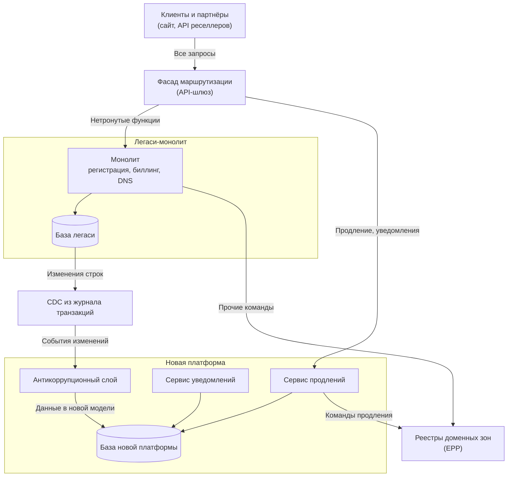
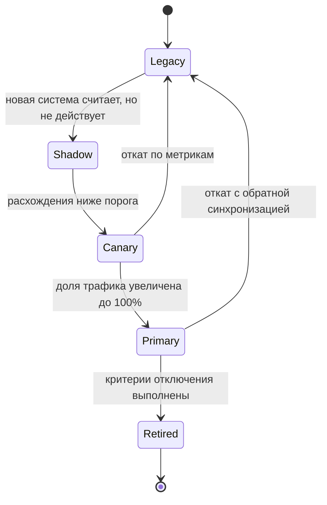

# 6.5 Эволюционная архитектура, технический долг и модернизация легаси

## Зачем это аналитику

Большинство архитекторов работают не с новыми системами, а с существующими: модернизация, миграция, распил монолита. Архитектура должна уметь меняться безопасно, а технический долг — управляться, а не накапливаться. Это прямо про ваш проект модернизации легаси.

## Что понять

- [ ] Эволюционная архитектура: изменения — норма; архитектура проектируется под управляемые изменения.
- [ ] Fitness functions: автоматические проверки архитектурных свойств (зависимости между модулями, задержка, размер ответа, отсутствие циклов).
- [ ] Технический долг: виды (осознанный и неосознанный, разумный и безрассудный — квадрант Фаулера), как измерять и приоритизировать, как говорить о нём с бизнесом.
- [ ] Стратегии модернизации: переписать, рефакторить, заменить, инкапсулировать; почему «большое переписывание» опасно.
- [ ] Strangler Fig на практике: маршрутизация, синхронизация данных, параллельная работа старой и новой систем, критерии отключения старой.
- [ ] Работа с данными при миграции: двойная запись, CDC, сверки, обратимость.
- [ ] Anticorruption layer: защита новой модели от легаси.
- [ ] Как вести модернизацию, не останавливая развитие бизнеса.

## Урок

<!-- LESSON:START -->
### Изменения — норма, а не исключение

Классический подход к архитектуре предполагал, что её можно спроектировать заранее и затем реализовать. На практике требования меняются, нагрузка растёт неравномерно, технологии устаревают, а компания открывает новые направления. Система, которую нельзя безопасно менять, начинает диктовать бизнесу темп.

Эволюционная архитектура (evolutionary architecture) — подход, описанный Нилом Фордом, Ребеккой Парсонс и Патриком Куа: архитектура проектируется так, чтобы поддерживать управляемые, пошаговые изменения по нескольким измерениям. Ключевые идеи три:

- **Инкрементальные изменения.** Система меняется небольшими шагами, каждый из которых можно выпустить и откатить. Это требует развитой поставки: автоматических тестов, CI/CD, флагов функций.
- **Управляемость.** Изменения не должны незаметно разрушать важные свойства системы. Для этого свойства формулируются явно и проверяются автоматически — это функции пригодности.
- **Подходящая связанность.** Чем меньше частей нужно менять одновременно, тем дешевле изменение. Границы модулей и сервисов выбираются так, чтобы изменения бизнеса локализовались.

Для работы с легаси это особенно важно: модернизация — это не проект с датой окончания, а смена режима, при котором система снова начинает меняться безопасно.

### Функции пригодности

Функция пригодности (fitness function) — объективная, желательно автоматическая проверка того, насколько система сохраняет заданное архитектурное свойство. Это тест, но не на функциональность, а на архитектурную характеристику: связанность, производительность, безопасность, совместимость.

Функции различают по нескольким осям:

- **Атомарные и целостные (atomic, holistic).** Первые проверяют одно свойство в изоляции (нет циклов между пакетами), вторые — совокупное поведение (время ответа при реалистичной нагрузке и включённом аудите).
- **По событию и непрерывные (triggered, continual).** Первые запускаются в CI при каждом изменении, вторые работают постоянно в промышленной среде: мониторинг, синтетические проверки.
- **Статические и динамические.** Порог фиксирован или зависит от контекста (например, допустимая задержка зависит от числа пользователей).

Примеры функций пригодности для системы регистратора доменов:

- **Зависимости между модулями.** Модуль биллинга не импортирует модуль взаимодействия с реестрами; новые модули не обращаются к таблицам легаси напрямую. В Java это проверяется библиотекой ArchUnit, в других языках — аналогичными линтерами зависимостей или анализом импортов в CI.
- **Отсутствие циклов** между пакетами или сервисами — анализ графа зависимостей в сборке.
- **Задержка.** Проверка доступности домена укладывается в заданный порог для 95-го перцентиля — синтетическая проверка в промышленной среде с алертом.
- **Размер ответа.** API списка доменов клиента не возвращает больше заданного числа записей без пагинации — контрактный тест.
- **Совместимость контрактов.** Новая версия схемы события совместима с предыдущей — проверка в реестре схем или контрактными тестами потребителей.
- **Безопасность.** В зависимостях нет библиотек с критическими уязвимостями — сканер в CI.

Главное правило: функция пригодности должна быть исполняемой и приводить к последствию — падению сборки или алерту. Архитектурный принцип на вики-странице, который никто не проверяет, не является функцией пригодности.

### Технический долг

Метафору технического долга ввёл Уорд Каннингем: осознанное упрощение сегодня похоже на кредит, который ускоряет поставку, но за который потом платятся проценты — дополнительные затраты на каждое изменение в этом месте. Основная сумма (principal) — стоимость устранения; проценты (interest) — постоянная надбавка к стоимости изменений и рискам, пока долг не устранён.

Мартин Фаулер предложил классифицировать долг по двум осям: осознанный или неосознанный, разумный или безрассудный.

| | Безрассудный (reckless) | Разумный (prudent) |
|---|---|---|
| Осознанный (deliberate) | «На проектирование нет времени» — сознательно делаем плохо без плана возврата | «Выпускаем сейчас, последствия понимаем и запланировали исправление» |
| Неосознанный (inadvertent) | Команда не знает, как делать правильно, и не видит, что создаёт долг | «Теперь мы понимаем, как надо было сделать» — знание пришло с опытом |

Разумный осознанный долг — нормальный инструмент бизнеса, как кредит. Разумный неосознанный неизбежен: понимание домена приходит по ходу работы. Безрассудный долг — проблема процессов и компетенций, а не архитектуры.

#### Как измерять

Прямой метрики долга нет. Работают косвенные:

- **Время изменения в области кода.** Сколько занимает типовое изменение в модуле по сравнению с аналогичными модулями; время от начала задачи до выпуска.
- **Частота дефектов и инцидентов** в области, доля возвратов из тестирования.
- **Горячие точки.** Пересечение высокой частоты изменений (по истории системы контроля версий) и высокой сложности кода. Долг в коде, который никто не трогает, почти не приносит процентов. Этот подход подробно описывает Адам Торнхилл.
- **Статический анализ.** Дублирование, сложность, устаревшие зависимости. Полезен для трендов, но «дни долга» из инструментов нельзя воспринимать буквально.

#### Как приоритизировать

Реестр долга ведётся как бэклог: описание, где находится, какое влияние (проценты), стоимость устранения, приоритет. Приоритет определяется отношением процентов к основной сумме и тем, насколько долг мешает ближайшим бизнес-целям. Долг в модуле продлений, который планируется развивать в следующем квартале, важнее более «грязного» кода в отчёте, которым пользуются раз в год.

#### Как говорить с бизнесом

Бизнесу не интересно слово «рефакторинг». Интересны сроки, риски и деньги. Долг нужно переводить в эти термины: «каждое изменение тарифов занимает три недели вместо одной, потому что правила расчёта цены продублированы в четырёх местах; за полгода это стоило столько-то человеко-недель и два инцидента с неверной ценой продления». К такому описанию прилагается предложение: сколько стоит устранение, какой эффект, как мы его измерим. Работают две модели финансирования: постоянная доля ёмкости команды на долг и привязка устранения долга к бизнес-задачам в той же области.

### Стратегии модернизации

Для легаси-системы или её части обычно рассматривают четыре стратегии:

- **Переписать (rewrite).** Новая реализация тех же функций с нуля.
- **Рефакторить (refactor).** Улучшать структуру существующего кода без изменения поведения, постепенно.
- **Заменить (replace).** Купить готовый продукт или перейти на внешний сервис.
- **Инкапсулировать (encapsulate).** Оставить внутренности, но закрыть их стабильным API, чтобы новые потребители не зависели от устройства легаси.

На практике стратегии комбинируют по частям системы: стабильное и редко меняющееся инкапсулируют, типовое заменяют, ядро бизнеса, которое часто меняется, постепенно выносят и переписывают.

#### Почему большое переписывание опасно

«Переписать всё с нуля» выглядит привлекательно и редко заканчивается успехом. Причины:

- **Скрытые требования.** Годы исправлений закодировали в системе правила, которых нет ни в одном документе: особые случаи для отдельных доменных зон, исторические тарифы, обходы ошибок внешних систем. Новая система их не знает.
- **Движущаяся цель.** Пока идёт переписывание, бизнес продолжает менять старую систему, и новая всё время догоняет.
- **Отсутствие ценности до конца.** Годы затрат без результата; финансирование и терпение заканчиваются раньше проекта.
- **Одномоментное переключение.** Самый рискованный момент сосредоточен в одной ночи миграции.
- **Эффект второй системы** (описан Фредериком Бруксом): желание сделать «правильно на этот раз» раздувает объём.

Отсюда предпочтение инкрементальным подходам, главный из которых — Strangler Fig.

### Strangler Fig на практике

Паттерн назван Мартином Фаулером по аналогии с фикусом-душителем, который прорастает вокруг дерева и постепенно его замещает. Новая система вырастает рядом со старой и забирает функции по одной, пока старая не станет ненужной.

#### Пример: модернизация у регистратора доменов

Обезличенный регистратор работает на монолите, которому больше пятнадцати лет. В нём всё: витрина поиска доменов, корзина, биллинг и баланс клиентов, регистрация и продление через протокол EPP с реестрами доменных зон, управление DNS, уведомления, аукционы освобождающихся доменов. Одна база данных, множество неявных связей между таблицами, выпуск раз в несколько недель.

Порядок выделения выбирается по двум критериям: бизнес-ценность изменения и риск. Разумная последовательность:

1. **Уведомления клиентам** (напоминания о продлении). Низкий риск, мало записи в общие данные, быстрый результат, на нём команда отрабатывает инфраструктуру: фасад, CDC, мониторинг.
2. **Проверка доступности и поиск доменов.** Только чтение, высокая нагрузка, заметный эффект для конверсии.
3. **Продление.** Ядро выручки; делается после того, как механизм миграции отработан.
4. **Регистрация и трансферы**, затем **биллинг**, затем **аукционы**.

Биллинг и баланс клиентов идут поздно, потому что от них зависят почти все процессы, а ошибка стоит денег клиентов.



#### Маршрутизация

Фасад — точка, где решается, какая система обслуживает запрос. Маршрутизировать можно по функции (путь API), по сегменту клиентов (сначала внутренние тестовые аккаунты, затем небольшая доля клиентов), по доменной зоне (сначала одна зона с простыми правилами). Сегментная маршрутизация позволяет переключать постепенно и откатывать одним изменением конфигурации.

Если фасад на уровне HTTP поставить невозможно, например функции вызываются внутри монолита, используют ветвление через абстракцию (branch by abstraction): внутри легаси вводится интерфейс, за которым сначала старая реализация, затем вызов новой системы.

#### Параллельная работа и её опасности

До переключения полезно запустить новую систему в теневом режиме: она получает те же входные данные, принимает решения, но результат не применяется, а сравнивается с решением легаси. Для регистратора здесь важная тонкость: взаимодействие с реестром имеет внешние побочные эффекты. Если обе системы отправят команду продления, домен продлится дважды, а регистратор заплатит реестру дважды. Поэтому в теневом режиме новая система вычисляет «что бы я отправила» и сравнивает с тем, что отправил легаси, но команду в реестр не отправляет. Команды во внешний мир в каждый момент времени должен отправлять ровно один владелец функции.



#### Критерии отключения старой функции

Отключать часть легаси можно, когда выполнены заранее согласованные условия: весь трафик функции идёт через новую систему заданное время, включая пиковые периоды (для продлений — конец месяца и массовые истечения доменов); сверки не показывают расхождений или все расхождения объяснены; нет потребителей, которые ходят в старую функцию в обход фасада — это проверяется по логам и метрикам обращений; обратная синхронизация больше не нужна; отчётность и бухгалтерия переключены. Последний пункт часто забывают: отчёты, построенные на таблицах легаси, живут дольше самой функции.

### Данные при миграции

Самая трудная часть модернизации — не код, а данные. Пока функция мигрирует, данные о ней существуют в двух местах, и нужно решить, кто является источником истины и как вторая сторона узнаёт об изменениях.

**Двойная запись (dual write).** Приложение пишет и в старую, и в новую базу. Просто на вид, но без распределённой транзакции одна из записей может не пройти, и базы разойдутся. Если применять, то только вместе с регулярными сверками и механизмом дозаписи, либо через паттерн «исходящий ящик» (transactional outbox): запись в свою базу и событие в той же транзакции.

**Захват изменений (Change Data Capture, CDC).** Изменения читаются из журнала транзакций базы легаси и публикуются как события. Преимущество — легаси не нужно менять, и изменения не теряются. Ограничения: события отражают строки таблиц, а не бизнес-смысл, поэтому их нужно переводить в новую модель; нужно решить вопросы порядка, повторов и начальной загрузки.

**Направление синхронизации меняется по ходу миграции.** Пока источник истины — легаси, данные текут из старой базы в новую. После переключения функции источником становится новая система, и для обратимости поток разворачивается: новая система отдаёт изменения обратно в легаси, чтобы нетронутые функции и отчёты продолжали работать, и чтобы можно было откатиться.

**Сверки.** Эквивалентность данных проверяется регулярно, автоматически и по бизнес-ключам. Пример сверки дат истечения доменов:

```sql
-- Домены, у которых дата истечения в легаси и в новой платформе расходится
SELECT l.domain_name,
       l.expire_date AS legacy_expire,
       n.expires_at::date AS new_expire
FROM legacy_domains l
FULL OUTER JOIN new_domains n ON n.fqdn = l.domain_name
WHERE l.domain_name IS NULL
   OR n.fqdn IS NULL
   OR l.expire_date <> n.expires_at::date;
```

Такие запросы запускаются по расписанию, результат — метрика числа расхождений с алертом. Дополнительно сверяются агрегаты: число активных доменов по зонам, суммы списаний за день, балансы клиентов. Для денег и дат истечения допустимый уровень расхождений — ноль после объяснения каждого случая.

#### Как проверить, что новая система ведёт себя так же

Кроме сверки данных проверяется поведение:

- **Теневой запуск** со сравнением решений: цена продления, выбранный сценарий, отправленная команда.
- **Воспроизведение трафика**: записанные реальные запросы прогоняются через обе системы, ответы сравниваются с учётом допустимых различий (время, идентификаторы).
- **Тесты характеристик (characterization tests)** — идея Майкла Фезерса: тесты фиксируют текущее поведение легаси, каким бы странным оно ни было, и затем прогоняются на новой реализации.
- **Сравнение бизнес-метрик** на канареечной доле: конверсия продлений, доля ошибок, обращения в поддержку.

Каждое найденное расхождение классифицируется: ошибка новой системы, ошибка легаси, которую решено не переносить (с согласованием бизнеса), или допустимое различие.

### Антикоррупционный слой

Антикоррупционный слой (anticorruption layer, ACL) — понятие из DDD Эрика Эванса: слой перевода между моделью новой системы и моделью внешней или легаси-системы. Его цель — не дать понятиям легаси проникнуть в новую модель.

В примере регистратора статус домена в легаси — числовой код, в котором смешаны жизненный цикл в реестре, состояние оплаты и внутренние флаги поддержки; дата истечения хранится в локальном времени сервера; клиент и реселлер лежат в одной таблице с признаком типа. Если новая платформа начнёт использовать эти коды напрямую, через год в ней будет та же путаница. ACL переводит: код статуса в явные состояния жизненного цикла домена и отдельный статус оплаты, локальное время — в UTC, общую таблицу — в разные сущности. Все знания о странностях легаси сосредоточены в одном месте и удаляются вместе с ним.

ACL живёт на стороне новой системы и принадлежит команде новой системы. Он же — естественное место для обработки событий CDC.

### Модернизация без остановки бизнеса

Модернизация, которая замораживает развитие продукта, обычно отменяется при первом же бизнес-приоритете. Практики, которые помогают этого избежать:

- **Каждый шаг приносит ценность.** Вынос проверки доступности — это ещё и ускорение поиска; вынос продлений — ещё и гибкие тарифы, которых бизнес давно ждал.
- **Новые функции — сразу в новой системе**, если их область уже вынесена или выносится. Функции в невынесенной области пишутся в легаси, но через интерфейс, который облегчит их будущий перенос.
- **Короткое замораживание изменений только в мигрируемой области** и только на время переключения.
- **Фиксированная доля ёмкости** на модернизацию, согласованная с бизнесом, и прозрачный прогресс: сколько функций перенесено, сколько трафика идёт в новую систему, сколько таблиц легаси больше не используется.
- **Функции пригодности с первого дня**: запрет на прямые обращения новых модулей к базе легаси, контроль задержки, контроль расхождений сверок.

### Типичные ошибки

- Начинать с «большого переписывания» с одномоментным переключением вместо поэтапного выноса функций.
- Выносить первым самый сложный и рискованный модуль (биллинг, баланс) до того, как отработаны маршрутизация, синхронизация и мониторинг.
- Использовать двойную запись без сверок и механизма исправления расхождений.
- В теневом режиме позволять новой системе выполнять внешние побочные эффекты: двойные команды в реестр, двойные списания, повторные письма.
- Протаскивать модель легаси в новую систему без антикоррупционного слоя.
- Не определить критерии отключения старой системы; в итоге две системы живут параллельно годами, и стоимость владения удваивается.
- Объяснять бизнесу долг словами «код плохой» вместо сроков, инцидентов и денег; формулировать архитектурные принципы без автоматической проверки.

### Как говорить об этом на собеседовании

Уровень senior виден по тому, что вы говорите о модернизации как о последовательности управляемых шагов с измеримыми критериями, а не как о смене технологии. Хорошая структура ответа: почему не переписывание; как выбирали порядок выноса (ценность и риск); как устроены маршрутизация и синхронизация данных; как проверяли эквивалентность; как откатывались; по каким критериям отключали старое. Упомяните детали, которые знает только практик: внешние побочные эффекты при параллельной работе, разворот направления синхронизации после переключения, отчёты, которые продолжают читать таблицы легаси.

Если в вашем опыте была модернизация у регистратора, опирайтесь на неё, но обезличенно: «легаси-платформа регистратора, выносили функции по Strangler Fig, начали с низкорискового модуля, данные синхронизировали через CDC со сверками по бизнес-ключам». На вопрос про технический долг покажите, что умеете переводить его в язык бизнеса и приоритизировать по процентам, а не по степени неаккуратности кода.

### Коротко

- Эволюционная архитектура исходит из того, что изменения неизбежны, и делает их инкрементальными, управляемыми и локальными.
- Функция пригодности — исполняемая проверка архитектурного свойства с последствием: падением сборки или алертом.
- Технический долг — это проценты на изменения; квадрант Фаулера различает осознанный и неосознанный, разумный и безрассудный долг. Приоритет — по процентам и связи с бизнес-планами.
- Большое переписывание опасно скрытыми требованиями, движущейся целью и отсутствием ценности до конца.
- Strangler Fig: фасад маршрутизации, поэтапный вынос функций, теневой режим, канареечное переключение, явные критерии отключения.
- Данные — главная сложность: источник истины, CDC или outbox вместо наивной двойной записи, регулярные сверки, обратная синхронизация для отката.
- Антикоррупционный слой изолирует новую модель от понятий легаси.
- Модернизация выживает, только если каждый шаг приносит бизнесу ценность и прогресс измерим.
<!-- LESSON:END -->

## Читать дальше

- Neal Ford et al., *Building Evolutionary Architectures* (2nd ed.).
- Sam Newman, *Monolith to Microservices* — стратегии миграции.
- Martin Fowler, статьи «TechnicalDebtQuadrant» и «StranglerFigApplication».
- Michael Feathers, *Working Effectively with Legacy Code* — по желанию.

На system-design.space:

- [Building Evolutionary Architectures (краткий обзор)](https://system-design.space/chapter/evolutionary-arch-book/)
- [Эволюционная архитектура на практике](https://system-design.space/chapter/evolutionary-architecture-practice/)
- [Continuous Architecture in Practice (краткий обзор)](https://system-design.space/chapter/continuous-arch-book/)
- [Tidy First? (Чистый дизайн) (краткий обзор)](https://system-design.space/chapter/tidy-first-book/)
- [Лаба: Миграция схемы и исторический пересчёт под нагрузкой](https://system-design.space/labs/schema-backfill-online-migration/)

## Практика

1. Составить план модернизации обезличенной легаси-системы: какие части выделять первыми и почему, как синхронизировать данные, как проверять эквивалентность, когда отключать старое.
2. Сформулировать 3–5 fitness functions для этой системы и указать, как их автоматизировать.
3. Составить реестр технического долга на 10 пунктов: описание, влияние, стоимость устранения, приоритет. Сформулировать, как бы вы обосновали бизнесу выделение времени на долг.

## Вопросы для самопроверки

1. Что такое fitness function? Приведите три примера.
2. Почему «переписать всё с нуля» редко работает?
3. Как устроена миграция по Strangler Fig и что делать с данными?
4. Как измерять и приоритизировать технический долг?
5. Как убедить бизнес выделить время на технический долг?
6. Как проверить, что новая система ведёт себя так же, как старая?

## Заметки

<!-- Свои формулировки, ошибки, ссылки. -->
