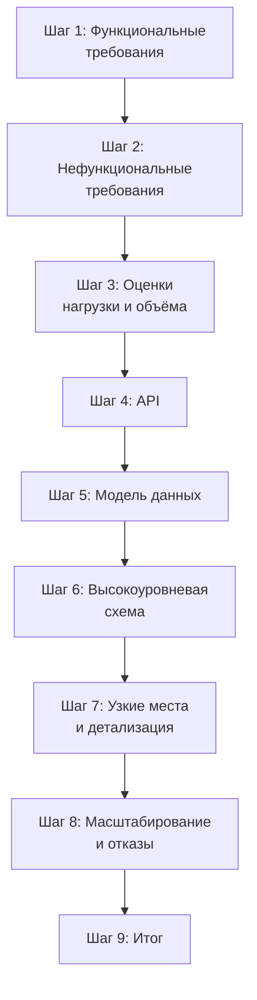
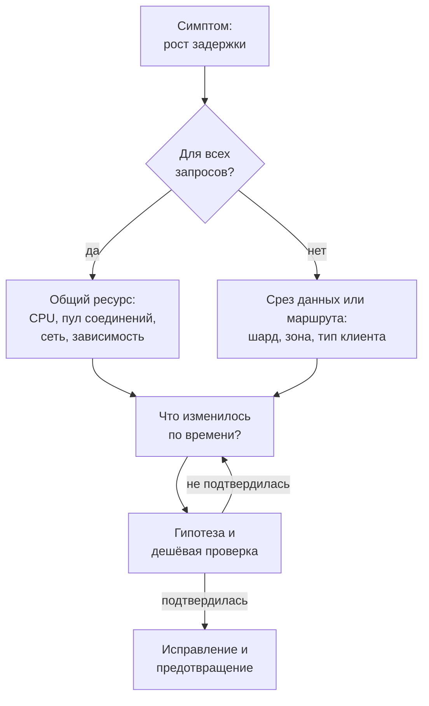

# 7.1 Метод: как вести интервью по системному дизайну

## Зачем это аналитику

На интервью оценивают не «правильную» архитектуру, а процесс: умение прояснить требования, оценить масштаб, разложить систему, найти узкие места и обосновать компромиссы. Кандидат, который сразу рисует Kafka и Redis, проваливается чаще того, кто задаёт вопросы. Для аналитика это сильная сторона — её нужно превратить в метод.

## Что понять

- [ ] Что оценивают интервьюеры: прояснение требований, структура, глубина, компромиссы, коммуникация; как меняются ожидания по грейдам.
- [ ] Шаги: функциональные требования → нефункциональные → оценки → API → модель данных → высокоуровневая схема → детализация узких мест → масштабирование и отказы → итог.
- [ ] Распределение времени на 45–60 минут и типичные ошибки тайминга.
- [ ] Как задавать уточняющие вопросы и фиксировать допущения вслух.
- [ ] Как вести интервьюера: предлагать варианты углубления, а не ждать вопросов.
- [ ] Типы задач: продуктовые (лента, чат), инфраструктурные (очередь, кэш, rate limiter), данные (аналитика, агрегатор), ML-системы.
- [ ] Разновидность — интервью по диагностике инцидентов: как рассуждать от симптома к причине.
- [ ] Как готовиться: краткосрочный и долгосрочный план.

## Урок

<!-- LESSON:START -->
### Что на самом деле проверяют

Интервью по системному дизайну (system design interview) похоже на экзамен по архитектуре, но оценивают на нём не ответ. У задачи «спроектируйте мессенджер» нет эталонного решения: интервьюер видел десятки приемлемых схем. Его интересует, как кандидат думает, когда задача размыта, времени мало, а данных нет.

Обычно в оценочном листе пять-шесть осей:

- **Прояснение требований.** Сузил ли кандидат задачу до решаемой, заметил ли неочевидные требования, отделил ли главное от второстепенного.
- **Структура.** Есть ли у рассуждения скелет, или кандидат прыгает между темами. Понятно ли интервьюеру в любой момент, на каком шаге вы находитесь.
- **Глубина.** Способен ли кандидат опуститься на уровень механизмов хотя бы в одном-двух местах: как именно устроено шардирование, что происходит при отказе реплики, как решается гонка.
- **Компромиссы (trade-offs).** Видит ли кандидат альтернативы и цену выбора. Фраза «возьмём Cassandra» без «потому что» и «ценой чего» почти ничего не стоит.
- **Коммуникация.** Говорит ли вслух, реагирует ли на подсказки, умеет ли признать ошибку и перестроиться.
- **Прагматизм.** Соразмерно ли решение масштабу. Шардированная база под тысячу пользователей — такой же сигнал, как одна база под миллиард.

Вес осей зависит от грейда. Ниже — обобщённая картина; в конкретных компаниях акценты разные, но направление одно.

| Ось | Middle | Senior | Staff и архитектор |
|---|---|---|---|
| Требования | Задаёт базовые вопросы по подсказке | Сам выделяет ключевые требования и ограничения | Связывает требования с бизнес-целью, находит скрытые |
| Структура | Проходит шаги, иногда с помощью | Ведёт интервью сам, держит тайминг | Меняет план под задачу и объясняет почему |
| Глубина | Знает компоненты и их назначение | Разбирает 1–2 узких места до механизмов | Видит системные эффекты: каскадные отказы, стоимость, эволюцию |
| Компромиссы | Называет альтернативы | Сравнивает по критериям, выбирает с обоснованием | Учитывает организацию, эксплуатацию, миграцию |
| Инициатива | Отвечает на вопросы | Предлагает, куда углубиться | Задаёт повестку и рамки обсуждения |

Главное отличие senior от middle — инициатива и обоснованность. Middle может нарисовать правильную схему, но интервьюеру приходится тянуть его за собой. Senior сам говорит: «Здесь у нас два узких места, предлагаю начать с записи, потому что она ограничивает выбор хранилища».

### Скелет интервью

Метод — это последовательность шагов, каждый из которых отвечает на один вопрос и даёт вход следующему. Порядок не догма, но отклоняться от него стоит осознанно.

**1. Функциональные требования.** Что система делает. Цель — список из 3–5 сценариев, которые вы будете проектировать, и явный список того, что вы не проектируете. Второй список так же важен: он снимает с вас ответственность за регистрацию, биллинг и админку, если о них не спросили.

**2. Нефункциональные требования.** Масштаб, задержка, доступность, согласованность, долговечность данных, требования регулятора. Здесь рождается большинство архитектурных решений. «Чат» с требованием строгого порядка сообщений и «чат» с допустимой потерей порядка — разные системы.

**3. Оценки.** Пиковая нагрузка, соотношение чтения и записи, объём хранения, трафик. Цель — не точность, а вывод: «одна база справится» или «запись придётся шардировать». Подробно техника разобрана в модуле 7.2. Если оценки ничего не меняют в решении, их стоит сократить до двух фраз.

**4. API.** Несколько ключевых методов с параметрами и ответами. API фиксирует границы системы и заставляет уточнить, что именно передаётся: идентификатор или объект, пагинация курсором или смещением, синхронный ответ или идентификатор задачи.

**5. Модель данных.** Основные сущности, ключи, связи, паттерн доступа. Для аналитика это самый сильный шаг: здесь можно показать, что вы думаете о ключе партиционирования и индексах от запросов, а не от сущностей.

**6. Высокоуровневая схема.** Клиенты, шлюз, сервисы, хранилища, очереди. Схема должна закрывать все функциональные сценарии из шага 1 в простейшем варианте. Пройдите по ней каждый сценарий вслух.

**7. Узкие места и детализация.** Где схема сломается при целевом масштабе. Именно здесь проверяется глубина. Выберите одно-два места и разберите механизм.

**8. Масштабирование и отказы.** Что происходит при падении узла, дата-центра, зависимости. Как система растёт в десять раз. Мониторинг и деградация.

**9. Итог.** Минута на резюме: что спроектировали, какие компромиссы приняли, что осталось за рамками и что сделали бы следующим.

### Тайминг

Типичная ошибка — потратить двадцать минут на требования и API, а на узкие места оставить пять. Интервьюер уходит без сигнала о глубине. Обратная ошибка — сразу рисовать схему и через полчаса обнаружить, что проектировали не ту систему.

| Шаг | 45 минут | 60 минут |
|---|---|---|
| Знакомство и постановка | 2–3 | 3–5 |
| Функциональные и нефункциональные требования | 5 | 5–7 |
| Оценки | 3–5 | 5 |
| API и модель данных | 5 | 7–8 |
| Высокоуровневая схема | 8–10 | 10 |
| Узкие места, масштабирование, отказы | 12–15 | 15–20 |
| Итог и вопросы | 3 | 5 |

Практические правила:

- Держите в голове контрольную точку: к середине интервью высокоуровневая схема должна быть нарисована целиком.
- Если интервьюер сам просит углубиться в оценки или API, это его выбор — следуйте. Если вы сами застряли, скажите это вслух и предложите двигаться дальше с допущением.
- API и модель данных можно объединить, если задача простая, и даже частично перенести на шаг 7, если модель данных и есть узкое место.
- Не тратьте время на рисование очевидного: балансировщик, CDN и мониторинг можно обозначить одной фразой.

### Уточняющие вопросы и допущения

Первые пять минут решают, какую систему вы проектируете. Вопросы должны менять архитектуру. «Какой язык программирования?» — плохой вопрос. «Сообщение должно дойти до получателя, который сейчас оффлайн?» — хороший: от ответа зависит, нужно ли хранилище недоставленных сообщений.

Удобно держать список вопросов по умолчанию, сгруппированный по темам:

- **Пользователи и сценарии.** Кто пользователи, какие 2–3 сценария главные, есть ли разные роли.
- **Масштаб.** Сколько пользователей в сутки, сколько действий на пользователя, есть ли пики и их природа (сезон, конец месяца, распродажа).
- **Чтение и запись.** Чего больше, насколько свежими должны быть читаемые данные.
- **Задержка.** Какая задержка приемлема для ключевого сценария, где нужен синхронный ответ, а где хватит асинхронного.
- **Согласованность и потери.** Можно ли потерять событие, можно ли показать устаревшие данные, допустимы ли дубли.
- **Доступность и география.** Один регион или несколько, что важнее при сетевом разделении.
- **Ограничения.** Регулятор, хранение персональных данных, сроки хранения, существующие системы, с которыми надо интегрироваться.

Часто интервьюер отвечает «решайте сами». Это приглашение зафиксировать допущение. Формула простая: допущение, основание, последствие. «Предположу, что пользователей около десяти миллионов в сутки — это типично для крупного интернет-магазина в одной стране. Это значит, что чтение каталога укладывается в несколько тысяч запросов в секунду и основная проблема — пики распродаж». Запишите допущения на доске отдельным блоком: к ним удобно возвращаться, когда интервьюер меняет условия.

### Разобранный пример: первые минуты

Задача: «Спроектируйте сервис уведомлений о статусе платёжных поручений для банка, обслуживающего юридических лиц».

Сильный кандидат не начинает со схемы. Его первые вопросы:

1. Кто получатель уведомлений — пользователь в интернет-банке, мобильное приложение, учётная система клиента по API или все три? От этого зависит, нужны ли вебхуки с повторами и подписью.
2. Какие статусы важны: принято, исполнено, отклонено? Нужны ли уведомления о промежуточных шагах, например о валютном контроле?
3. Допустима ли задержка в минуты, или отклонение платежа нужно показать почти сразу?
4. Можно ли потерять уведомление? Допустимы ли дубли? Для учётной системы клиента дубль безопаснее потери, если есть идемпотентный ключ.
5. Сколько платёжных поручений в сутки и как они распределены по времени? У юрлиц явные пики: утро рабочего дня, дни выплаты зарплаты, конец месяца и квартала.
6. Есть ли требования к хранению истории уведомлений и к аудиту?

После ответов кандидат фиксирует рамки: «Проектируем доставку трёх статусов в три канала, гарантия — хотя бы один раз (at-least-once) с идемпотентным ключом, задержка до 30 секунд в 99% случаев. Не проектируем: сам процессинг платежей, настройку подписок в интерфейсе, шаблоны текстов». Дальше — оценка пиков и выбор между опросом (polling) и подпиской на события процессинга.

Этот фрагмент занимает четыре-пять минут, но задаёт всё интервью: интервьюер видит, что кандидат понимает предметную область и думает о гарантиях доставки раньше, чем о брокерах.

### Как вести интервьюера

Интервью — совместная работа, но руль должен быть у вас. Несколько приёмов:

- **Проговаривайте план.** «Сначала требования, потом прикинем масштаб, нарисую общую схему, а дальше предлагаю углубиться в хранение истории — там основная сложность». Интервьюер может поправить план, и это полезно.
- **Предлагайте меню углубления.** После высокоуровневой схемы назовите два-три кандидата: «Можно разобрать доставку с повторами, партиционирование хранилища статусов или поведение при отказе процессинга. С чего начнём?» Так вы показываете, что видите узкие места, и даёте интервьюеру выбрать то, что он хочет проверить.
- **Объявляйте развилки.** «Здесь два варианта: хранить состояние доставки в базе или в брокере с отложенными повторами. Выбираю базу, потому что нужен аудит и повторная отправка по запросу клиента».
- **Возвращайтесь к требованиям.** Каждое крупное решение привязывайте к требованию из первых минут. Это лучший способ показать, что решение не случайно.

Отдельная ситуация — молчащий интервьюер. Молчание не означает, что вы идёте верно или неверно: в некоторых компаниях интервьюерам прямо рекомендуют не вмешиваться. Тактика такая: продолжать по плану, чаще делать короткие контрольные вопросы («Продолжаю со схемой или хотите сначала обсудить API?»), явно проговаривать допущения, чтобы у интервьюера была возможность возразить. Не стоит принимать молчание за сигнал всё переделать.

Если интервьюер подсказывает или возражает, это почти всегда информация, а не проверка стойкости. Разумная реакция — признать довод, оценить его влияние и либо перестроиться, либо аргументированно оставить решение: «Согласен, при таком пике одна очередь станет узким местом. Разделю её по клиентам».

### Типы задач

Задачи на интервью тяготеют к нескольким семействам. У каждого свой центр тяжести, и полезно заранее знать, куда смотреть.

| Тип | Примеры | Центр тяжести |
|---|---|---|
| Продуктовые | Лента новостей, чат, каталог магазина, бронирование | Модель данных, паттерн чтения и записи, веерная рассылка, согласованность для пользователя |
| Инфраструктурные | Очередь сообщений, распределённый кэш, ограничитель частоты (rate limiter), генератор идентификаторов | Алгоритмы, гарантии, поведение при отказах, репликация |
| Данные | Сбор аналитики, агрегатор метрик, счётчики просмотров, отчётность | Поток событий, пакетная и потоковая обработка, агрегация, хранилище для аналитики |
| ML-системы | Рекомендации, поиск, прогноз спроса, модерация | Разделение обучения и инференса, признаки, свежесть модели, задержка и стоимость |

Для аналитика с опытом в ритейле естественная сильная задача — прогноз и автопополнение: пакетный расчёт, большой объём истории, жёсткое окно выполнения. Для опыта в банкинге — платежи и выписки: идемпотентность, аудит, согласованность. Если интервьюер даёт выбор, берите домен, где можете показать глубину.

### Интервью по диагностике инцидентов

Иногда вместо «спроектируйте» дают «система сломалась, разберитесь» (troubleshooting interview). Например: «После релиза время ответа API регистрации доменов выросло с 200 миллисекунд до 3 секунд, но не для всех запросов». Здесь проверяют не архитектурный кругозор, а дисциплину рассуждения.

Рабочий порядок:

1. **Уточнить симптом.** Что именно деградировало: задержка, ошибки, пропускная способность? Для всех или для части: по регионам, зонам доменов, типам клиентов? С какого момента? Что поменялось рядом по времени: релиз, конфигурация, трафик, зависимость?
2. **Оценить влияние и стабилизировать.** Если можно откатить релиз или переключить трафик, сначала это. На интервью достаточно сказать, что вы бы сделали, и продолжить диагностику.
3. **Сузить область.** Пройти по пути запроса: клиент, балансировщик, сервис, база, внешний реестр. На каждом участке смотреть задержки и ошибки. Метод USE (использование, насыщение, ошибки) для ресурсов и RED (частота, ошибки, длительность) для сервисов дают готовый чек-лист.
4. **Выдвинуть гипотезы и проверить самую дешёвую.** «Медленно только для части запросов» указывает на данные или маршрут: конкретная зона, конкретный шард, новый запрос без индекса.
5. **Подтвердить причину, исправить, предотвратить.** Отличать непосредственную причину от корневой: запрос без индекса — непосредственная, отсутствие проверки плана запросов в процессе релиза — корневая.

Сильный сигнал на таком интервью — вслух различать факты и гипотезы и объяснять, какая наблюдаемая величина подтвердит или опровергнет гипотезу.

### Как готовиться

**Краткосрочно (1–3 недели).** Закрепить метод: шаблон на одну страницу со шагами, таймингом и вопросами по умолчанию. Решить 8–12 типовых задач вслух с таймером, по две-три из каждого семейства. Выучить базовые числа для оценок. Для каждого ключевого компонента (реляционная база, кэш, брокер, объектное хранилище, поисковый индекс) иметь готовый ответ: когда брать, как масштабируется, как отказывает. Провести хотя бы два пробных интервью с живым человеком: самостоятельная практика не тренирует реакцию на вмешательство.

**Долгосрочно (месяцы).** Строить понимание механизмов, а не набор заготовок: репликация и консенсус, модели согласованности, внутреннее устройство хранилищ, распределённые транзакции. Классическая опора — книга Мартина Клеппмана о приложениях с интенсивной обработкой данных. Читать разборы архитектур и отчёты об инцидентах крупных компаний. Переносить каждую тему на свой опыт: как это выглядело бы в системе автопополнения или в ДБО. Собственные истории из проектов — главный источник глубины, которую невозможно выучить за неделю.

### Типичные ошибки

- Начинать со схемы и технологий до требований: интервьюер видит заготовку, а не мышление.
- Задавать вопросы, которые не меняют архитектуру, и не фиксировать ответы и допущения.
- Проводить оценки ради оценок, не делая из них вывода о решении.
- Тратить большую часть времени на требования, API и схему, оставляя на узкие места пять минут.
- Называть технологии без обоснования и без альтернатив: «здесь Kafka» вместо «здесь журнал событий, потому что нужны повторное чтение и порядок внутри клиента».
- Ждать вопросов вместо того, чтобы предлагать направления углубления.
- Упорствовать после обоснованного возражения или, наоборот, всё переделывать от любого вопроса.

### Как говорить об этом на собеседовании

Уровень senior показывает не количество названных компонентов, а управление разговором. Проговаривайте план в начале, объявляйте переходы между шагами, предлагайте меню углубления и привязывайте каждое решение к требованию: «Раз допустимы дубли, но не потери, делаю доставку хотя бы один раз и идемпотентный ключ на стороне получателя». Называйте цену решений: «Это упрощает запись, но чтение истории станет дороже, компенсирую отдельной проекцией».

Если спрашивают о методе напрямую, отвечайте коротко: девять шагов, контрольная точка на середине, минимум треть времени на узкие места и отказы. И подкрепляйте примером из опыта: как в реальном проекте неучтённое нефункциональное требование — например, окно пакетного расчёта прогноза — перевернуло архитектуру.

### Коротко

- Оценивают процесс: требования, структуру, глубину, компромиссы, коммуникацию; ответ вторичен.
- Senior отличается инициативой и обоснованностью: сам ведёт интервью и предлагает, куда углубиться.
- Девять шагов от функциональных требований до итога; к середине интервью схема должна быть готова.
- Минимум треть времени — на узкие места, масштабирование и отказы.
- Вопросы должны менять архитектуру; ответы и допущения фиксируются вслух и на доске.
- Молчание интервьюера — не сигнал, а повод чаще сверяться и явно проговаривать допущения.
- Диагностика инцидентов: симптом, стабилизация, сужение области, дешёвые гипотезы, корневая причина.
- Подготовка: краткосрочно — метод и прогон задач с таймером, долгосрочно — механизмы и собственные истории.
<!-- LESSON:END -->

## Читать дальше

- Alex Xu, System Design Interview vol. 1 — глава о фреймворке интервью.
- Hello Interview, «System Design in a Hurry» (hellointerview.com) — компактный метод.

На system-design.space:

- [Почему в процессе найма важно интервью по системному дизайну](https://system-design.space/chapter/why-system-design/)
- [Интервью по системному дизайну: 7-шаговый подход](https://system-design.space/chapter/interview-approaches/)
- [Фреймворки интервью по системному дизайну](https://system-design.space/chapter/interview-frameworks/)
- [Как оценивают интервью по системному дизайну и как управляется его сложность](https://system-design.space/chapter/interview-evaluation/)
- [Типы систем на интервью по системному дизайну](https://system-design.space/chapter/system-types/)
- [Интервью по диагностике инцидентов](https://system-design.space/chapter/troubleshooting-interview/)
- [Краткосрочная подготовка к интервью по системному дизайну](https://system-design.space/chapter/short-term-prep/)

## Практика

1. Составить свой шаблон интервью на одну страницу: шаги, время на каждый, список уточняющих вопросов по умолчанию, чек-лист нефункциональных требований.
2. Прогнать метод на задаче «сокращатель ссылок» письменно за 45 минут с таймером.
3. Записать себя на видео или диктофон, решая задачу вслух, и разобрать запись: где молчал, где ушёл в детали слишком рано.

## Вопросы для самопроверки

1. Что именно оценивают на интервью по системному дизайну?
2. Какие шаги вы проходите и сколько времени тратите на каждый?
3. Какие уточняющие вопросы вы задаёте в первые пять минут?
4. Что делать, если интервьюер молчит и не даёт обратной связи?
5. Чем интервью уровня senior отличается от уровня middle?
6. Как вы подходите к интервью по диагностике инцидента?

## Заметки

<!-- Свои формулировки, ошибки, ссылки. -->
