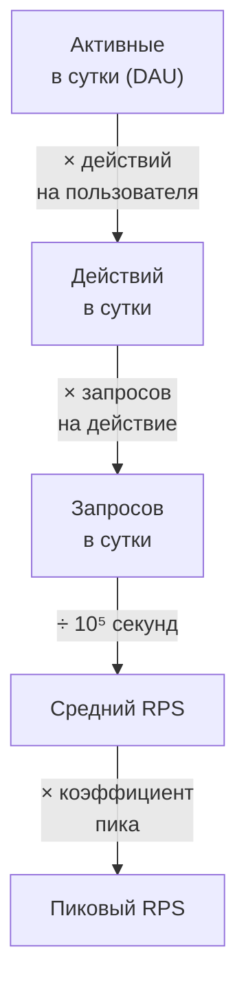

# 7.2 Оценки на салфетке: нагрузка, объёмы, пропускная способность

## Зачем это аналитику

Оценки определяют архитектуру: 100 запросов в секунду и 100 тысяч — это разные системы. Быстрая прикидка RPS, объёма хранения и трафика показывает интервьюеру, что вы проектируете под реальный масштаб, а не «на всякий случай». Для аналитика это ещё и ежедневный инструмент при постановке нефункциональных требований.

## Что понять

- [ ] От пользователей к нагрузке: DAU → действия на пользователя → запросы в сутки → средний RPS → пиковый RPS (коэффициент пика).
- [ ] Соотношение чтения и записи и почему оно определяет архитектуру.
- [ ] Объём хранения: размер записи × количество × срок хранения × репликация; рост за год.
- [ ] Пропускная способность сети и дисков, трафик на выдачу медиа.
- [ ] Числа, которые полезно помнить: порядки задержек (память, SSD, сеть в дата-центре, между континентами), секунд в сутках ≈ 10⁵.
- [ ] Сколько выдерживает один сервер или одна база в типичной конфигурации, и откуда берётся «нужно шардировать».
- [ ] Округление и порядки: точность ±2 раза достаточна, важна логика.

## Урок

<!-- LESSON:START -->
### Зачем считать на салфетке

Оценка на салфетке (back-of-the-envelope estimation) — прикидка масштаба за две-три минуты с точностью до порядка. Её цель не число, а решение: хватит ли одной базы, нужен ли кэш, обязателен ли CDN, укладывается ли пакетный расчёт в ночное окно. Если оценка не меняет ни одного решения, она не нужна.

У оценки три опоры: цепочка преобразований от бизнес-метрик к техническим, небольшой набор чисел, которые стоит помнить, и дисциплина округления. Ниже — каждая из них и два полностью посчитанных примера.

### От пользователей к пиковой нагрузке

Нагрузку почти никогда не дают в запросах в секунду. Дают пользователей, клиентов, магазины, операции. Путь от них к RPS стандартный.



Несколько замечаний к каждому звену.

**Действие и запрос — не одно и то же.** Открытие карточки товара в интернет-магазине может породить запрос карточки, запрос остатков, запрос рекомендаций и шесть запросов картинок. Для оценки нагрузки на конкретный компонент считайте запросы именно к нему.

**Секунд в сутках 86 400, для прикидки — 10⁵.** Ошибка около 15%, зато деление превращается в сдвиг порядка. Полезное следствие: миллион событий в сутки — это примерно 10 в секунду в среднем.

**Средний RPS почти бесполезен сам по себе.** Система должна выдерживать пик. Коэффициент пика складывается из двух частей: суточная неравномерность (трафик сосредоточен в дневные или вечерние часы) и событийные пики (распродажа, день выплаты зарплаты, конец квартала, старт аукциона). Для суточной неравномерности типичен множитель 2–3. Событийные пики дают ещё 5–10 и больше, и их лучше спросить, чем угадать. Если система обслуживает один часовой пояс, пик выше, чем у глобальной.

**Пакетные нагрузки считаются иначе.** Для ночного расчёта важен не RPS, а объём работы, делённый на длину окна. Если 30 миллионов расчётов должны уложиться в 4 часа, нужна пропускная способность около 2 000 расчётов в секунду, независимо от числа пользователей.

### Чтение и запись

Соотношение чтения и записи (read/write ratio) — самый информативный результат оценки. Оно определяет, куда тратить архитектурные усилия.

- **Чтение доминирует (100:1 и больше)** — каталоги, ленты, карточки, справочники. Масштабируется репликами для чтения, кэшами, CDN, денормализованными проекциями. Запись может оставаться на одном узле очень долго.
- **Запись доминирует или сравнима** — телеметрия, журналы событий, платёжные операции, трекинг. Реплики не помогают: каждая реплика повторяет всю запись. Нужны партиционирование, пакетная запись, хранилища с журнальной структурой (LSM), очереди как буфер.
- **Смешанная нагрузка с разной природой** — частый признак того, что стоит разделить модели чтения и записи (CQRS) или хотя бы вынести отчёты из основной базы.

Важно считать соотношение в единицах работы, а не в запросах. Один запрос выписки за месяц может прочитать тысячу строк, а одна запись — вставить одну. По числу запросов система «сбалансирована», по нагрузке на диск — читающая.

### Объём хранения

Формула простая:

```
объём = размер записи × записей в сутки × дней хранения × коэффициент репликации
```

Её нужно уточнить в трёх местах.

**Размер записи — с накладными расходами.** Полезных данных в строке может быть 200 байт, но заголовки строк, индексы и неполное заполнение страниц легко удваивают или утраивают объём. Для реляционной базы с несколькими индексами разумно умножать «сырой» размер на 2–3.

**Рост.** Если нагрузка растёт на 30% в год, объём за пять лет — не пять годовых объёмов текущего года, а сумма геометрической прогрессии. При 30% годовой рост пятого года уже почти в три раза больше первого.

**Копии.** Реплики базы, резервные копии, хранилище для аналитики, журналы — у одних и тех же данных бывает пять-шесть физических копий. Для решения «помещается ли в один узел» важна одна копия, для бюджета — все.

### Сеть и диски

Сетевой трафик считается как размер ответа, умноженный на RPS. Для большинства API он мал: 2 000 RPS по 5 КБ — это 10 МБ/с, около 80 Мбит/с. Трафик становится определяющим при выдаче медиа: картинок, видео, файлов выгрузки. Там счёт идёт на гигабиты в секунду, и решение почти всегда одно — CDN и объектное хранилище, а не отдача с серверов приложения.

Пересчёт единиц: 1 Гбит/с — это 125 МБ/с. Сетевая карта на 10 Гбит/с отдаёт примерно 1,2 ГБ/с в идеальных условиях; на практике разумно закладывать 60–70% от номинала.

Для дисков важны две величины: число операций ввода-вывода в секунду (IOPS) для случайного доступа и пропускная способность для последовательного. Случайные чтения мелких записей упираются в IOPS, пакетные выгрузки и сканирование — в пропускную способность.

### Числа, которые полезно помнить

Таблица ниже — **порядки величин**, а не точные значения. Конкретные числа зависят от поколения оборудования, облачного провайдера, размера блока и нагрузки, и со временем меняются. Для рассуждения важно соотношение между строками, а не третья значащая цифра.

| Операция | Порядок задержки |
|---|---|
| Обращение к кэшу процессора L1 | около 1 нс |
| Обращение к оперативной памяти | около 100 нс |
| Последовательное чтение 1 МБ из памяти | единицы–десятки мкс |
| Случайное чтение 4 КБ с NVMe SSD | десятки–сотни мкс |
| Последовательное чтение 1 МБ с SSD | 0,1–1 мс |
| Круговой путь по сети внутри дата-центра | 0,1–0,5 мс |
| Круговой путь между зонами доступности одного региона | 0,5–2 мс |
| Позиционирование головки HDD | 5–10 мс |
| Круговой путь между континентами | порядка 100 мс |

Как это читать:

- Память примерно в тысячу раз быстрее случайного чтения с SSD. Поэтому рабочий набор данных (working set), помещающийся в память, меняет характеристики базы радикально.
- Поход в соседний сервис внутри дата-центра сопоставим с чтением с SSD. Десять последовательных вызовов микросервисов — уже несколько миллисекунд только на сеть.
- Межконтинентальный запрос в сотни раз дороже внутреннего. Синхронная репликация между континентами добавляет эту задержку к каждой записи; отсюда асинхронная репликация и локальные для региона записи в глобальных системах.
- HDD медленнее SSD на два порядка на случайном доступе, но всё ещё хорош для последовательных архивов.

Другие полезные числа:

| Величина | Значение для прикидки |
|---|---|
| Секунд в сутках | 86 400, округлённо 10⁵ |
| Секунд в году | около 3 × 10⁷ |
| 1 млн событий в сутки | около 10–12 в секунду |
| 1 Гбит/с | 125 МБ/с |
| 2¹⁰, 2²⁰, 2³⁰, 2⁴⁰ | тысяча, миллион, миллиард, триллион (КБ, МБ, ГБ, ТБ) |

### Сколько выдерживает один узел

Здесь точных чисел быть не может: всё зависит от того, что делает запрос. Но порядки полезны, чтобы отличить «легко» от «нужно думать». Ориентиры ниже — для типичного современного сервера или облачной машины среднего размера, на момент написания.

| Компонент | Грубый ориентир |
|---|---|
| Сервис приложения без состояния | сотни–тысячи RPS на экземпляр, масштабируется горизонтально |
| PostgreSQL, чтение по первичному ключу, данные в памяти | десятки–сотни тысяч запросов в секунду |
| PostgreSQL, пишущие транзакции | тысячи–десятки тысяч в секунду, сильно зависит от индексов и фиксации на диск |
| Redis, простые операции | порядка сотни тысяч в секунду на экземпляр |
| Брокер сообщений на узел | сотни МБ/с |
| NVMe SSD | сотни тысяч IOPS, единицы ГБ/с последовательно |
| HDD | 100–200 IOPS, 100–250 МБ/с последовательно |

Отсюда рождается фраза «нужно шардировать». Одного экземпляра базы перестаёт хватать по одной из причин, и полезно называть конкретную:

1. **Запись.** У классической реляционной базы один основной узел (primary) принимает все записи. Реплики масштабируют чтение, но не запись. Когда пиковая запись приближается к пределу узла с запасом меньше двух-трёх раз, пора думать о партиционировании.
2. **Рабочий набор не помещается в память.** База продолжает работать, но задержки чтения переходят из режима «память» в режим «диск». Это видно по падению доли попаданий в буферный кэш.
3. **Объём и эксплуатация.** Десятки терабайт в одной базе — это многочасовое восстановление из резервной копии, долгие операции обслуживания, миграции схемы с блокировками. Ограничение приходит от времени восстановления (RTO), а не от диска.
4. **Чтение, которое не лечится репликами.** Если реплики отстают или запрос должен видеть свежие данные, чтение возвращается на основной узел.

Прежде чем шардировать, стоит перебрать более дешёвые шаги: индексы и переписывание запросов, кэш, реплики для чтения, партиционирование таблиц внутри одной базы, вынос отчётов в отдельное хранилище, архивирование холодных данных. Шардирование — дорогое решение: межшардовые запросы, транзакции и перебалансировка становятся вашей проблемой.

### Пример 1. Сервис выписок для банка юрлиц

Условия, которые кандидат получил или зафиксировал как допущения:

- 400 тысяч компаний активны в интернет-банке в течение суток, каждая открывает выписку в среднем 5 раз.
- 200 тысяч компаний подключили учётные системы, которые забирают выписку по API каждые 15 минут круглосуточно.
- В сутки проводится около 12 миллионов операций по счетам.
- Операция с индексами занимает около 1 КБ.
- Срок хранения — 5 лет, рост числа операций — 20% в год, основная база плюс две реплики.

**Чтение.** Пользователи: 400 000 × 5 = 2 млн запросов в сутки. Учётные системы: 24 × 4 = 96 опросов в сутки, 200 000 × 96 ≈ 19,2 млн. Всего около 21 млн запросов в сутки. Средний RPS: 21 × 10⁶ / 10⁵ ≈ 210. Точное деление на 86 400 даёт около 245 — в пределах погрешности. Опрос учётных систем распределён равномерно, пользовательские запросы сосредоточены в рабочие часы; берём общий коэффициент пика 3 — около 700 RPS.

**Запись.** 12 млн операций в сутки — около 120 в секунду в среднем. Запись у юрлиц очень неравномерна: дни выплаты зарплаты и конец месяца дают пики. Берём коэффициент 5 — около 600 операций в секунду в пике.

**Вывод по нагрузке.** 700 чтений и 600 записей в секунду — посильно для одной хорошо настроенной реляционной базы. Но каждый запрос выписки — это сканирование диапазона. Если в выписке в среднем 50 строк, база читает около миллиарда строк в сутки, и 90% из них — опросы учётных систем, которые в большинстве случаев ничего нового не получают. Главное архитектурное решение здесь не шардирование, а изменение API: инкрементальная выгрузка по курсору («операции после отметки X») или уведомления об изменениях. Это на порядок снижает нагрузку на чтение.

**Хранение.** Первый год: 12 млн × 1 КБ = 12 ГБ в сутки, 12 × 365 ≈ 4,4 ТБ в год. С ростом 20% годовые объёмы — 4,4; 5,3; 6,3; 7,6; 9,1 ТБ, сумма около 33 ТБ за пять лет. С двумя репликами — около 100 ТБ, не считая резервных копий.

**Вывод по хранению.** 33 ТБ в одной базе — проблема эксплуатации. Восстановление такого объёма даже на 1 ГБ/с занимает около 9 часов. Решение — партиционирование таблицы операций по периоду, перенос закрытых периодов в более дешёвое хранилище с доступом только на чтение и отдельный путь для запросов старых выписок. Горячий объём при этом — последние месяцы, то есть единицы терабайт.

Обратите внимание: ни одно число здесь не точное, но выводы устойчивы к ошибке в два раза в любую сторону.

### Пример 2. Карточка товара и медиа в интернет-магазине

Условия:

- 5 млн активных пользователей в сутки, каждый открывает в среднем 20 карточек товаров.
- На карточке загружается 6 изображений среднего размера, в среднем по 120 КБ.
- В каталоге 1 млн товаров, по 8 фотографий на товар, каждая хранится в 4 размерах: оригинал около 2 МБ, крупный 300 КБ, средний 120 КБ, миниатюра 20 КБ.
- Вечерний пик — ×3 к среднему, распродажа — ещё ×3.

**Запросы карточек.** 5 млн × 20 = 100 млн в сутки, средний RPS около 1 000, вечерний пик около 3 000, на распродаже до 10 000.

**Трафик изображений.** На карточку 6 × 120 КБ ≈ 0,7 МБ. В сутки 100 млн × 0,7 МБ = 70 ТБ. Средняя скорость: 70 × 10¹² / 10⁵ = 7 × 10⁸ байт/с, то есть около 0,7 ГБ/с или 5–6 Гбит/с. Вечерний пик — около 17 Гбит/с, на распродаже — около 50 Гбит/с. Запросов изображений — в 6 раз больше, чем карточек: до 60 000 в секунду на распродаже.

**Вывод по трафику.** Отдавать это с собственных серверов приложения бессмысленно: понадобились бы десятки машин только под раздачу картинок. Изображения — в объектное хранилище, раздача — через CDN. Если CDN обслуживает 95% запросов из своего кэша, до источника доходит 5%: около 2–3 Гбит/с на распродаже, что уже посильно.

**Хранение изображений.** На одну фотографию во всех размерах: 2 + 0,3 + 0,12 + 0,02 ≈ 2,44 МБ. Фотографий 1 млн × 8 = 8 млн, объём 8 × 10⁶ × 2,44 МБ ≈ 20 ТБ. Для объектного хранилища это обычный объём, репликацию оно обеспечивает само. Стоит отметить, что 80% объёма — оригиналы, которые почти не читаются: их можно держать в более холодном классе хранения.

**Данные карточки.** До 10 000 запросов карточек в секунду на распродаже. Если кэш карточек даёт 90% попаданий, до базы доходит около 1 000 запросов в секунду — посильно для одного основного узла с репликами. Без кэша нагрузка в 10 раз выше, и именно пик распродажи определяет, нужен ли кэш. Остатки на карточке — отдельная история: они меняются часто и требуют отдельной стратегии свежести (об этом в модуле 7.3).

### Округление и порядки

Точность ±2 раза достаточна. Интервьюер не проверяет арифметику, он смотрит на логику цепочки и на вывод. Несколько правил:

- Округляйте до одной значащей цифры и работайте степенями десяти: 86 400 — это 10⁵, 365 — это 400 или 3 × 10², если так удобнее.
- Проговаривайте допущения прямо в формуле: «20 карточек на пользователя — допущение, если их 50, вывод не меняется».
- Проверяйте результат здравым смыслом: сравните с известными масштабами. Если получилось, что небольшой сервис генерирует петабайт в сутки, где-то лишние три нуля.
- Держите единицы: путаница бит и байт даёт ошибку в 8 раз, путаница КБ и МБ — в тысячу.
- Заканчивайте каждый блок выводом: «значит, одна база справится», «значит, нужен CDN».

### Типичные ошибки

- Проектировать под средний RPS без коэффициента пика или брать один и тот же коэффициент для систем с разной природой пиков.
- Считать соотношение чтения и записи в запросах, а не в работе: один отчётный запрос может стоить тысячи вставок.
- Забывать накладные расходы хранения: индексы, реплики, резервные копии, рост нагрузки.
- Путать биты и байты в сетевых расчётах.
- Тратить на арифметику пять минут и не делать вывода, который влияет на архитектуру.
- Говорить «нужно шардировать» без указания, какой ресурс исчерпан, и без перебора более дешёвых мер.
- Выдавать ориентиры производительности за точные цифры без оговорки о зависимости от оборудования и запросов.

### Как говорить об этом на собеседовании

Проговаривайте цепочку одной фразой и сразу вывод: «Пять миллионов в сутки по двадцать карточек — сто миллионов, это тысяча в секунду в среднем и до десяти тысяч на распродаже. Для базы это много без кэша, значит, кэш карточек обязателен, а изображения уходят в CDN». Такой формат показывает, что оценка служит решению.

Уровень senior проявляется в том, что вы замечаете неочевидное: опрос учётных систем, который съедает 90% чтения; оригиналы изображений, которые занимают 80% объёма и почти не читаются; время восстановления базы, которое ограничивает её размер раньше диска. Хорошо звучат примеры из опыта: «В системе автопополнения ограничением было не число пользователей, а ночное окно расчёта прогнозов, и от него считались все ресурсы».

### Коротко

- Оценка нужна ради решения: одна база или несколько, нужен ли кэш, CDN, партиционирование.
- Цепочка: DAU → действия → запросы → средний RPS (÷10⁵) → пик (×2–3 суточный, ×5–10 событийный).
- Соотношение чтения и записи считается в единицах работы и определяет, куда тратить усилия.
- Хранение: размер с накладными × количество × срок × копии, с учётом роста.
- Порядки задержек: память ~100 нс, SSD ~100 мкс, сеть в ДЦ ~0,5 мс, между континентами ~100 мс.
- Одного узла базы перестаёт хватать из-за записи, рабочего набора, объёма и времени восстановления; шардирование — после более дешёвых мер.
- Точность ±2 раза достаточна; логика, единицы и вывод важнее арифметики.
<!-- LESSON:END -->

## Читать дальше

- Jeff Dean, «Latency Numbers Every Programmer Should Know» (много обновлённых версий).
- Alex Xu, System Design Interview vol. 1 — глава об оценках.

На system-design.space:

- [Примерные оценки (Back-of-Envelope Estimation)](https://system-design.space/chapter/back-of-envelope-estimation/)
- [Задержка (latency): физика, перцентили и бюджеты](https://system-design.space/chapter/latency-budgets/)
- [Принципы проектирования масштабируемых систем](https://system-design.space/chapter/scalable-systems/)

## Практика

1. Оценить для сервиса сообщений на 50 млн DAU: RPS записи и чтения, пиковую нагрузку, объём хранения за 5 лет, трафик.
2. Оценить нагрузку для обезличенной системы автопополнения сети из 1500 магазинов по 20 тысяч товаров: сколько прогнозов в сутки, объём истории продаж, время пакетного расчёта.
3. Составить свою шпаргалку чисел на одну страницу и выучить её.

## Вопросы для самопроверки

1. Как из количества пользователей получить пиковый RPS?
2. Почему соотношение чтения и записи важно для архитектуры?
3. Сколько примерно стоит по времени чтение из памяти, с SSD, запрос внутри дата-центра и между континентами?
4. Как оценить объём хранения на пять лет?
5. Когда одного экземпляра базы данных перестаёт хватать?

## Заметки

<!-- Свои формулировки, ошибки, ссылки. -->
