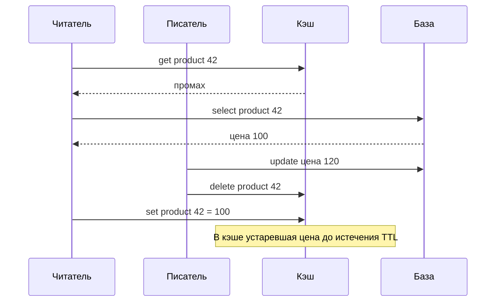

# 7.3 Кэширование

## Зачем это аналитику

Кэш — первый ответ на «как ускорить чтение» и один из главных источников ошибок: устаревшие данные, лавина промахов, горячие ключи. На интервью почти всегда спрашивают, как вы инвалидируете кэш и что будет при его отказе.

## Что понять

- [ ] Уровни кэширования: клиент, CDN, обратный прокси, приложение, распределённый кэш, база данных.
- [ ] Стратегии: cache-aside, read-through, write-through, write-behind, write-around — когда какая.
- [ ] Инвалидация: TTL, явное удаление при записи, версии ключей, события об изменениях; проблема гонки между записью и заполнением кэша.
- [ ] Вытеснение: LRU, LFU, TTL; размер кэша и hit ratio.
- [ ] Лавина промахов (cache stampede, thundering herd) и защита: блокировка на заполнение, вероятностное досрочное обновление, разнесение TTL.
- [ ] Горячие ключи: репликация ключа, локальный кэш второго уровня.
- [ ] Redis: структуры данных, персистентность, репликация и кластер; когда Redis — не кэш, а хранилище.
- [ ] Что будет при падении кэша: холодный старт и защита базы.

## Урок

<!-- LESSON:START -->
### Что покупает кэш и чем за него платят

Кэш — копия данных ближе к потребителю, чем источник истины. Он покупает три вещи: меньшую задержку, разгрузку источника и иногда устойчивость к его кратковременной недоступности. Платят за это всегда одним и тем же: копия может расходиться с оригиналом. Любое решение о кэшировании — это ответ на вопрос «насколько устаревшими могут быть эти данные и что случится, если пользователь их увидит».

Второй скрытый платёж — зависимость. Когда кэш держит 95% чтений, база рассчитана на 5%. Кэш перестаёт быть оптимизацией и становится несущей конструкцией, а его отказ — аварией.

### Уровни кэширования

Данные могут кэшироваться на каждом участке пути запроса. Чем ближе к клиенту, тем дешевле попадание и тем труднее управлять свежестью.

| Уровень | Что кэширует | Как управляется свежесть | Типичное применение |
|---|---|---|---|
| Клиент (браузер, приложение) | Ответы HTTP, статические ресурсы, локальные данные | Заголовки Cache-Control, ETag, версия в имени файла | Статика, справочники, профиль |
| CDN | Статические и публичные ответы | TTL, принудительная очистка (purge), версионирование URL | Изображения, скрипты, публичные страницы каталога |
| Обратный прокси | Ответы целиком перед приложением | TTL, правила по заголовкам | Публичные страницы, ответы API без персонализации |
| Приложение (локальный кэш в памяти) | Объекты, результаты вычислений | Короткий TTL, события | Конфигурация, справочники, горячие ключи |
| Распределённый кэш | Объекты, фрагменты, сессии | TTL, явное удаление, события | Карточки, результаты запросов, счётчики |
| База данных | Страницы данных, планы запросов | Автоматически, прозрачно | Буферный кэш, материализованные представления |

Персонализированные ответы нельзя отдавать через общий кэш CDN или прокси без ключа, учитывающего пользователя. Иначе один пользователь увидит данные другого — это не устаревание, а утечка.

### Стратегии чтения и записи

Стратегия определяет, кто и когда кладёт данные в кэш и как запись доходит до источника.

| Стратегия | Чтение | Запись | Когда подходит | Риск |
|---|---|---|---|---|
| Cache-aside (ленивая загрузка) | Приложение читает кэш, при промахе — базу, кладёт в кэш | В базу, ключ в кэше удаляется | Универсальный вариант по умолчанию | Гонки заполнения, холодный старт |
| Read-through | Кэш сам загружает из источника при промахе | Отдельно | Когда кэш-слой умеет ходить в источник | Та же логика, но спрятана в библиотеке |
| Write-through | Из кэша | Синхронно в кэш и в базу | Данные читают сразу после записи | Задержка записи, кэш забит тем, что не читают |
| Write-behind (write-back) | Из кэша | В кэш, в базу — позже, пакетами | Интенсивная запись, допустима потеря последних изменений | Потеря данных при отказе кэша, сложный порядок |
| Write-around | Cache-aside при чтении | Только в базу, кэш не трогается | Записанное читают редко | Первое чтение после записи — промах |

Разница между cache-aside и write-through — в том, кто отвечает за согласованность и когда. В cache-aside приложение при записи только удаляет ключ, а новое значение появится в кэше при следующем чтении. В write-through запись идёт через кэш, и после неё в кэше уже свежее значение. Write-through выгоден, когда запись почти всегда сопровождается чтением. Cache-aside проще, устойчивее к отказу кэша (база остаётся единственным местом записи) и поэтому чаще встречается.

Write-behind — единственная стратегия, где кэш временно становится источником истины. Её выбирают осознанно: для счётчиков просмотров или агрегатов телеметрии, где потеря нескольких секунд допустима. Для денег и остатков — нет.

### Инвалидация и гонки

Способов поддерживать свежесть четыре, и их обычно комбинируют.

- **TTL.** Каждый ключ живёт ограниченное время. Даёт верхнюю границу устаревания и страхует от ошибок в остальных механизмах. Единственный механизм, который работает даже при потере событий.
- **Явное удаление при записи.** Код записи удаляет затронутые ключи. Быстро, но требует знать все ключи, в которые попали данные. С производными ключами (списки, агрегаты, страницы поиска) это быстро выходит из-под контроля.
- **Версии ключей.** В ключ включается версия: `product:42:v17`. При изменении версия растёт, старые ключи умирают по TTL. Хорошо работает для целых групп: сменили версию каталога — весь кэш каталога стал недействителен без перебора ключей.
- **События об изменениях.** Источник публикует изменения (через журнал транзакций базы или исходящие события), отдельный потребитель инвалидирует кэш. Отвязывает запись от знания о кэше, но добавляет задержку и требует надёжной доставки.

Главная гонка cache-aside возникает между медленным читателем и писателем.



Читатель получил старое значение до записи, а положил его после удаления ключа. Удаление прошло впустую. Окно небольшое, но при высокой нагрузке такие случаи происходят регулярно.

Способы защиты:

- **Короткий TTL** ограничивает ущерб. Это минимум, который нужен всегда.
- **Отложенное повторное удаление.** Писатель удаляет ключ сразу после записи и ещё раз через интервал, заведомо больший типичного времени чтения из базы. Дёшево, но вероятностно.
- **Условная запись в кэш по версии.** Значение хранится вместе с версией строки (номером изменения или временем обновления из базы). Запись в кэш проходит только если версия новее той, что уже лежит. Проверку и запись нужно делать атомарно, например скриптом на стороне кэша.
- **Аренда (lease).** Подход описан в статье о масштабировании Memcache: при промахе кэш выдаёт читателю токен, а удаление ключа токен аннулирует. Попытка положить значение с аннулированным токеном отклоняется. Тот же механизм ограничивает число читателей, идущих в базу за одним ключом.

Вторая гонка — два писателя, обновляющие кэш значениями, а не удаляющие ключ. Порядок записей в базу и в кэш может не совпасть, и в кэше останется предпоследнее значение без всякого TTL-спасения, если TTL длинный. Поэтому при записи предпочтительнее удалять ключ, а не перезаписывать его.

### Вытеснение и размер

Кэш ограничен по памяти, поэтому нужна политика вытеснения (eviction).

- **LRU** (least recently used) — вытеснять то, к чему дольше всего не обращались. Хорошо для нагрузки, где недавнее предсказывает будущее. Плохо переносит однократное сканирование: массовый проход по редким ключам вымывает горячие.
- **LFU** (least frequently used) — вытеснять то, к чему обращаются реже. Устойчивее к сканированию, лучше держит стабильно популярное. Хорошие реализации учитывают старение счётчиков, иначе бывший хит держится вечно.
- **TTL как политика** — в первую очередь вытеснять ключи, у которых скоро истекает срок.

Эффективность кэша измеряют долей попаданий (hit ratio). Связь размера и доли попаданий нелинейна: у большинства реальных нагрузок распределение популярности сильно перекошено, и небольшая доля ключей даёт большую часть обращений. Поэтому первые проценты объёма дают основную долю попаданий, а дальше каждый следующий гигабайт приносит всё меньше.

Считать стоит не только долю попаданий, но и нагрузку на источник: при 10 000 запросов в секунду разница между 95% и 99% попаданий — это 500 против 100 запросов в базу, то есть пятикратная разница. Небольшое падение доли попаданий может перегрузить базу.

### Лавина промахов

Лавина промахов (cache stampede, thundering herd) — ситуация, когда много запросов одновременно не находят ключ в кэше и одновременно идут в источник за одним и тем же. Типичные причины: истёк TTL популярного ключа, массово истекли ключи, загруженные одновременно (например, прогрев после релиза с одинаковым TTL), кэш перезапущен. Если пересчёт значения дорогой, база получает сотни одинаковых тяжёлых запросов, замедляется, пересчёт идёт ещё дольше, и промахов становится больше. Это положительная обратная связь.

Механизмов защиты несколько, и они дополняют друг друга.

#### Блокировка на заполнение

Только один запрос пересчитывает значение, остальные ждут или получают устаревшее значение. В распределённом кэше блокировку берут атомарной командой «записать, если нет» с временем жизни, чтобы упавший владелец не заблокировал ключ навсегда.

```
function get_with_lock(key):
    value = cache.get(key)
    if value != null:
        return value

    token = random_token()
    # SET lock:<key> <token> NX PX 5000 в терминах Redis
    if cache.set_if_absent("lock:" + key, token, ttl_ms = 5000):
        try:
            value = db.load(key)
            cache.set(key, value, ttl = base_ttl)
            return value
        finally:
            # удалить блокировку, только если она всё ещё наша
            cache.compare_and_delete("lock:" + key, token)

    # блокировка занята: подождать и перечитать кэш
    for attempt in 1..10:
        sleep(50 ms)
        value = cache.get(key)
        if value != null:
            return value
    return fallback(key)   # устаревшее значение, заглушка или ошибка
```

Детали, которые важны. Токен нужен, чтобы не снять чужую блокировку, если своя успела истечь; сравнение и удаление должны быть атомарными (в Redis — скриптом на Lua). Время жизни блокировки должно быть больше типичного времени пересчёта. Ожидающие не должны ждать бесконечно: у них есть предел и запасной вариант.

Внутри одного процесса того же эффекта добиваются объединением запросов (request coalescing, single-flight): параллельные вызовы за одним ключом ждут один общий результат. Это дёшево и снижает нагрузку вплоть до числа параллельных запросов за этим ключом на экземпляре, но не защищает от одновременных промахов на сотне экземпляров.

#### Мягкий TTL и отдача устаревшего

Значение хранится с двумя сроками: логическим (после которого значение считается устаревшим) и физическим, заметно более длинным. Запрос, увидевший устаревшее значение, отдаёт его сразу и запускает фоновое обновление под блокировкой. Пользователь не ждёт, источник получает один запрос.

```
function get_stale_while_revalidate(key):
    entry = cache.get(key)          # value, soft_expiry; физический TTL длиннее
    if entry == null:
        return get_with_lock(key)   # настоящий промах

    if now() > entry.soft_expiry:
        if cache.set_if_absent("refresh:" + key, 1, ttl_ms = 10000):
            async:
                value = db.load(key)
                cache.set(key, (value, now() + soft_ttl), ttl = hard_ttl)
                cache.delete("refresh:" + key)
    return entry.value
```

Это самый практичный механизм для данных, где допустимо устаревание на секунды или минуты: карточки, справочники, агрегаты.

#### Вероятностное досрочное обновление

Каждый запрос с небольшой вероятностью решает обновить значение до истечения TTL. Вероятность растёт по мере приближения к сроку и тем выше, чем дольше пересчёт. Широко цитируемый вариант предложен в работе Ваттани и соавторов об оптимальной вероятностной защите от лавины:

```
function get_xfetch(key, beta = 1.0):
    entry = cache.get(key)          # value, delta, expiry
    # delta — сколько длился последний пересчёт
    # random() в интервале (0, 1], ln(random()) <= 0
    if entry == null or now() - entry.delta * beta * ln(random()) >= entry.expiry:
        start = now()
        value = db.load(key)
        delta = now() - start
        cache.set(key, (value, delta, now() + ttl), ttl = ttl)
        return value
    return entry.value
```

Плюс — не нужна блокировка и координация. Минус — защита вероятностная: на очень горячем ключе несколько запросов могут одновременно решить обновить значение. Параметр beta больше единицы делает обновление более ранним.

#### Разнесение TTL

Если тысячи ключей загружены одновременно с одинаковым TTL, они одновременно и истекут. Случайная добавка к TTL размазывает истечения во времени:

```
ttl = base_ttl * (1 + random_between(-0.1, 0.1))
```

Это не защищает отдельный горячий ключ, но устраняет массовую синхронную лавину после прогрева, релиза или перезапуска.

На практике комбинируют: разнесение TTL для всех ключей, мягкий TTL или вероятностное обновление для популярных, блокировку или объединение запросов для настоящих промахов.

### Горячие ключи

Горячий ключ — один ключ, на который приходится непропорциональная доля обращений: карточка товара из рекламы, текущая ставка на популярном аукционе, общий справочник. В распределённом кэше ключ живёт на одном узле, и этот узел упирается в процессор или сеть, пока остальные простаивают.

Способы:

- **Локальный кэш второго уровня.** Каждый экземпляр приложения держит горячие ключи в своей памяти с коротким TTL, от долей секунды до нескольких секунд. Нагрузка на распределённый кэш падает пропорционально числу экземпляров. Цена — рассинхронизация между экземплярами в пределах этого TTL.
- **Репликация ключа.** Значение записывается под несколькими именами (`key:1` … `key:N`), которые попадают на разные узлы. Читатель выбирает копию случайно, писатель обновляет или удаляет все. Работает для чтения, усложняет инвалидацию.
- **Реплики узлов кэша для чтения.** Если кэш поддерживает чтение с реплик, горячий шард можно разгрузить ими, принимая асинхронное отставание.
- **Изменение модели.** Иногда ключ горячий, потому что в нём слишком много всего: вместо одного объекта «аукцион с историей ставок» — отдельно неизменяемое описание с длинным TTL и маленькая текущая ставка.

Горячие ключи нужно уметь обнаруживать: мониторинг нагрузки по узлам кэша и выборочный подсчёт частоты ключей на стороне клиента.

### Redis: кэш или хранилище

Redis — хранилище в памяти со структурами данных: строки, хеши, списки, множества, упорядоченные множества, потоки (streams), битовые карты, HyperLogLog для приблизительного подсчёта уникальных. Команды над одним экземпляром выполняются последовательно, поэтому отдельные операции атомарны, а составные делаются скриптами на Lua или транзакциями.

**Персистентность.** Два механизма: периодические снимки (RDB) и журнал команд (AOF) с настраиваемой частотой сброса на диск. Их можно сочетать. Снимок компактен и быстро загружается, но теряет изменения после последнего снимка. Журнал теряет меньше, в зависимости от политики сброса.

**Репликация и отказоустойчивость.** Репликация асинхронная: основной узел подтверждает запись до того, как её получили реплики. При переключении на реплику (через Sentinel или встроенный механизм кластера) последние подтверждённые записи могут пропасть. Команда WAIT позволяет дождаться подтверждения от реплик, но не превращает Redis в строго согласованную систему.

**Кластер.** Пространство ключей делится на 16 384 слота, слоты распределены по узлам. Операции над несколькими ключами допустимы, только если ключи попадают в один слот; для этого используют хеш-теги — общую часть имени ключа, по которой считается слот.

**Вытеснение.** Настраивается политикой при достижении лимита памяти: не вытеснять и возвращать ошибку на запись, вытеснять по приближённому LRU или LFU (или случайно) среди всех ключей или только среди ключей с TTL, вытеснять ключи с ближайшим истечением.

Redis перестаёт быть кэшем, когда в нём лежат данные, которых нет больше нигде: сессии, счётчики ограничителя частоты, очереди, таблицы лидеров, корзины. Тогда меняются требования: политика вытеснения должна запрещать вытеснение, персистентность должна быть включена и соответствовать допустимой потере, нужно резервное копирование и понятный план на случай потери узла. Типичная ошибка — использовать кэш-кластер с политикой LRU для сессий и узнать об этом, когда пользователей начнёт выбрасывать из системы при нехватке памяти.

### Когда кэш падает

Сценарий отказа нужно продумать заранее, потому что база обычно не выдерживает полной нагрузки без кэша. Если кэш держал 95% чтений, после его падения нагрузка на базу вырастает в двадцать раз.

Меры защиты:

- **Ограничение нагрузки на базу.** Пул соединений с жёстким пределом, ограничение частоты запросов в базу на уровне приложения, сброс лишней нагрузки (load shedding) с понятной ошибкой вместо таймаута. Лучше отказать части пользователей, чем уронить базу для всех.
- **Автоматический выключатель (circuit breaker)** на обращения к кэшу: если кэш не отвечает, быстро переходить в деградированный режим, а не ждать таймаут на каждом запросе.
- **Локальный кэш как буфер.** Даже секундный локальный кэш на горячих ключах резко снижает нагрузку на базу во время отказа распределённого.
- **Деградация функций.** Отключить второстепенное: рекомендации, счётчики, персонализацию. Отдавать заглушки или устаревшие данные из резервного источника.
- **Резервный пул.** В статье о Memcache описан отдельный небольшой пул серверов, который принимает на себя ключи отказавших узлов с коротким TTL. Идея переносится: промахи из-за отказа не должны сразу идти в базу.
- **Холодный старт.** После восстановления кэш пуст. Прогрев: заранее загрузить самые популярные ключи, постепенно возвращать трафик, обязательно с разнесением TTL. Запускать прогрев одним пакетом с одинаковым TTL — готовая лавина через час.

Проверять эти меры нужно учениями: отключить кэш на тестовом стенде под нагрузкой и посмотреть, что происходит с базой.

### Что кэшировать нельзя или опасно

- **Данные, на которых принимаются решения с последствиями.** Остаток на счёте перед списанием, остаток товара при финальном резервировании, статус платежа перед повторной отправкой. Для отображения — можно с коротким TTL, для решения — только источник.
- **Права доступа и отзыв доступа.** Кэш прав продлевает жизнь отозванного доступа на TTL. Если кэшировать, то с коротким TTL и явной инвалидацией при изменении прав.
- **Персональные данные под общим ключом** в CDN или прокси — прямая утечка.
- **Секреты и чувствительные данные** в общем кэше без шифрования и контроля доступа.
- **Ошибки и пустые ответы** без осторожности. Кэширование отрицательных результатов (negative caching) защищает базу от запросов несуществующих ключей, но с коротким TTL: иначе только что созданный объект будет «не найден».

### Разобранный пример: регистратор доменов

Страница подбора домена показывает: цены по доменным зонам, доступность введённого имени и, если домен на аукционе, текущую ставку. Три вида данных — три разных решения.

**Цены по зонам.** Меняются редко, по решению регистратора или реестра, читаются на каждой странице. Кэш на всех уровнях: локальный в приложении и распределённый, TTL в часы, явная инвалидация событием при изменении прайса, версия прайса в ключе. Ошибка стоит дорого: показать старую цену и списать новую — жалоба. Поэтому при оформлении заказа цена берётся из источника и сравнивается с показанной.

**Доступность имени.** Проверка у реестра дорогая и медленная, пользователи вводят много похожих имён. Кэш с коротким TTL (десятки секунд или минуты) и отрицательным кэшированием для «занят». Результат из кэша годится только для подсказки: при регистрации проверка идёт в реестр всегда. Кэш здесь снижает нагрузку на внешнюю систему, но не участвует в решении.

**Текущая ставка на аукционе.** Меняется непредсказуемо, от неё зависят действия пользователя, в последние минуты аукциона ключ становится горячим. Распределённый кэш с обновлением при записи ставки, локальный кэш на долю секунды для разгрузки горячего ключа, для активных участников — отправка изменений по подписке вместо опроса. Приём ставки — только через источник с проверкой, что она выше текущей.

Приём анализа одинаков: для каждого поля определить, как часто оно меняется, как часто читается, какова цена показа устаревшего значения и участвует ли оно в решении.

### Типичные ошибки

- Добавлять кэш без ответа на вопрос, насколько устаревшими могут быть данные и что будет, если они устареют.
- При записи обновлять значение в кэше вместо удаления ключа и получать гонки порядка записей.
- Ставить одинаковый TTL на массово загружаемые ключи и получать синхронную лавину.
- Не иметь TTL вообще, полагаясь только на явную инвалидацию: одна потерянная инвалидация — вечное устаревание.
- Рассчитывать базу на нагрузку с кэшем и не иметь плана на его отказ.
- Хранить в кэш-кластере с вытеснением данные, которых больше нигде нет.
- Использовать кэшированное значение для принятия решения: списания, резервирования, проверки прав.

### Как говорить об этом на собеседовании

Начинайте не с Redis, а с требований к свежести: «Цена может устаревать на минуту для отображения, но не при оформлении; остаток — только для отображения, резерв идёт в источник». Затем стратегия по умолчанию — cache-aside с удалением ключа при записи и TTL как страховкой, с оговоркой о гонке и способе её закрыть. Это показывает, что вы знаете, где кэш ломается.

Уровень senior виден по трём темам, которые стоит поднять самому: лавина промахов с конкретными механизмами (мягкий TTL, блокировка, разнесение TTL), горячие ключи и сценарий отказа кэша с защитой базы. Сильная формулировка: «Кэш держит 95% чтений, значит, при его отказе база получит двадцатикратную нагрузку. Поэтому ограничиваю пул соединений, включаю локальный кэш на горячие ключи и отключаю второстепенные функции».

### Коротко

- Кэш покупает скорость и разгрузку ценой расхождения с источником; начинать нужно с допустимого устаревания.
- Уровни: клиент, CDN, прокси, приложение, распределённый кэш, база; чем ближе к клиенту, тем труднее управлять свежестью.
- Cache-aside с удалением ключа при записи и TTL — вариант по умолчанию; write-behind — только там, где допустима потеря.
- Гонка медленного читателя и писателя закрывается коротким TTL, версиями, повторным удалением или арендой.
- Лавина промахов: блокировка на заполнение, мягкий TTL с отдачей устаревшего, вероятностное досрочное обновление, разнесение TTL.
- Горячие ключи: локальный кэш второго уровня, репликация ключа, разделение модели.
- Redis становится хранилищем, когда в нём данные, которых нет больше нигде; тогда меняются требования к вытеснению, персистентности и резервированию.
- Отказ кэша планируется заранее: ограничение нагрузки на базу, выключатель, деградация, постепенный прогрев.
<!-- LESSON:END -->

## Читать дальше

- Документация Redis: раздел о паттернах кэширования.
- Facebook, «Scaling Memcache at Facebook» (NSDI 2013) — классическая статья о проблемах кэша в масштабе.

На system-design.space:

- [Стратегии кэширования](https://system-design.space/chapter/caching-strategies/)
- [Redis: база данных в памяти и архитектура](https://system-design.space/chapter/redis-overview/)
- [Лаба: Cache stampede: горячий ключ и одновременный TTL](https://system-design.space/labs/cache-stampede-hot-key-ttl/)
- [Практика системного дизайна: кэш](https://system-design.space/practice/cache/)

## Практика

1. Для обезличенной карточки товара (цена, остаток, описание) выбрать стратегию кэширования для каждого поля и обосновать срок жизни.
2. Пройти лабу по лавине промахов на system-design.space и записать выводы.
3. Описать сценарий отказа кэша в пиковый час и меры защиты базы.

## Вопросы для самопроверки

1. Чем cache-aside отличается от write-through?
2. Как инвалидировать кэш при изменении данных и какие гонки при этом возможны?
3. Что такое лавина промахов и как её предотвратить?
4. Что делать с горячим ключом?
5. Что произойдёт при падении распределённого кэша и как к этому подготовиться?
6. Какие данные кэшировать нельзя или опасно?

## Заметки

<!-- Свои формулировки, ошибки, ссылки. -->
