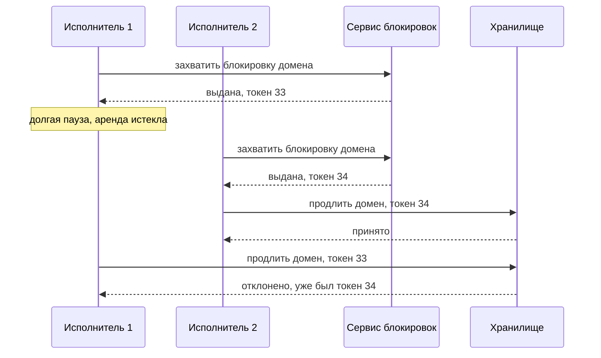

# 7.4 Масштабирование данных: репликация, шардирование, согласованность

## Зачем это аналитику

Когда данные не помещаются в один сервер или один сервер не выдерживает нагрузку, начинаются самые сложные решения: как делить данные, как их реплицировать, какую согласованность обещать. Модуль продолжает блок 2 на уровне распределённых систем.

## Что понять

- [ ] Вертикальное и горизонтальное масштабирование; реплики для чтения и их ограничения.
- [ ] Репликация: лидер-последователь, мульти-лидер, без лидера (кворумы W + R > N).
- [ ] Шардирование: по диапазону, по хешу, по справочнику; выбор ключа шардирования и его последствия.
- [ ] Консистентное хеширование и виртуальные узлы; перебалансировка без полной перетасовки.
- [ ] Горячие шарды и ключи; межшардовые запросы и транзакции — почему их стоит избегать.
- [ ] CAP и PACELC: что на самом деле означают и как применять в разговоре.
- [ ] Модели согласованности: линеаризуемость, последовательная, причинная, согласованность в конечном счёте, read-your-writes.
- [ ] Распределённые блокировки и почему им нельзя доверять без fencing-токенов.

## Урок

<!-- LESSON:START -->
### Два направления роста

Вертикальное масштабирование (scale up) — больше ядер, памяти и быстрее диски у того же сервера. Оно не требует менять приложение и сохраняет все гарантии одной базы: транзакции, внешние ключи, простые соединения таблиц. Ограничения тоже понятны: потолок железа, растущая стоимость каждого следующего шага и одна точка отказа. Для большинства корпоративных систем вертикальный рост плюс хороший индекс закрывают потребности на годы, и на собеседовании полезно сказать это вслух, прежде чем рисовать шарды.

Горизонтальное масштабирование (scale out) — больше машин. Оно даёт почти неограниченный рост и отказоустойчивость, но переносит сложность в приложение: данные надо делить и копировать, а гарантии одной базы исчезают или становятся дорогими.

Первый шаг горизонтального роста обычно — реплики для чтения (read replicas). Лидер принимает запись, реплики получают поток изменений и обслуживают чтение. Это работает, пока чтение сильно преобладает над записью. Ограничения:

- запись по-прежнему упирается в одного лидера;
- при асинхронной репликации реплика отстаёт (replication lag) — от миллисекунд в норме до минут при нагрузке или долгой транзакции;
- пользователь может не увидеть только что сделанное изменение, если следующий запрос ушёл на отставшую реплику;
- два последовательных запроса на разные реплики могут показать данные «вперёд, потом назад во времени».

Отсюда практические приёмы: читать с лидера то, что пользователь только что изменил (например, в течение нескольких секунд после записи или по признаку «своё»), привязывать сессию к одной реплике, передавать в запросе позицию журнала, до которой реплика должна догнаться.

### Три схемы репликации

#### Лидер-последователь

Один узел принимает запись, остальные применяют его журнал. Синхронная репликация гарантирует, что подтверждённая запись есть хотя бы на двух узлах, но замедляет запись и блокирует её при недоступности реплики. Поэтому часто используют полусинхронный вариант: одна реплика синхронная, остальные асинхронные.

Самое опасное место — переключение при отказе лидера (failover). При асинхронной репликации новый лидер может не иметь последних подтверждённых записей: клиент получил «успех», а данных нет. Если старый лидер не понял, что его сместили, возникает раздвоение (split brain): два узла одновременно принимают запись. Защита — надёжное обнаружение отказа, кворумное решение о смене лидера и «ограждение» старого лидера (подробнее — в разделе о блокировках).

#### Мульти-лидер

Запись принимают несколько узлов, обычно по одному на дата-центр, или устройства, работающие офлайн. Выигрыш — локальная запись с низкой задержкой и работа при разрыве связи между площадками. Цена — конфликты: одну строку одновременно изменили в двух местах. Способы разрешения: «последняя запись побеждает» (last write wins, LWW) — просто, но молча теряет данные; слияние по правилам предметной области; структуры данных без конфликтов (CRDT) для счётчиков и множеств; вынос конфликта пользователю. Если конфликт недопустим (деньги, остатки при резерве), такие данные лучше закрепить за одним лидером.

#### Без лидера

Клиент или координатор пишет сразу на несколько реплик и читает с нескольких. Схема идёт от статьи Amazon о Dynamo; её используют Cassandra и похожие системы. Параметры: N — число реплик ключа, W — сколько реплик должны подтвердить запись, R — сколько опросить при чтении.

Если W + R > N, множества узлов записи и чтения пересекаются хотя бы в одном узле, и чтение увидит последнюю подтверждённую версию (при условии, что версии можно сравнить). Типичная настройка — N = 3, W = 2, R = 2. Сдвигая W и R, меняем баланс: W = N, R = 1 — быстрое чтение и хрупкая запись; W = 1, R = N — наоборот. При W + R ≤ N получаем более низкую задержку и доступность, но чтение может вернуть устаревшее значение.

Важно понимать, что кворум — не линеаризуемость. При конкурентных записях, частично неудавшейся записи или «нестрогом кворуме» (sloppy quorum), когда запись временно принимают чужие узлы с последующей передачей (hinted handoff), возможны аномалии. Расхождения реплик чинят чтением с исправлением (read repair) и фоновой сверкой (anti-entropy).

### Шардирование

Шардирование (sharding, партиционирование) делит данные так, что каждая запись живёт в одном шарде, а шарды — на разных узлах. Это единственный способ масштабировать запись. Обычно его сочетают с репликацией: у каждого шарда свой лидер и реплики.

| Стратегия | Как определяется шард | Сильная сторона | Слабая сторона |
|---|---|---|---|
| По диапазону (range) | Ключ попадает в интервал, например по дате или алфавиту | Эффективные запросы по диапазону, упорядоченный обход | Перекос: свежие даты или популярные буквы концентрируют нагрузку |
| По хешу (hash) | hash(ключ) определяет шард | Равномерное распределение | Запрос по диапазону превращается в опрос всех шардов |
| По справочнику (directory) | Отдельная таблица соответствия ключ → шард | Гибкость: можно переселить конкретного клиента | Справочник — ещё один критичный компонент, его нужно кэшировать и реплицировать |

Выбор ключа шардирования — самое дорогое решение в схеме, его почти невозможно поменять без миграции. Критерии:

1. Кардинальность и равномерность: значений много, нагрузка между ними распределена ровно.
2. Локальность главных операций: самые частые запросы и все транзакции, требующие атомарности, должны укладываться в один шард.
3. Устойчивость к росту: крупный клиент через год не должен перегрузить свой шард.

Неудачный ключ проявляется тремя способами: горячий шард при остальных простаивающих, массовые межшардовые запросы для основной бизнес-операции и распределённые транзакции там, где раньше хватало одной локальной.

#### Разобранный пример: платёжные поручения банка для юрлиц

Сервис хранит платёжные поручения и выписки корпоративных клиентов. Основные операции: создать поручение, показать список поручений и выписку по счетам клиента, проверить лимиты клиента.

Ключ «идентификатор поручения» по хешу распределит данные идеально, но список поручений клиента и проверка лимитов станут межшардовыми. Ключ «дата» даёт горячий шард текущего дня. Ключ «идентификатор клиента» держит все поручения, счета и лимиты клиента вместе: проверка лимита и создание поручения — одна локальная транзакция.

Остаются две проблемы. Первая — крупный холдинг с десятками тысяч поручений в день перегружает свой шард. Решение — справочная схема поверх хеша: крупных клиентов вручную селят на выделенные шарды. Вторая — перевод между двумя клиентами банка затрагивает два шарда. Вместо распределённой транзакции его оформляют как две операции: списание у отправителя с событием в исходящий журнал (outbox) и зачисление у получателя по этому событию, с идемпотентной обработкой и компенсацией при отказе (сага). Отчёт казначейства «все платежи банка за день» строят не по боевым шардам, а по хранилищу аналитики.

### Консистентное хеширование

Наивное распределение `shard = hash(key) mod N` ломается при изменении N: при добавлении одного узла у большинства ключей меняется остаток, и переезжает порядка N/(N+1) всех данных. Для кэша это означает массовый промах, для базы — многочасовую миграцию.

Консистентное хеширование (consistent hashing) размещает и узлы, и ключи на одном кольце значений хеша. Ключ принадлежит первому узлу по часовой стрелке. При добавлении узла он забирает только часть ключей у одного соседа — в среднем около 1/N данных; при удалении его ключи уходят соседу. Остальные ключи не двигаются.

У простого кольца две слабости: при малом числе узлов дуги получаются неравными, а новый или выбывший узел нагружает единственного соседа. Виртуальные узлы (virtual nodes) решают обе: каждый физический узел занимает на кольце много точек. Дуги усредняются, при выбытии узла его доля расходится по многим серверам, а мощному серверу можно дать больше виртуальных узлов.

Альтернатива, которую используют многие базы: заранее создать фиксированное число партиций, заметно большее числа узлов, и при расширении переносить партиции целиком. Логика та же — перемещается минимум данных, и ключ никогда не меняет партицию.

### Горячие ключи и межшардовые операции

Даже при идеальном хеше один ключ может получать непропорциональную нагрузку: популярный товар в акции, аккаунт знаменитости, домен на аукционе в последние минуты торгов. Хеширование не поможет — ключ один. Приёмы:

- кэш перед хранилищем для горячих чтений, иногда локальный в памяти экземпляра;
- разделение ключа на подключи с суффиксом (key salting): запись идёт в `item_42#0..9`, чтение собирает десять частей — подходит для счётчиков и агрегатов;
- буферизация и пакетная запись для горячих счётчиков;
- выделенный шард или узел для известных крупных сущностей.

Межшардовый запрос (scatter-gather) опрашивает все шарды и сливает ответы. Его задержка равна задержке самого медленного шарда, а нагрузка растёт с числом шардов: запрос, который раньше стоил один поход в базу, теперь стоит N. Отдельная проблема — вторичные индексы. Локальный индекс в каждом шарде дёшев при записи, но поиск по нему — scatter-gather. Глобальный индекс, разложенный по своему ключу, быстр при чтении, но обновляется асинхронно или требует распределённой записи.

Межшардовая транзакция требует двухфазной фиксации (two-phase commit, 2PC) с координатором, блокировками на время раунда и уязвимостью к отказу координатора, либо саги с компенсациями и промежуточными состояниями, видимыми снаружи. Оба варианта дороже и сложнее локальной транзакции. Поэтому правило проектирования такое: ключ выбирают так, чтобы операции, требующие атомарности, были внутришардовыми, а межшардовые сценарии уводят в асинхронные процессы и аналитические хранилища.

### CAP и PACELC

Теорема CAP (Брюэр, формальное доказательство — Гилберт и Линч) говорит о конкретной ситуации: если между узлами произошёл сетевой разрыв (partition), система не может одновременно быть линеаризуемой (C) и отвечать на каждый запрос каждым работающим узлом (A). Приходится выбрать: либо часть узлов отказывает, чтобы не вернуть устаревшее, либо все отвечают, рискуя расхождением.

Почему её цитируют неправильно:

- «Выберите два из трёх» — ошибка. Разрывы сети случаются независимо от нашего желания, отказаться от P нельзя. Выбор между C и A делается только на время разрыва.
- C в CAP — это линеаризуемость, а не C из ACID (соблюдение инвариантов).
- A в CAP очень строгая: ответить должен любой работающий узел. Система с лидером и автоматическим переключением формально не «A», хотя на практике высокодоступна.
- Теорема ничего не говорит о задержке и о работе без сбоев, а это большая часть жизни системы.

PACELC (Даниэль Абади) дополняет картину: при разрыве (P) выбираем между доступностью и согласованностью (A или C), иначе (E, else) — между задержкой и согласованностью (L или C). Вторая половина полезнее в разговоре: синхронная репликация в другой дата-центр или кворумное чтение стоят миллисекунд на каждом запросе, всегда, а не только в редкий день аварии. Системы в стиле Dynamo с настройками по умолчанию обычно относят к PA/EL, базы с глобально согласованными транзакциями — к PC/EC. Многие продукты позволяют выбирать уровень на уровне запроса, поэтому правильнее классифицировать не продукт, а конкретный сценарий.

Применение в разговоре: не «наша система CP», а «для резервирования остатка при оформлении заказа мы жертвуем доступностью при разрыве и платим задержкой синхронной записи; для каталога и отзывов выбираем низкую задержку и допускаем отставание в секунды».

### Модели согласованности

| Модель | Гарантия | Цена | Где уместна |
|---|---|---|---|
| Линеаризуемость (linearizability) | Система ведёт себя как одна копия: после завершения записи все читают новое значение | Координация на каждой операции, задержка, недоступность при разрыве | Уникальность имени, выбор лидера, резерв последней единицы товара |
| Последовательная (sequential) | Все видят операции в одном порядке, согласованном с порядком каждого клиента, но не обязательно с реальным временем | Общий порядок операций | Реже встречается как явная гарантия продукта |
| Причинная (causal) | Связанные причинно события видны в правильном порядке, независимые — в любом | Отслеживание зависимостей | Комментарий не появляется раньше поста, ответ — раньше вопроса |
| В конечном счёте (eventual) | При отсутствии новых записей реплики сойдутся | Минимальная | Каталог, счётчики, кэши, поисковый индекс |
| Чтение своих записей (read-your-writes) | Пользователь видит собственные изменения | Маршрутизация или ожидание реплики | Профиль, настройки, только что созданный заказ |

Модели от линеаризуемости к eventual упорядочены по убыванию силы. Read-your-writes и монотонное чтение (monotonic reads — не видеть данные старше уже увиденных) — гарантии уровня сессии: их можно добавить поверх eventual без глобальной координации.

Аналитику важно формулировать требование согласованности для каждого сценария, а не для системы целиком. Одна и та же система розничной сети может требовать линеаризуемого резерва остатка, read-your-writes для корзины и eventual для витрины с остатками по магазинам, обновляемой раз в несколько минут.

### Распределённые блокировки и fencing-токены

Распределённая блокировка нужна, чтобы работу над ресурсом выполнял один исполнитель: одна задача продления домена, один расчёт заказа поставщику по магазину. На практике это аренда (lease) с ограниченным сроком: если держатель упал, блокировка сама освободится по истечении срока.

Проблема в том, что держатель не может знать наверняка, что аренда ещё действует. Процесс проверил блокировку, затем остановился на паузу сборки мусора, свопинга или сетевой задержки. За это время аренда истекла, блокировку получил другой процесс, а первый «проснулся» и выполнил запись, уверенный в своём праве. Часы на разных машинах тоже расходятся, поэтому проверка времени на клиенте не спасает.

Решение — ограждающий токен (fencing token): сервис блокировок при каждой выдаче возвращает монотонно растущее число, клиент передаёт его с каждой записью, а хранилище отклоняет запись с токеном меньше уже виденного.

Ключевой момент: проверку выполняет ресурс, а не клиент. Если хранилище не умеет сравнивать токены (внешний API регистратуры, почтовый сервер), блокировка даёт лишь вероятностную защиту, и операцию нужно делать идемпотентной: ключ идемпотентности, условное обновление по версии (`UPDATE ... WHERE version = :v`), проверка состояния перед действием.

Полезно различать цели. Блокировка ради эффективности (не посчитать одно дважды) переживёт редкий сбой — худший исход в лишней работе. Блокировка ради корректности (не списать деньги дважды) обязана опираться на fencing или на согласованное хранилище вроде etcd или ZooKeeper и на идемпотентность. Мартин Клеппман в разборе алгоритма Redlock показывает, что без токенов алгоритм, завязанный на время, корректность не гарантирует.

### Типичные ошибки

- Шардировать систему, которой хватило бы вертикального роста и реплик для чтения, — и получить распределённые транзакции без нужды.
- Выбирать ключ шардирования по равномерности распределения, забыв о локальности главных операций: данные ровные, а каждый экран — scatter-gather.
- Направлять чтение на реплики без учёта отставания: пользователь сохраняет форму и не видит изменений.
- Считать, что W + R > N даёт линеаризуемость, и забывать о нестрогом кворуме и конкурентных записях.
- Цитировать CAP как «выберите два из трёх» и классифицировать продукт целиком вместо конкретного сценария.
- Применять LWW для данных, где потеря записи недопустима.
- Доверять распределённой блокировке с TTL без fencing-токена или идемпотентности.

### Как говорить об этом на собеседовании

Сначала показать, что шардирование — не рефлекс: оценить объём и нагрузку, назвать предел одного узла и реплик. Затем выбрать ключ шардирования, обосновав его главными запросами и транзакциями, и сразу назвать, что станет межшардовым и как это обойти: асинхронная обработка, отдельная витрина, справочник для крупных клиентов.

Согласованность обсуждать по сценариям и в терминах PACELC: «здесь платим задержкой за линеаризуемость, здесь достаточно read-your-writes». Уровень senior видно по тому, что кандидат сам поднимает отставание реплик, failover с потерей записей, горячие ключи и fencing, а не ждёт вопроса. Хорошо работает пример из опыта: как пакетный расчёт по магазинам делили по регионам и почему транзакции не пересекали границу партиции.

### Коротко

- Вертикальный рост и реплики для чтения закрывают многие задачи; шардирование — единственный способ масштабировать запись, но дорогой.
- Лидер-последователь прост, но failover может потерять записи; мульти-лидер даёт конфликты; без лидера — кворумы W + R > N, которые не равны линеаризуемости.
- Ключ шардирования выбирают по равномерности, локальности главных операций и устойчивости к росту; ошибку почти нельзя исправить без миграции.
- Консистентное хеширование с виртуальными узлами перемещает около 1/N данных при изменении состава узлов.
- Горячие ключи лечат кэшем, разделением ключа и выделенными шардами; межшардовые транзакции заменяют сагами и асинхронностью.
- CAP — выбор между C и A только во время разрыва; PACELC добавляет постоянный выбор между задержкой и согласованностью.
- Согласованность задаётся для сценария, а не для системы.
- Распределённая блокировка без fencing-токена, проверяемого ресурсом, не гарантирует корректность.
<!-- LESSON:END -->

## Читать дальше

- Kleppmann, *DDIA* — главы 5 (репликация), 6 (партиционирование), 9 (согласованность).

На system-design.space:

- [Репликация и шардирование](https://system-design.space/chapter/replication-sharding/)
- [Согласованное хеширование: горячие ключи и безопасная перебалансировка](https://system-design.space/chapter/consistent-hashing-hot-keys-rebalancing/)
- [Теорема CAP](https://system-design.space/chapter/cap-theorem/)
- [Теорема PACELC](https://system-design.space/chapter/pacelc-theorem/)
- [Распределённые блокировки: аренды и ограждающие токены](https://system-design.space/chapter/distributed-locks-leases-fencing/)
- [Лаба: Кворум, сетевая партиция и read repair](https://system-design.space/labs/quorum-partition-read-repair/)
- [Визуализация: Репликация и шардирование](https://system-design.space/visuals/replication-sharding/)

## Практика

1. Выбрать ключ шардирования для обезличенных таблиц «заказы», «история продаж по магазину и товару», «сообщения чата». Для каждого — какие запросы станут межшардовыми.
2. Нарисовать, что происходит при добавлении узла в кольцо консистентного хеширования.
3. Сформулировать требования к согласованности для трёх сценариев одной системы (баланс, лента, счётчик просмотров).

## Вопросы для самопроверки

1. Как выбрать ключ шардирования и что будет при неудачном выборе?
2. Зачем нужно консистентное хеширование?
3. Что на самом деле утверждает теорема CAP и почему её часто неправильно цитируют?
4. Чем PACELC полезнее CAP в разговоре об архитектуре?
5. Что такое кворум и как W и R влияют на согласованность?
6. Почему распределённая блокировка без fencing-токена опасна?

## Заметки

<!-- Свои формулировки, ошибки, ссылки. -->
