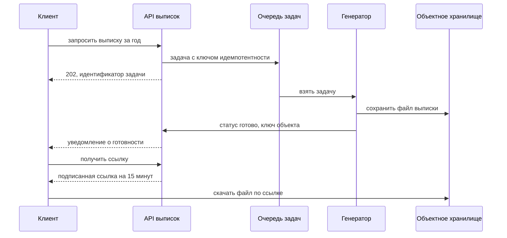

# 7.5 Строительные блоки: очереди, поиск, объектное хранилище, CDN, rate limiting

## Зачем это аналитику

Большинство задач на интервью собираются из одних и тех же блоков. Нужно знать, что умеет каждый, где его пределы и чем он платит за свои свойства: тогда схема строится быстро, а время остаётся на обсуждение компромиссов.

## Что понять

- [ ] Балансировка нагрузки и её алгоритмы (повтор блока 3 в формате интервью).
- [ ] Очереди и логи сообщений: когда очередь, когда Kafka; развязка, буферизация, фоновая обработка.
- [ ] Полнотекстовый поиск: инвертированный индекс, Elasticsearch/OpenSearch, синхронизация с основной базой.
- [ ] Объектное хранилище (S3-совместимое): модель, долговечность, выдача через CDN, pre-signed URL.
- [ ] CDN: статический и динамический контент, инвалидация, edge.
- [ ] Rate limiting: token bucket, sliding window, распределённый счётчик, где ставить.
- [ ] Уникальные идентификаторы в распределённой системе: UUID, Snowflake, последовательности.
- [ ] Push-уведомления, WebSocket и long polling для реального времени.
- [ ] Мультиарендность: изоляция данных и ресурсов, шумные соседи.

## Урок

<!-- LESSON:START -->
### Как смотреть на строительный блок

Каждый блок стоит описывать одинаково: какую проблему снимает, какое свойство даёт, где его предел и чем за это платим. Очередь даёт развязку, но платим задержкой и асинхронной согласованностью. CDN даёт скорость у пользователя, но платим устареванием кэша. Кандидат, который добавляет блок и тут же называет его цену, выглядит сильнее того, кто рисует «всё, что обычно бывает».

### Балансировка нагрузки

Балансировщик распределяет запросы между экземплярами сервиса и убирает из ротации нездоровые по результатам проверок (health checks). Различают уровень L4 (решение по адресу и порту, соединение прокидывается целиком, дёшево и быстро) и L7 (балансировщик понимает HTTP: маршрутизация по пути и заголовкам, терминация TLS, повторы, ограничения).

Алгоритмы:

- циклический (round robin), в том числе взвешенный, — для однородных коротких запросов;
- наименьшее число соединений (least connections) — когда длительность запросов сильно различается;
- хеширование по ключу (IP клиента, идентификатор сессии, консистентное хеширование) — когда нужна привязка клиента к экземпляру, например для локального кэша или WebSocket-соединений;
- случайный выбор из двух с выбором менее загруженного (power of two choices) — простой и устойчивый вариант для больших пулов.

На интервью балансировщик обычно рисуют одной рамкой. Важно помнить, что он сам должен быть резервирован, а липкие сессии (sticky sessions) ухудшают распределение и усложняют вывод экземпляра из работы. Предпочтительно делать сервисы без состояния.

### Очереди и логи сообщений

Очередь появляется в схеме, когда нужно одно из трёх:

1. Развязка (decoupling): отправитель не знает получателей и не ждёт их доступности.
2. Буферизация пиков: всплеск запросов складывается в очередь, обработчики разбирают её со своей скоростью.
3. Фоновая обработка: долгая операция уходит из синхронного запроса, пользователь получает «принято».

Есть две разные модели, и их важно не смешивать.

| Свойство | Брокер-очередь (RabbitMQ, SQS) | Журнал (Kafka и аналоги) |
|---|---|---|
| Что происходит после обработки | Сообщение подтверждается и удаляется | Сообщение остаётся до истечения срока хранения |
| Несколько потребителей | Конкурируют за сообщения одной очереди | Каждая группа потребителей читает поток целиком со своим смещением |
| Повторное чтение | Нет, только через отдельную очередь недоставленных | Да, сдвигом смещения назад |
| Порядок | Обычно не гарантирован при нескольких обработчиках | Гарантирован внутри партиции |
| Маршрутизация | Гибкая: по ключам, заголовкам, приоритетам, отложенная доставка | Простая: топик и партиция по ключу |
| Типичное применение | Задачи для обработчиков, команды, отложенные действия | Поток событий, CDC, аналитика, несколько независимых потребителей |

Правило выбора: если сообщение — задача, которую достаточно выполнить один раз, подходит очередь. Если это факт, который нужен разным потребителям, в том числе будущим, и важны порядок по ключу и возможность перечитать — журнал.

Общие свойства обеих моделей: доставка обычно «как минимум один раз» (at-least-once), значит, обработчик обязан быть идемпотентным. Сообщения, которые не удаётся обработать, уходят в очередь недоставленных (dead letter queue) после нескольких повторов. Запись в базу и публикация события атомарно не выполняются; стандартное решение — outbox: событие пишется в таблицу той же транзакцией, а отдельный процесс публикует его.

Отставание потребителя (consumer lag) — главная метрика: если оно растёт, очередь маскирует перегрузку, а пользователи видят результат всё позже.

### Полнотекстовый поиск

Реляционный индекс ищет по префиксу значения, а поиск «по словам в любом месте текста с учётом морфологии и релевантности» требует другой структуры — инвертированного индекса (inverted index). Текст разбивается на токены, приводится к нормальной форме (нижний регистр, стемминг или лемматизация, синонимы), и для каждого термина хранится список документов, где он встречается, с позициями и частотами. Запрос пересекает списки и ранжирует результаты по релевантности (в Elasticsearch и OpenSearch по умолчанию — BM25).

Elasticsearch и OpenSearch добавляют к этому распределённость: индекс разбит на шарды с репликами, есть агрегации, фасеты, подсветка. Их ограничения: документ становится видимым для поиска не сразу, а после обновления (refresh) — с задержкой порядка секунды; нет транзакций между документами; изменение схемы анализа требует переиндексации. Поэтому поисковый движок почти никогда не бывает источником истины.

Синхронизация с основной базой:

- Двойная запись из приложения (в базу и в индекс) — самый простой и худший вариант: при сбое между двумя записями данные расходятся навсегда, а при конкурентных изменениях порядок в индексе может отличаться от порядка в базе.
- Outbox или захват изменений из журнала базы (change data capture, CDC) — события об изменениях идут через журнал сообщений в индексатор. Надёжно, порядок по ключу сохраняется, отставание — секунды.
- Периодическая полная или инкрементальная переиндексация по полю «время изменения» — для небольших объёмов и как страховка от накопленных расхождений.

Индексатор должен быть идемпотентным и учитывать версию документа, чтобы старое событие не перезаписало новое. Полную переиндексацию делают в новый индекс, а затем переключают псевдоним (alias) — пользователи не видят пустого индекса.

### Объектное хранилище

Объектное хранилище (S3-совместимое) хранит объекты в бакетах по ключу. Объект — неизменяемый набор байтов с метаданными: его можно записать целиком или заменить, но не изменить посередине. Нет файловой иерархии в полноценном смысле: «папки» — это общий префикс ключа. Масштаб практически неограничен, стоимость хранения низкая, долговечность высокая за счёт хранения нескольких копий или кодов коррекции (erasure coding) на разных устройствах и площадках. Провайдеры заявляют долговечность многими девятками, но это не заменяет резервной копии от логических ошибок: случайное удаление реплицируется так же надёжно. От этого защищают версионирование и блокировка удаления.

Почему файлы не хранят в реляционной базе: большие двоичные поля раздувают базу, резервные копии и репликацию, занимают буферный кэш и соединения на время передачи, а масштабировать хранение в базе намного дороже. Правильная схема — файл в объектном хранилище, в базе строка с метаданными: ключ объекта, владелец, размер, тип, контрольная сумма, статус.

Отдавать файлы через свои серверы приложений тоже невыгодно — это трата пропускной способности и потоков на перекладывание байтов. Вместо этого используют подписанную ссылку (pre-signed URL): приложение проверяет права и формирует ссылку на конкретный объект с ограниченным сроком действия, подписанную ключом доступа. Клиент скачивает или загружает напрямую в хранилище. Для больших файлов — составная загрузка (multipart upload) частями с возможностью повторить отдельную часть. Публичный или массово запрашиваемый контент отдаётся через CDN, где хранилище выступает источником (origin).

Правила жизненного цикла (lifecycle) переводят старые объекты в более дешёвые классы хранения и удаляют их по сроку — это важно для требований к хранению документов.

#### Разобранный пример: выписка за год для юрлица

Клиент банка запрашивает выписку по счёту за год. Её формирование занимает десятки секунд и заметно нагружает базу, поэтому синхронный ответ не подходит.

Решения, которые стоит проговорить. Ключ идемпотентности не даёт создать две одинаковые задачи при повторном нажатии. Генератор читает с реплики или из хранилища выписок, а не с боевого лидера. Файл хранится ограниченное время по правилу жизненного цикла, а метаданные — в базе. Права проверяются при выдаче ссылки, и срок её жизни короткий, потому что ссылка работает у любого, кто её получил. Этот пример покрывает выдачу; загрузку с проверкой на вирусы и карантином разберите сами в практике.

### CDN

Сеть доставки контента (content delivery network, CDN) держит копии ответов на пограничных узлах (edge) близко к пользователям. Для статического контента — изображения, скрипты, файлы — это снижение задержки и разгрузка источника. Обычно используется модель pull: при промахе edge сам запрашивает источник и кэширует ответ по заголовкам `Cache-Control`.

Инвалидация — главная сложность. Варианты:

- короткий TTL — просто, но источник получает больше запросов, а данные устаревают на время TTL;
- явная очистка (purge) через API CDN — распространяется по узлам не мгновенно;
- версионированные имена (`app.3f9a1c.js`, `photo_v2.jpg`) — самый надёжный способ для статики: новый контент получает новый URL, старый можно кэшировать надолго.

Динамический контент тоже ускоряют: CDN держит тёплые соединения до источника, завершает TLS близко к пользователю, кэширует на секунды общие ответы (например, каталог без персонализации). Вычисления на edge позволяют выполнить простую логику — редиректы, A/B-разбиение, проверку подписи токена — без похода к источнику. Персональные ответы не кэшируют или делают частью ключа кэша только то, что действительно различает ответы, иначе один пользователь увидит данные другого.

### Rate limiting

Ограничение частоты запросов защищает систему от перегрузки и злоупотреблений и реализует коммерческие тарифы.

| Алгоритм | Механизм | Плюсы | Минусы |
|---|---|---|---|
| Token bucket | Ведро ёмкостью B пополняется со скоростью r токенов в секунду, запрос забирает токен | Допускает всплески до B, два понятных параметра | Нужно хранить состояние на ключ |
| Leaky bucket | Запросы идут в очередь, обрабатываются с постоянной скоростью | Сглаживает выход | Всплеск ждёт в очереди, растёт задержка |
| Fixed window | Счётчик за календарную минуту | Предельно просто, один INCR | На стыке окон за короткий интервал может пройти до двух лимитов |
| Sliding window log | Храним метки всех запросов за окно | Точный | Дорого по памяти при больших лимитах |
| Sliding window counter | Взвешиваем текущее и предыдущее окно по доле прошедшего времени | Близко к точному, дёшево | Приближение, предполагает равномерность внутри окна |

Распределённая реализация. Если экземпляров API много, локальные счётчики в каждом дают лимит, умноженный на число экземпляров. Типичное решение — общее быстрое хранилище счётчиков (обычно Redis): операция «проверить и уменьшить» выполняется атомарно, например скриптом на стороне сервера, чтобы два экземпляра не прочитали одно значение. Ключ — идентификатор клиента или ключа API плюс окно. Для очень высоких нагрузок применяют гибрид: локальный счётчик с периодической синхронизацией, соглашаясь на небольшое превышение.

Где ставить: на API-шлюзе или балансировщике для грубых лимитов по IP и ключу, в сервисе — для лимитов, завязанных на бизнес-логику (число платёжных поручений в минуту на клиента). Отказ в HTTP — код 429 с заголовком `Retry-After`; полезно сообщать остаток лимита в заголовках ответа. Отдельно решается, что делать при недоступности хранилища счётчиков: пропускать всех (fail open) ради доступности или отказывать (fail closed) ради защиты. Для публичного API чаще выбирают первое с локальным аварийным лимитом.

### Уникальные идентификаторы

Последовательность базы данных (sequence, identity) даёт короткие упорядоченные ключи, но требует обращения к одной базе. Её масштабируют выдачей диапазонами: экземпляр берёт блок из тысячи значений и раздаёт их локально (схема hi/lo). Минус — пропуски и порядок только внутри блока.

UUID версии 4 генерируется где угодно без координации, но он случайный: вставки в B-дерево разбрасываются по всему индексу, ухудшая локальность и кэш, а сортировать по нему бессмысленно. UUID версии 7 начинается с метки времени в миллисекундах, поэтому примерно упорядочен и дружелюбнее к индексам — хороший выбор по умолчанию, если СУБД и библиотеки его поддерживают.

Схема Snowflake (от Twitter) укладывает идентификатор в 64 бита: знаковый бит, 41 бит времени в миллисекундах от собственной эпохи, 10 бит номера машины и 12 бит порядкового номера внутри миллисекунды. Идентификаторы упорядочены по времени, компактны и генерируются локально. Слабые места: номера машин нужно раздавать без пересечений, а при переводе часов назад генератор должен ждать или отказывать, иначе возможны дубли.

Для внешних идентификаторов, видимых клиенту, учитывают ещё и перечислимость: последовательный номер позволяет угадать соседние объекты и оценить объём бизнеса.

### Доставка событий в реальном времени

- Короткий опрос (short polling): клиент спрашивает раз в N секунд. Просто, но много пустых запросов и задержка до N.
- Длинный опрос (long polling): сервер держит запрос, пока не появится событие или не истечёт таймаут. Работает через любые прокси, но на каждое событие — новый запрос.
- Server-Sent Events (SSE): однонаправленный поток событий от сервера по HTTP. Достаточен для уведомлений и статусов, есть автоматическое переподключение.
- WebSocket: двунаправленное постоянное соединение. Нужен для чатов, совместного редактирования, торговых терминалов.
- Мобильные push-уведомления идут через сервисы платформ (APNs у Apple, FCM у Google) и работают, когда приложение закрыто, но доставка не гарантирована и не мгновенна.

Постоянные соединения делают серверы соединений узлами с состоянием. Нужны реестр «пользователь → сервер соединения» и внутренняя шина (pub/sub), через которую сервис событий находит нужный сервер. При переподключении клиент сообщает последнее полученное событие, и сервер досылает пропущенное из хранилища. Реальное время всегда дополняют надёжным источником: соединение — канал ускорения, а не единственный путь доставки.

### Мультиарендность

Мультиарендная (multi-tenant) система обслуживает многих клиентов на общей инфраструктуре. Модели изоляции данных:

- общая база и таблицы с колонкой `tenant_id` — дешевле всего, но утечка между арендаторами — вопрос одной забытой фильтрации; в PostgreSQL помогает политика безопасности на уровне строк (row-level security);
- схема на арендатора — изоляция лучше, миграции сложнее при тысячах схем;
- база на арендатора — максимальная изоляция, отдельные резервные копии и возможность размещения по требованиям регулятора, но дороже в эксплуатации.

Часто используют гибрид: мелкие клиенты в общей базе, крупные — в выделенной. Это та же справочная схема шардирования, где ключ — арендатор.

Шумный сосед (noisy neighbor) — арендатор, чья нагрузка ухудшает работу остальных: тяжёлый отчёт, массовый импорт. Защита: квоты и rate limiting по арендатору, раздельные очереди или пулы обработчиков по классам клиентов, ограничения на длительность запросов, вынос тяжёлых сценариев в асинхронный режим и крупных арендаторов — на выделенные ресурсы. Метрики и логи должны быть разрезаны по арендатору, иначе источник деградации не найти.

### Типичные ошибки

- Добавлять очередь без идемпотентного обработчика и очереди недоставленных — и получать дубли или потерянные задачи.
- Выбирать Kafka там, где нужна простая очередь задач с повторами и задержками, или брокер-очередь там, где несколько потребителей должны читать один поток.
- Писать в базу и поисковый индекс двумя независимыми вызовами из приложения.
- Хранить файлы в реляционной базе или проксировать скачивание через серверы приложений.
- Кэшировать на CDN персональные ответы с неполным ключом кэша.
- Делать rate limiting локальными счётчиками в каждом экземпляре и не решить, что происходит при отказе хранилища счётчиков.
- Использовать случайный UUID как первичный ключ большой таблицы, не задумываясь о вставках в индекс.

### Как говорить об этом на собеседовании

Называть блок вместе с его ценой: «ставлю очередь, чтобы пережить пики; плата — задержка результата и необходимость идемпотентности; следим за отставанием потребителя». Уточнять модель, а не продукт: сначала «нужен журнал с повторным чтением и порядком по ключу», потом «например, Kafka».

Уровень senior видно по деталям стыков: как индекс догоняет базу, кто проверяет права при выдаче файла, что делает rate limiter при отказе Redis, как клиент получает пропущенные события после переподключения. Хорошо звучат примеры из опыта: вынос тяжёлых выписок в фоновые задачи, изоляция крупного клиента на выделенные ресурсы.

### Коротко

- Каждый блок описывается свойством, пределом и ценой; называйте их вместе.
- Очередь — для задач, журнал — для событий с несколькими потребителями и повторным чтением; обработчики всегда идемпотентны.
- Поисковый индекс — производная копия, синхронизируемая через outbox или CDC, а не двойной записью.
- Файлы — в объектное хранилище, метаданные — в базу, выдача — подписанными ссылками и через CDN.
- Инвалидацию статики в CDN надёжнее всего решать версионированными URL.
- Распределённый rate limiting требует общего атомарного счётчика и заранее выбранного поведения при его отказе.
- Упорядоченные идентификаторы без центральной базы дают UUIDv7 и схемы типа Snowflake.
- Реальное время — WebSocket или SSE плюс надёжное хранилище для досылки; мультиарендность — изоляция данных и квоты против шумных соседей.
<!-- LESSON:END -->

## Читать дальше

- Alex Xu, System Design Interview vol. 1 — главы о rate limiter, генераторе ID, уведомлениях.

На system-design.space:

- [Балансировка трафика](https://system-design.space/chapter/load-balancing/)
- [Событийно-ориентированная архитектура](https://system-design.space/chapter/event-driven-architecture/)
- [Elasticsearch: поисковый движок и архитектура](https://system-design.space/chapter/elasticsearch-overview/)
- [Объектное хранилище (S3)](https://system-design.space/chapter/object-storage-case/)
- [Система ограничения частоты запросов (Rate Limiter)](https://system-design.space/chapter/rate-limiter-case/)
- [Мультиарендная архитектура: изоляция данных, квоты и шумные соседи](https://system-design.space/chapter/multi-tenancy-isolation/)
- [Визуализация: Алгоритмы ограничения запросов (rate limiting)](https://system-design.space/visuals/rate-limiting/)

## Практика

1. Составить таблицу строительных блоков: назначение, ключевые свойства, пределы, чем платим, типичные продукты.
2. Спроектировать загрузку и выдачу файлов (документы, фото) для обезличенного сервиса: объектное хранилище, CDN, права, антивирус, жизненный цикл.
3. Спроектировать распределённый rate limiter для публичного API с лимитами по тарифам.

## Вопросы для самопроверки

1. Когда вы добавляете в схему очередь сообщений и какие проблемы она решает?
2. Как синхронизировать поисковый индекс с основной базой данных?
3. Почему файлы не хранят в реляционной базе и как их отдавать пользователям?
4. Как сгенерировать уникальный упорядоченный идентификатор без центральной базы?
5. Как реализовать rate limiting в системе из многих экземпляров?
6. Как доставлять события пользователю в реальном времени?

## Заметки

<!-- Свои формулировки, ошибки, ссылки. -->
