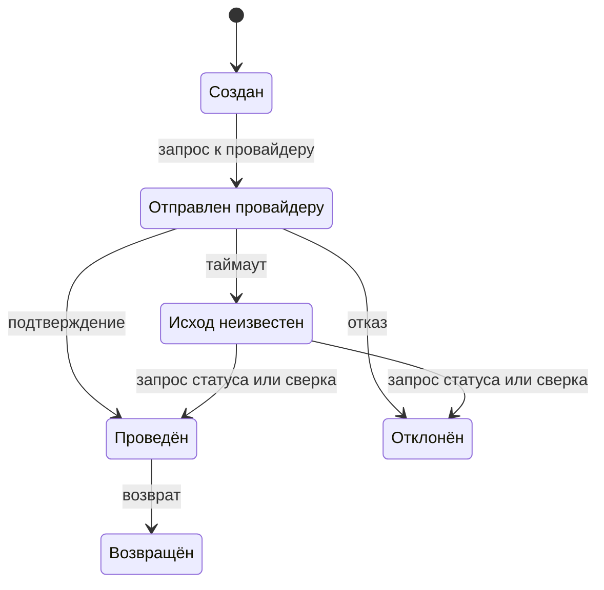

# 7.6 Классические задачи: разбор и тренировка

## Зачем это аналитику

Метод и блоки превращаются в навык только через решение задач. У большинства классических задач есть «ключевой поворот» — место, где простое решение ломается и нужно специальное. Модуль даёт каркас разбора для десяти задач и порядок тренировки.

## Что понять

- [ ] Сокращатель ссылок: генерация коротких ключей, соотношение чтения и записи, кэш, аналитика переходов.
- [ ] Rate limiter: алгоритмы, распределённые счётчики, поведение при отказе хранилища счётчиков.
- [ ] Лента новостей: fan-out при записи против fan-out при чтении, знаменитости, ранжирование.
- [ ] Чат: доставка в реальном времени, порядок, статусы прочтения, офлайн-доставка, групповые чаты.
- [ ] Уведомления: каналы, приоритеты, дедупликация, ретраи, отписки.
- [ ] Платёжная система: идемпотентность, двойная запись в журнале, сверка с провайдером, статусы.
- [ ] Бронирование: конкуренция за ограниченный ресурс, удержание брони, согласованность с оплатой.
- [ ] Поиск с автодополнением: префиксное дерево, топ-K, обновление популярности.
- [ ] Агрегатор событий (клики, просмотры): поток, окна, точность против задержки.
- [ ] Прогноз и заказ для ритейла (своя задача): пакетная обработка большого объёма, окна расчёта, отказоустойчивость.

## Урок

<!-- LESSON:START -->
### Как пользоваться разборами

Ниже — не решения, а карты местности. Для каждой задачи: что уточнить в требованиях, где ломается очевидное решение, какие решения и компромиссы составляют ядро и на чём интервьюер будет проверять глубину. Полное решение по методу 7.1 (требования, оценки, API, модель данных, общая схема, углубление, узкие места) пишется самостоятельно.

Сквозная идея: простая схема «сервис плюс база» почти всегда рисуется за пять минут и почти всегда верна для малого масштаба. Задача интервью — найти место, где она перестаёт работать, и показать, что вы видите его сами. Это и есть ключевой поворот.

| Задача | Ключевой поворот |
|---|---|
| Сокращатель ссылок | Генерация коротких уникальных ключей без коллизий и координации |
| Rate limiter | Общий счётчик для многих экземпляров и поведение при его отказе |
| Лента новостей | Fan-out при записи ломается на пользователях с миллионами подписчиков |
| Чат | Доставка и порядок при постоянных соединениях и офлайн-получателях |
| Уведомления | Надёжность и дедупликация поверх ненадёжных внешних каналов |
| Платёжная система | Неизвестный исход вызова провайдера и защита от двойного списания |
| Бронирование | Конкуренция за последнюю единицу ресурса и связка с оплатой |
| Автодополнение | Ответ за десятки миллисекунд на каждое нажатие клавиши |
| Агрегатор событий | Точность для биллинга против задержки для дашбордов |
| Прогноз и заказ | Жёсткое окно расчёта и частичные отказы в большом пакете |

Порядок тренировки: начать с сокращателя ссылок и rate limiter (короткие, отрабатывают метод), затем уведомления и автодополнение, затем тяжёлые — лента, чат, платежи, бронирование, агрегатор. Задачу о прогнозе оставить на конец и решать как рассказ о собственном опыте.

### 1. Сокращатель ссылок

**Требования.** Создать короткую ссылку для длинного URL, перейти по короткой ссылке, опционально — свой алиас, срок жизни, статистика переходов. Нагрузка сильно смещена к чтению: переходов на порядки больше, чем созданий. Задержка перехода должна быть минимальной.

**Ключевой поворот.** Нужен короткий ключ, уникальный без глобальной блокировки. Хеш длинного URL, обрезанный до 7 символов, даёт коллизии, которые надо проверять и разрешать. Глобальный счётчик в base62 даёт короткие ключи без коллизий, но становится точкой координации и делает ссылки перечислимыми.

**Решения и компромиссы.** Длина ключа выводится из оценки: 7 символов base62 дают около 3,5 триллиона комбинаций. Варианты генерации: счётчик с выдачей диапазонов экземплярам; заранее сгенерированный пул случайных ключей в отдельном сервисе; хеш с проверкой уникальности при вставке. Хранилище — простое «ключ → URL», легко шардируется по ключу. Чтение закрывается кэшем: популярные ссылки составляют малую долю и почти все попадания. Ответ 301 браузер кэширует, и повторные переходы не доходят до сервиса — это экономит нагрузку, но теряет статистику; 302 оставляет каждый переход видимым. Аналитика пишется асинхронно в журнал событий, а не в основную базу на пути перехода.

**Что проверяет интервьюер.** Умение вывести длину ключа из объёма, выбор между 301 и 302 с объяснением, почему аналитика не должна замедлять редирект, что делать с одинаковыми длинными URL от разных пользователей и с вредоносными ссылками.

### 2. Rate limiter

**Требования.** Лимиты по ключу API, пользователю или IP, разные для тарифов; ответ о превышении; малая добавочная задержка; работа при многих экземплярах шлюза.

**Ключевой поворот.** Локальные счётчики в каждом экземпляре не работают — лимит умножается на число экземпляров. Общий счётчик в Redis решает это, но становится зависимостью на пути каждого запроса. Что делать, когда он недоступен?

**Решения и компромиссы.** Алгоритм — обычно token bucket (допускает всплески) или sliding window counter (дёшево и почти точно). Проверка и изменение счётчика — одной атомарной операцией на стороне хранилища. Хранилище счётчиков шардируется по ключу лимита; очень крупный клиент может стать горячим ключом — тогда лимит делят между подсчётчиками. При отказе хранилища выбирают между fail open (пропустить, сохранить доступность) и fail closed (отказать, защитить систему); разумный компромисс — переход на локальный лимит, равный общему, делённому на число экземпляров. Правила лимитов хранятся отдельно и кэшируются. В нескольких регионах лимит либо делят между регионами, либо соглашаются на приблизительность.

**Что проверяет интервьюер.** Понимание гонки при неатомарной проверке, обоснование выбора fail open или closed для конкретного API, место лимитера (шлюз против сервиса), ответ клиенту (429, `Retry-After`), разницу между защитой от перегрузки и коммерческой квотой.

### 3. Лента новостей

**Требования.** Публикация поста, лента из постов тех, на кого подписан пользователь, быстрое открытие ленты, допустимая задержка появления поста — секунды. Чтений ленты намного больше, чем публикаций.

**Ключевой поворот.** Для быстрого чтения ленту готовят заранее: при публикации идентификатор поста раскладывается в ленты всех подписчиков (fan-out при записи). Это ломается на знаменитостях: один пост с миллионами подписчиков порождает миллионы записей и задержку в минуты. Обратный подход — собирать ленту при чтении (fan-out при чтении) — дорог для каждого открытия ленты.

**Решения и компромиссы.** Гибрид: для обычных авторов — fan-out при записи в кэш лент (списки идентификаторов, ограниченной длины); для авторов с огромной аудиторией — их посты подмешиваются при чтении. Для неактивных пользователей ленту не предвычисляют, а собирают при входе. В ленте храним только идентификаторы, тексты и медиа тянем из отдельных хранилищ с кэшем. Ранжирование — двухэтапное: отбор кандидатов, затем упорядочивание моделью; хронологическая лента проще и прозрачнее. Удаление поста и отписка требуют чистки уже разложенных лент или фильтрации при чтении.

**Что проверяет интервьюер.** Способность оценить стоимость fan-out в цифрах, порог «знаменитости», поведение при удалении и приватности, где хранится лента и сколько элементов, как вставляется реклама и ранжирование без полной перестройки.

### 4. Чат

**Требования.** Личные и групповые чаты, доставка в реальном времени, история, статусы «доставлено» и «прочитано», работа на нескольких устройствах, получение сообщений после офлайна.

**Ключевой поворот.** Постоянные соединения делают серверы соединений узлами с состоянием: отправитель подключён к одному серверу, получатель — к другому или офлайн. Порядок сообщений нельзя строить по часам клиентов, а сеть гарантирует только «как минимум один раз».

**Решения и компромиссы.** WebSocket-серверы плюс реестр «пользователь и устройство → сервер соединения» и внутренняя шина между ними. Сообщение сначала сохраняется, затем доставляется: хранилище — источник истины, соединение — ускоритель. Порядок задаётся сервером: номер сообщения, монотонный внутри чата. Хранилище шардируется по идентификатору чата. Клиент присылает свой идентификатор сообщения, чтобы повтор отправки не создавал дубль. Офлайн-получатель при подключении сообщает последний полученный номер по каждому чату и получает недостающее; чтобы разбудить приложение, отправляется мобильное push-уведомление. Статус прочтения хранится как указатель «прочитано до номера N» на пользователя и чат, а не флаг на каждом сообщении. В больших группах рассылка каждому участнику дорога — переходят к модели чтения из общего потока чата.

**Что проверяет интервьюер.** Как не потерять сообщение при падении сервера соединения, порядок при одновременной отправке, синхронизация нескольких устройств, стоимость статусов в группах, шифрование «от конца до конца» и его влияние на поиск и серверную логику.

### 5. Уведомления

**Требования.** Разные каналы (мобильный push, SMS, email, в приложении), транзакционные и маркетинговые сообщения, настройки пользователя, шаблоны, статистика доставки.

**Ключевой поворот.** Внешние провайдеры ненадёжны, медленны и имеют свои лимиты, а источники событий могут прислать одно событие дважды. Нужно не потерять важное, не отправить дважды и не завалить пользователя.

**Решения и компромиссы.** Сервис принимает событие, проверяет настройки и отписки, выбирает каналы, рендерит шаблон и кладёт задания в очереди по каналам и приоритетам. Код подтверждения входа не должен стоять за маркетинговой рассылкой — отдельные очереди и обработчики. Дедупликация по ключу события с окном хранения. Повторы с экспоненциальной задержкой, очередь недоставленных, переключение на резервного провайдера. Ограничение частоты на пользователя и тихие часы. Отписка от маркетинговых сообщений обязательна и должна проверяться непосредственно перед отправкой, а не только при постановке в очередь. Статусы доставки приходят от провайдеров асинхронно, через обратные вызовы.

**Что проверяет интервьюер.** Разделение приоритетов, дедупликация при повторах источника, что значит «доставлено» для каждого канала, поведение при отказе провайдера, соблюдение согласий пользователя.

### 6. Платёжная система

**Требования.** Приём оплаты заказа через внешнего провайдера, возвраты, статусы для клиента и бизнеса, выплаты продавцам, точный учёт, аудит.

**Ключевой поворот.** Вызов провайдера может закончиться таймаутом: деньги могли списаться, а могли и нет. Слепой повтор рискует двойным списанием, отказ от повтора — потерянным платежом.

**Решения и компромиссы.** Ключ идемпотентности от клиента хранится с уникальным ограничением: повторный запрос возвращает результат первого. Тот же ключ передаётся провайдеру, если он это поддерживает. Платёж — конечный автомат, статусы меняются только разрешёнными переходами.

Состояние «исход неизвестен» разрешается запросом статуса у провайдера или вебхуком, а не повторной отправкой. Учёт ведётся в журнале двойной записи (double-entry ledger): каждая операция — набор проводок с суммой ноль, записи только добавляются, исправление — сторнирующей проводкой. Ежедневная сверка (reconciliation) с отчётами провайдера находит расхождения, которые онлайн-логика пропустила. События о смене статуса публикуются через outbox.

**Что проверяет интервьюер.** Состояние «неизвестно» и как из него выйти, где хранится ключ идемпотентности и сколько, почему журнал только на добавление, что делать при расхождении в сверке, согласованность между заказом и платежом.

### 7. Бронирование

**Требования.** Поиск свободных номеров или мест, бронирование, оплата, отмена, работа при пиковом спросе. Продать один ресурс дважды недопустимо; иногда бизнес сознательно разрешает ограниченный овербукинг.

**Ключевой поворот.** Два клиента одновременно видят последнюю свободную единицу и оба её бронируют. Проверка «свободно ли» и запись брони, сделанные отдельно, дают гонку. Вторая сложность — оплата занимает минуты, и держать ресурс всё это время нужно ограниченно.

**Решения и компромиссы.** Для номеров отеля удобна модель «тип номера × дата → всего и занято». Бронирование — условное обновление в одной транзакции: увеличить «занято», только если оно меньше «всего», по каждой дате проживания. Альтернативы — оптимистическая блокировка по версии или уникальное ограничение на «место и сеанс» для конкретных мест. Бронь создаётся в статусе удержания со сроком; фоновый процесс освобождает просроченные. Связка с оплатой — сага: удержание, оплата, подтверждение; при неудачной оплате — освобождение. Если оплата пришла после истечения удержания, нужна явная политика: повторная попытка занять или возврат. Повтор запроса бронирования защищается ключом идемпотентности. Поиск доступности можно обслуживать из кэша с небольшим отставанием, но окончательная проверка — только в транзакции.

**Что проверяет интервьюер.** Где именно устраняется гонка, длительность удержания и её влияние на конверсию, поведение при опоздавшей оплате, согласованность между кэшем поиска и инвентарём, горячие даты и отели.

### 8. Поиск с автодополнением

**Требования.** Подсказки по префиксу при каждом нажатии клавиши, топ из нескольких самых популярных вариантов, ответ за десятки миллисекунд, фильтрация нежелательного, возможно персонализация.

**Ключевой поворот.** Обход префиксного дерева (trie) до всех потомков и сортировка по популярности на каждое нажатие слишком медленны при больших словарях и высокой частоте запросов.

**Решения и компромиссы.** В каждом узле дерева заранее хранится готовый топ-K для этого префикса: чтение — спуск по символам и выдача списка. Длину префикса ограничивают. Дерево строится офлайн из агрегированного журнала запросов и загружается в память серверов; шардирование — по первым символам с поправкой на неравномерность. Частоту перестройки выбирают по требованиям: пакетное обновление раз в сутки проще, для трендов добавляют потоковое обновление с затуханием весов старых запросов. Клиент уменьшает нагрузку задержкой перед отправкой (debounce) и кэшированием ответов, а для коротких префиксов ответы можно отдавать даже с CDN. Фильтр нежелательных подсказок применяется при построении и при выдаче.

**Что проверяет интервьюер.** Почему топ-K хранится в узлах, как часто обновлять популярность и чем платим за свежесть, как быстро убрать нежелательную подсказку, объём памяти для дерева.

### 9. Агрегатор событий

**Требования.** Приём клик-событий и просмотров с высокой частотой, агрегаты по объявлению и минуте для дашбордов почти в реальном времени и точные данные для биллинга рекламодателей.

**Ключевой поворот.** Дашборду нужна задержка в секунды, биллингу — точность до клика. Поток обработки в реальном времени сталкивается с опоздавшими событиями, повторами и перезапусками, и одновременно быть быстрым и абсолютно точным он не может.

**Решения и компромиссы.** События пишутся в журнал сообщений и сохраняются в сыром виде в дешёвом хранилище. Потоковый обработчик считает агрегаты в окнах фиксированной длины по времени события, а не по времени обработки; водяной знак (watermark) определяет, сколько ждать опоздавших. Дубли отсекаются по идентификатору события. Точность уровня «ровно один раз» достигается связкой: фиксация смещений вместе с результатом или идемпотентная запись агрегатов. Горячие объявления разгружаются предварительной агрегацией и разделением ключа. Для биллинга — пересчёт пакетом по сырым данным после закрытия периода и сверка с потоковыми цифрами: быстрые данные показываются как предварительные, пакетные — как окончательные. Фильтрация мошеннических кликов — отдельный этап.

**Что проверяет интервьюер.** Разница времени события и времени обработки, что делать с событием, пришедшим через час, как пересчитать при ошибке в логике, почему сырые данные хранятся, как предварительные и окончательные цифры показываются бизнесу.

### 10. Прогноз и заказ для ритейла

**Требования.** Каждую ночь по сотням магазинов и десяткам тысяч товаров рассчитать прогноз спроса и на его основе — заказы поставщикам. Вход — продажи за день из кассовых систем, остатки, товары в пути, ассортиментные матрицы, акции. Выход — заказы, которые должны уйти поставщикам до фиксированного времени отсечки.

**Ключевой поворот.** Объём — десятки миллионов пар «магазин × товар», окно — несколько часов между загрузкой продаж и отсечкой. Один большой расчёт «всё или ничего» ломается: опоздавшие данные одного региона или падение на одном участке срывают заказы всей сети.

**Решения и компромиссы.** Разделить конвейер на этапы с явными контрольными точками: загрузка и проверка полноты данных, прогноз, расчёт заказа, валидация, отправка. Партиционировать работу по магазинам или регионам, чтобы участки считались параллельно и отказывали независимо. Каждый этап идемпотентен и перезапускается для отдельной партиции. Для магазина без свежих данных использовать правило деградации: вчерашний прогноз, страховой запас, повтор прошлого заказа — с пометкой для категорийного менеджера. Перед отправкой — автоматические проверки на аномалии: заказ в разы больше обычного, нулевой заказ по ходовому товару. Мониторинг измеряет не только ошибки, но и прогресс относительно дедлайна. Версии данных и модели фиксируются, чтобы расчёт можно было воспроизвести при разборе претензии.

**Что проверяет интервьюер.** Что происходит, если к отсечке готово 90 процентов магазинов, как обнаружить неполные данные, почему не пересчитывать всё при отказе одного участка, как отделить прогноз от бизнес-правил заказа, воспроизводимость и пересчёт задним числом.

### Типичные ошибки

- Рисовать общую схему и останавливаться, не найдя ключевой поворот: интервьюер ждёт именно его.
- Решать поворот названием продукта («возьмём Kafka») вместо механизма (журнал с порядком по ключу и повторным чтением).
- Игнорировать повторы: в платежах, бронировании, чате и уведомлениях дубли возникают по умолчанию, и идемпотентность нужно проектировать явно.
- Строить порядок сообщений или событий по часам клиентов.
- Требовать одинаковой точности и задержки для всех потребителей данных вместо разделения на быстрый предварительный и точный окончательный контуры.
- Не обсуждать удаление, отмену и возврат — обратные сценарии часто сложнее прямых.
- Сравнивать своё решение с книжным и записывать только «что у них было», а не «почему я это пропустил».

### Как говорить об этом на собеседовании

Проговаривать поворот явно: «простое решение работает до такого-то масштаба; ломается здесь, потому что…; вот два варианта и их цена; выбираю этот, исходя из требования…». Это показывает, что решение выведено, а не вспомнено.

Уровень senior видно по трём вещам: оценки в цифрах, которые обосновывают выбор; обратные и аварийные сценарии (таймаут провайдера, опоздавшие данные, отказ хранилища счётчиков); связь технического решения с бизнес-правилом (овербукинг, предварительные и окончательные цифры, правило деградации заказа). Задачу о прогнозе и заказе стоит держать готовой как рассказ о собственной системе — с реальными окнами, объёмами порядка величины и решениями, которые принимали вы.

### Коротко

- У каждой классической задачи есть ключевой поворот; найти и назвать его — главная цель разбора.
- Сокращатель ссылок — генерация ключей и асинхронная аналитика; rate limiter — атомарный общий счётчик и поведение при его отказе.
- Лента — гибрид fan-out при записи и при чтении из-за знаменитостей.
- Чат и уведомления — сначала сохранить, потом доставить; порядок задаёт сервер; дедупликация обязательна.
- Платежи — ключ идемпотентности, состояние «неизвестно», журнал двойной записи и сверка с провайдером.
- Бронирование — условное обновление в транзакции, удержание со сроком и сага с оплатой.
- Автодополнение — топ-K в узлах префиксного дерева; агрегатор — окна по времени события и пакетный пересчёт для биллинга.
- Пакетный расчёт с дедлайном — партиции, контрольные точки, идемпотентные этапы и правило деградации.
<!-- LESSON:END -->

## Читать дальше

- Alex Xu, System Design Interview vol. 1 и 2 — соответствующие главы.

На system-design.space:

- [Сервис сокращения ссылок (TinyURL)](https://system-design.space/chapter/url-shortener-case/)
- [Система уведомлений](https://system-design.space/chapter/notification-system-case/)
- [Система чатов](https://system-design.space/chapter/chat-system-case/)
- [Платёжная система](https://system-design.space/chapter/payment-system-case/)
- [Система бронирования отелей](https://system-design.space/chapter/hotel-booking-case/)
- [Поисковые подсказки (Search Autocomplete / Typeahead)](https://system-design.space/chapter/search-autocomplete-case/)
- [Агрегатор рекламных событий](https://system-design.space/chapter/ad-click-event-aggregator-case/)
- [Twitter/X](https://system-design.space/chapter/twitter-case/)
- [Практика системного дизайна: лента Twitter/X](https://system-design.space/practice/news-feed/)
- [Практика системного дизайна: бронирование отелей](https://system-design.space/practice/hotel-booking/)
- [Практика системного дизайна: платежи](https://system-design.space/practice/payments/)

## Практика

1. Решить письменно по методу 7.1 восемь задач из списка, по одной-две в неделю. Каждое решение — отдельный файл в «Заметках» этого модуля или в папке `07-system-design/solutions/`.
2. После каждой задачи сравнить своё решение с разбором в книге Alex Xu или на system-design.space и записать, что пропустил.
3. Провести два пробных интервью вслух: с коллегой или с Claude в роли интервьюера уровня senior (попросить не подсказывать и задавать вопросы «почему»).

## Вопросы для самопроверки

1. В чём ключевой поворот задачи о ленте новостей?
2. Как обеспечить, чтобы платёж не был проведён дважды?
3. Как не продать один номер в отеле двум клиентам?
4. Как доставить сообщение пользователю, который был офлайн?
5. Как посчитать клики в реальном времени и при этом не потерять точность для биллинга?
6. Какая из решённых задач далась тяжелее всего и почему?

## Заметки

<!-- Свои формулировки, ошибки, ссылки. -->
