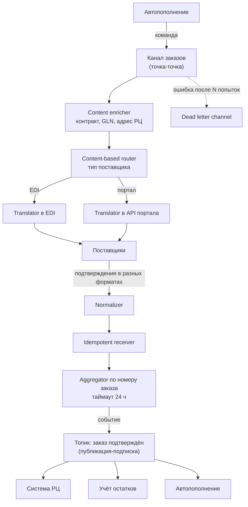

# 8.1 Enterprise Integration Patterns: язык интеграций

## Зачем это аналитику

Каталог Хопа и Вулфа — общий язык интеграторов уже двадцать лет. «Здесь нужен content enricher и идемпотентный получатель» — короткая и точная фраза, понятная любому архитектору. Паттерны не устарели: Kafka, Camel, MuleSoft и облачные сервисы реализуют те же идеи.

## Что понять

- [ ] Четыре стиля интеграции: файловый обмен, общая база данных, удалённый вызов, обмен сообщениями — плюсы и минусы каждого.
- [ ] Каналы: точка-точка, публикация-подписка, dead letter channel, guaranteed delivery.
- [ ] Сообщения: команда, документ, событие; correlation identifier; return address; сообщение с истечением срока.
- [ ] Маршрутизация: content-based router, message filter, splitter, aggregator, resequencer, scatter-gather, process manager.
- [ ] Трансформация: message translator, content enricher, content filter, canonical data model, normalizer.
- [ ] Конечные точки: polling и event-driven consumer, competing consumers, idempotent receiver, transactional client.
- [ ] Управление системой: wire tap, message history, control bus.

## Урок

<!-- LESSON:START -->
Книга Грегора Хопа и Бобби Вулфа «Enterprise Integration Patterns» вышла в 2003 году. Брокеры с тех пор сменились несколько раз, а словарь из книги остался. Его ценность не в диаграммах, а в том, что каждый паттерн называет конкретное решение с известными последствиями. Сказать «здесь aggregator с таймаутом и частичной выдачей» — значит сразу обозначить, что нужно хранить состояние, выбрать ключ корреляции и описать поведение при неполном наборе.

Урок идёт по той же структуре, что и каталог: стили интеграции, каналы, сообщения, маршрутизация, трансформация, конечные точки, управление. Сквозной пример — розничная сеть, которая формирует заказы поставщикам по прогнозу, принимает от них подтверждения и отгрузочные документы и передаёт поставки на распределительный центр.

### Четыре стиля интеграции

Прежде чем выбирать паттерны обмена сообщениями, нужно решить, обмениваться ли сообщениями вообще. Каталог выделяет четыре базовых стиля.

| Стиль | Как работает | Сильные стороны | Главный недостаток |
|---|---|---|---|
| Файловый обмен (file transfer) | Система выгружает файл, другая забирает по расписанию | Простота, слабая связанность, понятен любым системам и партнёрам | Задержка, рассинхрон, нет гарантий доставки и формата без дополнительных договорённостей |
| Общая база данных (shared database) | Несколько приложений читают и пишут одни таблицы | Данные согласованы сразу, нет дублирования | Схема становится общим контрактом, её нельзя менять; конкуренция за блокировки |
| Удалённый вызов (remote procedure invocation) | Одна система синхронно вызывает функцию другой | Привычная модель, сразу получаем ответ | Временная связанность: недоступность вызываемого ломает вызывающего; каскадные отказы |
| Обмен сообщениями (messaging) | Системы обмениваются сообщениями через канал асинхронно | Развязка по времени и доступности, буферизация, масштабирование | Сложнее отлаживать, eventual consistency, нужны идемпотентность и мониторинг |

В рознице встречаются все четыре. Поставщики из малого бизнеса до сих пор присылают прайсы и накладные файлами (CSV, XML, EDI-сообщения через провайдера). Отчётная система часто читает прямо из реплики учётной базы — это разновидность общей базы данных. Проверка остатка в магазине при оформлении заказа в интернет-магазине — удалённый вызов. Передача продаж из касс в систему прогноза — обмен сообщениями.

Выбор стиля — это выбор, какую связанность вы готовы терпеть. Файл связывает по формату и расписанию, общая база — по схеме, RPC — по времени и доступности, сообщения — по формату сообщения и семантике канала. Остальная часть каталога посвящена четвёртому стилю, потому что он даёт больше всего степеней свободы и больше всего способов ошибиться.

### Каналы

Канал сообщений (message channel) — логический адрес, куда отправитель кладёт сообщение и откуда его забирает получатель. Главное проектное решение — семантика канала.

**Точка-точка (point-to-point)**: каждое сообщение получит ровно один из получателей. Если получателей несколько, они делят поток между собой. Это канал для команд: «разместить заказ у поставщика» должен выполнить один обработчик, а не три.

**Публикация-подписка (publish-subscribe)**: каждое сообщение получит каждый подписчик. Это канал для событий: «поставка принята на РЦ» интересует учёт остатков, систему автопополнения, бухгалтерию и аналитику, и каждый обрабатывает событие независимо.

Современные брокеры реализуют обе семантики разными средствами. В RabbitMQ очередь — это точка-точка, а exchange с несколькими привязанными очередями даёт публикацию-подписку. В Kafka топик сам по себе ведёт себя как публикация-подписка между группами потребителей, а внутри одной группы партиции делятся между экземплярами — это точка-точка. Аналитику важно не название объекта в брокере, а ответ на вопрос «сколько получателей должно увидеть это сообщение».

**Канал недоставленных сообщений (dead letter channel)** — куда брокер или получатель перекладывает сообщение, которое нельзя доставить или обработать: истёк срок, превышено число попыток, сообщение не проходит валидацию. Без него «ядовитое» сообщение (poison message) бесконечно возвращается в очередь и блокирует обработку остальных. В постановке нужно описать не только сам канал, но и процесс вокруг него: кто получает уведомление, как разбирают сообщения, как переотправляют после исправления.

Близкий паттерн — invalid message channel: туда получатель кладёт сообщения, которые пришли, но не соответствуют ожидаемому формату. Разница в причине: dead letter — не удалось доставить или обработать, invalid — сообщение само по себе некорректно.

**Гарантированная доставка (guaranteed delivery)** — канал сохраняет сообщение на диск и не теряет его при падении брокера. Цена — задержка и пропускная способность. Важно понимать, что гарантия относится к участку «брокер — брокер». Если отправитель сначала записал заказ в базу, а потом отправил сообщение, и упал между этими шагами, никакая гарантированная доставка не поможет. Эту дыру закрывают паттерном transactional outbox, который фактически является современной реализацией transactional client (о нём ниже).

### Сообщения

Сообщение состоит из заголовков и тела. Каталог различает сообщения по намерению.

- **Команда (command message)** — просьба выполнить действие: «Создать заказ поставщику». Адресована конкретному исполнителю, ожидает результат.
- **Документ (document message)** — передача данных без указания, что с ними делать: «Вот прайс-лист поставщика на следующий месяц».
- **Событие (event message)** — уведомление о свершившемся факте: «Заказ подтверждён поставщиком». Отправитель не знает и не должен знать, кто отреагирует.

Различие не формальное. Команду называют в повелительном наклонении и отправляют в канал точка-точка; событие называют в прошедшем времени и публикуют в канал публикации-подписки. Когда событие по сути является скрытой командой («ЗаказНужноОтправить»), связанность возвращается, только незаметно.

**Идентификатор корреляции (correlation identifier)** связывает ответ с запросом. Система закупок отправляет поставщику 300 заказов, поставщик отвечает подтверждениями в произвольном порядке и в разное время. Каждое подтверждение несёт идентификатор исходного заказа, и только по нему можно понять, что именно подтверждено. Без корреляции асинхронный запрос-ответ невозможен. Тот же приём используется для сквозной трассировки: единый идентификатор цепочки передаётся через все системы, и по нему собирается путь конкретного заказа.

**Обратный адрес (return address)** — в запросе указан канал, куда отправить ответ. Так исполнитель не зашит на конкретного вызывающего: одна и та же служба расчёта цен может отвечать и закупкам, и интернет-магазину.

**Сообщение с истечением срока (message expiration)** — у сообщения есть срок жизни, после которого его не нужно обрабатывать. Запрос актуальной цены у поставщика бессмыслен через час, команда «пересчитать заказ на завтрашнюю поставку» бессмысленна после отсечки. Просроченное сообщение уходит в dead letter channel или отбрасывается — это нужно явно записать в требования.

### Маршрутизация

Маршрутизаторы решают, куда пойдёт сообщение, не меняя его содержимое.

**Маршрутизатор по содержимому (content-based router)** выбирает канал по полям сообщения. Заказы поставщикам с прямой поставкой в магазин идут в один поток, заказы через РЦ — в другой, заказы импортным поставщикам — в третий, где нужно оформить таможенные документы. Минус — маршрутизатор знает обо всех получателях, и добавление нового направления требует его изменения.

**Фильтр сообщений (message filter)** пропускает только то, что нужно получателю. Система аналитики свежих продуктов подписана на события движения товара, но ей нужны только категории с коротким сроком годности.

**Разделитель (splitter)** разбивает одно сообщение на несколько. Сводный заказ поставщику на 400 позиций превращается в 400 сообщений по строкам, чтобы каждую строку отдельно проверить по матрице ассортимента и контракту.

**Агрегатор (aggregator)** собирает несколько сообщений в одно. Это самый сложный паттерн маршрутизации, потому что он хранит состояние. Для агрегатора нужно определить три вещи:

1. Ключ корреляции — по чему понять, что сообщения относятся к одной группе (номер заказа).
2. Условие завершения — когда группа считается полной: пришли все ожидаемые строки, наступил таймаут, получено сообщение-маркер конца.
3. Алгоритм объединения — как собрать результат, что делать с дублями и с неполным набором.

Пара splitter и aggregator — классический шаблон «разбить, обработать параллельно, собрать». В нашем примере после проверки строк агрегатор собирает заказ обратно, и если за десять минут не пришло подтверждение по части строк, заказ уходит со статусом «частично проверен» на ручной разбор.

**Упорядочиватель (resequencer)** восстанавливает порядок сообщений, пришедших вразнобой. Ему нужен порядковый номер в сообщении и буфер. Пример: поставщик шлёт корректировки к заказу, и корректировка номер 3 не должна применяться раньше номера 2. На практике часто дешевле обеспечить порядок на уровне брокера (все сообщения по одному заказу в одну партицию), чем строить resequencer.

**Scatter-gather** рассылает запрос нескольким получателям и собирает ответы агрегатором. Классическая задача — запрос цен или сроков у нескольких поставщиков одного товара. Сюда входят рассылка (через публикацию-подписку или список получателей), корреляция ответов, таймаут и правило выбора: лучшая цена, первые три ответа, все ответившие к сроку.

**Менеджер процесса (process manager)** управляет многошаговым процессом, маршрут которого определяется по ходу: он хранит состояние экземпляра процесса и решает, какой следующий шаг. Это прямой предок оркестрованной саги. Процесс «заказ поставщику» — отправить, дождаться подтверждения, при отказе поставщика найти альтернативного, дождаться отгрузочного уведомления, передать на РЦ — удобно описывать именно так.

### Трансформация

**Транслятор сообщений (message translator)** переводит сообщение из формата одной системы в формат другой. Это аналог адаптера на уровне интеграции: ERP-формат заказа превращается в формат EDI для поставщика.

**Обогатитель (content enricher)** добавляет в сообщение данные, которых нет у отправителя. Система прогноза знает артикул и количество, но не знает GLN поставщика, условия контракта и адрес РЦ. Обогатитель достаёт их из справочников и дополняет сообщение. Важно зафиксировать, что делать, если справочник недоступен или данных нет: ждать, отклонять или пропускать с пометкой.

**Фильтр содержимого (content filter)** — обратная операция: убирает лишние поля. Поставщику не нужно видеть внутреннюю себестоимость и прогнозные коэффициенты, а сообщение становится меньше.

**Каноническая модель данных (canonical data model)** — общий формат, в который все системы переводят свои данные на входе в шину и из которого переводят на выходе. При N системах вместо N×(N−1) трансляторов нужно около 2N. Модель полезна, когда систем много, они часто меняются и есть команда, которая её сопровождает.

Каноническая модель вредит, когда:

- она пытается описать «заказ вообще» для всех систем и превращается в объединение всех полей всех систем, где половина полей не заполнена и никто не знает их смысла;
- любое изменение требует согласования всеми участниками, и модель становится узким местом;
- у разных контекстов действительно разный смысл понятий: «заказ» у закупок, у склада и у интернет-магазина — разные сущности, и одна модель их размывает.

Современная альтернатива — канонические модели на уровне ограниченного контекста (bounded context) и публикуемые контракты событий, а не одна модель на всё предприятие.

**Нормализатор (normalizer)** приводит сообщения разных форматов к одному. Поставщики присылают подтверждения в EDI, в XML через портал и в Excel по почте. Нормализатор определяет формат (маршрутизатором по признаку источника или содержимого) и направляет каждый в свой транслятор, на выходе получается единый формат подтверждения.

### Конечные точки

Конечная точка (message endpoint) — код, который связывает приложение с каналом.

**Опрашивающий потребитель (polling consumer)** сам запрашивает сообщения, когда готов. **Событийный потребитель (event-driven consumer)** получает сообщения по мере поступления. Первый проще контролировать по нагрузке, второй даёт меньшую задержку. Потребитель Kafka технически опрашивающий, но обычно работает в цикле и воспринимается как событийный.

**Конкурирующие потребители (competing consumers)** — несколько экземпляров читают из одного канала точка-точка, и каждое сообщение обрабатывает один из них. Так масштабируют обработку. Цена — порядок сообщений между экземплярами не гарантирован.

**Идемпотентный получатель (idempotent receiver)** корректно обрабатывает повторную доставку одного и того же сообщения. Большинство брокеров на практике дают доставку «хотя бы один раз» (at-least-once), поэтому дубли будут. Приёмы: хранить идентификаторы обработанных сообщений и отбрасывать повторы; делать операцию идемпотентной по смыслу («установить статус подтверждён», а не «увеличить счётчик»); использовать естественный ключ, например номер поставки поставщика, с уникальным ограничением в базе.

**Транзакционный клиент (transactional client)** объединяет работу с каналом и с локальными данными в одну транзакцию: получил сообщение, обновил базу, подтвердил получение — либо всё, либо ничего. Распределённые транзакции между брокером и базой дороги и поддерживаются не везде, поэтому сегодня эту задачу обычно решают паттернами outbox на стороне отправителя и inbox на стороне получателя.

### Управление системой

**Прослушка (wire tap)** копирует сообщения из канала в отдельный канал для аудита или отладки, не влияя на основной поток. Типичное применение — сохранять все входящие документы поставщиков в архив для разбора споров.

**История сообщения (message history)** — сообщение несёт список узлов, через которые прошло. Когда заказ пропал, по истории видно, где он был последним.

**Шина управления (control bus)** — отдельный канал для управления компонентами интеграции: включить или выключить маршрут, поменять параметры, собрать метрики. Сегодня эту роль играют API администрирования брокеров, системы конфигурации и мониторинга.

### Пример: заказ поставщику языком EIP

Соберём всё в одну схему. Система автопополнения ночью формирует заказы. Нужно отправить их поставщикам, получить подтверждения и передать ожидаемые поставки на РЦ.

Что стоит зафиксировать в постановке для этой схемы:

- Каналы. Заказы — точка-точка, гарантированная доставка, срок жизни до отсечки поставщика. Подтверждения — публикация-подписка, потому что потребителей несколько.
- Корреляция. Номер заказа сети передаётся поставщику и обязан вернуться в подтверждении. Если поставщик не умеет его возвращать, нужен отдельный механизм сопоставления, и это риск.
- Агрегатор. Поставщик может подтвердить заказ несколькими сообщениями по частям строк. Условие завершения — все строки подтверждены или прошли сутки; неподтверждённые строки уходят на ручной разбор.
- Идемпотентность. Поставщики нередко повторяют отправку. Ключ — номер заказа плюс версия подтверждения.
- Ошибки. Что считается ядовитым сообщением, сколько попыток, кто разбирает dead letter channel и в какой срок.

Если сюда добавить запрос цен у нескольких поставщиков одного товара, это будет scatter-gather: рассылка запроса, ожидание ответов до таймаута, выбор по правилу, работа с частичным ответом. Детали проектирования такого сценария — задача практики.

### EIP и современные платформы

Паттерны живут в инструментах под другими именами.

- Брокеры (RabbitMQ, Kafka, облачные очереди и шины) дают каналы, гарантированную доставку, dead letter (в Kafka — не средствами брокера, а клиентскими библиотеками и Kafka Connect), публикацию-подписку и конкурирующих потребителей. Kafka добавляет хранение журнала и повторное чтение, чего в исходном каталоге не было.
- Интеграционные фреймворки (Apache Camel, Spring Integration) реализуют маршрутизацию и трансформацию почти дословно по каталогу: в Camel есть EIP-конструкции маршрутов с названиями Split, Aggregate, Content-Based Router, Wire Tap, Idempotent Consumer (компонентами в Camel называют коннекторы к системам, а не паттерны).
- Платформы iPaaS и облачные сервисы маршрутизации событий дают правила фильтрации и маршрутизации по содержимому, трансляцию форматов и оркестрацию шагов.
- Движки оркестрации и саг — это process manager.
- Outbox, inbox и CDC — современные способы получить transactional client и guaranteed delivery на участке «база — брокер».

Изменилось в основном место, где живёт логика. В эпоху ESB маршрутизация и трансформация концентрировались в центральной шине, и шина становилась монолитом, который знал всё о всех. Сейчас принято держать брокер «глупым», а логику — в сервисах-участниках или в небольших интеграционных сервисах, принадлежащих конкретным командам. Сами паттерны при этом никуда не делись.

### Типичные ошибки

- Не различать команды и события: публиковать команду в канал публикации-подписки, и её выполняют несколько обработчиков, или маскировать команду под событие, создавая скрытую связанность.
- Проектировать агрегатор без условия завершения и таймаута. Группы, которые никогда не соберутся, копят состояние бесконечно.
- Полагаться на «брокер гарантирует доставку» и забывать о дублях и о разрыве между записью в базу и отправкой сообщения.
- Заводить dead letter channel без процесса разбора: сообщения туда падают, но никто о них не знает.
- Строить одну каноническую модель на всё предприятие, которая становится узким местом согласований и теряет смысл понятий.
- Не требовать от партнёра возврата идентификатора корреляции и потом сопоставлять ответы по косвенным признакам.
- Складывать всю маршрутизацию и трансформацию в центральную шину, которой владеет одна команда.

### Как говорить об этом на собеседовании

Уровень senior виден, когда кандидат использует названия паттернов как сокращения для решений и сразу называет их последствия. Не «мы отправляли заказы в очередь», а «заказы шли командой в канал точка-точка с гарантированной доставкой; ответы поставщиков нормализовали из трёх форматов, дедуплицировали по номеру заказа и версии, собирали агрегатором с таймаутом в сутки; неподтверждённые строки уходили на ручной разбор». В одной фразе видно, что вы думали о форматах, дублях, частичных ответах и эксплуатации.

Хороший ход — показать, что вы видите паттерн в любом инструменте: «в Kafka это группа потребителей, то есть competing consumers», «наш оркестратор — по сути process manager». И отдельно — готовность спорить с канонической моделью: объяснить, когда она окупается, а когда тормозит изменения, и что вы делали вместо неё.

### Коротко

- Четыре стиля интеграции различаются видом связанности: по формату и расписанию, по схеме, по времени, по формату сообщения.
- Точка-точка — для команд, один получатель; публикация-подписка — для событий, все подписчики.
- Команда, документ и событие различаются намерением, и это определяет канал и имя сообщения.
- Correlation identifier обязателен для любого асинхронного запроса-ответа и для трассировки.
- Splitter и aggregator — пара «разбить и собрать»; агрегатору нужны ключ, условие завершения и правило для неполного набора.
- Каноническая модель сокращает число трансляторов, но может стать узким местом и размыть смысл понятий.
- Доставка почти всегда «хотя бы один раз», поэтому получатель должен быть идемпотентным.
- Паттерны EIP живут в Kafka, RabbitMQ, Camel и облачных сервисах; изменилось место логики, а не сами идеи.
<!-- LESSON:END -->

## Читать дальше

- enterpriseintegrationpatterns.com — каталог паттернов с диаграммами (бесплатно).
- Документация Apache Camel — реализации паттернов (camel.apache.org/components/latest/eips).

На system-design.space:

- [Enterprise Integration Patterns (short summary)](https://system-design.space/chapter/eip-book/)
- [Паттерны межсервисной коммуникации](https://system-design.space/chapter/inter-service-communication-patterns/)
- [Надёжная доставка событий: Outbox, Inbox, CDC и порядок](https://system-design.space/chapter/reliable-event-delivery/)

## Практика

1. Описать интеграцию «заказ поставщику» из своего опыта (обезличенно) языком EIP: какие каналы, маршрутизаторы, трансформации, конечные точки. Нарисовать схему в нотации EIP.
2. Найти в своём ландшафте пример canonical data model и оценить, помогает она или мешает.
3. Спроектировать scatter-gather для запроса цен у нескольких поставщиков с таймаутом и частичным ответом.

## Вопросы для самопроверки

1. Назовите четыре стиля интеграции и их главные недостатки.
2. Чем point-to-point канал отличается от publish-subscribe?
3. Что делают aggregator и splitter? Приведите пример из ритейла.
4. Зачем нужен correlation identifier?
5. Что такое canonical data model и когда она вредит?
6. Как паттерны EIP соотносятся с современными брокерами и облачными сервисами?

## Заметки

<!-- Свои формулировки, ошибки, ссылки. -->
